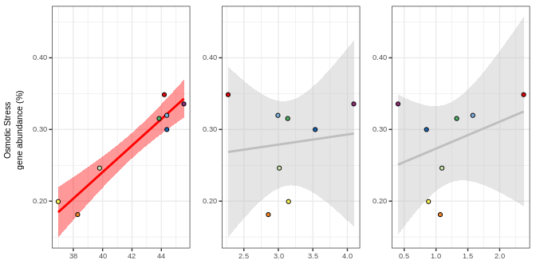
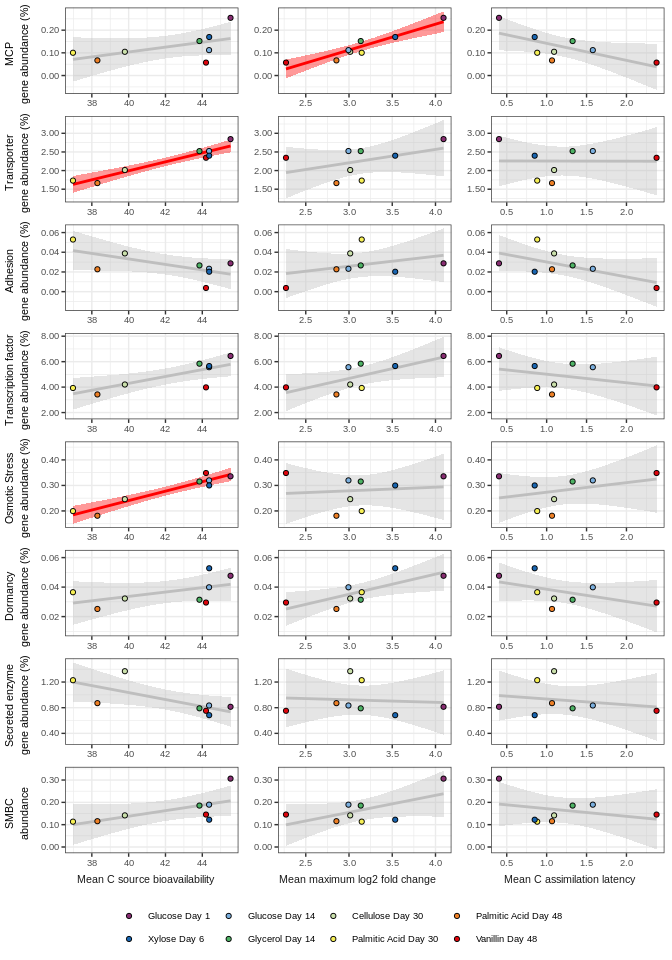

Testing relationships between genomic features and C acquisition and
growth characteristics in 13C-labeled contigs
================
Samuel Barnett
23 August, 2022

## Introduction

The goal of this study is to identify genes that may be indicative of
bacterial life history strategies identified in Barnett et al. (2021).
This analysis will take contigs that were enriched in the 13C-treatment
microcosms compared to the 12C-control microcosms. These enriched
contigs are putatively 13C labeled and therefore likely from an
organisms that actively took up the labeled substrate. I will look to
see if community level genomic investment in features that I predict are
indicative of life history strategies are correlated with C acquisition
and growth dynamics related to the C-S-R framework.

### Initialization

``` r
# Libraries
library(dplyr)
library(ggplot2)
library(grid)
library(gridExtra)
library(kableExtra)

# Legend extraction function
g_legend<-function(a.gplot){
  tmp <- ggplot_gtable(ggplot_build(a.gplot))
  leg <- which(sapply(tmp$grobs, function(x) x$name) == "guide-box")
  legend <- tmp$grobs[[leg]]
  return(legend)}

# Color scheme function from Paul Tol colors
source("/home/sam/new_repo/paul_tol_colors.R")

# Handy dataframes and lists including read depths and treatment name levels for ordering
read.depths = data.frame(Microcosm = c("Control_Day1", "Control_Day6", "Control_Day14", "Control_Day30", "Control_Day48",
                                       "Glucose_Day1", "Xylose_Day6", "Glucose_Day14", "Glycerol_Day14", 
                                       "Cellulose_Day30", "PalmiticAcid_Day30", "PalmiticAcid_Day48", "Vanillin_Day48"),
                         n_reads = c(600398782, 537771884, 778966874, 1279583274, 1326945180, 
                                     818866782, 750644734, 662897402, 685015110, 707180514, 632500566, 602121814, 548508008))

treat.read.depths = data.frame(Substrate = c("Glucose", "Xylose", "Glucose", "Glycerol", "Cellulose", "PalmiticAcid", "PalmiticAcid", "Vanillin"),
                               Day = c(1, 6, 14, 14, 30, 30, 48, 48),
                               n_reads = c(818866782, 750644734, 662897402, 685015110, 707180514, 632500566, 602121814, 548508008))

treatment_levels = c("Glucose Day 1", "Xylose Day 6", "Glucose Day 14", "Glycerol Day 14", 
                     "Cellulose Day 30", "Palmitic Acid Day 30", "Palmitic Acid Day 48", "Vanillin Day 48")

treatment.col = paultol_colors(8)
names(treatment.col) = treatment_levels
```

### Data import and merging

#### FullCyc1 C assimilation and growth dynamics data

``` r
# Dataframe for converting microcosm name into substrate and day
treat_conversions = data.frame(Sub = c("13C-Glu", "13C-Xyl", "13C-Gly", "13C-Cel", "13C-Pal", "13C-Van", "13C-Oxa", "13C-Lac", "13C-Ami"),
                               Substrate = c("Glucose", "Xylose", "Glycerol", "Cellulose", "PalmiticAcid", "Vanillin", "Oxalate", "Lactate", "AminoAcids"))

# FullCyc1 taxa
FullCyc1_taxa.df = read.table("/home/sam/FullCyc_metagenome/OTU_AC_characteristics.txt", sep="\t", header=TRUE) %>%
  select(OTU, Phylum, Class, Order, Family, Genus)

# Summarize the incorporators to the functional cluster level
incorp_list = c()
for (i in seq(54)){
  incorp_list[i] = paste("I", i, sep="")
}

FullCyc1_incorp.df = read.table("/home/sam/FullCyc_metagenome/OTU_AC_characteristics.txt", sep="\t", header=TRUE) %>%
  select(OTU, Substrate_incorp_on_day) %>%
  mutate(Substrate_incorp_on_day = as.character(Substrate_incorp_on_day)) %>%
  tidyr::separate(Substrate_incorp_on_day, into=incorp_list, sep=", ") %>%
  tidyr::gather(key="Incorp_I", value="Sub_D", -OTU) %>%
  filter(!(is.na(Sub_D))) %>%
  tidyr::separate(Sub_D, into=c("Sub", "Day"), sep="_D", remove=FALSE, convert=TRUE) %>%
  left_join(treat_conversions, by = "Sub") %>%
  select(OTU, Sub_D, Sub, Day, Substrate)

FullCyc1_incorp.sum = read.table("/home/sam/FullCyc_metagenome/OTU_AC_characteristics.txt", sep="\t", header=TRUE) %>%
  select(OTU, mean_immediacy, mean_bioA, n_Sub, maxl2fc) %>%
  left_join(FullCyc1_incorp.df, by="OTU") %>%
  group_by(Substrate, Day) %>%
  summarize(total_OTUs = n(),
            mean_immed = mean(mean_immediacy), 
            mean_bioA = mean(mean_bioA),
            mean_maxl2fc = mean(maxl2fc)) %>%
  ungroup
```

#### Assembled contigs and their coverages

First I’ll get all the contig coverages and match treatments and
controls

``` r
# Contig coverages generated for metabat
contig_cov.df = read.table("/home/sam/FullCyc_metagenome/binning_1000/metabat/FullCyc_1000_depths.txt",
                           header=TRUE, sep="\t", stringsAsFactors = FALSE) %>%
  mutate(Control_Day1 = Control_Day1_mapped.sorted.bam,
         Control_Day6 = Control_Day6_mapped.sorted.bam, 
         Control_Day14 = Control_Day14_mapped.sorted.bam,
         Control_Day30 = Control_Day30_mapped.sorted.bam, 
         Control_Day48 = Control_Day48_mapped.sorted.bam, 
         Glucose_Day1  = Glucose_Day1_mapped.sorted.bam, 
         Xylose_Day6 = Xylose_Day6_mapped.sorted.bam,
         Glucose_Day14 = Glucose_Day14_mapped.sorted.bam, 
         Glycerol_Day14 = Glycerol_Day14_mapped.sorted.bam,
         Cellulose_Day30 = Cellulose_Day30_mapped.sorted.bam, 
         PalmiticAcid_Day30 = PalmiticAcid_Day30_mapped.sorted.bam,
         PalmiticAcid_Day48 = PalmiticAcid_Day48_mapped.sorted.bam, 
         Vanillin_Day48 = Vanillin_Day48_mapped.sorted.bam) %>%
  select(contigName, Control_Day1, Control_Day6, Control_Day14, Control_Day30, Control_Day48, 
         Glucose_Day1, Xylose_Day6, Glucose_Day14, Glycerol_Day14, 
         Cellulose_Day30, PalmiticAcid_Day30, PalmiticAcid_Day48, Vanillin_Day48)

# Coverage in control samples
con_cov.df = contig_cov.df %>%
  select(contigName, Control_Day1, Control_Day6, Control_Day14, Control_Day30, Control_Day48) %>%
  tidyr::gather(key=Microcosm, value=Coverage, -contigName) %>%
  left_join(read.depths, by="Microcosm") %>%
  mutate(Control_coverage = (Coverage/n_reads)*500000000,
         Day = as.numeric(as.character(gsub("Control_Day", "", Microcosm)))) %>%
  select(contigName, Day, Control_coverage)

# Coverage in treatment samples
treat_cov.df = contig_cov.df %>%
  select(contigName, Glucose_Day1, Xylose_Day6, Glucose_Day14, Glycerol_Day14, 
         Cellulose_Day30, PalmiticAcid_Day30, PalmiticAcid_Day48, Vanillin_Day48) %>%
  tidyr::gather(key=Microcosm, value=Coverage, -contigName) %>%
  left_join(read.depths, by="Microcosm") %>%
  mutate(Treatment_coverage = (Coverage/n_reads)*500000000) %>%
  tidyr::separate(Microcosm, into=c("Substrate", "Day"), sep="_Day", convert=TRUE) %>%
  select(contigName, Substrate, Day, Treatment_coverage)

# Matching up treatment and control samples
contig_cov_diff.df = full_join(treat_cov.df, con_cov.df, by=c("contigName", "Day")) %>%
  filter(Treatment_coverage > 0 | Control_coverage > 0)

# Remove these giant files to save memory
contig_cov.df = NULL
treat_cov.df = NULL
con_cov.df = NULL
```

#### Isotopically enriched contigs

Now filter contigs to just those we propose are from labeled organisms
(over 5X coverage in treatments and 1.5 fold increase in coverage
between treatment and controls)

``` r
# Filter to just the enriched contigs
enr_contigs.df = contig_cov_diff.df %>%
  filter(Treatment_coverage > 5) %>%
  mutate(FC_cov = Treatment_coverage/Control_coverage) %>%
  filter(FC_cov > 1.5)

# Remove the full dataframe to save memory
contig_cov_diff.df = NULL

# Get counts of enriched contigs
enr_contigs.sum = enr_contigs.df %>%
  group_by(Substrate, Day) %>%
  summarize(n_contigs = n()) %>%
  as.data.frame %>%
  left_join(treat.read.depths, by = c("Substrate", "Day")) %>%
  mutate(treatment = factor(paste(gsub("Acid", " Acid", Substrate), "Day", Day, sep=" "), levels = treatment_levels),
         adj_n_contigs = (n_contigs/n_reads)*5000000)

print(paste("There are", length(unique(enr_contigs.df$contigName)), "enriched contigs in total"))
```

    ## [1] "There are 639258 enriched contigs in total"

#### Putatively labeled genes

Using the contig annotations from IMG I’ll pull out the genes from the
enriched contigs.

``` r
# Get table of gene annotations
annotation_tbl = read.table("/home/sam/FullCyc_metagenome/annotation/IMG/Ga0334612_product_names.tsv", 
                            sep="\t", quote="", header=FALSE, stringsAsFactors = FALSE) %>%
  rename(geneID = V1, product = V2, prod_group = V3) %>%
  #filter(product != "hypothetical protein") %>%
  tidyr::separate(geneID, into=c("Project", "Scaffold", "start", "end"), sep="_", remove=FALSE) %>%
  mutate(Scaffold = paste(Project, Scaffold, sep="_")) %>%
  select(-Project)

# Get mapping of contigs to IMG contig names
contigs.df = read.table("/home/sam/FullCyc_metagenome/annotation/IMG/Ga0334612_contig_names_mapping.tsv", sep="\t", header=FALSE, stringsAsFactors = FALSE) %>%
  rename(contigName = V1, Scaffold = V2) %>%
  filter(Scaffold %in% unique(annotation_tbl$Scaffold))

annotation.df = full_join(contigs.df, annotation_tbl, by = "Scaffold")
annotation_tbl = NULL
contigs.df = NULL

# Match genes to enriched contigs and remove genes that are not proteins
enr_genes.df = inner_join(annotation.df, enr_contigs.df, by="contigName") %>%
  filter(!(prod_group %in% c("tRNA", "tmRNA", "ncRNA", "rRNA_5S", "rRNA_16S", "rRNA_23S", "rRNA_18S", "rRNA_28S")))
annotation.df = NULL
enr_contigs.df = NULL
```

How many genes are labeled from each treatment?

``` r
# Summarize enriched genes
enr_genes.sum = enr_genes.df %>%
  group_by(Substrate, Day) %>%
  summarize(n_genes = n()) %>%
  as.data.frame %>%
  left_join(treat.read.depths, by = c("Substrate", "Day")) %>%
  mutate(treatment = factor(paste(gsub("Acid", " Acid", Substrate), "Day", Day, sep=" "), levels = treatment_levels),
         adj_n_genes = (n_genes/n_reads)) %>%
  mutate(text_y = ifelse(treatment %in% c("Glucose Day 1", "Xylose Day 6", "Glucose Day 14", "Glycerol Day 14"),
                         adj_n_genes, 0))

print(paste("Total enriched genes =", length(unique(enr_genes.df$geneID))))
```

    ## [1] "Total enriched genes = 1530959"

``` r
for (treat in enr_genes.sum$treatment){
  print(paste(treat, "enriched genes =", unique(enr_genes.sum[enr_genes.sum$treatment == treat,]$n_genes)))
}
```

    ## [1] "Cellulose Day 30 enriched genes = 517605"
    ## [1] "Glucose Day 1 enriched genes = 163576"
    ## [1] "Glucose Day 14 enriched genes = 288427"
    ## [1] "Glycerol Day 14 enriched genes = 229010"
    ## [1] "Palmitic Acid Day 30 enriched genes = 481889"
    ## [1] "Palmitic Acid Day 48 enriched genes = 405061"
    ## [1] "Vanillin Day 48 enriched genes = 294641"
    ## [1] "Xylose Day 6 enriched genes = 113708"

``` r
# Is there a correlation between number of enriched genes and the number of incorporators
PCA_enr_genes.sum = inner_join(FullCyc1_incorp.sum, enr_genes.sum, by = c("Substrate", "Day"))
cor.test(PCA_enr_genes.sum$total_OTUs, PCA_enr_genes.sum$adj_n_genes)
```

    ## 
    ##  Pearson's product-moment correlation
    ## 
    ## data:  PCA_enr_genes.sum$total_OTUs and PCA_enr_genes.sum$adj_n_genes
    ## t = 3.206, df = 6, p-value = 0.01846
    ## alternative hypothesis: true correlation is not equal to 0
    ## 95 percent confidence interval:
    ##  0.2043990 0.9611176
    ## sample estimates:
    ##       cor 
    ## 0.7946194

``` r
# Gene correlation
OTU_enr_genes.cor = cor.test(PCA_enr_genes.sum$total_OTUs, PCA_enr_genes.sum$adj_n_genes)
OTU_enr_genes.cor
```

    ## 
    ##  Pearson's product-moment correlation
    ## 
    ## data:  PCA_enr_genes.sum$total_OTUs and PCA_enr_genes.sum$adj_n_genes
    ## t = 3.206, df = 6, p-value = 0.01846
    ## alternative hypothesis: true correlation is not equal to 0
    ## 95 percent confidence interval:
    ##  0.2043990 0.9611176
    ## sample estimates:
    ##       cor 
    ## 0.7946194

``` r
OTU_enr_genes.cor.lab = paste("r = ", round(OTU_enr_genes.cor$estimate, digits = 3),
                                "\np = ", round(OTU_enr_genes.cor$p.value, digits = 3))

# Plot
enr_genes_bydepth.plot = ggplot(data=enr_genes.sum, aes(x=treatment, y=adj_n_genes)) +
  geom_bar(stat="identity", color="black", fill="grey90") + 
  geom_text(aes(label=paste(" ", n_genes, sep=""), y=text_y), angle=90, color="black", hjust=0, size=(5*5/14)) + 
  labs(x="Treatment", y=expression(atop(NA,atop(NA, atop("Adj. gene count in", " "^{13}*"C-labeled contigs"))))) +
  scale_y_continuous(labels = function(x) format(x, scientific = TRUE), limits = c(0,1E-3)) +
  theme_bw() +
  theme(axis.text = element_text(size=5),
        axis.title = element_text(size=6),
        axis.text.x = element_text(angle=45, hjust=1),
        axis.title.y = element_text(size=10, margin = margin(l = -18)),
        axis.ticks = element_line(size=0.2),
        legend.position = "none")

OTU_enr_genes.plot = ggplot(data=PCA_enr_genes.sum, aes(x=total_OTUs, y=adj_n_genes)) +
  geom_smooth(method='lm', formula = y~x, se = TRUE, color="red", fill="red", size=0.5) +
  geom_point(aes(fill=treatment), size=1.5, shape=21) +
  labs(x=expression("Number of "^{13}*"C-labeled OTUs")) +
  lims(y=c(0,1E-3)) +
  scale_fill_manual(values=treatment.col) +
  theme_bw() +
  theme(axis.text = element_text(size=5),
        axis.title = element_text(size=6),
        axis.title.y = element_blank(),
        axis.text.y = element_blank(),
        axis.title.x = element_text(margin = margin(t = -55)),
        plot.margin=unit(c(2,2,2,4),"mm"),
        axis.ticks = element_line(size=0.2),
        legend.text = element_text(size=5, margin = margin(l=-7)),
        legend.title = element_blank(),
        legend.position = "bottom",
        legend.margin = margin(0,4,2,2, "mm"))

treatment.leg = g_legend(OTU_enr_genes.plot)

comb_OTU_enr_genes.plot = cowplot::plot_grid(enr_genes_bydepth.plot, OTU_enr_genes.plot + theme(legend.position = "none"),
                                             ncol=2, labels = c("a", "b"), align="h",
                                             rel_widths = c(1, 0.9), label_size=7, label_fontface="bold")
comb_OTU_enr_genes.plot = cowplot::plot_grid(comb_OTU_enr_genes.plot, treatment.leg, nrow=2, rel_heights = c(1, 0.22))
comb_OTU_enr_genes.plot
```

<!-- -->

``` r
ggsave(comb_OTU_enr_genes.plot, filename = "/home/sam/FullCyc_metagenome/figs4publication/FigS3.tiff", 
       device = "tiff", width = 3.46457, height = 2, units = "in")
```

#### Gene taxonomy

Now lets look at the taxonomy of the labeled genes

``` r
# import taxonomy annotations and match to putatively labeled genes
enr_gene_tax.df = read.table("/home/sam/FullCyc_metagenome/annotation/IMG/Ga0334612_gene_phylogeny.tsv", 
           sep="\t", quote="", header=FALSE, stringsAsFactors = FALSE) %>%
  rename(geneID = V1, Taxonomy = V5) %>%
  right_join(enr_genes.df, by="geneID") %>%
  tidyr::separate(Taxonomy, into=c("Domain", "Phylum", "Class", "Order", "Family", "Genus", "Species", "Strain"), sep=";")

# Summarize for each treatment and phylum
enr_gene_tax.sum = enr_gene_tax.df %>%
  mutate(Domain = ifelse(is.na(Domain), "Unclassified", Domain)) %>%
  mutate(taxa = ifelse(Domain == "Bacteria", Phylum, Domain)) %>%
  group_by(Substrate, Day) %>%
  mutate(total_genes = n()) %>%
  ungroup %>%
  group_by(taxa, Substrate, Day, total_genes) %>%
  summarize(n_genes = n()) %>%
  as.data.frame %>%
  mutate(taxa_perc = (n_genes/total_genes)*100,
         treatment = factor(paste(gsub("Acid", " Acid", Substrate), "Day", Day, sep=" "), levels = treatment_levels))

enr_gene_tax.sum.filt = enr_gene_tax.sum %>%
  group_by(taxa) %>%
  mutate(max_perc = max(taxa_perc)) %>%
  ungroup %>%
  mutate(filt_taxa = ifelse(max_perc < 0.1, "Less than 0.1%", taxa)) %>%
  group_by(treatment, filt_taxa, total_genes) %>%
  summarize(n_genes = sum(n_genes)) %>%
  as.data.frame %>%
  mutate(taxa_perc = (n_genes/total_genes)*100)
```

Now plot gene taxonomy with incorporator taxonomy

``` r
# Summarize bacterial phyla for each treatment
bact_enr_gene_tax.sum = enr_gene_tax.df %>%
  filter(!(is.na(Phylum)), Domain == "Bacteria") %>%
  group_by(Substrate, Day) %>%
  mutate(total_genes = n()) %>%
  ungroup %>%
  group_by(Phylum, Substrate, Day, total_genes) %>%
  summarize(n_genes = n()) %>%
  as.data.frame %>%
  mutate(Phylum_perc = (n_genes/total_genes)*100,
         treatment = factor(paste(gsub("Acid", " Acid", Substrate), "Day", Day, sep=" "), levels = treatment_levels)) %>%
  group_by(Phylum) %>%
  mutate(max_perc = max(Phylum_perc)) %>%
  ungroup %>%
  mutate(Taxa = ifelse(max_perc < 0.1, 
                       ifelse(Phylum %in% unique(FullCyc1_taxa.df$Phylum), Phylum, "Less than 0.1%"), 
                       Phylum)) %>%
  group_by(treatment, Taxa, total_genes) %>%
  summarize(n_genes = sum(n_genes)) %>%
  as.data.frame %>%
  mutate(taxa_perc = (n_genes/total_genes)*100)

incorp_tax.sum = FullCyc1_taxa.df %>%
  mutate(Phylum = as.character(Phylum)) %>%
  mutate(Phylum = ifelse(Phylum == "Candidate_division_WS3", "Latescibacteria", Phylum)) %>%
  left_join(FullCyc1_incorp.df, by="OTU") %>%
  group_by(Substrate, Day) %>%
  mutate(total_incorp = n()) %>%
  ungroup %>%
  group_by(Phylum, Substrate, Day, total_incorp) %>%
  summarize(n_incorp = n()) %>%
  as.data.frame %>%
  mutate(Phylum_perc = (n_incorp/total_incorp)*100,
         treatment = factor(paste(gsub("Acid", " Acid", Substrate), "Day", Day, sep=" "), levels = treatment_levels)) %>%
  filter(treatment %in% treatment_levels) %>%
  group_by(Phylum) %>%
  mutate(max_perc = max(Phylum_perc)) %>%
  ungroup %>%
  mutate(Taxa = ifelse(max_perc < 0.1, "Less than 0.1%", Phylum)) %>%
  group_by(treatment, Taxa, total_incorp) %>%
  summarize(n_incorp = sum(n_incorp)) %>%
  as.data.frame %>%
  mutate(taxa_perc = (n_incorp/total_incorp)*100)

Taxa.list = unique(c(unique(incorp_tax.sum$Taxa), unique(bact_enr_gene_tax.sum$Taxa)))
Taxa.col = c(paultol_colors(length(Taxa.list[Taxa.list != "Less than 0.1%"])), "#777777")
names(Taxa.col) = c(Taxa.list[Taxa.list != "Less than 0.1%"], "Less than 0.1%")

comb_lab_tax.sum = rbind(mutate(select(bact_enr_gene_tax.sum, treatment, Taxa, taxa_perc), data_type = "Genes"), 
                         mutate(select(incorp_tax.sum, treatment, Taxa, taxa_perc), data_type = "OTUs")) %>%
  mutate(Treat_type = paste(treatment, data_type)) %>%
  arrange(treatment, data_type)

comb_lab_tax.sum$Treat_type = factor(comb_lab_tax.sum$Treat_type, levels = unique(comb_lab_tax.sum$Treat_type))
comb_lab_tax.sum$Taxa = factor(comb_lab_tax.sum$Taxa, levels = names(Taxa.col))


comb_bact_enr_gene_tax.plot= ggplot(comb_lab_tax.sum, aes(x=data_type, y=taxa_perc, fill=Taxa)) +
  geom_bar(stat = "identity") +
  geom_vline(xintercept=c(0.5, 2.5, 4.5, 6.5, 8.5, 10.5, 12.5, 14.5, 16.5), size=1) +
  scale_fill_manual(values=Taxa.col) +
  labs(x="Data from which taxonomy is determined", y=expression(atop(NA, atop("Percentage of taxonomically annotated genes from "^{13}*"C-labeled contigs",
                                                                              "or percentage of "^{13}*"C-labeled OTUs"))), fill="Phylum") +
  theme_bw() +
  theme(axis.text.x = element_text(angle=45, hjust=1),
        axis.title.y = element_text(size=15, margin = margin(l = -10))) +
  guides(fill=guide_legend(ncol=1)) +
  facet_wrap(~treatment)

comb_bact_enr_gene_tax.plot
```

<!-- -->

``` r
ggsave(comb_bact_enr_gene_tax.plot, filename = "/home/sam/FullCyc_metagenome/figs4publication/FigS4.tiff", 
       device = "tiff", width = 7, height = 7, units = "in")
```

# Compare features to assimilation characteristics

``` r
library(grid)
library(gridExtra)
compare_features <- function(feature, feat.df, depths.df, treat.levels, ACchar.df){
  char_feat.sum = feat.df %>%
    group_by(Substrate, Day) %>%
    summarize(n_genes = n(),
              total_genes = mean(total_genes)) %>%
    as.data.frame %>%
    left_join(depths.df, by = c("Substrate", "Day")) %>%
    mutate(treatment = factor(paste(gsub("Acid", " Acid", Substrate), "Day", Day, sep=" "), levels = treat.levels),
           perc_feat = n_genes/total_genes*100,
           feature = feature) %>%
    left_join(ACchar.df, by = c("Substrate", "Day"))
  
  bioA_enr_feat.cor = cor.test(char_feat.sum$perc_feat, char_feat.sum$mean_bioA)
  maxl2fc_enr_feat.cor = cor.test(char_feat.sum$perc_feat, char_feat.sum$mean_maxl2fc)
  immed_enr_feat.cor = cor.test(char_feat.sum$perc_feat, char_feat.sum$mean_immed)
  
  char_feat_cor.df = data.frame(feature = feature,
                                AC_character = c("bioA", "maxl2fc", "immed"),
                                pear_r = c(bioA_enr_feat.cor$estimate, maxl2fc_enr_feat.cor$estimate, immed_enr_feat.cor$estimate),
                                t_stat = c(bioA_enr_feat.cor$statistic, maxl2fc_enr_feat.cor$statistic, immed_enr_feat.cor$statistic),
                                df = c(bioA_enr_feat.cor$parameter, maxl2fc_enr_feat.cor$parameter, immed_enr_feat.cor$parameter),
                                pvalue = c(bioA_enr_feat.cor$p.value, maxl2fc_enr_feat.cor$p.value, immed_enr_feat.cor$p.value)) %>%
    mutate(adj_pvalue = p.adjust(pvalue, method = "BH", n = 8))
  
  out_list = list("table" = char_feat.sum, "correlation" = char_feat_cor.df)
  return(out_list)
}

make_feature_plots <- function(char_feat.sum, char_feat_cor.df, pvcutoff, y_axis, usetheme=master_theme, colorpal){
  bioA.plot = ggplot(data=char_feat.sum, aes(x=mean_bioA, y=perc_feat, fill=treatment)) +
    geom_smooth(method="lm", color=ifelse(filter(char_feat_cor.df, AC_character == "bioA")$adj_pvalue < pvcutoff, "red", "grey"),
                fill=ifelse(filter(char_feat_cor.df, AC_character == "bioA")$adj_pvalue < pvcutoff, "red", "grey")) +
    geom_point(shape=21, size=1.5) +
    scale_fill_manual(values=colorpal) +
    usetheme
  
  maxl2fc.plot = ggplot(data=char_feat.sum, aes(x=mean_maxl2fc, y=perc_feat, fill=treatment)) +
    geom_smooth(method="lm", color=ifelse(filter(char_feat_cor.df, AC_character == "maxl2fc")$adj_pvalue < pvcutoff, "red", "grey"),
                fill=ifelse(filter(char_feat_cor.df, AC_character == "maxl2fc")$adj_pvalue < pvcutoff, "red", "grey")) +
    geom_point(shape=21, size=1.5) +
    scale_fill_manual(values=colorpal) +
    usetheme
  
  immed.plot = ggplot(data=char_feat.sum, aes(x=mean_immed, y=perc_feat, fill=treatment)) +
    geom_smooth(method="lm", color=ifelse(filter(char_feat_cor.df, AC_character == "immed")$adj_pvalue < pvcutoff, "red", "grey"),
                fill=ifelse(filter(char_feat_cor.df, AC_character == "immed")$adj_pvalue < pvcutoff, "red", "grey")) +
    geom_point(shape=21, size=1.5) +
    scale_fill_manual(values=colorpal) +
    usetheme
  
  # make limits the same across
  scaleFUN <- function(x) sprintf("%.2f", x)
  ylim.list = c(ggplot_build(bioA.plot)$layout$panel_scales_y[[1]]$range$range,
                ggplot_build(maxl2fc.plot)$layout$panel_scales_y[[1]]$range$range,
                ggplot_build(immed.plot)$layout$panel_scales_y[[1]]$range$range)
  add_lims = scale_y_continuous(labels=scaleFUN, limits = c(min(ylim.list), max(ylim.list)))

  y.grob <- textGrob(y_axis, gp=gpar(fontsize=8), rot=90)

  comb.plot = grid.arrange(arrangeGrob(cowplot::plot_grid(bioA.plot + add_lims, 
                                                          maxl2fc.plot + add_lims, 
                                                          immed.plot + add_lims, 
                                                          nrow=1, align = "h"),  left=y.grob))
  return(comb.plot)
  
}

master_theme = theme_bw() + 
  theme(axis.text = element_text(size=7),
        axis.title = element_blank(),
        legend.position = "none",
        plot.margin = margin(2,2,0,2, unit="mm"))

treatment.col = paultol_colors(8)
names(treatment.col) = treatment_levels
```

## Chemotaxis

``` r
# Filter genes that are annotated as motility
enr_chemotax.df = enr_genes.df %>%
  group_by(Substrate, Day) %>%
  mutate(total_genes = n()) %>%
  ungroup %>%
  mutate(product_lower = tolower(product)) %>%
  filter(grepl("methyl-accepting chemotaxis protein", product_lower))

# Run correlations and make initial plots
chemotax_comps_out.list = compare_features("Methyl-accepting chemotaxis proteins", enr_chemotax.df, treat.read.depths, treatment_levels, FullCyc1_incorp.sum)
chemotax_comps_out.list[["correlation"]]
```

    ##                                feature AC_character     pear_r    t_stat df
    ## 1 Methyl-accepting chemotaxis proteins         bioA  0.5532406  1.626797  6
    ## 2 Methyl-accepting chemotaxis proteins      maxl2fc  0.9383718  6.650317  6
    ## 3 Methyl-accepting chemotaxis proteins        immed -0.6916936 -2.346050  6
    ##         pvalue  adj_pvalue
    ## 1 0.1549046228 0.413078994
    ## 2 0.0005584509 0.004467607
    ## 3 0.0573673773 0.229469509

``` r
chemotax_full.plot = make_feature_plots(chemotax_comps_out.list[["table"]], chemotax_comps_out.list[["correlation"]], 0.05, "MCP\ngene abundance (%)", master_theme, treatment.col)
```

<!-- -->

## Transport proteins

Lets see what membrane transport proteins there are. For this analysis,
I will look for gene products with “transporter”, “channel”,
“exchanger”, “symporter”, “antiporter”, “ATPase”, or “pump” in the
name and filter these by those with a predicted transmembrane helix.

``` r
# Get the dataframe of genes with a transmembrane domain
transmembrane.df = read.table("/home/sam/FullCyc_metagenome/annotation/transmembrane/TMHMM_table_10_20_20.txt", sep="\t", header=TRUE) %>%
  filter(geneID %in% enr_genes.df$geneID)

# Filter genes that are annotated as as possible transporters
#transport_grep_str = "transporter|channel|exchanger|symporter|antiporter|atpase|pump"
transport_grep_str = "transporter|channel|exchanger|symporter|antiporter|exporter|importer|ATPase|pump"


enr_transport.df = enr_genes.df %>%
  group_by(Substrate, Day) %>%
  mutate(total_genes = n()) %>%
  ungroup %>%
  filter(grepl(transport_grep_str, product)) %>%
  inner_join(transmembrane.df, by="geneID")

# Run correlations and make initial plots
transport_comps_out.list = compare_features("transporter genes", enr_transport.df, treat.read.depths, treatment_levels, FullCyc1_incorp.sum)
transport_comps_out.list[["correlation"]]
```

    ##             feature AC_character      pear_r      t_stat df       pvalue
    ## 1 transporter genes         bioA  0.95508017  7.89430920  6 0.0002190316
    ## 2 transporter genes      maxl2fc  0.45665336  1.25731959  6 0.2553619520
    ## 3 transporter genes        immed -0.00575428 -0.01409528  6 0.9892109639
    ##    adj_pvalue
    ## 1 0.001752253
    ## 2 1.000000000
    ## 3 1.000000000

``` r
transport_full.plot = make_feature_plots(transport_comps_out.list[["table"]], transport_comps_out.list[["correlation"]], 0.05, "Transporter\ngene abundance (%)", master_theme, treatment.col)
```

<!-- -->

## Adhesion proteins

``` r
# Filter genes that are annotated as as possible adhesion
adhesion_products = c("holdfast attachment protein HfaA", "curli production assembly/transport component CsgG/holdfast attachment protein HfaB",
                      "adhesin/invasin", "fibronectin-binding autotransporter adhesin", "surface adhesion protein", "autotransporter adhesin",
                      "adhesin HecA-like repeat protein", "ABC-type Zn2+ transport system substrate-binding protein/surface adhesin",
                      "large exoprotein involved in heme utilization and adhesion", "Tfp pilus tip-associated adhesin PilY1", 
                      "type V secretory pathway adhesin AidA")

enr_adhesion.df = enr_genes.df %>%
  group_by(Substrate, Day) %>%
  mutate(total_genes = n()) %>%
  ungroup %>%
  mutate(product_lower = tolower(product)) %>%
  filter(product %in% adhesion_products)

# Run correlations and make initial plots
adhesion_comps_out.list = compare_features("adhesion genes", enr_adhesion.df, treat.read.depths, treatment_levels, FullCyc1_incorp.sum)
adhesion_comps_out.list[["correlation"]]
```

    ##          feature AC_character     pear_r     t_stat df     pvalue adj_pvalue
    ## 1 adhesion genes         bioA -0.6422926 -2.0526708  6 0.08592375  0.3954351
    ## 2 adhesion genes      maxl2fc  0.3732166  0.9853905  6 0.36248536  0.9666276
    ## 3 adhesion genes        immed -0.6231104 -1.9514593  6 0.09885876  0.3954351

``` r
adhesion_full.plot = make_feature_plots(adhesion_comps_out.list[["table"]], adhesion_comps_out.list[["correlation"]], 0.05, "Adhesion\ngene abundance (%)", master_theme, treatment.col)
```

<!-- -->

## Transcription factors

``` r
# Filter genes that are annotated as as possible transfact
transfact_grep_str = "transcriptional regulator|transcriptional repressor|transcriptional activator|transcription factor|transcriptional regulation|transcription regulator|transcriptional.*regulator"

TF.df = read.table("/home/sam/FullCyc_metagenome/annotation/deepTfactor/deepTfactor_output/Ga0334612_proteins.TFs/prediction_result.txt", 
                   sep="\t", header=TRUE, stringsAsFactors = FALSE) %>%
  filter(prediction == "True") %>%
  filter(sequence_ID %in% unique(enr_genes.df$geneID))

enr_transfact.df = enr_genes.df %>%
  group_by(Substrate, Day) %>%
  mutate(total_genes = n()) %>%
  ungroup %>%
  mutate(product_lower = tolower(product)) %>%
  filter(grepl(transfact_grep_str, product_lower) | geneID %in% TF.df$sequence_ID)

# Run correlations and make initial plots
transfact_comps_out.list = compare_features("transcription factor genes", enr_transfact.df, treat.read.depths, treatment_levels, FullCyc1_incorp.sum)
transfact_comps_out.list[["correlation"]]
```

    ##                      feature AC_character     pear_r     t_stat df     pvalue
    ## 1 transcription factor genes         bioA  0.7953248  3.2137793  6 0.01827979
    ## 2 transcription factor genes      maxl2fc  0.7226094  2.5605894  6 0.04287465
    ## 3 transcription factor genes        immed -0.3546335 -0.9290547  6 0.38870930
    ##   adj_pvalue
    ## 1  0.1462383
    ## 2  0.1714986
    ## 3  1.0000000

``` r
transfact_full.plot = make_feature_plots(transfact_comps_out.list[["table"]], transfact_comps_out.list[["correlation"]], 0.05, "Transcription factor\ngene abundance (%)", master_theme, treatment.col)
```

<!-- -->

## Osmotic stress

``` r
# Filter genes that are annotated as as possible osmostress
osmostress_grep_str = "osmoregulated|osmoprotectant|osmotically-inducible|osmo-dependent|osmolarity sensor|ompr|l-ectoine synthase"

enr_osmostress.df = enr_genes.df %>%
  group_by(Substrate, Day) %>%
  mutate(total_genes = n()) %>%
  ungroup %>%
  mutate(product_lower = tolower(product)) %>%
  filter(grepl(osmostress_grep_str, product_lower))

# Run correlations and make initial plots
osmostress_comps_out.list = compare_features("osmotic stress genes", enr_osmostress.df, treat.read.depths, treatment_levels, FullCyc1_incorp.sum)
osmostress_comps_out.list[["correlation"]]
```

    ##                feature AC_character    pear_r    t_stat df       pvalue
    ## 1 osmotic stress genes         bioA 0.9542183 7.8143173  6 0.0002317299
    ## 2 osmotic stress genes      maxl2fc 0.1164460 0.2871870  6 0.7836294180
    ## 3 osmotic stress genes        immed 0.3470627 0.9064709  6 0.3996249185
    ##    adj_pvalue
    ## 1 0.001853839
    ## 2 1.000000000
    ## 3 1.000000000

``` r
osmostress_full.plot = make_feature_plots(osmostress_comps_out.list[["table"]], osmostress_comps_out.list[["correlation"]], 0.05, "Osmotic Stress\ngene abundance (%)", master_theme, treatment.col)
```

<!-- -->

## Dormancy genes

How about other dormancy genes (endospores, toxin-antitoxin,
resuscitation)

``` r
# Filter genes that are annotated as as possible spore
#spore_grep_str = "Spo0A|spore protease"
resuscitation = "RpfC"
tox_antitox = "HipA|HipB|mRNA interferase MazF|antitoxin MazE|MazEF|RelB|RelE|RelBE|DinJ|YafQ"

enr_dorm.df = enr_genes.df %>%
  group_by(Substrate, Day) %>%
  mutate(total_genes = n()) %>%
  ungroup %>%
  filter(grepl(tox_antitox, product) | grepl(resuscitation, product))

# Run correlations and make initial plots
dorm_comps_out.list = compare_features("dormancy genes", enr_dorm.df, treat.read.depths, treatment_levels, FullCyc1_incorp.sum)
dorm_comps_out.list[["correlation"]]
```

    ##          feature AC_character     pear_r    t_stat df     pvalue adj_pvalue
    ## 1 dormancy genes         bioA  0.5173910  1.480976  6 0.18911608  0.5043095
    ## 2 dormancy genes      maxl2fc  0.7634287  2.895237  6 0.02750487  0.2200390
    ## 3 dormancy genes        immed -0.5205303 -1.493288  6 0.18597351  0.5043095

``` r
dorm_full.plot = make_feature_plots(dorm_comps_out.list[["table"]], dorm_comps_out.list[["correlation"]], 0.05, "Dormancy\ngene abundance (%)", master_theme, treatment.col)
```

<!-- -->

## Secreted proteins

I used SignalP to predict which genes were bound for secretion. Now lets
look at the proportion of enriched genes that are secreted.

``` r
# Import both gram + and gram - predictions
gram_neg_signalp.df = read.table("/home/sam/FullCyc_metagenome/annotation/signalp_annotation/Ga0334612_proteins_gram_neg_summary.signalp5", 
                            sep="\t", quote="", header=TRUE, stringsAsFactors = FALSE, comment.char = "") %>%
  filter(Prediction != "OTHER") %>%
  rename(geneID = X..ID) %>%
  tidyr::separate(geneID, into=c("Project", "Scaffold", "start", "end"), sep="_", remove=FALSE) %>%
  mutate(Scaffold = paste(Project, Scaffold, sep="_")) %>%
  select(geneID, Scaffold, Prediction) %>%
  rename(gramNEG_prediction = Prediction)
  
gram_pos_signalp.df = read.table("/home/sam/FullCyc_metagenome/annotation/signalp_annotation/Ga0334612_proteins_gram_pos_summary.signalp5", 
                            sep="\t", quote="", header=TRUE, stringsAsFactors = FALSE, comment.char = "") %>%
  filter(Prediction != "OTHER") %>%
  rename(geneID = X..ID) %>%
  tidyr::separate(geneID, into=c("Project", "Scaffold", "start", "end"), sep="_", remove=FALSE) %>%
  mutate(Scaffold = paste(Project, Scaffold, sep="_")) %>%
  select(geneID, Scaffold, Prediction) %>%
  rename(gramPOS_prediction = Prediction)

# Merge them together and select prediction based on taxonomy
output_signalp.df = full_join(gram_neg_signalp.df, gram_pos_signalp.df, by=c("geneID", "Scaffold")) %>%
  left_join(unique(select(enr_gene_tax.df, geneID, Phylum)), by="geneID") %>%
  mutate(predictions = ifelse(Phylum %in% c("Firmicutes", "Actinobacteria"), gramPOS_prediction, gramNEG_prediction)) %>%
  filter(!(is.na(predictions)))


# Clean up environment a bit
gram_neg_signalp.df = NULL
gram_pos_signalp.df = NULL
```

``` r
"https://advances.sciencemag.org/content/6/16/eaaz4354?intcmp=trendmd-adv"
```

    ## [1] "https://advances.sciencemag.org/content/6/16/eaaz4354?intcmp=trendmd-adv"

``` r
signalp_proteases.df = read.table("/home/sam/FullCyc_metagenome/annotation/secreted_protein_annotations/secreted_proteases.txt", sep="\t", stringsAsFactors = FALSE)
colnames(signalp_proteases.df) = c("Query", "Target", "perc_ident", "align_length", "n_mismatch", "n_gaps", 
                                "query_start", "query_end", "target_start", "target_end", "E_value", "bit_score")
signalp_proteases.sum = signalp_proteases.df %>%
  group_by(Query) %>%
  summarize(n_match = n(),
            max_perc_ident = max(perc_ident),
            min_perc_ident = min(perc_ident))

signalp_CAZymes.df = read.table("/home/sam/FullCyc_metagenome/annotation/secreted_protein_annotations/secreted_CAZymes.out.dm.ps.stringent", 
                                sep="\t", stringsAsFactors = FALSE)
colnames(signalp_CAZymes.df) = c("Target", "target_length", "Query", "query_length", "E_value", "V6", "V7", "V8", "V9", "V10")
signalp_CAZymes.sum = signalp_CAZymes.df %>%
  group_by(Query, Target) %>%
  summarize(n_match = n(),
            max_E_value = max(E_value),
            min_E_value = min(E_value)) %>%
  filter(grepl("GH|PL|CE", Target))

signalp_ABhydro.df = read.table("/home/sam/FullCyc_metagenome/annotation/secreted_protein_annotations/secreted_ABhydro.out.dm.ps.stringent", 
                                sep="\t", stringsAsFactors = FALSE)
colnames(signalp_ABhydro.df) = c("Target", "target_length", "Query", "query_length", "E_value", "V6", "V7", "V8", "V9", "V10")
signalp_ABhydro.sum = signalp_ABhydro.df %>%
  group_by(Query, Target) %>%
  summarize(n_match = n(),
            max_E_value = max(E_value),
            min_E_value = min(E_value))


enr_signalp.df = left_join(enr_genes.df, output_signalp.df, by = c("Scaffold", "geneID")) %>%
  group_by(Substrate, Day) %>%
  mutate(total_genes = n()) %>%
  ungroup %>%
  mutate(protease = ifelse(geneID %in% signalp_proteases.sum$Query, "Yes", "No"),
         CAZy = ifelse(geneID %in% signalp_CAZymes.sum$Query, "Yes", "No"),
         ABhydro = ifelse(geneID %in% signalp_ABhydro.sum$Query, "Yes", "No")) %>%
  filter(!(is.na(predictions)),
         protease == "Yes" | CAZy == "Yes" | ABhydro == "Yes")

# Run correlations and make initial plots
signalp_comps_out.list = compare_features("secreted protein genes", enr_signalp.df, treat.read.depths, treatment_levels, FullCyc1_incorp.sum)
signalp_comps_out.list[["correlation"]]
```

    ##                  feature AC_character      pear_r     t_stat df     pvalue
    ## 1 secreted protein genes         bioA -0.72970997 -2.6141124  6 0.03989982
    ## 2 secreted protein genes      maxl2fc -0.08362678 -0.2055630  6 0.84392930
    ## 3 secreted protein genes        immed -0.21715370 -0.5449189  6 0.60545579
    ##   adj_pvalue
    ## 1  0.3191986
    ## 2  1.0000000
    ## 3  1.0000000

``` r
signalp_full.plot = make_feature_plots(signalp_comps_out.list[["table"]], signalp_comps_out.list[["correlation"]], 0.05, "Secreted enzyme\ngene abundance (%)", master_theme, treatment.col)
```

<!-- -->

``` r
signalp_full.plot
```

    ## TableGrob (1 x 1) "arrange": 1 grobs
    ##   z     cells    name            grob
    ## 1 1 (1-1,1-1) arrange gtable[arrange]

## SMBCs

I used antismash to predict secondary metabolite gene clusters. Now lets
see if they correspond to life history strategy

``` r
# Import both antismash regions
antismash.df = read.table("/home/sam/FullCyc_metagenome/annotation/antismash/antismash_BCGtable.tsv", header=TRUE, sep="\t") %>%
  rename(smbc_product = product)
```

``` r
# Filter genes that are annotated as for possible secretion
enr_SMBC.df = left_join(enr_genes.df, antismash.df, by="Scaffold") %>%
  group_by(Substrate, Day) %>%
  mutate(total_genes = n()) %>%
  ungroup %>%
  filter(!(is.na(smbc_product))) %>%
  select(Substrate, Day, contigName, smbc_product, total_genes) %>%
  unique

# Run correlations and make initial plots
SMBC_comps_out.list = compare_features("SMBCs", enr_SMBC.df, treat.read.depths, treatment_levels, FullCyc1_incorp.sum)
SMBC_comps_out.list[["correlation"]]
```

    ##   feature AC_character     pear_r     t_stat df     pvalue adj_pvalue
    ## 1   SMBCs         bioA  0.6394014  2.0370163  6 0.08780644  0.3875281
    ## 2   SMBCs      maxl2fc  0.6259440  1.9660291  6 0.09688203  0.3875281
    ## 3   SMBCs        immed -0.3153002 -0.8138367  6 0.44682528  1.0000000

``` r
SMBC_full.plot = make_feature_plots(SMBC_comps_out.list[["table"]], SMBC_comps_out.list[["correlation"]], 0.05, "SMBC\nabundance", master_theme, treatment.col)
```

<!-- -->

## Combine all plots

``` r
label.df = data.frame(label = factor(c("Mean C source bioavailability", "Mean maximum log2 fold change", "Mean C assimilation latency"),
                                     levels = c("Mean C source bioavailability", "Mean maximum log2 fold change", "Mean C assimilation latency")),
                      x = 0, y=0)
label.plot = ggplot(data=label.df, aes(x=x, y=y, label=label)) +
  #geom_text(size=9*5/14) +
  theme(axis.text = element_blank(),
        axis.title = element_blank(),
        panel.grid = element_blank(),
        panel.background = element_blank(),
        axis.ticks = element_blank(),
        plot.margin = margin(0, 0, 0, 30),
        strip.text = element_text(size=8),
        strip.background = element_blank()) +
  facet_wrap(~label)

leg.plot = ggplot(data=signalp_comps_out.list[["table"]], aes(x=perc_feat, y=mean_bioA, fill=treatment)) +
  geom_point(shape=21, size=1.5) +
  labs(fill="Treatment") +
  scale_fill_manual(values = treatment.col) +
  theme_bw() +
  theme(legend.position="bottom",
        legend.text = element_text(size=7),
        legend.title = element_blank())

treatment.leg = g_legend(leg.plot)

full.plot = cowplot::plot_grid(chemotax_full.plot, transport_full.plot, adhesion_full.plot, transfact_full.plot, 
                               osmostress_full.plot, dorm_full.plot, signalp_full.plot, SMBC_full.plot, 
                               label.plot, treatment.leg, 
                               ncol=1, #labels=c("a", "b", "c", "d", "e", "f", "g", "h", "", ""), 
                               rel_heights = c(1,1,1,1,1,1,1,1,0.25,0.6), label_size = 9)
full.plot
```

<!-- -->

``` r
ggsave(full.plot, filename = "/home/sam/FullCyc_metagenome/figs4publication/FigS5.tiff", 
       device = "tiff", width = 7, height = 10, units = "in")
```

Main
figure

``` r
chemotax_l2fc.plot = ggplot(data=chemotax_comps_out.list[["table"]], aes(x=mean_maxl2fc, y=perc_feat, fill=treatment)) +
  geom_smooth(method="lm", color=ifelse(filter(chemotax_comps_out.list[["correlation"]], AC_character == "maxl2fc")$adj_pvalue < 0.05, "red", "grey"),
              fill=ifelse(filter(chemotax_comps_out.list[["correlation"]], AC_character == "maxl2fc")$adj_pvalue < 0.05, "red", "grey")) +
  geom_point(shape=21, size=1.5) +
  scale_fill_manual(values=treatment.col) +
  labs(x="Mean maximum log2 fold change", y="MCP\ngene abundance (%)") +
  theme_bw() +
  theme(axis.text = element_text(size=5),
        axis.title = element_text(size=6),
        axis.ticks = element_line(size=0.2),
        legend.position = "none")

chemotax_l2fc.plot = chemotax_l2fc.plot + 
  annotate("text", label=paste("r = ", round(filter(chemotax_comps_out.list[["correlation"]], AC_character == "maxl2fc")$pear_r, digits=3),
                               "\tp-value = ", round(filter(chemotax_comps_out.list[["correlation"]], AC_character == "maxl2fc")$adj_pvalue, digits=3), sep=""),
           x=(ggplot_build(chemotax_l2fc.plot)$layout$panel_scales_x[[1]]$range$range[2] - ggplot_build(chemotax_l2fc.plot)$layout$panel_scales_x[[1]]$range$range[1])*0.0 + ggplot_build(chemotax_l2fc.plot)$layout$panel_scales_x[[1]]$range$range[1], 
           y=(ggplot_build(chemotax_l2fc.plot)$layout$panel_scales_y[[1]]$range$range[2] - ggplot_build(chemotax_l2fc.plot)$layout$panel_scales_y[[1]]$range$range[1])*0.9 + ggplot_build(chemotax_l2fc.plot)$layout$panel_scales_y[[1]]$range$range[1], hjust=0, size=6*5/14)

transport_bioA.plot = ggplot(data=transport_comps_out.list[["table"]], aes(x=mean_bioA, y=perc_feat, fill=treatment)) +
  geom_smooth(method="lm", color=ifelse(filter(transport_comps_out.list[["correlation"]], AC_character == "bioA")$adj_pvalue < 0.05, "red", "grey"),
              fill=ifelse(filter(transport_comps_out.list[["correlation"]], AC_character == "bioA")$adj_pvalue < 0.05, "red", "grey")) +
  geom_point(shape=21, size=1.5) +
  scale_fill_manual(values=treatment.col) +
  labs(x="Mean C source bioavailability", y="Membrane transporter\ngene abundance (%)") +
  theme_bw() +
  theme(axis.text = element_text(size=5),
        axis.title = element_text(size=6),
        axis.ticks = element_line(size=0.2),
        legend.position = "none")

transport_bioA.plot = transport_bioA.plot + 
  annotate("text", label=paste("r = ", round(filter(transport_comps_out.list[["correlation"]], AC_character == "bioA")$pear_r, digits=3),
                               "\tp-value = ", round(filter(transport_comps_out.list[["correlation"]], AC_character == "bioA")$adj_pvalue, digits=3), sep=""),
           x=(ggplot_build(transport_bioA.plot)$layout$panel_scales_x[[1]]$range$range[2] - ggplot_build(transport_bioA.plot)$layout$panel_scales_x[[1]]$range$range[1])*0.0 + ggplot_build(transport_bioA.plot)$layout$panel_scales_x[[1]]$range$range[1], 
           y=(ggplot_build(transport_bioA.plot)$layout$panel_scales_y[[1]]$range$range[2] - ggplot_build(transport_bioA.plot)$layout$panel_scales_y[[1]]$range$range[1])*0.9 + ggplot_build(transport_bioA.plot)$layout$panel_scales_y[[1]]$range$range[1], hjust=0, size=6*5/14)

osmostress_bioA.plot = ggplot(data=osmostress_comps_out.list[["table"]], aes(x=mean_bioA, y=perc_feat, fill=treatment)) +
  geom_smooth(method="lm", color=ifelse(filter(osmostress_comps_out.list[["correlation"]], AC_character == "bioA")$adj_pvalue < 0.05, "red", "grey"),
              fill=ifelse(filter(osmostress_comps_out.list[["correlation"]], AC_character == "bioA")$adj_pvalue < 0.05, "red", "grey")) +
  geom_point(shape=21, size=1.5) +
  scale_fill_manual(values=treatment.col) +
  labs(x="Mean C source bioavailability", y="Osmotic stress response\ngene abundance (%)") +
  theme_bw() +
  theme(axis.text = element_text(size=5),
        axis.title = element_text(size=6),
        axis.ticks = element_line(size=0.2),
        legend.position = "none")

osmostress_bioA.plot = osmostress_bioA.plot + 
  annotate("text", label=paste("r = ", round(filter(osmostress_comps_out.list[["correlation"]], AC_character == "bioA")$pear_r, digits=3),
                               "\tp-value = ", round(filter(osmostress_comps_out.list[["correlation"]], AC_character == "bioA")$adj_pvalue, digits=3), sep=""),
           x=(ggplot_build(osmostress_bioA.plot)$layout$panel_scales_x[[1]]$range$range[2] - ggplot_build(osmostress_bioA.plot)$layout$panel_scales_x[[1]]$range$range[1])*0.0 + ggplot_build(osmostress_bioA.plot)$layout$panel_scales_x[[1]]$range$range[1], 
           y=(ggplot_build(osmostress_bioA.plot)$layout$panel_scales_y[[1]]$range$range[2] - ggplot_build(osmostress_bioA.plot)$layout$panel_scales_y[[1]]$range$range[1])*0.9 + ggplot_build(osmostress_bioA.plot)$layout$panel_scales_y[[1]]$range$range[1], hjust=0, size=6*5/14)

leg.plot = ggplot(data=chemotax_comps_out.list[["table"]], aes(x=perc_feat, y=mean_bioA, fill=treatment)) +
  geom_point(shape=21, size=1.5) +
  labs(fill="Treatment") +
  scale_fill_manual(values = treatment.col) +
  theme_bw() +
  theme(legend.position="bottom",
        legend.text = element_text(size=5),
        axis.ticks = element_line(size=0.2),
        legend.title = element_blank())

treatment.leg = g_legend(leg.plot)

ABC_main.plot = cowplot::plot_grid(chemotax_l2fc.plot, transport_bioA.plot, osmostress_bioA.plot, ncol=3, labels = c("a", "b", "c"), label_size = 7)
main.plot = cowplot::plot_grid(ABC_main.plot, treatment.leg, nrow=2, rel_heights = c(1, 0.3))

main.plot
```

<!-- -->

``` r
ggsave(main.plot, filename = "/home/sam/FullCyc_metagenome/figs4publication/Fig1.tiff", 
       device = "tiff", width = 7, height = 2, units = "in")
```

## Supplemental figures and tables

Percentage of feature genes in each treatment

``` r
all_comps_out_tbl.df = rbind(SMBC_comps_out.list[["table"]] %>%
                           select(treatment, feature, perc_feat, n_genes, total_genes),
                         chemotax_comps_out.list[["table"]] %>%
                           select(treatment, feature, perc_feat, n_genes, total_genes),
                         transport_comps_out.list[["table"]] %>%
                           select(treatment, feature, perc_feat, n_genes, total_genes),
                         transfact_comps_out.list[["table"]] %>%
                           select(treatment, feature, perc_feat, n_genes, total_genes),
                         adhesion_comps_out.list[["table"]] %>%
                           select(treatment, feature, perc_feat, n_genes, total_genes),
                         osmostress_comps_out.list[["table"]] %>%
                           select(treatment, feature, perc_feat, n_genes, total_genes),
                         dorm_comps_out.list[["table"]] %>%
                           select(treatment, feature, perc_feat, n_genes, total_genes),
                         signalp_comps_out.list[["table"]] %>%
                           select(treatment, feature, perc_feat, n_genes, total_genes)) %>%
  mutate(feature = ifelse(feature == "Methyl-accepting chemotaxis proteins", "MCP genes", feature)) %>%
  mutate(feature = ifelse(feature == "secreted protein genes", "secreted enzyme genes", feature)) %>%
  mutate(feature = factor(feature, levels = c("MCP genes", "transporter genes", "adhesion genes", "transcription factor genes", 
                                              "osmotic stress genes", "dormancy genes", "secreted enzyme genes", "SMBCs")))

all_comps_out.plot = ggplot(data=all_comps_out_tbl.df, aes(x=treatment, y=perc_feat)) +
  geom_bar(aes(fill=treatment), stat="identity", color="black") + 
  labs(x="Treatment", y="Feature abundance in 13C-labeled contig pool") +
  scale_fill_manual(values=treatment.col) +
  theme_bw() +
  theme(axis.text = element_text(size=7),
        axis.title = element_text(size=8),
        axis.text.x = element_text(angle=45, hjust=1),
        axis.title.y = element_text(size=8),
        axis.ticks = element_line(size=0.2),
        strip.text = element_text(size=8),
        legend.position = "none") +
  facet_wrap(~feature, scales="free_y", ncol=2)

all_comps_out.plot
```

<!-- -->

``` r
ggsave(all_comps_out.plot, filename = "/home/sam/FullCyc_metagenome/figs4publication/FigS6.tiff", 
       device = "tiff", width = 3.5, height = 7, units = "in")
```

Averaged activity characteristics across
treatments

``` r
ActChar.df = read.table("/home/sam/FullCyc_metagenome/OTU_AC_characteristics.txt", sep="\t", header=TRUE) %>%
  select(OTU, mean_immediacy, mean_bioA, n_Sub, maxl2fc) %>%
  left_join(FullCyc1_incorp.df, by="OTU") %>%
  mutate(treatment = factor(paste(gsub("Acid", " Acid", Substrate), "Day", Day, sep=" "), levels = treatment_levels)) %>%
  filter(treatment %in% treatment_levels) %>%
  select(treatment, OTU, mean_immediacy, mean_bioA, maxl2fc) %>%
  rename("C assimilation Latency" = mean_immediacy, 
         "C source bioavailability" = mean_bioA, 
         "Maximum log2 fold change" = maxl2fc) %>%
  tidyr::gather(key="Characteristic", value="Char_value", -treatment, -OTU) %>%
  mutate(Characteristic = factor(Characteristic, levels=c("Maximum log2 fold change", "C source bioavailability", "C assimilation Latency")))
  

ActChar.plot = ggplot(data=ActChar.df, aes(x=treatment, y=Char_value)) +
  geom_boxplot(aes(fill=treatment), color="black", outlier.shape = NA) + 
  geom_jitter(color="black", alpha=0.5, size=0.5, height=0, width=0.25) + 
  labs(x="Treatment", y="Activity characteristic") +
  scale_fill_manual(values=treatment.col) +
  theme_bw() +
  theme(axis.text = element_text(size=7),
        axis.title = element_text(size=8),
        axis.text.x = element_text(angle=45, hjust=1),
        axis.title.y = element_text(size=8),
        axis.ticks = element_line(size=0.2),
        strip.text = element_text(size=8),
        legend.position = "none") +
  facet_wrap(~Characteristic, scales="free_y", ncol=3)
ActChar.plot
```

<!-- -->

``` r
ggsave(ActChar.plot, filename = "/home/sam/FullCyc_metagenome/figs4publication/FigS2.tiff", 
       device = "tiff", width = 7, height = 3.5, units = "in")
```

Treatment
OTUs

``` r
OTUs_SupplData_treat.df = read.table("/home/sam/FullCyc_metagenome/OTU_AC_characteristics.txt", sep="\t", header=TRUE) %>%
  select(OTU, Phylum, Class, Order, Family, Genus) %>%
  unique %>%
  right_join(ActChar.df, by = "OTU") %>%
  select(treatment, OTU, Phylum, Class, Order, Family, Genus, Characteristic, Char_value) %>%
  tidyr::spread(key="Characteristic", value="Char_value") %>%
  arrange(treatment, OTU)
kable(OTUs_SupplData_treat.df)
```

<table>

<thead>

<tr>

<th style="text-align:left;">

treatment

</th>

<th style="text-align:left;">

OTU

</th>

<th style="text-align:left;">

Phylum

</th>

<th style="text-align:left;">

Class

</th>

<th style="text-align:left;">

Order

</th>

<th style="text-align:left;">

Family

</th>

<th style="text-align:left;">

Genus

</th>

<th style="text-align:right;">

Maximum log2 fold change

</th>

<th style="text-align:right;">

C source bioavailability

</th>

<th style="text-align:right;">

C assimilation Latency

</th>

</tr>

</thead>

<tbody>

<tr>

<td style="text-align:left;">

Glucose Day 1

</td>

<td style="text-align:left;">

OTU.10939

</td>

<td style="text-align:left;">

Actinobacteria

</td>

<td style="text-align:left;">

Streptomycetales

</td>

<td style="text-align:left;">

Streptomycetaceae

</td>

<td style="text-align:left;">

Streptomyces

</td>

<td style="text-align:left;">

NA

</td>

<td style="text-align:right;">

4.4102727

</td>

<td style="text-align:right;">

47.00000

</td>

<td style="text-align:right;">

0.0000000

</td>

</tr>

<tr>

<td style="text-align:left;">

Glucose Day 1

</td>

<td style="text-align:left;">

OTU.11

</td>

<td style="text-align:left;">

Actinobacteria

</td>

<td style="text-align:left;">

Streptomycetales

</td>

<td style="text-align:left;">

Streptomycetaceae

</td>

<td style="text-align:left;">

Streptomyces

</td>

<td style="text-align:left;">

NA

</td>

<td style="text-align:right;">

2.1320024

</td>

<td style="text-align:right;">

43.25000

</td>

<td style="text-align:right;">

0.9091019

</td>

</tr>

<tr>

<td style="text-align:left;">

Glucose Day 1

</td>

<td style="text-align:left;">

OTU.11468

</td>

<td style="text-align:left;">

Proteobacteria

</td>

<td style="text-align:left;">

Gammaproteobacteria

</td>

<td style="text-align:left;">

Pseudomonadales

</td>

<td style="text-align:left;">

Pseudomonadaceae

</td>

<td style="text-align:left;">

Pseudomonas

</td>

<td style="text-align:right;">

2.9013960

</td>

<td style="text-align:right;">

47.00000

</td>

<td style="text-align:right;">

0.0000000

</td>

</tr>

<tr>

<td style="text-align:left;">

Glucose Day 1

</td>

<td style="text-align:left;">

OTU.11629

</td>

<td style="text-align:left;">

Actinobacteria

</td>

<td style="text-align:left;">

Streptomycetales

</td>

<td style="text-align:left;">

Streptomycetaceae

</td>

<td style="text-align:left;">

Streptomyces

</td>

<td style="text-align:left;">

uncultured\_bacterium

</td>

<td style="text-align:right;">

3.9287328

</td>

<td style="text-align:right;">

47.00000

</td>

<td style="text-align:right;">

0.0000000

</td>

</tr>

<tr>

<td style="text-align:left;">

Glucose Day 1

</td>

<td style="text-align:left;">

OTU.117

</td>

<td style="text-align:left;">

Proteobacteria

</td>

<td style="text-align:left;">

Betaproteobacteria

</td>

<td style="text-align:left;">

Burkholderiales

</td>

<td style="text-align:left;">

Burkholderiaceae

</td>

<td style="text-align:left;">

NA

</td>

<td style="text-align:right;">

2.9104370

</td>

<td style="text-align:right;">

45.00000

</td>

<td style="text-align:right;">

0.4864775

</td>

</tr>

<tr>

<td style="text-align:left;">

Glucose Day 1

</td>

<td style="text-align:left;">

OTU.11769

</td>

<td style="text-align:left;">

Firmicutes

</td>

<td style="text-align:left;">

Bacilli

</td>

<td style="text-align:left;">

Bacillales

</td>

<td style="text-align:left;">

Planococcaceae

</td>

<td style="text-align:left;">

Sporosarcina

</td>

<td style="text-align:right;">

7.2727798

</td>

<td style="text-align:right;">

47.00000

</td>

<td style="text-align:right;">

0.0000000

</td>

</tr>

<tr>

<td style="text-align:left;">

Glucose Day 1

</td>

<td style="text-align:left;">

OTU.12152

</td>

<td style="text-align:left;">

Firmicutes

</td>

<td style="text-align:left;">

Bacilli

</td>

<td style="text-align:left;">

Bacillales

</td>

<td style="text-align:left;">

Bacillaceae

</td>

<td style="text-align:left;">

Bacillus

</td>

<td style="text-align:right;">

6.2345979

</td>

<td style="text-align:right;">

47.00000

</td>

<td style="text-align:right;">

0.0000000

</td>

</tr>

<tr>

<td style="text-align:left;">

Glucose Day 1

</td>

<td style="text-align:left;">

OTU.12209

</td>

<td style="text-align:left;">

Actinobacteria

</td>

<td style="text-align:left;">

Streptomycetales

</td>

<td style="text-align:left;">

Streptomycetaceae

</td>

<td style="text-align:left;">

Streptomyces

</td>

<td style="text-align:left;">

NA

</td>

<td style="text-align:right;">

3.5206142

</td>

<td style="text-align:right;">

47.00000

</td>

<td style="text-align:right;">

0.0000000

</td>

</tr>

<tr>

<td style="text-align:left;">

Glucose Day 1

</td>

<td style="text-align:left;">

OTU.123

</td>

<td style="text-align:left;">

Actinobacteria

</td>

<td style="text-align:left;">

Micrococcales

</td>

<td style="text-align:left;">

Micrococcaceae

</td>

<td style="text-align:left;">

Arthrobacter

</td>

<td style="text-align:left;">

NA

</td>

<td style="text-align:right;">

3.1759769

</td>

<td style="text-align:right;">

44.25000

</td>

<td style="text-align:right;">

0.6506724

</td>

</tr>

<tr>

<td style="text-align:left;">

Glucose Day 1

</td>

<td style="text-align:left;">

OTU.12626

</td>

<td style="text-align:left;">

Firmicutes

</td>

<td style="text-align:left;">

Bacilli

</td>

<td style="text-align:left;">

Bacillales

</td>

<td style="text-align:left;">

Bacillaceae

</td>

<td style="text-align:left;">

Bacillus

</td>

<td style="text-align:right;">

6.7785072

</td>

<td style="text-align:right;">

47.00000

</td>

<td style="text-align:right;">

1.3195287

</td>

</tr>

<tr>

<td style="text-align:left;">

Glucose Day 1

</td>

<td style="text-align:left;">

OTU.1275

</td>

<td style="text-align:left;">

Firmicutes

</td>

<td style="text-align:left;">

Bacilli

</td>

<td style="text-align:left;">

Bacillales

</td>

<td style="text-align:left;">

Bacillaceae

</td>

<td style="text-align:left;">

Bacillus

</td>

<td style="text-align:right;">

2.8019030

</td>

<td style="text-align:right;">

46.33333

</td>

<td style="text-align:right;">

1.0148408

</td>

</tr>

<tr>

<td style="text-align:left;">

Glucose Day 1

</td>

<td style="text-align:left;">

OTU.12810

</td>

<td style="text-align:left;">

Firmicutes

</td>

<td style="text-align:left;">

Bacilli

</td>

<td style="text-align:left;">

Bacillales

</td>

<td style="text-align:left;">

Planococcaceae

</td>

<td style="text-align:left;">

Paenisporosarcina

</td>

<td style="text-align:right;">

6.3171241

</td>

<td style="text-align:right;">

43.28571

</td>

<td style="text-align:right;">

1.0777617

</td>

</tr>

<tr>

<td style="text-align:left;">

Glucose Day 1

</td>

<td style="text-align:left;">

OTU.13320

</td>

<td style="text-align:left;">

Firmicutes

</td>

<td style="text-align:left;">

Bacilli

</td>

<td style="text-align:left;">

Bacillales

</td>

<td style="text-align:left;">

Paenibacillaceae

</td>

<td style="text-align:left;">

Paenibacillus

</td>

<td style="text-align:right;">

1.7935478

</td>

<td style="text-align:right;">

47.00000

</td>

<td style="text-align:right;">

0.0000000

</td>

</tr>

<tr>

<td style="text-align:left;">

Glucose Day 1

</td>

<td style="text-align:left;">

OTU.13376

</td>

<td style="text-align:left;">

Actinobacteria

</td>

<td style="text-align:left;">

Streptomycetales

</td>

<td style="text-align:left;">

Streptomycetaceae

</td>

<td style="text-align:left;">

Streptomyces

</td>

<td style="text-align:left;">

NA

</td>

<td style="text-align:right;">

5.6905752

</td>

<td style="text-align:right;">

46.50000

</td>

<td style="text-align:right;">

0.2027326

</td>

</tr>

<tr>

<td style="text-align:left;">

Glucose Day 1

</td>

<td style="text-align:left;">

OTU.13615

</td>

<td style="text-align:left;">

Firmicutes

</td>

<td style="text-align:left;">

Bacilli

</td>

<td style="text-align:left;">

Bacillales

</td>

<td style="text-align:left;">

Bacillaceae

</td>

<td style="text-align:left;">

Bacillus

</td>

<td style="text-align:right;">

7.8573554

</td>

<td style="text-align:right;">

46.00000

</td>

<td style="text-align:right;">

0.0000000

</td>

</tr>

<tr>

<td style="text-align:left;">

Glucose Day 1

</td>

<td style="text-align:left;">

OTU.2171

</td>

<td style="text-align:left;">

Actinobacteria

</td>

<td style="text-align:left;">

Streptomycetales

</td>

<td style="text-align:left;">

Streptomycetaceae

</td>

<td style="text-align:left;">

Streptomyces

</td>

<td style="text-align:left;">

NA

</td>

<td style="text-align:right;">

2.1164072

</td>

<td style="text-align:right;">

45.60000

</td>

<td style="text-align:right;">

1.4756351

</td>

</tr>

<tr>

<td style="text-align:left;">

Glucose Day 1

</td>

<td style="text-align:left;">

OTU.23

</td>

<td style="text-align:left;">

Actinobacteria

</td>

<td style="text-align:left;">

Corynebacteriales

</td>

<td style="text-align:left;">

Nocardiaceae

</td>

<td style="text-align:left;">

Rhodococcus

</td>

<td style="text-align:left;">

NA

</td>

<td style="text-align:right;">

4.2421796

</td>

<td style="text-align:right;">

44.60000

</td>

<td style="text-align:right;">

0.2197225

</td>

</tr>

<tr>

<td style="text-align:left;">

Glucose Day 1

</td>

<td style="text-align:left;">

OTU.24

</td>

<td style="text-align:left;">

Actinobacteria

</td>

<td style="text-align:left;">

Streptomycetales

</td>

<td style="text-align:left;">

Streptomycetaceae

</td>

<td style="text-align:left;">

Streptomyces

</td>

<td style="text-align:left;">

NA

</td>

<td style="text-align:right;">

2.0832440

</td>

<td style="text-align:right;">

43.25000

</td>

<td style="text-align:right;">

1.1969250

</td>

</tr>

<tr>

<td style="text-align:left;">

Glucose Day 1

</td>

<td style="text-align:left;">

OTU.246

</td>

<td style="text-align:left;">

Firmicutes

</td>

<td style="text-align:left;">

Bacilli

</td>

<td style="text-align:left;">

Bacillales

</td>

<td style="text-align:left;">

Paenibacillaceae

</td>

<td style="text-align:left;">

Paenibacillus

</td>

<td style="text-align:right;">

4.2249489

</td>

<td style="text-align:right;">

46.50000

</td>

<td style="text-align:right;">

0.2027326

</td>

</tr>

<tr>

<td style="text-align:left;">

Glucose Day 1

</td>

<td style="text-align:left;">

OTU.277

</td>

<td style="text-align:left;">

Firmicutes

</td>

<td style="text-align:left;">

Bacilli

</td>

<td style="text-align:left;">

Bacillales

</td>

<td style="text-align:left;">

Paenibacillaceae

</td>

<td style="text-align:left;">

Paenibacillus

</td>

<td style="text-align:right;">

6.9867804

</td>

<td style="text-align:right;">

47.00000

</td>

<td style="text-align:right;">

0.0000000

</td>

</tr>

<tr>

<td style="text-align:left;">

Glucose Day 1

</td>

<td style="text-align:left;">

OTU.2894

</td>

<td style="text-align:left;">

Actinobacteria

</td>

<td style="text-align:left;">

Micrococcales

</td>

<td style="text-align:left;">

Sanguibacteraceae

</td>

<td style="text-align:left;">

Sanguibacter

</td>

<td style="text-align:left;">

NA

</td>

<td style="text-align:right;">

0.0000000

</td>

<td style="text-align:right;">

46.50000

</td>

<td style="text-align:right;">

0.9729551

</td>

</tr>

<tr>

<td style="text-align:left;">

Glucose Day 1

</td>

<td style="text-align:left;">

OTU.29

</td>

<td style="text-align:left;">

Proteobacteria

</td>

<td style="text-align:left;">

Betaproteobacteria

</td>

<td style="text-align:left;">

Burkholderiales

</td>

<td style="text-align:left;">

Burkholderiaceae

</td>

<td style="text-align:left;">

Cupriavidus

</td>

<td style="text-align:right;">

6.6548703

</td>

<td style="text-align:right;">

45.25000

</td>

<td style="text-align:right;">

\-0.0628286

</td>

</tr>

<tr>

<td style="text-align:left;">

Glucose Day 1

</td>

<td style="text-align:left;">

OTU.2999

</td>

<td style="text-align:left;">

Firmicutes

</td>

<td style="text-align:left;">

Bacilli

</td>

<td style="text-align:left;">

Bacillales

</td>

<td style="text-align:left;">

Planococcaceae

</td>

<td style="text-align:left;">

Planomicrobium

</td>

<td style="text-align:right;">

1.9356527

</td>

<td style="text-align:right;">

47.00000

</td>

<td style="text-align:right;">

0.0000000

</td>

</tr>

<tr>

<td style="text-align:left;">

Glucose Day 1

</td>

<td style="text-align:left;">

OTU.31

</td>

<td style="text-align:left;">

Actinobacteria

</td>

<td style="text-align:left;">

Corynebacteriales

</td>

<td style="text-align:left;">

Nocardiaceae

</td>

<td style="text-align:left;">

Rhodococcus

</td>

<td style="text-align:left;">

NA

</td>

<td style="text-align:right;">

6.0039108

</td>

<td style="text-align:right;">

43.66667

</td>

<td style="text-align:right;">

0.7324082

</td>

</tr>

<tr>

<td style="text-align:left;">

Glucose Day 1

</td>

<td style="text-align:left;">

OTU.396

</td>

<td style="text-align:left;">

Actinobacteria

</td>

<td style="text-align:left;">

Micrococcales

</td>

<td style="text-align:left;">

Intrasporangiaceae

</td>

<td style="text-align:left;">

Terrabacter

</td>

<td style="text-align:left;">

NA

</td>

<td style="text-align:right;">

3.4914738

</td>

<td style="text-align:right;">

46.00000

</td>

<td style="text-align:right;">

0.3662041

</td>

</tr>

<tr>

<td style="text-align:left;">

Glucose Day 1

</td>

<td style="text-align:left;">

OTU.4033

</td>

<td style="text-align:left;">

Firmicutes

</td>

<td style="text-align:left;">

Bacilli

</td>

<td style="text-align:left;">

Bacillales

</td>

<td style="text-align:left;">

Paenibacillaceae

</td>

<td style="text-align:left;">

Paenibacillus

</td>

<td style="text-align:right;">

1.3794505

</td>

<td style="text-align:right;">

47.00000

</td>

<td style="text-align:right;">

0.0000000

</td>

</tr>

<tr>

<td style="text-align:left;">

Glucose Day 1

</td>

<td style="text-align:left;">

OTU.491

</td>

<td style="text-align:left;">

Firmicutes

</td>

<td style="text-align:left;">

Bacilli

</td>

<td style="text-align:left;">

Bacillales

</td>

<td style="text-align:left;">

Planococcaceae

</td>

<td style="text-align:left;">

Incertae\_Sedis

</td>

<td style="text-align:right;">

5.0232462

</td>

<td style="text-align:right;">

46.50000

</td>

<td style="text-align:right;">

0.2027326

</td>

</tr>

<tr>

<td style="text-align:left;">

Glucose Day 1

</td>

<td style="text-align:left;">

OTU.500

</td>

<td style="text-align:left;">

Firmicutes

</td>

<td style="text-align:left;">

Bacilli

</td>

<td style="text-align:left;">

Bacillales

</td>

<td style="text-align:left;">

Paenibacillaceae

</td>

<td style="text-align:left;">

Paenibacillus

</td>

<td style="text-align:right;">

5.5002616

</td>

<td style="text-align:right;">

46.00000

</td>

<td style="text-align:right;">

0.0000000

</td>

</tr>

<tr>

<td style="text-align:left;">

Glucose Day 1

</td>

<td style="text-align:left;">

OTU.515

</td>

<td style="text-align:left;">

Actinobacteria

</td>

<td style="text-align:left;">

Propionibacteriales

</td>

<td style="text-align:left;">

Nocardioidaceae

</td>

<td style="text-align:left;">

Nocardioides

</td>

<td style="text-align:left;">

NA

</td>

<td style="text-align:right;">

0.0000000

</td>

<td style="text-align:right;">

42.40000

</td>

<td style="text-align:right;">

0.4564765

</td>

</tr>

<tr>

<td style="text-align:left;">

Glucose Day 1

</td>

<td style="text-align:left;">

OTU.5772

</td>

<td style="text-align:left;">

Actinobacteria

</td>

<td style="text-align:left;">

Streptomycetales

</td>

<td style="text-align:left;">

Streptomycetaceae

</td>

<td style="text-align:left;">

Streptomyces

</td>

<td style="text-align:left;">

NA

</td>

<td style="text-align:right;">

7.6499300

</td>

<td style="text-align:right;">

46.00000

</td>

<td style="text-align:right;">

0.1351550

</td>

</tr>

<tr>

<td style="text-align:left;">

Glucose Day 1

</td>

<td style="text-align:left;">

OTU.5912

</td>

<td style="text-align:left;">

Proteobacteria

</td>

<td style="text-align:left;">

Alphaproteobacteria

</td>

<td style="text-align:left;">

Rhizobiales

</td>

<td style="text-align:left;">

Rhizobiaceae

</td>

<td style="text-align:left;">

Rhizobium

</td>

<td style="text-align:right;">

0.0000000

</td>

<td style="text-align:right;">

42.25000

</td>

<td style="text-align:right;">

0.6983020

</td>

</tr>

<tr>

<td style="text-align:left;">

Glucose Day 1

</td>

<td style="text-align:left;">

OTU.609

</td>

<td style="text-align:left;">

Proteobacteria

</td>

<td style="text-align:left;">

Betaproteobacteria

</td>

<td style="text-align:left;">

Burkholderiales

</td>

<td style="text-align:left;">

Burkholderiaceae

</td>

<td style="text-align:left;">

Burkholderia

</td>

<td style="text-align:right;">

1.8340859

</td>

<td style="text-align:right;">

46.50000

</td>

<td style="text-align:right;">

0.5493061

</td>

</tr>

<tr>

<td style="text-align:left;">

Glucose Day 1

</td>

<td style="text-align:left;">

OTU.7398

</td>

<td style="text-align:left;">

Firmicutes

</td>

<td style="text-align:left;">

Bacilli

</td>

<td style="text-align:left;">

Bacillales

</td>

<td style="text-align:left;">

Bacillaceae

</td>

<td style="text-align:left;">

Bacillus

</td>

<td style="text-align:right;">

5.9178082

</td>

<td style="text-align:right;">

47.00000

</td>

<td style="text-align:right;">

0.0000000

</td>

</tr>

<tr>

<td style="text-align:left;">

Glucose Day 1

</td>

<td style="text-align:left;">

OTU.742

</td>

<td style="text-align:left;">

Proteobacteria

</td>

<td style="text-align:left;">

Alphaproteobacteria

</td>

<td style="text-align:left;">

Rhizobiales

</td>

<td style="text-align:left;">

Rhizobiaceae

</td>

<td style="text-align:left;">

Kaistia

</td>

<td style="text-align:right;">

3.4189601

</td>

<td style="text-align:right;">

47.00000

</td>

<td style="text-align:right;">

0.0000000

</td>

</tr>

<tr>

<td style="text-align:left;">

Glucose Day 1

</td>

<td style="text-align:left;">

OTU.767

</td>

<td style="text-align:left;">

Actinobacteria

</td>

<td style="text-align:left;">

Propionibacteriales

</td>

<td style="text-align:left;">

Nocardioidaceae

</td>

<td style="text-align:left;">

Nocardioides

</td>

<td style="text-align:left;">

uncultured\_bacterium

</td>

<td style="text-align:right;">

4.4615429

</td>

<td style="text-align:right;">

42.33333

</td>

<td style="text-align:right;">

0.6486367

</td>

</tr>

<tr>

<td style="text-align:left;">

Glucose Day 1

</td>

<td style="text-align:left;">

OTU.7739

</td>

<td style="text-align:left;">

Proteobacteria

</td>

<td style="text-align:left;">

Gammaproteobacteria

</td>

<td style="text-align:left;">

Pseudomonadales

</td>

<td style="text-align:left;">

Pseudomonadaceae

</td>

<td style="text-align:left;">

Pseudomonas

</td>

<td style="text-align:right;">

5.3258716

</td>

<td style="text-align:right;">

42.25000

</td>

<td style="text-align:right;">

0.0385377

</td>

</tr>

<tr>

<td style="text-align:left;">

Glucose Day 1

</td>

<td style="text-align:left;">

OTU.8386

</td>

<td style="text-align:left;">

Firmicutes

</td>

<td style="text-align:left;">

Bacilli

</td>

<td style="text-align:left;">

Bacillales

</td>

<td style="text-align:left;">

Planococcaceae

</td>

<td style="text-align:left;">

Lysinibacillus

</td>

<td style="text-align:right;">

4.5376413

</td>

<td style="text-align:right;">

47.00000

</td>

<td style="text-align:right;">

0.0000000

</td>

</tr>

<tr>

<td style="text-align:left;">

Glucose Day 1

</td>

<td style="text-align:left;">

OTU.8580

</td>

<td style="text-align:left;">

Firmicutes

</td>

<td style="text-align:left;">

Bacilli

</td>

<td style="text-align:left;">

Bacillales

</td>

<td style="text-align:left;">

Planococcaceae

</td>

<td style="text-align:left;">

uncultured

</td>

<td style="text-align:right;">

5.8853792

</td>

<td style="text-align:right;">

47.00000

</td>

<td style="text-align:right;">

0.0000000

</td>

</tr>

<tr>

<td style="text-align:left;">

Glucose Day 1

</td>

<td style="text-align:left;">

OTU.8626

</td>

<td style="text-align:left;">

Actinobacteria

</td>

<td style="text-align:left;">

Streptomycetales

</td>

<td style="text-align:left;">

Streptomycetaceae

</td>

<td style="text-align:left;">

Streptomyces

</td>

<td style="text-align:left;">

NA

</td>

<td style="text-align:right;">

1.9326930

</td>

<td style="text-align:right;">

46.50000

</td>

<td style="text-align:right;">

0.2027326

</td>

</tr>

<tr>

<td style="text-align:left;">

Glucose Day 1

</td>

<td style="text-align:left;">

OTU.8881

</td>

<td style="text-align:left;">

Firmicutes

</td>

<td style="text-align:left;">

Bacilli

</td>

<td style="text-align:left;">

Bacillales

</td>

<td style="text-align:left;">

Bacillaceae

</td>

<td style="text-align:left;">

Bacillus

</td>

<td style="text-align:right;">

7.5853353

</td>

<td style="text-align:right;">

44.16667

</td>

<td style="text-align:right;">

1.2155029

</td>

</tr>

<tr>

<td style="text-align:left;">

Glucose Day 1

</td>

<td style="text-align:left;">

OTU.8909

</td>

<td style="text-align:left;">

Actinobacteria

</td>

<td style="text-align:left;">

Micrococcales

</td>

<td style="text-align:left;">

Micrococcaceae

</td>

<td style="text-align:left;">

Arthrobacter

</td>

<td style="text-align:left;">

NA

</td>

<td style="text-align:right;">

6.6562265

</td>

<td style="text-align:right;">

45.66667

</td>

<td style="text-align:right;">

0.9729551

</td>

</tr>

<tr>

<td style="text-align:left;">

Glucose Day 1

</td>

<td style="text-align:left;">

OTU.896

</td>

<td style="text-align:left;">

Actinobacteria

</td>

<td style="text-align:left;">

Streptomycetales

</td>

<td style="text-align:left;">

Streptomycetaceae

</td>

<td style="text-align:left;">

Streptomyces

</td>

<td style="text-align:left;">

NA

</td>

<td style="text-align:right;">

0.5314496

</td>

<td style="text-align:right;">

42.50000

</td>

<td style="text-align:right;">

0.5493061

</td>

</tr>

<tr>

<td style="text-align:left;">

Glucose Day 1

</td>

<td style="text-align:left;">

OTU.9527

</td>

<td style="text-align:left;">

Actinobacteria

</td>

<td style="text-align:left;">

Micrococcales

</td>

<td style="text-align:left;">

Cellulomonadaceae

</td>

<td style="text-align:left;">

Oerskovia

</td>

<td style="text-align:left;">

uncultured\_bacterium

</td>

<td style="text-align:right;">

5.8811691

</td>

<td style="text-align:right;">

47.00000

</td>

<td style="text-align:right;">

1.3195287

</td>

</tr>

<tr>

<td style="text-align:left;">

Glucose Day 1

</td>

<td style="text-align:left;">

OTU.9657

</td>

<td style="text-align:left;">

Firmicutes

</td>

<td style="text-align:left;">

Bacilli

</td>

<td style="text-align:left;">

Bacillales

</td>

<td style="text-align:left;">

Family\_XII\_Incertae\_Sedis

</td>

<td style="text-align:left;">

NA

</td>

<td style="text-align:right;">

2.9550889

</td>

<td style="text-align:right;">

46.50000

</td>

<td style="text-align:right;">

0.2027326

</td>

</tr>

<tr>

<td style="text-align:left;">

Glucose Day 1

</td>

<td style="text-align:left;">

OTU.9765

</td>

<td style="text-align:left;">

Actinobacteria

</td>

<td style="text-align:left;">

Streptomycetales

</td>

<td style="text-align:left;">

Streptomycetaceae

</td>

<td style="text-align:left;">

Streptomyces

</td>

<td style="text-align:left;">

uncultured\_bacterium

</td>

<td style="text-align:right;">

3.8253165

</td>

<td style="text-align:right;">

46.50000

</td>

<td style="text-align:right;">

0.2027326

</td>

</tr>

<tr>

<td style="text-align:left;">

Glucose Day 1

</td>

<td style="text-align:left;">

OTU.9880

</td>

<td style="text-align:left;">

Actinobacteria

</td>

<td style="text-align:left;">

Streptomycetales

</td>

<td style="text-align:left;">

Streptomycetaceae

</td>

<td style="text-align:left;">

Streptomyces

</td>

<td style="text-align:left;">

NA

</td>

<td style="text-align:right;">

2.5206145

</td>

<td style="text-align:right;">

40.50000

</td>

<td style="text-align:right;">

0.3810700

</td>

</tr>

<tr>

<td style="text-align:left;">

Xylose Day 6

</td>

<td style="text-align:left;">

OTU.1

</td>

<td style="text-align:left;">

Proteobacteria

</td>

<td style="text-align:left;">

Gammaproteobacteria

</td>

<td style="text-align:left;">

Pseudomonadales

</td>

<td style="text-align:left;">

Pseudomonadaceae

</td>

<td style="text-align:left;">

Pseudomonas

</td>

<td style="text-align:right;">

8.4262734

</td>

<td style="text-align:right;">

42.00000

</td>

<td style="text-align:right;">

1.2982392

</td>

</tr>

<tr>

<td style="text-align:left;">

Xylose Day 6

</td>

<td style="text-align:left;">

OTU.10

</td>

<td style="text-align:left;">

Proteobacteria

</td>

<td style="text-align:left;">

Alphaproteobacteria

</td>

<td style="text-align:left;">

Rhizobiales

</td>

<td style="text-align:left;">

NA

</td>

<td style="text-align:left;">

NA

</td>

<td style="text-align:right;">

1.5864725

</td>

<td style="text-align:right;">

44.40000

</td>

<td style="text-align:right;">

1.8354973

</td>

</tr>

<tr>

<td style="text-align:left;">

Xylose Day 6

</td>

<td style="text-align:left;">

OTU.10290

</td>

<td style="text-align:left;">

Actinobacteria

</td>

<td style="text-align:left;">

Micrococcales

</td>

<td style="text-align:left;">

Micrococcaceae

</td>

<td style="text-align:left;">

Arthrobacter

</td>

<td style="text-align:left;">

Arthrobacter\_agilis

</td>

<td style="text-align:right;">

4.7058637

</td>

<td style="text-align:right;">

46.00000

</td>

<td style="text-align:right;">

1.0986123

</td>

</tr>

<tr>

<td style="text-align:left;">

Xylose Day 6

</td>

<td style="text-align:left;">

OTU.104

</td>

<td style="text-align:left;">

Verrucomicrobia

</td>

<td style="text-align:left;">

Verrucomicrobiae

</td>

<td style="text-align:left;">

Verrucomicrobiales

</td>

<td style="text-align:left;">

Verrucomicrobiaceae

</td>

<td style="text-align:left;">

NA

</td>

<td style="text-align:right;">

6.2055599

</td>

<td style="text-align:right;">

42.16667

</td>

<td style="text-align:right;">

0.5891909

</td>

</tr>

<tr>

<td style="text-align:left;">

Xylose Day 6

</td>

<td style="text-align:left;">

OTU.10535

</td>

<td style="text-align:left;">

Verrucomicrobia

</td>

<td style="text-align:left;">

Spartobacteria

</td>

<td style="text-align:left;">

Chthoniobacterales

</td>

<td style="text-align:left;">

Chthoniobacteraceae

</td>

<td style="text-align:left;">

Chthoniobacter

</td>

<td style="text-align:right;">

7.7194224

</td>

<td style="text-align:right;">

46.50000

</td>

<td style="text-align:right;">

1.0986123

</td>

</tr>

<tr>

<td style="text-align:left;">

Xylose Day 6

</td>

<td style="text-align:left;">

OTU.107

</td>

<td style="text-align:left;">

Actinobacteria

</td>

<td style="text-align:left;">

Propionibacteriales

</td>

<td style="text-align:left;">

Nocardioidaceae

</td>

<td style="text-align:left;">

Kribbella

</td>

<td style="text-align:left;">

NA

</td>

<td style="text-align:right;">

0.2950299

</td>

<td style="text-align:right;">

43.80000

</td>

<td style="text-align:right;">

1.2178090

</td>

</tr>

<tr>

<td style="text-align:left;">

Xylose Day 6

</td>

<td style="text-align:left;">

OTU.11317

</td>

<td style="text-align:left;">

Firmicutes

</td>

<td style="text-align:left;">

Bacilli

</td>

<td style="text-align:left;">

Bacillales

</td>

<td style="text-align:left;">

Bacillaceae

</td>

<td style="text-align:left;">

Bacillus

</td>

<td style="text-align:right;">

9.4077264

</td>

<td style="text-align:right;">

42.57143

</td>

<td style="text-align:right;">

0.1777952

</td>

</tr>

<tr>

<td style="text-align:left;">

Xylose Day 6

</td>

<td style="text-align:left;">

OTU.114

</td>

<td style="text-align:left;">

Actinobacteria

</td>

<td style="text-align:left;">

Streptosporangiales

</td>

<td style="text-align:left;">

Streptosporangiaceae

</td>

<td style="text-align:left;">

Nonomuraea

</td>

<td style="text-align:left;">

NA

</td>

<td style="text-align:right;">

1.8271006

</td>

<td style="text-align:right;">

42.40000

</td>

<td style="text-align:right;">

1.3256083

</td>

</tr>

<tr>

<td style="text-align:left;">

Xylose Day 6

</td>

<td style="text-align:left;">

OTU.117

</td>

<td style="text-align:left;">

Proteobacteria

</td>

<td style="text-align:left;">

Betaproteobacteria

</td>

<td style="text-align:left;">

Burkholderiales

</td>

<td style="text-align:left;">

Burkholderiaceae

</td>

<td style="text-align:left;">

NA

</td>

<td style="text-align:right;">

2.9104370

</td>

<td style="text-align:right;">

45.00000

</td>

<td style="text-align:right;">

0.4864775

</td>

</tr>

<tr>

<td style="text-align:left;">

Xylose Day 6

</td>

<td style="text-align:left;">

OTU.11768

</td>

<td style="text-align:left;">

Actinobacteria

</td>

<td style="text-align:left;">

Micrococcales

</td>

<td style="text-align:left;">

Intrasporangiaceae

</td>

<td style="text-align:left;">

Janibacter

</td>

<td style="text-align:left;">

NA

</td>

<td style="text-align:right;">

7.0788979

</td>

<td style="text-align:right;">

44.00000

</td>

<td style="text-align:right;">

0.5796931

</td>

</tr>

<tr>

<td style="text-align:left;">

Xylose Day 6

</td>

<td style="text-align:left;">

OTU.12066

</td>

<td style="text-align:left;">

Proteobacteria

</td>

<td style="text-align:left;">

Alphaproteobacteria

</td>

<td style="text-align:left;">

Rhizobiales

</td>

<td style="text-align:left;">

Rhizobiaceae

</td>

<td style="text-align:left;">

Rhizobium

</td>

<td style="text-align:right;">

6.8488530

</td>

<td style="text-align:right;">

40.00000

</td>

<td style="text-align:right;">

0.1854843

</td>

</tr>

<tr>

<td style="text-align:left;">

Xylose Day 6

</td>

<td style="text-align:left;">

OTU.123

</td>

<td style="text-align:left;">

Actinobacteria

</td>

<td style="text-align:left;">

Micrococcales

</td>

<td style="text-align:left;">

Micrococcaceae

</td>

<td style="text-align:left;">

Arthrobacter

</td>

<td style="text-align:left;">

NA

</td>

<td style="text-align:right;">

3.1759769

</td>

<td style="text-align:right;">

44.25000

</td>

<td style="text-align:right;">

0.6506724

</td>

</tr>

<tr>

<td style="text-align:left;">

Xylose Day 6

</td>

<td style="text-align:left;">

OTU.12310

</td>

<td style="text-align:left;">

Actinobacteria

</td>

<td style="text-align:left;">

Micrococcales

</td>

<td style="text-align:left;">

Microbacteriaceae

</td>

<td style="text-align:left;">

NA

</td>

<td style="text-align:left;">

NA

</td>

<td style="text-align:right;">

7.0338655

</td>

<td style="text-align:right;">

45.20000

</td>

<td style="text-align:right;">

0.5780744

</td>

</tr>

<tr>

<td style="text-align:left;">

Xylose Day 6

</td>

<td style="text-align:left;">

OTU.12473

</td>

<td style="text-align:left;">

Proteobacteria

</td>

<td style="text-align:left;">

Alphaproteobacteria

</td>

<td style="text-align:left;">

Rhizobiales

</td>

<td style="text-align:left;">

Rhizobiaceae

</td>

<td style="text-align:left;">

Rhizobium

</td>

<td style="text-align:right;">

0.0000000

</td>

<td style="text-align:right;">

46.00000

</td>

<td style="text-align:right;">

1.0986123

</td>

</tr>

<tr>

<td style="text-align:left;">

Xylose Day 6

</td>

<td style="text-align:left;">

OTU.12810

</td>

<td style="text-align:left;">

Firmicutes

</td>

<td style="text-align:left;">

Bacilli

</td>

<td style="text-align:left;">

Bacillales

</td>

<td style="text-align:left;">

Planococcaceae

</td>

<td style="text-align:left;">

Paenisporosarcina

</td>

<td style="text-align:right;">

6.3171241

</td>

<td style="text-align:right;">

43.28571

</td>

<td style="text-align:right;">

1.0777617

</td>

</tr>

<tr>

<td style="text-align:left;">

Xylose Day 6

</td>

<td style="text-align:left;">

OTU.13151

</td>

<td style="text-align:left;">

Proteobacteria

</td>

<td style="text-align:left;">

Betaproteobacteria

</td>

<td style="text-align:left;">

Rhodocyclales

</td>

<td style="text-align:left;">

Rhodocyclaceae

</td>

<td style="text-align:left;">

Azoarcus

</td>

<td style="text-align:right;">

2.9606767

</td>

<td style="text-align:right;">

44.33333

</td>

<td style="text-align:right;">

0.8796858

</td>

</tr>

<tr>

<td style="text-align:left;">

Xylose Day 6

</td>

<td style="text-align:left;">

OTU.13168

</td>

<td style="text-align:left;">

Proteobacteria

</td>

<td style="text-align:left;">

Betaproteobacteria

</td>

<td style="text-align:left;">

Burkholderiales

</td>

<td style="text-align:left;">

Comamonadaceae

</td>

<td style="text-align:left;">

NA

</td>

<td style="text-align:right;">

2.3504824

</td>

<td style="text-align:right;">

39.33333

</td>

<td style="text-align:right;">

0.4499756

</td>

</tr>

<tr>

<td style="text-align:left;">

Xylose Day 6

</td>

<td style="text-align:left;">

OTU.13192

</td>

<td style="text-align:left;">

Firmicutes

</td>

<td style="text-align:left;">

Bacilli

</td>

<td style="text-align:left;">

Bacillales

</td>

<td style="text-align:left;">

Bacillaceae

</td>

<td style="text-align:left;">

Bacillus

</td>

<td style="text-align:right;">

0.0000000

</td>

<td style="text-align:right;">

43.28571

</td>

<td style="text-align:right;">

1.4547699

</td>

</tr>

<tr>

<td style="text-align:left;">

Xylose Day 6

</td>

<td style="text-align:left;">

OTU.14187

</td>

<td style="text-align:left;">

Proteobacteria

</td>

<td style="text-align:left;">

Gammaproteobacteria

</td>

<td style="text-align:left;">

Pseudomonadales

</td>

<td style="text-align:left;">

Pseudomonadaceae

</td>

<td style="text-align:left;">

Pseudomonas

</td>

<td style="text-align:right;">

5.4200754

</td>

<td style="text-align:right;">

46.00000

</td>

<td style="text-align:right;">

1.2458899

</td>

</tr>

<tr>

<td style="text-align:left;">

Xylose Day 6

</td>

<td style="text-align:left;">

OTU.14198

</td>

<td style="text-align:left;">

Proteobacteria

</td>

<td style="text-align:left;">

Betaproteobacteria

</td>

<td style="text-align:left;">

Burkholderiales

</td>

<td style="text-align:left;">

Comamonadaceae

</td>

<td style="text-align:left;">

uncultured

</td>

<td style="text-align:right;">

8.0711910

</td>

<td style="text-align:right;">

44.75000

</td>

<td style="text-align:right;">

0.7225929

</td>

</tr>

<tr>

<td style="text-align:left;">

Xylose Day 6

</td>

<td style="text-align:left;">

OTU.152

</td>

<td style="text-align:left;">

Verrucomicrobia

</td>

<td style="text-align:left;">

Spartobacteria

</td>

<td style="text-align:left;">

Chthoniobacterales

</td>

<td style="text-align:left;">

Chthoniobacteraceae

</td>

<td style="text-align:left;">

Chthoniobacter

</td>

<td style="text-align:right;">

3.8340771

</td>

<td style="text-align:right;">

46.33333

</td>

<td style="text-align:right;">

0.8675632

</td>

</tr>

<tr>

<td style="text-align:left;">

Xylose Day 6

</td>

<td style="text-align:left;">

OTU.196

</td>

<td style="text-align:left;">

Actinobacteria

</td>

<td style="text-align:left;">

Micrococcales

</td>

<td style="text-align:left;">

Promicromonosporaceae

</td>

<td style="text-align:left;">

Promicromonospora

</td>

<td style="text-align:left;">

NA

</td>

<td style="text-align:right;">

5.2862881

</td>

<td style="text-align:right;">

43.25000

</td>

<td style="text-align:right;">

1.2303599

</td>

</tr>

<tr>

<td style="text-align:left;">

Xylose Day 6

</td>

<td style="text-align:left;">

OTU.2

</td>

<td style="text-align:left;">

Firmicutes

</td>

<td style="text-align:left;">

Bacilli

</td>

<td style="text-align:left;">

Bacillales

</td>

<td style="text-align:left;">

Bacillaceae

</td>

<td style="text-align:left;">

Bacillus

</td>

<td style="text-align:right;">

5.1270602

</td>

<td style="text-align:right;">

43.28571

</td>

<td style="text-align:right;">

0.1198716

</td>

</tr>

<tr>

<td style="text-align:left;">

Xylose Day 6

</td>

<td style="text-align:left;">

OTU.204

</td>

<td style="text-align:left;">

Proteobacteria

</td>

<td style="text-align:left;">

Betaproteobacteria

</td>

<td style="text-align:left;">

TRA3-20

</td>

<td style="text-align:left;">

uncultured\_bacterium

</td>

<td style="text-align:left;">

NA

</td>

<td style="text-align:right;">

2.0359353

</td>

<td style="text-align:right;">

45.66667

</td>

<td style="text-align:right;">

0.4620981

</td>

</tr>

<tr>

<td style="text-align:left;">

Xylose Day 6

</td>

<td style="text-align:left;">

OTU.22

</td>

<td style="text-align:left;">

Actinobacteria

</td>

<td style="text-align:left;">

Micrococcales

</td>

<td style="text-align:left;">

Microbacteriaceae

</td>

<td style="text-align:left;">

Agromyces

</td>

<td style="text-align:left;">

Agromyces\_fucosus

</td>

<td style="text-align:right;">

2.0690745

</td>

<td style="text-align:right;">

44.83333

</td>

<td style="text-align:right;">

1.1303653

</td>

</tr>

<tr>

<td style="text-align:left;">

Xylose Day 6

</td>

<td style="text-align:left;">

OTU.238

</td>

<td style="text-align:left;">

Proteobacteria

</td>

<td style="text-align:left;">

Deltaproteobacteria

</td>

<td style="text-align:left;">

Myxococcales

</td>

<td style="text-align:left;">

Cystobacterineae

</td>

<td style="text-align:left;">

uncultured

</td>

<td style="text-align:right;">

0.0000000

</td>

<td style="text-align:right;">

41.00000

</td>

<td style="text-align:right;">

0.4215997

</td>

</tr>

<tr>

<td style="text-align:left;">

Xylose Day 6

</td>

<td style="text-align:left;">

OTU.241

</td>

<td style="text-align:left;">

Actinobacteria

</td>

<td style="text-align:left;">

Micrococcales

</td>

<td style="text-align:left;">

Microbacteriaceae

</td>

<td style="text-align:left;">

Cryobacterium

</td>

<td style="text-align:left;">

NA

</td>

<td style="text-align:right;">

2.5758286

</td>

<td style="text-align:right;">

46.00000

</td>

<td style="text-align:right;">

1.0986123

</td>

</tr>

<tr>

<td style="text-align:left;">

Xylose Day 6

</td>

<td style="text-align:left;">

OTU.246

</td>

<td style="text-align:left;">

Firmicutes

</td>

<td style="text-align:left;">

Bacilli

</td>

<td style="text-align:left;">

Bacillales

</td>

<td style="text-align:left;">

Paenibacillaceae

</td>

<td style="text-align:left;">

Paenibacillus

</td>

<td style="text-align:right;">

4.2249489

</td>

<td style="text-align:right;">

46.50000

</td>

<td style="text-align:right;">

0.2027326

</td>

</tr>

<tr>

<td style="text-align:left;">

Xylose Day 6

</td>

<td style="text-align:left;">

OTU.2554

</td>

<td style="text-align:left;">

Actinobacteria

</td>

<td style="text-align:left;">

Micrococcales

</td>

<td style="text-align:left;">

Intrasporangiaceae

</td>

<td style="text-align:left;">

NA

</td>

<td style="text-align:left;">

NA

</td>

<td style="text-align:right;">

0.6498962

</td>

<td style="text-align:right;">

46.00000

</td>

<td style="text-align:right;">

1.1705328

</td>

</tr>

<tr>

<td style="text-align:left;">

Xylose Day 6

</td>

<td style="text-align:left;">

OTU.2704

</td>

<td style="text-align:left;">

Proteobacteria

</td>

<td style="text-align:left;">

Deltaproteobacteria

</td>

<td style="text-align:left;">

Bdellovibrionales

</td>

<td style="text-align:left;">

Bdellovibrionaceae

</td>

<td style="text-align:left;">

Bdellovibrio

</td>

<td style="text-align:right;">

6.1514950

</td>

<td style="text-align:right;">

43.33333

</td>

<td style="text-align:right;">

0.5621330

</td>

</tr>

<tr>

<td style="text-align:left;">

Xylose Day 6

</td>

<td style="text-align:left;">

OTU.2711

</td>

<td style="text-align:left;">

Proteobacteria

</td>

<td style="text-align:left;">

Alphaproteobacteria

</td>

<td style="text-align:left;">

Rhizobiales

</td>

<td style="text-align:left;">

Rhizobiaceae

</td>

<td style="text-align:left;">

Rhizobium

</td>

<td style="text-align:right;">

0.0000000

</td>

<td style="text-align:right;">

42.16667

</td>

<td style="text-align:right;">

0.7722929

</td>

</tr>

<tr>

<td style="text-align:left;">

Xylose Day 6

</td>

<td style="text-align:left;">

OTU.2986

</td>

<td style="text-align:left;">

Verrucomicrobia

</td>

<td style="text-align:left;">

Spartobacteria

</td>

<td style="text-align:left;">

Chthoniobacterales

</td>

<td style="text-align:left;">

Chthoniobacteraceae

</td>

<td style="text-align:left;">

Chthoniobacter

</td>

<td style="text-align:right;">

2.5245574

</td>

<td style="text-align:right;">

44.25000

</td>

<td style="text-align:right;">

1.4837235

</td>

</tr>

<tr>

<td style="text-align:left;">

Xylose Day 6

</td>

<td style="text-align:left;">

OTU.3

</td>

<td style="text-align:left;">

Actinobacteria

</td>

<td style="text-align:left;">

Micrococcales

</td>

<td style="text-align:left;">

Micrococcaceae

</td>

<td style="text-align:left;">

Arthrobacter

</td>

<td style="text-align:left;">

uncultured\_bacterium

</td>

<td style="text-align:right;">

1.9525572

</td>

<td style="text-align:right;">

45.50000

</td>

<td style="text-align:right;">

0.5013591

</td>

</tr>

<tr>

<td style="text-align:left;">

Xylose Day 6

</td>

<td style="text-align:left;">

OTU.30

</td>

<td style="text-align:left;">

Proteobacteria

</td>

<td style="text-align:left;">

Betaproteobacteria

</td>

<td style="text-align:left;">

Burkholderiales

</td>

<td style="text-align:left;">

Alcaligenaceae

</td>

<td style="text-align:left;">

Achromobacter

</td>

<td style="text-align:right;">

6.9301408

</td>

<td style="text-align:right;">

46.00000

</td>

<td style="text-align:right;">

0.4054651

</td>

</tr>

<tr>

<td style="text-align:left;">

Xylose Day 6

</td>

<td style="text-align:left;">

OTU.325

</td>

<td style="text-align:left;">

Acidobacteria

</td>

<td style="text-align:left;">

DA023

</td>

<td style="text-align:left;">

uncultured\_Acidobacteria\_bacterium

</td>

<td style="text-align:left;">

NA

</td>

<td style="text-align:left;">

NA

</td>

<td style="text-align:right;">

0.7650392

</td>

<td style="text-align:right;">

46.00000

</td>

<td style="text-align:right;">

1.0986123

</td>

</tr>

<tr>

<td style="text-align:left;">

Xylose Day 6

</td>

<td style="text-align:left;">

OTU.34

</td>

<td style="text-align:left;">

Proteobacteria

</td>

<td style="text-align:left;">

Alphaproteobacteria

</td>

<td style="text-align:left;">

Rhodobacterales

</td>

<td style="text-align:left;">

Rhodobacteraceae

</td>

<td style="text-align:left;">

NA

</td>

<td style="text-align:right;">

4.4383316

</td>

<td style="text-align:right;">

42.33333

</td>

<td style="text-align:right;">

1.1303653

</td>

</tr>

<tr>

<td style="text-align:left;">

Xylose Day 6

</td>

<td style="text-align:left;">

OTU.37

</td>

<td style="text-align:left;">

Proteobacteria

</td>

<td style="text-align:left;">

Alphaproteobacteria

</td>

<td style="text-align:left;">

Rhizobiales

</td>

<td style="text-align:left;">

Rhizobiaceae

</td>

<td style="text-align:left;">

NA

</td>

<td style="text-align:right;">

2.4856374

</td>

<td style="text-align:right;">

42.66667

</td>

<td style="text-align:right;">

0.3803971

</td>

</tr>

<tr>

<td style="text-align:left;">

Xylose Day 6

</td>

<td style="text-align:left;">

OTU.39

</td>

<td style="text-align:left;">

Actinobacteria

</td>

<td style="text-align:left;">

Frankiales

</td>

<td style="text-align:left;">

Geodermatophilaceae

</td>

<td style="text-align:left;">

Blastococcus

</td>

<td style="text-align:left;">

NA

</td>

<td style="text-align:right;">

0.9595634

</td>

<td style="text-align:right;">

46.00000

</td>

<td style="text-align:right;">

1.0986123

</td>

</tr>

<tr>

<td style="text-align:left;">

Xylose Day 6

</td>

<td style="text-align:left;">

OTU.396

</td>

<td style="text-align:left;">

Actinobacteria

</td>

<td style="text-align:left;">

Micrococcales

</td>

<td style="text-align:left;">

Intrasporangiaceae

</td>

<td style="text-align:left;">

Terrabacter

</td>

<td style="text-align:left;">

NA

</td>

<td style="text-align:right;">

3.4914738

</td>

<td style="text-align:right;">

46.00000

</td>

<td style="text-align:right;">

0.3662041

</td>

</tr>

<tr>

<td style="text-align:left;">

Xylose Day 6

</td>

<td style="text-align:left;">

OTU.3975

</td>

<td style="text-align:left;">

Proteobacteria

</td>

<td style="text-align:left;">

Betaproteobacteria

</td>

<td style="text-align:left;">

Burkholderiales

</td>

<td style="text-align:left;">

Oxalobacteraceae

</td>

<td style="text-align:left;">

Massilia

</td>

<td style="text-align:right;">

6.4942104

</td>

<td style="text-align:right;">

42.75000

</td>

<td style="text-align:right;">

0.3587711

</td>

</tr>

<tr>

<td style="text-align:left;">

Xylose Day 6

</td>

<td style="text-align:left;">

OTU.4

</td>

<td style="text-align:left;">

Firmicutes

</td>

<td style="text-align:left;">

Bacilli

</td>

<td style="text-align:left;">

Bacillales

</td>

<td style="text-align:left;">

Bacillaceae

</td>

<td style="text-align:left;">

Bacillus

</td>

<td style="text-align:right;">

4.1112599

</td>

<td style="text-align:right;">

43.12500

</td>

<td style="text-align:right;">

0.2062539

</td>

</tr>

<tr>

<td style="text-align:left;">

Xylose Day 6

</td>

<td style="text-align:left;">

OTU.407

</td>

<td style="text-align:left;">

Proteobacteria

</td>

<td style="text-align:left;">

Alphaproteobacteria

</td>

<td style="text-align:left;">

Rhizobiales

</td>

<td style="text-align:left;">

Rhizobiaceae

</td>

<td style="text-align:left;">

Shinella

</td>

<td style="text-align:right;">

3.2115910

</td>

<td style="text-align:right;">

42.16667

</td>

<td style="text-align:right;">

0.7466012

</td>

</tr>

<tr>

<td style="text-align:left;">

Xylose Day 6

</td>

<td style="text-align:left;">

OTU.4130

</td>

<td style="text-align:left;">

Proteobacteria

</td>

<td style="text-align:left;">

Alphaproteobacteria

</td>

<td style="text-align:left;">

Rhizobiales

</td>

<td style="text-align:left;">

Rhizobiaceae

</td>

<td style="text-align:left;">

Rhizobium

</td>

<td style="text-align:right;">

3.4894780

</td>

<td style="text-align:right;">

39.33333

</td>

<td style="text-align:right;">

0.4783615

</td>

</tr>

<tr>

<td style="text-align:left;">

Xylose Day 6

</td>

<td style="text-align:left;">

OTU.4738

</td>

<td style="text-align:left;">

Actinobacteria

</td>

<td style="text-align:left;">

Frankiales

</td>

<td style="text-align:left;">

Geodermatophilaceae

</td>

<td style="text-align:left;">

Geodermatophilus

</td>

<td style="text-align:left;">

NA

</td>

<td style="text-align:right;">

4.5605887

</td>

<td style="text-align:right;">

46.00000

</td>

<td style="text-align:right;">

1.0986123

</td>

</tr>

<tr>

<td style="text-align:left;">

Xylose Day 6

</td>

<td style="text-align:left;">

OTU.4760

</td>

<td style="text-align:left;">

Actinobacteria

</td>

<td style="text-align:left;">

Micrococcales

</td>

<td style="text-align:left;">

Cellulomonadaceae

</td>

<td style="text-align:left;">

Cellulomonas

</td>

<td style="text-align:left;">

NA

</td>

<td style="text-align:right;">

3.7960638

</td>

<td style="text-align:right;">

46.50000

</td>

<td style="text-align:right;">

1.8688348

</td>

</tr>

<tr>

<td style="text-align:left;">

Xylose Day 6

</td>

<td style="text-align:left;">

OTU.479

</td>

<td style="text-align:left;">

Actinobacteria

</td>

<td style="text-align:left;">

Thermoleophilia

</td>

<td style="text-align:left;">

Gaiellales

</td>

<td style="text-align:left;">

uncultured

</td>

<td style="text-align:left;">

uncultured\_bacterium

</td>

<td style="text-align:right;">

0.1460029

</td>

<td style="text-align:right;">

46.00000

</td>

<td style="text-align:right;">

1.0986123

</td>

</tr>

<tr>

<td style="text-align:left;">

Xylose Day 6

</td>

<td style="text-align:left;">

OTU.489

</td>

<td style="text-align:left;">

Firmicutes

</td>

<td style="text-align:left;">

Bacilli

</td>

<td style="text-align:left;">

Bacillales

</td>

<td style="text-align:left;">

Paenibacillaceae

</td>

<td style="text-align:left;">

Paenibacillus

</td>

<td style="text-align:right;">

4.1910431

</td>

<td style="text-align:right;">

46.50000

</td>

<td style="text-align:right;">

0.7520387

</td>

</tr>

<tr>

<td style="text-align:left;">

Xylose Day 6

</td>

<td style="text-align:left;">

OTU.50

</td>

<td style="text-align:left;">

Actinobacteria

</td>

<td style="text-align:left;">

Micrococcales

</td>

<td style="text-align:left;">

Intrasporangiaceae

</td>

<td style="text-align:left;">

Janibacter

</td>

<td style="text-align:left;">

NA

</td>

<td style="text-align:right;">

0.4789795

</td>

<td style="text-align:right;">

44.00000

</td>

<td style="text-align:right;">

0.7324082

</td>

</tr>

<tr>

<td style="text-align:left;">

Xylose Day 6

</td>

<td style="text-align:left;">

OTU.516

</td>

<td style="text-align:left;">

Actinobacteria

</td>

<td style="text-align:left;">

Propionibacteriales

</td>

<td style="text-align:left;">

Nocardioidaceae

</td>

<td style="text-align:left;">

Nocardioides

</td>

<td style="text-align:left;">

NA

</td>

<td style="text-align:right;">

1.5909873

</td>

<td style="text-align:right;">

46.00000

</td>

<td style="text-align:right;">

1.0986123

</td>

</tr>

<tr>

<td style="text-align:left;">

Xylose Day 6

</td>

<td style="text-align:left;">

OTU.56

</td>

<td style="text-align:left;">

Gemmatimonadetes

</td>

<td style="text-align:left;">

Gemmatimonadales

</td>

<td style="text-align:left;">

Gemmatimonadaceae

</td>

<td style="text-align:left;">

uncultured

</td>

<td style="text-align:left;">

uncultured\_bacterium

</td>

<td style="text-align:right;">

3.3027367

</td>

<td style="text-align:right;">

41.83333

</td>

<td style="text-align:right;">

0.6019483

</td>

</tr>

<tr>

<td style="text-align:left;">

Xylose Day 6

</td>

<td style="text-align:left;">

OTU.60

</td>

<td style="text-align:left;">

Acidobacteria

</td>

<td style="text-align:left;">

DA023

</td>

<td style="text-align:left;">

uncultured\_bacterium

</td>

<td style="text-align:left;">

NA

</td>

<td style="text-align:left;">

NA

</td>

<td style="text-align:right;">

0.5822263

</td>

<td style="text-align:right;">

41.83333

</td>

<td style="text-align:right;">

0.1398502

</td>

</tr>

<tr>

<td style="text-align:left;">

Xylose Day 6

</td>

<td style="text-align:left;">

OTU.609

</td>

<td style="text-align:left;">

Proteobacteria

</td>

<td style="text-align:left;">

Betaproteobacteria

</td>

<td style="text-align:left;">

Burkholderiales

</td>

<td style="text-align:left;">

Burkholderiaceae

</td>

<td style="text-align:left;">

Burkholderia

</td>

<td style="text-align:right;">

1.8340859

</td>

<td style="text-align:right;">

46.50000

</td>

<td style="text-align:right;">

0.5493061

</td>

</tr>

<tr>

<td style="text-align:left;">

Xylose Day 6

</td>

<td style="text-align:left;">

OTU.6135

</td>

<td style="text-align:left;">

Actinobacteria

</td>

<td style="text-align:left;">

Frankiales

</td>

<td style="text-align:left;">

Geodermatophilaceae

</td>

<td style="text-align:left;">

NA

</td>

<td style="text-align:left;">

NA

</td>

<td style="text-align:right;">

0.5121048

</td>

<td style="text-align:right;">

46.00000

</td>

<td style="text-align:right;">

1.0986123

</td>

</tr>

<tr>

<td style="text-align:left;">

Xylose Day 6

</td>

<td style="text-align:left;">

OTU.6548

</td>

<td style="text-align:left;">

Bacteroidetes

</td>

<td style="text-align:left;">

Flavobacteria

</td>

<td style="text-align:left;">

Flavobacteriales

</td>

<td style="text-align:left;">

Flavobacteriaceae

</td>

<td style="text-align:left;">

Flavobacterium

</td>

<td style="text-align:right;">

0.5051726

</td>

<td style="text-align:right;">

46.00000

</td>

<td style="text-align:right;">

0.4054651

</td>

</tr>

<tr>

<td style="text-align:left;">

Xylose Day 6

</td>

<td style="text-align:left;">

OTU.6703

</td>

<td style="text-align:left;">

Actinobacteria

</td>

<td style="text-align:left;">

Propionibacteriales

</td>

<td style="text-align:left;">

Nocardioidaceae

</td>

<td style="text-align:left;">

Nocardioides

</td>

<td style="text-align:left;">

uncultured\_bacterium

</td>

<td style="text-align:right;">

0.8134236

</td>

<td style="text-align:right;">

45.50000

</td>

<td style="text-align:right;">

0.8958797

</td>

</tr>

<tr>

<td style="text-align:left;">

Xylose Day 6

</td>

<td style="text-align:left;">

OTU.6789

</td>

<td style="text-align:left;">

Proteobacteria

</td>

<td style="text-align:left;">

Betaproteobacteria

</td>

<td style="text-align:left;">

Burkholderiales

</td>

<td style="text-align:left;">

Comamonadaceae

</td>

<td style="text-align:left;">

Variovorax

</td>

<td style="text-align:right;">

9.0518485

</td>

<td style="text-align:right;">

46.00000

</td>

<td style="text-align:right;">

0.6506724

</td>

</tr>

<tr>

<td style="text-align:left;">

Xylose Day 6

</td>

<td style="text-align:left;">

OTU.6856

</td>

<td style="text-align:left;">

Proteobacteria

</td>

<td style="text-align:left;">

Alphaproteobacteria

</td>

<td style="text-align:left;">

Rhizobiales

</td>

<td style="text-align:left;">

Rhizobiaceae

</td>

<td style="text-align:left;">

Rhizobium

</td>

<td style="text-align:right;">

6.3191243

</td>

<td style="text-align:right;">

46.00000

</td>

<td style="text-align:right;">

1.0986123

</td>

</tr>

<tr>

<td style="text-align:left;">

Xylose Day 6

</td>

<td style="text-align:left;">

OTU.73

</td>

<td style="text-align:left;">

Actinobacteria

</td>

<td style="text-align:left;">

Propionibacteriales

</td>

<td style="text-align:left;">

Nocardioidaceae

</td>

<td style="text-align:left;">

Nocardioides

</td>

<td style="text-align:left;">

uncultured\_bacterium

</td>

<td style="text-align:right;">

1.0060353

</td>

<td style="text-align:right;">

45.00000

</td>

<td style="text-align:right;">

0.8958797

</td>

</tr>

<tr>

<td style="text-align:left;">

Xylose Day 6

</td>

<td style="text-align:left;">

OTU.746

</td>

<td style="text-align:left;">

Proteobacteria

</td>

<td style="text-align:left;">

Betaproteobacteria

</td>

<td style="text-align:left;">

TRA3-20

</td>

<td style="text-align:left;">

uncultured\_bacterium

</td>

<td style="text-align:left;">

NA

</td>

<td style="text-align:right;">

1.8339800

</td>

<td style="text-align:right;">

46.00000

</td>

<td style="text-align:right;">

1.0986123

</td>

</tr>

<tr>

<td style="text-align:left;">

Xylose Day 6

</td>

<td style="text-align:left;">

OTU.752

</td>

<td style="text-align:left;">

Proteobacteria

</td>

<td style="text-align:left;">

Gammaproteobacteria

</td>

<td style="text-align:left;">

Pseudomonadales

</td>

<td style="text-align:left;">

Pseudomonadaceae

</td>

<td style="text-align:left;">

Pseudomonas

</td>

<td style="text-align:right;">

7.7013221

</td>

<td style="text-align:right;">

43.12500

</td>

<td style="text-align:right;">

1.0595985

</td>

</tr>

<tr>

<td style="text-align:left;">

Xylose Day 6

</td>

<td style="text-align:left;">

OTU.7554

</td>

<td style="text-align:left;">

Verrucomicrobia

</td>

<td style="text-align:left;">

Spartobacteria

</td>

<td style="text-align:left;">

Chthoniobacterales

</td>

<td style="text-align:left;">

Chthoniobacteraceae

</td>

<td style="text-align:left;">

Chthoniobacter

</td>

<td style="text-align:right;">

6.5942743

</td>

<td style="text-align:right;">

46.50000

</td>

<td style="text-align:right;">

1.8688348

</td>

</tr>

<tr>

<td style="text-align:left;">

Xylose Day 6

</td>

<td style="text-align:left;">

OTU.76

</td>

<td style="text-align:left;">

Proteobacteria

</td>

<td style="text-align:left;">

Alphaproteobacteria

</td>

<td style="text-align:left;">

Rhizobiales

</td>

<td style="text-align:left;">

Rhizobiaceae

</td>

<td style="text-align:left;">

Rhizobium

</td>

<td style="text-align:right;">

3.2863386

</td>

<td style="text-align:right;">

41.00000

</td>

<td style="text-align:right;">

0.6506724

</td>

</tr>

<tr>

<td style="text-align:left;">

Xylose Day 6

</td>

<td style="text-align:left;">

OTU.77

</td>

<td style="text-align:left;">

Acidobacteria

</td>

<td style="text-align:left;">

DA023

</td>

<td style="text-align:left;">

uncultured\_bacterium

</td>

<td style="text-align:left;">

NA

</td>

<td style="text-align:left;">

NA

</td>

<td style="text-align:right;">

0.8025082

</td>

<td style="text-align:right;">

40.00000

</td>

<td style="text-align:right;">

\-0.0648778

</td>

</tr>

<tr>

<td style="text-align:left;">

Xylose Day 6

</td>

<td style="text-align:left;">

OTU.78

</td>

<td style="text-align:left;">

Actinobacteria

</td>

<td style="text-align:left;">

Micrococcales

</td>

<td style="text-align:left;">

Cellulomonadaceae

</td>

<td style="text-align:left;">

Cellulomonas

</td>

<td style="text-align:left;">

NA

</td>

<td style="text-align:right;">

1.4120687

</td>

<td style="text-align:right;">

44.00000

</td>

<td style="text-align:right;">

1.5120994

</td>

</tr>

<tr>

<td style="text-align:left;">

Xylose Day 6

</td>

<td style="text-align:left;">

OTU.83

</td>

<td style="text-align:left;">

Firmicutes

</td>

<td style="text-align:left;">

Bacilli

</td>

<td style="text-align:left;">

Bacillales

</td>

<td style="text-align:left;">

Bacillaceae

</td>

<td style="text-align:left;">

NA

</td>

<td style="text-align:right;">

0.1931285

</td>

<td style="text-align:right;">

43.00000

</td>

<td style="text-align:right;">

0.4897078

</td>

</tr>

<tr>

<td style="text-align:left;">

Xylose Day 6

</td>

<td style="text-align:left;">

OTU.8567

</td>

<td style="text-align:left;">

Firmicutes

</td>

<td style="text-align:left;">

Bacilli

</td>

<td style="text-align:left;">

Bacillales

</td>

<td style="text-align:left;">

Bacillaceae

</td>

<td style="text-align:left;">

Bacillus

</td>

<td style="text-align:right;">

6.9598042

</td>

<td style="text-align:right;">

46.50000

</td>

<td style="text-align:right;">

1.0986123

</td>

</tr>

<tr>

<td style="text-align:left;">

Xylose Day 6

</td>

<td style="text-align:left;">

OTU.8723

</td>

<td style="text-align:left;">

Actinobacteria

</td>

<td style="text-align:left;">

Micrococcales

</td>

<td style="text-align:left;">

Promicromonosporaceae

</td>

<td style="text-align:left;">

Isoptericola

</td>

<td style="text-align:left;">

NA

</td>

<td style="text-align:right;">

3.5350443

</td>

<td style="text-align:right;">

46.50000

</td>

<td style="text-align:right;">

1.5222612

</td>

</tr>

<tr>

<td style="text-align:left;">

Xylose Day 6

</td>

<td style="text-align:left;">

OTU.8819

</td>

<td style="text-align:left;">

Proteobacteria

</td>

<td style="text-align:left;">

Deltaproteobacteria

</td>

<td style="text-align:left;">

Myxococcales

</td>

<td style="text-align:left;">

Cystobacterineae

</td>

<td style="text-align:left;">

uncultured

</td>

<td style="text-align:right;">

2.2832279

</td>

<td style="text-align:right;">

46.00000

</td>

<td style="text-align:right;">

1.0986123

</td>

</tr>

<tr>

<td style="text-align:left;">

Xylose Day 6

</td>

<td style="text-align:left;">

OTU.8909

</td>

<td style="text-align:left;">

Actinobacteria

</td>

<td style="text-align:left;">

Micrococcales

</td>

<td style="text-align:left;">

Micrococcaceae

</td>

<td style="text-align:left;">

Arthrobacter

</td>

<td style="text-align:left;">

NA

</td>

<td style="text-align:right;">

6.6562265

</td>

<td style="text-align:right;">

45.66667

</td>

<td style="text-align:right;">

0.9729551

</td>

</tr>

<tr>

<td style="text-align:left;">

Xylose Day 6

</td>

<td style="text-align:left;">

OTU.90

</td>

<td style="text-align:left;">

Verrucomicrobia

</td>

<td style="text-align:left;">

OPB35\_soil\_group

</td>

<td style="text-align:left;">

uncultured\_bacterium

</td>

<td style="text-align:left;">

NA

</td>

<td style="text-align:left;">

NA

</td>

<td style="text-align:right;">

1.0936909

</td>

<td style="text-align:right;">

43.60000

</td>

<td style="text-align:right;">

0.1313559

</td>

</tr>

<tr>

<td style="text-align:left;">

Xylose Day 6

</td>

<td style="text-align:left;">

OTU.910

</td>

<td style="text-align:left;">

Proteobacteria

</td>

<td style="text-align:left;">

Deltaproteobacteria

</td>

<td style="text-align:left;">

Myxococcales

</td>

<td style="text-align:left;">

Sorangiineae

</td>

<td style="text-align:left;">

uncultured

</td>

<td style="text-align:right;">

0.3318668

</td>

<td style="text-align:right;">

46.00000

</td>

<td style="text-align:right;">

1.0986123

</td>

</tr>

<tr>

<td style="text-align:left;">

Xylose Day 6

</td>

<td style="text-align:left;">

OTU.9715

</td>

<td style="text-align:left;">

Actinobacteria

</td>

<td style="text-align:left;">

Micrococcales

</td>

<td style="text-align:left;">

Microbacteriaceae

</td>

<td style="text-align:left;">

Zimmermannella

</td>

<td style="text-align:left;">

NA

</td>

<td style="text-align:right;">

6.5691204

</td>

<td style="text-align:right;">

46.00000

</td>

<td style="text-align:right;">

1.0986123

</td>

</tr>

<tr>

<td style="text-align:left;">

Xylose Day 6

</td>

<td style="text-align:left;">

OTU.989

</td>

<td style="text-align:left;">

Proteobacteria

</td>

<td style="text-align:left;">

Deltaproteobacteria

</td>

<td style="text-align:left;">

Bdellovibrionales

</td>

<td style="text-align:left;">

Bdellovibrionaceae

</td>

<td style="text-align:left;">

Bdellovibrio

</td>

<td style="text-align:right;">

4.9023666

</td>

<td style="text-align:right;">

46.00000

</td>

<td style="text-align:right;">

1.0986123

</td>

</tr>

<tr>

<td style="text-align:left;">

Glucose Day 14

</td>

<td style="text-align:left;">

OTU.10

</td>

<td style="text-align:left;">

Proteobacteria

</td>

<td style="text-align:left;">

Alphaproteobacteria

</td>

<td style="text-align:left;">

Rhizobiales

</td>

<td style="text-align:left;">

NA

</td>

<td style="text-align:left;">

NA

</td>

<td style="text-align:right;">

1.5864725

</td>

<td style="text-align:right;">

44.40000

</td>

<td style="text-align:right;">

1.8354973

</td>

</tr>

<tr>

<td style="text-align:left;">

Glucose Day 14

</td>

<td style="text-align:left;">

OTU.1016

</td>

<td style="text-align:left;">

Planctomycetes

</td>

<td style="text-align:left;">

Planctomycetacia

</td>

<td style="text-align:left;">

Planctomycetales

</td>

<td style="text-align:left;">

Planctomycetaceae

</td>

<td style="text-align:left;">

Isosphaera

</td>

<td style="text-align:right;">

5.2019103

</td>

<td style="text-align:right;">

42.33333

</td>

<td style="text-align:right;">

1.5283225

</td>

</tr>

<tr>

<td style="text-align:left;">

Glucose Day 14

</td>

<td style="text-align:left;">

OTU.10212

</td>

<td style="text-align:left;">

Proteobacteria

</td>

<td style="text-align:left;">

Alphaproteobacteria

</td>

<td style="text-align:left;">

Sphingomonadales

</td>

<td style="text-align:left;">

Sphingomonadaceae

</td>

<td style="text-align:left;">

Sphingomonas

</td>

<td style="text-align:right;">

3.8202962

</td>

<td style="text-align:right;">

47.00000

</td>

<td style="text-align:right;">

2.6390573

</td>

</tr>

<tr>

<td style="text-align:left;">

Glucose Day 14

</td>

<td style="text-align:left;">

OTU.104

</td>

<td style="text-align:left;">

Verrucomicrobia

</td>

<td style="text-align:left;">

Verrucomicrobiae

</td>

<td style="text-align:left;">

Verrucomicrobiales

</td>

<td style="text-align:left;">

Verrucomicrobiaceae

</td>

<td style="text-align:left;">

NA

</td>

<td style="text-align:right;">

6.2055599

</td>

<td style="text-align:right;">

42.16667

</td>

<td style="text-align:right;">

0.5891909

</td>

</tr>

<tr>

<td style="text-align:left;">

Glucose Day 14

</td>

<td style="text-align:left;">

OTU.1050

</td>

<td style="text-align:left;">

Planctomycetes

</td>

<td style="text-align:left;">

Planctomycetacia

</td>

<td style="text-align:left;">

Planctomycetales

</td>

<td style="text-align:left;">

Planctomycetaceae

</td>

<td style="text-align:left;">

uncultured

</td>

<td style="text-align:right;">

1.0901571

</td>

<td style="text-align:right;">

46.50000

</td>

<td style="text-align:right;">

2.2924837

</td>

</tr>

<tr>

<td style="text-align:left;">

Glucose Day 14

</td>

<td style="text-align:left;">

OTU.106

</td>

<td style="text-align:left;">

Planctomycetes

</td>

<td style="text-align:left;">

Planctomycetacia

</td>

<td style="text-align:left;">

Planctomycetales

</td>

<td style="text-align:left;">

Planctomycetaceae

</td>

<td style="text-align:left;">

Gemmata

</td>

<td style="text-align:right;">

1.1405266

</td>

<td style="text-align:right;">

41.25000

</td>

<td style="text-align:right;">

1.5383958

</td>

</tr>

<tr>

<td style="text-align:left;">

Glucose Day 14

</td>

<td style="text-align:left;">

OTU.1065

</td>

<td style="text-align:left;">

Fibrobacteres

</td>

<td style="text-align:left;">

Fibrobacteria

</td>

<td style="text-align:left;">

Fibrobacterales

</td>

<td style="text-align:left;">

Fibrobacteraceae

</td>

<td style="text-align:left;">

uncultured

</td>

<td style="text-align:right;">

0.0000000

</td>

<td style="text-align:right;">

41.25000

</td>

<td style="text-align:right;">

1.4208949

</td>

</tr>

<tr>

<td style="text-align:left;">

Glucose Day 14

</td>

<td style="text-align:left;">

OTU.107

</td>

<td style="text-align:left;">

Actinobacteria

</td>

<td style="text-align:left;">

Propionibacteriales

</td>

<td style="text-align:left;">

Nocardioidaceae

</td>

<td style="text-align:left;">

Kribbella

</td>

<td style="text-align:left;">

NA

</td>

<td style="text-align:right;">

0.2950299

</td>

<td style="text-align:right;">

43.80000

</td>

<td style="text-align:right;">

1.2178090

</td>

</tr>

<tr>

<td style="text-align:left;">

Glucose Day 14

</td>

<td style="text-align:left;">

OTU.10705

</td>

<td style="text-align:left;">

Firmicutes

</td>

<td style="text-align:left;">

Bacilli

</td>

<td style="text-align:left;">

Bacillales

</td>

<td style="text-align:left;">

Bacillaceae

</td>

<td style="text-align:left;">

Bacillus

</td>

<td style="text-align:right;">

1.9280385

</td>

<td style="text-align:right;">

43.28571

</td>

<td style="text-align:right;">

1.1356853

</td>

</tr>

<tr>

<td style="text-align:left;">

Glucose Day 14

</td>

<td style="text-align:left;">

OTU.108

</td>

<td style="text-align:left;">

Proteobacteria

</td>

<td style="text-align:left;">

Alphaproteobacteria

</td>

<td style="text-align:left;">

Rhodospirillales

</td>

<td style="text-align:left;">

Rhodospirillaceae

</td>

<td style="text-align:left;">

Skermanella

</td>

<td style="text-align:right;">

0.2444046

</td>

<td style="text-align:right;">

45.00000

</td>

<td style="text-align:right;">

1.5313531

</td>

</tr>

<tr>

<td style="text-align:left;">

Glucose Day 14

</td>

<td style="text-align:left;">

OTU.1083

</td>

<td style="text-align:left;">

Actinobacteria

</td>

<td style="text-align:left;">

MB-A2-108

</td>

<td style="text-align:left;">

NA

</td>

<td style="text-align:left;">

NA

</td>

<td style="text-align:left;">

NA

</td>

<td style="text-align:right;">

1.0061131

</td>

<td style="text-align:right;">

40.50000

</td>

<td style="text-align:right;">

1.3195287

</td>

</tr>

<tr>

<td style="text-align:left;">

Glucose Day 14

</td>

<td style="text-align:left;">

OTU.1089

</td>

<td style="text-align:left;">

Proteobacteria

</td>

<td style="text-align:left;">

Alphaproteobacteria

</td>

<td style="text-align:left;">

Rhodobacterales

</td>

<td style="text-align:left;">

Rhodobacteraceae

</td>

<td style="text-align:left;">

NA

</td>

<td style="text-align:right;">

5.6585332

</td>

<td style="text-align:right;">

44.50000

</td>

<td style="text-align:right;">

1.3195287

</td>

</tr>

<tr>

<td style="text-align:left;">

Glucose Day 14

</td>

<td style="text-align:left;">

OTU.11

</td>

<td style="text-align:left;">

Actinobacteria

</td>

<td style="text-align:left;">

Streptomycetales

</td>

<td style="text-align:left;">

Streptomycetaceae

</td>

<td style="text-align:left;">

Streptomyces

</td>

<td style="text-align:left;">

NA

</td>

<td style="text-align:right;">

2.1320024

</td>

<td style="text-align:right;">

43.25000

</td>

<td style="text-align:right;">

0.9091019

</td>

</tr>

<tr>

<td style="text-align:left;">

Glucose Day 14

</td>

<td style="text-align:left;">

OTU.110

</td>

<td style="text-align:left;">

Proteobacteria

</td>

<td style="text-align:left;">

Alphaproteobacteria

</td>

<td style="text-align:left;">

Rhodospirillales

</td>

<td style="text-align:left;">

Acetobacteraceae

</td>

<td style="text-align:left;">

Roseomonas

</td>

<td style="text-align:right;">

2.2863281

</td>

<td style="text-align:right;">

42.50000

</td>

<td style="text-align:right;">

2.1038366

</td>

</tr>

<tr>

<td style="text-align:left;">

Glucose Day 14

</td>

<td style="text-align:left;">

OTU.111

</td>

<td style="text-align:left;">

Actinobacteria

</td>

<td style="text-align:left;">

Thermoleophilia

</td>

<td style="text-align:left;">

Solirubrobacterales

</td>

<td style="text-align:left;">

288-2

</td>

<td style="text-align:left;">

uncultured\_bacterium

</td>

<td style="text-align:right;">

0.1185164

</td>

<td style="text-align:right;">

46.00000

</td>

<td style="text-align:right;">

0.7702225

</td>

</tr>

<tr>

<td style="text-align:left;">

Glucose Day 14

</td>

<td style="text-align:left;">

OTU.11131

</td>

<td style="text-align:left;">

Proteobacteria

</td>

<td style="text-align:left;">

Gammaproteobacteria

</td>

<td style="text-align:left;">

Pseudomonadales

</td>

<td style="text-align:left;">

Pseudomonadaceae

</td>

<td style="text-align:left;">

Pseudomonas

</td>

<td style="text-align:right;">

6.4721332

</td>

<td style="text-align:right;">

43.25000

</td>

<td style="text-align:right;">

1.6327194

</td>

</tr>

<tr>

<td style="text-align:left;">

Glucose Day 14

</td>

<td style="text-align:left;">

OTU.11132

</td>

<td style="text-align:left;">

Actinobacteria

</td>

<td style="text-align:left;">

Frankiales

</td>

<td style="text-align:left;">

Nakamurellaceae

</td>

<td style="text-align:left;">

Humicoccus

</td>

<td style="text-align:left;">

NA

</td>

<td style="text-align:right;">

3.1761170

</td>

<td style="text-align:right;">

47.00000

</td>

<td style="text-align:right;">

2.6390573

</td>

</tr>

<tr>

<td style="text-align:left;">

Glucose Day 14

</td>

<td style="text-align:left;">

OTU.11182

</td>

<td style="text-align:left;">

Proteobacteria

</td>

<td style="text-align:left;">

Alphaproteobacteria

</td>

<td style="text-align:left;">

Sphingomonadales

</td>

<td style="text-align:left;">

Sphingomonadaceae

</td>

<td style="text-align:left;">

Sphingomonas

</td>

<td style="text-align:right;">

6.9486979

</td>

<td style="text-align:right;">

42.50000

</td>

<td style="text-align:right;">

1.8688348

</td>

</tr>

<tr>

<td style="text-align:left;">

Glucose Day 14

</td>

<td style="text-align:left;">

OTU.11317

</td>

<td style="text-align:left;">

Firmicutes

</td>

<td style="text-align:left;">

Bacilli

</td>

<td style="text-align:left;">

Bacillales

</td>

<td style="text-align:left;">

Bacillaceae

</td>

<td style="text-align:left;">

Bacillus

</td>

<td style="text-align:right;">

9.4077264

</td>

<td style="text-align:right;">

42.57143

</td>

<td style="text-align:right;">

0.1777952

</td>

</tr>

<tr>

<td style="text-align:left;">

Glucose Day 14

</td>

<td style="text-align:left;">

OTU.1135

</td>

<td style="text-align:left;">

Actinobacteria

</td>

<td style="text-align:left;">

Acidimicrobiia

</td>

<td style="text-align:left;">

Acidimicrobiales

</td>

<td style="text-align:left;">

Acidimicrobiaceae

</td>

<td style="text-align:left;">

uncultured

</td>

<td style="text-align:right;">

1.4211114

</td>

<td style="text-align:right;">

42.33333

</td>

<td style="text-align:right;">

1.5283225

</td>

</tr>

<tr>

<td style="text-align:left;">

Glucose Day 14

</td>

<td style="text-align:left;">

OTU.11365

</td>

<td style="text-align:left;">

Proteobacteria

</td>

<td style="text-align:left;">

Gammaproteobacteria

</td>

<td style="text-align:left;">

Xanthomonadales

</td>

<td style="text-align:left;">

Sinobacteraceae

</td>

<td style="text-align:left;">

Steroidobacter

</td>

<td style="text-align:right;">

1.9836921

</td>

<td style="text-align:right;">

39.66667

</td>

<td style="text-align:right;">

1.2458899

</td>

</tr>

<tr>

<td style="text-align:left;">

Glucose Day 14

</td>

<td style="text-align:left;">

OTU.114

</td>

<td style="text-align:left;">

Actinobacteria

</td>

<td style="text-align:left;">

Streptosporangiales

</td>

<td style="text-align:left;">

Streptosporangiaceae

</td>

<td style="text-align:left;">

Nonomuraea

</td>

<td style="text-align:left;">

NA

</td>

<td style="text-align:right;">

1.8271006

</td>

<td style="text-align:right;">

42.40000

</td>

<td style="text-align:right;">

1.3256083

</td>

</tr>

<tr>

<td style="text-align:left;">

Glucose Day 14

</td>

<td style="text-align:left;">

OTU.11550

</td>

<td style="text-align:left;">

Firmicutes

</td>

<td style="text-align:left;">

Bacilli

</td>

<td style="text-align:left;">

Bacillales

</td>

<td style="text-align:left;">

Bacillaceae

</td>

<td style="text-align:left;">

Bacillus

</td>

<td style="text-align:right;">

4.2366950

</td>

<td style="text-align:right;">

47.00000

</td>

<td style="text-align:right;">

2.6390573

</td>

</tr>

<tr>

<td style="text-align:left;">

Glucose Day 14

</td>

<td style="text-align:left;">

OTU.11629

</td>

<td style="text-align:left;">

Actinobacteria

</td>

<td style="text-align:left;">

Streptomycetales

</td>

<td style="text-align:left;">

Streptomycetaceae

</td>

<td style="text-align:left;">

Streptomyces

</td>

<td style="text-align:left;">

uncultured\_bacterium

</td>

<td style="text-align:right;">

3.9287328

</td>

<td style="text-align:right;">

47.00000

</td>

<td style="text-align:right;">

0.0000000

</td>

</tr>

<tr>

<td style="text-align:left;">

Glucose Day 14

</td>

<td style="text-align:left;">

OTU.117

</td>

<td style="text-align:left;">

Proteobacteria

</td>

<td style="text-align:left;">

Betaproteobacteria

</td>

<td style="text-align:left;">

Burkholderiales

</td>

<td style="text-align:left;">

Burkholderiaceae

</td>

<td style="text-align:left;">

NA

</td>

<td style="text-align:right;">

2.9104370

</td>

<td style="text-align:right;">

45.00000

</td>

<td style="text-align:right;">

0.4864775

</td>

</tr>

<tr>

<td style="text-align:left;">

Glucose Day 14

</td>

<td style="text-align:left;">

OTU.11704

</td>

<td style="text-align:left;">

Proteobacteria

</td>

<td style="text-align:left;">

Betaproteobacteria

</td>

<td style="text-align:left;">

Burkholderiales

</td>

<td style="text-align:left;">

Comamonadaceae

</td>

<td style="text-align:left;">

uncultured

</td>

<td style="text-align:right;">

0.0000000

</td>

<td style="text-align:right;">

43.25000

</td>

<td style="text-align:right;">

1.7279869

</td>

</tr>

<tr>

<td style="text-align:left;">

Glucose Day 14

</td>

<td style="text-align:left;">

OTU.11769

</td>

<td style="text-align:left;">

Firmicutes

</td>

<td style="text-align:left;">

Bacilli

</td>

<td style="text-align:left;">

Bacillales

</td>

<td style="text-align:left;">

Planococcaceae

</td>

<td style="text-align:left;">

Sporosarcina

</td>

<td style="text-align:right;">

7.2727798

</td>

<td style="text-align:right;">

47.00000

</td>

<td style="text-align:right;">

0.0000000

</td>

</tr>

<tr>

<td style="text-align:left;">

Glucose Day 14

</td>

<td style="text-align:left;">

OTU.118

</td>

<td style="text-align:left;">

Proteobacteria

</td>

<td style="text-align:left;">

Deltaproteobacteria

</td>

<td style="text-align:left;">

Myxococcales

</td>

<td style="text-align:left;">

Cystobacterineae

</td>

<td style="text-align:left;">

uncultured

</td>

<td style="text-align:right;">

0.0000000

</td>

<td style="text-align:right;">

43.28571

</td>

<td style="text-align:right;">

0.8217961

</td>

</tr>

<tr>

<td style="text-align:left;">

Glucose Day 14

</td>

<td style="text-align:left;">

OTU.1211

</td>

<td style="text-align:left;">

Actinobacteria

</td>

<td style="text-align:left;">

Thermoleophilia

</td>

<td style="text-align:left;">

Gaiellales

</td>

<td style="text-align:left;">

uncultured

</td>

<td style="text-align:left;">

uncultured\_bacterium

</td>

<td style="text-align:right;">

3.4189425

</td>

<td style="text-align:right;">

47.00000

</td>

<td style="text-align:right;">

2.6390573

</td>

</tr>

<tr>

<td style="text-align:left;">

Glucose Day 14

</td>

<td style="text-align:left;">

OTU.12152

</td>

<td style="text-align:left;">

Firmicutes

</td>

<td style="text-align:left;">

Bacilli

</td>

<td style="text-align:left;">

Bacillales

</td>

<td style="text-align:left;">

Bacillaceae

</td>

<td style="text-align:left;">

Bacillus

</td>

<td style="text-align:right;">

6.2345979

</td>

<td style="text-align:right;">

47.00000

</td>

<td style="text-align:right;">

0.0000000

</td>

</tr>

<tr>

<td style="text-align:left;">

Glucose Day 14

</td>

<td style="text-align:left;">

OTU.123

</td>

<td style="text-align:left;">

Actinobacteria

</td>

<td style="text-align:left;">

Micrococcales

</td>

<td style="text-align:left;">

Micrococcaceae

</td>

<td style="text-align:left;">

Arthrobacter

</td>

<td style="text-align:left;">

NA

</td>

<td style="text-align:right;">

3.1759769

</td>

<td style="text-align:right;">

44.25000

</td>

<td style="text-align:right;">

0.6506724

</td>

</tr>

<tr>

<td style="text-align:left;">

Glucose Day 14

</td>

<td style="text-align:left;">

OTU.1232

</td>

<td style="text-align:left;">

Actinobacteria

</td>

<td style="text-align:left;">

Acidimicrobiia

</td>

<td style="text-align:left;">

Acidimicrobiales

</td>

<td style="text-align:left;">

Iamiaceae

</td>

<td style="text-align:left;">

Iamia

</td>

<td style="text-align:right;">

5.8922252

</td>

<td style="text-align:right;">

39.66667

</td>

<td style="text-align:right;">

1.4999366

</td>

</tr>

<tr>

<td style="text-align:left;">

Glucose Day 14

</td>

<td style="text-align:left;">

OTU.124

</td>

<td style="text-align:left;">

Proteobacteria

</td>

<td style="text-align:left;">

Gammaproteobacteria

</td>

<td style="text-align:left;">

Xanthomonadales

</td>

<td style="text-align:left;">

Xanthomonadaceae

</td>

<td style="text-align:left;">

Lysobacter

</td>

<td style="text-align:right;">

5.8270498

</td>

<td style="text-align:right;">

47.00000

</td>

<td style="text-align:right;">

1.0986123

</td>

</tr>

<tr>

<td style="text-align:left;">

Glucose Day 14

</td>

<td style="text-align:left;">

OTU.12571

</td>

<td style="text-align:left;">

Proteobacteria

</td>

<td style="text-align:left;">

Gammaproteobacteria

</td>

<td style="text-align:left;">

Pseudomonadales

</td>

<td style="text-align:left;">

Pseudomonadaceae

</td>

<td style="text-align:left;">

Azotobacter

</td>

<td style="text-align:right;">

4.4090394

</td>

<td style="text-align:right;">

47.00000

</td>

<td style="text-align:right;">

1.0986123

</td>

</tr>

<tr>

<td style="text-align:left;">

Glucose Day 14

</td>

<td style="text-align:left;">

OTU.12626

</td>

<td style="text-align:left;">

Firmicutes

</td>

<td style="text-align:left;">

Bacilli

</td>

<td style="text-align:left;">

Bacillales

</td>

<td style="text-align:left;">

Bacillaceae

</td>

<td style="text-align:left;">

Bacillus

</td>

<td style="text-align:right;">

6.7785072

</td>

<td style="text-align:right;">

47.00000

</td>

<td style="text-align:right;">

1.3195287

</td>

</tr>

<tr>

<td style="text-align:left;">

Glucose Day 14

</td>

<td style="text-align:left;">

OTU.1263

</td>

<td style="text-align:left;">

Armatimonadetes

</td>

<td style="text-align:left;">

uncultured\_bacterium

</td>

<td style="text-align:left;">

NA

</td>

<td style="text-align:left;">

NA

</td>

<td style="text-align:left;">

NA

</td>

<td style="text-align:right;">

2.8339800

</td>

<td style="text-align:right;">

47.00000

</td>

<td style="text-align:right;">

2.6390573

</td>

</tr>

<tr>

<td style="text-align:left;">

Glucose Day 14

</td>

<td style="text-align:left;">

OTU.127

</td>

<td style="text-align:left;">

Proteobacteria

</td>

<td style="text-align:left;">

Alphaproteobacteria

</td>

<td style="text-align:left;">

Caulobacterales

</td>

<td style="text-align:left;">

Caulobacteraceae

</td>

<td style="text-align:left;">

uncultured

</td>

<td style="text-align:right;">

8.1718356

</td>

<td style="text-align:right;">

39.66667

</td>

<td style="text-align:right;">

0.9918432

</td>

</tr>

<tr>

<td style="text-align:left;">

Glucose Day 14

</td>

<td style="text-align:left;">

OTU.12724

</td>

<td style="text-align:left;">

Actinobacteria

</td>

<td style="text-align:left;">

Streptomycetales

</td>

<td style="text-align:left;">

Streptomycetaceae

</td>

<td style="text-align:left;">

Streptomyces

</td>

<td style="text-align:left;">

NA

</td>

<td style="text-align:right;">

2.3872580

</td>

<td style="text-align:right;">

43.33333

</td>

<td style="text-align:right;">

0.9918432

</td>

</tr>

<tr>

<td style="text-align:left;">

Glucose Day 14

</td>

<td style="text-align:left;">

OTU.1275

</td>

<td style="text-align:left;">

Firmicutes

</td>

<td style="text-align:left;">

Bacilli

</td>

<td style="text-align:left;">

Bacillales

</td>

<td style="text-align:left;">

Bacillaceae

</td>

<td style="text-align:left;">

Bacillus

</td>

<td style="text-align:right;">

2.8019030

</td>

<td style="text-align:right;">

46.33333

</td>

<td style="text-align:right;">

1.0148408

</td>

</tr>

<tr>

<td style="text-align:left;">

Glucose Day 14

</td>

<td style="text-align:left;">

OTU.128

</td>

<td style="text-align:left;">

Proteobacteria

</td>

<td style="text-align:left;">

Alphaproteobacteria

</td>

<td style="text-align:left;">

Rhizobiales

</td>

<td style="text-align:left;">

Hyphomicrobiaceae

</td>

<td style="text-align:left;">

Devosia

</td>

<td style="text-align:right;">

6.4481430

</td>

<td style="text-align:right;">

41.50000

</td>

<td style="text-align:right;">

1.1918223

</td>

</tr>

<tr>

<td style="text-align:left;">

Glucose Day 14

</td>

<td style="text-align:left;">

OTU.12804

</td>

<td style="text-align:left;">

Proteobacteria

</td>

<td style="text-align:left;">

Alphaproteobacteria

</td>

<td style="text-align:left;">

Rhizobiales

</td>

<td style="text-align:left;">

Hyphomicrobiaceae

</td>

<td style="text-align:left;">

Hyphomicrobium

</td>

<td style="text-align:right;">

4.8135997

</td>

<td style="text-align:right;">

47.00000

</td>

<td style="text-align:right;">

2.6390573

</td>

</tr>

<tr>

<td style="text-align:left;">

Glucose Day 14

</td>

<td style="text-align:left;">

OTU.12810

</td>

<td style="text-align:left;">

Firmicutes

</td>

<td style="text-align:left;">

Bacilli

</td>

<td style="text-align:left;">

Bacillales

</td>

<td style="text-align:left;">

Planococcaceae

</td>

<td style="text-align:left;">

Paenisporosarcina

</td>

<td style="text-align:right;">

6.3171241

</td>

<td style="text-align:right;">

43.28571

</td>

<td style="text-align:right;">

1.0777617

</td>

</tr>

<tr>

<td style="text-align:left;">

Glucose Day 14

</td>

<td style="text-align:left;">

OTU.12923

</td>

<td style="text-align:left;">

Actinobacteria

</td>

<td style="text-align:left;">

Acidimicrobiia

</td>

<td style="text-align:left;">

Acidimicrobiales

</td>

<td style="text-align:left;">

Acidimicrobiaceae

</td>

<td style="text-align:left;">

Ilumatobacter

</td>

<td style="text-align:right;">

0.9644255

</td>

<td style="text-align:right;">

41.25000

</td>

<td style="text-align:right;">

0.7611306

</td>

</tr>

<tr>

<td style="text-align:left;">

Glucose Day 14

</td>

<td style="text-align:left;">

OTU.13017

</td>

<td style="text-align:left;">

Proteobacteria

</td>

<td style="text-align:left;">

Alphaproteobacteria

</td>

<td style="text-align:left;">

Rhodospirillales

</td>

<td style="text-align:left;">

Rhodospirillaceae

</td>

<td style="text-align:left;">

Skermanella

</td>

<td style="text-align:right;">

3.5457988

</td>

<td style="text-align:right;">

44.50000

</td>

<td style="text-align:right;">

1.7431776

</td>

</tr>

<tr>

<td style="text-align:left;">

Glucose Day 14

</td>

<td style="text-align:left;">

OTU.13032

</td>

<td style="text-align:left;">

Firmicutes

</td>

<td style="text-align:left;">

Bacilli

</td>

<td style="text-align:left;">

Bacillales

</td>

<td style="text-align:left;">

Planococcaceae

</td>

<td style="text-align:left;">

NA

</td>

<td style="text-align:right;">

4.7279526

</td>

<td style="text-align:right;">

47.00000

</td>

<td style="text-align:right;">

1.7917595

</td>

</tr>

<tr>

<td style="text-align:left;">

Glucose Day 14

</td>

<td style="text-align:left;">

OTU.1304

</td>

<td style="text-align:left;">

Proteobacteria

</td>

<td style="text-align:left;">

Deltaproteobacteria

</td>

<td style="text-align:left;">

Myxococcales

</td>

<td style="text-align:left;">

Cystobacterineae

</td>

<td style="text-align:left;">

Myxococcaceae

</td>

<td style="text-align:right;">

0.0000000

</td>

<td style="text-align:right;">

46.50000

</td>

<td style="text-align:right;">

1.8688348

</td>

</tr>

<tr>

<td style="text-align:left;">

Glucose Day 14

</td>

<td style="text-align:left;">

OTU.13053

</td>

<td style="text-align:left;">

Actinobacteria

</td>

<td style="text-align:left;">

Propionibacteriales

</td>

<td style="text-align:left;">

Nocardioidaceae

</td>

<td style="text-align:left;">

Marmoricola

</td>

<td style="text-align:left;">

NA

</td>

<td style="text-align:right;">

3.3667805

</td>

<td style="text-align:right;">

46.33333

</td>

<td style="text-align:right;">

2.1769592

</td>

</tr>

<tr>

<td style="text-align:left;">

Glucose Day 14

</td>

<td style="text-align:left;">

OTU.13192

</td>

<td style="text-align:left;">

Firmicutes

</td>

<td style="text-align:left;">

Bacilli

</td>

<td style="text-align:left;">

Bacillales

</td>

<td style="text-align:left;">

Bacillaceae

</td>

<td style="text-align:left;">

Bacillus

</td>

<td style="text-align:right;">

0.0000000

</td>

<td style="text-align:right;">

43.28571

</td>

<td style="text-align:right;">

1.4547699

</td>

</tr>

<tr>

<td style="text-align:left;">

Glucose Day 14

</td>

<td style="text-align:left;">

OTU.132

</td>

<td style="text-align:left;">

Chloroflexi

</td>

<td style="text-align:left;">

Thermomicrobia

</td>

<td style="text-align:left;">

JG30-KF-CM45

</td>

<td style="text-align:left;">

NA

</td>

<td style="text-align:left;">

NA

</td>

<td style="text-align:right;">

0.0000000

</td>

<td style="text-align:right;">

41.25000

</td>

<td style="text-align:right;">

1.4208949

</td>

</tr>

<tr>

<td style="text-align:left;">

Glucose Day 14

</td>

<td style="text-align:left;">

OTU.13222

</td>

<td style="text-align:left;">

Actinobacteria

</td>

<td style="text-align:left;">

Acidimicrobiia

</td>

<td style="text-align:left;">

Acidimicrobiales

</td>

<td style="text-align:left;">

Acidimicrobiaceae

</td>

<td style="text-align:left;">

uncultured

</td>

<td style="text-align:right;">

7.2273791

</td>

<td style="text-align:right;">

42.83333

</td>

<td style="text-align:right;">

1.2830805

</td>

</tr>

<tr>

<td style="text-align:left;">

Glucose Day 14

</td>

<td style="text-align:left;">

OTU.13230

</td>

<td style="text-align:left;">

Proteobacteria

</td>

<td style="text-align:left;">

Gammaproteobacteria

</td>

<td style="text-align:left;">

Pseudomonadales

</td>

<td style="text-align:left;">

Pseudomonadaceae

</td>

<td style="text-align:left;">

Pseudomonas

</td>

<td style="text-align:right;">

0.0000000

</td>

<td style="text-align:right;">

42.66667

</td>

<td style="text-align:right;">

0.2506796

</td>

</tr>

<tr>

<td style="text-align:left;">

Glucose Day 14

</td>

<td style="text-align:left;">

OTU.13237

</td>

<td style="text-align:left;">

Bacteroidetes

</td>

<td style="text-align:left;">

Sphingobacteriia

</td>

<td style="text-align:left;">

Sphingobacteriales

</td>

<td style="text-align:left;">

Sphingobacteriaceae

</td>

<td style="text-align:left;">

Pedobacter

</td>

<td style="text-align:right;">

3.0921830

</td>

<td style="text-align:right;">

42.20000

</td>

<td style="text-align:right;">

1.3702370

</td>

</tr>

<tr>

<td style="text-align:left;">

Glucose Day 14

</td>

<td style="text-align:left;">

OTU.13239

</td>

<td style="text-align:left;">

Actinobacteria

</td>

<td style="text-align:left;">

Acidimicrobiia

</td>

<td style="text-align:left;">

Acidimicrobiales

</td>

<td style="text-align:left;">

Acidimicrobiaceae

</td>

<td style="text-align:left;">

uncultured

</td>

<td style="text-align:right;">

0.0000000

</td>

<td style="text-align:right;">

42.66667

</td>

<td style="text-align:right;">

0.2506796

</td>

</tr>

<tr>

<td style="text-align:left;">

Glucose Day 14

</td>

<td style="text-align:left;">

OTU.13352

</td>

<td style="text-align:left;">

Firmicutes

</td>

<td style="text-align:left;">

Bacilli

</td>

<td style="text-align:left;">

Bacillales

</td>

<td style="text-align:left;">

Planococcaceae

</td>

<td style="text-align:left;">

Sporosarcina

</td>

<td style="text-align:right;">

4.2947349

</td>

<td style="text-align:right;">

47.00000

</td>

<td style="text-align:right;">

2.6390573

</td>

</tr>

<tr>

<td style="text-align:left;">

Glucose Day 14

</td>

<td style="text-align:left;">

OTU.13370

</td>

<td style="text-align:left;">

Planctomycetes

</td>

<td style="text-align:left;">

Planctomycetacia

</td>

<td style="text-align:left;">

Planctomycetales

</td>

<td style="text-align:left;">

Planctomycetaceae

</td>

<td style="text-align:left;">

Singulisphaera

</td>

<td style="text-align:right;">

0.0000000

</td>

<td style="text-align:right;">

47.00000

</td>

<td style="text-align:right;">

2.6390573

</td>

</tr>

<tr>

<td style="text-align:left;">

Glucose Day 14

</td>

<td style="text-align:left;">

OTU.13376

</td>

<td style="text-align:left;">

Actinobacteria

</td>

<td style="text-align:left;">

Streptomycetales

</td>

<td style="text-align:left;">

Streptomycetaceae

</td>

<td style="text-align:left;">

Streptomyces

</td>

<td style="text-align:left;">

NA

</td>

<td style="text-align:right;">

5.6905752

</td>

<td style="text-align:right;">

46.50000

</td>

<td style="text-align:right;">

0.2027326

</td>

</tr>

<tr>

<td style="text-align:left;">

Glucose Day 14

</td>

<td style="text-align:left;">

OTU.13482

</td>

<td style="text-align:left;">

Proteobacteria

</td>

<td style="text-align:left;">

Alphaproteobacteria

</td>

<td style="text-align:left;">

Rhizobiales

</td>

<td style="text-align:left;">

NA

</td>

<td style="text-align:left;">

NA

</td>

<td style="text-align:right;">

4.1235176

</td>

<td style="text-align:right;">

47.00000

</td>

<td style="text-align:right;">

2.6390573

</td>

</tr>

<tr>

<td style="text-align:left;">

Glucose Day 14

</td>

<td style="text-align:left;">

OTU.135

</td>

<td style="text-align:left;">

Actinobacteria

</td>

<td style="text-align:left;">

Acidimicrobiia

</td>

<td style="text-align:left;">

Acidimicrobiales

</td>

<td style="text-align:left;">

Acidimicrobiaceae

</td>

<td style="text-align:left;">

uncultured

</td>

<td style="text-align:right;">

0.0000000

</td>

<td style="text-align:right;">

43.42857

</td>

<td style="text-align:right;">

1.8537996

</td>

</tr>

<tr>

<td style="text-align:left;">

Glucose Day 14

</td>

<td style="text-align:left;">

OTU.13547

</td>

<td style="text-align:left;">

Actinobacteria

</td>

<td style="text-align:left;">

Thermoleophilia

</td>

<td style="text-align:left;">

Gaiellales

</td>

<td style="text-align:left;">

Gaiellaceae

</td>

<td style="text-align:left;">

Gaiella

</td>

<td style="text-align:right;">

2.9396430

</td>

<td style="text-align:right;">

43.25000

</td>

<td style="text-align:right;">

1.7279869

</td>

</tr>

<tr>

<td style="text-align:left;">

Glucose Day 14

</td>

<td style="text-align:left;">

OTU.13615

</td>

<td style="text-align:left;">

Firmicutes

</td>

<td style="text-align:left;">

Bacilli

</td>

<td style="text-align:left;">

Bacillales

</td>

<td style="text-align:left;">

Bacillaceae

</td>

<td style="text-align:left;">

Bacillus

</td>

<td style="text-align:right;">

7.8573554

</td>

<td style="text-align:right;">

46.00000

</td>

<td style="text-align:right;">

0.0000000

</td>

</tr>

<tr>

<td style="text-align:left;">

Glucose Day 14

</td>

<td style="text-align:left;">

OTU.1378

</td>

<td style="text-align:left;">

Verrucomicrobia

</td>

<td style="text-align:left;">

Spartobacteria

</td>

<td style="text-align:left;">

Chthoniobacterales

</td>

<td style="text-align:left;">

DA101\_soil\_group

</td>

<td style="text-align:left;">

uncultured\_Verrucomicrobia\_bacterium

</td>

<td style="text-align:right;">

0.0000000

</td>

<td style="text-align:right;">

47.00000

</td>

<td style="text-align:right;">

2.6390573

</td>

</tr>

<tr>

<td style="text-align:left;">

Glucose Day 14

</td>

<td style="text-align:left;">

OTU.13787

</td>

<td style="text-align:left;">

Firmicutes

</td>

<td style="text-align:left;">

Bacilli

</td>

<td style="text-align:left;">

Bacillales

</td>

<td style="text-align:left;">

Bacillaceae

</td>

<td style="text-align:left;">

Bacillus

</td>

<td style="text-align:right;">

3.5186330

</td>

<td style="text-align:right;">

47.00000

</td>

<td style="text-align:right;">

1.7917595

</td>

</tr>

<tr>

<td style="text-align:left;">

Glucose Day 14

</td>

<td style="text-align:left;">

OTU.1399

</td>

<td style="text-align:left;">

Candidate\_division\_WS3

</td>

<td style="text-align:left;">

uncultured\_bacterium

</td>

<td style="text-align:left;">

NA

</td>

<td style="text-align:left;">

NA

</td>

<td style="text-align:left;">

NA

</td>

<td style="text-align:right;">

4.4304608

</td>

<td style="text-align:right;">

46.33333

</td>

<td style="text-align:right;">

2.1769592

</td>

</tr>

<tr>

<td style="text-align:left;">

Glucose Day 14

</td>

<td style="text-align:left;">

OTU.13991

</td>

<td style="text-align:left;">

Firmicutes

</td>

<td style="text-align:left;">

Bacilli

</td>

<td style="text-align:left;">

Bacillales

</td>

<td style="text-align:left;">

Planococcaceae

</td>

<td style="text-align:left;">

NA

</td>

<td style="text-align:right;">

5.3620594

</td>

<td style="text-align:right;">

47.00000

</td>

<td style="text-align:right;">

1.7917595

</td>

</tr>

<tr>

<td style="text-align:left;">

Glucose Day 14

</td>

<td style="text-align:left;">

OTU.14

</td>

<td style="text-align:left;">

Actinobacteria

</td>

<td style="text-align:left;">

MB-A2-108

</td>

<td style="text-align:left;">

uncultured\_bacterium

</td>

<td style="text-align:left;">

NA

</td>

<td style="text-align:left;">

NA

</td>

<td style="text-align:right;">

0.0810064

</td>

<td style="text-align:right;">

43.62500

</td>

<td style="text-align:right;">

1.1548660

</td>

</tr>

<tr>

<td style="text-align:left;">

Glucose Day 14

</td>

<td style="text-align:left;">

OTU.140

</td>

<td style="text-align:left;">

Proteobacteria

</td>

<td style="text-align:left;">

Alphaproteobacteria

</td>

<td style="text-align:left;">

Rhizobiales

</td>

<td style="text-align:left;">

Xanthobacteraceae

</td>

<td style="text-align:left;">

uncultured

</td>

<td style="text-align:right;">

0.9313333

</td>

<td style="text-align:right;">

46.50000

</td>

<td style="text-align:right;">

2.6735538

</td>

</tr>

<tr>

<td style="text-align:left;">

Glucose Day 14

</td>

<td style="text-align:left;">

OTU.14003

</td>

<td style="text-align:left;">

Proteobacteria

</td>

<td style="text-align:left;">

Gammaproteobacteria

</td>

<td style="text-align:left;">

Pseudomonadales

</td>

<td style="text-align:left;">

Pseudomonadaceae

</td>

<td style="text-align:left;">

Pseudomonas

</td>

<td style="text-align:right;">

6.1816633

</td>

<td style="text-align:right;">

43.62500

</td>

<td style="text-align:right;">

0.7611306

</td>

</tr>

<tr>

<td style="text-align:left;">

Glucose Day 14

</td>

<td style="text-align:left;">

OTU.14128

</td>

<td style="text-align:left;">

Planctomycetes

</td>

<td style="text-align:left;">

Planctomycetacia

</td>

<td style="text-align:left;">

Planctomycetales

</td>

<td style="text-align:left;">

Planctomycetaceae

</td>

<td style="text-align:left;">

Singulisphaera

</td>

<td style="text-align:right;">

6.2276414

</td>

<td style="text-align:right;">

47.00000

</td>

<td style="text-align:right;">

2.6390573

</td>

</tr>

<tr>

<td style="text-align:left;">

Glucose Day 14

</td>

<td style="text-align:left;">

OTU.14187

</td>

<td style="text-align:left;">

Proteobacteria

</td>

<td style="text-align:left;">

Gammaproteobacteria

</td>

<td style="text-align:left;">

Pseudomonadales

</td>

<td style="text-align:left;">

Pseudomonadaceae

</td>

<td style="text-align:left;">

Pseudomonas

</td>

<td style="text-align:right;">

5.4200754

</td>

<td style="text-align:right;">

46.00000

</td>

<td style="text-align:right;">

1.2458899

</td>

</tr>

<tr>

<td style="text-align:left;">

Glucose Day 14

</td>

<td style="text-align:left;">

OTU.142

</td>

<td style="text-align:left;">

Proteobacteria

</td>

<td style="text-align:left;">

Alphaproteobacteria

</td>

<td style="text-align:left;">

Rhizobiales

</td>

<td style="text-align:left;">

Bradyrhizobiaceae

</td>

<td style="text-align:left;">

NA

</td>

<td style="text-align:right;">

0.9202034

</td>

<td style="text-align:right;">

44.50000

</td>

<td style="text-align:right;">

1.7431776

</td>

</tr>

<tr>

<td style="text-align:left;">

Glucose Day 14

</td>

<td style="text-align:left;">

OTU.1433

</td>

<td style="text-align:left;">

Planctomycetes

</td>

<td style="text-align:left;">

Planctomycetacia

</td>

<td style="text-align:left;">

Planctomycetales

</td>

<td style="text-align:left;">

Planctomycetaceae

</td>

<td style="text-align:left;">

Isosphaera

</td>

<td style="text-align:right;">

4.2292368

</td>

<td style="text-align:right;">

40.50000

</td>

<td style="text-align:right;">

1.3195287

</td>

</tr>

<tr>

<td style="text-align:left;">

Glucose Day 14

</td>

<td style="text-align:left;">

OTU.144

</td>

<td style="text-align:left;">

Actinobacteria

</td>

<td style="text-align:left;">

Acidimicrobiia

</td>

<td style="text-align:left;">

Acidimicrobiales

</td>

<td style="text-align:left;">

Acidimicrobiaceae

</td>

<td style="text-align:left;">

uncultured

</td>

<td style="text-align:right;">

0.1708576

</td>

<td style="text-align:right;">

43.42857

</td>

<td style="text-align:right;">

1.4767914

</td>

</tr>

<tr>

<td style="text-align:left;">

Glucose Day 14

</td>

<td style="text-align:left;">

OTU.1454

</td>

<td style="text-align:left;">

Planctomycetes

</td>

<td style="text-align:left;">

Planctomycetacia

</td>

<td style="text-align:left;">

Planctomycetales

</td>

<td style="text-align:left;">

Planctomycetaceae

</td>

<td style="text-align:left;">

Singulisphaera

</td>

<td style="text-align:right;">

2.5909873

</td>

<td style="text-align:right;">

47.00000

</td>

<td style="text-align:right;">

2.6390573

</td>

</tr>

<tr>

<td style="text-align:left;">

Glucose Day 14

</td>

<td style="text-align:left;">

OTU.147

</td>

<td style="text-align:left;">

Acidobacteria

</td>

<td style="text-align:left;">

Order\_Incertae\_Sedis

</td>

<td style="text-align:left;">

Family\_Incertae\_Sedis

</td>

<td style="text-align:left;">

Bryobacter

</td>

<td style="text-align:left;">

uncultured\_bacterium

</td>

<td style="text-align:right;">

1.5445274

</td>

<td style="text-align:right;">

44.25000

</td>

<td style="text-align:right;">

1.7168375

</td>

</tr>

<tr>

<td style="text-align:left;">

Glucose Day 14

</td>

<td style="text-align:left;">

OTU.148

</td>

<td style="text-align:left;">

Planctomycetes

</td>

<td style="text-align:left;">

Planctomycetacia

</td>

<td style="text-align:left;">

Planctomycetales

</td>

<td style="text-align:left;">

Planctomycetaceae

</td>

<td style="text-align:left;">

Gemmata

</td>

<td style="text-align:right;">

1.9359422

</td>

<td style="text-align:right;">

41.25000

</td>

<td style="text-align:right;">

1.6114300

</td>

</tr>

<tr>

<td style="text-align:left;">

Glucose Day 14

</td>

<td style="text-align:left;">

OTU.15

</td>

<td style="text-align:left;">

Proteobacteria

</td>

<td style="text-align:left;">

Alphaproteobacteria

</td>

<td style="text-align:left;">

Rhizobiales

</td>

<td style="text-align:left;">

Rhodobiaceae

</td>

<td style="text-align:left;">

Rhodobium

</td>

<td style="text-align:right;">

0.3214748

</td>

<td style="text-align:right;">

42.33333

</td>

<td style="text-align:right;">

1.2458899

</td>

</tr>

<tr>

<td style="text-align:left;">

Glucose Day 14

</td>

<td style="text-align:left;">

OTU.152

</td>

<td style="text-align:left;">

Verrucomicrobia

</td>

<td style="text-align:left;">

Spartobacteria

</td>

<td style="text-align:left;">

Chthoniobacterales

</td>

<td style="text-align:left;">

Chthoniobacteraceae

</td>

<td style="text-align:left;">

Chthoniobacter

</td>

<td style="text-align:right;">

3.8340771

</td>

<td style="text-align:right;">

46.33333

</td>

<td style="text-align:right;">

0.8675632

</td>

</tr>

<tr>

<td style="text-align:left;">

Glucose Day 14

</td>

<td style="text-align:left;">

OTU.1535

</td>

<td style="text-align:left;">

Actinobacteria

</td>

<td style="text-align:left;">

Thermoleophilia

</td>

<td style="text-align:left;">

Solirubrobacterales

</td>

<td style="text-align:left;">

480-2

</td>

<td style="text-align:left;">

NA

</td>

<td style="text-align:right;">

1.5051820

</td>

<td style="text-align:right;">

47.00000

</td>

<td style="text-align:right;">

2.6390573

</td>

</tr>

<tr>

<td style="text-align:left;">

Glucose Day 14

</td>

<td style="text-align:left;">

OTU.155

</td>

<td style="text-align:left;">

Proteobacteria

</td>

<td style="text-align:left;">

Gammaproteobacteria

</td>

<td style="text-align:left;">

Xanthomonadales

</td>

<td style="text-align:left;">

Xanthomonadaceae

</td>

<td style="text-align:left;">

Stenotrophomonas

</td>

<td style="text-align:right;">

8.3259946

</td>

<td style="text-align:right;">

41.40000

</td>

<td style="text-align:right;">

0.9842879

</td>

</tr>

<tr>

<td style="text-align:left;">

Glucose Day 14

</td>

<td style="text-align:left;">

OTU.1583

</td>

<td style="text-align:left;">

Planctomycetes

</td>

<td style="text-align:left;">

Planctomycetacia

</td>

<td style="text-align:left;">

Planctomycetales

</td>

<td style="text-align:left;">

Planctomycetaceae

</td>

<td style="text-align:left;">

Singulisphaera

</td>

<td style="text-align:right;">

4.2729239

</td>

<td style="text-align:right;">

42.50000

</td>

<td style="text-align:right;">

2.1038366

</td>

</tr>

<tr>

<td style="text-align:left;">

Glucose Day 14

</td>

<td style="text-align:left;">

OTU.159

</td>

<td style="text-align:left;">

Actinobacteria

</td>

<td style="text-align:left;">

Micrococcales

</td>

<td style="text-align:left;">

Promicromonosporaceae

</td>

<td style="text-align:left;">

Cellulosimicrobium\_

</td>

<td style="text-align:left;">

Cellulomonas

</td>

<td style="text-align:right;">

5.8389339

</td>

<td style="text-align:right;">

44.00000

</td>

<td style="text-align:right;">

1.6815590

</td>

</tr>

<tr>

<td style="text-align:left;">

Glucose Day 14

</td>

<td style="text-align:left;">

OTU.165

</td>

<td style="text-align:left;">

Proteobacteria

</td>

<td style="text-align:left;">

Alphaproteobacteria

</td>

<td style="text-align:left;">

Rhodospirillales

</td>

<td style="text-align:left;">

Acetobacteraceae

</td>

<td style="text-align:left;">

Roseomonas

</td>

<td style="text-align:right;">

3.9839028

</td>

<td style="text-align:right;">

43.66667

</td>

<td style="text-align:right;">

2.3052411

</td>

</tr>

<tr>

<td style="text-align:left;">

Glucose Day 14

</td>

<td style="text-align:left;">

OTU.168

</td>

<td style="text-align:left;">

Planctomycetes

</td>

<td style="text-align:left;">

Planctomycetacia

</td>

<td style="text-align:left;">

Planctomycetales

</td>

<td style="text-align:left;">

Planctomycetaceae

</td>

<td style="text-align:left;">

Singulisphaera

</td>

<td style="text-align:right;">

1.4227072

</td>

<td style="text-align:right;">

42.25000

</td>

<td style="text-align:right;">

1.3580663

</td>

</tr>

<tr>

<td style="text-align:left;">

Glucose Day 14

</td>

<td style="text-align:left;">

OTU.1709

</td>

<td style="text-align:left;">

Planctomycetes

</td>

<td style="text-align:left;">

vadinHA49

</td>

<td style="text-align:left;">

uncultured\_bacterium

</td>

<td style="text-align:left;">

NA

</td>

<td style="text-align:left;">

NA

</td>

<td style="text-align:right;">

3.5206653

</td>

<td style="text-align:right;">

46.50000

</td>

<td style="text-align:right;">

2.2924837

</td>

</tr>

<tr>

<td style="text-align:left;">

Glucose Day 14

</td>

<td style="text-align:left;">

OTU.178

</td>

<td style="text-align:left;">

Proteobacteria

</td>

<td style="text-align:left;">

Alphaproteobacteria

</td>

<td style="text-align:left;">

Rhodobacterales

</td>

<td style="text-align:left;">

Rhodobacteraceae

</td>

<td style="text-align:left;">

NA

</td>

<td style="text-align:right;">

1.4079027

</td>

<td style="text-align:right;">

44.50000

</td>

<td style="text-align:right;">

1.3195287

</td>

</tr>

<tr>

<td style="text-align:left;">

Glucose Day 14

</td>

<td style="text-align:left;">

OTU.179

</td>

<td style="text-align:left;">

Proteobacteria

</td>

<td style="text-align:left;">

Gammaproteobacteria

</td>

<td style="text-align:left;">

Pseudomonadales

</td>

<td style="text-align:left;">

Pseudomonadaceae

</td>

<td style="text-align:left;">

Pseudomonas

</td>

<td style="text-align:right;">

6.3156746

</td>

<td style="text-align:right;">

42.00000

</td>

<td style="text-align:right;">

1.1107348

</td>

</tr>

<tr>

<td style="text-align:left;">

Glucose Day 14

</td>

<td style="text-align:left;">

OTU.180

</td>

<td style="text-align:left;">

Verrucomicrobia

</td>

<td style="text-align:left;">

Verrucomicrobiae

</td>

<td style="text-align:left;">

Verrucomicrobiales

</td>

<td style="text-align:left;">

Verrucomicrobiaceae

</td>

<td style="text-align:left;">

Haloferula

</td>

<td style="text-align:right;">

4.9733663

</td>

<td style="text-align:right;">

42.40000

</td>

<td style="text-align:right;">

1.5120994

</td>

</tr>

<tr>

<td style="text-align:left;">

Glucose Day 14

</td>

<td style="text-align:left;">

OTU.1814

</td>

<td style="text-align:left;">

Actinobacteria

</td>

<td style="text-align:left;">

Thermoleophilia

</td>

<td style="text-align:left;">

Solirubrobacterales

</td>

<td style="text-align:left;">

0319-6M6

</td>

<td style="text-align:left;">

uncultured\_bacterium

</td>

<td style="text-align:right;">

3.5981031

</td>

<td style="text-align:right;">

47.00000

</td>

<td style="text-align:right;">

2.6390573

</td>

</tr>

<tr>

<td style="text-align:left;">

Glucose Day 14

</td>

<td style="text-align:left;">

OTU.182

</td>

<td style="text-align:left;">

Actinobacteria

</td>

<td style="text-align:left;">

MB-A2-108

</td>

<td style="text-align:left;">

uncultured\_bacterium

</td>

<td style="text-align:left;">

NA

</td>

<td style="text-align:left;">

NA

</td>

<td style="text-align:right;">

0.6190183

</td>

<td style="text-align:right;">

43.66667

</td>

<td style="text-align:right;">

2.0511945

</td>

</tr>

<tr>

<td style="text-align:left;">

Glucose Day 14

</td>

<td style="text-align:left;">

OTU.184

</td>

<td style="text-align:left;">

Chloroflexi

</td>

<td style="text-align:left;">

Thermomicrobia

</td>

<td style="text-align:left;">

JG30-KF-CM45

</td>

<td style="text-align:left;">

uncultured\_bacterium

</td>

<td style="text-align:left;">

NA

</td>

<td style="text-align:right;">

3.4535511

</td>

<td style="text-align:right;">

41.25000

</td>

<td style="text-align:right;">

1.4208949

</td>

</tr>

<tr>

<td style="text-align:left;">

Glucose Day 14

</td>

<td style="text-align:left;">

OTU.1848

</td>

<td style="text-align:left;">

Proteobacteria

</td>

<td style="text-align:left;">

Betaproteobacteria

</td>

<td style="text-align:left;">

Burkholderiales

</td>

<td style="text-align:left;">

Alcaligenaceae

</td>

<td style="text-align:left;">

Derxia

</td>

<td style="text-align:right;">

1.7013572

</td>

<td style="text-align:right;">

42.20000

</td>

<td style="text-align:right;">

1.5258980

</td>

</tr>

<tr>

<td style="text-align:left;">

Glucose Day 14

</td>

<td style="text-align:left;">

OTU.185

</td>

<td style="text-align:left;">

Proteobacteria

</td>

<td style="text-align:left;">

Alphaproteobacteria

</td>

<td style="text-align:left;">

Rhodospirillales

</td>

<td style="text-align:left;">

Candidatus\_Alysiosphaera

</td>

<td style="text-align:left;">

uncultured\_bacterium

</td>

<td style="text-align:right;">

3.2115910

</td>

<td style="text-align:right;">

46.50000

</td>

<td style="text-align:right;">

2.2924837

</td>

</tr>

<tr>

<td style="text-align:left;">

Glucose Day 14

</td>

<td style="text-align:left;">

OTU.1873

</td>

<td style="text-align:left;">

Chloroflexi

</td>

<td style="text-align:left;">

KD4-96

</td>

<td style="text-align:left;">

uncultured\_Chloroflexi\_bacterium

</td>

<td style="text-align:left;">

NA

</td>

<td style="text-align:left;">

NA

</td>

<td style="text-align:right;">

0.0000000

</td>

<td style="text-align:right;">

46.50000

</td>

<td style="text-align:right;">

2.2924837

</td>

</tr>

<tr>

<td style="text-align:left;">

Glucose Day 14

</td>

<td style="text-align:left;">

OTU.192

</td>

<td style="text-align:left;">

Chloroflexi

</td>

<td style="text-align:left;">

Thermomicrobia

</td>

<td style="text-align:left;">

JG30-KF-CM45

</td>

<td style="text-align:left;">

uncultured\_bacterium

</td>

<td style="text-align:left;">

NA

</td>

<td style="text-align:right;">

3.4190366

</td>

<td style="text-align:right;">

43.66667

</td>

<td style="text-align:right;">

1.6120940

</td>

</tr>

<tr>

<td style="text-align:left;">

Glucose Day 14

</td>

<td style="text-align:left;">

OTU.1921

</td>

<td style="text-align:left;">

Planctomycetes

</td>

<td style="text-align:left;">

Planctomycetacia

</td>

<td style="text-align:left;">

Planctomycetales

</td>

<td style="text-align:left;">

Planctomycetaceae

</td>

<td style="text-align:left;">

Isosphaera

</td>

<td style="text-align:right;">

0.5244457

</td>

<td style="text-align:right;">

47.00000

</td>

<td style="text-align:right;">

2.6390573

</td>

</tr>

<tr>

<td style="text-align:left;">

Glucose Day 14

</td>

<td style="text-align:left;">

OTU.196

</td>

<td style="text-align:left;">

Actinobacteria

</td>

<td style="text-align:left;">

Micrococcales

</td>

<td style="text-align:left;">

Promicromonosporaceae

</td>

<td style="text-align:left;">

Promicromonospora

</td>

<td style="text-align:left;">

NA

</td>

<td style="text-align:right;">

5.2862881

</td>

<td style="text-align:right;">

43.25000

</td>

<td style="text-align:right;">

1.2303599

</td>

</tr>

<tr>

<td style="text-align:left;">

Glucose Day 14

</td>

<td style="text-align:left;">

OTU.198

</td>

<td style="text-align:left;">

Actinobacteria

</td>

<td style="text-align:left;">

Streptosporangiales

</td>

<td style="text-align:left;">

Streptosporangiaceae

</td>

<td style="text-align:left;">

Streptosporangium

</td>

<td style="text-align:left;">

NA

</td>

<td style="text-align:right;">

1.0650798

</td>

<td style="text-align:right;">

39.66667

</td>

<td style="text-align:right;">

0.7094106

</td>

</tr>

<tr>

<td style="text-align:left;">

Glucose Day 14

</td>

<td style="text-align:left;">

OTU.2

</td>

<td style="text-align:left;">

Firmicutes

</td>

<td style="text-align:left;">

Bacilli

</td>

<td style="text-align:left;">

Bacillales

</td>

<td style="text-align:left;">

Bacillaceae

</td>

<td style="text-align:left;">

Bacillus

</td>

<td style="text-align:right;">

5.1270602

</td>

<td style="text-align:right;">

43.28571

</td>

<td style="text-align:right;">

0.1198716

</td>

</tr>

<tr>

<td style="text-align:left;">

Glucose Day 14

</td>

<td style="text-align:left;">

OTU.203

</td>

<td style="text-align:left;">

Proteobacteria

</td>

<td style="text-align:left;">

Alphaproteobacteria

</td>

<td style="text-align:left;">

Rhizobiales

</td>

<td style="text-align:left;">

Rhizobiaceae

</td>

<td style="text-align:left;">

Rhizobium

</td>

<td style="text-align:right;">

4.8712464

</td>

<td style="text-align:right;">

41.40000

</td>

<td style="text-align:right;">

0.3681099

</td>

</tr>

<tr>

<td style="text-align:left;">

Glucose Day 14

</td>

<td style="text-align:left;">

OTU.205

</td>

<td style="text-align:left;">

Chloroflexi

</td>

<td style="text-align:left;">

Thermomicrobia

</td>

<td style="text-align:left;">

JG30-KF-CM45

</td>

<td style="text-align:left;">

uncultured\_bacterium

</td>

<td style="text-align:left;">

NA

</td>

<td style="text-align:right;">

0.7682158

</td>

<td style="text-align:right;">

42.50000

</td>

<td style="text-align:right;">

2.1038366

</td>

</tr>

<tr>

<td style="text-align:left;">

Glucose Day 14

</td>

<td style="text-align:left;">

OTU.206

</td>

<td style="text-align:left;">

Verrucomicrobia

</td>

<td style="text-align:left;">

Verrucomicrobiae

</td>

<td style="text-align:left;">

Verrucomicrobiales

</td>

<td style="text-align:left;">

Verrucomicrobiaceae

</td>

<td style="text-align:left;">

Verrucomicrobium

</td>

<td style="text-align:right;">

5.8296799

</td>

<td style="text-align:right;">

43.66667

</td>

<td style="text-align:right;">

1.6404799

</td>

</tr>

<tr>

<td style="text-align:left;">

Glucose Day 14

</td>

<td style="text-align:left;">

OTU.207

</td>

<td style="text-align:left;">

Proteobacteria

</td>

<td style="text-align:left;">

Alphaproteobacteria

</td>

<td style="text-align:left;">

Rhodobacterales

</td>

<td style="text-align:left;">

Rhodobacteraceae

</td>

<td style="text-align:left;">

Rhodobacter

</td>

<td style="text-align:right;">

1.9644005

</td>

<td style="text-align:right;">

46.50000

</td>

<td style="text-align:right;">

2.2924837

</td>

</tr>

<tr>

<td style="text-align:left;">

Glucose Day 14

</td>

<td style="text-align:left;">

OTU.212

</td>

<td style="text-align:left;">

Firmicutes

</td>

<td style="text-align:left;">

Bacilli

</td>

<td style="text-align:left;">

Bacillales

</td>

<td style="text-align:left;">

Paenibacillaceae

</td>

<td style="text-align:left;">

Paenibacillus

</td>

<td style="text-align:right;">

2.7013711

</td>

<td style="text-align:right;">

46.00000

</td>

<td style="text-align:right;">

1.5283225

</td>

</tr>

<tr>

<td style="text-align:left;">

Glucose Day 14

</td>

<td style="text-align:left;">

OTU.214

</td>

<td style="text-align:left;">

Actinobacteria

</td>

<td style="text-align:left;">

Acidimicrobiia

</td>

<td style="text-align:left;">

Acidimicrobiales

</td>

<td style="text-align:left;">

Iamiaceae

</td>

<td style="text-align:left;">

Iamia

</td>

<td style="text-align:right;">

1.6880496

</td>

<td style="text-align:right;">

43.00000

</td>

<td style="text-align:right;">

1.7114245

</td>

</tr>

<tr>

<td style="text-align:left;">

Glucose Day 14

</td>

<td style="text-align:left;">

OTU.217

</td>

<td style="text-align:left;">

Actinobacteria

</td>

<td style="text-align:left;">

Acidimicrobiia

</td>

<td style="text-align:left;">

Acidimicrobiales

</td>

<td style="text-align:left;">

Acidimicrobiaceae

</td>

<td style="text-align:left;">

uncultured

</td>

<td style="text-align:right;">

1.2729680

</td>

<td style="text-align:right;">

43.00000

</td>

<td style="text-align:right;">

1.7114245

</td>

</tr>

<tr>

<td style="text-align:left;">

Glucose Day 14

</td>

<td style="text-align:left;">

OTU.2171

</td>

<td style="text-align:left;">

Actinobacteria

</td>

<td style="text-align:left;">

Streptomycetales

</td>

<td style="text-align:left;">

Streptomycetaceae

</td>

<td style="text-align:left;">

Streptomyces

</td>

<td style="text-align:left;">

NA

</td>

<td style="text-align:right;">

2.1164072

</td>

<td style="text-align:right;">

45.60000

</td>

<td style="text-align:right;">

1.4756351

</td>

</tr>

<tr>

<td style="text-align:left;">

Glucose Day 14

</td>

<td style="text-align:left;">

OTU.218

</td>

<td style="text-align:left;">

Actinobacteria

</td>

<td style="text-align:left;">

Acidimicrobiia

</td>

<td style="text-align:left;">

Acidimicrobiales

</td>

<td style="text-align:left;">

Acidimicrobiaceae

</td>

<td style="text-align:left;">

CL500-29\_marine\_group

</td>

<td style="text-align:right;">

0.0000000

</td>

<td style="text-align:right;">

43.14286

</td>

<td style="text-align:right;">

1.1188592

</td>

</tr>

<tr>

<td style="text-align:left;">

Glucose Day 14

</td>

<td style="text-align:left;">

OTU.2187

</td>

<td style="text-align:left;">

Proteobacteria

</td>

<td style="text-align:left;">

Alphaproteobacteria

</td>

<td style="text-align:left;">

Caulobacterales

</td>

<td style="text-align:left;">

Caulobacteraceae

</td>

<td style="text-align:left;">

NA

</td>

<td style="text-align:right;">

10.2538894

</td>

<td style="text-align:right;">

41.40000

</td>

<td style="text-align:right;">

0.9842879

</td>

</tr>

<tr>

<td style="text-align:left;">

Glucose Day 14

</td>

<td style="text-align:left;">

OTU.22

</td>

<td style="text-align:left;">

Actinobacteria

</td>

<td style="text-align:left;">

Micrococcales

</td>

<td style="text-align:left;">

Microbacteriaceae

</td>

<td style="text-align:left;">

Agromyces

</td>

<td style="text-align:left;">

Agromyces\_fucosus

</td>

<td style="text-align:right;">

2.0690745

</td>

<td style="text-align:right;">

44.83333

</td>

<td style="text-align:right;">

1.1303653

</td>

</tr>

<tr>

<td style="text-align:left;">

Glucose Day 14

</td>

<td style="text-align:left;">

OTU.220

</td>

<td style="text-align:left;">

Planctomycetes

</td>

<td style="text-align:left;">

Planctomycetacia

</td>

<td style="text-align:left;">

Planctomycetales

</td>

<td style="text-align:left;">

Planctomycetaceae

</td>

<td style="text-align:left;">

Gemmata

</td>

<td style="text-align:right;">

1.3194673

</td>

<td style="text-align:right;">

42.33333

</td>

<td style="text-align:right;">

1.0593513

</td>

</tr>

<tr>

<td style="text-align:left;">

Glucose Day 14

</td>

<td style="text-align:left;">

OTU.223

</td>

<td style="text-align:left;">

Actinobacteria

</td>

<td style="text-align:left;">

Acidimicrobiia

</td>

<td style="text-align:left;">

Acidimicrobiales

</td>

<td style="text-align:left;">

Acidimicrobiaceae

</td>

<td style="text-align:left;">

Ilumatobacter

</td>

<td style="text-align:right;">

0.8579644

</td>

<td style="text-align:right;">

43.42857

</td>

<td style="text-align:right;">

1.4767914

</td>

</tr>

<tr>

<td style="text-align:left;">

Glucose Day 14

</td>

<td style="text-align:left;">

OTU.224

</td>

<td style="text-align:left;">

Chloroflexi

</td>

<td style="text-align:left;">

Gitt-GS-136

</td>

<td style="text-align:left;">

NA

</td>

<td style="text-align:left;">

NA

</td>

<td style="text-align:left;">

NA

</td>

<td style="text-align:right;">

0.0000000

</td>

<td style="text-align:right;">

46.00000

</td>

<td style="text-align:right;">

0.7702225

</td>

</tr>

<tr>

<td style="text-align:left;">

Glucose Day 14

</td>

<td style="text-align:left;">

OTU.225

</td>

<td style="text-align:left;">

Proteobacteria

</td>

<td style="text-align:left;">

Alphaproteobacteria

</td>

<td style="text-align:left;">

Rhizobiales

</td>

<td style="text-align:left;">

Methylobacteriaceae

</td>

<td style="text-align:left;">

Microvirga

</td>

<td style="text-align:right;">

1.7013697

</td>

<td style="text-align:right;">

44.66667

</td>

<td style="text-align:right;">

1.3931675

</td>

</tr>

<tr>

<td style="text-align:left;">

Glucose Day 14

</td>

<td style="text-align:left;">

OTU.2256

</td>

<td style="text-align:left;">

Actinobacteria

</td>

<td style="text-align:left;">

Propionibacteriales

</td>

<td style="text-align:left;">

Nocardioidaceae

</td>

<td style="text-align:left;">

Marmoricola

</td>

<td style="text-align:left;">

NA

</td>

<td style="text-align:right;">

0.0518406

</td>

<td style="text-align:right;">

45.00000

</td>

<td style="text-align:right;">

1.8107551

</td>

</tr>

<tr>

<td style="text-align:left;">

Glucose Day 14

</td>

<td style="text-align:left;">

OTU.2316

</td>

<td style="text-align:left;">

Actinobacteria

</td>

<td style="text-align:left;">

Acidimicrobiia

</td>

<td style="text-align:left;">

Acidimicrobiales

</td>

<td style="text-align:left;">

Iamiaceae

</td>

<td style="text-align:left;">

NA

</td>

<td style="text-align:right;">

2.2863006

</td>

<td style="text-align:right;">

42.33333

</td>

<td style="text-align:right;">

2.1930837

</td>

</tr>

<tr>

<td style="text-align:left;">

Glucose Day 14

</td>

<td style="text-align:left;">

OTU.2339

</td>

<td style="text-align:left;">

Firmicutes

</td>

<td style="text-align:left;">

Bacilli

</td>

<td style="text-align:left;">

Bacillales

</td>

<td style="text-align:left;">

Bacillaceae

</td>

<td style="text-align:left;">

Bacillus

</td>

<td style="text-align:right;">

0.2491587

</td>

<td style="text-align:right;">

47.00000

</td>

<td style="text-align:right;">

2.6390573

</td>

</tr>

<tr>

<td style="text-align:left;">

Glucose Day 14

</td>

<td style="text-align:left;">

OTU.24

</td>

<td style="text-align:left;">

Actinobacteria

</td>

<td style="text-align:left;">

Streptomycetales

</td>

<td style="text-align:left;">

Streptomycetaceae

</td>

<td style="text-align:left;">

Streptomyces

</td>

<td style="text-align:left;">

NA

</td>

<td style="text-align:right;">

2.0832440

</td>

<td style="text-align:right;">

43.25000

</td>

<td style="text-align:right;">

1.1969250

</td>

</tr>

<tr>

<td style="text-align:left;">

Glucose Day 14

</td>

<td style="text-align:left;">

OTU.240

</td>

<td style="text-align:left;">

Proteobacteria

</td>

<td style="text-align:left;">

Deltaproteobacteria

</td>

<td style="text-align:left;">

Myxococcales

</td>

<td style="text-align:left;">

0319-6G20

</td>

<td style="text-align:left;">

uncultured\_bacterium

</td>

<td style="text-align:right;">

6.4924832

</td>

<td style="text-align:right;">

45.50000

</td>

<td style="text-align:right;">

2.0178307

</td>

</tr>

<tr>

<td style="text-align:left;">

Glucose Day 14

</td>

<td style="text-align:left;">

OTU.2401

</td>

<td style="text-align:left;">

Proteobacteria

</td>

<td style="text-align:left;">

Betaproteobacteria

</td>

<td style="text-align:left;">

Burkholderiales

</td>

<td style="text-align:left;">

Comamonadaceae

</td>

<td style="text-align:left;">

uncultured

</td>

<td style="text-align:right;">

2.4190087

</td>

<td style="text-align:right;">

46.33333

</td>

<td style="text-align:right;">

2.1769592

</td>

</tr>

<tr>

<td style="text-align:left;">

Glucose Day 14

</td>

<td style="text-align:left;">

OTU.245

</td>

<td style="text-align:left;">

Gemmatimonadetes

</td>

<td style="text-align:left;">

Gemmatimonadales

</td>

<td style="text-align:left;">

Gemmatimonadaceae

</td>

<td style="text-align:left;">

uncultured

</td>

<td style="text-align:left;">

NA

</td>

<td style="text-align:right;">

2.5949252

</td>

<td style="text-align:right;">

47.00000

</td>

<td style="text-align:right;">

2.6390573

</td>

</tr>

<tr>

<td style="text-align:left;">

Glucose Day 14

</td>

<td style="text-align:left;">

OTU.246

</td>

<td style="text-align:left;">

Firmicutes

</td>

<td style="text-align:left;">

Bacilli

</td>

<td style="text-align:left;">

Bacillales

</td>

<td style="text-align:left;">

Paenibacillaceae

</td>

<td style="text-align:left;">

Paenibacillus

</td>

<td style="text-align:right;">

4.2249489

</td>

<td style="text-align:right;">

46.50000

</td>

<td style="text-align:right;">

0.2027326

</td>

</tr>

<tr>

<td style="text-align:left;">

Glucose Day 14

</td>

<td style="text-align:left;">

OTU.248

</td>

<td style="text-align:left;">

Actinobacteria

</td>

<td style="text-align:left;">

MB-A2-108

</td>

<td style="text-align:left;">

NA

</td>

<td style="text-align:left;">

NA

</td>

<td style="text-align:left;">

NA

</td>

<td style="text-align:right;">

0.3055867

</td>

<td style="text-align:right;">

42.40000

</td>

<td style="text-align:right;">

1.6645274

</td>

</tr>

<tr>

<td style="text-align:left;">

Glucose Day 14

</td>

<td style="text-align:left;">

OTU.250

</td>

<td style="text-align:left;">

Actinobacteria

</td>

<td style="text-align:left;">

Acidimicrobiia

</td>

<td style="text-align:left;">

Acidimicrobiales

</td>

<td style="text-align:left;">

TM214

</td>

<td style="text-align:left;">

NA

</td>

<td style="text-align:right;">

0.0000000

</td>

<td style="text-align:right;">

41.25000

</td>

<td style="text-align:right;">

0.7611306

</td>

</tr>

<tr>

<td style="text-align:left;">

Glucose Day 14

</td>

<td style="text-align:left;">

OTU.253

</td>

<td style="text-align:left;">

Firmicutes

</td>

<td style="text-align:left;">

Bacilli

</td>

<td style="text-align:left;">

Bacillales

</td>

<td style="text-align:left;">

Paenibacillaceae

</td>

<td style="text-align:left;">

Paenibacillus

</td>

<td style="text-align:right;">

2.8388719

</td>

<td style="text-align:right;">

47.00000

</td>

<td style="text-align:right;">

2.6390573

</td>

</tr>

<tr>

<td style="text-align:left;">

Glucose Day 14

</td>

<td style="text-align:left;">

OTU.254

</td>

<td style="text-align:left;">

Actinobacteria

</td>

<td style="text-align:left;">

Acidimicrobiia

</td>

<td style="text-align:left;">

Acidimicrobiales

</td>

<td style="text-align:left;">

TM214

</td>

<td style="text-align:left;">

NA

</td>

<td style="text-align:right;">

0.0000000

</td>

<td style="text-align:right;">

42.00000

</td>

<td style="text-align:right;">

0.9169935

</td>

</tr>

<tr>

<td style="text-align:left;">

Glucose Day 14

</td>

<td style="text-align:left;">

OTU.261

</td>

<td style="text-align:left;">

Gemmatimonadetes

</td>

<td style="text-align:left;">

Gemmatimonadales

</td>

<td style="text-align:left;">

Gemmatimonadaceae

</td>

<td style="text-align:left;">

Gemmatimonas

</td>

<td style="text-align:left;">

NA

</td>

<td style="text-align:right;">

8.0249495

</td>

<td style="text-align:right;">

39.66667

</td>

<td style="text-align:right;">

0.9918432

</td>

</tr>

<tr>

<td style="text-align:left;">

Glucose Day 14

</td>

<td style="text-align:left;">

OTU.270

</td>

<td style="text-align:left;">

Actinobacteria

</td>

<td style="text-align:left;">

Acidimicrobiia

</td>

<td style="text-align:left;">

Acidimicrobiales

</td>

<td style="text-align:left;">

TM214

</td>

<td style="text-align:left;">

uncultured\_bacterium

</td>

<td style="text-align:right;">

1.1574874

</td>

<td style="text-align:right;">

47.00000

</td>

<td style="text-align:right;">

2.6390573

</td>

</tr>

<tr>

<td style="text-align:left;">

Glucose Day 14

</td>

<td style="text-align:left;">

OTU.2711

</td>

<td style="text-align:left;">

Proteobacteria

</td>

<td style="text-align:left;">

Alphaproteobacteria

</td>

<td style="text-align:left;">

Rhizobiales

</td>

<td style="text-align:left;">

Rhizobiaceae

</td>

<td style="text-align:left;">

Rhizobium

</td>

<td style="text-align:right;">

0.0000000

</td>

<td style="text-align:right;">

42.16667

</td>

<td style="text-align:right;">

0.7722929

</td>

</tr>

<tr>

<td style="text-align:left;">

Glucose Day 14

</td>

<td style="text-align:left;">

OTU.2738

</td>

<td style="text-align:left;">

Planctomycetes

</td>

<td style="text-align:left;">

Planctomycetacia

</td>

<td style="text-align:left;">

Planctomycetales

</td>

<td style="text-align:left;">

Planctomycetaceae

</td>

<td style="text-align:left;">

Gemmata

</td>

<td style="text-align:right;">

0.6880453

</td>

<td style="text-align:right;">

47.00000

</td>

<td style="text-align:right;">

2.6390573

</td>

</tr>

<tr>

<td style="text-align:left;">

Glucose Day 14

</td>

<td style="text-align:left;">

OTU.28

</td>

<td style="text-align:left;">

Proteobacteria

</td>

<td style="text-align:left;">

Alphaproteobacteria

</td>

<td style="text-align:left;">

Rhodospirillales

</td>

<td style="text-align:left;">

Rhodospirillaceae

</td>

<td style="text-align:left;">

Skermanella

</td>

<td style="text-align:right;">

1.7326254

</td>

<td style="text-align:right;">

43.33333

</td>

<td style="text-align:right;">

0.9472633

</td>

</tr>

<tr>

<td style="text-align:left;">

Glucose Day 14

</td>

<td style="text-align:left;">

OTU.282

</td>

<td style="text-align:left;">

Proteobacteria

</td>

<td style="text-align:left;">

Alphaproteobacteria

</td>

<td style="text-align:left;">

Rhizobiales

</td>

<td style="text-align:left;">

Xanthobacteraceae

</td>

<td style="text-align:left;">

uncultured

</td>

<td style="text-align:right;">

0.2519104

</td>

<td style="text-align:right;">

46.66667

</td>

<td style="text-align:right;">

2.6620550

</td>

</tr>

<tr>

<td style="text-align:left;">

Glucose Day 14

</td>

<td style="text-align:left;">

OTU.291

</td>

<td style="text-align:left;">

Chloroflexi

</td>

<td style="text-align:left;">

Thermomicrobia

</td>

<td style="text-align:left;">

JG30-KF-CM45

</td>

<td style="text-align:left;">

uncultured\_Chloroflexi\_bacterium

</td>

<td style="text-align:left;">

NA

</td>

<td style="text-align:right;">

1.3985029

</td>

<td style="text-align:right;">

46.50000

</td>

<td style="text-align:right;">

2.2924837

</td>

</tr>

<tr>

<td style="text-align:left;">

Glucose Day 14

</td>

<td style="text-align:left;">

OTU.2945

</td>

<td style="text-align:left;">

Proteobacteria

</td>

<td style="text-align:left;">

Alphaproteobacteria

</td>

<td style="text-align:left;">

Caulobacterales

</td>

<td style="text-align:left;">

Caulobacteraceae

</td>

<td style="text-align:left;">

Brevundimonas

</td>

<td style="text-align:right;">

10.6859482

</td>

<td style="text-align:right;">

40.25000

</td>

<td style="text-align:right;">

0.7438824

</td>

</tr>

<tr>

<td style="text-align:left;">

Glucose Day 14

</td>

<td style="text-align:left;">

OTU.2986

</td>

<td style="text-align:left;">

Verrucomicrobia

</td>

<td style="text-align:left;">

Spartobacteria

</td>

<td style="text-align:left;">

Chthoniobacterales

</td>

<td style="text-align:left;">

Chthoniobacteraceae

</td>

<td style="text-align:left;">

Chthoniobacter

</td>

<td style="text-align:right;">

2.5245574

</td>

<td style="text-align:right;">

44.25000

</td>

<td style="text-align:right;">

1.4837235

</td>

</tr>

<tr>

<td style="text-align:left;">

Glucose Day 14

</td>

<td style="text-align:left;">

OTU.303

</td>

<td style="text-align:left;">

Proteobacteria

</td>

<td style="text-align:left;">

Alphaproteobacteria

</td>

<td style="text-align:left;">

Rhizobiales

</td>

<td style="text-align:left;">

Xanthobacteraceae

</td>

<td style="text-align:left;">

uncultured

</td>

<td style="text-align:right;">

1.7461764

</td>

<td style="text-align:right;">

46.50000

</td>

<td style="text-align:right;">

2.2924837

</td>

</tr>

<tr>

<td style="text-align:left;">

Glucose Day 14

</td>

<td style="text-align:left;">

OTU.304

</td>

<td style="text-align:left;">

Planctomycetes

</td>

<td style="text-align:left;">

Planctomycetacia

</td>

<td style="text-align:left;">

Planctomycetales

</td>

<td style="text-align:left;">

Planctomycetaceae

</td>

<td style="text-align:left;">

Singulisphaera

</td>

<td style="text-align:right;">

0.9906044

</td>

<td style="text-align:right;">

40.50000

</td>

<td style="text-align:right;">

0.5493061

</td>

</tr>

<tr>

<td style="text-align:left;">

Glucose Day 14

</td>

<td style="text-align:left;">

OTU.3045

</td>

<td style="text-align:left;">

Chloroflexi

</td>

<td style="text-align:left;">

KD4-96

</td>

<td style="text-align:left;">

uncultured\_bacterium

</td>

<td style="text-align:left;">

NA

</td>

<td style="text-align:left;">

NA

</td>

<td style="text-align:right;">

0.0000000

</td>

<td style="text-align:right;">

47.00000

</td>

<td style="text-align:right;">

2.6390573

</td>

</tr>

<tr>

<td style="text-align:left;">

Glucose Day 14

</td>

<td style="text-align:left;">

OTU.306

</td>

<td style="text-align:left;">

Proteobacteria

</td>

<td style="text-align:left;">

Betaproteobacteria

</td>

<td style="text-align:left;">

Burkholderiales

</td>

<td style="text-align:left;">

Comamonadaceae

</td>

<td style="text-align:left;">

Hydrogenophaga

</td>

<td style="text-align:right;">

4.0917630

</td>

<td style="text-align:right;">

42.16667

</td>

<td style="text-align:right;">

1.2857746

</td>

</tr>

<tr>

<td style="text-align:left;">

Glucose Day 14

</td>

<td style="text-align:left;">

OTU.310

</td>

<td style="text-align:left;">

Proteobacteria

</td>

<td style="text-align:left;">

Deltaproteobacteria

</td>

<td style="text-align:left;">

Myxococcales

</td>

<td style="text-align:left;">

Cystobacterineae

</td>

<td style="text-align:left;">

uncultured

</td>

<td style="text-align:right;">

5.9773706

</td>

<td style="text-align:right;">

41.50000

</td>

<td style="text-align:right;">

1.4036467

</td>

</tr>

<tr>

<td style="text-align:left;">

Glucose Day 14

</td>

<td style="text-align:left;">

OTU.32

</td>

<td style="text-align:left;">

Actinobacteria

</td>

<td style="text-align:left;">

Pseudonocardiales

</td>

<td style="text-align:left;">

Pseudonocardiaceae

</td>

<td style="text-align:left;">

Pseudonocardia

</td>

<td style="text-align:left;">

uncultured\_bacterium

</td>

<td style="text-align:right;">

0.5816481

</td>

<td style="text-align:right;">

42.83333

</td>

<td style="text-align:right;">

1.7229234

</td>

</tr>

<tr>

<td style="text-align:left;">

Glucose Day 14

</td>

<td style="text-align:left;">

OTU.3205

</td>

<td style="text-align:left;">

Actinobacteria

</td>

<td style="text-align:left;">

Acidimicrobiia

</td>

<td style="text-align:left;">

Acidimicrobiales

</td>

<td style="text-align:left;">

NA

</td>

<td style="text-align:left;">

NA

</td>

<td style="text-align:right;">

0.9202234

</td>

<td style="text-align:right;">

41.25000

</td>

<td style="text-align:right;">

1.4208949

</td>

</tr>

<tr>

<td style="text-align:left;">

Glucose Day 14

</td>

<td style="text-align:left;">

OTU.326

</td>

<td style="text-align:left;">

Proteobacteria

</td>

<td style="text-align:left;">

Alphaproteobacteria

</td>

<td style="text-align:left;">

Rhodobacterales

</td>

<td style="text-align:left;">

Rhodobacteraceae

</td>

<td style="text-align:left;">

uncultured

</td>

<td style="text-align:right;">

2.5909873

</td>

<td style="text-align:right;">

47.00000

</td>

<td style="text-align:right;">

2.6390573

</td>

</tr>

<tr>

<td style="text-align:left;">

Glucose Day 14

</td>

<td style="text-align:left;">

OTU.33

</td>

<td style="text-align:left;">

Bacteroidetes

</td>

<td style="text-align:left;">

Sphingobacteriia

</td>

<td style="text-align:left;">

Sphingobacteriales

</td>

<td style="text-align:left;">

Sphingobacteriaceae

</td>

<td style="text-align:left;">

Pedobacter

</td>

<td style="text-align:right;">

8.9968350

</td>

<td style="text-align:right;">

45.00000

</td>

<td style="text-align:right;">

0.7324082

</td>

</tr>

<tr>

<td style="text-align:left;">

Glucose Day 14

</td>

<td style="text-align:left;">

OTU.333

</td>

<td style="text-align:left;">

Actinobacteria

</td>

<td style="text-align:left;">

Acidimicrobiia

</td>

<td style="text-align:left;">

Acidimicrobiales

</td>

<td style="text-align:left;">

Acidimicrobiaceae

</td>

<td style="text-align:left;">

uncultured

</td>

<td style="text-align:right;">

0.3486071

</td>

<td style="text-align:right;">

43.28571

</td>

<td style="text-align:right;">

0.9329825

</td>

</tr>

<tr>

<td style="text-align:left;">

Glucose Day 14

</td>

<td style="text-align:left;">

OTU.3370

</td>

<td style="text-align:left;">

Actinobacteria

</td>

<td style="text-align:left;">

Acidimicrobiia

</td>

<td style="text-align:left;">

Acidimicrobiales

</td>

<td style="text-align:left;">

TM214

</td>

<td style="text-align:left;">

uncultured\_bacterium

</td>

<td style="text-align:right;">

2.8339800

</td>

<td style="text-align:right;">

43.66667

</td>

<td style="text-align:right;">

1.8945266

</td>

</tr>

<tr>

<td style="text-align:left;">

Glucose Day 14

</td>

<td style="text-align:left;">

OTU.34

</td>

<td style="text-align:left;">

Proteobacteria

</td>

<td style="text-align:left;">

Alphaproteobacteria

</td>

<td style="text-align:left;">

Rhodobacterales

</td>

<td style="text-align:left;">

Rhodobacteraceae

</td>

<td style="text-align:left;">

NA

</td>

<td style="text-align:right;">

4.4383316

</td>

<td style="text-align:right;">

42.33333

</td>

<td style="text-align:right;">

1.1303653

</td>

</tr>

<tr>

<td style="text-align:left;">

Glucose Day 14

</td>

<td style="text-align:left;">

OTU.343

</td>

<td style="text-align:left;">

Actinobacteria

</td>

<td style="text-align:left;">

Thermoleophilia

</td>

<td style="text-align:left;">

Gaiellales

</td>

<td style="text-align:left;">

uncultured

</td>

<td style="text-align:left;">

uncultured\_bacterium

</td>

<td style="text-align:right;">

0.7165402

</td>

<td style="text-align:right;">

47.00000

</td>

<td style="text-align:right;">

2.6390573

</td>

</tr>

<tr>

<td style="text-align:left;">

Glucose Day 14

</td>

<td style="text-align:left;">

OTU.344

</td>

<td style="text-align:left;">

Firmicutes

</td>

<td style="text-align:left;">

Bacilli

</td>

<td style="text-align:left;">

Bacillales

</td>

<td style="text-align:left;">

Paenibacillaceae

</td>

<td style="text-align:left;">

Paenibacillus

</td>

<td style="text-align:right;">

5.0801274

</td>

<td style="text-align:right;">

46.50000

</td>

<td style="text-align:right;">

2.2924837

</td>

</tr>

<tr>

<td style="text-align:left;">

Glucose Day 14

</td>

<td style="text-align:left;">

OTU.3455

</td>

<td style="text-align:left;">

Actinobacteria

</td>

<td style="text-align:left;">

Acidimicrobiia

</td>

<td style="text-align:left;">

Acidimicrobiales

</td>

<td style="text-align:left;">

Acidimicrobiaceae

</td>

<td style="text-align:left;">

uncultured

</td>

<td style="text-align:right;">

1.6879259

</td>

<td style="text-align:right;">

40.25000

</td>

<td style="text-align:right;">

1.1462419

</td>

</tr>

<tr>

<td style="text-align:left;">

Glucose Day 14

</td>

<td style="text-align:left;">

OTU.347

</td>

<td style="text-align:left;">

Planctomycetes

</td>

<td style="text-align:left;">

Planctomycetacia

</td>

<td style="text-align:left;">

Planctomycetales

</td>

<td style="text-align:left;">

Planctomycetaceae

</td>

<td style="text-align:left;">

Gemmata

</td>

<td style="text-align:right;">

3.1030915

</td>

<td style="text-align:right;">

39.66667

</td>

<td style="text-align:right;">

0.9918432

</td>

</tr>

<tr>

<td style="text-align:left;">

Glucose Day 14

</td>

<td style="text-align:left;">

OTU.3514

</td>

<td style="text-align:left;">

Actinobacteria

</td>

<td style="text-align:left;">

Propionibacteriales

</td>

<td style="text-align:left;">

Nocardioidaceae

</td>

<td style="text-align:left;">

Nocardioides

</td>

<td style="text-align:left;">

uncultured\_bacterium

</td>

<td style="text-align:right;">

7.3105249

</td>

<td style="text-align:right;">

46.00000

</td>

<td style="text-align:right;">

0.7702225

</td>

</tr>

<tr>

<td style="text-align:left;">

Glucose Day 14

</td>

<td style="text-align:left;">

OTU.3544

</td>

<td style="text-align:left;">

Firmicutes

</td>

<td style="text-align:left;">

Bacilli

</td>

<td style="text-align:left;">

Bacillales

</td>

<td style="text-align:left;">

Bacillaceae

</td>

<td style="text-align:left;">

Bacillus

</td>

<td style="text-align:right;">

0.0000000

</td>

<td style="text-align:right;">

46.50000

</td>

<td style="text-align:right;">

2.2924837

</td>

</tr>

<tr>

<td style="text-align:left;">

Glucose Day 14

</td>

<td style="text-align:left;">

OTU.3579

</td>

<td style="text-align:left;">

Planctomycetes

</td>

<td style="text-align:left;">

Planctomycetacia

</td>

<td style="text-align:left;">

Planctomycetales

</td>

<td style="text-align:left;">

Planctomycetaceae

</td>

<td style="text-align:left;">

Pir4\_lineage

</td>

<td style="text-align:right;">

0.0000000

</td>

<td style="text-align:right;">

42.20000

</td>

<td style="text-align:right;">

1.8663274

</td>

</tr>

<tr>

<td style="text-align:left;">

Glucose Day 14

</td>

<td style="text-align:left;">

OTU.36

</td>

<td style="text-align:left;">

Actinobacteria

</td>

<td style="text-align:left;">

Thermoleophilia

</td>

<td style="text-align:left;">

Gaiellales

</td>

<td style="text-align:left;">

uncultured

</td>

<td style="text-align:left;">

uncultured\_bacterium

</td>

<td style="text-align:right;">

0.5610191

</td>

<td style="text-align:right;">

43.33333

</td>

<td style="text-align:right;">

1.0363537

</td>

</tr>

<tr>

<td style="text-align:left;">

Glucose Day 14

</td>

<td style="text-align:left;">

OTU.360

</td>

<td style="text-align:left;">

Actinobacteria

</td>

<td style="text-align:left;">

Thermoleophilia

</td>

<td style="text-align:left;">

Solirubrobacterales

</td>

<td style="text-align:left;">

480-2

</td>

<td style="text-align:left;">

NA

</td>

<td style="text-align:right;">

1.2025794

</td>

<td style="text-align:right;">

47.00000

</td>

<td style="text-align:right;">

2.6390573

</td>

</tr>

<tr>

<td style="text-align:left;">

Glucose Day 14

</td>

<td style="text-align:left;">

OTU.3608

</td>

<td style="text-align:left;">

Actinobacteria

</td>

<td style="text-align:left;">

Corynebacteriales

</td>

<td style="text-align:left;">

Mycobacteriaceae

</td>

<td style="text-align:left;">

Mycobacterium

</td>

<td style="text-align:left;">

NA

</td>

<td style="text-align:right;">

3.5086859

</td>

<td style="text-align:right;">

39.66667

</td>

<td style="text-align:right;">

1.2458899

</td>

</tr>

<tr>

<td style="text-align:left;">

Glucose Day 14

</td>

<td style="text-align:left;">

OTU.361

</td>

<td style="text-align:left;">

Chloroflexi

</td>

<td style="text-align:left;">

Thermomicrobia

</td>

<td style="text-align:left;">

AKYG1722

</td>

<td style="text-align:left;">

NA

</td>

<td style="text-align:left;">

NA

</td>

<td style="text-align:right;">

1.8340382

</td>

<td style="text-align:right;">

43.25000

</td>

<td style="text-align:right;">

1.7502203

</td>

</tr>

<tr>

<td style="text-align:left;">

Glucose Day 14

</td>

<td style="text-align:left;">

OTU.37

</td>

<td style="text-align:left;">

Proteobacteria

</td>

<td style="text-align:left;">

Alphaproteobacteria

</td>

<td style="text-align:left;">

Rhizobiales

</td>

<td style="text-align:left;">

Rhizobiaceae

</td>

<td style="text-align:left;">

NA

</td>

<td style="text-align:right;">

2.4856374

</td>

<td style="text-align:right;">

42.66667

</td>

<td style="text-align:right;">

0.3803971

</td>

</tr>

<tr>

<td style="text-align:left;">

Glucose Day 14

</td>

<td style="text-align:left;">

OTU.3719

</td>

<td style="text-align:left;">

Proteobacteria

</td>

<td style="text-align:left;">

Betaproteobacteria

</td>

<td style="text-align:left;">

Burkholderiales

</td>

<td style="text-align:left;">

Comamonadaceae

</td>

<td style="text-align:left;">

uncultured

</td>

<td style="text-align:right;">

0.0000000

</td>

<td style="text-align:right;">

43.25000

</td>

<td style="text-align:right;">

1.5354313

</td>

</tr>

<tr>

<td style="text-align:left;">

Glucose Day 14

</td>

<td style="text-align:left;">

OTU.378

</td>

<td style="text-align:left;">

Actinobacteria

</td>

<td style="text-align:left;">

Acidimicrobiia

</td>

<td style="text-align:left;">

Acidimicrobiales

</td>

<td style="text-align:left;">

Acidimicrobiaceae

</td>

<td style="text-align:left;">

CL500-29\_marine\_group

</td>

<td style="text-align:right;">

0.5314447

</td>

<td style="text-align:right;">

46.33333

</td>

<td style="text-align:right;">

2.1769592

</td>

</tr>

<tr>

<td style="text-align:left;">

Glucose Day 14

</td>

<td style="text-align:left;">

OTU.3784

</td>

<td style="text-align:left;">

Proteobacteria

</td>

<td style="text-align:left;">

Alphaproteobacteria

</td>

<td style="text-align:left;">

Rhizobiales

</td>

<td style="text-align:left;">

Xanthobacteraceae

</td>

<td style="text-align:left;">

uncultured

</td>

<td style="text-align:right;">

1.0099255

</td>

<td style="text-align:right;">

44.60000

</td>

<td style="text-align:right;">

2.0675080

</td>

</tr>

<tr>

<td style="text-align:left;">

Glucose Day 14

</td>

<td style="text-align:left;">

OTU.3811

</td>

<td style="text-align:left;">

Actinobacteria

</td>

<td style="text-align:left;">

Acidimicrobiia

</td>

<td style="text-align:left;">

Acidimicrobiales

</td>

<td style="text-align:left;">

Acidimicrobiaceae

</td>

<td style="text-align:left;">

uncultured

</td>

<td style="text-align:right;">

2.1094082

</td>

<td style="text-align:right;">

42.20000

</td>

<td style="text-align:right;">

1.6783260

</td>

</tr>

<tr>

<td style="text-align:left;">

Glucose Day 14

</td>

<td style="text-align:left;">

OTU.4

</td>

<td style="text-align:left;">

Firmicutes

</td>

<td style="text-align:left;">

Bacilli

</td>

<td style="text-align:left;">

Bacillales

</td>

<td style="text-align:left;">

Bacillaceae

</td>

<td style="text-align:left;">

Bacillus

</td>

<td style="text-align:right;">

4.1112599

</td>

<td style="text-align:right;">

43.12500

</td>

<td style="text-align:right;">

0.2062539

</td>

</tr>

<tr>

<td style="text-align:left;">

Glucose Day 14

</td>

<td style="text-align:left;">

OTU.4002

</td>

<td style="text-align:left;">

Planctomycetes

</td>

<td style="text-align:left;">

Planctomycetacia

</td>

<td style="text-align:left;">

Planctomycetales

</td>

<td style="text-align:left;">

Planctomycetaceae

</td>

<td style="text-align:left;">

uncultured

</td>

<td style="text-align:right;">

4.1785571

</td>

<td style="text-align:right;">

47.00000

</td>

<td style="text-align:right;">

2.6390573

</td>

</tr>

<tr>

<td style="text-align:left;">

Glucose Day 14

</td>

<td style="text-align:left;">

OTU.4022

</td>

<td style="text-align:left;">

Proteobacteria

</td>

<td style="text-align:left;">

Gammaproteobacteria

</td>

<td style="text-align:left;">

Xanthomonadales

</td>

<td style="text-align:left;">

Xanthomonadaceae

</td>

<td style="text-align:left;">

Lysobacter

</td>

<td style="text-align:right;">

4.5526299

</td>

<td style="text-align:right;">

46.33333

</td>

<td style="text-align:right;">

2.1769592

</td>

</tr>

<tr>

<td style="text-align:left;">

Glucose Day 14

</td>

<td style="text-align:left;">

OTU.403

</td>

<td style="text-align:left;">

Firmicutes

</td>

<td style="text-align:left;">

Bacilli

</td>

<td style="text-align:left;">

Bacillales

</td>

<td style="text-align:left;">

Planococcaceae

</td>

<td style="text-align:left;">

uncultured

</td>

<td style="text-align:right;">

4.8329038

</td>

<td style="text-align:right;">

47.00000

</td>

<td style="text-align:right;">

1.3195287

</td>

</tr>

<tr>

<td style="text-align:left;">

Glucose Day 14

</td>

<td style="text-align:left;">

OTU.406

</td>

<td style="text-align:left;">

Actinobacteria

</td>

<td style="text-align:left;">

Acidimicrobiia

</td>

<td style="text-align:left;">

Acidimicrobiales

</td>

<td style="text-align:left;">

uncultured

</td>

<td style="text-align:left;">

uncultured\_bacterium

</td>

<td style="text-align:right;">

0.0000000

</td>

<td style="text-align:right;">

42.33333

</td>

<td style="text-align:right;">

1.5283225

</td>

</tr>

<tr>

<td style="text-align:left;">

Glucose Day 14

</td>

<td style="text-align:left;">

OTU.407

</td>

<td style="text-align:left;">

Proteobacteria

</td>

<td style="text-align:left;">

Alphaproteobacteria

</td>

<td style="text-align:left;">

Rhizobiales

</td>

<td style="text-align:left;">

Rhizobiaceae

</td>

<td style="text-align:left;">

Shinella

</td>

<td style="text-align:right;">

3.2115910

</td>

<td style="text-align:right;">

42.16667

</td>

<td style="text-align:right;">

0.7466012

</td>

</tr>

<tr>

<td style="text-align:left;">

Glucose Day 14

</td>

<td style="text-align:left;">

OTU.416

</td>

<td style="text-align:left;">

Proteobacteria

</td>

<td style="text-align:left;">

Deltaproteobacteria

</td>

<td style="text-align:left;">

Myxococcales

</td>

<td style="text-align:left;">

Sorangiineae

</td>

<td style="text-align:left;">

Polyangiaceae

</td>

<td style="text-align:right;">

1.1094744

</td>

<td style="text-align:right;">

41.40000

</td>

<td style="text-align:right;">

0.9842879

</td>

</tr>

<tr>

<td style="text-align:left;">

Glucose Day 14

</td>

<td style="text-align:left;">

OTU.4165

</td>

<td style="text-align:left;">

Acidobacteria

</td>

<td style="text-align:left;">

DA023

</td>

<td style="text-align:left;">

uncultured\_bacterium

</td>

<td style="text-align:left;">

NA

</td>

<td style="text-align:left;">

NA

</td>

<td style="text-align:right;">

4.4300776

</td>

<td style="text-align:right;">

46.50000

</td>

<td style="text-align:right;">

2.2924837

</td>

</tr>

<tr>

<td style="text-align:left;">

Glucose Day 14

</td>

<td style="text-align:left;">

OTU.4180

</td>

<td style="text-align:left;">

Actinobacteria

</td>

<td style="text-align:left;">

Thermoleophilia

</td>

<td style="text-align:left;">

Solirubrobacterales

</td>

<td style="text-align:left;">

Solirubrobacteraceae

</td>

<td style="text-align:left;">

Solirubrobacter

</td>

<td style="text-align:right;">

0.0000000

</td>

<td style="text-align:right;">

46.00000

</td>

<td style="text-align:right;">

1.3195287

</td>

</tr>

<tr>

<td style="text-align:left;">

Glucose Day 14

</td>

<td style="text-align:left;">

OTU.42

</td>

<td style="text-align:left;">

Actinobacteria

</td>

<td style="text-align:left;">

Acidimicrobiia

</td>

<td style="text-align:left;">

Acidimicrobiales

</td>

<td style="text-align:left;">

Acidimicrobiaceae

</td>

<td style="text-align:left;">

uncultured

</td>

<td style="text-align:right;">

0.0000000

</td>

<td style="text-align:right;">

43.14286

</td>

<td style="text-align:right;">

0.5658305

</td>

</tr>

<tr>

<td style="text-align:left;">

Glucose Day 14

</td>

<td style="text-align:left;">

OTU.4219

</td>

<td style="text-align:left;">

Proteobacteria

</td>

<td style="text-align:left;">

Alphaproteobacteria

</td>

<td style="text-align:left;">

Sphingomonadales

</td>

<td style="text-align:left;">

Sphingomonadaceae

</td>

<td style="text-align:left;">

Sphingomonas

</td>

<td style="text-align:right;">

1.5051879

</td>

<td style="text-align:right;">

42.16667

</td>

<td style="text-align:right;">

1.5398213

</td>

</tr>

<tr>

<td style="text-align:left;">

Glucose Day 14

</td>

<td style="text-align:left;">

OTU.422

</td>

<td style="text-align:left;">

Actinobacteria

</td>

<td style="text-align:left;">

Thermoleophilia

</td>

<td style="text-align:left;">

Solirubrobacterales

</td>

<td style="text-align:left;">

Elev-16S-1332

</td>

<td style="text-align:left;">

NA

</td>

<td style="text-align:right;">

0.0000000

</td>

<td style="text-align:right;">

46.00000

</td>

<td style="text-align:right;">

0.7702225

</td>

</tr>

<tr>

<td style="text-align:left;">

Glucose Day 14

</td>

<td style="text-align:left;">

OTU.431

</td>

<td style="text-align:left;">

Actinobacteria

</td>

<td style="text-align:left;">

Thermoleophilia

</td>

<td style="text-align:left;">

Gaiellales

</td>

<td style="text-align:left;">

uncultured

</td>

<td style="text-align:left;">

uncultured\_bacterium

</td>

<td style="text-align:right;">

0.0000000

</td>

<td style="text-align:right;">

47.00000

</td>

<td style="text-align:right;">

2.6390573

</td>

</tr>

<tr>

<td style="text-align:left;">

Glucose Day 14

</td>

<td style="text-align:left;">

OTU.436

</td>

<td style="text-align:left;">

Proteobacteria

</td>

<td style="text-align:left;">

Deltaproteobacteria

</td>

<td style="text-align:left;">

Myxococcales

</td>

<td style="text-align:left;">

Cystobacterineae

</td>

<td style="text-align:left;">

uncultured

</td>

<td style="text-align:right;">

4.2249070

</td>

<td style="text-align:right;">

42.50000

</td>

<td style="text-align:right;">

1.3336141

</td>

</tr>

<tr>

<td style="text-align:left;">

Glucose Day 14

</td>

<td style="text-align:left;">

OTU.4381

</td>

<td style="text-align:left;">

Proteobacteria

</td>

<td style="text-align:left;">

Gammaproteobacteria

</td>

<td style="text-align:left;">

Pseudomonadales

</td>

<td style="text-align:left;">

Pseudomonadaceae

</td>

<td style="text-align:left;">

Pseudomonas

</td>

<td style="text-align:right;">

5.9151604

</td>

<td style="text-align:right;">

43.85714

</td>

<td style="text-align:right;">

0.8339615

</td>

</tr>

<tr>

<td style="text-align:left;">

Glucose Day 14

</td>

<td style="text-align:left;">

OTU.4393

</td>

<td style="text-align:left;">

Gemmatimonadetes

</td>

<td style="text-align:left;">

Gemmatimonadales

</td>

<td style="text-align:left;">

Gemmatimonadaceae

</td>

<td style="text-align:left;">

uncultured

</td>

<td style="text-align:left;">

uncultured\_bacterium

</td>

<td style="text-align:right;">

0.0000000

</td>

<td style="text-align:right;">

42.20000

</td>

<td style="text-align:right;">

1.6783260

</td>

</tr>

<tr>

<td style="text-align:left;">

Glucose Day 14

</td>

<td style="text-align:left;">

OTU.44

</td>

<td style="text-align:left;">

Actinobacteria

</td>

<td style="text-align:left;">

Corynebacteriales

</td>

<td style="text-align:left;">

uncultured

</td>

<td style="text-align:left;">

uncultured\_bacterium

</td>

<td style="text-align:left;">

NA

</td>

<td style="text-align:right;">

0.8486575

</td>

<td style="text-align:right;">

47.00000

</td>

<td style="text-align:right;">

2.6390573

</td>

</tr>

<tr>

<td style="text-align:left;">

Glucose Day 14

</td>

<td style="text-align:left;">

OTU.447

</td>

<td style="text-align:left;">

Nitrospirae

</td>

<td style="text-align:left;">

Nitrospira

</td>

<td style="text-align:left;">

Nitrospirales

</td>

<td style="text-align:left;">

Nitrospiraceae

</td>

<td style="text-align:left;">

Nitrospira

</td>

<td style="text-align:right;">

0.2025984

</td>

<td style="text-align:right;">

47.00000

</td>

<td style="text-align:right;">

2.6390573

</td>

</tr>

<tr>

<td style="text-align:left;">

Glucose Day 14

</td>

<td style="text-align:left;">

OTU.4496

</td>

<td style="text-align:left;">

Proteobacteria

</td>

<td style="text-align:left;">

Alphaproteobacteria

</td>

<td style="text-align:left;">

Rhizobiales

</td>

<td style="text-align:left;">

NA

</td>

<td style="text-align:left;">

NA

</td>

<td style="text-align:right;">

0.8464400

</td>

<td style="text-align:right;">

43.66667

</td>

<td style="text-align:right;">

1.8945266

</td>

</tr>

<tr>

<td style="text-align:left;">

Glucose Day 14

</td>

<td style="text-align:left;">

OTU.4589

</td>

<td style="text-align:left;">

Proteobacteria

</td>

<td style="text-align:left;">

Alphaproteobacteria

</td>

<td style="text-align:left;">

Sphingomonadales

</td>

<td style="text-align:left;">

Sphingomonadaceae

</td>

<td style="text-align:left;">

Sphingopyxis

</td>

<td style="text-align:right;">

3.3182258

</td>

<td style="text-align:right;">

39.66667

</td>

<td style="text-align:right;">

0.9918432

</td>

</tr>

<tr>

<td style="text-align:left;">

Glucose Day 14

</td>

<td style="text-align:left;">

OTU.462

</td>

<td style="text-align:left;">

Candidate\_division\_WS3

</td>

<td style="text-align:left;">

uncultured\_bacterium

</td>

<td style="text-align:left;">

NA

</td>

<td style="text-align:left;">

NA

</td>

<td style="text-align:left;">

NA

</td>

<td style="text-align:right;">

0.6571796

</td>

<td style="text-align:right;">

43.71429

</td>

<td style="text-align:right;">

1.1750676

</td>

</tr>

<tr>

<td style="text-align:left;">

Glucose Day 14

</td>

<td style="text-align:left;">

OTU.4662

</td>

<td style="text-align:left;">

Bacteroidetes

</td>

<td style="text-align:left;">

Sphingobacteriia

</td>

<td style="text-align:left;">

Sphingobacteriales

</td>

<td style="text-align:left;">

Chitinophagaceae

</td>

<td style="text-align:left;">

Chitinophaga

</td>

<td style="text-align:right;">

3.7881001

</td>

<td style="text-align:right;">

43.66667

</td>

<td style="text-align:right;">

1.6404799

</td>

</tr>

<tr>

<td style="text-align:left;">

Glucose Day 14

</td>

<td style="text-align:left;">

OTU.4687

</td>

<td style="text-align:left;">

Chloroflexi

</td>

<td style="text-align:left;">

KD4-96

</td>

<td style="text-align:left;">

NA

</td>

<td style="text-align:left;">

NA

</td>

<td style="text-align:left;">

NA

</td>

<td style="text-align:right;">

5.7499914

</td>

<td style="text-align:right;">

40.50000

</td>

<td style="text-align:right;">

1.9356005

</td>

</tr>

<tr>

<td style="text-align:left;">

Glucose Day 14

</td>

<td style="text-align:left;">

OTU.471

</td>

<td style="text-align:left;">

Verrucomicrobia

</td>

<td style="text-align:left;">

Verrucomicrobiae

</td>

<td style="text-align:left;">

Verrucomicrobiales

</td>

<td style="text-align:left;">

Verrucomicrobiaceae

</td>

<td style="text-align:left;">

Prosthecobacter

</td>

<td style="text-align:right;">

5.9637762

</td>

<td style="text-align:right;">

43.66667

</td>

<td style="text-align:right;">

1.8945266

</td>

</tr>

<tr>

<td style="text-align:left;">

Glucose Day 14

</td>

<td style="text-align:left;">

OTU.4760

</td>

<td style="text-align:left;">

Actinobacteria

</td>

<td style="text-align:left;">

Micrococcales

</td>

<td style="text-align:left;">

Cellulomonadaceae

</td>

<td style="text-align:left;">

Cellulomonas

</td>

<td style="text-align:left;">

NA

</td>

<td style="text-align:right;">

3.7960638

</td>

<td style="text-align:right;">

46.50000

</td>

<td style="text-align:right;">

1.8688348

</td>

</tr>

<tr>

<td style="text-align:left;">

Glucose Day 14

</td>

<td style="text-align:left;">

OTU.477

</td>

<td style="text-align:left;">

Actinobacteria

</td>

<td style="text-align:left;">

Thermoleophilia

</td>

<td style="text-align:left;">

Gaiellales

</td>

<td style="text-align:left;">

uncultured

</td>

<td style="text-align:left;">

uncultured\_bacterium

</td>

<td style="text-align:right;">

0.0000000

</td>

<td style="text-align:right;">

47.00000

</td>

<td style="text-align:right;">

2.6390573

</td>

</tr>

<tr>

<td style="text-align:left;">

Glucose Day 14

</td>

<td style="text-align:left;">

OTU.4788

</td>

<td style="text-align:left;">

Actinobacteria

</td>

<td style="text-align:left;">

Acidimicrobiia

</td>

<td style="text-align:left;">

Acidimicrobiales

</td>

<td style="text-align:left;">

Acidimicrobiaceae

</td>

<td style="text-align:left;">

uncultured

</td>

<td style="text-align:right;">

1.8340362

</td>

<td style="text-align:right;">

43.42857

</td>

<td style="text-align:right;">

1.8537996

</td>

</tr>

<tr>

<td style="text-align:left;">

Glucose Day 14

</td>

<td style="text-align:left;">

OTU.489

</td>

<td style="text-align:left;">

Firmicutes

</td>

<td style="text-align:left;">

Bacilli

</td>

<td style="text-align:left;">

Bacillales

</td>

<td style="text-align:left;">

Paenibacillaceae

</td>

<td style="text-align:left;">

Paenibacillus

</td>

<td style="text-align:right;">

4.1910431

</td>

<td style="text-align:right;">

46.50000

</td>

<td style="text-align:right;">

0.7520387

</td>

</tr>

<tr>

<td style="text-align:left;">

Glucose Day 14

</td>

<td style="text-align:left;">

OTU.491

</td>

<td style="text-align:left;">

Firmicutes

</td>

<td style="text-align:left;">

Bacilli

</td>

<td style="text-align:left;">

Bacillales

</td>

<td style="text-align:left;">

Planococcaceae

</td>

<td style="text-align:left;">

Incertae\_Sedis

</td>

<td style="text-align:right;">

5.0232462

</td>

<td style="text-align:right;">

46.50000

</td>

<td style="text-align:right;">

0.2027326

</td>

</tr>

<tr>

<td style="text-align:left;">

Glucose Day 14

</td>

<td style="text-align:left;">

OTU.4920

</td>

<td style="text-align:left;">

Proteobacteria

</td>

<td style="text-align:left;">

Alphaproteobacteria

</td>

<td style="text-align:left;">

Rhizobiales

</td>

<td style="text-align:left;">

Hyphomicrobiaceae

</td>

<td style="text-align:left;">

uncultured

</td>

<td style="text-align:right;">

4.6440017

</td>

<td style="text-align:right;">

39.66667

</td>

<td style="text-align:right;">

1.2458899

</td>

</tr>

<tr>

<td style="text-align:left;">

Glucose Day 14

</td>

<td style="text-align:left;">

OTU.4941

</td>

<td style="text-align:left;">

Proteobacteria

</td>

<td style="text-align:left;">

Gammaproteobacteria

</td>

<td style="text-align:left;">

Pseudomonadales

</td>

<td style="text-align:left;">

Pseudomonadaceae

</td>

<td style="text-align:left;">

Pseudomonas

</td>

<td style="text-align:right;">

4.5086752

</td>

<td style="text-align:right;">

45.60000

</td>

<td style="text-align:right;">

2.0034466

</td>

</tr>

<tr>

<td style="text-align:left;">

Glucose Day 14

</td>

<td style="text-align:left;">

OTU.4954

</td>

<td style="text-align:left;">

Firmicutes

</td>

<td style="text-align:left;">

Bacilli

</td>

<td style="text-align:left;">

Bacillales

</td>

<td style="text-align:left;">

Bacillaceae

</td>

<td style="text-align:left;">

Bacillus

</td>

<td style="text-align:right;">

0.0000000

</td>

<td style="text-align:right;">

46.50000

</td>

<td style="text-align:right;">

1.5222612

</td>

</tr>

<tr>

<td style="text-align:left;">

Glucose Day 14

</td>

<td style="text-align:left;">

OTU.499

</td>

<td style="text-align:left;">

Nitrospirae

</td>

<td style="text-align:left;">

Nitrospira

</td>

<td style="text-align:left;">

Nitrospirales

</td>

<td style="text-align:left;">

0319-6A21

</td>

<td style="text-align:left;">

uncultured\_bacterium

</td>

<td style="text-align:right;">

1.0901571

</td>

<td style="text-align:right;">

46.33333

</td>

<td style="text-align:right;">

2.5876738

</td>

</tr>

<tr>

<td style="text-align:left;">

Glucose Day 14

</td>

<td style="text-align:left;">

OTU.5

</td>

<td style="text-align:left;">

Firmicutes

</td>

<td style="text-align:left;">

Bacilli

</td>

<td style="text-align:left;">

Bacillales

</td>

<td style="text-align:left;">

Planococcaceae

</td>

<td style="text-align:left;">

Sporosarcina

</td>

<td style="text-align:right;">

1.4914699

</td>

<td style="text-align:right;">

43.28571

</td>

<td style="text-align:right;">

0.5918764

</td>

</tr>

<tr>

<td style="text-align:left;">

Glucose Day 14

</td>

<td style="text-align:left;">

OTU.505

</td>

<td style="text-align:left;">

Chloroflexi

</td>

<td style="text-align:left;">

AKIW781

</td>

<td style="text-align:left;">

uncultured\_bacterium

</td>

<td style="text-align:left;">

NA

</td>

<td style="text-align:left;">

NA

</td>

<td style="text-align:right;">

1.8340254

</td>

<td style="text-align:right;">

46.50000

</td>

<td style="text-align:right;">

2.2924837

</td>

</tr>

<tr>

<td style="text-align:left;">

Glucose Day 14

</td>

<td style="text-align:left;">

OTU.51

</td>

<td style="text-align:left;">

Proteobacteria

</td>

<td style="text-align:left;">

Gammaproteobacteria

</td>

<td style="text-align:left;">

Enterobacteriales

</td>

<td style="text-align:left;">

Enterobacteriaceae

</td>

<td style="text-align:left;">

NA

</td>

<td style="text-align:right;">

8.0126813

</td>

<td style="text-align:right;">

46.66667

</td>

<td style="text-align:right;">

1.3810449

</td>

</tr>

<tr>

<td style="text-align:left;">

Glucose Day 14

</td>

<td style="text-align:left;">

OTU.511

</td>

<td style="text-align:left;">

Proteobacteria

</td>

<td style="text-align:left;">

Alphaproteobacteria

</td>

<td style="text-align:left;">

Rickettsiales

</td>

<td style="text-align:left;">

Candidatus\_Odyssella

</td>

<td style="text-align:left;">

NA

</td>

<td style="text-align:right;">

5.4603412

</td>

<td style="text-align:right;">

44.50000

</td>

<td style="text-align:right;">

1.7431776

</td>

</tr>

<tr>

<td style="text-align:left;">

Glucose Day 14

</td>

<td style="text-align:left;">

OTU.517

</td>

<td style="text-align:left;">

Actinobacteria

</td>

<td style="text-align:left;">

Acidimicrobiia

</td>

<td style="text-align:left;">

Acidimicrobiales

</td>

<td style="text-align:left;">

NA

</td>

<td style="text-align:left;">

NA

</td>

<td style="text-align:right;">

1.9104370

</td>

<td style="text-align:right;">

39.66667

</td>

<td style="text-align:right;">

1.2458899

</td>

</tr>

<tr>

<td style="text-align:left;">

Glucose Day 14

</td>

<td style="text-align:left;">

OTU.52

</td>

<td style="text-align:left;">

Proteobacteria

</td>

<td style="text-align:left;">

Alphaproteobacteria

</td>

<td style="text-align:left;">

Rhodospirillales

</td>

<td style="text-align:left;">

Candidatus\_Alysiosphaera

</td>

<td style="text-align:left;">

uncultured\_bacterium

</td>

<td style="text-align:right;">

0.3437113

</td>

<td style="text-align:right;">

47.00000

</td>

<td style="text-align:right;">

2.6390573

</td>

</tr>

<tr>

<td style="text-align:left;">

Glucose Day 14

</td>

<td style="text-align:left;">

OTU.520

</td>

<td style="text-align:left;">

Actinobacteria

</td>

<td style="text-align:left;">

Propionibacteriales

</td>

<td style="text-align:left;">

Nocardioidaceae

</td>

<td style="text-align:left;">

Nocardioides

</td>

<td style="text-align:left;">

NA

</td>

<td style="text-align:right;">

0.6571796

</td>

<td style="text-align:right;">

47.00000

</td>

<td style="text-align:right;">

2.6390573

</td>

</tr>

<tr>

<td style="text-align:left;">

Glucose Day 14

</td>

<td style="text-align:left;">

OTU.524

</td>

<td style="text-align:left;">

Proteobacteria

</td>

<td style="text-align:left;">

Alphaproteobacteria

</td>

<td style="text-align:left;">

Rhizobiales

</td>

<td style="text-align:left;">

Hyphomicrobiaceae

</td>

<td style="text-align:left;">

Devosia

</td>

<td style="text-align:right;">

5.4958282

</td>

<td style="text-align:right;">

40.25000

</td>

<td style="text-align:right;">

0.9557069

</td>

</tr>

<tr>

<td style="text-align:left;">

Glucose Day 14

</td>

<td style="text-align:left;">

OTU.525

</td>

<td style="text-align:left;">

Planctomycetes

</td>

<td style="text-align:left;">

Planctomycetacia

</td>

<td style="text-align:left;">

Planctomycetales

</td>

<td style="text-align:left;">

Planctomycetaceae

</td>

<td style="text-align:left;">

uncultured

</td>

<td style="text-align:right;">

6.5152514

</td>

<td style="text-align:right;">

42.33333

</td>

<td style="text-align:right;">

1.5283225

</td>

</tr>

<tr>

<td style="text-align:left;">

Glucose Day 14

</td>

<td style="text-align:left;">

OTU.528

</td>

<td style="text-align:left;">

Actinobacteria

</td>

<td style="text-align:left;">

Acidimicrobiia

</td>

<td style="text-align:left;">

Acidimicrobiales

</td>

<td style="text-align:left;">

Iamiaceae

</td>

<td style="text-align:left;">

Iamia

</td>

<td style="text-align:right;">

1.4250223

</td>

<td style="text-align:right;">

41.25000

</td>

<td style="text-align:right;">

1.4208949

</td>

</tr>

<tr>

<td style="text-align:left;">

Glucose Day 14

</td>

<td style="text-align:left;">

OTU.54

</td>

<td style="text-align:left;">

Proteobacteria

</td>

<td style="text-align:left;">

Alphaproteobacteria

</td>

<td style="text-align:left;">

Rhizobiales

</td>

<td style="text-align:left;">

Hyphomicrobiaceae

</td>

<td style="text-align:left;">

Devosia

</td>

<td style="text-align:right;">

4.0572823

</td>

<td style="text-align:right;">

41.50000

</td>

<td style="text-align:right;">

1.1918223

</td>

</tr>

<tr>

<td style="text-align:left;">

Glucose Day 14

</td>

<td style="text-align:left;">

OTU.545

</td>

<td style="text-align:left;">

Chloroflexi

</td>

<td style="text-align:left;">

TK10

</td>

<td style="text-align:left;">

uncultured\_bacterium

</td>

<td style="text-align:left;">

NA

</td>

<td style="text-align:left;">

NA

</td>

<td style="text-align:right;">

3.2862756

</td>

<td style="text-align:right;">

47.00000

</td>

<td style="text-align:right;">

2.6390573

</td>

</tr>

<tr>

<td style="text-align:left;">

Glucose Day 14

</td>

<td style="text-align:left;">

OTU.546

</td>

<td style="text-align:left;">

Chloroflexi

</td>

<td style="text-align:left;">

Thermomicrobia

</td>

<td style="text-align:left;">

JG30-KF-CM45

</td>

<td style="text-align:left;">

uncultured\_bacterium

</td>

<td style="text-align:left;">

NA

</td>

<td style="text-align:right;">

1.2491057

</td>

<td style="text-align:right;">

43.66667

</td>

<td style="text-align:right;">

2.0511945

</td>

</tr>

<tr>

<td style="text-align:left;">

Glucose Day 14

</td>

<td style="text-align:left;">

OTU.57

</td>

<td style="text-align:left;">

Nitrospirae

</td>

<td style="text-align:left;">

Nitrospira

</td>

<td style="text-align:left;">

Nitrospirales

</td>

<td style="text-align:left;">

Nitrospiraceae

</td>

<td style="text-align:left;">

Nitrospira

</td>

<td style="text-align:right;">

0.0970703

</td>

<td style="text-align:right;">

47.00000

</td>

<td style="text-align:right;">

2.6390573

</td>

</tr>

<tr>

<td style="text-align:left;">

Glucose Day 14

</td>

<td style="text-align:left;">

OTU.5719

</td>

<td style="text-align:left;">

Planctomycetes

</td>

<td style="text-align:left;">

Planctomycetacia

</td>

<td style="text-align:left;">

Planctomycetales

</td>

<td style="text-align:left;">

Planctomycetaceae

</td>

<td style="text-align:left;">

Singulisphaera

</td>

<td style="text-align:right;">

0.0000000

</td>

<td style="text-align:right;">

41.25000

</td>

<td style="text-align:right;">

1.4208949

</td>

</tr>

<tr>

<td style="text-align:left;">

Glucose Day 14

</td>

<td style="text-align:left;">

OTU.5723

</td>

<td style="text-align:left;">

Actinobacteria

</td>

<td style="text-align:left;">

Acidimicrobiia

</td>

<td style="text-align:left;">

Acidimicrobiales

</td>

<td style="text-align:left;">

Acidimicrobiaceae

</td>

<td style="text-align:left;">

CL500-29\_marine\_group

</td>

<td style="text-align:right;">

0.9839690

</td>

<td style="text-align:right;">

41.25000

</td>

<td style="text-align:right;">

1.4208949

</td>

</tr>

<tr>

<td style="text-align:left;">

Glucose Day 14

</td>

<td style="text-align:left;">

OTU.576

</td>

<td style="text-align:left;">

Firmicutes

</td>

<td style="text-align:left;">

Bacilli

</td>

<td style="text-align:left;">

Bacillales

</td>

<td style="text-align:left;">

Paenibacillaceae

</td>

<td style="text-align:left;">

Paenibacillus

</td>

<td style="text-align:right;">

0.7013543

</td>

<td style="text-align:right;">

43.33333

</td>

<td style="text-align:right;">

\-0.0351202

</td>

</tr>

<tr>

<td style="text-align:left;">

Glucose Day 14

</td>

<td style="text-align:left;">

OTU.5770

</td>

<td style="text-align:left;">

Firmicutes

</td>

<td style="text-align:left;">

Bacilli

</td>

<td style="text-align:left;">

Bacillales

</td>

<td style="text-align:left;">

Bacillaceae

</td>

<td style="text-align:left;">

Bacillus

</td>

<td style="text-align:right;">

0.0000000

</td>

<td style="text-align:right;">

46.00000

</td>

<td style="text-align:right;">

0.0000000

</td>

</tr>

<tr>

<td style="text-align:left;">

Glucose Day 14

</td>

<td style="text-align:left;">

OTU.5773

</td>

<td style="text-align:left;">

Chloroflexi

</td>

<td style="text-align:left;">

Thermomicrobia

</td>

<td style="text-align:left;">

JG30-KF-CM45

</td>

<td style="text-align:left;">

uncultured\_Chloroflexi\_bacterium

</td>

<td style="text-align:left;">

NA

</td>

<td style="text-align:right;">

7.2559011

</td>

<td style="text-align:right;">

47.00000

</td>

<td style="text-align:right;">

2.6390573

</td>

</tr>

<tr>

<td style="text-align:left;">

Glucose Day 14

</td>

<td style="text-align:left;">

OTU.5846

</td>

<td style="text-align:left;">

Actinobacteria

</td>

<td style="text-align:left;">

Propionibacteriales

</td>

<td style="text-align:left;">

Nocardioidaceae

</td>

<td style="text-align:left;">

Nocardioides

</td>

<td style="text-align:left;">

uncultured\_bacterium

</td>

<td style="text-align:right;">

2.3279372

</td>

<td style="text-align:right;">

47.00000

</td>

<td style="text-align:right;">

2.6390573

</td>

</tr>

<tr>

<td style="text-align:left;">

Glucose Day 14

</td>

<td style="text-align:left;">

OTU.5886

</td>

<td style="text-align:left;">

Verrucomicrobia

</td>

<td style="text-align:left;">

Spartobacteria

</td>

<td style="text-align:left;">

Chthoniobacterales

</td>

<td style="text-align:left;">

Chthoniobacteraceae

</td>

<td style="text-align:left;">

Chthoniobacter

</td>

<td style="text-align:right;">

2.5244808

</td>

<td style="text-align:right;">

42.50000

</td>

<td style="text-align:right;">

1.4877648

</td>

</tr>

<tr>

<td style="text-align:left;">

Glucose Day 14

</td>

<td style="text-align:left;">

OTU.5912

</td>

<td style="text-align:left;">

Proteobacteria

</td>

<td style="text-align:left;">

Alphaproteobacteria

</td>

<td style="text-align:left;">

Rhizobiales

</td>

<td style="text-align:left;">

Rhizobiaceae

</td>

<td style="text-align:left;">

Rhizobium

</td>

<td style="text-align:right;">

0.0000000

</td>

<td style="text-align:right;">

42.25000

</td>

<td style="text-align:right;">

0.6983020

</td>

</tr>

<tr>

<td style="text-align:left;">

Glucose Day 14

</td>

<td style="text-align:left;">

OTU.597

</td>

<td style="text-align:left;">

Proteobacteria

</td>

<td style="text-align:left;">

Deltaproteobacteria

</td>

<td style="text-align:left;">

Myxococcales

</td>

<td style="text-align:left;">

NA

</td>

<td style="text-align:left;">

NA

</td>

<td style="text-align:right;">

4.8557104

</td>

<td style="text-align:right;">

47.00000

</td>

<td style="text-align:right;">

2.6390573

</td>

</tr>

<tr>

<td style="text-align:left;">

Glucose Day 14

</td>

<td style="text-align:left;">

OTU.6

</td>

<td style="text-align:left;">

Proteobacteria

</td>

<td style="text-align:left;">

Gammaproteobacteria

</td>

<td style="text-align:left;">

Xanthomonadales

</td>

<td style="text-align:left;">

Xanthomonadaceae

</td>

<td style="text-align:left;">

Stenotrophomonas

</td>

<td style="text-align:right;">

8.3124781

</td>

<td style="text-align:right;">

42.33333

</td>

<td style="text-align:right;">

1.2600828

</td>

</tr>

<tr>

<td style="text-align:left;">

Glucose Day 14

</td>

<td style="text-align:left;">

OTU.609

</td>

<td style="text-align:left;">

Proteobacteria

</td>

<td style="text-align:left;">

Betaproteobacteria

</td>

<td style="text-align:left;">

Burkholderiales

</td>

<td style="text-align:left;">

Burkholderiaceae

</td>

<td style="text-align:left;">

Burkholderia

</td>

<td style="text-align:right;">

1.8340859

</td>

<td style="text-align:right;">

46.50000

</td>

<td style="text-align:right;">

0.5493061

</td>

</tr>

<tr>

<td style="text-align:left;">

Glucose Day 14

</td>

<td style="text-align:left;">

OTU.61

</td>

<td style="text-align:left;">

Bacteroidetes

</td>

<td style="text-align:left;">

Flavobacteria

</td>

<td style="text-align:left;">

Flavobacteriales

</td>

<td style="text-align:left;">

Flavobacteriaceae

</td>

<td style="text-align:left;">

Flavobacterium

</td>

<td style="text-align:right;">

6.8184207

</td>

<td style="text-align:right;">

43.25000

</td>

<td style="text-align:right;">

1.2476081

</td>

</tr>

<tr>

<td style="text-align:left;">

Glucose Day 14

</td>

<td style="text-align:left;">

OTU.6102

</td>

<td style="text-align:left;">

Actinobacteria

</td>

<td style="text-align:left;">

Frankiales

</td>

<td style="text-align:left;">

Nakamurellaceae

</td>

<td style="text-align:left;">

Nakamurella

</td>

<td style="text-align:left;">

NA

</td>

<td style="text-align:right;">

6.1024535

</td>

<td style="text-align:right;">

46.50000

</td>

<td style="text-align:right;">

1.4451859

</td>

</tr>

<tr>

<td style="text-align:left;">

Glucose Day 14

</td>

<td style="text-align:left;">

OTU.614

</td>

<td style="text-align:left;">

Chloroflexi

</td>

<td style="text-align:left;">

Thermomicrobia

</td>

<td style="text-align:left;">

JG30-KF-CM45

</td>

<td style="text-align:left;">

uncultured\_bacterium

</td>

<td style="text-align:left;">

NA

</td>

<td style="text-align:right;">

0.2491587

</td>

<td style="text-align:right;">

45.25000

</td>

<td style="text-align:right;">

1.8445439

</td>

</tr>

<tr>

<td style="text-align:left;">

Glucose Day 14

</td>

<td style="text-align:left;">

OTU.618

</td>

<td style="text-align:left;">

Verrucomicrobia

</td>

<td style="text-align:left;">

Spartobacteria

</td>

<td style="text-align:left;">

Chthoniobacterales

</td>

<td style="text-align:left;">

LD29

</td>

<td style="text-align:left;">

NA

</td>

<td style="text-align:right;">

5.8206317

</td>

<td style="text-align:right;">

40.25000

</td>

<td style="text-align:right;">

0.9557069

</td>

</tr>

<tr>

<td style="text-align:left;">

Glucose Day 14

</td>

<td style="text-align:left;">

OTU.6213

</td>

<td style="text-align:left;">

Gemmatimonadetes

</td>

<td style="text-align:left;">

Gemmatimonadales

</td>

<td style="text-align:left;">

Gemmatimonadaceae

</td>

<td style="text-align:left;">

Gemmatimonas

</td>

<td style="text-align:left;">

uncultured\_Gemmatimonadetes\_bacterium

</td>

<td style="text-align:right;">

5.1934522

</td>

<td style="text-align:right;">

47.00000

</td>

<td style="text-align:right;">

2.6390573

</td>

</tr>

<tr>

<td style="text-align:left;">

Glucose Day 14

</td>

<td style="text-align:left;">

OTU.623

</td>

<td style="text-align:left;">

Chloroflexi

</td>

<td style="text-align:left;">

Thermomicrobia

</td>

<td style="text-align:left;">

JG30-KF-CM45

</td>

<td style="text-align:left;">

uncultured\_Chloroflexi\_bacterium

</td>

<td style="text-align:left;">

NA

</td>

<td style="text-align:right;">

3.8339800

</td>

<td style="text-align:right;">

46.50000

</td>

<td style="text-align:right;">

2.2924837

</td>

</tr>

<tr>

<td style="text-align:left;">

Glucose Day 14

</td>

<td style="text-align:left;">

OTU.6244

</td>

<td style="text-align:left;">

Firmicutes

</td>

<td style="text-align:left;">

Bacilli

</td>

<td style="text-align:left;">

Bacillales

</td>

<td style="text-align:left;">

Bacillaceae

</td>

<td style="text-align:left;">

Bacillus

</td>

<td style="text-align:right;">

0.0000000

</td>

<td style="text-align:right;">

47.00000

</td>

<td style="text-align:right;">

2.6390573

</td>

</tr>

<tr>

<td style="text-align:left;">

Glucose Day 14

</td>

<td style="text-align:left;">

OTU.629

</td>

<td style="text-align:left;">

Bacteroidetes

</td>

<td style="text-align:left;">

Cytophagia

</td>

<td style="text-align:left;">

Cytophagales

</td>

<td style="text-align:left;">

Cytophagaceae

</td>

<td style="text-align:left;">

Flexibacter

</td>

<td style="text-align:right;">

5.9782454

</td>

<td style="text-align:right;">

46.50000

</td>

<td style="text-align:right;">

2.2924837

</td>

</tr>

<tr>

<td style="text-align:left;">

Glucose Day 14

</td>

<td style="text-align:left;">

OTU.634

</td>

<td style="text-align:left;">

Actinobacteria

</td>

<td style="text-align:left;">

Acidimicrobiia

</td>

<td style="text-align:left;">

Acidimicrobiales

</td>

<td style="text-align:left;">

uncultured

</td>

<td style="text-align:left;">

NA

</td>

<td style="text-align:right;">

0.3660774

</td>

<td style="text-align:right;">

43.14286

</td>

<td style="text-align:right;">

0.5658305

</td>

</tr>

<tr>

<td style="text-align:left;">

Glucose Day 14

</td>

<td style="text-align:left;">

OTU.637

</td>

<td style="text-align:left;">

Planctomycetes

</td>

<td style="text-align:left;">

Planctomycetacia

</td>

<td style="text-align:left;">

Planctomycetales

</td>

<td style="text-align:left;">

Planctomycetaceae

</td>

<td style="text-align:left;">

Gemmata

</td>

<td style="text-align:right;">

5.3995509

</td>

<td style="text-align:right;">

43.66667

</td>

<td style="text-align:right;">

1.8945266

</td>

</tr>

<tr>

<td style="text-align:left;">

Glucose Day 14

</td>

<td style="text-align:left;">

OTU.645

</td>

<td style="text-align:left;">

Chloroflexi

</td>

<td style="text-align:left;">

Ktedonobacteria

</td>

<td style="text-align:left;">

C0119

</td>

<td style="text-align:left;">

uncultured\_bacterium

</td>

<td style="text-align:left;">

NA

</td>

<td style="text-align:right;">

0.0650973

</td>

<td style="text-align:right;">

47.00000

</td>

<td style="text-align:right;">

2.6390573

</td>

</tr>

<tr>

<td style="text-align:left;">

Glucose Day 14

</td>

<td style="text-align:left;">

OTU.6462

</td>

<td style="text-align:left;">

Actinobacteria

</td>

<td style="text-align:left;">

Acidimicrobiia

</td>

<td style="text-align:left;">

Acidimicrobiales

</td>

<td style="text-align:left;">

Acidimicrobiaceae

</td>

<td style="text-align:left;">

uncultured

</td>

<td style="text-align:right;">

5.9424771

</td>

<td style="text-align:right;">

43.66667

</td>

<td style="text-align:right;">

1.8945266

</td>

</tr>

<tr>

<td style="text-align:left;">

Glucose Day 14

</td>

<td style="text-align:left;">

OTU.6498

</td>

<td style="text-align:left;">

Proteobacteria

</td>

<td style="text-align:left;">

Alphaproteobacteria

</td>

<td style="text-align:left;">

Rhizobiales

</td>

<td style="text-align:left;">

Methylobacteriaceae

</td>

<td style="text-align:left;">

Microvirga

</td>

<td style="text-align:right;">

5.6873048

</td>

<td style="text-align:right;">

47.00000

</td>

<td style="text-align:right;">

2.6390573

</td>

</tr>

<tr>

<td style="text-align:left;">

Glucose Day 14

</td>

<td style="text-align:left;">

OTU.650

</td>

<td style="text-align:left;">

Actinobacteria

</td>

<td style="text-align:left;">

Acidimicrobiia

</td>

<td style="text-align:left;">

Acidimicrobiales

</td>

<td style="text-align:left;">

uncultured

</td>

<td style="text-align:left;">

NA

</td>

<td style="text-align:right;">

0.4210673

</td>

<td style="text-align:right;">

42.50000

</td>

<td style="text-align:right;">

1.8688348

</td>

</tr>

<tr>

<td style="text-align:left;">

Glucose Day 14

</td>

<td style="text-align:left;">

OTU.652

</td>

<td style="text-align:left;">

Actinobacteria

</td>

<td style="text-align:left;">

Acidimicrobiia

</td>

<td style="text-align:left;">

Acidimicrobiales

</td>

<td style="text-align:left;">

uncultured

</td>

<td style="text-align:left;">

uncultured\_bacterium

</td>

<td style="text-align:right;">

1.0970850

</td>

<td style="text-align:right;">

39.66667

</td>

<td style="text-align:right;">

1.4999366

</td>

</tr>

<tr>

<td style="text-align:left;">

Glucose Day 14

</td>

<td style="text-align:left;">

OTU.6521

</td>

<td style="text-align:left;">

Firmicutes

</td>

<td style="text-align:left;">

Bacilli

</td>

<td style="text-align:left;">

Bacillales

</td>

<td style="text-align:left;">

Planococcaceae

</td>

<td style="text-align:left;">

Lysinibacillus

</td>

<td style="text-align:right;">

1.0626267

</td>

<td style="text-align:right;">

46.00000

</td>

<td style="text-align:right;">

0.7324082

</td>

</tr>

<tr>

<td style="text-align:left;">

Glucose Day 14

</td>

<td style="text-align:left;">

OTU.6583

</td>

<td style="text-align:left;">

Proteobacteria

</td>

<td style="text-align:left;">

Deltaproteobacteria

</td>

<td style="text-align:left;">

Myxococcales

</td>

<td style="text-align:left;">

Cystobacterineae

</td>

<td style="text-align:left;">

Myxococcaceae

</td>

<td style="text-align:right;">

2.8270458

</td>

<td style="text-align:right;">

46.50000

</td>

<td style="text-align:right;">

1.8688348

</td>

</tr>

<tr>

<td style="text-align:left;">

Glucose Day 14

</td>

<td style="text-align:left;">

OTU.6588

</td>

<td style="text-align:left;">

Actinobacteria

</td>

<td style="text-align:left;">

Streptomycetales

</td>

<td style="text-align:left;">

Streptomycetaceae

</td>

<td style="text-align:left;">

Streptomyces

</td>

<td style="text-align:left;">

NA

</td>

<td style="text-align:right;">

3.2648273

</td>

<td style="text-align:right;">

44.50000

</td>

<td style="text-align:right;">

1.7431776

</td>

</tr>

<tr>

<td style="text-align:left;">

Glucose Day 14

</td>

<td style="text-align:left;">

OTU.662

</td>

<td style="text-align:left;">

Candidate\_division\_BRC1

</td>

<td style="text-align:left;">

uncultured\_bacterium

</td>

<td style="text-align:left;">

NA

</td>

<td style="text-align:left;">

NA

</td>

<td style="text-align:left;">

NA

</td>

<td style="text-align:right;">

6.8365265

</td>

<td style="text-align:right;">

46.50000

</td>

<td style="text-align:right;">

2.2924837

</td>

</tr>

<tr>

<td style="text-align:left;">

Glucose Day 14

</td>

<td style="text-align:left;">

OTU.665

</td>

<td style="text-align:left;">

Actinobacteria

</td>

<td style="text-align:left;">

Pseudonocardiales

</td>

<td style="text-align:left;">

Pseudonocardiaceae

</td>

<td style="text-align:left;">

Actinomycetospora

</td>

<td style="text-align:left;">

NA

</td>

<td style="text-align:right;">

0.8464681

</td>

<td style="text-align:right;">

46.50000

</td>

<td style="text-align:right;">

2.2924837

</td>

</tr>

<tr>

<td style="text-align:left;">

Glucose Day 14

</td>

<td style="text-align:left;">

OTU.672

</td>

<td style="text-align:left;">

Firmicutes

</td>

<td style="text-align:left;">

Bacilli

</td>

<td style="text-align:left;">

Bacillales

</td>

<td style="text-align:left;">

Bacillaceae

</td>

<td style="text-align:left;">

Bacillus

</td>

<td style="text-align:right;">

2.7066816

</td>

<td style="text-align:right;">

47.00000

</td>

<td style="text-align:right;">

2.6390573

</td>

</tr>

<tr>

<td style="text-align:left;">

Glucose Day 14

</td>

<td style="text-align:left;">

OTU.6767

</td>

<td style="text-align:left;">

Proteobacteria

</td>

<td style="text-align:left;">

Gammaproteobacteria

</td>

<td style="text-align:left;">

Pseudomonadales

</td>

<td style="text-align:left;">

Pseudomonadaceae

</td>

<td style="text-align:left;">

Pseudomonas

</td>

<td style="text-align:right;">

7.5157465

</td>

<td style="text-align:right;">

45.50000

</td>

<td style="text-align:right;">

1.4127980

</td>

</tr>

<tr>

<td style="text-align:left;">

Glucose Day 14

</td>

<td style="text-align:left;">

OTU.680

</td>

<td style="text-align:left;">

Actinobacteria

</td>

<td style="text-align:left;">

Micromonosporales

</td>

<td style="text-align:left;">

Micromonosporaceae

</td>

<td style="text-align:left;">

Micromonospora

</td>

<td style="text-align:left;">

NA

</td>

<td style="text-align:right;">

1.9168427

</td>

<td style="text-align:right;">

46.50000

</td>

<td style="text-align:right;">

1.8688348

</td>

</tr>

<tr>

<td style="text-align:left;">

Glucose Day 14

</td>

<td style="text-align:left;">

OTU.6860

</td>

<td style="text-align:left;">

Proteobacteria

</td>

<td style="text-align:left;">

Alphaproteobacteria

</td>

<td style="text-align:left;">

Rhizobiales

</td>

<td style="text-align:left;">

Methylobacteriaceae

</td>

<td style="text-align:left;">

Microvirga

</td>

<td style="text-align:right;">

8.6096358

</td>

<td style="text-align:right;">

45.00000

</td>

<td style="text-align:right;">

1.5283225

</td>

</tr>

<tr>

<td style="text-align:left;">

Glucose Day 14

</td>

<td style="text-align:left;">

OTU.6981

</td>

<td style="text-align:left;">

Proteobacteria

</td>

<td style="text-align:left;">

Gammaproteobacteria

</td>

<td style="text-align:left;">

Pseudomonadales

</td>

<td style="text-align:left;">

Pseudomonadaceae

</td>

<td style="text-align:left;">

Pseudomonas

</td>

<td style="text-align:right;">

4.4827321

</td>

<td style="text-align:right;">

43.66667

</td>

<td style="text-align:right;">

1.8945266

</td>

</tr>

<tr>

<td style="text-align:left;">

Glucose Day 14

</td>

<td style="text-align:left;">

OTU.7006

</td>

<td style="text-align:left;">

Firmicutes

</td>

<td style="text-align:left;">

Bacilli

</td>

<td style="text-align:left;">

Bacillales

</td>

<td style="text-align:left;">

Planococcaceae

</td>

<td style="text-align:left;">

Solibacillus

</td>

<td style="text-align:right;">

5.2502354

</td>

<td style="text-align:right;">

44.00000

</td>

<td style="text-align:right;">

1.4208949

</td>

</tr>

<tr>

<td style="text-align:left;">

Glucose Day 14

</td>

<td style="text-align:left;">

OTU.707

</td>

<td style="text-align:left;">

Chloroflexi

</td>

<td style="text-align:left;">

Thermomicrobia

</td>

<td style="text-align:left;">

JG30-KF-CM45

</td>

<td style="text-align:left;">

uncultured\_bacterium

</td>

<td style="text-align:left;">

NA

</td>

<td style="text-align:right;">

3.4953112

</td>

<td style="text-align:right;">

43.66667

</td>

<td style="text-align:right;">

1.8945266

</td>

</tr>

<tr>

<td style="text-align:left;">

Glucose Day 14

</td>

<td style="text-align:left;">

OTU.715

</td>

<td style="text-align:left;">

Proteobacteria

</td>

<td style="text-align:left;">

Alphaproteobacteria

</td>

<td style="text-align:left;">

Rhizobiales

</td>

<td style="text-align:left;">

Xanthobacteraceae

</td>

<td style="text-align:left;">

uncultured

</td>

<td style="text-align:right;">

0.6880850

</td>

<td style="text-align:right;">

47.00000

</td>

<td style="text-align:right;">

2.6390573

</td>

</tr>

<tr>

<td style="text-align:left;">

Glucose Day 14

</td>

<td style="text-align:left;">

OTU.72

</td>

<td style="text-align:left;">

Proteobacteria

</td>

<td style="text-align:left;">

Alphaproteobacteria

</td>

<td style="text-align:left;">

Rhizobiales

</td>

<td style="text-align:left;">

Rhodobiaceae

</td>

<td style="text-align:left;">

Rhodobium

</td>

<td style="text-align:right;">

0.2746129

</td>

<td style="text-align:right;">

46.50000

</td>

<td style="text-align:right;">

2.2924837

</td>

</tr>

<tr>

<td style="text-align:left;">

Glucose Day 14

</td>

<td style="text-align:left;">

OTU.720

</td>

<td style="text-align:left;">

Actinobacteria

</td>

<td style="text-align:left;">

Frankiales

</td>

<td style="text-align:left;">

Nakamurellaceae

</td>

<td style="text-align:left;">

Nakamurella

</td>

<td style="text-align:left;">

NA

</td>

<td style="text-align:right;">

0.4211114

</td>

<td style="text-align:right;">

47.00000

</td>

<td style="text-align:right;">

2.6390573

</td>

</tr>

<tr>

<td style="text-align:left;">

Glucose Day 14

</td>

<td style="text-align:left;">

OTU.7211

</td>

<td style="text-align:left;">

Chloroflexi

</td>

<td style="text-align:left;">

Thermomicrobia

</td>

<td style="text-align:left;">

JG30-KF-CM45

</td>

<td style="text-align:left;">

uncultured\_bacterium

</td>

<td style="text-align:left;">

NA

</td>

<td style="text-align:right;">

0.6880214

</td>

<td style="text-align:right;">

41.25000

</td>

<td style="text-align:right;">

1.6114300

</td>

</tr>

<tr>

<td style="text-align:left;">

Glucose Day 14

</td>

<td style="text-align:left;">

OTU.724

</td>

<td style="text-align:left;">

Proteobacteria

</td>

<td style="text-align:left;">

Alphaproteobacteria

</td>

<td style="text-align:left;">

Rhizobiales

</td>

<td style="text-align:left;">

Bradyrhizobiaceae

</td>

<td style="text-align:left;">

Bosea

</td>

<td style="text-align:right;">

3.8878158

</td>

<td style="text-align:right;">

44.50000

</td>

<td style="text-align:right;">

1.7431776

</td>

</tr>

<tr>

<td style="text-align:left;">

Glucose Day 14

</td>

<td style="text-align:left;">

OTU.7258

</td>

<td style="text-align:left;">

Actinobacteria

</td>

<td style="text-align:left;">

Streptomycetales

</td>

<td style="text-align:left;">

Streptomycetaceae

</td>

<td style="text-align:left;">

Streptomyces

</td>

<td style="text-align:left;">

NA

</td>

<td style="text-align:right;">

1.6879259

</td>

<td style="text-align:right;">

47.00000

</td>

<td style="text-align:right;">

2.6390573

</td>

</tr>

<tr>

<td style="text-align:left;">

Glucose Day 14

</td>

<td style="text-align:left;">

OTU.7286

</td>

<td style="text-align:left;">

Proteobacteria

</td>

<td style="text-align:left;">

Gammaproteobacteria

</td>

<td style="text-align:left;">

Pseudomonadales

</td>

<td style="text-align:left;">

Pseudomonadaceae

</td>

<td style="text-align:left;">

Pseudomonas

</td>

<td style="text-align:right;">

3.5208577

</td>

<td style="text-align:right;">

46.00000

</td>

<td style="text-align:right;">

1.3195287

</td>

</tr>

<tr>

<td style="text-align:left;">

Glucose Day 14

</td>

<td style="text-align:left;">

OTU.73

</td>

<td style="text-align:left;">

Actinobacteria

</td>

<td style="text-align:left;">

Propionibacteriales

</td>

<td style="text-align:left;">

Nocardioidaceae

</td>

<td style="text-align:left;">

Nocardioides

</td>

<td style="text-align:left;">

uncultured\_bacterium

</td>

<td style="text-align:right;">

1.0060353

</td>

<td style="text-align:right;">

45.00000

</td>

<td style="text-align:right;">

0.8958797

</td>

</tr>

<tr>

<td style="text-align:left;">

Glucose Day 14

</td>

<td style="text-align:left;">

OTU.7398

</td>

<td style="text-align:left;">

Firmicutes

</td>

<td style="text-align:left;">

Bacilli

</td>

<td style="text-align:left;">

Bacillales

</td>

<td style="text-align:left;">

Bacillaceae

</td>

<td style="text-align:left;">

Bacillus

</td>

<td style="text-align:right;">

5.9178082

</td>

<td style="text-align:right;">

47.00000

</td>

<td style="text-align:right;">

0.0000000

</td>

</tr>

<tr>

<td style="text-align:left;">

Glucose Day 14

</td>

<td style="text-align:left;">

OTU.742

</td>

<td style="text-align:left;">

Proteobacteria

</td>

<td style="text-align:left;">

Alphaproteobacteria

</td>

<td style="text-align:left;">

Rhizobiales

</td>

<td style="text-align:left;">

Rhizobiaceae

</td>

<td style="text-align:left;">

Kaistia

</td>

<td style="text-align:right;">

3.4189601

</td>

<td style="text-align:right;">

47.00000

</td>

<td style="text-align:right;">

0.0000000

</td>

</tr>

<tr>

<td style="text-align:left;">

Glucose Day 14

</td>

<td style="text-align:left;">

OTU.7465

</td>

<td style="text-align:left;">

Actinobacteria

</td>

<td style="text-align:left;">

Acidimicrobiia

</td>

<td style="text-align:left;">

Acidimicrobiales

</td>

<td style="text-align:left;">

Acidimicrobiaceae

</td>

<td style="text-align:left;">

uncultured

</td>

<td style="text-align:right;">

6.6367315

</td>

<td style="text-align:right;">

44.25000

</td>

<td style="text-align:right;">

2.0979075

</td>

</tr>

<tr>

<td style="text-align:left;">

Glucose Day 14

</td>

<td style="text-align:left;">

OTU.752

</td>

<td style="text-align:left;">

Proteobacteria

</td>

<td style="text-align:left;">

Gammaproteobacteria

</td>

<td style="text-align:left;">

Pseudomonadales

</td>

<td style="text-align:left;">

Pseudomonadaceae

</td>

<td style="text-align:left;">

Pseudomonas

</td>

<td style="text-align:right;">

7.7013221

</td>

<td style="text-align:right;">

43.12500

</td>

<td style="text-align:right;">

1.0595985

</td>

</tr>

<tr>

<td style="text-align:left;">

Glucose Day 14

</td>

<td style="text-align:left;">

OTU.7529

</td>

<td style="text-align:left;">

Firmicutes

</td>

<td style="text-align:left;">

Bacilli

</td>

<td style="text-align:left;">

Bacillales

</td>

<td style="text-align:left;">

NA

</td>

<td style="text-align:left;">

NA

</td>

<td style="text-align:right;">

6.9395494

</td>

<td style="text-align:right;">

46.00000

</td>

<td style="text-align:right;">

0.5013591

</td>

</tr>

<tr>

<td style="text-align:left;">

Glucose Day 14

</td>

<td style="text-align:left;">

OTU.7554

</td>

<td style="text-align:left;">

Verrucomicrobia

</td>

<td style="text-align:left;">

Spartobacteria

</td>

<td style="text-align:left;">

Chthoniobacterales

</td>

<td style="text-align:left;">

Chthoniobacteraceae

</td>

<td style="text-align:left;">

Chthoniobacter

</td>

<td style="text-align:right;">

6.5942743

</td>

<td style="text-align:right;">

46.50000

</td>

<td style="text-align:right;">

1.8688348

</td>

</tr>

<tr>

<td style="text-align:left;">

Glucose Day 14

</td>

<td style="text-align:left;">

OTU.7584

</td>

<td style="text-align:left;">

Proteobacteria

</td>

<td style="text-align:left;">

Gammaproteobacteria

</td>

<td style="text-align:left;">

Pseudomonadales

</td>

<td style="text-align:left;">

Pseudomonadaceae

</td>

<td style="text-align:left;">

Pseudomonas

</td>

<td style="text-align:right;">

1.5314595

</td>

<td style="text-align:right;">

46.25000

</td>

<td style="text-align:right;">

1.1462419

</td>

</tr>

<tr>

<td style="text-align:left;">

Glucose Day 14

</td>

<td style="text-align:left;">

OTU.767

</td>

<td style="text-align:left;">

Actinobacteria

</td>

<td style="text-align:left;">

Propionibacteriales

</td>

<td style="text-align:left;">

Nocardioidaceae

</td>

<td style="text-align:left;">

Nocardioides

</td>

<td style="text-align:left;">

uncultured\_bacterium

</td>

<td style="text-align:right;">

4.4615429

</td>

<td style="text-align:right;">

42.33333

</td>

<td style="text-align:right;">

0.6486367

</td>

</tr>

<tr>

<td style="text-align:left;">

Glucose Day 14

</td>

<td style="text-align:left;">

OTU.772

</td>

<td style="text-align:left;">

Actinobacteria

</td>

<td style="text-align:left;">

Acidimicrobiia

</td>

<td style="text-align:left;">

Acidimicrobiales

</td>

<td style="text-align:left;">

Iamiaceae

</td>

<td style="text-align:left;">

Iamia

</td>

<td style="text-align:right;">

3.5244808

</td>

<td style="text-align:right;">

46.50000

</td>

<td style="text-align:right;">

2.2924837

</td>

</tr>

<tr>

<td style="text-align:left;">

Glucose Day 14

</td>

<td style="text-align:left;">

OTU.7739

</td>

<td style="text-align:left;">

Proteobacteria

</td>

<td style="text-align:left;">

Gammaproteobacteria

</td>

<td style="text-align:left;">

Pseudomonadales

</td>

<td style="text-align:left;">

Pseudomonadaceae

</td>

<td style="text-align:left;">

Pseudomonas

</td>

<td style="text-align:right;">

5.3258716

</td>

<td style="text-align:right;">

42.25000

</td>

<td style="text-align:right;">

0.0385377

</td>

</tr>

<tr>

<td style="text-align:left;">

Glucose Day 14

</td>

<td style="text-align:left;">

OTU.78

</td>

<td style="text-align:left;">

Actinobacteria

</td>

<td style="text-align:left;">

Micrococcales

</td>

<td style="text-align:left;">

Cellulomonadaceae

</td>

<td style="text-align:left;">

Cellulomonas

</td>

<td style="text-align:left;">

NA

</td>

<td style="text-align:right;">

1.4120687

</td>

<td style="text-align:right;">

44.00000

</td>

<td style="text-align:right;">

1.5120994

</td>

</tr>

<tr>

<td style="text-align:left;">

Glucose Day 14

</td>

<td style="text-align:left;">

OTU.790

</td>

<td style="text-align:left;">

Actinobacteria

</td>

<td style="text-align:left;">

Acidimicrobiia

</td>

<td style="text-align:left;">

Acidimicrobiales

</td>

<td style="text-align:left;">

TM214

</td>

<td style="text-align:left;">

uncultured\_bacterium

</td>

<td style="text-align:right;">

1.2863668

</td>

<td style="text-align:right;">

46.50000

</td>

<td style="text-align:right;">

2.2924837

</td>

</tr>

<tr>

<td style="text-align:left;">

Glucose Day 14

</td>

<td style="text-align:left;">

OTU.7907

</td>

<td style="text-align:left;">

Actinobacteria

</td>

<td style="text-align:left;">

Streptomycetales

</td>

<td style="text-align:left;">

Streptomycetaceae

</td>

<td style="text-align:left;">

Streptomyces

</td>

<td style="text-align:left;">

NA

</td>

<td style="text-align:right;">

0.0000000

</td>

<td style="text-align:right;">

43.66667

</td>

<td style="text-align:right;">

1.6404799

</td>

</tr>

<tr>

<td style="text-align:left;">

Glucose Day 14

</td>

<td style="text-align:left;">

OTU.7952

</td>

<td style="text-align:left;">

Actinobacteria

</td>

<td style="text-align:left;">

Propionibacteriales

</td>

<td style="text-align:left;">

Nocardioidaceae

</td>

<td style="text-align:left;">

Nocardioides

</td>

<td style="text-align:left;">

NA

</td>

<td style="text-align:right;">

4.3233118

</td>

<td style="text-align:right;">

44.00000

</td>

<td style="text-align:right;">

2.1255756

</td>

</tr>

<tr>

<td style="text-align:left;">

Glucose Day 14

</td>

<td style="text-align:left;">

OTU.799

</td>

<td style="text-align:left;">

Actinobacteria

</td>

<td style="text-align:left;">

PeM15

</td>

<td style="text-align:left;">

uncultured\_bacterium

</td>

<td style="text-align:left;">

NA

</td>

<td style="text-align:left;">

NA

</td>

<td style="text-align:right;">

1.8134236

</td>

<td style="text-align:right;">

47.00000

</td>

<td style="text-align:right;">

2.6390573

</td>

</tr>

<tr>

<td style="text-align:left;">

Glucose Day 14

</td>

<td style="text-align:left;">

OTU.8

</td>

<td style="text-align:left;">

Proteobacteria

</td>

<td style="text-align:left;">

Alphaproteobacteria

</td>

<td style="text-align:left;">

Caulobacterales

</td>

<td style="text-align:left;">

Caulobacteraceae

</td>

<td style="text-align:left;">

NA

</td>

<td style="text-align:right;">

7.8089037

</td>

<td style="text-align:right;">

41.60000

</td>

<td style="text-align:right;">

1.1229174

</td>

</tr>

<tr>

<td style="text-align:left;">

Glucose Day 14

</td>

<td style="text-align:left;">

OTU.80

</td>

<td style="text-align:left;">

Actinobacteria

</td>

<td style="text-align:left;">

Thermoleophilia

</td>

<td style="text-align:left;">

Gaiellales

</td>

<td style="text-align:left;">

uncultured

</td>

<td style="text-align:left;">

uncultured\_bacterium

</td>

<td style="text-align:right;">

0.0000000

</td>

<td style="text-align:right;">

46.00000

</td>

<td style="text-align:right;">

0.7702225

</td>

</tr>

<tr>

<td style="text-align:left;">

Glucose Day 14

</td>

<td style="text-align:left;">

OTU.8086

</td>

<td style="text-align:left;">

Actinobacteria

</td>

<td style="text-align:left;">

Acidimicrobiia

</td>

<td style="text-align:left;">

Acidimicrobiales

</td>

<td style="text-align:left;">

Acidimicrobiaceae

</td>

<td style="text-align:left;">

uncultured

</td>

<td style="text-align:right;">

1.0059857

</td>

<td style="text-align:right;">

43.66667

</td>

<td style="text-align:right;">

1.8945266

</td>

</tr>

<tr>

<td style="text-align:left;">

Glucose Day 14

</td>

<td style="text-align:left;">

OTU.8160

</td>

<td style="text-align:left;">

Actinobacteria

</td>

<td style="text-align:left;">

Pseudonocardiales

</td>

<td style="text-align:left;">

Pseudonocardiaceae

</td>

<td style="text-align:left;">

Pseudonocardia

</td>

<td style="text-align:left;">

uncultured\_bacterium

</td>

<td style="text-align:right;">

5.5944186

</td>

<td style="text-align:right;">

46.50000

</td>

<td style="text-align:right;">

2.2924837

</td>

</tr>

<tr>

<td style="text-align:left;">

Glucose Day 14

</td>

<td style="text-align:left;">

OTU.818

</td>

<td style="text-align:left;">

Firmicutes

</td>

<td style="text-align:left;">

Bacilli

</td>

<td style="text-align:left;">

Bacillales

</td>

<td style="text-align:left;">

Paenibacillaceae

</td>

<td style="text-align:left;">

Paenibacillus

</td>

<td style="text-align:right;">

3.4794168

</td>

<td style="text-align:right;">

47.00000

</td>

<td style="text-align:right;">

2.6390573

</td>

</tr>

<tr>

<td style="text-align:left;">

Glucose Day 14

</td>

<td style="text-align:left;">

OTU.83

</td>

<td style="text-align:left;">

Firmicutes

</td>

<td style="text-align:left;">

Bacilli

</td>

<td style="text-align:left;">

Bacillales

</td>

<td style="text-align:left;">

Bacillaceae

</td>

<td style="text-align:left;">

NA

</td>

<td style="text-align:right;">

0.1931285

</td>

<td style="text-align:right;">

43.00000

</td>

<td style="text-align:right;">

0.4897078

</td>

</tr>

<tr>

<td style="text-align:left;">

Glucose Day 14

</td>

<td style="text-align:left;">

OTU.8384

</td>

<td style="text-align:left;">

Firmicutes

</td>

<td style="text-align:left;">

Bacilli

</td>

<td style="text-align:left;">

Bacillales

</td>

<td style="text-align:left;">

Planococcaceae

</td>

<td style="text-align:left;">

Lysinibacillus

</td>

<td style="text-align:right;">

0.0000000

</td>

<td style="text-align:right;">

47.00000

</td>

<td style="text-align:right;">

2.6390573

</td>

</tr>

<tr>

<td style="text-align:left;">

Glucose Day 14

</td>

<td style="text-align:left;">

OTU.8386

</td>

<td style="text-align:left;">

Firmicutes

</td>

<td style="text-align:left;">

Bacilli

</td>

<td style="text-align:left;">

Bacillales

</td>

<td style="text-align:left;">

Planococcaceae

</td>

<td style="text-align:left;">

Lysinibacillus

</td>

<td style="text-align:right;">

4.5376413

</td>

<td style="text-align:right;">

47.00000

</td>

<td style="text-align:right;">

0.0000000

</td>

</tr>

<tr>

<td style="text-align:left;">

Glucose Day 14

</td>

<td style="text-align:left;">

OTU.84

</td>

<td style="text-align:left;">

Proteobacteria

</td>

<td style="text-align:left;">

Alphaproteobacteria

</td>

<td style="text-align:left;">

Rhizobiales

</td>

<td style="text-align:left;">

Bradyrhizobiaceae

</td>

<td style="text-align:left;">

Bosea

</td>

<td style="text-align:right;">

3.0901261

</td>

<td style="text-align:right;">

41.40000

</td>

<td style="text-align:right;">

0.9842879

</td>

</tr>

<tr>

<td style="text-align:left;">

Glucose Day 14

</td>

<td style="text-align:left;">

OTU.8409

</td>

<td style="text-align:left;">

Verrucomicrobia

</td>

<td style="text-align:left;">

Spartobacteria

</td>

<td style="text-align:left;">

Chthoniobacterales

</td>

<td style="text-align:left;">

Chthoniobacteraceae

</td>

<td style="text-align:left;">

Chthoniobacter

</td>

<td style="text-align:right;">

5.5787192

</td>

<td style="text-align:right;">

43.66667

</td>

<td style="text-align:right;">

1.8945266

</td>

</tr>

<tr>

<td style="text-align:left;">

Glucose Day 14

</td>

<td style="text-align:left;">

OTU.8411

</td>

<td style="text-align:left;">

Proteobacteria

</td>

<td style="text-align:left;">

Alphaproteobacteria

</td>

<td style="text-align:left;">

Rhizobiales

</td>

<td style="text-align:left;">

Hyphomicrobiaceae

</td>

<td style="text-align:left;">

Devosia

</td>

<td style="text-align:right;">

3.6357254

</td>

<td style="text-align:right;">

39.66667

</td>

<td style="text-align:right;">

0.9634573

</td>

</tr>

<tr>

<td style="text-align:left;">

Glucose Day 14

</td>

<td style="text-align:left;">

OTU.8418

</td>

<td style="text-align:left;">

Firmicutes

</td>

<td style="text-align:left;">

Bacilli

</td>

<td style="text-align:left;">

Bacillales

</td>

<td style="text-align:left;">

Planococcaceae

</td>

<td style="text-align:left;">

Lysinibacillus

</td>

<td style="text-align:right;">

0.0000000

</td>

<td style="text-align:right;">

43.00000

</td>

<td style="text-align:right;">

\-0.1732868

</td>

</tr>

<tr>

<td style="text-align:left;">

Glucose Day 14

</td>

<td style="text-align:left;">

OTU.845

</td>

<td style="text-align:left;">

Planctomycetes

</td>

<td style="text-align:left;">

Planctomycetacia

</td>

<td style="text-align:left;">

Planctomycetales

</td>

<td style="text-align:left;">

Planctomycetaceae

</td>

<td style="text-align:left;">

Singulisphaera

</td>

<td style="text-align:right;">

0.1832265

</td>

<td style="text-align:right;">

47.00000

</td>

<td style="text-align:right;">

2.6390573

</td>

</tr>

<tr>

<td style="text-align:left;">

Glucose Day 14

</td>

<td style="text-align:left;">

OTU.85

</td>

<td style="text-align:left;">

Proteobacteria

</td>

<td style="text-align:left;">

Alphaproteobacteria

</td>

<td style="text-align:left;">

Rhodospirillales

</td>

<td style="text-align:left;">

Candidatus\_Alysiosphaera

</td>

<td style="text-align:left;">

uncultured\_bacterium

</td>

<td style="text-align:right;">

1.6275861

</td>

<td style="text-align:right;">

42.33333

</td>

<td style="text-align:right;">

1.9390371

</td>

</tr>

<tr>

<td style="text-align:left;">

Glucose Day 14

</td>

<td style="text-align:left;">

OTU.8567

</td>

<td style="text-align:left;">

Firmicutes

</td>

<td style="text-align:left;">

Bacilli

</td>

<td style="text-align:left;">

Bacillales

</td>

<td style="text-align:left;">

Bacillaceae

</td>

<td style="text-align:left;">

Bacillus

</td>

<td style="text-align:right;">

6.9598042

</td>

<td style="text-align:right;">

46.50000

</td>

<td style="text-align:right;">

1.0986123

</td>

</tr>

<tr>

<td style="text-align:left;">

Glucose Day 14

</td>

<td style="text-align:left;">

OTU.86

</td>

<td style="text-align:left;">

Nitrospirae

</td>

<td style="text-align:left;">

Nitrospira

</td>

<td style="text-align:left;">

Nitrospirales

</td>

<td style="text-align:left;">

0319-6A21

</td>

<td style="text-align:left;">

uncultured\_bacterium

</td>

<td style="text-align:right;">

0.9697865

</td>

<td style="text-align:right;">

43.80000

</td>

<td style="text-align:right;">

1.8477856

</td>

</tr>

<tr>

<td style="text-align:left;">

Glucose Day 14

</td>

<td style="text-align:left;">

OTU.864

</td>

<td style="text-align:left;">

Chloroflexi

</td>

<td style="text-align:left;">

Ktedonobacteria

</td>

<td style="text-align:left;">

C0119

</td>

<td style="text-align:left;">

uncultured\_bacterium

</td>

<td style="text-align:left;">

NA

</td>

<td style="text-align:right;">

0.8464681

</td>

<td style="text-align:right;">

47.00000

</td>

<td style="text-align:right;">

2.6390573

</td>

</tr>

<tr>

<td style="text-align:left;">

Glucose Day 14

</td>

<td style="text-align:left;">

OTU.87

</td>

<td style="text-align:left;">

Chloroflexi

</td>

<td style="text-align:left;">

Thermomicrobia

</td>

<td style="text-align:left;">

JG30-KF-CM45

</td>

<td style="text-align:left;">

uncultured\_bacterium

</td>

<td style="text-align:left;">

NA

</td>

<td style="text-align:right;">

0.6735672

</td>

<td style="text-align:right;">

43.66667

</td>

<td style="text-align:right;">

2.0511945

</td>

</tr>

<tr>

<td style="text-align:left;">

Glucose Day 14

</td>

<td style="text-align:left;">

OTU.8723

</td>

<td style="text-align:left;">

Actinobacteria

</td>

<td style="text-align:left;">

Micrococcales

</td>

<td style="text-align:left;">

Promicromonosporaceae

</td>

<td style="text-align:left;">

Isoptericola

</td>

<td style="text-align:left;">

NA

</td>

<td style="text-align:right;">

3.5350443

</td>

<td style="text-align:right;">

46.50000

</td>

<td style="text-align:right;">

1.5222612

</td>

</tr>

<tr>

<td style="text-align:left;">

Glucose Day 14

</td>

<td style="text-align:left;">

OTU.88

</td>

<td style="text-align:left;">

Actinobacteria

</td>

<td style="text-align:left;">

Frankiales

</td>

<td style="text-align:left;">

Nakamurellaceae

</td>

<td style="text-align:left;">

Humicoccus

</td>

<td style="text-align:left;">

NA

</td>

<td style="text-align:right;">

1.6082636

</td>

<td style="text-align:right;">

46.50000

</td>

<td style="text-align:right;">

1.4451859

</td>

</tr>

<tr>

<td style="text-align:left;">

Glucose Day 14

</td>

<td style="text-align:left;">

OTU.8841

</td>

<td style="text-align:left;">

Bacteroidetes

</td>

<td style="text-align:left;">

Sphingobacteriia

</td>

<td style="text-align:left;">

Sphingobacteriales

</td>

<td style="text-align:left;">

Sphingobacteriaceae

</td>

<td style="text-align:left;">

Pedobacter

</td>

<td style="text-align:right;">

0.0000000

</td>

<td style="text-align:right;">

42.50000

</td>

<td style="text-align:right;">

1.5313531

</td>

</tr>

<tr>

<td style="text-align:left;">

Glucose Day 14

</td>

<td style="text-align:left;">

OTU.8867

</td>

<td style="text-align:left;">

Proteobacteria

</td>

<td style="text-align:left;">

Alphaproteobacteria

</td>

<td style="text-align:left;">

Rhizobiales

</td>

<td style="text-align:left;">

Hyphomicrobiaceae

</td>

<td style="text-align:left;">

Pedomicrobium

</td>

<td style="text-align:right;">

6.4684747

</td>

<td style="text-align:right;">

46.50000

</td>

<td style="text-align:right;">

2.2924837

</td>

</tr>

<tr>

<td style="text-align:left;">

Glucose Day 14

</td>

<td style="text-align:left;">

OTU.8881

</td>

<td style="text-align:left;">

Firmicutes

</td>

<td style="text-align:left;">

Bacilli

</td>

<td style="text-align:left;">

Bacillales

</td>

<td style="text-align:left;">

Bacillaceae

</td>

<td style="text-align:left;">

Bacillus

</td>

<td style="text-align:right;">

7.5853353

</td>

<td style="text-align:right;">

44.16667

</td>

<td style="text-align:right;">

1.2155029

</td>

</tr>

<tr>

<td style="text-align:left;">

Glucose Day 14

</td>

<td style="text-align:left;">

OTU.8953

</td>

<td style="text-align:left;">

Planctomycetes

</td>

<td style="text-align:left;">

Planctomycetacia

</td>

<td style="text-align:left;">

Planctomycetales

</td>

<td style="text-align:left;">

Planctomycetaceae

</td>

<td style="text-align:left;">

Singulisphaera

</td>

<td style="text-align:right;">

4.2296011

</td>

<td style="text-align:right;">

47.00000

</td>

<td style="text-align:right;">

2.6390573

</td>

</tr>

<tr>

<td style="text-align:left;">

Glucose Day 14

</td>

<td style="text-align:left;">

OTU.896

</td>

<td style="text-align:left;">

Actinobacteria

</td>

<td style="text-align:left;">

Streptomycetales

</td>

<td style="text-align:left;">

Streptomycetaceae

</td>

<td style="text-align:left;">

Streptomyces

</td>

<td style="text-align:left;">

NA

</td>

<td style="text-align:right;">

0.5314496

</td>

<td style="text-align:right;">

42.50000

</td>

<td style="text-align:right;">

0.5493061

</td>

</tr>

<tr>

<td style="text-align:left;">

Glucose Day 14

</td>

<td style="text-align:left;">

OTU.9008

</td>

<td style="text-align:left;">

Actinobacteria

</td>

<td style="text-align:left;">

Micrococcales

</td>

<td style="text-align:left;">

Bogoriellaceae

</td>

<td style="text-align:left;">

Georgenia

</td>

<td style="text-align:left;">

NA

</td>

<td style="text-align:right;">

3.8911022

</td>

<td style="text-align:right;">

47.00000

</td>

<td style="text-align:right;">

2.6390573

</td>

</tr>

<tr>

<td style="text-align:left;">

Glucose Day 14

</td>

<td style="text-align:left;">

OTU.906

</td>

<td style="text-align:left;">

Planctomycetes

</td>

<td style="text-align:left;">

Planctomycetacia

</td>

<td style="text-align:left;">

Planctomycetales

</td>

<td style="text-align:left;">

Planctomycetaceae

</td>

<td style="text-align:left;">

Gemmata

</td>

<td style="text-align:right;">

5.2171462

</td>

<td style="text-align:right;">

42.33333

</td>

<td style="text-align:right;">

1.5283225

</td>

</tr>

<tr>

<td style="text-align:left;">

Glucose Day 14

</td>

<td style="text-align:left;">

OTU.9087

</td>

<td style="text-align:left;">

Planctomycetes

</td>

<td style="text-align:left;">

Planctomycetacia

</td>

<td style="text-align:left;">

Planctomycetales

</td>

<td style="text-align:left;">

Planctomycetaceae

</td>

<td style="text-align:left;">

Planctomyces

</td>

<td style="text-align:right;">

6.8086009

</td>

<td style="text-align:right;">

39.66667

</td>

<td style="text-align:right;">

1.4999366

</td>

</tr>

<tr>

<td style="text-align:left;">

Glucose Day 14

</td>

<td style="text-align:left;">

OTU.9112

</td>

<td style="text-align:left;">

Actinobacteria

</td>

<td style="text-align:left;">

Streptomycetales

</td>

<td style="text-align:left;">

Streptomycetaceae

</td>

<td style="text-align:left;">

Streptomyces

</td>

<td style="text-align:left;">

NA

</td>

<td style="text-align:right;">

4.6463757

</td>

<td style="text-align:right;">

46.50000

</td>

<td style="text-align:right;">

1.5222612

</td>

</tr>

<tr>

<td style="text-align:left;">

Glucose Day 14

</td>

<td style="text-align:left;">

OTU.93

</td>

<td style="text-align:left;">

Actinobacteria

</td>

<td style="text-align:left;">

Acidimicrobiia

</td>

<td style="text-align:left;">

Acidimicrobiales

</td>

<td style="text-align:left;">

Acidimicrobiaceae

</td>

<td style="text-align:left;">

CL500-29\_marine\_group

</td>

<td style="text-align:right;">

0.0197382

</td>

<td style="text-align:right;">

42.83333

</td>

<td style="text-align:right;">

1.2830805

</td>

</tr>

<tr>

<td style="text-align:left;">

Glucose Day 14

</td>

<td style="text-align:left;">

OTU.9397

</td>

<td style="text-align:left;">

Proteobacteria

</td>

<td style="text-align:left;">

Gammaproteobacteria

</td>

<td style="text-align:left;">

Pseudomonadales

</td>

<td style="text-align:left;">

Pseudomonadaceae

</td>

<td style="text-align:left;">

Pseudomonas

</td>

<td style="text-align:right;">

6.6413406

</td>

<td style="text-align:right;">

45.60000

</td>

<td style="text-align:right;">

2.0034466

</td>

</tr>

<tr>

<td style="text-align:left;">

Glucose Day 14

</td>

<td style="text-align:left;">

OTU.94

</td>

<td style="text-align:left;">

Actinobacteria

</td>

<td style="text-align:left;">

Thermoleophilia

</td>

<td style="text-align:left;">

Solirubrobacterales

</td>

<td style="text-align:left;">

Solirubrobacteraceae

</td>

<td style="text-align:left;">

Solirubrobacter

</td>

<td style="text-align:right;">

1.0901385

</td>

<td style="text-align:right;">

46.00000

</td>

<td style="text-align:right;">

0.7702225

</td>

</tr>

<tr>

<td style="text-align:left;">

Glucose Day 14

</td>

<td style="text-align:left;">

OTU.9510

</td>

<td style="text-align:left;">

Proteobacteria

</td>

<td style="text-align:left;">

Gammaproteobacteria

</td>

<td style="text-align:left;">

Pseudomonadales

</td>

<td style="text-align:left;">

Pseudomonadaceae

</td>

<td style="text-align:left;">

Pseudomonas

</td>

<td style="text-align:right;">

4.4863813

</td>

<td style="text-align:right;">

43.44444

</td>

<td style="text-align:right;">

0.7707047

</td>

</tr>

<tr>

<td style="text-align:left;">

Glucose Day 14

</td>

<td style="text-align:left;">

OTU.952

</td>

<td style="text-align:left;">

Bacteroidetes

</td>

<td style="text-align:left;">

VC2.1\_Bac22

</td>

<td style="text-align:left;">

uncultured\_bacterium

</td>

<td style="text-align:left;">

NA

</td>

<td style="text-align:left;">

NA

</td>

<td style="text-align:right;">

4.6284787

</td>

<td style="text-align:right;">

42.20000

</td>

<td style="text-align:right;">

1.8307540

</td>

</tr>

<tr>

<td style="text-align:left;">

Glucose Day 14

</td>

<td style="text-align:left;">

OTU.958

</td>

<td style="text-align:left;">

Chloroflexi

</td>

<td style="text-align:left;">

Thermomicrobia

</td>

<td style="text-align:left;">

JG30-KF-CM45

</td>

<td style="text-align:left;">

uncultured\_bacterium

</td>

<td style="text-align:left;">

NA

</td>

<td style="text-align:right;">

1.9103928

</td>

<td style="text-align:right;">

43.66667

</td>

<td style="text-align:right;">

1.6404799

</td>

</tr>

<tr>

<td style="text-align:left;">

Glucose Day 14

</td>

<td style="text-align:left;">

OTU.9600

</td>

<td style="text-align:left;">

Firmicutes

</td>

<td style="text-align:left;">

Bacilli

</td>

<td style="text-align:left;">

Bacillales

</td>

<td style="text-align:left;">

Bacillaceae

</td>

<td style="text-align:left;">

Bacillus

</td>

<td style="text-align:right;">

4.4564462

</td>

<td style="text-align:right;">

47.00000

</td>

<td style="text-align:right;">

1.0986123

</td>

</tr>

<tr>

<td style="text-align:left;">

Glucose Day 14

</td>

<td style="text-align:left;">

OTU.9651

</td>

<td style="text-align:left;">

Actinobacteria

</td>

<td style="text-align:left;">

Propionibacteriales

</td>

<td style="text-align:left;">

Nocardioidaceae

</td>

<td style="text-align:left;">

NA

</td>

<td style="text-align:left;">

NA

</td>

<td style="text-align:right;">

4.7409924

</td>

<td style="text-align:right;">

47.00000

</td>

<td style="text-align:right;">

2.6390573

</td>

</tr>

<tr>

<td style="text-align:left;">

Glucose Day 14

</td>

<td style="text-align:left;">

OTU.9680

</td>

<td style="text-align:left;">

Planctomycetes

</td>

<td style="text-align:left;">

Pla3\_lineage

</td>

<td style="text-align:left;">

NA

</td>

<td style="text-align:left;">

NA

</td>

<td style="text-align:left;">

NA

</td>

<td style="text-align:right;">

4.4222675

</td>

<td style="text-align:right;">

47.00000

</td>

<td style="text-align:right;">

2.6390573

</td>

</tr>

<tr>

<td style="text-align:left;">

Glucose Day 14

</td>

<td style="text-align:left;">

OTU.9689

</td>

<td style="text-align:left;">

Actinobacteria

</td>

<td style="text-align:left;">

Thermoleophilia

</td>

<td style="text-align:left;">

Gaiellales

</td>

<td style="text-align:left;">

uncultured

</td>

<td style="text-align:left;">

uncultured\_bacterium

</td>

<td style="text-align:right;">

7.5723280

</td>

<td style="text-align:right;">

42.50000

</td>

<td style="text-align:right;">

2.1038366

</td>

</tr>

<tr>

<td style="text-align:left;">

Glucose Day 14

</td>

<td style="text-align:left;">

OTU.9711

</td>

<td style="text-align:left;">

Proteobacteria

</td>

<td style="text-align:left;">

Gammaproteobacteria

</td>

<td style="text-align:left;">

Pseudomonadales

</td>

<td style="text-align:left;">

Pseudomonadaceae

</td>

<td style="text-align:left;">

Pseudomonas

</td>

<td style="text-align:right;">

3.2678949

</td>

<td style="text-align:right;">

43.44444

</td>

<td style="text-align:right;">

0.7707047

</td>

</tr>

<tr>

<td style="text-align:left;">

Glucose Day 14

</td>

<td style="text-align:left;">

OTU.9765

</td>

<td style="text-align:left;">

Actinobacteria

</td>

<td style="text-align:left;">

Streptomycetales

</td>

<td style="text-align:left;">

Streptomycetaceae

</td>

<td style="text-align:left;">

Streptomyces

</td>

<td style="text-align:left;">

uncultured\_bacterium

</td>

<td style="text-align:right;">

3.8253165

</td>

<td style="text-align:right;">

46.50000

</td>

<td style="text-align:right;">

0.2027326

</td>

</tr>

<tr>

<td style="text-align:left;">

Glucose Day 14

</td>

<td style="text-align:left;">

OTU.98

</td>

<td style="text-align:left;">

Actinobacteria

</td>

<td style="text-align:left;">

Acidimicrobiia

</td>

<td style="text-align:left;">

Acidimicrobiales

</td>

<td style="text-align:left;">

Iamiaceae

</td>

<td style="text-align:left;">

Iamia

</td>

<td style="text-align:right;">

0.7309426

</td>

<td style="text-align:right;">

43.14286

</td>

<td style="text-align:right;">

0.9428386

</td>

</tr>

<tr>

<td style="text-align:left;">

Glucose Day 14

</td>

<td style="text-align:left;">

OTU.9805

</td>

<td style="text-align:left;">

Actinobacteria

</td>

<td style="text-align:left;">

Acidimicrobiia

</td>

<td style="text-align:left;">

Acidimicrobiales

</td>

<td style="text-align:left;">

Acidimicrobiaceae

</td>

<td style="text-align:left;">

uncultured

</td>

<td style="text-align:right;">

0.0000000

</td>

<td style="text-align:right;">

43.66667

</td>

<td style="text-align:right;">

1.8945266

</td>

</tr>

<tr>

<td style="text-align:left;">

Glucose Day 14

</td>

<td style="text-align:left;">

OTU.9810

</td>

<td style="text-align:left;">

Actinobacteria

</td>

<td style="text-align:left;">

Acidimicrobiia

</td>

<td style="text-align:left;">

Acidimicrobiales

</td>

<td style="text-align:left;">

Acidimicrobiaceae

</td>

<td style="text-align:left;">

uncultured

</td>

<td style="text-align:right;">

2.4189601

</td>

<td style="text-align:right;">

42.40000

</td>

<td style="text-align:right;">

1.6645274

</td>

</tr>

<tr>

<td style="text-align:left;">

Glucose Day 14

</td>

<td style="text-align:left;">

OTU.99

</td>

<td style="text-align:left;">

Chloroflexi

</td>

<td style="text-align:left;">

KD4-96

</td>

<td style="text-align:left;">

uncultured\_bacterium

</td>

<td style="text-align:left;">

NA

</td>

<td style="text-align:left;">

NA

</td>

<td style="text-align:right;">

0.0000000

</td>

<td style="text-align:right;">

46.25000

</td>

<td style="text-align:right;">

0.8715888

</td>

</tr>

<tr>

<td style="text-align:left;">

Glucose Day 14

</td>

<td style="text-align:left;">

OTU.992

</td>

<td style="text-align:left;">

Planctomycetes

</td>

<td style="text-align:left;">

Planctomycetacia

</td>

<td style="text-align:left;">

Planctomycetales

</td>

<td style="text-align:left;">

Planctomycetaceae

</td>

<td style="text-align:left;">

uncultured

</td>

<td style="text-align:right;">

4.2090019

</td>

<td style="text-align:right;">

40.50000

</td>

<td style="text-align:right;">

1.3195287

</td>

</tr>

<tr>

<td style="text-align:left;">

Glucose Day 14

</td>

<td style="text-align:left;">

OTU.9982

</td>

<td style="text-align:left;">

Proteobacteria

</td>

<td style="text-align:left;">

Deltaproteobacteria

</td>

<td style="text-align:left;">

Bdellovibrionales

</td>

<td style="text-align:left;">

Bacteriovoracaceae

</td>

<td style="text-align:left;">

Peredibacter

</td>

<td style="text-align:right;">

4.8335028

</td>

<td style="text-align:right;">

45.33333

</td>

<td style="text-align:right;">

2.0418042

</td>

</tr>

<tr>

<td style="text-align:left;">

Glycerol Day 14

</td>

<td style="text-align:left;">

OTU.10290

</td>

<td style="text-align:left;">

Actinobacteria

</td>

<td style="text-align:left;">

Micrococcales

</td>

<td style="text-align:left;">

Micrococcaceae

</td>

<td style="text-align:left;">

Arthrobacter

</td>

<td style="text-align:left;">

Arthrobacter\_agilis

</td>

<td style="text-align:right;">

4.7058637

</td>

<td style="text-align:right;">

46.00000

</td>

<td style="text-align:right;">

1.0986123

</td>

</tr>

<tr>

<td style="text-align:left;">

Glycerol Day 14

</td>

<td style="text-align:left;">

OTU.107

</td>

<td style="text-align:left;">

Actinobacteria

</td>

<td style="text-align:left;">

Propionibacteriales

</td>

<td style="text-align:left;">

Nocardioidaceae

</td>

<td style="text-align:left;">

Kribbella

</td>

<td style="text-align:left;">

NA

</td>

<td style="text-align:right;">

0.2950299

</td>

<td style="text-align:right;">

43.80000

</td>

<td style="text-align:right;">

1.2178090

</td>

</tr>

<tr>

<td style="text-align:left;">

Glycerol Day 14

</td>

<td style="text-align:left;">

OTU.11

</td>

<td style="text-align:left;">

Actinobacteria

</td>

<td style="text-align:left;">

Streptomycetales

</td>

<td style="text-align:left;">

Streptomycetaceae

</td>

<td style="text-align:left;">

Streptomyces

</td>

<td style="text-align:left;">

NA

</td>

<td style="text-align:right;">

2.1320024

</td>

<td style="text-align:right;">

43.25000

</td>

<td style="text-align:right;">

0.9091019

</td>

</tr>

<tr>

<td style="text-align:left;">

Glycerol Day 14

</td>

<td style="text-align:left;">

OTU.11053

</td>

<td style="text-align:left;">

Actinobacteria

</td>

<td style="text-align:left;">

Pseudonocardiales

</td>

<td style="text-align:left;">

Pseudonocardiaceae

</td>

<td style="text-align:left;">

Pseudonocardia

</td>

<td style="text-align:left;">

uncultured\_bacterium

</td>

<td style="text-align:right;">

5.4797804

</td>

<td style="text-align:right;">

46.00000

</td>

<td style="text-align:right;">

1.9459101

</td>

</tr>

<tr>

<td style="text-align:left;">

Glycerol Day 14

</td>

<td style="text-align:left;">

OTU.11131

</td>

<td style="text-align:left;">

Proteobacteria

</td>

<td style="text-align:left;">

Gammaproteobacteria

</td>

<td style="text-align:left;">

Pseudomonadales

</td>

<td style="text-align:left;">

Pseudomonadaceae

</td>

<td style="text-align:left;">

Pseudomonas

</td>

<td style="text-align:right;">

6.4721332

</td>

<td style="text-align:right;">

43.25000

</td>

<td style="text-align:right;">

1.6327194

</td>

</tr>

<tr>

<td style="text-align:left;">

Glycerol Day 14

</td>

<td style="text-align:left;">

OTU.11357

</td>

<td style="text-align:left;">

Proteobacteria

</td>

<td style="text-align:left;">

Gammaproteobacteria

</td>

<td style="text-align:left;">

Pseudomonadales

</td>

<td style="text-align:left;">

Pseudomonadaceae

</td>

<td style="text-align:left;">

Pseudomonas

</td>

<td style="text-align:right;">

10.3474400

</td>

<td style="text-align:right;">

44.33333

</td>

<td style="text-align:right;">

0.4175877

</td>

</tr>

<tr>

<td style="text-align:left;">

Glycerol Day 14

</td>

<td style="text-align:left;">

OTU.11387

</td>

<td style="text-align:left;">

Proteobacteria

</td>

<td style="text-align:left;">

Gammaproteobacteria

</td>

<td style="text-align:left;">

Pseudomonadales

</td>

<td style="text-align:left;">

Pseudomonadaceae

</td>

<td style="text-align:left;">

Pseudomonas

</td>

<td style="text-align:right;">

11.6791481

</td>

<td style="text-align:right;">

45.50000

</td>

<td style="text-align:right;">

0.2027326

</td>

</tr>

<tr>

<td style="text-align:left;">

Glycerol Day 14

</td>

<td style="text-align:left;">

OTU.11704

</td>

<td style="text-align:left;">

Proteobacteria

</td>

<td style="text-align:left;">

Betaproteobacteria

</td>

<td style="text-align:left;">

Burkholderiales

</td>

<td style="text-align:left;">

Comamonadaceae

</td>

<td style="text-align:left;">

uncultured

</td>

<td style="text-align:right;">

0.0000000

</td>

<td style="text-align:right;">

43.25000

</td>

<td style="text-align:right;">

1.7279869

</td>

</tr>

<tr>

<td style="text-align:left;">

Glycerol Day 14

</td>

<td style="text-align:left;">

OTU.11765

</td>

<td style="text-align:left;">

Proteobacteria

</td>

<td style="text-align:left;">

Gammaproteobacteria

</td>

<td style="text-align:left;">

Pseudomonadales

</td>

<td style="text-align:left;">

Pseudomonadaceae

</td>

<td style="text-align:left;">

Pseudomonas

</td>

<td style="text-align:right;">

7.3788750

</td>

<td style="text-align:right;">

46.00000

</td>

<td style="text-align:right;">

0.4054651

</td>

</tr>

<tr>

<td style="text-align:left;">

Glycerol Day 14

</td>

<td style="text-align:left;">

OTU.13222

</td>

<td style="text-align:left;">

Actinobacteria

</td>

<td style="text-align:left;">

Acidimicrobiia

</td>

<td style="text-align:left;">

Acidimicrobiales

</td>

<td style="text-align:left;">

Acidimicrobiaceae

</td>

<td style="text-align:left;">

uncultured

</td>

<td style="text-align:right;">

7.2273791

</td>

<td style="text-align:right;">

42.83333

</td>

<td style="text-align:right;">

1.2830805

</td>

</tr>

<tr>

<td style="text-align:left;">

Glycerol Day 14

</td>

<td style="text-align:left;">

OTU.13269

</td>

<td style="text-align:left;">

Proteobacteria

</td>

<td style="text-align:left;">

Gammaproteobacteria

</td>

<td style="text-align:left;">

Xanthomonadales

</td>

<td style="text-align:left;">

Xanthomonadaceae

</td>

<td style="text-align:left;">

Pseudoxanthomonas

</td>

<td style="text-align:right;">

4.2848133

</td>

<td style="text-align:right;">

41.00000

</td>

<td style="text-align:right;">

1.0570731

</td>

</tr>

<tr>

<td style="text-align:left;">

Glycerol Day 14

</td>

<td style="text-align:left;">

OTU.135

</td>

<td style="text-align:left;">

Actinobacteria

</td>

<td style="text-align:left;">

Acidimicrobiia

</td>

<td style="text-align:left;">

Acidimicrobiales

</td>

<td style="text-align:left;">

Acidimicrobiaceae

</td>

<td style="text-align:left;">

uncultured

</td>

<td style="text-align:right;">

0.0000000

</td>

<td style="text-align:right;">

43.42857

</td>

<td style="text-align:right;">

1.8537996

</td>

</tr>

<tr>

<td style="text-align:left;">

Glycerol Day 14

</td>

<td style="text-align:left;">

OTU.13547

</td>

<td style="text-align:left;">

Actinobacteria

</td>

<td style="text-align:left;">

Thermoleophilia

</td>

<td style="text-align:left;">

Gaiellales

</td>

<td style="text-align:left;">

Gaiellaceae

</td>

<td style="text-align:left;">

Gaiella

</td>

<td style="text-align:right;">

2.9396430

</td>

<td style="text-align:right;">

43.25000

</td>

<td style="text-align:right;">

1.7279869

</td>

</tr>

<tr>

<td style="text-align:left;">

Glycerol Day 14

</td>

<td style="text-align:left;">

OTU.13984

</td>

<td style="text-align:left;">

Candidate\_division\_WS3

</td>

<td style="text-align:left;">

uncultured\_bacterium

</td>

<td style="text-align:left;">

NA

</td>

<td style="text-align:left;">

NA

</td>

<td style="text-align:left;">

NA

</td>

<td style="text-align:right;">

5.0132232

</td>

<td style="text-align:right;">

45.50000

</td>

<td style="text-align:right;">

0.4236489

</td>

</tr>

<tr>

<td style="text-align:left;">

Glycerol Day 14

</td>

<td style="text-align:left;">

OTU.14

</td>

<td style="text-align:left;">

Actinobacteria

</td>

<td style="text-align:left;">

MB-A2-108

</td>

<td style="text-align:left;">

uncultured\_bacterium

</td>

<td style="text-align:left;">

NA

</td>

<td style="text-align:left;">

NA

</td>

<td style="text-align:right;">

0.0810064

</td>

<td style="text-align:right;">

43.62500

</td>

<td style="text-align:right;">

1.1548660

</td>

</tr>

<tr>

<td style="text-align:left;">

Glycerol Day 14

</td>

<td style="text-align:left;">

OTU.14003

</td>

<td style="text-align:left;">

Proteobacteria

</td>

<td style="text-align:left;">

Gammaproteobacteria

</td>

<td style="text-align:left;">

Pseudomonadales

</td>

<td style="text-align:left;">

Pseudomonadaceae

</td>

<td style="text-align:left;">

Pseudomonas

</td>

<td style="text-align:right;">

6.1816633

</td>

<td style="text-align:right;">

43.62500

</td>

<td style="text-align:right;">

0.7611306

</td>

</tr>

<tr>

<td style="text-align:left;">

Glycerol Day 14

</td>

<td style="text-align:left;">

OTU.1439

</td>

<td style="text-align:left;">

Candidate\_division\_WS3

</td>

<td style="text-align:left;">

uncultured\_bacterium

</td>

<td style="text-align:left;">

NA

</td>

<td style="text-align:left;">

NA

</td>

<td style="text-align:left;">

NA

</td>

<td style="text-align:right;">

2.5051016

</td>

<td style="text-align:right;">

46.00000

</td>

<td style="text-align:right;">

1.9459101

</td>

</tr>

<tr>

<td style="text-align:left;">

Glycerol Day 14

</td>

<td style="text-align:left;">

OTU.144

</td>

<td style="text-align:left;">

Actinobacteria

</td>

<td style="text-align:left;">

Acidimicrobiia

</td>

<td style="text-align:left;">

Acidimicrobiales

</td>

<td style="text-align:left;">

Acidimicrobiaceae

</td>

<td style="text-align:left;">

uncultured

</td>

<td style="text-align:right;">

0.1708576

</td>

<td style="text-align:right;">

43.42857

</td>

<td style="text-align:right;">

1.4767914

</td>

</tr>

<tr>

<td style="text-align:left;">

Glycerol Day 14

</td>

<td style="text-align:left;">

OTU.155

</td>

<td style="text-align:left;">

Proteobacteria

</td>

<td style="text-align:left;">

Gammaproteobacteria

</td>

<td style="text-align:left;">

Xanthomonadales

</td>

<td style="text-align:left;">

Xanthomonadaceae

</td>

<td style="text-align:left;">

Stenotrophomonas

</td>

<td style="text-align:right;">

8.3259946

</td>

<td style="text-align:right;">

41.40000

</td>

<td style="text-align:right;">

0.9842879

</td>

</tr>

<tr>

<td style="text-align:left;">

Glycerol Day 14

</td>

<td style="text-align:left;">

OTU.159

</td>

<td style="text-align:left;">

Actinobacteria

</td>

<td style="text-align:left;">

Micrococcales

</td>

<td style="text-align:left;">

Promicromonosporaceae

</td>

<td style="text-align:left;">

Cellulosimicrobium\_

</td>

<td style="text-align:left;">

Cellulomonas

</td>

<td style="text-align:right;">

5.8389339

</td>

<td style="text-align:right;">

44.00000

</td>

<td style="text-align:right;">

1.6815590

</td>

</tr>

<tr>

<td style="text-align:left;">

Glycerol Day 14

</td>

<td style="text-align:left;">

OTU.181

</td>

<td style="text-align:left;">

Bacteroidetes

</td>

<td style="text-align:left;">

Cytophagia

</td>

<td style="text-align:left;">

Cytophagales

</td>

<td style="text-align:left;">

NA

</td>

<td style="text-align:left;">

NA

</td>

<td style="text-align:right;">

3.1473962

</td>

<td style="text-align:right;">

42.00000

</td>

<td style="text-align:right;">

1.2348405

</td>

</tr>

<tr>

<td style="text-align:left;">

Glycerol Day 14

</td>

<td style="text-align:left;">

OTU.1848

</td>

<td style="text-align:left;">

Proteobacteria

</td>

<td style="text-align:left;">

Betaproteobacteria

</td>

<td style="text-align:left;">

Burkholderiales

</td>

<td style="text-align:left;">

Alcaligenaceae

</td>

<td style="text-align:left;">

Derxia

</td>

<td style="text-align:right;">

1.7013572

</td>

<td style="text-align:right;">

42.20000

</td>

<td style="text-align:right;">

1.5258980

</td>

</tr>

<tr>

<td style="text-align:left;">

Glycerol Day 14

</td>

<td style="text-align:left;">

OTU.201

</td>

<td style="text-align:left;">

Bacteroidetes

</td>

<td style="text-align:left;">

Sphingobacteriia

</td>

<td style="text-align:left;">

Sphingobacteriales

</td>

<td style="text-align:left;">

Chitinophagaceae

</td>

<td style="text-align:left;">

uncultured

</td>

<td style="text-align:right;">

4.6750207

</td>

<td style="text-align:right;">

39.33333

</td>

<td style="text-align:right;">

0.7607941

</td>

</tr>

<tr>

<td style="text-align:left;">

Glycerol Day 14

</td>

<td style="text-align:left;">

OTU.212

</td>

<td style="text-align:left;">

Firmicutes

</td>

<td style="text-align:left;">

Bacilli

</td>

<td style="text-align:left;">

Bacillales

</td>

<td style="text-align:left;">

Paenibacillaceae

</td>

<td style="text-align:left;">

Paenibacillus

</td>

<td style="text-align:right;">

2.7013711

</td>

<td style="text-align:right;">

46.00000

</td>

<td style="text-align:right;">

1.5283225

</td>

</tr>

<tr>

<td style="text-align:left;">

Glycerol Day 14

</td>

<td style="text-align:left;">

OTU.214

</td>

<td style="text-align:left;">

Actinobacteria

</td>

<td style="text-align:left;">

Acidimicrobiia

</td>

<td style="text-align:left;">

Acidimicrobiales

</td>

<td style="text-align:left;">

Iamiaceae

</td>

<td style="text-align:left;">

Iamia

</td>

<td style="text-align:right;">

1.6880496

</td>

<td style="text-align:right;">

43.00000

</td>

<td style="text-align:right;">

1.7114245

</td>

</tr>

<tr>

<td style="text-align:left;">

Glycerol Day 14

</td>

<td style="text-align:left;">

OTU.217

</td>

<td style="text-align:left;">

Actinobacteria

</td>

<td style="text-align:left;">

Acidimicrobiia

</td>

<td style="text-align:left;">

Acidimicrobiales

</td>

<td style="text-align:left;">

Acidimicrobiaceae

</td>

<td style="text-align:left;">

uncultured

</td>

<td style="text-align:right;">

1.2729680

</td>

<td style="text-align:right;">

43.00000

</td>

<td style="text-align:right;">

1.7114245

</td>

</tr>

<tr>

<td style="text-align:left;">

Glycerol Day 14

</td>

<td style="text-align:left;">

OTU.2171

</td>

<td style="text-align:left;">

Actinobacteria

</td>

<td style="text-align:left;">

Streptomycetales

</td>

<td style="text-align:left;">

Streptomycetaceae

</td>

<td style="text-align:left;">

Streptomyces

</td>

<td style="text-align:left;">

NA

</td>

<td style="text-align:right;">

2.1164072

</td>

<td style="text-align:right;">

45.60000

</td>

<td style="text-align:right;">

1.4756351

</td>

</tr>

<tr>

<td style="text-align:left;">

Glycerol Day 14

</td>

<td style="text-align:left;">

OTU.218

</td>

<td style="text-align:left;">

Actinobacteria

</td>

<td style="text-align:left;">

Acidimicrobiia

</td>

<td style="text-align:left;">

Acidimicrobiales

</td>

<td style="text-align:left;">

Acidimicrobiaceae

</td>

<td style="text-align:left;">

CL500-29\_marine\_group

</td>

<td style="text-align:right;">

0.0000000

</td>

<td style="text-align:right;">

43.14286

</td>

<td style="text-align:right;">

1.1188592

</td>

</tr>

<tr>

<td style="text-align:left;">

Glycerol Day 14

</td>

<td style="text-align:left;">

OTU.22

</td>

<td style="text-align:left;">

Actinobacteria

</td>

<td style="text-align:left;">

Micrococcales

</td>

<td style="text-align:left;">

Microbacteriaceae

</td>

<td style="text-align:left;">

Agromyces

</td>

<td style="text-align:left;">

Agromyces\_fucosus

</td>

<td style="text-align:right;">

2.0690745

</td>

<td style="text-align:right;">

44.83333

</td>

<td style="text-align:right;">

1.1303653

</td>

</tr>

<tr>

<td style="text-align:left;">

Glycerol Day 14

</td>

<td style="text-align:left;">

OTU.222

</td>

<td style="text-align:left;">

Actinobacteria

</td>

<td style="text-align:left;">

Micrococcales

</td>

<td style="text-align:left;">

Microbacteriaceae

</td>

<td style="text-align:left;">

Agromyces

</td>

<td style="text-align:left;">

NA

</td>

<td style="text-align:right;">

5.4120190

</td>

<td style="text-align:right;">

42.00000

</td>

<td style="text-align:right;">

0.2027326

</td>

</tr>

<tr>

<td style="text-align:left;">

Glycerol Day 14

</td>

<td style="text-align:left;">

OTU.223

</td>

<td style="text-align:left;">

Actinobacteria

</td>

<td style="text-align:left;">

Acidimicrobiia

</td>

<td style="text-align:left;">

Acidimicrobiales

</td>

<td style="text-align:left;">

Acidimicrobiaceae

</td>

<td style="text-align:left;">

Ilumatobacter

</td>

<td style="text-align:right;">

0.8579644

</td>

<td style="text-align:right;">

43.42857

</td>

<td style="text-align:right;">

1.4767914

</td>

</tr>

<tr>

<td style="text-align:left;">

Glycerol Day 14

</td>

<td style="text-align:left;">

OTU.24

</td>

<td style="text-align:left;">

Actinobacteria

</td>

<td style="text-align:left;">

Streptomycetales

</td>

<td style="text-align:left;">

Streptomycetaceae

</td>

<td style="text-align:left;">

Streptomyces

</td>

<td style="text-align:left;">

NA

</td>

<td style="text-align:right;">

2.0832440

</td>

<td style="text-align:right;">

43.25000

</td>

<td style="text-align:right;">

1.1969250

</td>

</tr>

<tr>

<td style="text-align:left;">

Glycerol Day 14

</td>

<td style="text-align:left;">

OTU.2401

</td>

<td style="text-align:left;">

Proteobacteria

</td>

<td style="text-align:left;">

Betaproteobacteria

</td>

<td style="text-align:left;">

Burkholderiales

</td>

<td style="text-align:left;">

Comamonadaceae

</td>

<td style="text-align:left;">

uncultured

</td>

<td style="text-align:right;">

2.4190087

</td>

<td style="text-align:right;">

46.33333

</td>

<td style="text-align:right;">

2.1769592

</td>

</tr>

<tr>

<td style="text-align:left;">

Glycerol Day 14

</td>

<td style="text-align:left;">

OTU.248

</td>

<td style="text-align:left;">

Actinobacteria

</td>

<td style="text-align:left;">

MB-A2-108

</td>

<td style="text-align:left;">

NA

</td>

<td style="text-align:left;">

NA

</td>

<td style="text-align:left;">

NA

</td>

<td style="text-align:right;">

0.3055867

</td>

<td style="text-align:right;">

42.40000

</td>

<td style="text-align:right;">

1.6645274

</td>

</tr>

<tr>

<td style="text-align:left;">

Glycerol Day 14

</td>

<td style="text-align:left;">

OTU.254

</td>

<td style="text-align:left;">

Actinobacteria

</td>

<td style="text-align:left;">

Acidimicrobiia

</td>

<td style="text-align:left;">

Acidimicrobiales

</td>

<td style="text-align:left;">

TM214

</td>

<td style="text-align:left;">

NA

</td>

<td style="text-align:right;">

0.0000000

</td>

<td style="text-align:right;">

42.00000

</td>

<td style="text-align:right;">

0.9169935

</td>

</tr>

<tr>

<td style="text-align:left;">

Glycerol Day 14

</td>

<td style="text-align:left;">

OTU.267

</td>

<td style="text-align:left;">

Candidate\_division\_WS3

</td>

<td style="text-align:left;">

uncultured\_bacterium

</td>

<td style="text-align:left;">

NA

</td>

<td style="text-align:left;">

NA

</td>

<td style="text-align:left;">

NA

</td>

<td style="text-align:right;">

0.0000000

</td>

<td style="text-align:right;">

45.75000

</td>

<td style="text-align:right;">

0.8330511

</td>

</tr>

<tr>

<td style="text-align:left;">

Glycerol Day 14

</td>

<td style="text-align:left;">

OTU.274

</td>

<td style="text-align:left;">

Actinobacteria

</td>

<td style="text-align:left;">

Micrococcales

</td>

<td style="text-align:left;">

Microbacteriaceae

</td>

<td style="text-align:left;">

NA

</td>

<td style="text-align:left;">

NA

</td>

<td style="text-align:right;">

2.3318006

</td>

<td style="text-align:right;">

42.00000

</td>

<td style="text-align:right;">

0.7520387

</td>

</tr>

<tr>

<td style="text-align:left;">

Glycerol Day 14

</td>

<td style="text-align:left;">

OTU.3

</td>

<td style="text-align:left;">

Actinobacteria

</td>

<td style="text-align:left;">

Micrococcales

</td>

<td style="text-align:left;">

Micrococcaceae

</td>

<td style="text-align:left;">

Arthrobacter

</td>

<td style="text-align:left;">

uncultured\_bacterium

</td>

<td style="text-align:right;">

1.9525572

</td>

<td style="text-align:right;">

45.50000

</td>

<td style="text-align:right;">

0.5013591

</td>

</tr>

<tr>

<td style="text-align:left;">

Glycerol Day 14

</td>

<td style="text-align:left;">

OTU.306

</td>

<td style="text-align:left;">

Proteobacteria

</td>

<td style="text-align:left;">

Betaproteobacteria

</td>

<td style="text-align:left;">

Burkholderiales

</td>

<td style="text-align:left;">

Comamonadaceae

</td>

<td style="text-align:left;">

Hydrogenophaga

</td>

<td style="text-align:right;">

4.0917630

</td>

<td style="text-align:right;">

42.16667

</td>

<td style="text-align:right;">

1.2857746

</td>

</tr>

<tr>

<td style="text-align:left;">

Glycerol Day 14

</td>

<td style="text-align:left;">

OTU.3100

</td>

<td style="text-align:left;">

Proteobacteria

</td>

<td style="text-align:left;">

Betaproteobacteria

</td>

<td style="text-align:left;">

Nitrosomonadales

</td>

<td style="text-align:left;">

Nitrosomonadaceae

</td>

<td style="text-align:left;">

uncultured

</td>

<td style="text-align:right;">

5.9471257

</td>

<td style="text-align:right;">

46.00000

</td>

<td style="text-align:right;">

2.5619820

</td>

</tr>

<tr>

<td style="text-align:left;">

Glycerol Day 14

</td>

<td style="text-align:left;">

OTU.316

</td>

<td style="text-align:left;">

Proteobacteria

</td>

<td style="text-align:left;">

Deltaproteobacteria

</td>

<td style="text-align:left;">

Myxococcales

</td>

<td style="text-align:left;">

Sorangiineae

</td>

<td style="text-align:left;">

uncultured

</td>

<td style="text-align:right;">

0.8940085

</td>

<td style="text-align:right;">

46.00000

</td>

<td style="text-align:right;">

1.9459101

</td>

</tr>

<tr>

<td style="text-align:left;">

Glycerol Day 14

</td>

<td style="text-align:left;">

OTU.318

</td>

<td style="text-align:left;">

Proteobacteria

</td>

<td style="text-align:left;">

Deltaproteobacteria

</td>

<td style="text-align:left;">

Myxococcales

</td>

<td style="text-align:left;">

Sorangiineae

</td>

<td style="text-align:left;">

uncultured

</td>

<td style="text-align:right;">

1.9359532

</td>

<td style="text-align:right;">

41.00000

</td>

<td style="text-align:right;">

0.8958797

</td>

</tr>

<tr>

<td style="text-align:left;">

Glycerol Day 14

</td>

<td style="text-align:left;">

OTU.32

</td>

<td style="text-align:left;">

Actinobacteria

</td>

<td style="text-align:left;">

Pseudonocardiales

</td>

<td style="text-align:left;">

Pseudonocardiaceae

</td>

<td style="text-align:left;">

Pseudonocardia

</td>

<td style="text-align:left;">

uncultured\_bacterium

</td>

<td style="text-align:right;">

0.5816481

</td>

<td style="text-align:right;">

42.83333

</td>

<td style="text-align:right;">

1.7229234

</td>

</tr>

<tr>

<td style="text-align:left;">

Glycerol Day 14

</td>

<td style="text-align:left;">

OTU.333

</td>

<td style="text-align:left;">

Actinobacteria

</td>

<td style="text-align:left;">

Acidimicrobiia

</td>

<td style="text-align:left;">

Acidimicrobiales

</td>

<td style="text-align:left;">

Acidimicrobiaceae

</td>

<td style="text-align:left;">

uncultured

</td>

<td style="text-align:right;">

0.3486071

</td>

<td style="text-align:right;">

43.28571

</td>

<td style="text-align:right;">

0.9329825

</td>

</tr>

<tr>

<td style="text-align:left;">

Glycerol Day 14

</td>

<td style="text-align:left;">

OTU.344

</td>

<td style="text-align:left;">

Firmicutes

</td>

<td style="text-align:left;">

Bacilli

</td>

<td style="text-align:left;">

Bacillales

</td>

<td style="text-align:left;">

Paenibacillaceae

</td>

<td style="text-align:left;">

Paenibacillus

</td>

<td style="text-align:right;">

5.0801274

</td>

<td style="text-align:right;">

46.50000

</td>

<td style="text-align:right;">

2.2924837

</td>

</tr>

<tr>

<td style="text-align:left;">

Glycerol Day 14

</td>

<td style="text-align:left;">

OTU.3504

</td>

<td style="text-align:left;">

Bacteroidetes

</td>

<td style="text-align:left;">

Sphingobacteriia

</td>

<td style="text-align:left;">

Sphingobacteriales

</td>

<td style="text-align:left;">

Chitinophagaceae

</td>

<td style="text-align:left;">

uncultured

</td>

<td style="text-align:right;">

3.7263158

</td>

<td style="text-align:right;">

39.33333

</td>

<td style="text-align:right;">

1.2688875

</td>

</tr>

<tr>

<td style="text-align:left;">

Glycerol Day 14

</td>

<td style="text-align:left;">

OTU.3690

</td>

<td style="text-align:left;">

Actinobacteria

</td>

<td style="text-align:left;">

Thermoleophilia

</td>

<td style="text-align:left;">

Solirubrobacterales

</td>

<td style="text-align:left;">

Solirubrobacteraceae

</td>

<td style="text-align:left;">

Solirubrobacter

</td>

<td style="text-align:right;">

0.7013543

</td>

<td style="text-align:right;">

46.00000

</td>

<td style="text-align:right;">

1.9459101

</td>

</tr>

<tr>

<td style="text-align:left;">

Glycerol Day 14

</td>

<td style="text-align:left;">

OTU.3719

</td>

<td style="text-align:left;">

Proteobacteria

</td>

<td style="text-align:left;">

Betaproteobacteria

</td>

<td style="text-align:left;">

Burkholderiales

</td>

<td style="text-align:left;">

Comamonadaceae

</td>

<td style="text-align:left;">

uncultured

</td>

<td style="text-align:right;">

0.0000000

</td>

<td style="text-align:right;">

43.25000

</td>

<td style="text-align:right;">

1.5354313

</td>

</tr>

<tr>

<td style="text-align:left;">

Glycerol Day 14

</td>

<td style="text-align:left;">

OTU.372

</td>

<td style="text-align:left;">

Actinobacteria

</td>

<td style="text-align:left;">

Acidimicrobiia

</td>

<td style="text-align:left;">

Acidimicrobiales

</td>

<td style="text-align:left;">

Iamiaceae

</td>

<td style="text-align:left;">

Iamia

</td>

<td style="text-align:right;">

1.0970850

</td>

<td style="text-align:right;">

42.00000

</td>

<td style="text-align:right;">

1.5222612

</td>

</tr>

<tr>

<td style="text-align:left;">

Glycerol Day 14

</td>

<td style="text-align:left;">

OTU.378

</td>

<td style="text-align:left;">

Actinobacteria

</td>

<td style="text-align:left;">

Acidimicrobiia

</td>

<td style="text-align:left;">

Acidimicrobiales

</td>

<td style="text-align:left;">

Acidimicrobiaceae

</td>

<td style="text-align:left;">

CL500-29\_marine\_group

</td>

<td style="text-align:right;">

0.5314447

</td>

<td style="text-align:right;">

46.33333

</td>

<td style="text-align:right;">

2.1769592

</td>

</tr>

<tr>

<td style="text-align:left;">

Glycerol Day 14

</td>

<td style="text-align:left;">

OTU.3784

</td>

<td style="text-align:left;">

Proteobacteria

</td>

<td style="text-align:left;">

Alphaproteobacteria

</td>

<td style="text-align:left;">

Rhizobiales

</td>

<td style="text-align:left;">

Xanthobacteraceae

</td>

<td style="text-align:left;">

uncultured

</td>

<td style="text-align:right;">

1.0099255

</td>

<td style="text-align:right;">

44.60000

</td>

<td style="text-align:right;">

2.0675080

</td>

</tr>

<tr>

<td style="text-align:left;">

Glycerol Day 14

</td>

<td style="text-align:left;">

OTU.38

</td>

<td style="text-align:left;">

Actinobacteria

</td>

<td style="text-align:left;">

Acidimicrobiia

</td>

<td style="text-align:left;">

Acidimicrobiales

</td>

<td style="text-align:left;">

Acidimicrobiaceae

</td>

<td style="text-align:left;">

Ilumatobacter

</td>

<td style="text-align:right;">

0.8065573

</td>

<td style="text-align:right;">

42.50000

</td>

<td style="text-align:right;">

0.6601355

</td>

</tr>

<tr>

<td style="text-align:left;">

Glycerol Day 14

</td>

<td style="text-align:left;">

OTU.3811

</td>

<td style="text-align:left;">

Actinobacteria

</td>

<td style="text-align:left;">

Acidimicrobiia

</td>

<td style="text-align:left;">

Acidimicrobiales

</td>

<td style="text-align:left;">

Acidimicrobiaceae

</td>

<td style="text-align:left;">

uncultured

</td>

<td style="text-align:right;">

2.1094082

</td>

<td style="text-align:right;">

42.20000

</td>

<td style="text-align:right;">

1.6783260

</td>

</tr>

<tr>

<td style="text-align:left;">

Glycerol Day 14

</td>

<td style="text-align:left;">

OTU.389

</td>

<td style="text-align:left;">

Actinobacteria

</td>

<td style="text-align:left;">

Frankiales

</td>

<td style="text-align:left;">

Nakamurellaceae

</td>

<td style="text-align:left;">

Nakamurella

</td>

<td style="text-align:left;">

NA

</td>

<td style="text-align:right;">

0.0000000

</td>

<td style="text-align:right;">

44.66667

</td>

<td style="text-align:right;">

0.7000203

</td>

</tr>

<tr>

<td style="text-align:left;">

Glycerol Day 14

</td>

<td style="text-align:left;">

OTU.4022

</td>

<td style="text-align:left;">

Proteobacteria

</td>

<td style="text-align:left;">

Gammaproteobacteria

</td>

<td style="text-align:left;">

Xanthomonadales

</td>

<td style="text-align:left;">

Xanthomonadaceae

</td>

<td style="text-align:left;">

Lysobacter

</td>

<td style="text-align:right;">

4.5526299

</td>

<td style="text-align:right;">

46.33333

</td>

<td style="text-align:right;">

2.1769592

</td>

</tr>

<tr>

<td style="text-align:left;">

Glycerol Day 14

</td>

<td style="text-align:left;">

OTU.406

</td>

<td style="text-align:left;">

Actinobacteria

</td>

<td style="text-align:left;">

Acidimicrobiia

</td>

<td style="text-align:left;">

Acidimicrobiales

</td>

<td style="text-align:left;">

uncultured

</td>

<td style="text-align:left;">

uncultured\_bacterium

</td>

<td style="text-align:right;">

0.0000000

</td>

<td style="text-align:right;">

42.33333

</td>

<td style="text-align:right;">

1.5283225

</td>

</tr>

<tr>

<td style="text-align:left;">

Glycerol Day 14

</td>

<td style="text-align:left;">

OTU.42

</td>

<td style="text-align:left;">

Actinobacteria

</td>

<td style="text-align:left;">

Acidimicrobiia

</td>

<td style="text-align:left;">

Acidimicrobiales

</td>

<td style="text-align:left;">

Acidimicrobiaceae

</td>

<td style="text-align:left;">

uncultured

</td>

<td style="text-align:right;">

0.0000000

</td>

<td style="text-align:right;">

43.14286

</td>

<td style="text-align:right;">

0.5658305

</td>

</tr>

<tr>

<td style="text-align:left;">

Glycerol Day 14

</td>

<td style="text-align:left;">

OTU.4207

</td>

<td style="text-align:left;">

Proteobacteria

</td>

<td style="text-align:left;">

Betaproteobacteria

</td>

<td style="text-align:left;">

Burkholderiales

</td>

<td style="text-align:left;">

Comamonadaceae

</td>

<td style="text-align:left;">

uncultured

</td>

<td style="text-align:right;">

0.0000000

</td>

<td style="text-align:right;">

44.66667

</td>

<td style="text-align:right;">

1.5797061

</td>

</tr>

<tr>

<td style="text-align:left;">

Glycerol Day 14

</td>

<td style="text-align:left;">

OTU.4381

</td>

<td style="text-align:left;">

Proteobacteria

</td>

<td style="text-align:left;">

Gammaproteobacteria

</td>

<td style="text-align:left;">

Pseudomonadales

</td>

<td style="text-align:left;">

Pseudomonadaceae

</td>

<td style="text-align:left;">

Pseudomonas

</td>

<td style="text-align:right;">

5.9151604

</td>

<td style="text-align:right;">

43.85714

</td>

<td style="text-align:right;">

0.8339615

</td>

</tr>

<tr>

<td style="text-align:left;">

Glycerol Day 14

</td>

<td style="text-align:left;">

OTU.4554

</td>

<td style="text-align:left;">

Candidate\_division\_WS3

</td>

<td style="text-align:left;">

uncultured\_bacterium

</td>

<td style="text-align:left;">

NA

</td>

<td style="text-align:left;">

NA

</td>

<td style="text-align:left;">

NA

</td>

<td style="text-align:right;">

4.7060414

</td>

<td style="text-align:right;">

46.00000

</td>

<td style="text-align:right;">

0.8861634

</td>

</tr>

<tr>

<td style="text-align:left;">

Glycerol Day 14

</td>

<td style="text-align:left;">

OTU.462

</td>

<td style="text-align:left;">

Candidate\_division\_WS3

</td>

<td style="text-align:left;">

uncultured\_bacterium

</td>

<td style="text-align:left;">

NA

</td>

<td style="text-align:left;">

NA

</td>

<td style="text-align:left;">

NA

</td>

<td style="text-align:right;">

0.6571796

</td>

<td style="text-align:right;">

43.71429

</td>

<td style="text-align:right;">

1.1750676

</td>

</tr>

<tr>

<td style="text-align:left;">

Glycerol Day 14

</td>

<td style="text-align:left;">

OTU.4662

</td>

<td style="text-align:left;">

Bacteroidetes

</td>

<td style="text-align:left;">

Sphingobacteriia

</td>

<td style="text-align:left;">

Sphingobacteriales

</td>

<td style="text-align:left;">

Chitinophagaceae

</td>

<td style="text-align:left;">

Chitinophaga

</td>

<td style="text-align:right;">

3.7881001

</td>

<td style="text-align:right;">

43.66667

</td>

<td style="text-align:right;">

1.6404799

</td>

</tr>

<tr>

<td style="text-align:left;">

Glycerol Day 14

</td>

<td style="text-align:left;">

OTU.4788

</td>

<td style="text-align:left;">

Actinobacteria

</td>

<td style="text-align:left;">

Acidimicrobiia

</td>

<td style="text-align:left;">

Acidimicrobiales

</td>

<td style="text-align:left;">

Acidimicrobiaceae

</td>

<td style="text-align:left;">

uncultured

</td>

<td style="text-align:right;">

1.8340362

</td>

<td style="text-align:right;">

43.42857

</td>

<td style="text-align:right;">

1.8537996

</td>

</tr>

<tr>

<td style="text-align:left;">

Glycerol Day 14

</td>

<td style="text-align:left;">

OTU.4941

</td>

<td style="text-align:left;">

Proteobacteria

</td>

<td style="text-align:left;">

Gammaproteobacteria

</td>

<td style="text-align:left;">

Pseudomonadales

</td>

<td style="text-align:left;">

Pseudomonadaceae

</td>

<td style="text-align:left;">

Pseudomonas

</td>

<td style="text-align:right;">

4.5086752

</td>

<td style="text-align:right;">

45.60000

</td>

<td style="text-align:right;">

2.0034466

</td>

</tr>

<tr>

<td style="text-align:left;">

Glycerol Day 14

</td>

<td style="text-align:left;">

OTU.528

</td>

<td style="text-align:left;">

Actinobacteria

</td>

<td style="text-align:left;">

Acidimicrobiia

</td>

<td style="text-align:left;">

Acidimicrobiales

</td>

<td style="text-align:left;">

Iamiaceae

</td>

<td style="text-align:left;">

Iamia

</td>

<td style="text-align:right;">

1.4250223

</td>

<td style="text-align:right;">

41.25000

</td>

<td style="text-align:right;">

1.4208949

</td>

</tr>

<tr>

<td style="text-align:left;">

Glycerol Day 14

</td>

<td style="text-align:left;">

OTU.5707

</td>

<td style="text-align:left;">

Proteobacteria

</td>

<td style="text-align:left;">

Betaproteobacteria

</td>

<td style="text-align:left;">

Burkholderiales

</td>

<td style="text-align:left;">

Comamonadaceae

</td>

<td style="text-align:left;">

Albidiferax

</td>

<td style="text-align:right;">

0.0000000

</td>

<td style="text-align:right;">

46.00000

</td>

<td style="text-align:right;">

1.9459101

</td>

</tr>

<tr>

<td style="text-align:left;">

Glycerol Day 14

</td>

<td style="text-align:left;">

OTU.5723

</td>

<td style="text-align:left;">

Actinobacteria

</td>

<td style="text-align:left;">

Acidimicrobiia

</td>

<td style="text-align:left;">

Acidimicrobiales

</td>

<td style="text-align:left;">

Acidimicrobiaceae

</td>

<td style="text-align:left;">

CL500-29\_marine\_group

</td>

<td style="text-align:right;">

0.9839690

</td>

<td style="text-align:right;">

41.25000

</td>

<td style="text-align:right;">

1.4208949

</td>

</tr>

<tr>

<td style="text-align:left;">

Glycerol Day 14

</td>

<td style="text-align:left;">

OTU.573

</td>

<td style="text-align:left;">

Actinobacteria

</td>

<td style="text-align:left;">

Thermoleophilia

</td>

<td style="text-align:left;">

Gaiellales

</td>

<td style="text-align:left;">

uncultured

</td>

<td style="text-align:left;">

uncultured\_bacterium

</td>

<td style="text-align:right;">

0.5206201

</td>

<td style="text-align:right;">

46.00000

</td>

<td style="text-align:right;">

1.9459101

</td>

</tr>

<tr>

<td style="text-align:left;">

Glycerol Day 14

</td>

<td style="text-align:left;">

OTU.6

</td>

<td style="text-align:left;">

Proteobacteria

</td>

<td style="text-align:left;">

Gammaproteobacteria

</td>

<td style="text-align:left;">

Xanthomonadales

</td>

<td style="text-align:left;">

Xanthomonadaceae

</td>

<td style="text-align:left;">

Stenotrophomonas

</td>

<td style="text-align:right;">

8.3124781

</td>

<td style="text-align:right;">

42.33333

</td>

<td style="text-align:right;">

1.2600828

</td>

</tr>

<tr>

<td style="text-align:left;">

Glycerol Day 14

</td>

<td style="text-align:left;">

OTU.608

</td>

<td style="text-align:left;">

Chloroflexi

</td>

<td style="text-align:left;">

Thermomicrobia

</td>

<td style="text-align:left;">

AKYG1722

</td>

<td style="text-align:left;">

NA

</td>

<td style="text-align:left;">

NA

</td>

<td style="text-align:right;">

0.9202234

</td>

<td style="text-align:right;">

40.00000

</td>

<td style="text-align:right;">

0.9729551

</td>

</tr>

<tr>

<td style="text-align:left;">

Glycerol Day 14

</td>

<td style="text-align:left;">

OTU.619

</td>

<td style="text-align:left;">

Chloroflexi

</td>

<td style="text-align:left;">

Anaerolineae

</td>

<td style="text-align:left;">

Anaerolineales

</td>

<td style="text-align:left;">

Anaerolineaceae

</td>

<td style="text-align:left;">

uncultured

</td>

<td style="text-align:right;">

2.2615276

</td>

<td style="text-align:right;">

42.00000

</td>

<td style="text-align:right;">

1.2688875

</td>

</tr>

<tr>

<td style="text-align:left;">

Glycerol Day 14

</td>

<td style="text-align:left;">

OTU.629

</td>

<td style="text-align:left;">

Bacteroidetes

</td>

<td style="text-align:left;">

Cytophagia

</td>

<td style="text-align:left;">

Cytophagales

</td>

<td style="text-align:left;">

Cytophagaceae

</td>

<td style="text-align:left;">

Flexibacter

</td>

<td style="text-align:right;">

5.9782454

</td>

<td style="text-align:right;">

46.50000

</td>

<td style="text-align:right;">

2.2924837

</td>

</tr>

<tr>

<td style="text-align:left;">

Glycerol Day 14

</td>

<td style="text-align:left;">

OTU.67

</td>

<td style="text-align:left;">

Proteobacteria

</td>

<td style="text-align:left;">

Gammaproteobacteria

</td>

<td style="text-align:left;">

Pseudomonadales

</td>

<td style="text-align:left;">

Pseudomonadaceae

</td>

<td style="text-align:left;">

Pseudomonas

</td>

<td style="text-align:right;">

11.2724356

</td>

<td style="text-align:right;">

46.50000

</td>

<td style="text-align:right;">

0.9729551

</td>

</tr>

<tr>

<td style="text-align:left;">

Glycerol Day 14

</td>

<td style="text-align:left;">

OTU.675

</td>

<td style="text-align:left;">

Candidate\_division\_WS3

</td>

<td style="text-align:left;">

uncultured\_bacterium

</td>

<td style="text-align:left;">

NA

</td>

<td style="text-align:left;">

NA

</td>

<td style="text-align:left;">

NA

</td>

<td style="text-align:right;">

1.7469264

</td>

<td style="text-align:right;">

46.00000

</td>

<td style="text-align:right;">

1.9459101

</td>

</tr>

<tr>

<td style="text-align:left;">

Glycerol Day 14

</td>

<td style="text-align:left;">

OTU.6767

</td>

<td style="text-align:left;">

Proteobacteria

</td>

<td style="text-align:left;">

Gammaproteobacteria

</td>

<td style="text-align:left;">

Pseudomonadales

</td>

<td style="text-align:left;">

Pseudomonadaceae

</td>

<td style="text-align:left;">

Pseudomonas

</td>

<td style="text-align:right;">

7.5157465

</td>

<td style="text-align:right;">

45.50000

</td>

<td style="text-align:right;">

1.4127980

</td>

</tr>

<tr>

<td style="text-align:left;">

Glycerol Day 14

</td>

<td style="text-align:left;">

OTU.6800

</td>

<td style="text-align:left;">

Firmicutes

</td>

<td style="text-align:left;">

Bacilli

</td>

<td style="text-align:left;">

Bacillales

</td>

<td style="text-align:left;">

Paenibacillaceae

</td>

<td style="text-align:left;">

Paenibacillus

</td>

<td style="text-align:right;">

0.0000000

</td>

<td style="text-align:right;">

43.33333

</td>

<td style="text-align:right;">

1.4094308

</td>

</tr>

<tr>

<td style="text-align:left;">

Glycerol Day 14

</td>

<td style="text-align:left;">

OTU.69

</td>

<td style="text-align:left;">

Proteobacteria

</td>

<td style="text-align:left;">

Alphaproteobacteria

</td>

<td style="text-align:left;">

Caulobacterales

</td>

<td style="text-align:left;">

Caulobacteraceae

</td>

<td style="text-align:left;">

Caulobacter

</td>

<td style="text-align:right;">

1.6620277

</td>

<td style="text-align:right;">

42.71429

</td>

<td style="text-align:right;">

1.3800797

</td>

</tr>

<tr>

<td style="text-align:left;">

Glycerol Day 14

</td>

<td style="text-align:left;">

OTU.6981

</td>

<td style="text-align:left;">

Proteobacteria

</td>

<td style="text-align:left;">

Gammaproteobacteria

</td>

<td style="text-align:left;">

Pseudomonadales

</td>

<td style="text-align:left;">

Pseudomonadaceae

</td>

<td style="text-align:left;">

Pseudomonas

</td>

<td style="text-align:right;">

4.4827321

</td>

<td style="text-align:right;">

43.66667

</td>

<td style="text-align:right;">

1.8945266

</td>

</tr>

<tr>

<td style="text-align:left;">

Glycerol Day 14

</td>

<td style="text-align:left;">

OTU.7395

</td>

<td style="text-align:left;">

Actinobacteria

</td>

<td style="text-align:left;">

Pseudonocardiales

</td>

<td style="text-align:left;">

Pseudonocardiaceae

</td>

<td style="text-align:left;">

Pseudonocardia

</td>

<td style="text-align:left;">

NA

</td>

<td style="text-align:right;">

1.2614835

</td>

<td style="text-align:right;">

46.00000

</td>

<td style="text-align:right;">

2.5619820

</td>

</tr>

<tr>

<td style="text-align:left;">

Glycerol Day 14

</td>

<td style="text-align:left;">

OTU.752

</td>

<td style="text-align:left;">

Proteobacteria

</td>

<td style="text-align:left;">

Gammaproteobacteria

</td>

<td style="text-align:left;">

Pseudomonadales

</td>

<td style="text-align:left;">

Pseudomonadaceae

</td>

<td style="text-align:left;">

Pseudomonas

</td>

<td style="text-align:right;">

7.7013221

</td>

<td style="text-align:right;">

43.12500

</td>

<td style="text-align:right;">

1.0595985

</td>

</tr>

<tr>

<td style="text-align:left;">

Glycerol Day 14

</td>

<td style="text-align:left;">

OTU.7739

</td>

<td style="text-align:left;">

Proteobacteria

</td>

<td style="text-align:left;">

Gammaproteobacteria

</td>

<td style="text-align:left;">

Pseudomonadales

</td>

<td style="text-align:left;">

Pseudomonadaceae

</td>

<td style="text-align:left;">

Pseudomonas

</td>

<td style="text-align:right;">

5.3258716

</td>

<td style="text-align:right;">

42.25000

</td>

<td style="text-align:right;">

0.0385377

</td>

</tr>

<tr>

<td style="text-align:left;">

Glycerol Day 14

</td>

<td style="text-align:left;">

OTU.79

</td>

<td style="text-align:left;">

Proteobacteria

</td>

<td style="text-align:left;">

Gammaproteobacteria

</td>

<td style="text-align:left;">

Pseudomonadales

</td>

<td style="text-align:left;">

Pseudomonadaceae

</td>

<td style="text-align:left;">

Cellvibrio

</td>

<td style="text-align:right;">

3.4313550

</td>

<td style="text-align:right;">

43.33333

</td>

<td style="text-align:right;">

1.1269982

</td>

</tr>

<tr>

<td style="text-align:left;">

Glycerol Day 14

</td>

<td style="text-align:left;">

OTU.8086

</td>

<td style="text-align:left;">

Actinobacteria

</td>

<td style="text-align:left;">

Acidimicrobiia

</td>

<td style="text-align:left;">

Acidimicrobiales

</td>

<td style="text-align:left;">

Acidimicrobiaceae

</td>

<td style="text-align:left;">

uncultured

</td>

<td style="text-align:right;">

1.0059857

</td>

<td style="text-align:right;">

43.66667

</td>

<td style="text-align:right;">

1.8945266

</td>

</tr>

<tr>

<td style="text-align:left;">

Glycerol Day 14

</td>

<td style="text-align:left;">

OTU.81

</td>

<td style="text-align:left;">

Candidate\_division\_WS3

</td>

<td style="text-align:left;">

uncultured\_bacterium

</td>

<td style="text-align:left;">

NA

</td>

<td style="text-align:left;">

NA

</td>

<td style="text-align:left;">

NA

</td>

<td style="text-align:right;">

0.0000000

</td>

<td style="text-align:right;">

46.00000

</td>

<td style="text-align:right;">

\-0.0575364

</td>

</tr>

<tr>

<td style="text-align:left;">

Glycerol Day 14

</td>

<td style="text-align:left;">

OTU.8160

</td>

<td style="text-align:left;">

Actinobacteria

</td>

<td style="text-align:left;">

Pseudonocardiales

</td>

<td style="text-align:left;">

Pseudonocardiaceae

</td>

<td style="text-align:left;">

Pseudonocardia

</td>

<td style="text-align:left;">

uncultured\_bacterium

</td>

<td style="text-align:right;">

5.5944186

</td>

<td style="text-align:right;">

46.50000

</td>

<td style="text-align:right;">

2.2924837

</td>

</tr>

<tr>

<td style="text-align:left;">

Glycerol Day 14

</td>

<td style="text-align:left;">

OTU.8240

</td>

<td style="text-align:left;">

Actinobacteria

</td>

<td style="text-align:left;">

Micrococcales

</td>

<td style="text-align:left;">

Microbacteriaceae

</td>

<td style="text-align:left;">

Agromyces

</td>

<td style="text-align:left;">

NA

</td>

<td style="text-align:right;">

7.5706245

</td>

<td style="text-align:right;">

42.00000

</td>

<td style="text-align:right;">

0.7520387

</td>

</tr>

<tr>

<td style="text-align:left;">

Glycerol Day 14

</td>

<td style="text-align:left;">

OTU.8442

</td>

<td style="text-align:left;">

Proteobacteria

</td>

<td style="text-align:left;">

Gammaproteobacteria

</td>

<td style="text-align:left;">

Pseudomonadales

</td>

<td style="text-align:left;">

Pseudomonadaceae

</td>

<td style="text-align:left;">

Pseudomonas

</td>

<td style="text-align:right;">

7.1647500

</td>

<td style="text-align:right;">

46.50000

</td>

<td style="text-align:right;">

0.2027326

</td>

</tr>

<tr>

<td style="text-align:left;">

Glycerol Day 14

</td>

<td style="text-align:left;">

OTU.8491

</td>

<td style="text-align:left;">

Proteobacteria

</td>

<td style="text-align:left;">

Alphaproteobacteria

</td>

<td style="text-align:left;">

Caulobacterales

</td>

<td style="text-align:left;">

Caulobacteraceae

</td>

<td style="text-align:left;">

uncultured

</td>

<td style="text-align:right;">

4.2722815

</td>

<td style="text-align:right;">

40.00000

</td>

<td style="text-align:right;">

0.7824201

</td>

</tr>

<tr>

<td style="text-align:left;">

Glycerol Day 14

</td>

<td style="text-align:left;">

OTU.8537

</td>

<td style="text-align:left;">

Actinobacteria

</td>

<td style="text-align:left;">

Acidimicrobiia

</td>

<td style="text-align:left;">

Acidimicrobiales

</td>

<td style="text-align:left;">

Acidimicrobiaceae

</td>

<td style="text-align:left;">

CL500-29\_marine\_group

</td>

<td style="text-align:right;">

5.1102547

</td>

<td style="text-align:right;">

46.00000

</td>

<td style="text-align:right;">

1.9459101

</td>

</tr>

<tr>

<td style="text-align:left;">

Glycerol Day 14

</td>

<td style="text-align:left;">

OTU.8909

</td>

<td style="text-align:left;">

Actinobacteria

</td>

<td style="text-align:left;">

Micrococcales

</td>

<td style="text-align:left;">

Micrococcaceae

</td>

<td style="text-align:left;">

Arthrobacter

</td>

<td style="text-align:left;">

NA

</td>

<td style="text-align:right;">

6.6562265

</td>

<td style="text-align:right;">

45.66667

</td>

<td style="text-align:right;">

0.9729551

</td>

</tr>

<tr>

<td style="text-align:left;">

Glycerol Day 14

</td>

<td style="text-align:left;">

OTU.8944

</td>

<td style="text-align:left;">

Actinobacteria

</td>

<td style="text-align:left;">

Acidimicrobiia

</td>

<td style="text-align:left;">

Acidimicrobiales

</td>

<td style="text-align:left;">

Iamiaceae

</td>

<td style="text-align:left;">

Iamia

</td>

<td style="text-align:right;">

7.2317238

</td>

<td style="text-align:right;">

46.00000

</td>

<td style="text-align:right;">

1.9459101

</td>

</tr>

<tr>

<td style="text-align:left;">

Glycerol Day 14

</td>

<td style="text-align:left;">

OTU.93

</td>

<td style="text-align:left;">

Actinobacteria

</td>

<td style="text-align:left;">

Acidimicrobiia

</td>

<td style="text-align:left;">

Acidimicrobiales

</td>

<td style="text-align:left;">

Acidimicrobiaceae

</td>

<td style="text-align:left;">

CL500-29\_marine\_group

</td>

<td style="text-align:right;">

0.0197382

</td>

<td style="text-align:right;">

42.83333

</td>

<td style="text-align:right;">

1.2830805

</td>

</tr>

<tr>

<td style="text-align:left;">

Glycerol Day 14

</td>

<td style="text-align:left;">

OTU.9397

</td>

<td style="text-align:left;">

Proteobacteria

</td>

<td style="text-align:left;">

Gammaproteobacteria

</td>

<td style="text-align:left;">

Pseudomonadales

</td>

<td style="text-align:left;">

Pseudomonadaceae

</td>

<td style="text-align:left;">

Pseudomonas

</td>

<td style="text-align:right;">

6.6413406

</td>

<td style="text-align:right;">

45.60000

</td>

<td style="text-align:right;">

2.0034466

</td>

</tr>

<tr>

<td style="text-align:left;">

Glycerol Day 14

</td>

<td style="text-align:left;">

OTU.9510

</td>

<td style="text-align:left;">

Proteobacteria

</td>

<td style="text-align:left;">

Gammaproteobacteria

</td>

<td style="text-align:left;">

Pseudomonadales

</td>

<td style="text-align:left;">

Pseudomonadaceae

</td>

<td style="text-align:left;">

Pseudomonas

</td>

<td style="text-align:right;">

4.4863813

</td>

<td style="text-align:right;">

43.44444

</td>

<td style="text-align:right;">

0.7707047

</td>

</tr>

<tr>

<td style="text-align:left;">

Glycerol Day 14

</td>

<td style="text-align:left;">

OTU.9711

</td>

<td style="text-align:left;">

Proteobacteria

</td>

<td style="text-align:left;">

Gammaproteobacteria

</td>

<td style="text-align:left;">

Pseudomonadales

</td>

<td style="text-align:left;">

Pseudomonadaceae

</td>

<td style="text-align:left;">

Pseudomonas

</td>

<td style="text-align:right;">

3.2678949

</td>

<td style="text-align:right;">

43.44444

</td>

<td style="text-align:right;">

0.7707047

</td>

</tr>

<tr>

<td style="text-align:left;">

Glycerol Day 14

</td>

<td style="text-align:left;">

OTU.9765

</td>

<td style="text-align:left;">

Actinobacteria

</td>

<td style="text-align:left;">

Streptomycetales

</td>

<td style="text-align:left;">

Streptomycetaceae

</td>

<td style="text-align:left;">

Streptomyces

</td>

<td style="text-align:left;">

uncultured\_bacterium

</td>

<td style="text-align:right;">

3.8253165

</td>

<td style="text-align:right;">

46.50000

</td>

<td style="text-align:right;">

0.2027326

</td>

</tr>

<tr>

<td style="text-align:left;">

Glycerol Day 14

</td>

<td style="text-align:left;">

OTU.98

</td>

<td style="text-align:left;">

Actinobacteria

</td>

<td style="text-align:left;">

Acidimicrobiia

</td>

<td style="text-align:left;">

Acidimicrobiales

</td>

<td style="text-align:left;">

Iamiaceae

</td>

<td style="text-align:left;">

Iamia

</td>

<td style="text-align:right;">

0.7309426

</td>

<td style="text-align:right;">

43.14286

</td>

<td style="text-align:right;">

0.9428386

</td>

</tr>

<tr>

<td style="text-align:left;">

Glycerol Day 14

</td>

<td style="text-align:left;">

OTU.9805

</td>

<td style="text-align:left;">

Actinobacteria

</td>

<td style="text-align:left;">

Acidimicrobiia

</td>

<td style="text-align:left;">

Acidimicrobiales

</td>

<td style="text-align:left;">

Acidimicrobiaceae

</td>

<td style="text-align:left;">

uncultured

</td>

<td style="text-align:right;">

0.0000000

</td>

<td style="text-align:right;">

43.66667

</td>

<td style="text-align:right;">

1.8945266

</td>

</tr>

<tr>

<td style="text-align:left;">

Glycerol Day 14

</td>

<td style="text-align:left;">

OTU.987

</td>

<td style="text-align:left;">

Firmicutes

</td>

<td style="text-align:left;">

Bacilli

</td>

<td style="text-align:left;">

Bacillales

</td>

<td style="text-align:left;">

Paenibacillaceae

</td>

<td style="text-align:left;">

Cohnella

</td>

<td style="text-align:right;">

1.4383278

</td>

<td style="text-align:right;">

39.33333

</td>

<td style="text-align:right;">

1.0148408

</td>

</tr>

<tr>

<td style="text-align:left;">

Cellulose Day 30

</td>

<td style="text-align:left;">

OTU.100

</td>

<td style="text-align:left;">

Acidobacteria

</td>

<td style="text-align:left;">

DA023

</td>

<td style="text-align:left;">

uncultured\_Acidobacteria\_bacterium

</td>

<td style="text-align:left;">

NA

</td>

<td style="text-align:left;">

NA

</td>

<td style="text-align:right;">

0.7360177

</td>

<td style="text-align:right;">

38.00000

</td>

<td style="text-align:right;">

1.0986123

</td>

</tr>

<tr>

<td style="text-align:left;">

Cellulose Day 30

</td>

<td style="text-align:left;">

OTU.10019

</td>

<td style="text-align:left;">

Proteobacteria

</td>

<td style="text-align:left;">

Alphaproteobacteria

</td>

<td style="text-align:left;">

Rhizobiales

</td>

<td style="text-align:left;">

Hyphomicrobiaceae

</td>

<td style="text-align:left;">

Devosia

</td>

<td style="text-align:right;">

3.3055180

</td>

<td style="text-align:right;">

36.00000

</td>

<td style="text-align:right;">

0.5493061

</td>

</tr>

<tr>

<td style="text-align:left;">

Cellulose Day 30

</td>

<td style="text-align:left;">

OTU.1002

</td>

<td style="text-align:left;">

Proteobacteria

</td>

<td style="text-align:left;">

Gammaproteobacteria

</td>

<td style="text-align:left;">

Legionellales

</td>

<td style="text-align:left;">

Coxiellaceae

</td>

<td style="text-align:left;">

Aquicella

</td>

<td style="text-align:right;">

3.1094082

</td>

<td style="text-align:right;">

38.00000

</td>

<td style="text-align:right;">

1.0986123

</td>

</tr>

<tr>

<td style="text-align:left;">

Cellulose Day 30

</td>

<td style="text-align:left;">

OTU.103

</td>

<td style="text-align:left;">

Proteobacteria

</td>

<td style="text-align:left;">

Betaproteobacteria

</td>

<td style="text-align:left;">

Burkholderiales

</td>

<td style="text-align:left;">

Oxalobacteraceae

</td>

<td style="text-align:left;">

NA

</td>

<td style="text-align:right;">

4.0039108

</td>

<td style="text-align:right;">

43.00000

</td>

<td style="text-align:right;">

1.1715087

</td>

</tr>

<tr>

<td style="text-align:left;">

Cellulose Day 30

</td>

<td style="text-align:left;">

OTU.104

</td>

<td style="text-align:left;">

Verrucomicrobia

</td>

<td style="text-align:left;">

Verrucomicrobiae

</td>

<td style="text-align:left;">

Verrucomicrobiales

</td>

<td style="text-align:left;">

Verrucomicrobiaceae

</td>

<td style="text-align:left;">

NA

</td>

<td style="text-align:right;">

6.2055599

</td>

<td style="text-align:right;">

42.16667

</td>

<td style="text-align:right;">

0.5891909

</td>

</tr>

<tr>

<td style="text-align:left;">

Cellulose Day 30

</td>

<td style="text-align:left;">

OTU.10416

</td>

<td style="text-align:left;">

Actinobacteria

</td>

<td style="text-align:left;">

Acidimicrobiia

</td>

<td style="text-align:left;">

Acidimicrobiales

</td>

<td style="text-align:left;">

uncultured

</td>

<td style="text-align:left;">

uncultured\_bacterium

</td>

<td style="text-align:right;">

5.7926940

</td>

<td style="text-align:right;">

38.00000

</td>

<td style="text-align:right;">

1.0986123

</td>

</tr>

<tr>

<td style="text-align:left;">

Cellulose Day 30

</td>

<td style="text-align:left;">

OTU.1046

</td>

<td style="text-align:left;">

Planctomycetes

</td>

<td style="text-align:left;">

Planctomycetacia

</td>

<td style="text-align:left;">

Planctomycetales

</td>

<td style="text-align:left;">

Planctomycetaceae

</td>

<td style="text-align:left;">

Gemmata

</td>

<td style="text-align:right;">

0.5244457

</td>

<td style="text-align:right;">

36.00000

</td>

<td style="text-align:right;">

0.9303762

</td>

</tr>

<tr>

<td style="text-align:left;">

Cellulose Day 30

</td>

<td style="text-align:left;">

OTU.105

</td>

<td style="text-align:left;">

Proteobacteria

</td>

<td style="text-align:left;">

Alphaproteobacteria

</td>

<td style="text-align:left;">

Sphingomonadales

</td>

<td style="text-align:left;">

Erythrobacteraceae

</td>

<td style="text-align:left;">

uncultured

</td>

<td style="text-align:right;">

2.8937418

</td>

<td style="text-align:right;">

38.00000

</td>

<td style="text-align:right;">

0.3662041

</td>

</tr>

<tr>

<td style="text-align:left;">

Cellulose Day 30

</td>

<td style="text-align:left;">

OTU.10663

</td>

<td style="text-align:left;">

Bacteroidetes

</td>

<td style="text-align:left;">

Sphingobacteriia

</td>

<td style="text-align:left;">

Sphingobacteriales

</td>

<td style="text-align:left;">

Chitinophagaceae

</td>

<td style="text-align:left;">

uncultured

</td>

<td style="text-align:right;">

1.8962014

</td>

<td style="text-align:right;">

42.20000

</td>

<td style="text-align:right;">

1.5258980

</td>

</tr>

<tr>

<td style="text-align:left;">

Cellulose Day 30

</td>

<td style="text-align:left;">

OTU.107

</td>

<td style="text-align:left;">

Actinobacteria

</td>

<td style="text-align:left;">

Propionibacteriales

</td>

<td style="text-align:left;">

Nocardioidaceae

</td>

<td style="text-align:left;">

Kribbella

</td>

<td style="text-align:left;">

NA

</td>

<td style="text-align:right;">

0.2950299

</td>

<td style="text-align:right;">

43.80000

</td>

<td style="text-align:right;">

1.2178090

</td>

</tr>

<tr>

<td style="text-align:left;">

Cellulose Day 30

</td>

<td style="text-align:left;">

OTU.10705

</td>

<td style="text-align:left;">

Firmicutes

</td>

<td style="text-align:left;">

Bacilli

</td>

<td style="text-align:left;">

Bacillales

</td>

<td style="text-align:left;">

Bacillaceae

</td>

<td style="text-align:left;">

Bacillus

</td>

<td style="text-align:right;">

1.9280385

</td>

<td style="text-align:right;">

43.28571

</td>

<td style="text-align:right;">

1.1356853

</td>

</tr>

<tr>

<td style="text-align:left;">

Cellulose Day 30

</td>

<td style="text-align:left;">

OTU.10707

</td>

<td style="text-align:left;">

Planctomycetes

</td>

<td style="text-align:left;">

Planctomycetacia

</td>

<td style="text-align:left;">

Planctomycetales

</td>

<td style="text-align:left;">

Planctomycetaceae

</td>

<td style="text-align:left;">

Planctomyces

</td>

<td style="text-align:right;">

3.2091889

</td>

<td style="text-align:right;">

36.00000

</td>

<td style="text-align:right;">

0.9303762

</td>

</tr>

<tr>

<td style="text-align:left;">

Cellulose Day 30

</td>

<td style="text-align:left;">

OTU.1096

</td>

<td style="text-align:left;">

Planctomycetes

</td>

<td style="text-align:left;">

Planctomycetacia

</td>

<td style="text-align:left;">

Planctomycetales

</td>

<td style="text-align:left;">

Planctomycetaceae

</td>

<td style="text-align:left;">

uncultured

</td>

<td style="text-align:right;">

0.1986686

</td>

<td style="text-align:right;">

38.00000

</td>

<td style="text-align:right;">

1.0986123

</td>

</tr>

<tr>

<td style="text-align:left;">

Cellulose Day 30

</td>

<td style="text-align:left;">

OTU.11

</td>

<td style="text-align:left;">

Actinobacteria

</td>

<td style="text-align:left;">

Streptomycetales

</td>

<td style="text-align:left;">

Streptomycetaceae

</td>

<td style="text-align:left;">

Streptomyces

</td>

<td style="text-align:left;">

NA

</td>

<td style="text-align:right;">

2.1320024

</td>

<td style="text-align:right;">

43.25000

</td>

<td style="text-align:right;">

0.9091019

</td>

</tr>

<tr>

<td style="text-align:left;">

Cellulose Day 30

</td>

<td style="text-align:left;">

OTU.1102

</td>

<td style="text-align:left;">

Planctomycetes

</td>

<td style="text-align:left;">

Planctomycetacia

</td>

<td style="text-align:left;">

Planctomycetales

</td>

<td style="text-align:left;">

Planctomycetaceae

</td>

<td style="text-align:left;">

uncultured

</td>

<td style="text-align:right;">

6.0038129

</td>

<td style="text-align:right;">

38.00000

</td>

<td style="text-align:right;">

1.0986123

</td>

</tr>

<tr>

<td style="text-align:left;">

Cellulose Day 30

</td>

<td style="text-align:left;">

OTU.11020

</td>

<td style="text-align:left;">

Proteobacteria

</td>

<td style="text-align:left;">

Alphaproteobacteria

</td>

<td style="text-align:left;">

Sphingomonadales

</td>

<td style="text-align:left;">

Sphingomonadaceae

</td>

<td style="text-align:left;">

Sphingomonas

</td>

<td style="text-align:right;">

7.0130160

</td>

<td style="text-align:right;">

42.00000

</td>

<td style="text-align:right;">

2.1383331

</td>

</tr>

<tr>

<td style="text-align:left;">

Cellulose Day 30

</td>

<td style="text-align:left;">

OTU.1110

</td>

<td style="text-align:left;">

Actinobacteria

</td>

<td style="text-align:left;">

Thermoleophilia

</td>

<td style="text-align:left;">

Solirubrobacterales

</td>

<td style="text-align:left;">

Patulibacteraceae

</td>

<td style="text-align:left;">

Patulibacter

</td>

<td style="text-align:right;">

0.8340329

</td>

<td style="text-align:right;">

36.00000

</td>

<td style="text-align:right;">

0.9303762

</td>

</tr>

<tr>

<td style="text-align:left;">

Cellulose Day 30

</td>

<td style="text-align:left;">

OTU.11131

</td>

<td style="text-align:left;">

Proteobacteria

</td>

<td style="text-align:left;">

Gammaproteobacteria

</td>

<td style="text-align:left;">

Pseudomonadales

</td>

<td style="text-align:left;">

Pseudomonadaceae

</td>

<td style="text-align:left;">

Pseudomonas

</td>

<td style="text-align:right;">

6.4721332

</td>

<td style="text-align:right;">

43.25000

</td>

<td style="text-align:right;">

1.6327194

</td>

</tr>

<tr>

<td style="text-align:left;">

Cellulose Day 30

</td>

<td style="text-align:left;">

OTU.11182

</td>

<td style="text-align:left;">

Proteobacteria

</td>

<td style="text-align:left;">

Alphaproteobacteria

</td>

<td style="text-align:left;">

Sphingomonadales

</td>

<td style="text-align:left;">

Sphingomonadaceae

</td>

<td style="text-align:left;">

Sphingomonas

</td>

<td style="text-align:right;">

6.9486979

</td>

<td style="text-align:right;">

42.50000

</td>

<td style="text-align:right;">

1.8688348

</td>

</tr>

<tr>

<td style="text-align:left;">

Cellulose Day 30

</td>

<td style="text-align:left;">

OTU.11344

</td>

<td style="text-align:left;">

Actinobacteria

</td>

<td style="text-align:left;">

Acidimicrobiia

</td>

<td style="text-align:left;">

Acidimicrobiales

</td>

<td style="text-align:left;">

TM214

</td>

<td style="text-align:left;">

uncultured\_bacterium

</td>

<td style="text-align:right;">

5.8929955

</td>

<td style="text-align:right;">

38.00000

</td>

<td style="text-align:right;">

1.0986123

</td>

</tr>

<tr>

<td style="text-align:left;">

Cellulose Day 30

</td>

<td style="text-align:left;">

OTU.1135

</td>

<td style="text-align:left;">

Actinobacteria

</td>

<td style="text-align:left;">

Acidimicrobiia

</td>

<td style="text-align:left;">

Acidimicrobiales

</td>

<td style="text-align:left;">

Acidimicrobiaceae

</td>

<td style="text-align:left;">

uncultured

</td>

<td style="text-align:right;">

1.4211114

</td>

<td style="text-align:right;">

42.33333

</td>

<td style="text-align:right;">

1.5283225

</td>

</tr>

<tr>

<td style="text-align:left;">

Cellulose Day 30

</td>

<td style="text-align:left;">

OTU.11365

</td>

<td style="text-align:left;">

Proteobacteria

</td>

<td style="text-align:left;">

Gammaproteobacteria

</td>

<td style="text-align:left;">

Xanthomonadales

</td>

<td style="text-align:left;">

Sinobacteraceae

</td>

<td style="text-align:left;">

Steroidobacter

</td>

<td style="text-align:right;">

1.9836921

</td>

<td style="text-align:right;">

39.66667

</td>

<td style="text-align:right;">

1.2458899

</td>

</tr>

<tr>

<td style="text-align:left;">

Cellulose Day 30

</td>

<td style="text-align:left;">

OTU.114

</td>

<td style="text-align:left;">

Actinobacteria

</td>

<td style="text-align:left;">

Streptosporangiales

</td>

<td style="text-align:left;">

Streptosporangiaceae

</td>

<td style="text-align:left;">

Nonomuraea

</td>

<td style="text-align:left;">

NA

</td>

<td style="text-align:right;">

1.8271006

</td>

<td style="text-align:right;">

42.40000

</td>

<td style="text-align:right;">

1.3256083

</td>

</tr>

<tr>

<td style="text-align:left;">

Cellulose Day 30

</td>

<td style="text-align:left;">

OTU.1153

</td>

<td style="text-align:left;">

Planctomycetes

</td>

<td style="text-align:left;">

Phycisphaerae

</td>

<td style="text-align:left;">

WD2101\_soil\_group

</td>

<td style="text-align:left;">

uncultured\_bacterium

</td>

<td style="text-align:left;">

NA

</td>

<td style="text-align:right;">

0.0000000

</td>

<td style="text-align:right;">

36.00000

</td>

<td style="text-align:right;">

0.9303762

</td>

</tr>

<tr>

<td style="text-align:left;">

Cellulose Day 30

</td>

<td style="text-align:left;">

OTU.1162

</td>

<td style="text-align:left;">

Bacteroidetes

</td>

<td style="text-align:left;">

Flavobacteria

</td>

<td style="text-align:left;">

Flavobacteriales

</td>

<td style="text-align:left;">

Cryomorphaceae

</td>

<td style="text-align:left;">

Fluviicola

</td>

<td style="text-align:right;">

0.0000000

</td>

<td style="text-align:right;">

42.00000

</td>

<td style="text-align:right;">

2.1383331

</td>

</tr>

<tr>

<td style="text-align:left;">

Cellulose Day 30

</td>

<td style="text-align:left;">

OTU.11675

</td>

<td style="text-align:left;">

Chloroflexi

</td>

<td style="text-align:left;">

Herpetosiphonales

</td>

<td style="text-align:left;">

Herpetosiphonaceae

</td>

<td style="text-align:left;">

Herpetosiphon

</td>

<td style="text-align:left;">

NA

</td>

<td style="text-align:right;">

1.8340329

</td>

<td style="text-align:right;">

36.00000

</td>

<td style="text-align:right;">

1.1653780

</td>

</tr>

<tr>

<td style="text-align:left;">

Cellulose Day 30

</td>

<td style="text-align:left;">

OTU.1169

</td>

<td style="text-align:left;">

Planctomycetes

</td>

<td style="text-align:left;">

Planctomycetacia

</td>

<td style="text-align:left;">

Planctomycetales

</td>

<td style="text-align:left;">

Planctomycetaceae

</td>

<td style="text-align:left;">

Gemmata

</td>

<td style="text-align:right;">

0.0000000

</td>

<td style="text-align:right;">

36.00000

</td>

<td style="text-align:right;">

0.9303762

</td>

</tr>

<tr>

<td style="text-align:left;">

Cellulose Day 30

</td>

<td style="text-align:left;">

OTU.11704

</td>

<td style="text-align:left;">

Proteobacteria

</td>

<td style="text-align:left;">

Betaproteobacteria

</td>

<td style="text-align:left;">

Burkholderiales

</td>

<td style="text-align:left;">

Comamonadaceae

</td>

<td style="text-align:left;">

uncultured

</td>

<td style="text-align:right;">

0.0000000

</td>

<td style="text-align:right;">

43.25000

</td>

<td style="text-align:right;">

1.7279869

</td>

</tr>

<tr>

<td style="text-align:left;">

Cellulose Day 30

</td>

<td style="text-align:left;">

OTU.118

</td>

<td style="text-align:left;">

Proteobacteria

</td>

<td style="text-align:left;">

Deltaproteobacteria

</td>

<td style="text-align:left;">

Myxococcales

</td>

<td style="text-align:left;">

Cystobacterineae

</td>

<td style="text-align:left;">

uncultured

</td>

<td style="text-align:right;">

0.0000000

</td>

<td style="text-align:right;">

43.28571

</td>

<td style="text-align:right;">

0.8217961

</td>

</tr>

<tr>

<td style="text-align:left;">

Cellulose Day 30

</td>

<td style="text-align:left;">

OTU.11824

</td>

<td style="text-align:left;">

Proteobacteria

</td>

<td style="text-align:left;">

Deltaproteobacteria

</td>

<td style="text-align:left;">

Myxococcales

</td>

<td style="text-align:left;">

Sorangiineae

</td>

<td style="text-align:left;">

uncultured

</td>

<td style="text-align:right;">

0.0000000

</td>

<td style="text-align:right;">

39.33333

</td>

<td style="text-align:right;">

1.2688875

</td>

</tr>

<tr>

<td style="text-align:left;">

Cellulose Day 30

</td>

<td style="text-align:left;">

OTU.119

</td>

<td style="text-align:left;">

Planctomycetes

</td>

<td style="text-align:left;">

Planctomycetacia

</td>

<td style="text-align:left;">

Planctomycetales

</td>

<td style="text-align:left;">

Planctomycetaceae

</td>

<td style="text-align:left;">

Pir4\_lineage

</td>

<td style="text-align:right;">

1.7386454

</td>

<td style="text-align:right;">

41.00000

</td>

<td style="text-align:right;">

1.2476081

</td>

</tr>

<tr>

<td style="text-align:left;">

Cellulose Day 30

</td>

<td style="text-align:left;">

OTU.12066

</td>

<td style="text-align:left;">

Proteobacteria

</td>

<td style="text-align:left;">

Alphaproteobacteria

</td>

<td style="text-align:left;">

Rhizobiales

</td>

<td style="text-align:left;">

Rhizobiaceae

</td>

<td style="text-align:left;">

Rhizobium

</td>

<td style="text-align:right;">

6.8488530

</td>

<td style="text-align:right;">

40.00000

</td>

<td style="text-align:right;">

0.1854843

</td>

</tr>

<tr>

<td style="text-align:left;">

Cellulose Day 30

</td>

<td style="text-align:left;">

OTU.121

</td>

<td style="text-align:left;">

Bacteroidetes

</td>

<td style="text-align:left;">

Cytophagia

</td>

<td style="text-align:left;">

Cytophagales

</td>

<td style="text-align:left;">

Cytophagaceae

</td>

<td style="text-align:left;">

Dyadobacter

</td>

<td style="text-align:right;">

6.7167853

</td>

<td style="text-align:right;">

41.00000

</td>

<td style="text-align:right;">

0.5780744

</td>

</tr>

<tr>

<td style="text-align:left;">

Cellulose Day 30

</td>

<td style="text-align:left;">

OTU.1210

</td>

<td style="text-align:left;">

Planctomycetes

</td>

<td style="text-align:left;">

Phycisphaerae

</td>

<td style="text-align:left;">

WD2101\_soil\_group

</td>

<td style="text-align:left;">

uncultured\_bacterium

</td>

<td style="text-align:left;">

NA

</td>

<td style="text-align:right;">

1.5051016

</td>

<td style="text-align:right;">

38.00000

</td>

<td style="text-align:right;">

1.0986123

</td>

</tr>

<tr>

<td style="text-align:left;">

Cellulose Day 30

</td>

<td style="text-align:left;">

OTU.1226

</td>

<td style="text-align:left;">

Nitrospirae

</td>

<td style="text-align:left;">

Nitrospira

</td>

<td style="text-align:left;">

Nitrospirales

</td>

<td style="text-align:left;">

0319-6A21

</td>

<td style="text-align:left;">

uncultured\_bacterium

</td>

<td style="text-align:right;">

2.5051418

</td>

<td style="text-align:right;">

38.00000

</td>

<td style="text-align:right;">

1.0986123

</td>

</tr>

<tr>

<td style="text-align:left;">

Cellulose Day 30

</td>

<td style="text-align:left;">

OTU.123

</td>

<td style="text-align:left;">

Actinobacteria

</td>

<td style="text-align:left;">

Micrococcales

</td>

<td style="text-align:left;">

Micrococcaceae

</td>

<td style="text-align:left;">

Arthrobacter

</td>

<td style="text-align:left;">

NA

</td>

<td style="text-align:right;">

3.1759769

</td>

<td style="text-align:right;">

44.25000

</td>

<td style="text-align:right;">

0.6506724

</td>

</tr>

<tr>

<td style="text-align:left;">

Cellulose Day 30

</td>

<td style="text-align:left;">

OTU.1232

</td>

<td style="text-align:left;">

Actinobacteria

</td>

<td style="text-align:left;">

Acidimicrobiia

</td>

<td style="text-align:left;">

Acidimicrobiales

</td>

<td style="text-align:left;">

Iamiaceae

</td>

<td style="text-align:left;">

Iamia

</td>

<td style="text-align:right;">

5.8922252

</td>

<td style="text-align:right;">

39.66667

</td>

<td style="text-align:right;">

1.4999366

</td>

</tr>

<tr>

<td style="text-align:left;">

Cellulose Day 30

</td>

<td style="text-align:left;">

OTU.12422

</td>

<td style="text-align:left;">

Proteobacteria

</td>

<td style="text-align:left;">

Alphaproteobacteria

</td>

<td style="text-align:left;">

Caulobacterales

</td>

<td style="text-align:left;">

Caulobacteraceae

</td>

<td style="text-align:left;">

Brevundimonas

</td>

<td style="text-align:right;">

6.2030111

</td>

<td style="text-align:right;">

36.00000

</td>

<td style="text-align:right;">

0.9303762

</td>

</tr>

<tr>

<td style="text-align:left;">

Cellulose Day 30

</td>

<td style="text-align:left;">

OTU.1257

</td>

<td style="text-align:left;">

Proteobacteria

</td>

<td style="text-align:left;">

Alphaproteobacteria

</td>

<td style="text-align:left;">

Caulobacterales

</td>

<td style="text-align:left;">

Caulobacteraceae

</td>

<td style="text-align:left;">

Caulobacter

</td>

<td style="text-align:right;">

4.2466395

</td>

<td style="text-align:right;">

36.00000

</td>

<td style="text-align:right;">

0.5493061

</td>

</tr>

<tr>

<td style="text-align:left;">

Cellulose Day 30

</td>

<td style="text-align:left;">

OTU.1273

</td>

<td style="text-align:left;">

Bacteroidetes

</td>

<td style="text-align:left;">

Cytophagia

</td>

<td style="text-align:left;">

Cytophagales

</td>

<td style="text-align:left;">

Cytophagaceae

</td>

<td style="text-align:left;">

Flexibacter

</td>

<td style="text-align:right;">

4.4132224

</td>

<td style="text-align:right;">

36.00000

</td>

<td style="text-align:right;">

0.5493061

</td>

</tr>

<tr>

<td style="text-align:left;">

Cellulose Day 30

</td>

<td style="text-align:left;">

OTU.128

</td>

<td style="text-align:left;">

Proteobacteria

</td>

<td style="text-align:left;">

Alphaproteobacteria

</td>

<td style="text-align:left;">

Rhizobiales

</td>

<td style="text-align:left;">

Hyphomicrobiaceae

</td>

<td style="text-align:left;">

Devosia

</td>

<td style="text-align:right;">

6.4481430

</td>

<td style="text-align:right;">

41.50000

</td>

<td style="text-align:right;">

1.1918223

</td>

</tr>

<tr>

<td style="text-align:left;">

Cellulose Day 30

</td>

<td style="text-align:left;">

OTU.12810

</td>

<td style="text-align:left;">

Firmicutes

</td>

<td style="text-align:left;">

Bacilli

</td>

<td style="text-align:left;">

Bacillales

</td>

<td style="text-align:left;">

Planococcaceae

</td>

<td style="text-align:left;">

Paenisporosarcina

</td>

<td style="text-align:right;">

6.3171241

</td>

<td style="text-align:right;">

43.28571

</td>

<td style="text-align:right;">

1.0777617

</td>

</tr>

<tr>

<td style="text-align:left;">

Cellulose Day 30

</td>

<td style="text-align:left;">

OTU.12829

</td>

<td style="text-align:left;">

Planctomycetes

</td>

<td style="text-align:left;">

Planctomycetacia

</td>

<td style="text-align:left;">

Planctomycetales

</td>

<td style="text-align:left;">

Planctomycetaceae

</td>

<td style="text-align:left;">

Gemmata

</td>

<td style="text-align:right;">

5.2668038

</td>

<td style="text-align:right;">

36.00000

</td>

<td style="text-align:right;">

0.9303762

</td>

</tr>

<tr>

<td style="text-align:left;">

Cellulose Day 30

</td>

<td style="text-align:left;">

OTU.12896

</td>

<td style="text-align:left;">

Acidobacteria

</td>

<td style="text-align:left;">

Candidatus\_Chloracidobacterium

</td>

<td style="text-align:left;">

uncultured\_bacterium

</td>

<td style="text-align:left;">

NA

</td>

<td style="text-align:left;">

NA

</td>

<td style="text-align:right;">

7.9542214

</td>

<td style="text-align:right;">

36.00000

</td>

<td style="text-align:right;">

0.5493061

</td>

</tr>

<tr>

<td style="text-align:left;">

Cellulose Day 30

</td>

<td style="text-align:left;">

OTU.1290

</td>

<td style="text-align:left;">

Planctomycetes

</td>

<td style="text-align:left;">

Planctomycetacia

</td>

<td style="text-align:left;">

Planctomycetales

</td>

<td style="text-align:left;">

Planctomycetaceae

</td>

<td style="text-align:left;">

uncultured

</td>

<td style="text-align:right;">

4.2990693

</td>

<td style="text-align:right;">

38.00000

</td>

<td style="text-align:right;">

1.0986123

</td>

</tr>

<tr>

<td style="text-align:left;">

Cellulose Day 30

</td>

<td style="text-align:left;">

OTU.12923

</td>

<td style="text-align:left;">

Actinobacteria

</td>

<td style="text-align:left;">

Acidimicrobiia

</td>

<td style="text-align:left;">

Acidimicrobiales

</td>

<td style="text-align:left;">

Acidimicrobiaceae

</td>

<td style="text-align:left;">

Ilumatobacter

</td>

<td style="text-align:right;">

0.9644255

</td>

<td style="text-align:right;">

41.25000

</td>

<td style="text-align:right;">

0.7611306

</td>

</tr>

<tr>

<td style="text-align:left;">

Cellulose Day 30

</td>

<td style="text-align:left;">

OTU.12999

</td>

<td style="text-align:left;">

Chloroflexi

</td>

<td style="text-align:left;">

Herpetosiphonales

</td>

<td style="text-align:left;">

Herpetosiphonaceae

</td>

<td style="text-align:left;">

Herpetosiphon

</td>

<td style="text-align:left;">

uncultured\_Chloroflexi\_bacterium

</td>

<td style="text-align:right;">

4.1359509

</td>

<td style="text-align:right;">

36.00000

</td>

<td style="text-align:right;">

0.5493061

</td>

</tr>

<tr>

<td style="text-align:left;">

Cellulose Day 30

</td>

<td style="text-align:left;">

OTU.130

</td>

<td style="text-align:left;">

Actinobacteria

</td>

<td style="text-align:left;">

Micromonosporales

</td>

<td style="text-align:left;">

Micromonosporaceae

</td>

<td style="text-align:left;">

Dactylosporangium

</td>

<td style="text-align:left;">

NA

</td>

<td style="text-align:right;">

1.3130045

</td>

<td style="text-align:right;">

38.00000

</td>

<td style="text-align:right;">

1.0986123

</td>

</tr>

<tr>

<td style="text-align:left;">

Cellulose Day 30

</td>

<td style="text-align:left;">

OTU.13007

</td>

<td style="text-align:left;">

Gemmatimonadetes

</td>

<td style="text-align:left;">

Gemmatimonadales

</td>

<td style="text-align:left;">

Gemmatimonadaceae

</td>

<td style="text-align:left;">

uncultured

</td>

<td style="text-align:left;">

uncultured\_bacterium

</td>

<td style="text-align:right;">

0.0000000

</td>

<td style="text-align:right;">

42.00000

</td>

<td style="text-align:right;">

1.5222612

</td>

</tr>

<tr>

<td style="text-align:left;">

Cellulose Day 30

</td>

<td style="text-align:left;">

OTU.13042

</td>

<td style="text-align:left;">

Proteobacteria

</td>

<td style="text-align:left;">

Betaproteobacteria

</td>

<td style="text-align:left;">

Burkholderiales

</td>

<td style="text-align:left;">

Comamonadaceae

</td>

<td style="text-align:left;">

Ramlibacter

</td>

<td style="text-align:right;">

0.0000000

</td>

<td style="text-align:right;">

41.25000

</td>

<td style="text-align:right;">

1.1319951

</td>

</tr>

<tr>

<td style="text-align:left;">

Cellulose Day 30

</td>

<td style="text-align:left;">

OTU.131

</td>

<td style="text-align:left;">

Proteobacteria

</td>

<td style="text-align:left;">

Deltaproteobacteria

</td>

<td style="text-align:left;">

Myxococcales

</td>

<td style="text-align:left;">

0319-6G20

</td>

<td style="text-align:left;">

uncultured\_bacterium

</td>

<td style="text-align:right;">

4.0098859

</td>

<td style="text-align:right;">

39.33333

</td>

<td style="text-align:right;">

1.2688875

</td>

</tr>

<tr>

<td style="text-align:left;">

Cellulose Day 30

</td>

<td style="text-align:left;">

OTU.13192

</td>

<td style="text-align:left;">

Firmicutes

</td>

<td style="text-align:left;">

Bacilli

</td>

<td style="text-align:left;">

Bacillales

</td>

<td style="text-align:left;">

Bacillaceae

</td>

<td style="text-align:left;">

Bacillus

</td>

<td style="text-align:right;">

0.0000000

</td>

<td style="text-align:right;">

43.28571

</td>

<td style="text-align:right;">

1.4547699

</td>

</tr>

<tr>

<td style="text-align:left;">

Cellulose Day 30

</td>

<td style="text-align:left;">

OTU.132

</td>

<td style="text-align:left;">

Chloroflexi

</td>

<td style="text-align:left;">

Thermomicrobia

</td>

<td style="text-align:left;">

JG30-KF-CM45

</td>

<td style="text-align:left;">

NA

</td>

<td style="text-align:left;">

NA

</td>

<td style="text-align:right;">

0.0000000

</td>

<td style="text-align:right;">

41.25000

</td>

<td style="text-align:right;">

1.4208949

</td>

</tr>

<tr>

<td style="text-align:left;">

Cellulose Day 30

</td>

<td style="text-align:left;">

OTU.13222

</td>

<td style="text-align:left;">

Actinobacteria

</td>

<td style="text-align:left;">

Acidimicrobiia

</td>

<td style="text-align:left;">

Acidimicrobiales

</td>

<td style="text-align:left;">

Acidimicrobiaceae

</td>

<td style="text-align:left;">

uncultured

</td>

<td style="text-align:right;">

7.2273791

</td>

<td style="text-align:right;">

42.83333

</td>

<td style="text-align:right;">

1.2830805

</td>

</tr>

<tr>

<td style="text-align:left;">

Cellulose Day 30

</td>

<td style="text-align:left;">

OTU.13230

</td>

<td style="text-align:left;">

Proteobacteria

</td>

<td style="text-align:left;">

Gammaproteobacteria

</td>

<td style="text-align:left;">

Pseudomonadales

</td>

<td style="text-align:left;">

Pseudomonadaceae

</td>

<td style="text-align:left;">

Pseudomonas

</td>

<td style="text-align:right;">

0.0000000

</td>

<td style="text-align:right;">

42.66667

</td>

<td style="text-align:right;">

0.2506796

</td>

</tr>

<tr>

<td style="text-align:left;">

Cellulose Day 30

</td>

<td style="text-align:left;">

OTU.13237

</td>

<td style="text-align:left;">

Bacteroidetes

</td>

<td style="text-align:left;">

Sphingobacteriia

</td>

<td style="text-align:left;">

Sphingobacteriales

</td>

<td style="text-align:left;">

Sphingobacteriaceae

</td>

<td style="text-align:left;">

Pedobacter

</td>

<td style="text-align:right;">

3.0921830

</td>

<td style="text-align:right;">

42.20000

</td>

<td style="text-align:right;">

1.3702370

</td>

</tr>

<tr>

<td style="text-align:left;">

Cellulose Day 30

</td>

<td style="text-align:left;">

OTU.13239

</td>

<td style="text-align:left;">

Actinobacteria

</td>

<td style="text-align:left;">

Acidimicrobiia

</td>

<td style="text-align:left;">

Acidimicrobiales

</td>

<td style="text-align:left;">

Acidimicrobiaceae

</td>

<td style="text-align:left;">

uncultured

</td>

<td style="text-align:right;">

0.0000000

</td>

<td style="text-align:right;">

42.66667

</td>

<td style="text-align:right;">

0.2506796

</td>

</tr>

<tr>

<td style="text-align:left;">

Cellulose Day 30

</td>

<td style="text-align:left;">

OTU.13269

</td>

<td style="text-align:left;">

Proteobacteria

</td>

<td style="text-align:left;">

Gammaproteobacteria

</td>

<td style="text-align:left;">

Xanthomonadales

</td>

<td style="text-align:left;">

Xanthomonadaceae

</td>

<td style="text-align:left;">

Pseudoxanthomonas

</td>

<td style="text-align:right;">

4.2848133

</td>

<td style="text-align:right;">

41.00000

</td>

<td style="text-align:right;">

1.0570731

</td>

</tr>

<tr>

<td style="text-align:left;">

Cellulose Day 30

</td>

<td style="text-align:left;">

OTU.1332

</td>

<td style="text-align:left;">

Bacteroidetes

</td>

<td style="text-align:left;">

Sphingobacteriia

</td>

<td style="text-align:left;">

Sphingobacteriales

</td>

<td style="text-align:left;">

Chitinophagaceae

</td>

<td style="text-align:left;">

uncultured

</td>

<td style="text-align:right;">

2.9517001

</td>

<td style="text-align:right;">

38.00000

</td>

<td style="text-align:right;">

1.0986123

</td>

</tr>

<tr>

<td style="text-align:left;">

Cellulose Day 30

</td>

<td style="text-align:left;">

OTU.13371

</td>

<td style="text-align:left;">

Planctomycetes

</td>

<td style="text-align:left;">

Planctomycetacia

</td>

<td style="text-align:left;">

Planctomycetales

</td>

<td style="text-align:left;">

Planctomycetaceae

</td>

<td style="text-align:left;">

uncultured

</td>

<td style="text-align:right;">

3.6255105

</td>

<td style="text-align:right;">

36.00000

</td>

<td style="text-align:right;">

0.9303762

</td>

</tr>

<tr>

<td style="text-align:left;">

Cellulose Day 30

</td>

<td style="text-align:left;">

OTU.1338

</td>

<td style="text-align:left;">

Verrucomicrobia

</td>

<td style="text-align:left;">

Spartobacteria

</td>

<td style="text-align:left;">

Chthoniobacterales

</td>

<td style="text-align:left;">

FukuN18\_freshwater\_group

</td>

<td style="text-align:left;">

NA

</td>

<td style="text-align:right;">

3.6879525

</td>

<td style="text-align:right;">

36.00000

</td>

<td style="text-align:right;">

0.5493061

</td>

</tr>

<tr>

<td style="text-align:left;">

Cellulose Day 30

</td>

<td style="text-align:left;">

OTU.13446

</td>

<td style="text-align:left;">

Actinobacteria

</td>

<td style="text-align:left;">

Streptomycetales

</td>

<td style="text-align:left;">

Streptomycetaceae

</td>

<td style="text-align:left;">

Kitasatospora

</td>

<td style="text-align:left;">

Streptomyces

</td>

<td style="text-align:right;">

4.1056268

</td>

<td style="text-align:right;">

38.00000

</td>

<td style="text-align:right;">

1.0986123

</td>

</tr>

<tr>

<td style="text-align:left;">

Cellulose Day 30

</td>

<td style="text-align:left;">

OTU.135

</td>

<td style="text-align:left;">

Actinobacteria

</td>

<td style="text-align:left;">

Acidimicrobiia

</td>

<td style="text-align:left;">

Acidimicrobiales

</td>

<td style="text-align:left;">

Acidimicrobiaceae

</td>

<td style="text-align:left;">

uncultured

</td>

<td style="text-align:right;">

0.0000000

</td>

<td style="text-align:right;">

43.42857

</td>

<td style="text-align:right;">

1.8537996

</td>

</tr>

<tr>

<td style="text-align:left;">

Cellulose Day 30

</td>

<td style="text-align:left;">

OTU.1354

</td>

<td style="text-align:left;">

Proteobacteria

</td>

<td style="text-align:left;">

Deltaproteobacteria

</td>

<td style="text-align:left;">

Myxococcales

</td>

<td style="text-align:left;">

0319-6G20

</td>

<td style="text-align:left;">

uncultured\_bacterium

</td>

<td style="text-align:right;">

4.8127571

</td>

<td style="text-align:right;">

36.00000

</td>

<td style="text-align:right;">

0.9303762

</td>

</tr>

<tr>

<td style="text-align:left;">

Cellulose Day 30

</td>

<td style="text-align:left;">

OTU.13547

</td>

<td style="text-align:left;">

Actinobacteria

</td>

<td style="text-align:left;">

Thermoleophilia

</td>

<td style="text-align:left;">

Gaiellales

</td>

<td style="text-align:left;">

Gaiellaceae

</td>

<td style="text-align:left;">

Gaiella

</td>

<td style="text-align:right;">

2.9396430

</td>

<td style="text-align:right;">

43.25000

</td>

<td style="text-align:right;">

1.7279869

</td>

</tr>

<tr>

<td style="text-align:left;">

Cellulose Day 30

</td>

<td style="text-align:left;">

OTU.13814

</td>

<td style="text-align:left;">

Verrucomicrobia

</td>

<td style="text-align:left;">

Verrucomicrobiae

</td>

<td style="text-align:left;">

Verrucomicrobiales

</td>

<td style="text-align:left;">

Verrucomicrobiaceae

</td>

<td style="text-align:left;">

Haloferula

</td>

<td style="text-align:right;">

0.0000000

</td>

<td style="text-align:right;">

36.00000

</td>

<td style="text-align:right;">

0.5493061

</td>

</tr>

<tr>

<td style="text-align:left;">

Cellulose Day 30

</td>

<td style="text-align:left;">

OTU.1383

</td>

<td style="text-align:left;">

Chloroflexi

</td>

<td style="text-align:left;">

Herpetosiphonales

</td>

<td style="text-align:left;">

Herpetosiphonaceae

</td>

<td style="text-align:left;">

Herpetosiphon

</td>

<td style="text-align:left;">

uncultured\_Chloroflexi\_bacterium

</td>

<td style="text-align:right;">

5.0689113

</td>

<td style="text-align:right;">

39.33333

</td>

<td style="text-align:right;">

1.0148408

</td>

</tr>

<tr>

<td style="text-align:left;">

Cellulose Day 30

</td>

<td style="text-align:left;">

OTU.13913

</td>

<td style="text-align:left;">

Verrucomicrobia

</td>

<td style="text-align:left;">

Verrucomicrobiae

</td>

<td style="text-align:left;">

Verrucomicrobiales

</td>

<td style="text-align:left;">

Verrucomicrobiaceae

</td>

<td style="text-align:left;">

Haloferula

</td>

<td style="text-align:right;">

0.0000000

</td>

<td style="text-align:right;">

36.00000

</td>

<td style="text-align:right;">

0.5493061

</td>

</tr>

<tr>

<td style="text-align:left;">

Cellulose Day 30

</td>

<td style="text-align:left;">

OTU.1398

</td>

<td style="text-align:left;">

Actinobacteria

</td>

<td style="text-align:left;">

Pseudonocardiales

</td>

<td style="text-align:left;">

Pseudonocardiaceae

</td>

<td style="text-align:left;">

Saccharothrix

</td>

<td style="text-align:left;">

NA

</td>

<td style="text-align:right;">

0.0000000

</td>

<td style="text-align:right;">

36.00000

</td>

<td style="text-align:right;">

0.5493061

</td>

</tr>

<tr>

<td style="text-align:left;">

Cellulose Day 30

</td>

<td style="text-align:left;">

OTU.14

</td>

<td style="text-align:left;">

Actinobacteria

</td>

<td style="text-align:left;">

MB-A2-108

</td>

<td style="text-align:left;">

uncultured\_bacterium

</td>

<td style="text-align:left;">

NA

</td>

<td style="text-align:left;">

NA

</td>

<td style="text-align:right;">

0.0810064

</td>

<td style="text-align:right;">

43.62500

</td>

<td style="text-align:right;">

1.1548660

</td>

</tr>

<tr>

<td style="text-align:left;">

Cellulose Day 30

</td>

<td style="text-align:left;">

OTU.14003

</td>

<td style="text-align:left;">

Proteobacteria

</td>

<td style="text-align:left;">

Gammaproteobacteria

</td>

<td style="text-align:left;">

Pseudomonadales

</td>

<td style="text-align:left;">

Pseudomonadaceae

</td>

<td style="text-align:left;">

Pseudomonas

</td>

<td style="text-align:right;">

6.1816633

</td>

<td style="text-align:right;">

43.62500

</td>

<td style="text-align:right;">

0.7611306

</td>

</tr>

<tr>

<td style="text-align:left;">

Cellulose Day 30

</td>

<td style="text-align:left;">

OTU.14023

</td>

<td style="text-align:left;">

Acidobacteria

</td>

<td style="text-align:left;">

DA023

</td>

<td style="text-align:left;">

uncultured\_bacterium

</td>

<td style="text-align:left;">

NA

</td>

<td style="text-align:left;">

NA

</td>

<td style="text-align:right;">

6.2383960

</td>

<td style="text-align:right;">

42.00000

</td>

<td style="text-align:right;">

2.1383331

</td>

</tr>

<tr>

<td style="text-align:left;">

Cellulose Day 30

</td>

<td style="text-align:left;">

OTU.1414

</td>

<td style="text-align:left;">

Bacteroidetes

</td>

<td style="text-align:left;">

VC2.1\_Bac22

</td>

<td style="text-align:left;">

uncultured\_bacterium

</td>

<td style="text-align:left;">

NA

</td>

<td style="text-align:left;">

NA

</td>

<td style="text-align:right;">

0.0000000

</td>

<td style="text-align:right;">

36.00000

</td>

<td style="text-align:right;">

0.9303762

</td>

</tr>

<tr>

<td style="text-align:left;">

Cellulose Day 30

</td>

<td style="text-align:left;">

OTU.144

</td>

<td style="text-align:left;">

Actinobacteria

</td>

<td style="text-align:left;">

Acidimicrobiia

</td>

<td style="text-align:left;">

Acidimicrobiales

</td>

<td style="text-align:left;">

Acidimicrobiaceae

</td>

<td style="text-align:left;">

uncultured

</td>

<td style="text-align:right;">

0.1708576

</td>

<td style="text-align:right;">

43.42857

</td>

<td style="text-align:right;">

1.4767914

</td>

</tr>

<tr>

<td style="text-align:left;">

Cellulose Day 30

</td>

<td style="text-align:left;">

OTU.147

</td>

<td style="text-align:left;">

Acidobacteria

</td>

<td style="text-align:left;">

Order\_Incertae\_Sedis

</td>

<td style="text-align:left;">

Family\_Incertae\_Sedis

</td>

<td style="text-align:left;">

Bryobacter

</td>

<td style="text-align:left;">

uncultured\_bacterium

</td>

<td style="text-align:right;">

1.5445274

</td>

<td style="text-align:right;">

44.25000

</td>

<td style="text-align:right;">

1.7168375

</td>

</tr>

<tr>

<td style="text-align:left;">

Cellulose Day 30

</td>

<td style="text-align:left;">

OTU.148

</td>

<td style="text-align:left;">

Planctomycetes

</td>

<td style="text-align:left;">

Planctomycetacia

</td>

<td style="text-align:left;">

Planctomycetales

</td>

<td style="text-align:left;">

Planctomycetaceae

</td>

<td style="text-align:left;">

Gemmata

</td>

<td style="text-align:right;">

1.9359422

</td>

<td style="text-align:right;">

41.25000

</td>

<td style="text-align:right;">

1.6114300

</td>

</tr>

<tr>

<td style="text-align:left;">

Cellulose Day 30

</td>

<td style="text-align:left;">

OTU.1482

</td>

<td style="text-align:left;">

Verrucomicrobia

</td>

<td style="text-align:left;">

Opitutae

</td>

<td style="text-align:left;">

Opitutales

</td>

<td style="text-align:left;">

NA

</td>

<td style="text-align:left;">

NA

</td>

<td style="text-align:right;">

5.4408464

</td>

<td style="text-align:right;">

36.00000

</td>

<td style="text-align:right;">

0.9303762

</td>

</tr>

<tr>

<td style="text-align:left;">

Cellulose Day 30

</td>

<td style="text-align:left;">

OTU.1517

</td>

<td style="text-align:left;">

Verrucomicrobia

</td>

<td style="text-align:left;">

Spartobacteria

</td>

<td style="text-align:left;">

Chthoniobacterales

</td>

<td style="text-align:left;">

Chthoniobacteraceae

</td>

<td style="text-align:left;">

Chthoniobacter

</td>

<td style="text-align:right;">

0.5245340

</td>

<td style="text-align:right;">

38.00000

</td>

<td style="text-align:right;">

1.0986123

</td>

</tr>

<tr>

<td style="text-align:left;">

Cellulose Day 30

</td>

<td style="text-align:left;">

OTU.155

</td>

<td style="text-align:left;">

Proteobacteria

</td>

<td style="text-align:left;">

Gammaproteobacteria

</td>

<td style="text-align:left;">

Xanthomonadales

</td>

<td style="text-align:left;">

Xanthomonadaceae

</td>

<td style="text-align:left;">

Stenotrophomonas

</td>

<td style="text-align:right;">

8.3259946

</td>

<td style="text-align:right;">

41.40000

</td>

<td style="text-align:right;">

0.9842879

</td>

</tr>

<tr>

<td style="text-align:left;">

Cellulose Day 30

</td>

<td style="text-align:left;">

OTU.156

</td>

<td style="text-align:left;">

Proteobacteria

</td>

<td style="text-align:left;">

Alphaproteobacteria

</td>

<td style="text-align:left;">

Rhizobiales

</td>

<td style="text-align:left;">

Phyllobacteriaceae

</td>

<td style="text-align:left;">

uncultured

</td>

<td style="text-align:right;">

2.3794505

</td>

<td style="text-align:right;">

39.66667

</td>

<td style="text-align:right;">

1.4999366

</td>

</tr>

<tr>

<td style="text-align:left;">

Cellulose Day 30

</td>

<td style="text-align:left;">

OTU.1588

</td>

<td style="text-align:left;">

Gemmatimonadetes

</td>

<td style="text-align:left;">

Gemmatimonadales

</td>

<td style="text-align:left;">

Gemmatimonadaceae

</td>

<td style="text-align:left;">

uncultured

</td>

<td style="text-align:left;">

NA

</td>

<td style="text-align:right;">

0.0000000

</td>

<td style="text-align:right;">

36.00000

</td>

<td style="text-align:right;">

0.9303762

</td>

</tr>

<tr>

<td style="text-align:left;">

Cellulose Day 30

</td>

<td style="text-align:left;">

OTU.159

</td>

<td style="text-align:left;">

Actinobacteria

</td>

<td style="text-align:left;">

Micrococcales

</td>

<td style="text-align:left;">

Promicromonosporaceae

</td>

<td style="text-align:left;">

Cellulosimicrobium\_

</td>

<td style="text-align:left;">

Cellulomonas

</td>

<td style="text-align:right;">

5.8389339

</td>

<td style="text-align:right;">

44.00000

</td>

<td style="text-align:right;">

1.6815590

</td>

</tr>

<tr>

<td style="text-align:left;">

Cellulose Day 30

</td>

<td style="text-align:left;">

OTU.1607

</td>

<td style="text-align:left;">

Proteobacteria

</td>

<td style="text-align:left;">

Gammaproteobacteria

</td>

<td style="text-align:left;">

Xanthomonadales

</td>

<td style="text-align:left;">

Xanthomonadaceae

</td>

<td style="text-align:left;">

Dokdonella

</td>

<td style="text-align:right;">

4.2862756

</td>

<td style="text-align:right;">

36.00000

</td>

<td style="text-align:right;">

0.9303762

</td>

</tr>

<tr>

<td style="text-align:left;">

Cellulose Day 30

</td>

<td style="text-align:left;">

OTU.1634

</td>

<td style="text-align:left;">

Verrucomicrobia

</td>

<td style="text-align:left;">

Opitutae

</td>

<td style="text-align:left;">

Opitutales

</td>

<td style="text-align:left;">

Opitutaceae

</td>

<td style="text-align:left;">

Opitutus

</td>

<td style="text-align:right;">

0.0000000

</td>

<td style="text-align:right;">

36.00000

</td>

<td style="text-align:right;">

0.9303762

</td>

</tr>

<tr>

<td style="text-align:left;">

Cellulose Day 30

</td>

<td style="text-align:left;">

OTU.165

</td>

<td style="text-align:left;">

Proteobacteria

</td>

<td style="text-align:left;">

Alphaproteobacteria

</td>

<td style="text-align:left;">

Rhodospirillales

</td>

<td style="text-align:left;">

Acetobacteraceae

</td>

<td style="text-align:left;">

Roseomonas

</td>

<td style="text-align:right;">

3.9839028

</td>

<td style="text-align:right;">

43.66667

</td>

<td style="text-align:right;">

2.3052411

</td>

</tr>

<tr>

<td style="text-align:left;">

Cellulose Day 30

</td>

<td style="text-align:left;">

OTU.1652

</td>

<td style="text-align:left;">

Bacteroidetes

</td>

<td style="text-align:left;">

Sphingobacteriia

</td>

<td style="text-align:left;">

Sphingobacteriales

</td>

<td style="text-align:left;">

Chitinophagaceae

</td>

<td style="text-align:left;">

uncultured

</td>

<td style="text-align:right;">

3.2508803

</td>

<td style="text-align:right;">

36.00000

</td>

<td style="text-align:right;">

0.1682361

</td>

</tr>

<tr>

<td style="text-align:left;">

Cellulose Day 30

</td>

<td style="text-align:left;">

OTU.1655

</td>

<td style="text-align:left;">

Actinobacteria

</td>

<td style="text-align:left;">

Streptosporangiales

</td>

<td style="text-align:left;">

Streptosporangiaceae

</td>

<td style="text-align:left;">

Microbispora

</td>

<td style="text-align:left;">

NA

</td>

<td style="text-align:right;">

0.0000000

</td>

<td style="text-align:right;">

38.00000

</td>

<td style="text-align:right;">

0.3364722

</td>

</tr>

<tr>

<td style="text-align:left;">

Cellulose Day 30

</td>

<td style="text-align:left;">

OTU.1660

</td>

<td style="text-align:left;">

Verrucomicrobia

</td>

<td style="text-align:left;">

Spartobacteria

</td>

<td style="text-align:left;">

Chthoniobacterales

</td>

<td style="text-align:left;">

FukuN18\_freshwater\_group

</td>

<td style="text-align:left;">

uncultured\_bacterium

</td>

<td style="text-align:right;">

4.9968585

</td>

<td style="text-align:right;">

36.00000

</td>

<td style="text-align:right;">

0.5493061

</td>

</tr>

<tr>

<td style="text-align:left;">

Cellulose Day 30

</td>

<td style="text-align:left;">

OTU.1668

</td>

<td style="text-align:left;">

Actinobacteria

</td>

<td style="text-align:left;">

Acidimicrobiia

</td>

<td style="text-align:left;">

Acidimicrobiales

</td>

<td style="text-align:left;">

Acidimicrobiaceae

</td>

<td style="text-align:left;">

uncultured

</td>

<td style="text-align:right;">

0.0000000

</td>

<td style="text-align:right;">

38.00000

</td>

<td style="text-align:right;">

1.0986123

</td>

</tr>

<tr>

<td style="text-align:left;">

Cellulose Day 30

</td>

<td style="text-align:left;">

OTU.1671

</td>

<td style="text-align:left;">

Planctomycetes

</td>

<td style="text-align:left;">

Planctomycetacia

</td>

<td style="text-align:left;">

Planctomycetales

</td>

<td style="text-align:left;">

Planctomycetaceae

</td>

<td style="text-align:left;">

Gemmata

</td>

<td style="text-align:right;">

3.5899770

</td>

<td style="text-align:right;">

36.00000

</td>

<td style="text-align:right;">

0.9303762

</td>

</tr>

<tr>

<td style="text-align:left;">

Cellulose Day 30

</td>

<td style="text-align:left;">

OTU.17

</td>

<td style="text-align:left;">

Proteobacteria

</td>

<td style="text-align:left;">

Betaproteobacteria

</td>

<td style="text-align:left;">

Burkholderiales

</td>

<td style="text-align:left;">

Comamonadaceae

</td>

<td style="text-align:left;">

Rhizobacter

</td>

<td style="text-align:right;">

2.8852611

</td>

<td style="text-align:right;">

36.00000

</td>

<td style="text-align:right;">

\-0.2554128

</td>

</tr>

<tr>

<td style="text-align:left;">

Cellulose Day 30

</td>

<td style="text-align:left;">

OTU.1702

</td>

<td style="text-align:left;">

Proteobacteria

</td>

<td style="text-align:left;">

Alphaproteobacteria

</td>

<td style="text-align:left;">

Caulobacterales

</td>

<td style="text-align:left;">

Caulobacteraceae

</td>

<td style="text-align:left;">

Phenylobacterium

</td>

<td style="text-align:right;">

3.4311752

</td>

<td style="text-align:right;">

38.00000

</td>

<td style="text-align:right;">

0.3945900

</td>

</tr>

<tr>

<td style="text-align:left;">

Cellulose Day 30

</td>

<td style="text-align:left;">

OTU.1761

</td>

<td style="text-align:left;">

Proteobacteria

</td>

<td style="text-align:left;">

Deltaproteobacteria

</td>

<td style="text-align:left;">

Myxococcales

</td>

<td style="text-align:left;">

0319-6G20

</td>

<td style="text-align:left;">

uncultured\_bacterium

</td>

<td style="text-align:right;">

3.3677718

</td>

<td style="text-align:right;">

36.00000

</td>

<td style="text-align:right;">

0.9303762

</td>

</tr>

<tr>

<td style="text-align:left;">

Cellulose Day 30

</td>

<td style="text-align:left;">

OTU.180

</td>

<td style="text-align:left;">

Verrucomicrobia

</td>

<td style="text-align:left;">

Verrucomicrobiae

</td>

<td style="text-align:left;">

Verrucomicrobiales

</td>

<td style="text-align:left;">

Verrucomicrobiaceae

</td>

<td style="text-align:left;">

Haloferula

</td>

<td style="text-align:right;">

4.9733663

</td>

<td style="text-align:right;">

42.40000

</td>

<td style="text-align:right;">

1.5120994

</td>

</tr>

<tr>

<td style="text-align:left;">

Cellulose Day 30

</td>

<td style="text-align:left;">

OTU.181

</td>

<td style="text-align:left;">

Bacteroidetes

</td>

<td style="text-align:left;">

Cytophagia

</td>

<td style="text-align:left;">

Cytophagales

</td>

<td style="text-align:left;">

NA

</td>

<td style="text-align:left;">

NA

</td>

<td style="text-align:right;">

3.1473962

</td>

<td style="text-align:right;">

42.00000

</td>

<td style="text-align:right;">

1.2348405

</td>

</tr>

<tr>

<td style="text-align:left;">

Cellulose Day 30

</td>

<td style="text-align:left;">

OTU.184

</td>

<td style="text-align:left;">

Chloroflexi

</td>

<td style="text-align:left;">

Thermomicrobia

</td>

<td style="text-align:left;">

JG30-KF-CM45

</td>

<td style="text-align:left;">

uncultured\_bacterium

</td>

<td style="text-align:left;">

NA

</td>

<td style="text-align:right;">

3.4535511

</td>

<td style="text-align:right;">

41.25000

</td>

<td style="text-align:right;">

1.4208949

</td>

</tr>

<tr>

<td style="text-align:left;">

Cellulose Day 30

</td>

<td style="text-align:left;">

OTU.1848

</td>

<td style="text-align:left;">

Proteobacteria

</td>

<td style="text-align:left;">

Betaproteobacteria

</td>

<td style="text-align:left;">

Burkholderiales

</td>

<td style="text-align:left;">

Alcaligenaceae

</td>

<td style="text-align:left;">

Derxia

</td>

<td style="text-align:right;">

1.7013572

</td>

<td style="text-align:right;">

42.20000

</td>

<td style="text-align:right;">

1.5258980

</td>

</tr>

<tr>

<td style="text-align:left;">

Cellulose Day 30

</td>

<td style="text-align:left;">

OTU.186

</td>

<td style="text-align:left;">

Bacteroidetes

</td>

<td style="text-align:left;">

Sphingobacteriia

</td>

<td style="text-align:left;">

Sphingobacteriales

</td>

<td style="text-align:left;">

Chitinophagaceae

</td>

<td style="text-align:left;">

NA

</td>

<td style="text-align:right;">

5.3759853

</td>

<td style="text-align:right;">

36.00000

</td>

<td style="text-align:right;">

0.5493061

</td>

</tr>

<tr>

<td style="text-align:left;">

Cellulose Day 30

</td>

<td style="text-align:left;">

OTU.1911

</td>

<td style="text-align:left;">

Bacteroidetes

</td>

<td style="text-align:left;">

Sphingobacteriia

</td>

<td style="text-align:left;">

Sphingobacteriales

</td>

<td style="text-align:left;">

Chitinophagaceae

</td>

<td style="text-align:left;">

Chitinophaga

</td>

<td style="text-align:right;">

2.3821301

</td>

<td style="text-align:right;">

38.00000

</td>

<td style="text-align:right;">

1.0986123

</td>

</tr>

<tr>

<td style="text-align:left;">

Cellulose Day 30

</td>

<td style="text-align:left;">

OTU.192

</td>

<td style="text-align:left;">

Chloroflexi

</td>

<td style="text-align:left;">

Thermomicrobia

</td>

<td style="text-align:left;">

JG30-KF-CM45

</td>

<td style="text-align:left;">

uncultured\_bacterium

</td>

<td style="text-align:left;">

NA

</td>

<td style="text-align:right;">

3.4190366

</td>

<td style="text-align:right;">

43.66667

</td>

<td style="text-align:right;">

1.6120940

</td>

</tr>

<tr>

<td style="text-align:left;">

Cellulose Day 30

</td>

<td style="text-align:left;">

OTU.193

</td>

<td style="text-align:left;">

Bacteroidetes

</td>

<td style="text-align:left;">

Sphingobacteriia

</td>

<td style="text-align:left;">

Sphingobacteriales

</td>

<td style="text-align:left;">

Chitinophagaceae

</td>

<td style="text-align:left;">

Chitinophaga

</td>

<td style="text-align:right;">

7.0981508

</td>

<td style="text-align:right;">

39.66667

</td>

<td style="text-align:right;">

0.9918432

</td>

</tr>

<tr>

<td style="text-align:left;">

Cellulose Day 30

</td>

<td style="text-align:left;">

OTU.194

</td>

<td style="text-align:left;">

Bacteroidetes

</td>

<td style="text-align:left;">

Sphingobacteriia

</td>

<td style="text-align:left;">

Sphingobacteriales

</td>

<td style="text-align:left;">

env.OPS\_17

</td>

<td style="text-align:left;">

uncultured\_bacterium

</td>

<td style="text-align:right;">

4.6642519

</td>

<td style="text-align:right;">

36.00000

</td>

<td style="text-align:right;">

0.9303762

</td>

</tr>

<tr>

<td style="text-align:left;">

Cellulose Day 30

</td>

<td style="text-align:left;">

OTU.197

</td>

<td style="text-align:left;">

Verrucomicrobia

</td>

<td style="text-align:left;">

OPB35\_soil\_group

</td>

<td style="text-align:left;">

uncultured\_bacterium

</td>

<td style="text-align:left;">

NA

</td>

<td style="text-align:left;">

NA

</td>

<td style="text-align:right;">

2.5710003

</td>

<td style="text-align:right;">

41.25000

</td>

<td style="text-align:right;">

1.5343546

</td>

</tr>

<tr>

<td style="text-align:left;">

Cellulose Day 30

</td>

<td style="text-align:left;">

OTU.198

</td>

<td style="text-align:left;">

Actinobacteria

</td>

<td style="text-align:left;">

Streptosporangiales

</td>

<td style="text-align:left;">

Streptosporangiaceae

</td>

<td style="text-align:left;">

Streptosporangium

</td>

<td style="text-align:left;">

NA

</td>

<td style="text-align:right;">

1.0650798

</td>

<td style="text-align:right;">

39.66667

</td>

<td style="text-align:right;">

0.7094106

</td>

</tr>

<tr>

<td style="text-align:left;">

Cellulose Day 30

</td>

<td style="text-align:left;">

OTU.201

</td>

<td style="text-align:left;">

Bacteroidetes

</td>

<td style="text-align:left;">

Sphingobacteriia

</td>

<td style="text-align:left;">

Sphingobacteriales

</td>

<td style="text-align:left;">

Chitinophagaceae

</td>

<td style="text-align:left;">

uncultured

</td>

<td style="text-align:right;">

4.6750207

</td>

<td style="text-align:right;">

39.33333

</td>

<td style="text-align:right;">

0.7607941

</td>

</tr>

<tr>

<td style="text-align:left;">

Cellulose Day 30

</td>

<td style="text-align:left;">

OTU.203

</td>

<td style="text-align:left;">

Proteobacteria

</td>

<td style="text-align:left;">

Alphaproteobacteria

</td>

<td style="text-align:left;">

Rhizobiales

</td>

<td style="text-align:left;">

Rhizobiaceae

</td>

<td style="text-align:left;">

Rhizobium

</td>

<td style="text-align:right;">

4.8712464

</td>

<td style="text-align:right;">

41.40000

</td>

<td style="text-align:right;">

0.3681099

</td>

</tr>

<tr>

<td style="text-align:left;">

Cellulose Day 30

</td>

<td style="text-align:left;">

OTU.208

</td>

<td style="text-align:left;">

Planctomycetes

</td>

<td style="text-align:left;">

Planctomycetacia

</td>

<td style="text-align:left;">

Planctomycetales

</td>

<td style="text-align:left;">

Planctomycetaceae

</td>

<td style="text-align:left;">

Gemmata

</td>

<td style="text-align:right;">

2.2125486

</td>

<td style="text-align:right;">

41.00000

</td>

<td style="text-align:right;">

1.7461791

</td>

</tr>

<tr>

<td style="text-align:left;">

Cellulose Day 30

</td>

<td style="text-align:left;">

OTU.211

</td>

<td style="text-align:left;">

Chloroflexi

</td>

<td style="text-align:left;">

Thermomicrobia

</td>

<td style="text-align:left;">

JG30-KF-CM45

</td>

<td style="text-align:left;">

uncultured\_bacterium

</td>

<td style="text-align:left;">

NA

</td>

<td style="text-align:right;">

1.4249675

</td>

<td style="text-align:right;">

36.00000

</td>

<td style="text-align:right;">

0.9303762

</td>

</tr>

<tr>

<td style="text-align:left;">

Cellulose Day 30

</td>

<td style="text-align:left;">

OTU.2134

</td>

<td style="text-align:left;">

Proteobacteria

</td>

<td style="text-align:left;">

Deltaproteobacteria

</td>

<td style="text-align:left;">

Myxococcales

</td>

<td style="text-align:left;">

Sorangiineae

</td>

<td style="text-align:left;">

uncultured

</td>

<td style="text-align:right;">

3.6609203

</td>

<td style="text-align:right;">

38.00000

</td>

<td style="text-align:right;">

1.0986123

</td>

</tr>

<tr>

<td style="text-align:left;">

Cellulose Day 30

</td>

<td style="text-align:left;">

OTU.214

</td>

<td style="text-align:left;">

Actinobacteria

</td>

<td style="text-align:left;">

Acidimicrobiia

</td>

<td style="text-align:left;">

Acidimicrobiales

</td>

<td style="text-align:left;">

Iamiaceae

</td>

<td style="text-align:left;">

Iamia

</td>

<td style="text-align:right;">

1.6880496

</td>

<td style="text-align:right;">

43.00000

</td>

<td style="text-align:right;">

1.7114245

</td>

</tr>

<tr>

<td style="text-align:left;">

Cellulose Day 30

</td>

<td style="text-align:left;">

OTU.217

</td>

<td style="text-align:left;">

Actinobacteria

</td>

<td style="text-align:left;">

Acidimicrobiia

</td>

<td style="text-align:left;">

Acidimicrobiales

</td>

<td style="text-align:left;">

Acidimicrobiaceae

</td>

<td style="text-align:left;">

uncultured

</td>

<td style="text-align:right;">

1.2729680

</td>

<td style="text-align:right;">

43.00000

</td>

<td style="text-align:right;">

1.7114245

</td>

</tr>

<tr>

<td style="text-align:left;">

Cellulose Day 30

</td>

<td style="text-align:left;">

OTU.218

</td>

<td style="text-align:left;">

Actinobacteria

</td>

<td style="text-align:left;">

Acidimicrobiia

</td>

<td style="text-align:left;">

Acidimicrobiales

</td>

<td style="text-align:left;">

Acidimicrobiaceae

</td>

<td style="text-align:left;">

CL500-29\_marine\_group

</td>

<td style="text-align:right;">

0.0000000

</td>

<td style="text-align:right;">

43.14286

</td>

<td style="text-align:right;">

1.1188592

</td>

</tr>

<tr>

<td style="text-align:left;">

Cellulose Day 30

</td>

<td style="text-align:left;">

OTU.2187

</td>

<td style="text-align:left;">

Proteobacteria

</td>

<td style="text-align:left;">

Alphaproteobacteria

</td>

<td style="text-align:left;">

Caulobacterales

</td>

<td style="text-align:left;">

Caulobacteraceae

</td>

<td style="text-align:left;">

NA

</td>

<td style="text-align:right;">

10.2538894

</td>

<td style="text-align:right;">

41.40000

</td>

<td style="text-align:right;">

0.9842879

</td>

</tr>

<tr>

<td style="text-align:left;">

Cellulose Day 30

</td>

<td style="text-align:left;">

OTU.22

</td>

<td style="text-align:left;">

Actinobacteria

</td>

<td style="text-align:left;">

Micrococcales

</td>

<td style="text-align:left;">

Microbacteriaceae

</td>

<td style="text-align:left;">

Agromyces

</td>

<td style="text-align:left;">

Agromyces\_fucosus

</td>

<td style="text-align:right;">

2.0690745

</td>

<td style="text-align:right;">

44.83333

</td>

<td style="text-align:right;">

1.1303653

</td>

</tr>

<tr>

<td style="text-align:left;">

Cellulose Day 30

</td>

<td style="text-align:left;">

OTU.222

</td>

<td style="text-align:left;">

Actinobacteria

</td>

<td style="text-align:left;">

Micrococcales

</td>

<td style="text-align:left;">

Microbacteriaceae

</td>

<td style="text-align:left;">

Agromyces

</td>

<td style="text-align:left;">

NA

</td>

<td style="text-align:right;">

5.4120190

</td>

<td style="text-align:right;">

42.00000

</td>

<td style="text-align:right;">

0.2027326

</td>

</tr>

<tr>

<td style="text-align:left;">

Cellulose Day 30

</td>

<td style="text-align:left;">

OTU.223

</td>

<td style="text-align:left;">

Actinobacteria

</td>

<td style="text-align:left;">

Acidimicrobiia

</td>

<td style="text-align:left;">

Acidimicrobiales

</td>

<td style="text-align:left;">

Acidimicrobiaceae

</td>

<td style="text-align:left;">

Ilumatobacter

</td>

<td style="text-align:right;">

0.8579644

</td>

<td style="text-align:right;">

43.42857

</td>

<td style="text-align:right;">

1.4767914

</td>

</tr>

<tr>

<td style="text-align:left;">

Cellulose Day 30

</td>

<td style="text-align:left;">

OTU.2243

</td>

<td style="text-align:left;">

Proteobacteria

</td>

<td style="text-align:left;">

Alphaproteobacteria

</td>

<td style="text-align:left;">

Rhodospirillales

</td>

<td style="text-align:left;">

Rhodospirillaceae

</td>

<td style="text-align:left;">

uncultured

</td>

<td style="text-align:right;">

4.7452553

</td>

<td style="text-align:right;">

38.00000

</td>

<td style="text-align:right;">

1.0986123

</td>

</tr>

<tr>

<td style="text-align:left;">

Cellulose Day 30

</td>

<td style="text-align:left;">

OTU.226

</td>

<td style="text-align:left;">

Proteobacteria

</td>

<td style="text-align:left;">

Alphaproteobacteria

</td>

<td style="text-align:left;">

Rhizobiales

</td>

<td style="text-align:left;">

Phyllobacteriaceae

</td>

<td style="text-align:left;">

Mesorhizobium

</td>

<td style="text-align:right;">

6.2313220

</td>

<td style="text-align:right;">

36.00000

</td>

<td style="text-align:right;">

0.9303762

</td>

</tr>

<tr>

<td style="text-align:left;">

Cellulose Day 30

</td>

<td style="text-align:left;">

OTU.228

</td>

<td style="text-align:left;">

Chloroflexi

</td>

<td style="text-align:left;">

Thermomicrobia

</td>

<td style="text-align:left;">

JG30-KF-CM45

</td>

<td style="text-align:left;">

uncultured\_Chloroflexi\_bacterium

</td>

<td style="text-align:left;">

NA

</td>

<td style="text-align:right;">

1.6641138

</td>

<td style="text-align:right;">

38.00000

</td>

<td style="text-align:right;">

1.0986123

</td>

</tr>

<tr>

<td style="text-align:left;">

Cellulose Day 30

</td>

<td style="text-align:left;">

OTU.23

</td>

<td style="text-align:left;">

Actinobacteria

</td>

<td style="text-align:left;">

Corynebacteriales

</td>

<td style="text-align:left;">

Nocardiaceae

</td>

<td style="text-align:left;">

Rhodococcus

</td>

<td style="text-align:left;">

NA

</td>

<td style="text-align:right;">

4.2421796

</td>

<td style="text-align:right;">

44.60000

</td>

<td style="text-align:right;">

0.2197225

</td>

</tr>

<tr>

<td style="text-align:left;">

Cellulose Day 30

</td>

<td style="text-align:left;">

OTU.2301

</td>

<td style="text-align:left;">

Proteobacteria

</td>

<td style="text-align:left;">

Alphaproteobacteria

</td>

<td style="text-align:left;">

Sphingomonadales

</td>

<td style="text-align:left;">

Sphingomonadaceae

</td>

<td style="text-align:left;">

Sphingomonas

</td>

<td style="text-align:right;">

0.0000000

</td>

<td style="text-align:right;">

40.00000

</td>

<td style="text-align:right;">

0.9729551

</td>

</tr>

<tr>

<td style="text-align:left;">

Cellulose Day 30

</td>

<td style="text-align:left;">

OTU.235

</td>

<td style="text-align:left;">

Proteobacteria

</td>

<td style="text-align:left;">

Alphaproteobacteria

</td>

<td style="text-align:left;">

Sphingomonadales

</td>

<td style="text-align:left;">

Sphingomonadaceae

</td>

<td style="text-align:left;">

Sphingomonas

</td>

<td style="text-align:right;">

4.0232462

</td>

<td style="text-align:right;">

36.00000

</td>

<td style="text-align:right;">

0.5493061

</td>

</tr>

<tr>

<td style="text-align:left;">

Cellulose Day 30

</td>

<td style="text-align:left;">

OTU.237

</td>

<td style="text-align:left;">

Proteobacteria

</td>

<td style="text-align:left;">

Alphaproteobacteria

</td>

<td style="text-align:left;">

Rhodospirillales

</td>

<td style="text-align:left;">

wr0007

</td>

<td style="text-align:left;">

uncultured\_alpha\_proteobacterium

</td>

<td style="text-align:right;">

1.1765857

</td>

<td style="text-align:right;">

38.00000

</td>

<td style="text-align:right;">

1.0986123

</td>

</tr>

<tr>

<td style="text-align:left;">

Cellulose Day 30

</td>

<td style="text-align:left;">

OTU.2396

</td>

<td style="text-align:left;">

Verrucomicrobia

</td>

<td style="text-align:left;">

Candidatus\_Methylacidiphilum

</td>

<td style="text-align:left;">

uncultured\_Verrucomicrobia\_bacterium

</td>

<td style="text-align:left;">

NA

</td>

<td style="text-align:left;">

NA

</td>

<td style="text-align:right;">

3.1334843

</td>

<td style="text-align:right;">

36.00000

</td>

<td style="text-align:right;">

0.9303762

</td>

</tr>

<tr>

<td style="text-align:left;">

Cellulose Day 30

</td>

<td style="text-align:left;">

OTU.24

</td>

<td style="text-align:left;">

Actinobacteria

</td>

<td style="text-align:left;">

Streptomycetales

</td>

<td style="text-align:left;">

Streptomycetaceae

</td>

<td style="text-align:left;">

Streptomyces

</td>

<td style="text-align:left;">

NA

</td>

<td style="text-align:right;">

2.0832440

</td>

<td style="text-align:right;">

43.25000

</td>

<td style="text-align:right;">

1.1969250

</td>

</tr>

<tr>

<td style="text-align:left;">

Cellulose Day 30

</td>

<td style="text-align:left;">

OTU.2407

</td>

<td style="text-align:left;">

Bacteroidetes

</td>

<td style="text-align:left;">

Flavobacteria

</td>

<td style="text-align:left;">

Flavobacteriales

</td>

<td style="text-align:left;">

Flavobacteriaceae

</td>

<td style="text-align:left;">

Flavobacterium

</td>

<td style="text-align:right;">

3.0582601

</td>

<td style="text-align:right;">

36.00000

</td>

<td style="text-align:right;">

0.1682361

</td>

</tr>

<tr>

<td style="text-align:left;">

Cellulose Day 30

</td>

<td style="text-align:left;">

OTU.2419

</td>

<td style="text-align:left;">

Gemmatimonadetes

</td>

<td style="text-align:left;">

Gemmatimonadales

</td>

<td style="text-align:left;">

Gemmatimonadaceae

</td>

<td style="text-align:left;">

Gemmatimonas

</td>

<td style="text-align:left;">

NA

</td>

<td style="text-align:right;">

5.0229561

</td>

<td style="text-align:right;">

38.00000

</td>

<td style="text-align:right;">

1.0986123

</td>

</tr>

<tr>

<td style="text-align:left;">

Cellulose Day 30

</td>

<td style="text-align:left;">

OTU.243

</td>

<td style="text-align:left;">

Chlorobi

</td>

<td style="text-align:left;">

Chlorobia

</td>

<td style="text-align:left;">

Chlorobiales

</td>

<td style="text-align:left;">

OPB56

</td>

<td style="text-align:left;">

uncultured\_bacterium

</td>

<td style="text-align:right;">

6.7338395

</td>

<td style="text-align:right;">

39.33333

</td>

<td style="text-align:right;">

1.6796021

</td>

</tr>

<tr>

<td style="text-align:left;">

Cellulose Day 30

</td>

<td style="text-align:left;">

OTU.248

</td>

<td style="text-align:left;">

Actinobacteria

</td>

<td style="text-align:left;">

MB-A2-108

</td>

<td style="text-align:left;">

NA

</td>

<td style="text-align:left;">

NA

</td>

<td style="text-align:left;">

NA

</td>

<td style="text-align:right;">

0.3055867

</td>

<td style="text-align:right;">

42.40000

</td>

<td style="text-align:right;">

1.6645274

</td>

</tr>

<tr>

<td style="text-align:left;">

Cellulose Day 30

</td>

<td style="text-align:left;">

OTU.250

</td>

<td style="text-align:left;">

Actinobacteria

</td>

<td style="text-align:left;">

Acidimicrobiia

</td>

<td style="text-align:left;">

Acidimicrobiales

</td>

<td style="text-align:left;">

TM214

</td>

<td style="text-align:left;">

NA

</td>

<td style="text-align:right;">

0.0000000

</td>

<td style="text-align:right;">

41.25000

</td>

<td style="text-align:right;">

0.7611306

</td>

</tr>

<tr>

<td style="text-align:left;">

Cellulose Day 30

</td>

<td style="text-align:left;">

OTU.251

</td>

<td style="text-align:left;">

Proteobacteria

</td>

<td style="text-align:left;">

Deltaproteobacteria

</td>

<td style="text-align:left;">

GR-WP33-30

</td>

<td style="text-align:left;">

NA

</td>

<td style="text-align:left;">

NA

</td>

<td style="text-align:right;">

0.4189990

</td>

<td style="text-align:right;">

38.00000

</td>

<td style="text-align:right;">

1.0986123

</td>

</tr>

<tr>

<td style="text-align:left;">

Cellulose Day 30

</td>

<td style="text-align:left;">

OTU.254

</td>

<td style="text-align:left;">

Actinobacteria

</td>

<td style="text-align:left;">

Acidimicrobiia

</td>

<td style="text-align:left;">

Acidimicrobiales

</td>

<td style="text-align:left;">

TM214

</td>

<td style="text-align:left;">

NA

</td>

<td style="text-align:right;">

0.0000000

</td>

<td style="text-align:right;">

42.00000

</td>

<td style="text-align:right;">

0.9169935

</td>

</tr>

<tr>

<td style="text-align:left;">

Cellulose Day 30

</td>

<td style="text-align:left;">

OTU.259

</td>

<td style="text-align:left;">

Proteobacteria

</td>

<td style="text-align:left;">

Alphaproteobacteria

</td>

<td style="text-align:left;">

Caulobacterales

</td>

<td style="text-align:left;">

Caulobacteraceae

</td>

<td style="text-align:left;">

Phenylobacterium

</td>

<td style="text-align:right;">

0.0000000

</td>

<td style="text-align:right;">

39.33333

</td>

<td style="text-align:right;">

1.4255554

</td>

</tr>

<tr>

<td style="text-align:left;">

Cellulose Day 30

</td>

<td style="text-align:left;">

OTU.262

</td>

<td style="text-align:left;">

Bacteroidetes

</td>

<td style="text-align:left;">

Cytophagia

</td>

<td style="text-align:left;">

Cytophagales

</td>

<td style="text-align:left;">

Cytophagaceae

</td>

<td style="text-align:left;">

Sporocytophaga

</td>

<td style="text-align:right;">

3.3318207

</td>

<td style="text-align:right;">

38.00000

</td>

<td style="text-align:right;">

0.3364722

</td>

</tr>

<tr>

<td style="text-align:left;">

Cellulose Day 30

</td>

<td style="text-align:left;">

OTU.2637

</td>

<td style="text-align:left;">

Proteobacteria

</td>

<td style="text-align:left;">

Alphaproteobacteria

</td>

<td style="text-align:left;">

Caulobacterales

</td>

<td style="text-align:left;">

Caulobacteraceae

</td>

<td style="text-align:left;">

Asticcacaulis

</td>

<td style="text-align:right;">

0.0000000

</td>

<td style="text-align:right;">

38.00000

</td>

<td style="text-align:right;">

0.3364722

</td>

</tr>

<tr>

<td style="text-align:left;">

Cellulose Day 30

</td>

<td style="text-align:left;">

OTU.269

</td>

<td style="text-align:left;">

Actinobacteria

</td>

<td style="text-align:left;">

Acidimicrobiia

</td>

<td style="text-align:left;">

Acidimicrobiales

</td>

<td style="text-align:left;">

uncultured

</td>

<td style="text-align:left;">

uncultured\_bacterium

</td>

<td style="text-align:right;">

0.0266629

</td>

<td style="text-align:right;">

38.00000

</td>

<td style="text-align:right;">

1.0986123

</td>

</tr>

<tr>

<td style="text-align:left;">

Cellulose Day 30

</td>

<td style="text-align:left;">

OTU.2711

</td>

<td style="text-align:left;">

Proteobacteria

</td>

<td style="text-align:left;">

Alphaproteobacteria

</td>

<td style="text-align:left;">

Rhizobiales

</td>

<td style="text-align:left;">

Rhizobiaceae

</td>

<td style="text-align:left;">

Rhizobium

</td>

<td style="text-align:right;">

0.0000000

</td>

<td style="text-align:right;">

42.16667

</td>

<td style="text-align:right;">

0.7722929

</td>

</tr>

<tr>

<td style="text-align:left;">

Cellulose Day 30

</td>

<td style="text-align:left;">

OTU.272

</td>

<td style="text-align:left;">

Armatimonadetes

</td>

<td style="text-align:left;">

uncultured\_bacterium

</td>

<td style="text-align:left;">

NA

</td>

<td style="text-align:left;">

NA

</td>

<td style="text-align:left;">

NA

</td>

<td style="text-align:right;">

5.7742976

</td>

<td style="text-align:right;">

39.33333

</td>

<td style="text-align:right;">

1.2688875

</td>

</tr>

<tr>

<td style="text-align:left;">

Cellulose Day 30

</td>

<td style="text-align:left;">

OTU.274

</td>

<td style="text-align:left;">

Actinobacteria

</td>

<td style="text-align:left;">

Micrococcales

</td>

<td style="text-align:left;">

Microbacteriaceae

</td>

<td style="text-align:left;">

NA

</td>

<td style="text-align:left;">

NA

</td>

<td style="text-align:right;">

2.3318006

</td>

<td style="text-align:right;">

42.00000

</td>

<td style="text-align:right;">

0.7520387

</td>

</tr>

<tr>

<td style="text-align:left;">

Cellulose Day 30

</td>

<td style="text-align:left;">

OTU.2761

</td>

<td style="text-align:left;">

Gemmatimonadetes

</td>

<td style="text-align:left;">

Gemmatimonadales

</td>

<td style="text-align:left;">

Gemmatimonadaceae

</td>

<td style="text-align:left;">

uncultured

</td>

<td style="text-align:left;">

NA

</td>

<td style="text-align:right;">

0.0000000

</td>

<td style="text-align:right;">

36.00000

</td>

<td style="text-align:right;">

0.9303762

</td>

</tr>

<tr>

<td style="text-align:left;">

Cellulose Day 30

</td>

<td style="text-align:left;">

OTU.2866

</td>

<td style="text-align:left;">

Gemmatimonadetes

</td>

<td style="text-align:left;">

Gemmatimonadales

</td>

<td style="text-align:left;">

Gemmatimonadaceae

</td>

<td style="text-align:left;">

Gemmatimonas

</td>

<td style="text-align:left;">

NA

</td>

<td style="text-align:right;">

4.0745827

</td>

<td style="text-align:right;">

42.00000

</td>

<td style="text-align:right;">

2.1383331

</td>

</tr>

<tr>

<td style="text-align:left;">

Cellulose Day 30

</td>

<td style="text-align:left;">

OTU.287

</td>

<td style="text-align:left;">

Proteobacteria

</td>

<td style="text-align:left;">

Deltaproteobacteria

</td>

<td style="text-align:left;">

Myxococcales

</td>

<td style="text-align:left;">

Sorangiineae

</td>

<td style="text-align:left;">

uncultured

</td>

<td style="text-align:right;">

1.6880214

</td>

<td style="text-align:right;">

39.33333

</td>

<td style="text-align:right;">

1.6796021

</td>

</tr>

<tr>

<td style="text-align:left;">

Cellulose Day 30

</td>

<td style="text-align:left;">

OTU.2945

</td>

<td style="text-align:left;">

Proteobacteria

</td>

<td style="text-align:left;">

Alphaproteobacteria

</td>

<td style="text-align:left;">

Caulobacterales

</td>

<td style="text-align:left;">

Caulobacteraceae

</td>

<td style="text-align:left;">

Brevundimonas

</td>

<td style="text-align:right;">

10.6859482

</td>

<td style="text-align:right;">

40.25000

</td>

<td style="text-align:right;">

0.7438824

</td>

</tr>

<tr>

<td style="text-align:left;">

Cellulose Day 30

</td>

<td style="text-align:left;">

OTU.2960

</td>

<td style="text-align:left;">

Proteobacteria

</td>

<td style="text-align:left;">

Deltaproteobacteria

</td>

<td style="text-align:left;">

Myxococcales

</td>

<td style="text-align:left;">

Sorangiineae

</td>

<td style="text-align:left;">

Sandaracinaceae

</td>

<td style="text-align:right;">

3.2456669

</td>

<td style="text-align:right;">

36.00000

</td>

<td style="text-align:right;">

0.9303762

</td>

</tr>

<tr>

<td style="text-align:left;">

Cellulose Day 30

</td>

<td style="text-align:left;">

OTU.2970

</td>

<td style="text-align:left;">

Proteobacteria

</td>

<td style="text-align:left;">

Gammaproteobacteria

</td>

<td style="text-align:left;">

Xanthomonadales

</td>

<td style="text-align:left;">

Sinobacteraceae

</td>

<td style="text-align:left;">

uncultured

</td>

<td style="text-align:right;">

0.0000000

</td>

<td style="text-align:right;">

38.00000

</td>

<td style="text-align:right;">

1.0986123

</td>

</tr>

<tr>

<td style="text-align:left;">

Cellulose Day 30

</td>

<td style="text-align:left;">

OTU.2986

</td>

<td style="text-align:left;">

Verrucomicrobia

</td>

<td style="text-align:left;">

Spartobacteria

</td>

<td style="text-align:left;">

Chthoniobacterales

</td>

<td style="text-align:left;">

Chthoniobacteraceae

</td>

<td style="text-align:left;">

Chthoniobacter

</td>

<td style="text-align:right;">

2.5245574

</td>

<td style="text-align:right;">

44.25000

</td>

<td style="text-align:right;">

1.4837235

</td>

</tr>

<tr>

<td style="text-align:left;">

Cellulose Day 30

</td>

<td style="text-align:left;">

OTU.301

</td>

<td style="text-align:left;">

Bacteroidetes

</td>

<td style="text-align:left;">

Sphingobacteriia

</td>

<td style="text-align:left;">

Sphingobacteriales

</td>

<td style="text-align:left;">

Sphingobacteriaceae

</td>

<td style="text-align:left;">

Nubsella

</td>

<td style="text-align:right;">

5.9094018

</td>

<td style="text-align:right;">

41.40000

</td>

<td style="text-align:right;">

0.5375695

</td>

</tr>

<tr>

<td style="text-align:left;">

Cellulose Day 30

</td>

<td style="text-align:left;">

OTU.306

</td>

<td style="text-align:left;">

Proteobacteria

</td>

<td style="text-align:left;">

Betaproteobacteria

</td>

<td style="text-align:left;">

Burkholderiales

</td>

<td style="text-align:left;">

Comamonadaceae

</td>

<td style="text-align:left;">

Hydrogenophaga

</td>

<td style="text-align:right;">

4.0917630

</td>

<td style="text-align:right;">

42.16667

</td>

<td style="text-align:right;">

1.2857746

</td>

</tr>

<tr>

<td style="text-align:left;">

Cellulose Day 30

</td>

<td style="text-align:left;">

OTU.31

</td>

<td style="text-align:left;">

Actinobacteria

</td>

<td style="text-align:left;">

Corynebacteriales

</td>

<td style="text-align:left;">

Nocardiaceae

</td>

<td style="text-align:left;">

Rhodococcus

</td>

<td style="text-align:left;">

NA

</td>

<td style="text-align:right;">

6.0039108

</td>

<td style="text-align:right;">

43.66667

</td>

<td style="text-align:right;">

0.7324082

</td>

</tr>

<tr>

<td style="text-align:left;">

Cellulose Day 30

</td>

<td style="text-align:left;">

OTU.3101

</td>

<td style="text-align:left;">

Verrucomicrobia

</td>

<td style="text-align:left;">

Spartobacteria

</td>

<td style="text-align:left;">

Chthoniobacterales

</td>

<td style="text-align:left;">

01D2Z36

</td>

<td style="text-align:left;">

uncultured\_Verrucomicrobia\_bacterium

</td>

<td style="text-align:right;">

5.3115497

</td>

<td style="text-align:right;">

36.00000

</td>

<td style="text-align:right;">

0.5493061

</td>

</tr>

<tr>

<td style="text-align:left;">

Cellulose Day 30

</td>

<td style="text-align:left;">

OTU.314

</td>

<td style="text-align:left;">

Planctomycetes

</td>

<td style="text-align:left;">

Planctomycetacia

</td>

<td style="text-align:left;">

Planctomycetales

</td>

<td style="text-align:left;">

Planctomycetaceae

</td>

<td style="text-align:left;">

Planctomyces

</td>

<td style="text-align:right;">

6.4705491

</td>

<td style="text-align:right;">

36.00000

</td>

<td style="text-align:right;">

0.1682361

</td>

</tr>

<tr>

<td style="text-align:left;">

Cellulose Day 30

</td>

<td style="text-align:left;">

OTU.318

</td>

<td style="text-align:left;">

Proteobacteria

</td>

<td style="text-align:left;">

Deltaproteobacteria

</td>

<td style="text-align:left;">

Myxococcales

</td>

<td style="text-align:left;">

Sorangiineae

</td>

<td style="text-align:left;">

uncultured

</td>

<td style="text-align:right;">

1.9359532

</td>

<td style="text-align:right;">

41.00000

</td>

<td style="text-align:right;">

0.8958797

</td>

</tr>

<tr>

<td style="text-align:left;">

Cellulose Day 30

</td>

<td style="text-align:left;">

OTU.32

</td>

<td style="text-align:left;">

Actinobacteria

</td>

<td style="text-align:left;">

Pseudonocardiales

</td>

<td style="text-align:left;">

Pseudonocardiaceae

</td>

<td style="text-align:left;">

Pseudonocardia

</td>

<td style="text-align:left;">

uncultured\_bacterium

</td>

<td style="text-align:right;">

0.5816481

</td>

<td style="text-align:right;">

42.83333

</td>

<td style="text-align:right;">

1.7229234

</td>

</tr>

<tr>

<td style="text-align:left;">

Cellulose Day 30

</td>

<td style="text-align:left;">

OTU.3205

</td>

<td style="text-align:left;">

Actinobacteria

</td>

<td style="text-align:left;">

Acidimicrobiia

</td>

<td style="text-align:left;">

Acidimicrobiales

</td>

<td style="text-align:left;">

NA

</td>

<td style="text-align:left;">

NA

</td>

<td style="text-align:right;">

0.9202234

</td>

<td style="text-align:right;">

41.25000

</td>

<td style="text-align:right;">

1.4208949

</td>

</tr>

<tr>

<td style="text-align:left;">

Cellulose Day 30

</td>

<td style="text-align:left;">

OTU.330

</td>

<td style="text-align:left;">

Bacteroidetes

</td>

<td style="text-align:left;">

Sphingobacteriia

</td>

<td style="text-align:left;">

Sphingobacteriales

</td>

<td style="text-align:left;">

Chitinophagaceae

</td>

<td style="text-align:left;">

Chitinophaga

</td>

<td style="text-align:right;">

1.5052167

</td>

<td style="text-align:right;">

36.00000

</td>

<td style="text-align:right;">

0.9303762

</td>

</tr>

<tr>

<td style="text-align:left;">

Cellulose Day 30

</td>

<td style="text-align:left;">

OTU.333

</td>

<td style="text-align:left;">

Actinobacteria

</td>

<td style="text-align:left;">

Acidimicrobiia

</td>

<td style="text-align:left;">

Acidimicrobiales

</td>

<td style="text-align:left;">

Acidimicrobiaceae

</td>

<td style="text-align:left;">

uncultured

</td>

<td style="text-align:right;">

0.3486071

</td>

<td style="text-align:right;">

43.28571

</td>

<td style="text-align:right;">

0.9329825

</td>

</tr>

<tr>

<td style="text-align:left;">

Cellulose Day 30

</td>

<td style="text-align:left;">

OTU.3360

</td>

<td style="text-align:left;">

Proteobacteria

</td>

<td style="text-align:left;">

Deltaproteobacteria

</td>

<td style="text-align:left;">

Myxococcales

</td>

<td style="text-align:left;">

0319-6G20

</td>

<td style="text-align:left;">

uncultured\_bacterium

</td>

<td style="text-align:right;">

0.0000000

</td>

<td style="text-align:right;">

38.00000

</td>

<td style="text-align:right;">

1.0986123

</td>

</tr>

<tr>

<td style="text-align:left;">

Cellulose Day 30

</td>

<td style="text-align:left;">

OTU.3370

</td>

<td style="text-align:left;">

Actinobacteria

</td>

<td style="text-align:left;">

Acidimicrobiia

</td>

<td style="text-align:left;">

Acidimicrobiales

</td>

<td style="text-align:left;">

TM214

</td>

<td style="text-align:left;">

uncultured\_bacterium

</td>

<td style="text-align:right;">

2.8339800

</td>

<td style="text-align:right;">

43.66667

</td>

<td style="text-align:right;">

1.8945266

</td>

</tr>

<tr>

<td style="text-align:left;">

Cellulose Day 30

</td>

<td style="text-align:left;">

OTU.34

</td>

<td style="text-align:left;">

Proteobacteria

</td>

<td style="text-align:left;">

Alphaproteobacteria

</td>

<td style="text-align:left;">

Rhodobacterales

</td>

<td style="text-align:left;">

Rhodobacteraceae

</td>

<td style="text-align:left;">

NA

</td>

<td style="text-align:right;">

4.4383316

</td>

<td style="text-align:right;">

42.33333

</td>

<td style="text-align:right;">

1.1303653

</td>

</tr>

<tr>

<td style="text-align:left;">

Cellulose Day 30

</td>

<td style="text-align:left;">

OTU.341

</td>

<td style="text-align:left;">

Proteobacteria

</td>

<td style="text-align:left;">

Betaproteobacteria

</td>

<td style="text-align:left;">

Burkholderiales

</td>

<td style="text-align:left;">

Oxalobacteraceae

</td>

<td style="text-align:left;">

Paucimonas

</td>

<td style="text-align:right;">

1.1710795

</td>

<td style="text-align:right;">

42.00000

</td>

<td style="text-align:right;">

0.9472633

</td>

</tr>

<tr>

<td style="text-align:left;">

Cellulose Day 30

</td>

<td style="text-align:left;">

OTU.3455

</td>

<td style="text-align:left;">

Actinobacteria

</td>

<td style="text-align:left;">

Acidimicrobiia

</td>

<td style="text-align:left;">

Acidimicrobiales

</td>

<td style="text-align:left;">

Acidimicrobiaceae

</td>

<td style="text-align:left;">

uncultured

</td>

<td style="text-align:right;">

1.6879259

</td>

<td style="text-align:right;">

40.25000

</td>

<td style="text-align:right;">

1.1462419

</td>

</tr>

<tr>

<td style="text-align:left;">

Cellulose Day 30

</td>

<td style="text-align:left;">

OTU.347

</td>

<td style="text-align:left;">

Planctomycetes

</td>

<td style="text-align:left;">

Planctomycetacia

</td>

<td style="text-align:left;">

Planctomycetales

</td>

<td style="text-align:left;">

Planctomycetaceae

</td>

<td style="text-align:left;">

Gemmata

</td>

<td style="text-align:right;">

3.1030915

</td>

<td style="text-align:right;">

39.66667

</td>

<td style="text-align:right;">

0.9918432

</td>

</tr>

<tr>

<td style="text-align:left;">

Cellulose Day 30

</td>

<td style="text-align:left;">

OTU.3504

</td>

<td style="text-align:left;">

Bacteroidetes

</td>

<td style="text-align:left;">

Sphingobacteriia

</td>

<td style="text-align:left;">

Sphingobacteriales

</td>

<td style="text-align:left;">

Chitinophagaceae

</td>

<td style="text-align:left;">

uncultured

</td>

<td style="text-align:right;">

3.7263158

</td>

<td style="text-align:right;">

39.33333

</td>

<td style="text-align:right;">

1.2688875

</td>

</tr>

<tr>

<td style="text-align:left;">

Cellulose Day 30

</td>

<td style="text-align:left;">

OTU.353

</td>

<td style="text-align:left;">

Actinobacteria

</td>

<td style="text-align:left;">

Pseudonocardiales

</td>

<td style="text-align:left;">

Pseudonocardiaceae

</td>

<td style="text-align:left;">

NA

</td>

<td style="text-align:left;">

NA

</td>

<td style="text-align:right;">

0.8271120

</td>

<td style="text-align:right;">

39.33333

</td>

<td style="text-align:right;">

0.2473124

</td>

</tr>

<tr>

<td style="text-align:left;">

Cellulose Day 30

</td>

<td style="text-align:left;">

OTU.3545

</td>

<td style="text-align:left;">

Actinobacteria

</td>

<td style="text-align:left;">

Micrococcales

</td>

<td style="text-align:left;">

Microbacteriaceae

</td>

<td style="text-align:left;">

Agromyces

</td>

<td style="text-align:left;">

NA

</td>

<td style="text-align:right;">

3.7013256

</td>

<td style="text-align:right;">

38.00000

</td>

<td style="text-align:right;">

1.0986123

</td>

</tr>

<tr>

<td style="text-align:left;">

Cellulose Day 30

</td>

<td style="text-align:left;">

OTU.355

</td>

<td style="text-align:left;">

Armatimonadetes

</td>

<td style="text-align:left;">

Armatimonadia

</td>

<td style="text-align:left;">

Armatimonadales

</td>

<td style="text-align:left;">

Armatimonadaceae

</td>

<td style="text-align:left;">

NA

</td>

<td style="text-align:right;">

4.9659280

</td>

<td style="text-align:right;">

39.33333

</td>

<td style="text-align:right;">

0.7607941

</td>

</tr>

<tr>

<td style="text-align:left;">

Cellulose Day 30

</td>

<td style="text-align:left;">

OTU.357

</td>

<td style="text-align:left;">

Proteobacteria

</td>

<td style="text-align:left;">

Deltaproteobacteria

</td>

<td style="text-align:left;">

Myxococcales

</td>

<td style="text-align:left;">

Nannocystineae

</td>

<td style="text-align:left;">

Haliangiaceae

</td>

<td style="text-align:right;">

7.0211262

</td>

<td style="text-align:right;">

36.00000

</td>

<td style="text-align:right;">

1.1653780

</td>

</tr>

<tr>

<td style="text-align:left;">

Cellulose Day 30

</td>

<td style="text-align:left;">

OTU.3608

</td>

<td style="text-align:left;">

Actinobacteria

</td>

<td style="text-align:left;">

Corynebacteriales

</td>

<td style="text-align:left;">

Mycobacteriaceae

</td>

<td style="text-align:left;">

Mycobacterium

</td>

<td style="text-align:left;">

NA

</td>

<td style="text-align:right;">

3.5086859

</td>

<td style="text-align:right;">

39.66667

</td>

<td style="text-align:right;">

1.2458899

</td>

</tr>

<tr>

<td style="text-align:left;">

Cellulose Day 30

</td>

<td style="text-align:left;">

OTU.365

</td>

<td style="text-align:left;">

Verrucomicrobia

</td>

<td style="text-align:left;">

Spartobacteria

</td>

<td style="text-align:left;">

Chthoniobacterales

</td>

<td style="text-align:left;">

FukuN18\_freshwater\_group

</td>

<td style="text-align:left;">

NA

</td>

<td style="text-align:right;">

6.3255955

</td>

<td style="text-align:right;">

38.00000

</td>

<td style="text-align:right;">

0.3945900

</td>

</tr>

<tr>

<td style="text-align:left;">

Cellulose Day 30

</td>

<td style="text-align:left;">

OTU.37

</td>

<td style="text-align:left;">

Proteobacteria

</td>

<td style="text-align:left;">

Alphaproteobacteria

</td>

<td style="text-align:left;">

Rhizobiales

</td>

<td style="text-align:left;">

Rhizobiaceae

</td>

<td style="text-align:left;">

NA

</td>

<td style="text-align:right;">

2.4856374

</td>

<td style="text-align:right;">

42.66667

</td>

<td style="text-align:right;">

0.3803971

</td>

</tr>

<tr>

<td style="text-align:left;">

Cellulose Day 30

</td>

<td style="text-align:left;">

OTU.3719

</td>

<td style="text-align:left;">

Proteobacteria

</td>

<td style="text-align:left;">

Betaproteobacteria

</td>

<td style="text-align:left;">

Burkholderiales

</td>

<td style="text-align:left;">

Comamonadaceae

</td>

<td style="text-align:left;">

uncultured

</td>

<td style="text-align:right;">

0.0000000

</td>

<td style="text-align:right;">

43.25000

</td>

<td style="text-align:right;">

1.5354313

</td>

</tr>

<tr>

<td style="text-align:left;">

Cellulose Day 30

</td>

<td style="text-align:left;">

OTU.372

</td>

<td style="text-align:left;">

Actinobacteria

</td>

<td style="text-align:left;">

Acidimicrobiia

</td>

<td style="text-align:left;">

Acidimicrobiales

</td>

<td style="text-align:left;">

Iamiaceae

</td>

<td style="text-align:left;">

Iamia

</td>

<td style="text-align:right;">

1.0970850

</td>

<td style="text-align:right;">

42.00000

</td>

<td style="text-align:right;">

1.5222612

</td>

</tr>

<tr>

<td style="text-align:left;">

Cellulose Day 30

</td>

<td style="text-align:left;">

OTU.3759

</td>

<td style="text-align:left;">

Bacteroidetes

</td>

<td style="text-align:left;">

Sphingobacteriia

</td>

<td style="text-align:left;">

Sphingobacteriales

</td>

<td style="text-align:left;">

Chitinophagaceae

</td>

<td style="text-align:left;">

Ferruginibacter

</td>

<td style="text-align:right;">

2.0900909

</td>

<td style="text-align:right;">

36.00000

</td>

<td style="text-align:right;">

0.9303762

</td>

</tr>

<tr>

<td style="text-align:left;">

Cellulose Day 30

</td>

<td style="text-align:left;">

OTU.377

</td>

<td style="text-align:left;">

Actinobacteria

</td>

<td style="text-align:left;">

Acidimicrobiia

</td>

<td style="text-align:left;">

Acidimicrobiales

</td>

<td style="text-align:left;">

NA

</td>

<td style="text-align:left;">

NA

</td>

<td style="text-align:right;">

0.1559683

</td>

<td style="text-align:right;">

38.00000

</td>

<td style="text-align:right;">

1.0986123

</td>

</tr>

<tr>

<td style="text-align:left;">

Cellulose Day 30

</td>

<td style="text-align:left;">

OTU.3783

</td>

<td style="text-align:left;">

Proteobacteria

</td>

<td style="text-align:left;">

Gammaproteobacteria

</td>

<td style="text-align:left;">

Oceanospirillales

</td>

<td style="text-align:left;">

Oceanospirillaceae

</td>

<td style="text-align:left;">

Pseudospirillum

</td>

<td style="text-align:right;">

4.3872384

</td>

<td style="text-align:right;">

38.00000

</td>

<td style="text-align:right;">

1.0986123

</td>

</tr>

<tr>

<td style="text-align:left;">

Cellulose Day 30

</td>

<td style="text-align:left;">

OTU.3784

</td>

<td style="text-align:left;">

Proteobacteria

</td>

<td style="text-align:left;">

Alphaproteobacteria

</td>

<td style="text-align:left;">

Rhizobiales

</td>

<td style="text-align:left;">

Xanthobacteraceae

</td>

<td style="text-align:left;">

uncultured

</td>

<td style="text-align:right;">

1.0099255

</td>

<td style="text-align:right;">

44.60000

</td>

<td style="text-align:right;">

2.0675080

</td>

</tr>

<tr>

<td style="text-align:left;">

Cellulose Day 30

</td>

<td style="text-align:left;">

OTU.3786

</td>

<td style="text-align:left;">

Proteobacteria

</td>

<td style="text-align:left;">

Alphaproteobacteria

</td>

<td style="text-align:left;">

Rhizobiales

</td>

<td style="text-align:left;">

Xanthobacteraceae

</td>

<td style="text-align:left;">

Pseudolabrys

</td>

<td style="text-align:right;">

0.0000000

</td>

<td style="text-align:right;">

38.00000

</td>

<td style="text-align:right;">

1.0986123

</td>

</tr>

<tr>

<td style="text-align:left;">

Cellulose Day 30

</td>

<td style="text-align:left;">

OTU.38

</td>

<td style="text-align:left;">

Actinobacteria

</td>

<td style="text-align:left;">

Acidimicrobiia

</td>

<td style="text-align:left;">

Acidimicrobiales

</td>

<td style="text-align:left;">

Acidimicrobiaceae

</td>

<td style="text-align:left;">

Ilumatobacter

</td>

<td style="text-align:right;">

0.8065573

</td>

<td style="text-align:right;">

42.50000

</td>

<td style="text-align:right;">

0.6601355

</td>

</tr>

<tr>

<td style="text-align:left;">

Cellulose Day 30

</td>

<td style="text-align:left;">

OTU.3811

</td>

<td style="text-align:left;">

Actinobacteria

</td>

<td style="text-align:left;">

Acidimicrobiia

</td>

<td style="text-align:left;">

Acidimicrobiales

</td>

<td style="text-align:left;">

Acidimicrobiaceae

</td>

<td style="text-align:left;">

uncultured

</td>

<td style="text-align:right;">

2.1094082

</td>

<td style="text-align:right;">

42.20000

</td>

<td style="text-align:right;">

1.6783260

</td>

</tr>

<tr>

<td style="text-align:left;">

Cellulose Day 30

</td>

<td style="text-align:left;">

OTU.395

</td>

<td style="text-align:left;">

Bacteroidetes

</td>

<td style="text-align:left;">

Sphingobacteriia

</td>

<td style="text-align:left;">

Sphingobacteriales

</td>

<td style="text-align:left;">

Chitinophagaceae

</td>

<td style="text-align:left;">

uncultured

</td>

<td style="text-align:right;">

1.0266629

</td>

<td style="text-align:right;">

36.00000

</td>

<td style="text-align:right;">

0.9303762

</td>

</tr>

<tr>

<td style="text-align:left;">

Cellulose Day 30

</td>

<td style="text-align:left;">

OTU.407

</td>

<td style="text-align:left;">

Proteobacteria

</td>

<td style="text-align:left;">

Alphaproteobacteria

</td>

<td style="text-align:left;">

Rhizobiales

</td>

<td style="text-align:left;">

Rhizobiaceae

</td>

<td style="text-align:left;">

Shinella

</td>

<td style="text-align:right;">

3.2115910

</td>

<td style="text-align:right;">

42.16667

</td>

<td style="text-align:right;">

0.7466012

</td>

</tr>

<tr>

<td style="text-align:left;">

Cellulose Day 30

</td>

<td style="text-align:left;">

OTU.4110

</td>

<td style="text-align:left;">

Planctomycetes

</td>

<td style="text-align:left;">

Phycisphaerae

</td>

<td style="text-align:left;">

WD2101\_soil\_group

</td>

<td style="text-align:left;">

uncultured\_bacterium

</td>

<td style="text-align:left;">

NA

</td>

<td style="text-align:right;">

2.5051016

</td>

<td style="text-align:right;">

36.00000

</td>

<td style="text-align:right;">

0.9303762

</td>

</tr>

<tr>

<td style="text-align:left;">

Cellulose Day 30

</td>

<td style="text-align:left;">

OTU.416

</td>

<td style="text-align:left;">

Proteobacteria

</td>

<td style="text-align:left;">

Deltaproteobacteria

</td>

<td style="text-align:left;">

Myxococcales

</td>

<td style="text-align:left;">

Sorangiineae

</td>

<td style="text-align:left;">

Polyangiaceae

</td>

<td style="text-align:right;">

1.1094744

</td>

<td style="text-align:right;">

41.40000

</td>

<td style="text-align:right;">

0.9842879

</td>

</tr>

<tr>

<td style="text-align:left;">

Cellulose Day 30

</td>

<td style="text-align:left;">

OTU.42

</td>

<td style="text-align:left;">

Actinobacteria

</td>

<td style="text-align:left;">

Acidimicrobiia

</td>

<td style="text-align:left;">

Acidimicrobiales

</td>

<td style="text-align:left;">

Acidimicrobiaceae

</td>

<td style="text-align:left;">

uncultured

</td>

<td style="text-align:right;">

0.0000000

</td>

<td style="text-align:right;">

43.14286

</td>

<td style="text-align:right;">

0.5658305

</td>

</tr>

<tr>

<td style="text-align:left;">

Cellulose Day 30

</td>

<td style="text-align:left;">

OTU.421

</td>

<td style="text-align:left;">

Planctomycetes

</td>

<td style="text-align:left;">

Planctomycetacia

</td>

<td style="text-align:left;">

Planctomycetales

</td>

<td style="text-align:left;">

Planctomycetaceae

</td>

<td style="text-align:left;">

Planctomyces

</td>

<td style="text-align:right;">

4.4953112

</td>

<td style="text-align:right;">

36.00000

</td>

<td style="text-align:right;">

1.1653780

</td>

</tr>

<tr>

<td style="text-align:left;">

Cellulose Day 30

</td>

<td style="text-align:left;">

OTU.4219

</td>

<td style="text-align:left;">

Proteobacteria

</td>

<td style="text-align:left;">

Alphaproteobacteria

</td>

<td style="text-align:left;">

Sphingomonadales

</td>

<td style="text-align:left;">

Sphingomonadaceae

</td>

<td style="text-align:left;">

Sphingomonas

</td>

<td style="text-align:right;">

1.5051879

</td>

<td style="text-align:right;">

42.16667

</td>

<td style="text-align:right;">

1.5398213

</td>

</tr>

<tr>

<td style="text-align:left;">

Cellulose Day 30

</td>

<td style="text-align:left;">

OTU.4375

</td>

<td style="text-align:left;">

Actinobacteria

</td>

<td style="text-align:left;">

Acidimicrobiia

</td>

<td style="text-align:left;">

Acidimicrobiales

</td>

<td style="text-align:left;">

Acidimicrobiaceae

</td>

<td style="text-align:left;">

uncultured

</td>

<td style="text-align:right;">

0.0000000

</td>

<td style="text-align:right;">

42.00000

</td>

<td style="text-align:right;">

1.5222612

</td>

</tr>

<tr>

<td style="text-align:left;">

Cellulose Day 30

</td>

<td style="text-align:left;">

OTU.4393

</td>

<td style="text-align:left;">

Gemmatimonadetes

</td>

<td style="text-align:left;">

Gemmatimonadales

</td>

<td style="text-align:left;">

Gemmatimonadaceae

</td>

<td style="text-align:left;">

uncultured

</td>

<td style="text-align:left;">

uncultured\_bacterium

</td>

<td style="text-align:right;">

0.0000000

</td>

<td style="text-align:right;">

42.20000

</td>

<td style="text-align:right;">

1.6783260

</td>

</tr>

<tr>

<td style="text-align:left;">

Cellulose Day 30

</td>

<td style="text-align:left;">

OTU.4436

</td>

<td style="text-align:left;">

Proteobacteria

</td>

<td style="text-align:left;">

Alphaproteobacteria

</td>

<td style="text-align:left;">

Sphingomonadales

</td>

<td style="text-align:left;">

JG34-KF-161

</td>

<td style="text-align:left;">

NA

</td>

<td style="text-align:right;">

7.7216635

</td>

<td style="text-align:right;">

38.00000

</td>

<td style="text-align:right;">

1.0986123

</td>

</tr>

<tr>

<td style="text-align:left;">

Cellulose Day 30

</td>

<td style="text-align:left;">

OTU.446

</td>

<td style="text-align:left;">

Proteobacteria

</td>

<td style="text-align:left;">

Deltaproteobacteria

</td>

<td style="text-align:left;">

Myxococcales

</td>

<td style="text-align:left;">

Sorangiineae

</td>

<td style="text-align:left;">

Polyangiaceae

</td>

<td style="text-align:right;">

5.0260900

</td>

<td style="text-align:right;">

39.33333

</td>

<td style="text-align:right;">

1.5229342

</td>

</tr>

<tr>

<td style="text-align:left;">

Cellulose Day 30

</td>

<td style="text-align:left;">

OTU.4496

</td>

<td style="text-align:left;">

Proteobacteria

</td>

<td style="text-align:left;">

Alphaproteobacteria

</td>

<td style="text-align:left;">

Rhizobiales

</td>

<td style="text-align:left;">

NA

</td>

<td style="text-align:left;">

NA

</td>

<td style="text-align:right;">

0.8464400

</td>

<td style="text-align:right;">

43.66667

</td>

<td style="text-align:right;">

1.8945266

</td>

</tr>

<tr>

<td style="text-align:left;">

Cellulose Day 30

</td>

<td style="text-align:left;">

OTU.4536

</td>

<td style="text-align:left;">

Actinobacteria

</td>

<td style="text-align:left;">

Micrococcales

</td>

<td style="text-align:left;">

Microbacteriaceae

</td>

<td style="text-align:left;">

NA

</td>

<td style="text-align:left;">

NA

</td>

<td style="text-align:right;">

0.0000000

</td>

<td style="text-align:right;">

38.00000

</td>

<td style="text-align:right;">

1.0986123

</td>

</tr>

<tr>

<td style="text-align:left;">

Cellulose Day 30

</td>

<td style="text-align:left;">

OTU.4550

</td>

<td style="text-align:left;">

Planctomycetes

</td>

<td style="text-align:left;">

Planctomycetacia

</td>

<td style="text-align:left;">

Planctomycetales

</td>

<td style="text-align:left;">

Planctomycetaceae

</td>

<td style="text-align:left;">

Gemmata

</td>

<td style="text-align:right;">

5.4085262

</td>

<td style="text-align:right;">

36.00000

</td>

<td style="text-align:right;">

0.9303762

</td>

</tr>

<tr>

<td style="text-align:left;">

Cellulose Day 30

</td>

<td style="text-align:left;">

OTU.4589

</td>

<td style="text-align:left;">

Proteobacteria

</td>

<td style="text-align:left;">

Alphaproteobacteria

</td>

<td style="text-align:left;">

Sphingomonadales

</td>

<td style="text-align:left;">

Sphingomonadaceae

</td>

<td style="text-align:left;">

Sphingopyxis

</td>

<td style="text-align:right;">

3.3182258

</td>

<td style="text-align:right;">

39.66667

</td>

<td style="text-align:right;">

0.9918432

</td>

</tr>

<tr>

<td style="text-align:left;">

Cellulose Day 30

</td>

<td style="text-align:left;">

OTU.464

</td>

<td style="text-align:left;">

Bacteroidetes

</td>

<td style="text-align:left;">

Sphingobacteriia

</td>

<td style="text-align:left;">

Sphingobacteriales

</td>

<td style="text-align:left;">

Chitinophagaceae

</td>

<td style="text-align:left;">

uncultured

</td>

<td style="text-align:right;">

3.1153695

</td>

<td style="text-align:right;">

42.00000

</td>

<td style="text-align:right;">

1.9033312

</td>

</tr>

<tr>

<td style="text-align:left;">

Cellulose Day 30

</td>

<td style="text-align:left;">

OTU.4662

</td>

<td style="text-align:left;">

Bacteroidetes

</td>

<td style="text-align:left;">

Sphingobacteriia

</td>

<td style="text-align:left;">

Sphingobacteriales

</td>

<td style="text-align:left;">

Chitinophagaceae

</td>

<td style="text-align:left;">

Chitinophaga

</td>

<td style="text-align:right;">

3.7881001

</td>

<td style="text-align:right;">

43.66667

</td>

<td style="text-align:right;">

1.6404799

</td>

</tr>

<tr>

<td style="text-align:left;">

Cellulose Day 30

</td>

<td style="text-align:left;">

OTU.468

</td>

<td style="text-align:left;">

Actinobacteria

</td>

<td style="text-align:left;">

Acidimicrobiia

</td>

<td style="text-align:left;">

Acidimicrobiales

</td>

<td style="text-align:left;">

Acidimicrobiaceae

</td>

<td style="text-align:left;">

uncultured

</td>

<td style="text-align:right;">

0.7468823

</td>

<td style="text-align:right;">

38.00000

</td>

<td style="text-align:right;">

1.0986123

</td>

</tr>

<tr>

<td style="text-align:left;">

Cellulose Day 30

</td>

<td style="text-align:left;">

OTU.469

</td>

<td style="text-align:left;">

Bacteroidetes

</td>

<td style="text-align:left;">

Sphingobacteriia

</td>

<td style="text-align:left;">

Sphingobacteriales

</td>

<td style="text-align:left;">

Chitinophagaceae

</td>

<td style="text-align:left;">

uncultured

</td>

<td style="text-align:right;">

4.6234836

</td>

<td style="text-align:right;">

36.00000

</td>

<td style="text-align:right;">

0.1682361

</td>

</tr>

<tr>

<td style="text-align:left;">

Cellulose Day 30

</td>

<td style="text-align:left;">

OTU.471

</td>

<td style="text-align:left;">

Verrucomicrobia

</td>

<td style="text-align:left;">

Verrucomicrobiae

</td>

<td style="text-align:left;">

Verrucomicrobiales

</td>

<td style="text-align:left;">

Verrucomicrobiaceae

</td>

<td style="text-align:left;">

Prosthecobacter

</td>

<td style="text-align:right;">

5.9637762

</td>

<td style="text-align:right;">

43.66667

</td>

<td style="text-align:right;">

1.8945266

</td>

</tr>

<tr>

<td style="text-align:left;">

Cellulose Day 30

</td>

<td style="text-align:left;">

OTU.474

</td>

<td style="text-align:left;">

Proteobacteria

</td>

<td style="text-align:left;">

Gammaproteobacteria

</td>

<td style="text-align:left;">

Legionellales

</td>

<td style="text-align:left;">

Legionellaceae

</td>

<td style="text-align:left;">

Legionella

</td>

<td style="text-align:right;">

2.4953112

</td>

<td style="text-align:right;">

38.00000

</td>

<td style="text-align:right;">

1.0986123

</td>

</tr>

<tr>

<td style="text-align:left;">

Cellulose Day 30

</td>

<td style="text-align:left;">

OTU.476

</td>

<td style="text-align:left;">

Actinobacteria

</td>

<td style="text-align:left;">

Thermoleophilia

</td>

<td style="text-align:left;">

Solirubrobacterales

</td>

<td style="text-align:left;">

FFCH13075

</td>

<td style="text-align:left;">

NA

</td>

<td style="text-align:right;">

0.0000000

</td>

<td style="text-align:right;">

38.00000

</td>

<td style="text-align:right;">

1.0986123

</td>

</tr>

<tr>

<td style="text-align:left;">

Cellulose Day 30

</td>

<td style="text-align:left;">

OTU.4761

</td>

<td style="text-align:left;">

Proteobacteria

</td>

<td style="text-align:left;">

Alphaproteobacteria

</td>

<td style="text-align:left;">

Sphingomonadales

</td>

<td style="text-align:left;">

Sphingomonadaceae

</td>

<td style="text-align:left;">

Sphingomonas

</td>

<td style="text-align:right;">

0.6880127

</td>

<td style="text-align:right;">

42.00000

</td>

<td style="text-align:right;">

1.9033312

</td>

</tr>

<tr>

<td style="text-align:left;">

Cellulose Day 30

</td>

<td style="text-align:left;">

OTU.4785

</td>

<td style="text-align:left;">

Proteobacteria

</td>

<td style="text-align:left;">

Gammaproteobacteria

</td>

<td style="text-align:left;">

Xanthomonadales

</td>

<td style="text-align:left;">

Xanthomonadaceae

</td>

<td style="text-align:left;">

Pseudoxanthomonas

</td>

<td style="text-align:right;">

5.2373051

</td>

<td style="text-align:right;">

36.00000

</td>

<td style="text-align:right;">

0.1682361

</td>

</tr>

<tr>

<td style="text-align:left;">

Cellulose Day 30

</td>

<td style="text-align:left;">

OTU.4788

</td>

<td style="text-align:left;">

Actinobacteria

</td>

<td style="text-align:left;">

Acidimicrobiia

</td>

<td style="text-align:left;">

Acidimicrobiales

</td>

<td style="text-align:left;">

Acidimicrobiaceae

</td>

<td style="text-align:left;">

uncultured

</td>

<td style="text-align:right;">

1.8340362

</td>

<td style="text-align:right;">

43.42857

</td>

<td style="text-align:right;">

1.8537996

</td>

</tr>

<tr>

<td style="text-align:left;">

Cellulose Day 30

</td>

<td style="text-align:left;">

OTU.48

</td>

<td style="text-align:left;">

Proteobacteria

</td>

<td style="text-align:left;">

Alphaproteobacteria

</td>

<td style="text-align:left;">

Sphingomonadales

</td>

<td style="text-align:left;">

Sphingomonadaceae

</td>

<td style="text-align:left;">

Sphingopyxis

</td>

<td style="text-align:right;">

9.6768748

</td>

<td style="text-align:right;">

38.00000

</td>

<td style="text-align:right;">

0.1121574

</td>

</tr>

<tr>

<td style="text-align:left;">

Cellulose Day 30

</td>

<td style="text-align:left;">

OTU.480

</td>

<td style="text-align:left;">

Bacteroidetes

</td>

<td style="text-align:left;">

Sphingobacteriia

</td>

<td style="text-align:left;">

Sphingobacteriales

</td>

<td style="text-align:left;">

NS11-12\_marine\_group

</td>

<td style="text-align:left;">

uncultured\_Bacteroidetes\_bacterium

</td>

<td style="text-align:right;">

5.5061761

</td>

<td style="text-align:right;">

36.00000

</td>

<td style="text-align:right;">

0.9303762

</td>

</tr>

<tr>

<td style="text-align:left;">

Cellulose Day 30

</td>

<td style="text-align:left;">

OTU.483

</td>

<td style="text-align:left;">

Gemmatimonadetes

</td>

<td style="text-align:left;">

Gemmatimonadales

</td>

<td style="text-align:left;">

Gemmatimonadaceae

</td>

<td style="text-align:left;">

uncultured

</td>

<td style="text-align:left;">

uncultured\_Gemmatimonadales\_bacterium

</td>

<td style="text-align:right;">

1.6880187

</td>

<td style="text-align:right;">

38.00000

</td>

<td style="text-align:right;">

1.0986123

</td>

</tr>

<tr>

<td style="text-align:left;">

Cellulose Day 30

</td>

<td style="text-align:left;">

OTU.49

</td>

<td style="text-align:left;">

Proteobacteria

</td>

<td style="text-align:left;">

Alphaproteobacteria

</td>

<td style="text-align:left;">

Sphingomonadales

</td>

<td style="text-align:left;">

Sphingomonadaceae

</td>

<td style="text-align:left;">

Sphingomonas

</td>

<td style="text-align:right;">

7.7417997

</td>

<td style="text-align:right;">

41.25000

</td>

<td style="text-align:right;">

1.2303599

</td>

</tr>

<tr>

<td style="text-align:left;">

Cellulose Day 30

</td>

<td style="text-align:left;">

OTU.4920

</td>

<td style="text-align:left;">

Proteobacteria

</td>

<td style="text-align:left;">

Alphaproteobacteria

</td>

<td style="text-align:left;">

Rhizobiales

</td>

<td style="text-align:left;">

Hyphomicrobiaceae

</td>

<td style="text-align:left;">

uncultured

</td>

<td style="text-align:right;">

4.6440017

</td>

<td style="text-align:right;">

39.66667

</td>

<td style="text-align:right;">

1.2458899

</td>

</tr>

<tr>

<td style="text-align:left;">

Cellulose Day 30

</td>

<td style="text-align:left;">

OTU.5

</td>

<td style="text-align:left;">

Firmicutes

</td>

<td style="text-align:left;">

Bacilli

</td>

<td style="text-align:left;">

Bacillales

</td>

<td style="text-align:left;">

Planococcaceae

</td>

<td style="text-align:left;">

Sporosarcina

</td>

<td style="text-align:right;">

1.4914699

</td>

<td style="text-align:right;">

43.28571

</td>

<td style="text-align:right;">

0.5918764

</td>

</tr>

<tr>

<td style="text-align:left;">

Cellulose Day 30

</td>

<td style="text-align:left;">

OTU.50

</td>

<td style="text-align:left;">

Actinobacteria

</td>

<td style="text-align:left;">

Micrococcales

</td>

<td style="text-align:left;">

Intrasporangiaceae

</td>

<td style="text-align:left;">

Janibacter

</td>

<td style="text-align:left;">

NA

</td>

<td style="text-align:right;">

0.4789795

</td>

<td style="text-align:right;">

44.00000

</td>

<td style="text-align:right;">

0.7324082

</td>

</tr>

<tr>

<td style="text-align:left;">

Cellulose Day 30

</td>

<td style="text-align:left;">

OTU.517

</td>

<td style="text-align:left;">

Actinobacteria

</td>

<td style="text-align:left;">

Acidimicrobiia

</td>

<td style="text-align:left;">

Acidimicrobiales

</td>

<td style="text-align:left;">

NA

</td>

<td style="text-align:left;">

NA

</td>

<td style="text-align:right;">

1.9104370

</td>

<td style="text-align:right;">

39.66667

</td>

<td style="text-align:right;">

1.2458899

</td>

</tr>

<tr>

<td style="text-align:left;">

Cellulose Day 30

</td>

<td style="text-align:left;">

OTU.5182

</td>

<td style="text-align:left;">

Planctomycetes

</td>

<td style="text-align:left;">

Planctomycetacia

</td>

<td style="text-align:left;">

Planctomycetales

</td>

<td style="text-align:left;">

Planctomycetaceae

</td>

<td style="text-align:left;">

Gemmata

</td>

<td style="text-align:right;">

3.0859034

</td>

<td style="text-align:right;">

38.00000

</td>

<td style="text-align:right;">

1.0986123

</td>

</tr>

<tr>

<td style="text-align:left;">

Cellulose Day 30

</td>

<td style="text-align:left;">

OTU.524

</td>

<td style="text-align:left;">

Proteobacteria

</td>

<td style="text-align:left;">

Alphaproteobacteria

</td>

<td style="text-align:left;">

Rhizobiales

</td>

<td style="text-align:left;">

Hyphomicrobiaceae

</td>

<td style="text-align:left;">

Devosia

</td>

<td style="text-align:right;">

5.4958282

</td>

<td style="text-align:right;">

40.25000

</td>

<td style="text-align:right;">

0.9557069

</td>

</tr>

<tr>

<td style="text-align:left;">

Cellulose Day 30

</td>

<td style="text-align:left;">

OTU.528

</td>

<td style="text-align:left;">

Actinobacteria

</td>

<td style="text-align:left;">

Acidimicrobiia

</td>

<td style="text-align:left;">

Acidimicrobiales

</td>

<td style="text-align:left;">

Iamiaceae

</td>

<td style="text-align:left;">

Iamia

</td>

<td style="text-align:right;">

1.4250223

</td>

<td style="text-align:right;">

41.25000

</td>

<td style="text-align:right;">

1.4208949

</td>

</tr>

<tr>

<td style="text-align:left;">

Cellulose Day 30

</td>

<td style="text-align:left;">

OTU.5371

</td>

<td style="text-align:left;">

Actinobacteria

</td>

<td style="text-align:left;">

Micrococcales

</td>

<td style="text-align:left;">

Microbacteriaceae

</td>

<td style="text-align:left;">

NA

</td>

<td style="text-align:left;">

NA

</td>

<td style="text-align:right;">

4.8133406

</td>

<td style="text-align:right;">

42.00000

</td>

<td style="text-align:right;">

0.3709687

</td>

</tr>

<tr>

<td style="text-align:left;">

Cellulose Day 30

</td>

<td style="text-align:left;">

OTU.539

</td>

<td style="text-align:left;">

Planctomycetes

</td>

<td style="text-align:left;">

Planctomycetacia

</td>

<td style="text-align:left;">

Planctomycetales

</td>

<td style="text-align:left;">

Planctomycetaceae

</td>

<td style="text-align:left;">

Gemmata

</td>

<td style="text-align:right;">

2.6820357

</td>

<td style="text-align:right;">

36.00000

</td>

<td style="text-align:right;">

0.9303762

</td>

</tr>

<tr>

<td style="text-align:left;">

Cellulose Day 30

</td>

<td style="text-align:left;">

OTU.54

</td>

<td style="text-align:left;">

Proteobacteria

</td>

<td style="text-align:left;">

Alphaproteobacteria

</td>

<td style="text-align:left;">

Rhizobiales

</td>

<td style="text-align:left;">

Hyphomicrobiaceae

</td>

<td style="text-align:left;">

Devosia

</td>

<td style="text-align:right;">

4.0572823

</td>

<td style="text-align:right;">

41.50000

</td>

<td style="text-align:right;">

1.1918223

</td>

</tr>

<tr>

<td style="text-align:left;">

Cellulose Day 30

</td>

<td style="text-align:left;">

OTU.5402

</td>

<td style="text-align:left;">

Nitrospirae

</td>

<td style="text-align:left;">

Nitrospira

</td>

<td style="text-align:left;">

Nitrospirales

</td>

<td style="text-align:left;">

0319-6A21

</td>

<td style="text-align:left;">

uncultured\_bacterium

</td>

<td style="text-align:right;">

0.0000000

</td>

<td style="text-align:right;">

38.00000

</td>

<td style="text-align:right;">

1.0986123

</td>

</tr>

<tr>

<td style="text-align:left;">

Cellulose Day 30

</td>

<td style="text-align:left;">

OTU.55

</td>

<td style="text-align:left;">

Proteobacteria

</td>

<td style="text-align:left;">

Gammaproteobacteria

</td>

<td style="text-align:left;">

Xanthomonadales

</td>

<td style="text-align:left;">

Xanthomonadaceae

</td>

<td style="text-align:left;">

Stenotrophomonas

</td>

<td style="text-align:right;">

6.2263024

</td>

<td style="text-align:right;">

36.00000

</td>

<td style="text-align:right;">

0.1682361

</td>

</tr>

<tr>

<td style="text-align:left;">

Cellulose Day 30

</td>

<td style="text-align:left;">

OTU.5516

</td>

<td style="text-align:left;">

Proteobacteria

</td>

<td style="text-align:left;">

Alphaproteobacteria

</td>

<td style="text-align:left;">

Rhodospirillales

</td>

<td style="text-align:left;">

NA

</td>

<td style="text-align:left;">

NA

</td>

<td style="text-align:right;">

4.3197664

</td>

<td style="text-align:right;">

38.00000

</td>

<td style="text-align:right;">

1.0986123

</td>

</tr>

<tr>

<td style="text-align:left;">

Cellulose Day 30

</td>

<td style="text-align:left;">

OTU.5560

</td>

<td style="text-align:left;">

Proteobacteria

</td>

<td style="text-align:left;">

Gammaproteobacteria

</td>

<td style="text-align:left;">

Xanthomonadales

</td>

<td style="text-align:left;">

Sinobacteraceae

</td>

<td style="text-align:left;">

Steroidobacter

</td>

<td style="text-align:right;">

4.3874550

</td>

<td style="text-align:right;">

36.00000

</td>

<td style="text-align:right;">

1.1653780

</td>

</tr>

<tr>

<td style="text-align:left;">

Cellulose Day 30

</td>

<td style="text-align:left;">

OTU.569

</td>

<td style="text-align:left;">

Chloroflexi

</td>

<td style="text-align:left;">

Herpetosiphonales

</td>

<td style="text-align:left;">

Herpetosiphonaceae

</td>

<td style="text-align:left;">

Herpetosiphon

</td>

<td style="text-align:left;">

uncultured\_Chloroflexi\_bacterium

</td>

<td style="text-align:right;">

3.6413424

</td>

<td style="text-align:right;">

39.33333

</td>

<td style="text-align:right;">

1.0148408

</td>

</tr>

<tr>

<td style="text-align:left;">

Cellulose Day 30

</td>

<td style="text-align:left;">

OTU.5719

</td>

<td style="text-align:left;">

Planctomycetes

</td>

<td style="text-align:left;">

Planctomycetacia

</td>

<td style="text-align:left;">

Planctomycetales

</td>

<td style="text-align:left;">

Planctomycetaceae

</td>

<td style="text-align:left;">

Singulisphaera

</td>

<td style="text-align:right;">

0.0000000

</td>

<td style="text-align:right;">

41.25000

</td>

<td style="text-align:right;">

1.4208949

</td>

</tr>

<tr>

<td style="text-align:left;">

Cellulose Day 30

</td>

<td style="text-align:left;">

OTU.5723

</td>

<td style="text-align:left;">

Actinobacteria

</td>

<td style="text-align:left;">

Acidimicrobiia

</td>

<td style="text-align:left;">

Acidimicrobiales

</td>

<td style="text-align:left;">

Acidimicrobiaceae

</td>

<td style="text-align:left;">

CL500-29\_marine\_group

</td>

<td style="text-align:right;">

0.9839690

</td>

<td style="text-align:right;">

41.25000

</td>

<td style="text-align:right;">

1.4208949

</td>

</tr>

<tr>

<td style="text-align:left;">

Cellulose Day 30

</td>

<td style="text-align:left;">

OTU.5757

</td>

<td style="text-align:left;">

Acidobacteria

</td>

<td style="text-align:left;">

DA023

</td>

<td style="text-align:left;">

uncultured\_Acidobacteria\_bacterium

</td>

<td style="text-align:left;">

NA

</td>

<td style="text-align:left;">

NA

</td>

<td style="text-align:right;">

0.0000000

</td>

<td style="text-align:right;">

36.00000

</td>

<td style="text-align:right;">

0.9303762

</td>

</tr>

<tr>

<td style="text-align:left;">

Cellulose Day 30

</td>

<td style="text-align:left;">

OTU.5792

</td>

<td style="text-align:left;">

Bacteroidetes

</td>

<td style="text-align:left;">

Cytophagia

</td>

<td style="text-align:left;">

Cytophagales

</td>

<td style="text-align:left;">

Cytophagaceae

</td>

<td style="text-align:left;">

Flexibacter

</td>

<td style="text-align:right;">

4.4137992

</td>

<td style="text-align:right;">

36.00000

</td>

<td style="text-align:right;">

0.9303762

</td>

</tr>

<tr>

<td style="text-align:left;">

Cellulose Day 30

</td>

<td style="text-align:left;">

OTU.580

</td>

<td style="text-align:left;">

Bacteroidetes

</td>

<td style="text-align:left;">

Sphingobacteriia

</td>

<td style="text-align:left;">

Sphingobacteriales

</td>

<td style="text-align:left;">

Chitinophagaceae

</td>

<td style="text-align:left;">

uncultured

</td>

<td style="text-align:right;">

0.0000000

</td>

<td style="text-align:right;">

38.00000

</td>

<td style="text-align:right;">

0.3364722

</td>

</tr>

<tr>

<td style="text-align:left;">

Cellulose Day 30

</td>

<td style="text-align:left;">

OTU.5886

</td>

<td style="text-align:left;">

Verrucomicrobia

</td>

<td style="text-align:left;">

Spartobacteria

</td>

<td style="text-align:left;">

Chthoniobacterales

</td>

<td style="text-align:left;">

Chthoniobacteraceae

</td>

<td style="text-align:left;">

Chthoniobacter

</td>

<td style="text-align:right;">

2.5244808

</td>

<td style="text-align:right;">

42.50000

</td>

<td style="text-align:right;">

1.4877648

</td>

</tr>

<tr>

<td style="text-align:left;">

Cellulose Day 30

</td>

<td style="text-align:left;">

OTU.599

</td>

<td style="text-align:left;">

Proteobacteria

</td>

<td style="text-align:left;">

Gammaproteobacteria

</td>

<td style="text-align:left;">

Xanthomonadales

</td>

<td style="text-align:left;">

Xanthomonadaceae

</td>

<td style="text-align:left;">

Dokdonella

</td>

<td style="text-align:right;">

6.7803983

</td>

<td style="text-align:right;">

36.00000

</td>

<td style="text-align:right;">

0.1682361

</td>

</tr>

<tr>

<td style="text-align:left;">

Cellulose Day 30

</td>

<td style="text-align:left;">

OTU.6

</td>

<td style="text-align:left;">

Proteobacteria

</td>

<td style="text-align:left;">

Gammaproteobacteria

</td>

<td style="text-align:left;">

Xanthomonadales

</td>

<td style="text-align:left;">

Xanthomonadaceae

</td>

<td style="text-align:left;">

Stenotrophomonas

</td>

<td style="text-align:right;">

8.3124781

</td>

<td style="text-align:right;">

42.33333

</td>

<td style="text-align:right;">

1.2600828

</td>

</tr>

<tr>

<td style="text-align:left;">

Cellulose Day 30

</td>

<td style="text-align:left;">

OTU.61

</td>

<td style="text-align:left;">

Bacteroidetes

</td>

<td style="text-align:left;">

Flavobacteria

</td>

<td style="text-align:left;">

Flavobacteriales

</td>

<td style="text-align:left;">

Flavobacteriaceae

</td>

<td style="text-align:left;">

Flavobacterium

</td>

<td style="text-align:right;">

6.8184207

</td>

<td style="text-align:right;">

43.25000

</td>

<td style="text-align:right;">

1.2476081

</td>

</tr>

<tr>

<td style="text-align:left;">

Cellulose Day 30

</td>

<td style="text-align:left;">

OTU.618

</td>

<td style="text-align:left;">

Verrucomicrobia

</td>

<td style="text-align:left;">

Spartobacteria

</td>

<td style="text-align:left;">

Chthoniobacterales

</td>

<td style="text-align:left;">

LD29

</td>

<td style="text-align:left;">

NA

</td>

<td style="text-align:right;">

5.8206317

</td>

<td style="text-align:right;">

40.25000

</td>

<td style="text-align:right;">

0.9557069

</td>

</tr>

<tr>

<td style="text-align:left;">

Cellulose Day 30

</td>

<td style="text-align:left;">

OTU.6261

</td>

<td style="text-align:left;">

Proteobacteria

</td>

<td style="text-align:left;">

Gammaproteobacteria

</td>

<td style="text-align:left;">

Xanthomonadales

</td>

<td style="text-align:left;">

Xanthomonadaceae

</td>

<td style="text-align:left;">

NA

</td>

<td style="text-align:right;">

5.3957465

</td>

<td style="text-align:right;">

42.00000

</td>

<td style="text-align:right;">

1.9033312

</td>

</tr>

<tr>

<td style="text-align:left;">

Cellulose Day 30

</td>

<td style="text-align:left;">

OTU.634

</td>

<td style="text-align:left;">

Actinobacteria

</td>

<td style="text-align:left;">

Acidimicrobiia

</td>

<td style="text-align:left;">

Acidimicrobiales

</td>

<td style="text-align:left;">

uncultured

</td>

<td style="text-align:left;">

NA

</td>

<td style="text-align:right;">

0.3660774

</td>

<td style="text-align:right;">

43.14286

</td>

<td style="text-align:right;">

0.5658305

</td>

</tr>

<tr>

<td style="text-align:left;">

Cellulose Day 30

</td>

<td style="text-align:left;">

OTU.637

</td>

<td style="text-align:left;">

Planctomycetes

</td>

<td style="text-align:left;">

Planctomycetacia

</td>

<td style="text-align:left;">

Planctomycetales

</td>

<td style="text-align:left;">

Planctomycetaceae

</td>

<td style="text-align:left;">

Gemmata

</td>

<td style="text-align:right;">

5.3995509

</td>

<td style="text-align:right;">

43.66667

</td>

<td style="text-align:right;">

1.8945266

</td>

</tr>

<tr>

<td style="text-align:left;">

Cellulose Day 30

</td>

<td style="text-align:left;">

OTU.6379

</td>

<td style="text-align:left;">

Proteobacteria

</td>

<td style="text-align:left;">

Deltaproteobacteria

</td>

<td style="text-align:left;">

Myxococcales

</td>

<td style="text-align:left;">

Sorangiineae

</td>

<td style="text-align:left;">

uncultured

</td>

<td style="text-align:right;">

5.0256110

</td>

<td style="text-align:right;">

38.00000

</td>

<td style="text-align:right;">

1.0986123

</td>

</tr>

<tr>

<td style="text-align:left;">

Cellulose Day 30

</td>

<td style="text-align:left;">

OTU.639

</td>

<td style="text-align:left;">

Actinobacteria

</td>

<td style="text-align:left;">

Acidimicrobiia

</td>

<td style="text-align:left;">

Acidimicrobiales

</td>

<td style="text-align:left;">

uncultured

</td>

<td style="text-align:left;">

uncultured\_bacterium

</td>

<td style="text-align:right;">

0.6879941

</td>

<td style="text-align:right;">

42.00000

</td>

<td style="text-align:right;">

1.9033312

</td>

</tr>

<tr>

<td style="text-align:left;">

Cellulose Day 30

</td>

<td style="text-align:left;">

OTU.642

</td>

<td style="text-align:left;">

Actinobacteria

</td>

<td style="text-align:left;">

Acidimicrobiia

</td>

<td style="text-align:left;">

Acidimicrobiales

</td>

<td style="text-align:left;">

Acidimicrobiaceae

</td>

<td style="text-align:left;">

CL500-29\_marine\_group

</td>

<td style="text-align:right;">

1.0060621

</td>

<td style="text-align:right;">

38.00000

</td>

<td style="text-align:right;">

1.0986123

</td>

</tr>

<tr>

<td style="text-align:left;">

Cellulose Day 30

</td>

<td style="text-align:left;">

OTU.6462

</td>

<td style="text-align:left;">

Actinobacteria

</td>

<td style="text-align:left;">

Acidimicrobiia

</td>

<td style="text-align:left;">

Acidimicrobiales

</td>

<td style="text-align:left;">

Acidimicrobiaceae

</td>

<td style="text-align:left;">

uncultured

</td>

<td style="text-align:right;">

5.9424771

</td>

<td style="text-align:right;">

43.66667

</td>

<td style="text-align:right;">

1.8945266

</td>

</tr>

<tr>

<td style="text-align:left;">

Cellulose Day 30

</td>

<td style="text-align:left;">

OTU.650

</td>

<td style="text-align:left;">

Actinobacteria

</td>

<td style="text-align:left;">

Acidimicrobiia

</td>

<td style="text-align:left;">

Acidimicrobiales

</td>

<td style="text-align:left;">

uncultured

</td>

<td style="text-align:left;">

NA

</td>

<td style="text-align:right;">

0.4210673

</td>

<td style="text-align:right;">

42.50000

</td>

<td style="text-align:right;">

1.8688348

</td>

</tr>

<tr>

<td style="text-align:left;">

Cellulose Day 30

</td>

<td style="text-align:left;">

OTU.652

</td>

<td style="text-align:left;">

Actinobacteria

</td>

<td style="text-align:left;">

Acidimicrobiia

</td>

<td style="text-align:left;">

Acidimicrobiales

</td>

<td style="text-align:left;">

uncultured

</td>

<td style="text-align:left;">

uncultured\_bacterium

</td>

<td style="text-align:right;">

1.0970850

</td>

<td style="text-align:right;">

39.66667

</td>

<td style="text-align:right;">

1.4999366

</td>

</tr>

<tr>

<td style="text-align:left;">

Cellulose Day 30

</td>

<td style="text-align:left;">

OTU.653

</td>

<td style="text-align:left;">

Planctomycetes

</td>

<td style="text-align:left;">

Planctomycetacia

</td>

<td style="text-align:left;">

Planctomycetales

</td>

<td style="text-align:left;">

Planctomycetaceae

</td>

<td style="text-align:left;">

Gemmata

</td>

<td style="text-align:right;">

5.3516781

</td>

<td style="text-align:right;">

36.00000

</td>

<td style="text-align:right;">

0.9303762

</td>

</tr>

<tr>

<td style="text-align:left;">

Cellulose Day 30

</td>

<td style="text-align:left;">

OTU.6619

</td>

<td style="text-align:left;">

Proteobacteria

</td>

<td style="text-align:left;">

Betaproteobacteria

</td>

<td style="text-align:left;">

Burkholderiales

</td>

<td style="text-align:left;">

Oxalobacteraceae

</td>

<td style="text-align:left;">

Herbaspirillum

</td>

<td style="text-align:right;">

0.5244457

</td>

<td style="text-align:right;">

36.00000

</td>

<td style="text-align:right;">

0.5493061

</td>

</tr>

<tr>

<td style="text-align:left;">

Cellulose Day 30

</td>

<td style="text-align:left;">

OTU.667

</td>

<td style="text-align:left;">

Verrucomicrobia

</td>

<td style="text-align:left;">

Spartobacteria

</td>

<td style="text-align:left;">

Chthoniobacterales

</td>

<td style="text-align:left;">

FukuN18\_freshwater\_group

</td>

<td style="text-align:left;">

uncultured\_bacterium

</td>

<td style="text-align:right;">

4.6511549

</td>

<td style="text-align:right;">

38.00000

</td>

<td style="text-align:right;">

0.3364722

</td>

</tr>

<tr>

<td style="text-align:left;">

Cellulose Day 30

</td>

<td style="text-align:left;">

OTU.6836

</td>

<td style="text-align:left;">

Chloroflexi

</td>

<td style="text-align:left;">

Thermomicrobia

</td>

<td style="text-align:left;">

JG30-KF-CM45

</td>

<td style="text-align:left;">

uncultured\_bacterium

</td>

<td style="text-align:left;">

NA

</td>

<td style="text-align:right;">

4.1559186

</td>

<td style="text-align:right;">

36.00000

</td>

<td style="text-align:right;">

0.9303762

</td>

</tr>

<tr>

<td style="text-align:left;">

Cellulose Day 30

</td>

<td style="text-align:left;">

OTU.69

</td>

<td style="text-align:left;">

Proteobacteria

</td>

<td style="text-align:left;">

Alphaproteobacteria

</td>

<td style="text-align:left;">

Caulobacterales

</td>

<td style="text-align:left;">

Caulobacteraceae

</td>

<td style="text-align:left;">

Caulobacter

</td>

<td style="text-align:right;">

1.6620277

</td>

<td style="text-align:right;">

42.71429

</td>

<td style="text-align:right;">

1.3800797

</td>

</tr>

<tr>

<td style="text-align:left;">

Cellulose Day 30

</td>

<td style="text-align:left;">

OTU.6981

</td>

<td style="text-align:left;">

Proteobacteria

</td>

<td style="text-align:left;">

Gammaproteobacteria

</td>

<td style="text-align:left;">

Pseudomonadales

</td>

<td style="text-align:left;">

Pseudomonadaceae

</td>

<td style="text-align:left;">

Pseudomonas

</td>

<td style="text-align:right;">

4.4827321

</td>

<td style="text-align:right;">

43.66667

</td>

<td style="text-align:right;">

1.8945266

</td>

</tr>

<tr>

<td style="text-align:left;">

Cellulose Day 30

</td>

<td style="text-align:left;">

OTU.7006

</td>

<td style="text-align:left;">

Firmicutes

</td>

<td style="text-align:left;">

Bacilli

</td>

<td style="text-align:left;">

Bacillales

</td>

<td style="text-align:left;">

Planococcaceae

</td>

<td style="text-align:left;">

Solibacillus

</td>

<td style="text-align:right;">

5.2502354

</td>

<td style="text-align:right;">

44.00000

</td>

<td style="text-align:right;">

1.4208949

</td>

</tr>

<tr>

<td style="text-align:left;">

Cellulose Day 30

</td>

<td style="text-align:left;">

OTU.707

</td>

<td style="text-align:left;">

Chloroflexi

</td>

<td style="text-align:left;">

Thermomicrobia

</td>

<td style="text-align:left;">

JG30-KF-CM45

</td>

<td style="text-align:left;">

uncultured\_bacterium

</td>

<td style="text-align:left;">

NA

</td>

<td style="text-align:right;">

3.4953112

</td>

<td style="text-align:right;">

43.66667

</td>

<td style="text-align:right;">

1.8945266

</td>

</tr>

<tr>

<td style="text-align:left;">

Cellulose Day 30

</td>

<td style="text-align:left;">

OTU.7159

</td>

<td style="text-align:left;">

Chloroflexi

</td>

<td style="text-align:left;">

Herpetosiphonales

</td>

<td style="text-align:left;">

Herpetosiphonaceae

</td>

<td style="text-align:left;">

Herpetosiphon

</td>

<td style="text-align:left;">

uncultured\_Chloroflexi\_bacterium

</td>

<td style="text-align:right;">

3.2683291

</td>

<td style="text-align:right;">

36.00000

</td>

<td style="text-align:right;">

0.5493061

</td>

</tr>

<tr>

<td style="text-align:left;">

Cellulose Day 30

</td>

<td style="text-align:left;">

OTU.7208

</td>

<td style="text-align:left;">

Proteobacteria

</td>

<td style="text-align:left;">

Alphaproteobacteria

</td>

<td style="text-align:left;">

Sphingomonadales

</td>

<td style="text-align:left;">

Sphingomonadaceae

</td>

<td style="text-align:left;">

Sphingomonas

</td>

<td style="text-align:right;">

5.4066739

</td>

<td style="text-align:right;">

40.00000

</td>

<td style="text-align:right;">

0.9729551

</td>

</tr>

<tr>

<td style="text-align:left;">

Cellulose Day 30

</td>

<td style="text-align:left;">

OTU.7211

</td>

<td style="text-align:left;">

Chloroflexi

</td>

<td style="text-align:left;">

Thermomicrobia

</td>

<td style="text-align:left;">

JG30-KF-CM45

</td>

<td style="text-align:left;">

uncultured\_bacterium

</td>

<td style="text-align:left;">

NA

</td>

<td style="text-align:right;">

0.6880214

</td>

<td style="text-align:right;">

41.25000

</td>

<td style="text-align:right;">

1.6114300

</td>

</tr>

<tr>

<td style="text-align:left;">

Cellulose Day 30

</td>

<td style="text-align:left;">

OTU.7260

</td>

<td style="text-align:left;">

Verrucomicrobia

</td>

<td style="text-align:left;">

OPB35\_soil\_group

</td>

<td style="text-align:left;">

NA

</td>

<td style="text-align:left;">

NA

</td>

<td style="text-align:left;">

NA

</td>

<td style="text-align:right;">

0.0000000

</td>

<td style="text-align:right;">

42.00000

</td>

<td style="text-align:right;">

2.1383331

</td>

</tr>

<tr>

<td style="text-align:left;">

Cellulose Day 30

</td>

<td style="text-align:left;">

OTU.728

</td>

<td style="text-align:left;">

Verrucomicrobia

</td>

<td style="text-align:left;">

Opitutae

</td>

<td style="text-align:left;">

Opitutales

</td>

<td style="text-align:left;">

Opitutaceae

</td>

<td style="text-align:left;">

Opitutus

</td>

<td style="text-align:right;">

1.0060298

</td>

<td style="text-align:right;">

38.00000

</td>

<td style="text-align:right;">

1.0986123

</td>

</tr>

<tr>

<td style="text-align:left;">

Cellulose Day 30

</td>

<td style="text-align:left;">

OTU.733

</td>

<td style="text-align:left;">

Actinobacteria

</td>

<td style="text-align:left;">

Acidimicrobiia

</td>

<td style="text-align:left;">

Acidimicrobiales

</td>

<td style="text-align:left;">

Acidimicrobiaceae

</td>

<td style="text-align:left;">

uncultured

</td>

<td style="text-align:right;">

0.0000000

</td>

<td style="text-align:right;">

38.00000

</td>

<td style="text-align:right;">

1.0986123

</td>

</tr>

<tr>

<td style="text-align:left;">

Cellulose Day 30

</td>

<td style="text-align:left;">

OTU.7336

</td>

<td style="text-align:left;">

Proteobacteria

</td>

<td style="text-align:left;">

Alphaproteobacteria

</td>

<td style="text-align:left;">

Caulobacterales

</td>

<td style="text-align:left;">

Caulobacteraceae

</td>

<td style="text-align:left;">

NA

</td>

<td style="text-align:right;">

0.0000000

</td>

<td style="text-align:right;">

36.00000

</td>

<td style="text-align:right;">

0.5493061

</td>

</tr>

<tr>

<td style="text-align:left;">

Cellulose Day 30

</td>

<td style="text-align:left;">

OTU.7368

</td>

<td style="text-align:left;">

Acidobacteria

</td>

<td style="text-align:left;">

Candidatus\_Chloracidobacterium

</td>

<td style="text-align:left;">

uncultured\_bacterium

</td>

<td style="text-align:left;">

NA

</td>

<td style="text-align:left;">

NA

</td>

<td style="text-align:right;">

5.2531616

</td>

<td style="text-align:right;">

36.00000

</td>

<td style="text-align:right;">

1.1653780

</td>

</tr>

<tr>

<td style="text-align:left;">

Cellulose Day 30

</td>

<td style="text-align:left;">

OTU.7445

</td>

<td style="text-align:left;">

Acidobacteria

</td>

<td style="text-align:left;">

DA023

</td>

<td style="text-align:left;">

NA

</td>

<td style="text-align:left;">

NA

</td>

<td style="text-align:left;">

NA

</td>

<td style="text-align:right;">

0.0000000

</td>

<td style="text-align:right;">

42.00000

</td>

<td style="text-align:right;">

1.5222612

</td>

</tr>

<tr>

<td style="text-align:left;">

Cellulose Day 30

</td>

<td style="text-align:left;">

OTU.7447

</td>

<td style="text-align:left;">

Actinobacteria

</td>

<td style="text-align:left;">

Pseudonocardiales

</td>

<td style="text-align:left;">

Pseudonocardiaceae

</td>

<td style="text-align:left;">

NA

</td>

<td style="text-align:left;">

NA

</td>

<td style="text-align:right;">

2.3785172

</td>

<td style="text-align:right;">

38.00000

</td>

<td style="text-align:right;">

1.0986123

</td>

</tr>

<tr>

<td style="text-align:left;">

Cellulose Day 30

</td>

<td style="text-align:left;">

OTU.7465

</td>

<td style="text-align:left;">

Actinobacteria

</td>

<td style="text-align:left;">

Acidimicrobiia

</td>

<td style="text-align:left;">

Acidimicrobiales

</td>

<td style="text-align:left;">

Acidimicrobiaceae

</td>

<td style="text-align:left;">

uncultured

</td>

<td style="text-align:right;">

6.6367315

</td>

<td style="text-align:right;">

44.25000

</td>

<td style="text-align:right;">

2.0979075

</td>

</tr>

<tr>

<td style="text-align:left;">

Cellulose Day 30

</td>

<td style="text-align:left;">

OTU.7509

</td>

<td style="text-align:left;">

Proteobacteria

</td>

<td style="text-align:left;">

Alphaproteobacteria

</td>

<td style="text-align:left;">

Sphingomonadales

</td>

<td style="text-align:left;">

Sphingomonadaceae

</td>

<td style="text-align:left;">

Sphingomonas

</td>

<td style="text-align:right;">

0.0000000

</td>

<td style="text-align:right;">

36.00000

</td>

<td style="text-align:right;">

0.1682361

</td>

</tr>

<tr>

<td style="text-align:left;">

Cellulose Day 30

</td>

<td style="text-align:left;">

OTU.752

</td>

<td style="text-align:left;">

Proteobacteria

</td>

<td style="text-align:left;">

Gammaproteobacteria

</td>

<td style="text-align:left;">

Pseudomonadales

</td>

<td style="text-align:left;">

Pseudomonadaceae

</td>

<td style="text-align:left;">

Pseudomonas

</td>

<td style="text-align:right;">

7.7013221

</td>

<td style="text-align:right;">

43.12500

</td>

<td style="text-align:right;">

1.0595985

</td>

</tr>

<tr>

<td style="text-align:left;">

Cellulose Day 30

</td>

<td style="text-align:left;">

OTU.755

</td>

<td style="text-align:left;">

Verrucomicrobia

</td>

<td style="text-align:left;">

Spartobacteria

</td>

<td style="text-align:left;">

Chthoniobacterales

</td>

<td style="text-align:left;">

Chthoniobacteraceae

</td>

<td style="text-align:left;">

Chthoniobacter

</td>

<td style="text-align:right;">

5.2229198

</td>

<td style="text-align:right;">

38.00000

</td>

<td style="text-align:right;">

1.0986123

</td>

</tr>

<tr>

<td style="text-align:left;">

Cellulose Day 30

</td>

<td style="text-align:left;">

OTU.757

</td>

<td style="text-align:left;">

Planctomycetes

</td>

<td style="text-align:left;">

Planctomycetacia

</td>

<td style="text-align:left;">

Planctomycetales

</td>

<td style="text-align:left;">

Planctomycetaceae

</td>

<td style="text-align:left;">

Gemmata

</td>

<td style="text-align:right;">

5.8192641

</td>

<td style="text-align:right;">

38.00000

</td>

<td style="text-align:right;">

1.0986123

</td>

</tr>

<tr>

<td style="text-align:left;">

Cellulose Day 30

</td>

<td style="text-align:left;">

OTU.76

</td>

<td style="text-align:left;">

Proteobacteria

</td>

<td style="text-align:left;">

Alphaproteobacteria

</td>

<td style="text-align:left;">

Rhizobiales

</td>

<td style="text-align:left;">

Rhizobiaceae

</td>

<td style="text-align:left;">

Rhizobium

</td>

<td style="text-align:right;">

3.2863386

</td>

<td style="text-align:right;">

41.00000

</td>

<td style="text-align:right;">

0.6506724

</td>

</tr>

<tr>

<td style="text-align:left;">

Cellulose Day 30

</td>

<td style="text-align:left;">

OTU.7633

</td>

<td style="text-align:left;">

Proteobacteria

</td>

<td style="text-align:left;">

Gammaproteobacteria

</td>

<td style="text-align:left;">

Legionellales

</td>

<td style="text-align:left;">

Legionellaceae

</td>

<td style="text-align:left;">

Legionella

</td>

<td style="text-align:right;">

3.7154003

</td>

<td style="text-align:right;">

38.00000

</td>

<td style="text-align:right;">

1.0986123

</td>

</tr>

<tr>

<td style="text-align:left;">

Cellulose Day 30

</td>

<td style="text-align:left;">

OTU.766

</td>

<td style="text-align:left;">

Planctomycetes

</td>

<td style="text-align:left;">

Planctomycetacia

</td>

<td style="text-align:left;">

Planctomycetales

</td>

<td style="text-align:left;">

Planctomycetaceae

</td>

<td style="text-align:left;">

Pirellula

</td>

<td style="text-align:right;">

6.7113021

</td>

<td style="text-align:right;">

38.00000

</td>

<td style="text-align:right;">

0.3364722

</td>

</tr>

<tr>

<td style="text-align:left;">

Cellulose Day 30

</td>

<td style="text-align:left;">

OTU.78

</td>

<td style="text-align:left;">

Actinobacteria

</td>

<td style="text-align:left;">

Micrococcales

</td>

<td style="text-align:left;">

Cellulomonadaceae

</td>

<td style="text-align:left;">

Cellulomonas

</td>

<td style="text-align:left;">

NA

</td>

<td style="text-align:right;">

1.4120687

</td>

<td style="text-align:right;">

44.00000

</td>

<td style="text-align:right;">

1.5120994

</td>

</tr>

<tr>

<td style="text-align:left;">

Cellulose Day 30

</td>

<td style="text-align:left;">

OTU.79

</td>

<td style="text-align:left;">

Proteobacteria

</td>

<td style="text-align:left;">

Gammaproteobacteria

</td>

<td style="text-align:left;">

Pseudomonadales

</td>

<td style="text-align:left;">

Pseudomonadaceae

</td>

<td style="text-align:left;">

Cellvibrio

</td>

<td style="text-align:right;">

3.4313550

</td>

<td style="text-align:right;">

43.33333

</td>

<td style="text-align:right;">

1.1269982

</td>

</tr>

<tr>

<td style="text-align:left;">

Cellulose Day 30

</td>

<td style="text-align:left;">

OTU.7907

</td>

<td style="text-align:left;">

Actinobacteria

</td>

<td style="text-align:left;">

Streptomycetales

</td>

<td style="text-align:left;">

Streptomycetaceae

</td>

<td style="text-align:left;">

Streptomyces

</td>

<td style="text-align:left;">

NA

</td>

<td style="text-align:right;">

0.0000000

</td>

<td style="text-align:right;">

43.66667

</td>

<td style="text-align:right;">

1.6404799

</td>

</tr>

<tr>

<td style="text-align:left;">

Cellulose Day 30

</td>

<td style="text-align:left;">

OTU.7941

</td>

<td style="text-align:left;">

Actinobacteria

</td>

<td style="text-align:left;">

Corynebacteriales

</td>

<td style="text-align:left;">

Nocardiaceae

</td>

<td style="text-align:left;">

Rhodococcus

</td>

<td style="text-align:left;">

NA

</td>

<td style="text-align:right;">

1.8340859

</td>

<td style="text-align:right;">

43.66667

</td>

<td style="text-align:right;">

1.0148408

</td>

</tr>

<tr>

<td style="text-align:left;">

Cellulose Day 30

</td>

<td style="text-align:left;">

OTU.7952

</td>

<td style="text-align:left;">

Actinobacteria

</td>

<td style="text-align:left;">

Propionibacteriales

</td>

<td style="text-align:left;">

Nocardioidaceae

</td>

<td style="text-align:left;">

Nocardioides

</td>

<td style="text-align:left;">

NA

</td>

<td style="text-align:right;">

4.3233118

</td>

<td style="text-align:right;">

44.00000

</td>

<td style="text-align:right;">

2.1255756

</td>

</tr>

<tr>

<td style="text-align:left;">

Cellulose Day 30

</td>

<td style="text-align:left;">

OTU.797

</td>

<td style="text-align:left;">

Armatimonadetes

</td>

<td style="text-align:left;">

NA

</td>

<td style="text-align:left;">

NA

</td>

<td style="text-align:left;">

NA

</td>

<td style="text-align:left;">

NA

</td>

<td style="text-align:right;">

3.6282755

</td>

<td style="text-align:right;">

36.00000

</td>

<td style="text-align:right;">

0.9303762

</td>

</tr>

<tr>

<td style="text-align:left;">

Cellulose Day 30

</td>

<td style="text-align:left;">

OTU.7991

</td>

<td style="text-align:left;">

Actinobacteria

</td>

<td style="text-align:left;">

Acidimicrobiia

</td>

<td style="text-align:left;">

Acidimicrobiales

</td>

<td style="text-align:left;">

TM214

</td>

<td style="text-align:left;">

uncultured\_bacterium

</td>

<td style="text-align:right;">

0.0000000

</td>

<td style="text-align:right;">

38.00000

</td>

<td style="text-align:right;">

1.0986123

</td>

</tr>

<tr>

<td style="text-align:left;">

Cellulose Day 30

</td>

<td style="text-align:left;">

OTU.7993

</td>

<td style="text-align:left;">

Proteobacteria

</td>

<td style="text-align:left;">

Alphaproteobacteria

</td>

<td style="text-align:left;">

Rhizobiales

</td>

<td style="text-align:left;">

Phyllobacteriaceae

</td>

<td style="text-align:left;">

Mesorhizobium

</td>

<td style="text-align:right;">

4.8078530

</td>

<td style="text-align:right;">

36.00000

</td>

<td style="text-align:right;">

0.9303762

</td>

</tr>

<tr>

<td style="text-align:left;">

Cellulose Day 30

</td>

<td style="text-align:left;">

OTU.8

</td>

<td style="text-align:left;">

Proteobacteria

</td>

<td style="text-align:left;">

Alphaproteobacteria

</td>

<td style="text-align:left;">

Caulobacterales

</td>

<td style="text-align:left;">

Caulobacteraceae

</td>

<td style="text-align:left;">

NA

</td>

<td style="text-align:right;">

7.8089037

</td>

<td style="text-align:right;">

41.60000

</td>

<td style="text-align:right;">

1.1229174

</td>

</tr>

<tr>

<td style="text-align:left;">

Cellulose Day 30

</td>

<td style="text-align:left;">

OTU.8034

</td>

<td style="text-align:left;">

Chloroflexi

</td>

<td style="text-align:left;">

TK10

</td>

<td style="text-align:left;">

uncultured\_bacterium

</td>

<td style="text-align:left;">

NA

</td>

<td style="text-align:left;">

NA

</td>

<td style="text-align:right;">

3.9551501

</td>

<td style="text-align:right;">

39.33333

</td>

<td style="text-align:right;">

1.6796021

</td>

</tr>

<tr>

<td style="text-align:left;">

Cellulose Day 30

</td>

<td style="text-align:left;">

OTU.8086

</td>

<td style="text-align:left;">

Actinobacteria

</td>

<td style="text-align:left;">

Acidimicrobiia

</td>

<td style="text-align:left;">

Acidimicrobiales

</td>

<td style="text-align:left;">

Acidimicrobiaceae

</td>

<td style="text-align:left;">

uncultured

</td>

<td style="text-align:right;">

1.0059857

</td>

<td style="text-align:right;">

43.66667

</td>

<td style="text-align:right;">

1.8945266

</td>

</tr>

<tr>

<td style="text-align:left;">

Cellulose Day 30

</td>

<td style="text-align:left;">

OTU.813

</td>

<td style="text-align:left;">

Bacteroidetes

</td>

<td style="text-align:left;">

Cytophagia

</td>

<td style="text-align:left;">

Cytophagales

</td>

<td style="text-align:left;">

Cytophagaceae

</td>

<td style="text-align:left;">

Sporocytophaga

</td>

<td style="text-align:right;">

0.0000000

</td>

<td style="text-align:right;">

41.00000

</td>

<td style="text-align:right;">

1.7461791

</td>

</tr>

<tr>

<td style="text-align:left;">

Cellulose Day 30

</td>

<td style="text-align:left;">

OTU.815

</td>

<td style="text-align:left;">

Actinobacteria

</td>

<td style="text-align:left;">

Acidimicrobiia

</td>

<td style="text-align:left;">

Acidimicrobiales

</td>

<td style="text-align:left;">

TM214

</td>

<td style="text-align:left;">

uncultured\_bacterium

</td>

<td style="text-align:right;">

0.0000000

</td>

<td style="text-align:right;">

38.00000

</td>

<td style="text-align:right;">

1.0986123

</td>

</tr>

<tr>

<td style="text-align:left;">

Cellulose Day 30

</td>

<td style="text-align:left;">

OTU.82

</td>

<td style="text-align:left;">

Bacteroidetes

</td>

<td style="text-align:left;">

Sphingobacteriia

</td>

<td style="text-align:left;">

Sphingobacteriales

</td>

<td style="text-align:left;">

Chitinophagaceae

</td>

<td style="text-align:left;">

Flavihumibacter

</td>

<td style="text-align:right;">

6.5270639

</td>

<td style="text-align:right;">

39.66667

</td>

<td style="text-align:right;">

0.7324082

</td>

</tr>

<tr>

<td style="text-align:left;">

Cellulose Day 30

</td>

<td style="text-align:left;">

OTU.8240

</td>

<td style="text-align:left;">

Actinobacteria

</td>

<td style="text-align:left;">

Micrococcales

</td>

<td style="text-align:left;">

Microbacteriaceae

</td>

<td style="text-align:left;">

Agromyces

</td>

<td style="text-align:left;">

NA

</td>

<td style="text-align:right;">

7.5706245

</td>

<td style="text-align:right;">

42.00000

</td>

<td style="text-align:right;">

0.7520387

</td>

</tr>

<tr>

<td style="text-align:left;">

Cellulose Day 30

</td>

<td style="text-align:left;">

OTU.825

</td>

<td style="text-align:left;">

Actinobacteria

</td>

<td style="text-align:left;">

Acidimicrobiia

</td>

<td style="text-align:left;">

Acidimicrobiales

</td>

<td style="text-align:left;">

uncultured

</td>

<td style="text-align:left;">

NA

</td>

<td style="text-align:right;">

0.0000000

</td>

<td style="text-align:right;">

38.00000

</td>

<td style="text-align:right;">

1.0986123

</td>

</tr>

<tr>

<td style="text-align:left;">

Cellulose Day 30

</td>

<td style="text-align:left;">

OTU.8341

</td>

<td style="text-align:left;">

Verrucomicrobia

</td>

<td style="text-align:left;">

Spartobacteria

</td>

<td style="text-align:left;">

Chthoniobacterales

</td>

<td style="text-align:left;">

LD29

</td>

<td style="text-align:left;">

NA

</td>

<td style="text-align:right;">

5.3771698

</td>

<td style="text-align:right;">

36.00000

</td>

<td style="text-align:right;">

0.5493061

</td>

</tr>

<tr>

<td style="text-align:left;">

Cellulose Day 30

</td>

<td style="text-align:left;">

OTU.84

</td>

<td style="text-align:left;">

Proteobacteria

</td>

<td style="text-align:left;">

Alphaproteobacteria

</td>

<td style="text-align:left;">

Rhizobiales

</td>

<td style="text-align:left;">

Bradyrhizobiaceae

</td>

<td style="text-align:left;">

Bosea

</td>

<td style="text-align:right;">

3.0901261

</td>

<td style="text-align:right;">

41.40000

</td>

<td style="text-align:right;">

0.9842879

</td>

</tr>

<tr>

<td style="text-align:left;">

Cellulose Day 30

</td>

<td style="text-align:left;">

OTU.8409

</td>

<td style="text-align:left;">

Verrucomicrobia

</td>

<td style="text-align:left;">

Spartobacteria

</td>

<td style="text-align:left;">

Chthoniobacterales

</td>

<td style="text-align:left;">

Chthoniobacteraceae

</td>

<td style="text-align:left;">

Chthoniobacter

</td>

<td style="text-align:right;">

5.5787192

</td>

<td style="text-align:right;">

43.66667

</td>

<td style="text-align:right;">

1.8945266

</td>

</tr>

<tr>

<td style="text-align:left;">

Cellulose Day 30

</td>

<td style="text-align:left;">

OTU.8411

</td>

<td style="text-align:left;">

Proteobacteria

</td>

<td style="text-align:left;">

Alphaproteobacteria

</td>

<td style="text-align:left;">

Rhizobiales

</td>

<td style="text-align:left;">

Hyphomicrobiaceae

</td>

<td style="text-align:left;">

Devosia

</td>

<td style="text-align:right;">

3.6357254

</td>

<td style="text-align:right;">

39.66667

</td>

<td style="text-align:right;">

0.9634573

</td>

</tr>

<tr>

<td style="text-align:left;">

Cellulose Day 30

</td>

<td style="text-align:left;">

OTU.8493

</td>

<td style="text-align:left;">

Bacteroidetes

</td>

<td style="text-align:left;">

Cytophagia

</td>

<td style="text-align:left;">

Cytophagales

</td>

<td style="text-align:left;">

Cytophagaceae

</td>

<td style="text-align:left;">

Flexibacter

</td>

<td style="text-align:right;">

5.6811753

</td>

<td style="text-align:right;">

36.00000

</td>

<td style="text-align:right;">

0.1682361

</td>

</tr>

<tr>

<td style="text-align:left;">

Cellulose Day 30

</td>

<td style="text-align:left;">

OTU.8549

</td>

<td style="text-align:left;">

Proteobacteria

</td>

<td style="text-align:left;">

Alphaproteobacteria

</td>

<td style="text-align:left;">

Sphingomonadales

</td>

<td style="text-align:left;">

NA

</td>

<td style="text-align:left;">

NA

</td>

<td style="text-align:right;">

0.0000000

</td>

<td style="text-align:right;">

39.33333

</td>

<td style="text-align:right;">

1.4255554

</td>

</tr>

<tr>

<td style="text-align:left;">

Cellulose Day 30

</td>

<td style="text-align:left;">

OTU.86

</td>

<td style="text-align:left;">

Nitrospirae

</td>

<td style="text-align:left;">

Nitrospira

</td>

<td style="text-align:left;">

Nitrospirales

</td>

<td style="text-align:left;">

0319-6A21

</td>

<td style="text-align:left;">

uncultured\_bacterium

</td>

<td style="text-align:right;">

0.9697865

</td>

<td style="text-align:right;">

43.80000

</td>

<td style="text-align:right;">

1.8477856

</td>

</tr>

<tr>

<td style="text-align:left;">

Cellulose Day 30

</td>

<td style="text-align:left;">

OTU.8625

</td>

<td style="text-align:left;">

Chloroflexi

</td>

<td style="text-align:left;">

Anaerolineae

</td>

<td style="text-align:left;">

Anaerolineales

</td>

<td style="text-align:left;">

Anaerolineaceae

</td>

<td style="text-align:left;">

uncultured

</td>

<td style="text-align:right;">

3.8268615

</td>

<td style="text-align:right;">

36.00000

</td>

<td style="text-align:right;">

0.9303762

</td>

</tr>

<tr>

<td style="text-align:left;">

Cellulose Day 30

</td>

<td style="text-align:left;">

OTU.878

</td>

<td style="text-align:left;">

Bacteroidetes

</td>

<td style="text-align:left;">

Sphingobacteriia

</td>

<td style="text-align:left;">

Sphingobacteriales

</td>

<td style="text-align:left;">

Chitinophagaceae

</td>

<td style="text-align:left;">

uncultured

</td>

<td style="text-align:right;">

4.6873926

</td>

<td style="text-align:right;">

42.50000

</td>

<td style="text-align:right;">

1.4877648

</td>

</tr>

<tr>

<td style="text-align:left;">

Cellulose Day 30

</td>

<td style="text-align:left;">

OTU.885

</td>

<td style="text-align:left;">

Proteobacteria

</td>

<td style="text-align:left;">

Gammaproteobacteria

</td>

<td style="text-align:left;">

Legionellales

</td>

<td style="text-align:left;">

Coxiellaceae

</td>

<td style="text-align:left;">

Aquicella

</td>

<td style="text-align:right;">

5.1405636

</td>

<td style="text-align:right;">

38.00000

</td>

<td style="text-align:right;">

1.0986123

</td>

</tr>

<tr>

<td style="text-align:left;">

Cellulose Day 30

</td>

<td style="text-align:left;">

OTU.89

</td>

<td style="text-align:left;">

Proteobacteria

</td>

<td style="text-align:left;">

Alphaproteobacteria

</td>

<td style="text-align:left;">

Sphingomonadales

</td>

<td style="text-align:left;">

NA

</td>

<td style="text-align:left;">

NA

</td>

<td style="text-align:right;">

2.8713126

</td>

<td style="text-align:right;">

40.25000

</td>

<td style="text-align:right;">

0.5320579

</td>

</tr>

<tr>

<td style="text-align:left;">

Cellulose Day 30

</td>

<td style="text-align:left;">

OTU.8923

</td>

<td style="text-align:left;">

Proteobacteria

</td>

<td style="text-align:left;">

Alphaproteobacteria

</td>

<td style="text-align:left;">

Rhizobiales

</td>

<td style="text-align:left;">

Hyphomicrobiaceae

</td>

<td style="text-align:left;">

Devosia

</td>

<td style="text-align:right;">

4.5018001

</td>

<td style="text-align:right;">

36.00000

</td>

<td style="text-align:right;">

0.5493061

</td>

</tr>

<tr>

<td style="text-align:left;">

Cellulose Day 30

</td>

<td style="text-align:left;">

OTU.896

</td>

<td style="text-align:left;">

Actinobacteria

</td>

<td style="text-align:left;">

Streptomycetales

</td>

<td style="text-align:left;">

Streptomycetaceae

</td>

<td style="text-align:left;">

Streptomyces

</td>

<td style="text-align:left;">

NA

</td>

<td style="text-align:right;">

0.5314496

</td>

<td style="text-align:right;">

42.50000

</td>

<td style="text-align:right;">

0.5493061

</td>

</tr>

<tr>

<td style="text-align:left;">

Cellulose Day 30

</td>

<td style="text-align:left;">

OTU.898

</td>

<td style="text-align:left;">

Planctomycetes

</td>

<td style="text-align:left;">

Planctomycetacia

</td>

<td style="text-align:left;">

Planctomycetales

</td>

<td style="text-align:left;">

Planctomycetaceae

</td>

<td style="text-align:left;">

uncultured

</td>

<td style="text-align:right;">

3.2729239

</td>

<td style="text-align:right;">

38.00000

</td>

<td style="text-align:right;">

1.0986123

</td>

</tr>

<tr>

<td style="text-align:left;">

Cellulose Day 30

</td>

<td style="text-align:left;">

OTU.899

</td>

<td style="text-align:left;">

Proteobacteria

</td>

<td style="text-align:left;">

Deltaproteobacteria

</td>

<td style="text-align:left;">

Myxococcales

</td>

<td style="text-align:left;">

Sorangiineae

</td>

<td style="text-align:left;">

Sandaracinaceae

</td>

<td style="text-align:right;">

5.1430211

</td>

<td style="text-align:right;">

36.00000

</td>

<td style="text-align:right;">

0.5493061

</td>

</tr>

<tr>

<td style="text-align:left;">

Cellulose Day 30

</td>

<td style="text-align:left;">

OTU.9048

</td>

<td style="text-align:left;">

Proteobacteria

</td>

<td style="text-align:left;">

Alphaproteobacteria

</td>

<td style="text-align:left;">

Sphingomonadales

</td>

<td style="text-align:left;">

Sphingomonadaceae

</td>

<td style="text-align:left;">

Sphingomonas

</td>

<td style="text-align:right;">

3.8368728

</td>

<td style="text-align:right;">

39.33333

</td>

<td style="text-align:right;">

1.2688875

</td>

</tr>

<tr>

<td style="text-align:left;">

Cellulose Day 30

</td>

<td style="text-align:left;">

OTU.907

</td>

<td style="text-align:left;">

Actinobacteria

</td>

<td style="text-align:left;">

Thermoleophilia

</td>

<td style="text-align:left;">

Solirubrobacterales

</td>

<td style="text-align:left;">

Conexibacteraceae

</td>

<td style="text-align:left;">

Conexibacter

</td>

<td style="text-align:right;">

0.1832265

</td>

<td style="text-align:right;">

38.00000

</td>

<td style="text-align:right;">

1.0986123

</td>

</tr>

<tr>

<td style="text-align:left;">

Cellulose Day 30

</td>

<td style="text-align:left;">

OTU.9087

</td>

<td style="text-align:left;">

Planctomycetes

</td>

<td style="text-align:left;">

Planctomycetacia

</td>

<td style="text-align:left;">

Planctomycetales

</td>

<td style="text-align:left;">

Planctomycetaceae

</td>

<td style="text-align:left;">

Planctomyces

</td>

<td style="text-align:right;">

6.8086009

</td>

<td style="text-align:right;">

39.66667

</td>

<td style="text-align:right;">

1.4999366

</td>

</tr>

<tr>

<td style="text-align:left;">

Cellulose Day 30

</td>

<td style="text-align:left;">

OTU.9156

</td>

<td style="text-align:left;">

Proteobacteria

</td>

<td style="text-align:left;">

Alphaproteobacteria

</td>

<td style="text-align:left;">

Sphingomonadales

</td>

<td style="text-align:left;">

Sphingomonadaceae

</td>

<td style="text-align:left;">

Sphingomonas

</td>

<td style="text-align:right;">

5.8430568

</td>

<td style="text-align:right;">

42.00000

</td>

<td style="text-align:right;">

1.5222612

</td>

</tr>

<tr>

<td style="text-align:left;">

Cellulose Day 30

</td>

<td style="text-align:left;">

OTU.9169

</td>

<td style="text-align:left;">

Actinobacteria

</td>

<td style="text-align:left;">

Micromonosporales

</td>

<td style="text-align:left;">

Micromonosporaceae

</td>

<td style="text-align:left;">

Micromonospora

</td>

<td style="text-align:left;">

NA

</td>

<td style="text-align:right;">

3.4636171

</td>

<td style="text-align:right;">

42.00000

</td>

<td style="text-align:right;">

1.5222612

</td>

</tr>

<tr>

<td style="text-align:left;">

Cellulose Day 30

</td>

<td style="text-align:left;">

OTU.917

</td>

<td style="text-align:left;">

Chloroflexi

</td>

<td style="text-align:left;">

Caldilineae

</td>

<td style="text-align:left;">

Caldilineales

</td>

<td style="text-align:left;">

Caldilineaceae

</td>

<td style="text-align:left;">

Caldilinea

</td>

<td style="text-align:right;">

2.4189601

</td>

<td style="text-align:right;">

38.00000

</td>

<td style="text-align:right;">

1.0986123

</td>

</tr>

<tr>

<td style="text-align:left;">

Cellulose Day 30

</td>

<td style="text-align:left;">

OTU.919

</td>

<td style="text-align:left;">

Proteobacteria

</td>

<td style="text-align:left;">

Deltaproteobacteria

</td>

<td style="text-align:left;">

Myxococcales

</td>

<td style="text-align:left;">

Sorangiineae

</td>

<td style="text-align:left;">

Sandaracinaceae

</td>

<td style="text-align:right;">

2.1474624

</td>

<td style="text-align:right;">

38.00000

</td>

<td style="text-align:right;">

1.0986123

</td>

</tr>

<tr>

<td style="text-align:left;">

Cellulose Day 30

</td>

<td style="text-align:left;">

OTU.920

</td>

<td style="text-align:left;">

Chloroflexi

</td>

<td style="text-align:left;">

Thermomicrobia

</td>

<td style="text-align:left;">

JG30-KF-CM45

</td>

<td style="text-align:left;">

uncultured\_bacterium

</td>

<td style="text-align:left;">

NA

</td>

<td style="text-align:right;">

0.0000000

</td>

<td style="text-align:right;">

38.00000

</td>

<td style="text-align:right;">

1.0986123

</td>

</tr>

<tr>

<td style="text-align:left;">

Cellulose Day 30

</td>

<td style="text-align:left;">

OTU.93

</td>

<td style="text-align:left;">

Actinobacteria

</td>

<td style="text-align:left;">

Acidimicrobiia

</td>

<td style="text-align:left;">

Acidimicrobiales

</td>

<td style="text-align:left;">

Acidimicrobiaceae

</td>

<td style="text-align:left;">

CL500-29\_marine\_group

</td>

<td style="text-align:right;">

0.0197382

</td>

<td style="text-align:right;">

42.83333

</td>

<td style="text-align:right;">

1.2830805

</td>

</tr>

<tr>

<td style="text-align:left;">

Cellulose Day 30

</td>

<td style="text-align:left;">

OTU.932

</td>

<td style="text-align:left;">

Bacteroidetes

</td>

<td style="text-align:left;">

Sphingobacteriia

</td>

<td style="text-align:left;">

Sphingobacteriales

</td>

<td style="text-align:left;">

Chitinophagaceae

</td>

<td style="text-align:left;">

Terrimonas

</td>

<td style="text-align:right;">

1.8339800

</td>

<td style="text-align:right;">

36.00000

</td>

<td style="text-align:right;">

0.5493061

</td>

</tr>

<tr>

<td style="text-align:left;">

Cellulose Day 30

</td>

<td style="text-align:left;">

OTU.9378

</td>

<td style="text-align:left;">

Proteobacteria

</td>

<td style="text-align:left;">

Gammaproteobacteria

</td>

<td style="text-align:left;">

Xanthomonadales

</td>

<td style="text-align:left;">

Xanthomonadaceae

</td>

<td style="text-align:left;">

Pseudoxanthomonas

</td>

<td style="text-align:right;">

2.8633739

</td>

<td style="text-align:right;">

36.00000

</td>

<td style="text-align:right;">

0.5493061

</td>

</tr>

<tr>

<td style="text-align:left;">

Cellulose Day 30

</td>

<td style="text-align:left;">

OTU.942

</td>

<td style="text-align:left;">

Proteobacteria

</td>

<td style="text-align:left;">

Alphaproteobacteria

</td>

<td style="text-align:left;">

Rhodospirillales

</td>

<td style="text-align:left;">

wr0007

</td>

<td style="text-align:left;">

NA

</td>

<td style="text-align:right;">

5.1351889

</td>

<td style="text-align:right;">

38.00000

</td>

<td style="text-align:right;">

0.3364722

</td>

</tr>

<tr>

<td style="text-align:left;">

Cellulose Day 30

</td>

<td style="text-align:left;">

OTU.9510

</td>

<td style="text-align:left;">

Proteobacteria

</td>

<td style="text-align:left;">

Gammaproteobacteria

</td>

<td style="text-align:left;">

Pseudomonadales

</td>

<td style="text-align:left;">

Pseudomonadaceae

</td>

<td style="text-align:left;">

Pseudomonas

</td>

<td style="text-align:right;">

4.4863813

</td>

<td style="text-align:right;">

43.44444

</td>

<td style="text-align:right;">

0.7707047

</td>

</tr>

<tr>

<td style="text-align:left;">

Cellulose Day 30

</td>

<td style="text-align:left;">

OTU.952

</td>

<td style="text-align:left;">

Bacteroidetes

</td>

<td style="text-align:left;">

VC2.1\_Bac22

</td>

<td style="text-align:left;">

uncultured\_bacterium

</td>

<td style="text-align:left;">

NA

</td>

<td style="text-align:left;">

NA

</td>

<td style="text-align:right;">

4.6284787

</td>

<td style="text-align:right;">

42.20000

</td>

<td style="text-align:right;">

1.8307540

</td>

</tr>

<tr>

<td style="text-align:left;">

Cellulose Day 30

</td>

<td style="text-align:left;">

OTU.958

</td>

<td style="text-align:left;">

Chloroflexi

</td>

<td style="text-align:left;">

Thermomicrobia

</td>

<td style="text-align:left;">

JG30-KF-CM45

</td>

<td style="text-align:left;">

uncultured\_bacterium

</td>

<td style="text-align:left;">

NA

</td>

<td style="text-align:right;">

1.9103928

</td>

<td style="text-align:right;">

43.66667

</td>

<td style="text-align:right;">

1.6404799

</td>

</tr>

<tr>

<td style="text-align:left;">

Cellulose Day 30

</td>

<td style="text-align:left;">

OTU.9625

</td>

<td style="text-align:left;">

Actinobacteria

</td>

<td style="text-align:left;">

Acidimicrobiia

</td>

<td style="text-align:left;">

Acidimicrobiales

</td>

<td style="text-align:left;">

TM214

</td>

<td style="text-align:left;">

uncultured\_bacterium

</td>

<td style="text-align:right;">

6.7507114

</td>

<td style="text-align:right;">

36.00000

</td>

<td style="text-align:right;">

0.9303762

</td>

</tr>

<tr>

<td style="text-align:left;">

Cellulose Day 30

</td>

<td style="text-align:left;">

OTU.964

</td>

<td style="text-align:left;">

Armatimonadetes

</td>

<td style="text-align:left;">

uncultured\_bacterium

</td>

<td style="text-align:left;">

NA

</td>

<td style="text-align:left;">

NA

</td>

<td style="text-align:left;">

NA

</td>

<td style="text-align:right;">

5.1250409

</td>

<td style="text-align:right;">

36.00000

</td>

<td style="text-align:right;">

0.9303762

</td>

</tr>

<tr>

<td style="text-align:left;">

Cellulose Day 30

</td>

<td style="text-align:left;">

OTU.9711

</td>

<td style="text-align:left;">

Proteobacteria

</td>

<td style="text-align:left;">

Gammaproteobacteria

</td>

<td style="text-align:left;">

Pseudomonadales

</td>

<td style="text-align:left;">

Pseudomonadaceae

</td>

<td style="text-align:left;">

Pseudomonas

</td>

<td style="text-align:right;">

3.2678949

</td>

<td style="text-align:right;">

43.44444

</td>

<td style="text-align:right;">

0.7707047

</td>

</tr>

<tr>

<td style="text-align:left;">

Cellulose Day 30

</td>

<td style="text-align:left;">

OTU.98

</td>

<td style="text-align:left;">

Actinobacteria

</td>

<td style="text-align:left;">

Acidimicrobiia

</td>

<td style="text-align:left;">

Acidimicrobiales

</td>

<td style="text-align:left;">

Iamiaceae

</td>

<td style="text-align:left;">

Iamia

</td>

<td style="text-align:right;">

0.7309426

</td>

<td style="text-align:right;">

43.14286

</td>

<td style="text-align:right;">

0.9428386

</td>

</tr>

<tr>

<td style="text-align:left;">

Cellulose Day 30

</td>

<td style="text-align:left;">

OTU.9805

</td>

<td style="text-align:left;">

Actinobacteria

</td>

<td style="text-align:left;">

Acidimicrobiia

</td>

<td style="text-align:left;">

Acidimicrobiales

</td>

<td style="text-align:left;">

Acidimicrobiaceae

</td>

<td style="text-align:left;">

uncultured

</td>

<td style="text-align:right;">

0.0000000

</td>

<td style="text-align:right;">

43.66667

</td>

<td style="text-align:right;">

1.8945266

</td>

</tr>

<tr>

<td style="text-align:left;">

Cellulose Day 30

</td>

<td style="text-align:left;">

OTU.9810

</td>

<td style="text-align:left;">

Actinobacteria

</td>

<td style="text-align:left;">

Acidimicrobiia

</td>

<td style="text-align:left;">

Acidimicrobiales

</td>

<td style="text-align:left;">

Acidimicrobiaceae

</td>

<td style="text-align:left;">

uncultured

</td>

<td style="text-align:right;">

2.4189601

</td>

<td style="text-align:right;">

42.40000

</td>

<td style="text-align:right;">

1.6645274

</td>

</tr>

<tr>

<td style="text-align:left;">

Cellulose Day 30

</td>

<td style="text-align:left;">

OTU.987

</td>

<td style="text-align:left;">

Firmicutes

</td>

<td style="text-align:left;">

Bacilli

</td>

<td style="text-align:left;">

Bacillales

</td>

<td style="text-align:left;">

Paenibacillaceae

</td>

<td style="text-align:left;">

Cohnella

</td>

<td style="text-align:right;">

1.4383278

</td>

<td style="text-align:right;">

39.33333

</td>

<td style="text-align:right;">

1.0148408

</td>

</tr>

<tr>

<td style="text-align:left;">

Palmitic Acid Day 30

</td>

<td style="text-align:left;">

OTU.10019

</td>

<td style="text-align:left;">

Proteobacteria

</td>

<td style="text-align:left;">

Alphaproteobacteria

</td>

<td style="text-align:left;">

Rhizobiales

</td>

<td style="text-align:left;">

Hyphomicrobiaceae

</td>

<td style="text-align:left;">

Devosia

</td>

<td style="text-align:right;">

3.3055180

</td>

<td style="text-align:right;">

36.00000

</td>

<td style="text-align:right;">

0.5493061

</td>

</tr>

<tr>

<td style="text-align:left;">

Palmitic Acid Day 30

</td>

<td style="text-align:left;">

OTU.1004

</td>

<td style="text-align:left;">

Proteobacteria

</td>

<td style="text-align:left;">

Alphaproteobacteria

</td>

<td style="text-align:left;">

MNG3

</td>

<td style="text-align:left;">

uncultured\_bacterium

</td>

<td style="text-align:left;">

NA

</td>

<td style="text-align:right;">

5.7525458

</td>

<td style="text-align:right;">

39.33333

</td>

<td style="text-align:right;">

1.1715087

</td>

</tr>

<tr>

<td style="text-align:left;">

Palmitic Acid Day 30

</td>

<td style="text-align:left;">

OTU.10079

</td>

<td style="text-align:left;">

Planctomycetes

</td>

<td style="text-align:left;">

Planctomycetacia

</td>

<td style="text-align:left;">

Planctomycetales

</td>

<td style="text-align:left;">

Planctomycetaceae

</td>

<td style="text-align:left;">

Pirellula

</td>

<td style="text-align:right;">

6.1515310

</td>

<td style="text-align:right;">

34.00000

</td>

<td style="text-align:right;">

0.7621401

</td>

</tr>

<tr>

<td style="text-align:left;">

Palmitic Acid Day 30

</td>

<td style="text-align:left;">

OTU.1008

</td>

<td style="text-align:left;">

Actinobacteria

</td>

<td style="text-align:left;">

Pseudonocardiales

</td>

<td style="text-align:left;">

Pseudonocardiaceae

</td>

<td style="text-align:left;">

Amycolatopsis

</td>

<td style="text-align:left;">

NA

</td>

<td style="text-align:right;">

0.4210673

</td>

<td style="text-align:right;">

40.00000

</td>

<td style="text-align:right;">

1.7350951

</td>

</tr>

<tr>

<td style="text-align:left;">

Palmitic Acid Day 30

</td>

<td style="text-align:left;">

OTU.1013

</td>

<td style="text-align:left;">

Proteobacteria

</td>

<td style="text-align:left;">

Deltaproteobacteria

</td>

<td style="text-align:left;">

Myxococcales

</td>

<td style="text-align:left;">

0319-6G20

</td>

<td style="text-align:left;">

uncultured\_delta\_proteobacterium

</td>

<td style="text-align:right;">

1.6879259

</td>

<td style="text-align:right;">

39.33333

</td>

<td style="text-align:right;">

1.8362699

</td>

</tr>

<tr>

<td style="text-align:left;">

Palmitic Acid Day 30

</td>

<td style="text-align:left;">

OTU.10185

</td>

<td style="text-align:left;">

Verrucomicrobia

</td>

<td style="text-align:left;">

Opitutae

</td>

<td style="text-align:left;">

Opitutales

</td>

<td style="text-align:left;">

Opitutaceae

</td>

<td style="text-align:left;">

Opitutus

</td>

<td style="text-align:right;">

0.0000000

</td>

<td style="text-align:right;">

34.00000

</td>

<td style="text-align:right;">

0.7621401

</td>

</tr>

<tr>

<td style="text-align:left;">

Palmitic Acid Day 30

</td>

<td style="text-align:left;">

OTU.1036

</td>

<td style="text-align:left;">

Spirochaetes

</td>

<td style="text-align:left;">

Spirochaetales

</td>

<td style="text-align:left;">

Leptospiraceae

</td>

<td style="text-align:left;">

Turneriella

</td>

<td style="text-align:left;">

uncultured\_bacterium

</td>

<td style="text-align:right;">

0.6879259

</td>

<td style="text-align:right;">

34.00000

</td>

<td style="text-align:right;">

0.7621401

</td>

</tr>

<tr>

<td style="text-align:left;">

Palmitic Acid Day 30

</td>

<td style="text-align:left;">

OTU.104

</td>

<td style="text-align:left;">

Verrucomicrobia

</td>

<td style="text-align:left;">

Verrucomicrobiae

</td>

<td style="text-align:left;">

Verrucomicrobiales

</td>

<td style="text-align:left;">

Verrucomicrobiaceae

</td>

<td style="text-align:left;">

NA

</td>

<td style="text-align:right;">

6.2055599

</td>

<td style="text-align:right;">

42.16667

</td>

<td style="text-align:right;">

0.5891909

</td>

</tr>

<tr>

<td style="text-align:left;">

Palmitic Acid Day 30

</td>

<td style="text-align:left;">

OTU.1046

</td>

<td style="text-align:left;">

Planctomycetes

</td>

<td style="text-align:left;">

Planctomycetacia

</td>

<td style="text-align:left;">

Planctomycetales

</td>

<td style="text-align:left;">

Planctomycetaceae

</td>

<td style="text-align:left;">

Gemmata

</td>

<td style="text-align:right;">

0.5244457

</td>

<td style="text-align:right;">

36.00000

</td>

<td style="text-align:right;">

0.9303762

</td>

</tr>

<tr>

<td style="text-align:left;">

Palmitic Acid Day 30

</td>

<td style="text-align:left;">

OTU.105

</td>

<td style="text-align:left;">

Proteobacteria

</td>

<td style="text-align:left;">

Alphaproteobacteria

</td>

<td style="text-align:left;">

Sphingomonadales

</td>

<td style="text-align:left;">

Erythrobacteraceae

</td>

<td style="text-align:left;">

uncultured

</td>

<td style="text-align:right;">

2.8937418

</td>

<td style="text-align:right;">

38.00000

</td>

<td style="text-align:right;">

0.3662041

</td>

</tr>

<tr>

<td style="text-align:left;">

Palmitic Acid Day 30

</td>

<td style="text-align:left;">

OTU.1062

</td>

<td style="text-align:left;">

Planctomycetes

</td>

<td style="text-align:left;">

Planctomycetacia

</td>

<td style="text-align:left;">

Planctomycetales

</td>

<td style="text-align:left;">

Planctomycetaceae

</td>

<td style="text-align:left;">

Zavarzinella

</td>

<td style="text-align:right;">

0.0000000

</td>

<td style="text-align:right;">

36.00000

</td>

<td style="text-align:right;">

1.1653780

</td>

</tr>

<tr>

<td style="text-align:left;">

Palmitic Acid Day 30

</td>

<td style="text-align:left;">

OTU.10634

</td>

<td style="text-align:left;">

Actinobacteria

</td>

<td style="text-align:left;">

Propionibacteriales

</td>

<td style="text-align:left;">

Nocardioidaceae

</td>

<td style="text-align:left;">

Nocardioides

</td>

<td style="text-align:left;">

NA

</td>

<td style="text-align:right;">

4.9150079

</td>

<td style="text-align:right;">

34.00000

</td>

<td style="text-align:right;">

0.7621401

</td>

</tr>

<tr>

<td style="text-align:left;">

Palmitic Acid Day 30

</td>

<td style="text-align:left;">

OTU.1065

</td>

<td style="text-align:left;">

Fibrobacteres

</td>

<td style="text-align:left;">

Fibrobacteria

</td>

<td style="text-align:left;">

Fibrobacterales

</td>

<td style="text-align:left;">

Fibrobacteraceae

</td>

<td style="text-align:left;">

uncultured

</td>

<td style="text-align:right;">

0.0000000

</td>

<td style="text-align:right;">

41.25000

</td>

<td style="text-align:right;">

1.4208949

</td>

</tr>

<tr>

<td style="text-align:left;">

Palmitic Acid Day 30

</td>

<td style="text-align:left;">

OTU.10663

</td>

<td style="text-align:left;">

Bacteroidetes

</td>

<td style="text-align:left;">

Sphingobacteriia

</td>

<td style="text-align:left;">

Sphingobacteriales

</td>

<td style="text-align:left;">

Chitinophagaceae

</td>

<td style="text-align:left;">

uncultured

</td>

<td style="text-align:right;">

1.8962014

</td>

<td style="text-align:right;">

42.20000

</td>

<td style="text-align:right;">

1.5258980

</td>

</tr>

<tr>

<td style="text-align:left;">

Palmitic Acid Day 30

</td>

<td style="text-align:left;">

OTU.10705

</td>

<td style="text-align:left;">

Firmicutes

</td>

<td style="text-align:left;">

Bacilli

</td>

<td style="text-align:left;">

Bacillales

</td>

<td style="text-align:left;">

Bacillaceae

</td>

<td style="text-align:left;">

Bacillus

</td>

<td style="text-align:right;">

1.9280385

</td>

<td style="text-align:right;">

43.28571

</td>

<td style="text-align:right;">

1.1356853

</td>

</tr>

<tr>

<td style="text-align:left;">

Palmitic Acid Day 30

</td>

<td style="text-align:left;">

OTU.10707

</td>

<td style="text-align:left;">

Planctomycetes

</td>

<td style="text-align:left;">

Planctomycetacia

</td>

<td style="text-align:left;">

Planctomycetales

</td>

<td style="text-align:left;">

Planctomycetaceae

</td>

<td style="text-align:left;">

Planctomyces

</td>

<td style="text-align:right;">

3.2091889

</td>

<td style="text-align:right;">

36.00000

</td>

<td style="text-align:right;">

0.9303762

</td>

</tr>

<tr>

<td style="text-align:left;">

Palmitic Acid Day 30

</td>

<td style="text-align:left;">

OTU.1073

</td>

<td style="text-align:left;">

Planctomycetes

</td>

<td style="text-align:left;">

Planctomycetacia

</td>

<td style="text-align:left;">

Planctomycetales

</td>

<td style="text-align:left;">

Planctomycetaceae

</td>

<td style="text-align:left;">

Pir4\_lineage

</td>

<td style="text-align:right;">

5.6593194

</td>

<td style="text-align:right;">

36.00000

</td>

<td style="text-align:right;">

1.1653780

</td>

</tr>

<tr>

<td style="text-align:left;">

Palmitic Acid Day 30

</td>

<td style="text-align:left;">

OTU.10770

</td>

<td style="text-align:left;">

Planctomycetes

</td>

<td style="text-align:left;">

Planctomycetacia

</td>

<td style="text-align:left;">

Planctomycetales

</td>

<td style="text-align:left;">

Planctomycetaceae

</td>

<td style="text-align:left;">

Gemmata

</td>

<td style="text-align:right;">

3.2242132

</td>

<td style="text-align:right;">

34.00000

</td>

<td style="text-align:right;">

0.7621401

</td>

</tr>

<tr>

<td style="text-align:left;">

Palmitic Acid Day 30

</td>

<td style="text-align:left;">

OTU.1110

</td>

<td style="text-align:left;">

Actinobacteria

</td>

<td style="text-align:left;">

Thermoleophilia

</td>

<td style="text-align:left;">

Solirubrobacterales

</td>

<td style="text-align:left;">

Patulibacteraceae

</td>

<td style="text-align:left;">

Patulibacter

</td>

<td style="text-align:right;">

0.8340329

</td>

<td style="text-align:right;">

36.00000

</td>

<td style="text-align:right;">

0.9303762

</td>

</tr>

<tr>

<td style="text-align:left;">

Palmitic Acid Day 30

</td>

<td style="text-align:left;">

OTU.1113

</td>

<td style="text-align:left;">

Bacteroidetes

</td>

<td style="text-align:left;">

Sphingobacteriia

</td>

<td style="text-align:left;">

Sphingobacteriales

</td>

<td style="text-align:left;">

env.OPS\_17

</td>

<td style="text-align:left;">

uncultured\_bacterium

</td>

<td style="text-align:right;">

0.0000000

</td>

<td style="text-align:right;">

34.00000

</td>

<td style="text-align:right;">

0.7621401

</td>

</tr>

<tr>

<td style="text-align:left;">

Palmitic Acid Day 30

</td>

<td style="text-align:left;">

OTU.1116

</td>

<td style="text-align:left;">

Planctomycetes

</td>

<td style="text-align:left;">

Planctomycetacia

</td>

<td style="text-align:left;">

Planctomycetales

</td>

<td style="text-align:left;">

Planctomycetaceae

</td>

<td style="text-align:left;">

Gemmata

</td>

<td style="text-align:right;">

1.8340329

</td>

<td style="text-align:right;">

36.00000

</td>

<td style="text-align:right;">

1.1653780

</td>

</tr>

<tr>

<td style="text-align:left;">

Palmitic Acid Day 30

</td>

<td style="text-align:left;">

OTU.11173

</td>

<td style="text-align:left;">

Proteobacteria

</td>

<td style="text-align:left;">

Betaproteobacteria

</td>

<td style="text-align:left;">

Burkholderiales

</td>

<td style="text-align:left;">

Comamonadaceae

</td>

<td style="text-align:left;">

Variovorax

</td>

<td style="text-align:right;">

0.0000000

</td>

<td style="text-align:right;">

34.00000

</td>

<td style="text-align:right;">

0.7621401

</td>

</tr>

<tr>

<td style="text-align:left;">

Palmitic Acid Day 30

</td>

<td style="text-align:left;">

OTU.11235

</td>

<td style="text-align:left;">

Actinobacteria

</td>

<td style="text-align:left;">

Pseudonocardiales

</td>

<td style="text-align:left;">

Pseudonocardiaceae

</td>

<td style="text-align:left;">

Lentzea

</td>

<td style="text-align:left;">

NA

</td>

<td style="text-align:right;">

4.8427282

</td>

<td style="text-align:right;">

36.00000

</td>

<td style="text-align:right;">

0.5493061

</td>

</tr>

<tr>

<td style="text-align:left;">

Palmitic Acid Day 30

</td>

<td style="text-align:left;">

OTU.11237

</td>

<td style="text-align:left;">

Proteobacteria

</td>

<td style="text-align:left;">

Alphaproteobacteria

</td>

<td style="text-align:left;">

Sphingomonadales

</td>

<td style="text-align:left;">

Sphingomonadaceae

</td>

<td style="text-align:left;">

Sphingomonas

</td>

<td style="text-align:right;">

2.8442369

</td>

<td style="text-align:right;">

34.00000

</td>

<td style="text-align:right;">

0.7621401

</td>

</tr>

<tr>

<td style="text-align:left;">

Palmitic Acid Day 30

</td>

<td style="text-align:left;">

OTU.11321

</td>

<td style="text-align:left;">

Planctomycetes

</td>

<td style="text-align:left;">

Planctomycetacia

</td>

<td style="text-align:left;">

Planctomycetales

</td>

<td style="text-align:left;">

Planctomycetaceae

</td>

<td style="text-align:left;">

Gemmata

</td>

<td style="text-align:right;">

3.0632953

</td>

<td style="text-align:right;">

34.00000

</td>

<td style="text-align:right;">

0.7621401

</td>

</tr>

<tr>

<td style="text-align:left;">

Palmitic Acid Day 30

</td>

<td style="text-align:left;">

OTU.1137

</td>

<td style="text-align:left;">

Proteobacteria

</td>

<td style="text-align:left;">

Betaproteobacteria

</td>

<td style="text-align:left;">

Burkholderiales

</td>

<td style="text-align:left;">

NA

</td>

<td style="text-align:left;">

NA

</td>

<td style="text-align:right;">

1.8340329

</td>

<td style="text-align:right;">

34.00000

</td>

<td style="text-align:right;">

0.7621401

</td>

</tr>

<tr>

<td style="text-align:left;">

Palmitic Acid Day 30

</td>

<td style="text-align:left;">

OTU.11430

</td>

<td style="text-align:left;">

Bacteroidetes

</td>

<td style="text-align:left;">

Sphingobacteriia

</td>

<td style="text-align:left;">

Sphingobacteriales

</td>

<td style="text-align:left;">

Chitinophagaceae

</td>

<td style="text-align:left;">

uncultured

</td>

<td style="text-align:right;">

0.0000000

</td>

<td style="text-align:right;">

38.00000

</td>

<td style="text-align:right;">

0.8047190

</td>

</tr>

<tr>

<td style="text-align:left;">

Palmitic Acid Day 30

</td>

<td style="text-align:left;">

OTU.1147

</td>

<td style="text-align:left;">

Proteobacteria

</td>

<td style="text-align:left;">

Gammaproteobacteria

</td>

<td style="text-align:left;">

34P16

</td>

<td style="text-align:left;">

NA

</td>

<td style="text-align:left;">

NA

</td>

<td style="text-align:right;">

2.1207812

</td>

<td style="text-align:right;">

40.50000

</td>

<td style="text-align:right;">

1.7005987

</td>

</tr>

<tr>

<td style="text-align:left;">

Palmitic Acid Day 30

</td>

<td style="text-align:left;">

OTU.1153

</td>

<td style="text-align:left;">

Planctomycetes

</td>

<td style="text-align:left;">

Phycisphaerae

</td>

<td style="text-align:left;">

WD2101\_soil\_group

</td>

<td style="text-align:left;">

uncultured\_bacterium

</td>

<td style="text-align:left;">

NA

</td>

<td style="text-align:right;">

0.0000000

</td>

<td style="text-align:right;">

36.00000

</td>

<td style="text-align:right;">

0.9303762

</td>

</tr>

<tr>

<td style="text-align:left;">

Palmitic Acid Day 30

</td>

<td style="text-align:left;">

OTU.1161

</td>

<td style="text-align:left;">

Actinobacteria

</td>

<td style="text-align:left;">

Acidimicrobiia

</td>

<td style="text-align:left;">

Acidimicrobiales

</td>

<td style="text-align:left;">

Candidatus\_Microthrix

</td>

<td style="text-align:left;">

NA

</td>

<td style="text-align:right;">

2.0098965

</td>

<td style="text-align:right;">

34.00000

</td>

<td style="text-align:right;">

0.7621401

</td>

</tr>

<tr>

<td style="text-align:left;">

Palmitic Acid Day 30

</td>

<td style="text-align:left;">

OTU.1169

</td>

<td style="text-align:left;">

Planctomycetes

</td>

<td style="text-align:left;">

Planctomycetacia

</td>

<td style="text-align:left;">

Planctomycetales

</td>

<td style="text-align:left;">

Planctomycetaceae

</td>

<td style="text-align:left;">

Gemmata

</td>

<td style="text-align:right;">

0.0000000

</td>

<td style="text-align:right;">

36.00000

</td>

<td style="text-align:right;">

0.9303762

</td>

</tr>

<tr>

<td style="text-align:left;">

Palmitic Acid Day 30

</td>

<td style="text-align:left;">

OTU.11704

</td>

<td style="text-align:left;">

Proteobacteria

</td>

<td style="text-align:left;">

Betaproteobacteria

</td>

<td style="text-align:left;">

Burkholderiales

</td>

<td style="text-align:left;">

Comamonadaceae

</td>

<td style="text-align:left;">

uncultured

</td>

<td style="text-align:right;">

0.0000000

</td>

<td style="text-align:right;">

43.25000

</td>

<td style="text-align:right;">

1.7279869

</td>

</tr>

<tr>

<td style="text-align:left;">

Palmitic Acid Day 30

</td>

<td style="text-align:left;">

OTU.1171

</td>

<td style="text-align:left;">

Bacteroidetes

</td>

<td style="text-align:left;">

Sphingobacteriia

</td>

<td style="text-align:left;">

Sphingobacteriales

</td>

<td style="text-align:left;">

env.OPS\_17

</td>

<td style="text-align:left;">

uncultured\_bacterium

</td>

<td style="text-align:right;">

7.0748520

</td>

<td style="text-align:right;">

40.00000

</td>

<td style="text-align:right;">

1.9700969

</td>

</tr>

<tr>

<td style="text-align:left;">

Palmitic Acid Day 30

</td>

<td style="text-align:left;">

OTU.1174

</td>

<td style="text-align:left;">

Proteobacteria

</td>

<td style="text-align:left;">

Gammaproteobacteria

</td>

<td style="text-align:left;">

Xanthomonadales

</td>

<td style="text-align:left;">

Xanthomonadaceae

</td>

<td style="text-align:left;">

uncultured

</td>

<td style="text-align:right;">

1.8340859

</td>

<td style="text-align:right;">

34.00000

</td>

<td style="text-align:right;">

0.7621401

</td>

</tr>

<tr>

<td style="text-align:left;">

Palmitic Acid Day 30

</td>

<td style="text-align:left;">

OTU.1179

</td>

<td style="text-align:left;">

Planctomycetes

</td>

<td style="text-align:left;">

Planctomycetacia

</td>

<td style="text-align:left;">

Planctomycetales

</td>

<td style="text-align:left;">

Planctomycetaceae

</td>

<td style="text-align:left;">

Gemmata

</td>

<td style="text-align:right;">

4.3292426

</td>

<td style="text-align:right;">

36.00000

</td>

<td style="text-align:right;">

1.1653780

</td>

</tr>

<tr>

<td style="text-align:left;">

Palmitic Acid Day 30

</td>

<td style="text-align:left;">

OTU.11824

</td>

<td style="text-align:left;">

Proteobacteria

</td>

<td style="text-align:left;">

Deltaproteobacteria

</td>

<td style="text-align:left;">

Myxococcales

</td>

<td style="text-align:left;">

Sorangiineae

</td>

<td style="text-align:left;">

uncultured

</td>

<td style="text-align:right;">

0.0000000

</td>

<td style="text-align:right;">

39.33333

</td>

<td style="text-align:right;">

1.2688875

</td>

</tr>

<tr>

<td style="text-align:left;">

Palmitic Acid Day 30

</td>

<td style="text-align:left;">

OTU.119

</td>

<td style="text-align:left;">

Planctomycetes

</td>

<td style="text-align:left;">

Planctomycetacia

</td>

<td style="text-align:left;">

Planctomycetales

</td>

<td style="text-align:left;">

Planctomycetaceae

</td>

<td style="text-align:left;">

Pir4\_lineage

</td>

<td style="text-align:right;">

1.7386454

</td>

<td style="text-align:right;">

41.00000

</td>

<td style="text-align:right;">

1.2476081

</td>

</tr>

<tr>

<td style="text-align:left;">

Palmitic Acid Day 30

</td>

<td style="text-align:left;">

OTU.12066

</td>

<td style="text-align:left;">

Proteobacteria

</td>

<td style="text-align:left;">

Alphaproteobacteria

</td>

<td style="text-align:left;">

Rhizobiales

</td>

<td style="text-align:left;">

Rhizobiaceae

</td>

<td style="text-align:left;">

Rhizobium

</td>

<td style="text-align:right;">

6.8488530

</td>

<td style="text-align:right;">

40.00000

</td>

<td style="text-align:right;">

0.1854843

</td>

</tr>

<tr>

<td style="text-align:left;">

Palmitic Acid Day 30

</td>

<td style="text-align:left;">

OTU.121

</td>

<td style="text-align:left;">

Bacteroidetes

</td>

<td style="text-align:left;">

Cytophagia

</td>

<td style="text-align:left;">

Cytophagales

</td>

<td style="text-align:left;">

Cytophagaceae

</td>

<td style="text-align:left;">

Dyadobacter

</td>

<td style="text-align:right;">

6.7167853

</td>

<td style="text-align:right;">

41.00000

</td>

<td style="text-align:right;">

0.5780744

</td>

</tr>

<tr>

<td style="text-align:left;">

Palmitic Acid Day 30

</td>

<td style="text-align:left;">

OTU.12193

</td>

<td style="text-align:left;">

Actinobacteria

</td>

<td style="text-align:left;">

Micrococcales

</td>

<td style="text-align:left;">

Microbacteriaceae

</td>

<td style="text-align:left;">

Agromyces

</td>

<td style="text-align:left;">

NA

</td>

<td style="text-align:right;">

5.6489506

</td>

<td style="text-align:right;">

40.00000

</td>

<td style="text-align:right;">

0.0344964

</td>

</tr>

<tr>

<td style="text-align:left;">

Palmitic Acid Day 30

</td>

<td style="text-align:left;">

OTU.1232

</td>

<td style="text-align:left;">

Actinobacteria

</td>

<td style="text-align:left;">

Acidimicrobiia

</td>

<td style="text-align:left;">

Acidimicrobiales

</td>

<td style="text-align:left;">

Iamiaceae

</td>

<td style="text-align:left;">

Iamia

</td>

<td style="text-align:right;">

5.8922252

</td>

<td style="text-align:right;">

39.66667

</td>

<td style="text-align:right;">

1.4999366

</td>

</tr>

<tr>

<td style="text-align:left;">

Palmitic Acid Day 30

</td>

<td style="text-align:left;">

OTU.12422

</td>

<td style="text-align:left;">

Proteobacteria

</td>

<td style="text-align:left;">

Alphaproteobacteria

</td>

<td style="text-align:left;">

Caulobacterales

</td>

<td style="text-align:left;">

Caulobacteraceae

</td>

<td style="text-align:left;">

Brevundimonas

</td>

<td style="text-align:right;">

6.2030111

</td>

<td style="text-align:right;">

36.00000

</td>

<td style="text-align:right;">

0.9303762

</td>

</tr>

<tr>

<td style="text-align:left;">

Palmitic Acid Day 30

</td>

<td style="text-align:left;">

OTU.12507

</td>

<td style="text-align:left;">

Proteobacteria

</td>

<td style="text-align:left;">

Betaproteobacteria

</td>

<td style="text-align:left;">

Burkholderiales

</td>

<td style="text-align:left;">

Comamonadaceae

</td>

<td style="text-align:left;">

Delftia

</td>

<td style="text-align:right;">

6.0476359

</td>

<td style="text-align:right;">

34.00000

</td>

<td style="text-align:right;">

0.0000000

</td>

</tr>

<tr>

<td style="text-align:left;">

Palmitic Acid Day 30

</td>

<td style="text-align:left;">

OTU.1252

</td>

<td style="text-align:left;">

Actinobacteria

</td>

<td style="text-align:left;">

Acidimicrobiia

</td>

<td style="text-align:left;">

Acidimicrobiales

</td>

<td style="text-align:left;">

Candidatus\_Microthrix

</td>

<td style="text-align:left;">

uncultured\_bacterium

</td>

<td style="text-align:right;">

4.7202034

</td>

<td style="text-align:right;">

34.00000

</td>

<td style="text-align:right;">

0.7621401

</td>

</tr>

<tr>

<td style="text-align:left;">

Palmitic Acid Day 30

</td>

<td style="text-align:left;">

OTU.1257

</td>

<td style="text-align:left;">

Proteobacteria

</td>

<td style="text-align:left;">

Alphaproteobacteria

</td>

<td style="text-align:left;">

Caulobacterales

</td>

<td style="text-align:left;">

Caulobacteraceae

</td>

<td style="text-align:left;">

Caulobacter

</td>

<td style="text-align:right;">

4.2466395

</td>

<td style="text-align:right;">

36.00000

</td>

<td style="text-align:right;">

0.5493061

</td>

</tr>

<tr>

<td style="text-align:left;">

Palmitic Acid Day 30

</td>

<td style="text-align:left;">

OTU.127

</td>

<td style="text-align:left;">

Proteobacteria

</td>

<td style="text-align:left;">

Alphaproteobacteria

</td>

<td style="text-align:left;">

Caulobacterales

</td>

<td style="text-align:left;">

Caulobacteraceae

</td>

<td style="text-align:left;">

uncultured

</td>

<td style="text-align:right;">

8.1718356

</td>

<td style="text-align:right;">

39.66667

</td>

<td style="text-align:right;">

0.9918432

</td>

</tr>

<tr>

<td style="text-align:left;">

Palmitic Acid Day 30

</td>

<td style="text-align:left;">

OTU.1273

</td>

<td style="text-align:left;">

Bacteroidetes

</td>

<td style="text-align:left;">

Cytophagia

</td>

<td style="text-align:left;">

Cytophagales

</td>

<td style="text-align:left;">

Cytophagaceae

</td>

<td style="text-align:left;">

Flexibacter

</td>

<td style="text-align:right;">

4.4132224

</td>

<td style="text-align:right;">

36.00000

</td>

<td style="text-align:right;">

0.5493061

</td>

</tr>

<tr>

<td style="text-align:left;">

Palmitic Acid Day 30

</td>

<td style="text-align:left;">

OTU.128

</td>

<td style="text-align:left;">

Proteobacteria

</td>

<td style="text-align:left;">

Alphaproteobacteria

</td>

<td style="text-align:left;">

Rhizobiales

</td>

<td style="text-align:left;">

Hyphomicrobiaceae

</td>

<td style="text-align:left;">

Devosia

</td>

<td style="text-align:right;">

6.4481430

</td>

<td style="text-align:right;">

41.50000

</td>

<td style="text-align:right;">

1.1918223

</td>

</tr>

<tr>

<td style="text-align:left;">

Palmitic Acid Day 30

</td>

<td style="text-align:left;">

OTU.12810

</td>

<td style="text-align:left;">

Firmicutes

</td>

<td style="text-align:left;">

Bacilli

</td>

<td style="text-align:left;">

Bacillales

</td>

<td style="text-align:left;">

Planococcaceae

</td>

<td style="text-align:left;">

Paenisporosarcina

</td>

<td style="text-align:right;">

6.3171241

</td>

<td style="text-align:right;">

43.28571

</td>

<td style="text-align:right;">

1.0777617

</td>

</tr>

<tr>

<td style="text-align:left;">

Palmitic Acid Day 30

</td>

<td style="text-align:left;">

OTU.12829

</td>

<td style="text-align:left;">

Planctomycetes

</td>

<td style="text-align:left;">

Planctomycetacia

</td>

<td style="text-align:left;">

Planctomycetales

</td>

<td style="text-align:left;">

Planctomycetaceae

</td>

<td style="text-align:left;">

Gemmata

</td>

<td style="text-align:right;">

5.2668038

</td>

<td style="text-align:right;">

36.00000

</td>

<td style="text-align:right;">

0.9303762

</td>

</tr>

<tr>

<td style="text-align:left;">

Palmitic Acid Day 30

</td>

<td style="text-align:left;">

OTU.1285

</td>

<td style="text-align:left;">

Bacteroidetes

</td>

<td style="text-align:left;">

Sphingobacteriia

</td>

<td style="text-align:left;">

Sphingobacteriales

</td>

<td style="text-align:left;">

env.OPS\_17

</td>

<td style="text-align:left;">

uncultured\_bacterium

</td>

<td style="text-align:right;">

0.0000000

</td>

<td style="text-align:right;">

34.00000

</td>

<td style="text-align:right;">

0.7621401

</td>

</tr>

<tr>

<td style="text-align:left;">

Palmitic Acid Day 30

</td>

<td style="text-align:left;">

OTU.12883

</td>

<td style="text-align:left;">

Actinobacteria

</td>

<td style="text-align:left;">

Acidimicrobiia

</td>

<td style="text-align:left;">

Acidimicrobiales

</td>

<td style="text-align:left;">

Candidatus\_Microthrix

</td>

<td style="text-align:left;">

NA

</td>

<td style="text-align:right;">

0.0000000

</td>

<td style="text-align:right;">

34.00000

</td>

<td style="text-align:right;">

0.7621401

</td>

</tr>

<tr>

<td style="text-align:left;">

Palmitic Acid Day 30

</td>

<td style="text-align:left;">

OTU.12896

</td>

<td style="text-align:left;">

Acidobacteria

</td>

<td style="text-align:left;">

Candidatus\_Chloracidobacterium

</td>

<td style="text-align:left;">

uncultured\_bacterium

</td>

<td style="text-align:left;">

NA

</td>

<td style="text-align:left;">

NA

</td>

<td style="text-align:right;">

7.9542214

</td>

<td style="text-align:right;">

36.00000

</td>

<td style="text-align:right;">

0.5493061

</td>

</tr>

<tr>

<td style="text-align:left;">

Palmitic Acid Day 30

</td>

<td style="text-align:left;">

OTU.1295

</td>

<td style="text-align:left;">

Chloroflexi

</td>

<td style="text-align:left;">

Chloroflexales

</td>

<td style="text-align:left;">

FFCH7168

</td>

<td style="text-align:left;">

uncultured\_bacterium

</td>

<td style="text-align:left;">

NA

</td>

<td style="text-align:right;">

4.9096992

</td>

<td style="text-align:right;">

34.00000

</td>

<td style="text-align:right;">

0.7621401

</td>

</tr>

<tr>

<td style="text-align:left;">

Palmitic Acid Day 30

</td>

<td style="text-align:left;">

OTU.12986

</td>

<td style="text-align:left;">

Proteobacteria

</td>

<td style="text-align:left;">

Deltaproteobacteria

</td>

<td style="text-align:left;">

Myxococcales

</td>

<td style="text-align:left;">

0319-6G20

</td>

<td style="text-align:left;">

uncultured\_bacterium

</td>

<td style="text-align:right;">

0.0000000

</td>

<td style="text-align:right;">

34.00000

</td>

<td style="text-align:right;">

0.7621401

</td>

</tr>

<tr>

<td style="text-align:left;">

Palmitic Acid Day 30

</td>

<td style="text-align:left;">

OTU.12999

</td>

<td style="text-align:left;">

Chloroflexi

</td>

<td style="text-align:left;">

Herpetosiphonales

</td>

<td style="text-align:left;">

Herpetosiphonaceae

</td>

<td style="text-align:left;">

Herpetosiphon

</td>

<td style="text-align:left;">

uncultured\_Chloroflexi\_bacterium

</td>

<td style="text-align:right;">

4.1359509

</td>

<td style="text-align:right;">

36.00000

</td>

<td style="text-align:right;">

0.5493061

</td>

</tr>

<tr>

<td style="text-align:left;">

Palmitic Acid Day 30

</td>

<td style="text-align:left;">

OTU.1300

</td>

<td style="text-align:left;">

Proteobacteria

</td>

<td style="text-align:left;">

Gammaproteobacteria

</td>

<td style="text-align:left;">

Chromatiales

</td>

<td style="text-align:left;">

Ectothiorhodospiraceae

</td>

<td style="text-align:left;">

Acidiferrobacter

</td>

<td style="text-align:right;">

3.5924241

</td>

<td style="text-align:right;">

34.00000

</td>

<td style="text-align:right;">

0.7621401

</td>

</tr>

<tr>

<td style="text-align:left;">

Palmitic Acid Day 30

</td>

<td style="text-align:left;">

OTU.13082

</td>

<td style="text-align:left;">

Proteobacteria

</td>

<td style="text-align:left;">

Alphaproteobacteria

</td>

<td style="text-align:left;">

Caulobacterales

</td>

<td style="text-align:left;">

Caulobacteraceae

</td>

<td style="text-align:left;">

Brevundimonas

</td>

<td style="text-align:right;">

7.2310663

</td>

<td style="text-align:right;">

36.00000

</td>

<td style="text-align:right;">

0.5493061

</td>

</tr>

<tr>

<td style="text-align:left;">

Palmitic Acid Day 30

</td>

<td style="text-align:left;">

OTU.13083

</td>

<td style="text-align:left;">

Proteobacteria

</td>

<td style="text-align:left;">

Deltaproteobacteria

</td>

<td style="text-align:left;">

Myxococcales

</td>

<td style="text-align:left;">

Sorangiineae

</td>

<td style="text-align:left;">

Polyangiaceae

</td>

<td style="text-align:right;">

0.0000000

</td>

<td style="text-align:right;">

34.00000

</td>

<td style="text-align:right;">

0.7621401

</td>

</tr>

<tr>

<td style="text-align:left;">

Palmitic Acid Day 30

</td>

<td style="text-align:left;">

OTU.131

</td>

<td style="text-align:left;">

Proteobacteria

</td>

<td style="text-align:left;">

Deltaproteobacteria

</td>

<td style="text-align:left;">

Myxococcales

</td>

<td style="text-align:left;">

0319-6G20

</td>

<td style="text-align:left;">

uncultured\_bacterium

</td>

<td style="text-align:right;">

4.0098859

</td>

<td style="text-align:right;">

39.33333

</td>

<td style="text-align:right;">

1.2688875

</td>

</tr>

<tr>

<td style="text-align:left;">

Palmitic Acid Day 30

</td>

<td style="text-align:left;">

OTU.13168

</td>

<td style="text-align:left;">

Proteobacteria

</td>

<td style="text-align:left;">

Betaproteobacteria

</td>

<td style="text-align:left;">

Burkholderiales

</td>

<td style="text-align:left;">

Comamonadaceae

</td>

<td style="text-align:left;">

NA

</td>

<td style="text-align:right;">

2.3504824

</td>

<td style="text-align:right;">

39.33333

</td>

<td style="text-align:right;">

0.4499756

</td>

</tr>

<tr>

<td style="text-align:left;">

Palmitic Acid Day 30

</td>

<td style="text-align:left;">

OTU.13192

</td>

<td style="text-align:left;">

Firmicutes

</td>

<td style="text-align:left;">

Bacilli

</td>

<td style="text-align:left;">

Bacillales

</td>

<td style="text-align:left;">

Bacillaceae

</td>

<td style="text-align:left;">

Bacillus

</td>

<td style="text-align:right;">

0.0000000

</td>

<td style="text-align:right;">

43.28571

</td>

<td style="text-align:right;">

1.4547699

</td>

</tr>

<tr>

<td style="text-align:left;">

Palmitic Acid Day 30

</td>

<td style="text-align:left;">

OTU.13227

</td>

<td style="text-align:left;">

Proteobacteria

</td>

<td style="text-align:left;">

Deltaproteobacteria

</td>

<td style="text-align:left;">

Myxococcales

</td>

<td style="text-align:left;">

Sorangiineae

</td>

<td style="text-align:left;">

Polyangiaceae

</td>

<td style="text-align:right;">

0.0000000

</td>

<td style="text-align:right;">

34.00000

</td>

<td style="text-align:right;">

0.7621401

</td>

</tr>

<tr>

<td style="text-align:left;">

Palmitic Acid Day 30

</td>

<td style="text-align:left;">

OTU.13238

</td>

<td style="text-align:left;">

Acidobacteria

</td>

<td style="text-align:left;">

Holophagae

</td>

<td style="text-align:left;">

43F-1404R

</td>

<td style="text-align:left;">

uncultured\_bacterium

</td>

<td style="text-align:left;">

NA

</td>

<td style="text-align:right;">

3.6134247

</td>

<td style="text-align:right;">

34.00000

</td>

<td style="text-align:right;">

0.7621401

</td>

</tr>

<tr>

<td style="text-align:left;">

Palmitic Acid Day 30

</td>

<td style="text-align:left;">

OTU.13269

</td>

<td style="text-align:left;">

Proteobacteria

</td>

<td style="text-align:left;">

Gammaproteobacteria

</td>

<td style="text-align:left;">

Xanthomonadales

</td>

<td style="text-align:left;">

Xanthomonadaceae

</td>

<td style="text-align:left;">

Pseudoxanthomonas

</td>

<td style="text-align:right;">

4.2848133

</td>

<td style="text-align:right;">

41.00000

</td>

<td style="text-align:right;">

1.0570731

</td>

</tr>

<tr>

<td style="text-align:left;">

Palmitic Acid Day 30

</td>

<td style="text-align:left;">

OTU.133

</td>

<td style="text-align:left;">

Proteobacteria

</td>

<td style="text-align:left;">

Gammaproteobacteria

</td>

<td style="text-align:left;">

Xanthomonadales

</td>

<td style="text-align:left;">

Xanthomonadaceae

</td>

<td style="text-align:left;">

Arenimonas

</td>

<td style="text-align:right;">

2.6206415

</td>

<td style="text-align:right;">

39.33333

</td>

<td style="text-align:right;">

1.8362699

</td>

</tr>

<tr>

<td style="text-align:left;">

Palmitic Acid Day 30

</td>

<td style="text-align:left;">

OTU.13362

</td>

<td style="text-align:left;">

Actinobacteria

</td>

<td style="text-align:left;">

Pseudonocardiales

</td>

<td style="text-align:left;">

Pseudonocardiaceae

</td>

<td style="text-align:left;">

Amycolatopsis

</td>

<td style="text-align:left;">

NA

</td>

<td style="text-align:right;">

0.0000000

</td>

<td style="text-align:right;">

34.00000

</td>

<td style="text-align:right;">

0.7621401

</td>

</tr>

<tr>

<td style="text-align:left;">

Palmitic Acid Day 30

</td>

<td style="text-align:left;">

OTU.13371

</td>

<td style="text-align:left;">

Planctomycetes

</td>

<td style="text-align:left;">

Planctomycetacia

</td>

<td style="text-align:left;">

Planctomycetales

</td>

<td style="text-align:left;">

Planctomycetaceae

</td>

<td style="text-align:left;">

uncultured

</td>

<td style="text-align:right;">

3.6255105

</td>

<td style="text-align:right;">

36.00000

</td>

<td style="text-align:right;">

0.9303762

</td>

</tr>

<tr>

<td style="text-align:left;">

Palmitic Acid Day 30

</td>

<td style="text-align:left;">

OTU.1338

</td>

<td style="text-align:left;">

Verrucomicrobia

</td>

<td style="text-align:left;">

Spartobacteria

</td>

<td style="text-align:left;">

Chthoniobacterales

</td>

<td style="text-align:left;">

FukuN18\_freshwater\_group

</td>

<td style="text-align:left;">

NA

</td>

<td style="text-align:right;">

3.6879525

</td>

<td style="text-align:right;">

36.00000

</td>

<td style="text-align:right;">

0.5493061

</td>

</tr>

<tr>

<td style="text-align:left;">

Palmitic Acid Day 30

</td>

<td style="text-align:left;">

OTU.13402

</td>

<td style="text-align:left;">

Proteobacteria

</td>

<td style="text-align:left;">

Betaproteobacteria

</td>

<td style="text-align:left;">

Burkholderiales

</td>

<td style="text-align:left;">

Comamonadaceae

</td>

<td style="text-align:left;">

NA

</td>

<td style="text-align:right;">

8.5597020

</td>

<td style="text-align:right;">

40.00000

</td>

<td style="text-align:right;">

1.3540251

</td>

</tr>

<tr>

<td style="text-align:left;">

Palmitic Acid Day 30

</td>

<td style="text-align:left;">

OTU.13481

</td>

<td style="text-align:left;">

Verrucomicrobia

</td>

<td style="text-align:left;">

Verrucomicrobiae

</td>

<td style="text-align:left;">

Verrucomicrobiales

</td>

<td style="text-align:left;">

Verrucomicrobiaceae

</td>

<td style="text-align:left;">

Haloferula

</td>

<td style="text-align:right;">

5.9900676

</td>

<td style="text-align:right;">

36.00000

</td>

<td style="text-align:right;">

0.5493061

</td>

</tr>

<tr>

<td style="text-align:left;">

Palmitic Acid Day 30

</td>

<td style="text-align:left;">

OTU.1354

</td>

<td style="text-align:left;">

Proteobacteria

</td>

<td style="text-align:left;">

Deltaproteobacteria

</td>

<td style="text-align:left;">

Myxococcales

</td>

<td style="text-align:left;">

0319-6G20

</td>

<td style="text-align:left;">

uncultured\_bacterium

</td>

<td style="text-align:right;">

4.8127571

</td>

<td style="text-align:right;">

36.00000

</td>

<td style="text-align:right;">

0.9303762

</td>

</tr>

<tr>

<td style="text-align:left;">

Palmitic Acid Day 30

</td>

<td style="text-align:left;">

OTU.13547

</td>

<td style="text-align:left;">

Actinobacteria

</td>

<td style="text-align:left;">

Thermoleophilia

</td>

<td style="text-align:left;">

Gaiellales

</td>

<td style="text-align:left;">

Gaiellaceae

</td>

<td style="text-align:left;">

Gaiella

</td>

<td style="text-align:right;">

2.9396430

</td>

<td style="text-align:right;">

43.25000

</td>

<td style="text-align:right;">

1.7279869

</td>

</tr>

<tr>

<td style="text-align:left;">

Palmitic Acid Day 30

</td>

<td style="text-align:left;">

OTU.13550

</td>

<td style="text-align:left;">

Proteobacteria

</td>

<td style="text-align:left;">

Gammaproteobacteria

</td>

<td style="text-align:left;">

Pseudomonadales

</td>

<td style="text-align:left;">

Pseudomonadaceae

</td>

<td style="text-align:left;">

Pseudomonas

</td>

<td style="text-align:right;">

3.7837471

</td>

<td style="text-align:right;">

34.00000

</td>

<td style="text-align:right;">

0.7621401

</td>

</tr>

<tr>

<td style="text-align:left;">

Palmitic Acid Day 30

</td>

<td style="text-align:left;">

OTU.13635

</td>

<td style="text-align:left;">

Gemmatimonadetes

</td>

<td style="text-align:left;">

Gemmatimonadales

</td>

<td style="text-align:left;">

Gemmatimonadaceae

</td>

<td style="text-align:left;">

uncultured

</td>

<td style="text-align:left;">

uncultured\_bacterium

</td>

<td style="text-align:right;">

4.9223104

</td>

<td style="text-align:right;">

34.00000

</td>

<td style="text-align:right;">

0.7621401

</td>

</tr>

<tr>

<td style="text-align:left;">

Palmitic Acid Day 30

</td>

<td style="text-align:left;">

OTU.1364

</td>

<td style="text-align:left;">

Proteobacteria

</td>

<td style="text-align:left;">

Alphaproteobacteria

</td>

<td style="text-align:left;">

Caulobacterales

</td>

<td style="text-align:left;">

Caulobacteraceae

</td>

<td style="text-align:left;">

Brevundimonas

</td>

<td style="text-align:right;">

0.0000000

</td>

<td style="text-align:right;">

36.00000

</td>

<td style="text-align:right;">

0.1682361

</td>

</tr>

<tr>

<td style="text-align:left;">

Palmitic Acid Day 30

</td>

<td style="text-align:left;">

OTU.1369

</td>

<td style="text-align:left;">

Planctomycetes

</td>

<td style="text-align:left;">

Planctomycetacia

</td>

<td style="text-align:left;">

Planctomycetales

</td>

<td style="text-align:left;">

Planctomycetaceae

</td>

<td style="text-align:left;">

Rhodopirellula

</td>

<td style="text-align:right;">

6.4690821

</td>

<td style="text-align:right;">

36.00000

</td>

<td style="text-align:right;">

1.1653780

</td>

</tr>

<tr>

<td style="text-align:left;">

Palmitic Acid Day 30

</td>

<td style="text-align:left;">

OTU.13724

</td>

<td style="text-align:left;">

Proteobacteria

</td>

<td style="text-align:left;">

Deltaproteobacteria

</td>

<td style="text-align:left;">

Myxococcales

</td>

<td style="text-align:left;">

Sorangiineae

</td>

<td style="text-align:left;">

Polyangiaceae

</td>

<td style="text-align:right;">

4.1883076

</td>

<td style="text-align:right;">

34.00000

</td>

<td style="text-align:right;">

0.7621401

</td>

</tr>

<tr>

<td style="text-align:left;">

Palmitic Acid Day 30

</td>

<td style="text-align:left;">

OTU.13770

</td>

<td style="text-align:left;">

Actinobacteria

</td>

<td style="text-align:left;">

Acidimicrobiia

</td>

<td style="text-align:left;">

Acidimicrobiales

</td>

<td style="text-align:left;">

Candidatus\_Microthrix

</td>

<td style="text-align:left;">

NA

</td>

<td style="text-align:right;">

0.0000000

</td>

<td style="text-align:right;">

34.00000

</td>

<td style="text-align:right;">

0.7621401

</td>

</tr>

<tr>

<td style="text-align:left;">

Palmitic Acid Day 30

</td>

<td style="text-align:left;">

OTU.13814

</td>

<td style="text-align:left;">

Verrucomicrobia

</td>

<td style="text-align:left;">

Verrucomicrobiae

</td>

<td style="text-align:left;">

Verrucomicrobiales

</td>

<td style="text-align:left;">

Verrucomicrobiaceae

</td>

<td style="text-align:left;">

Haloferula

</td>

<td style="text-align:right;">

0.0000000

</td>

<td style="text-align:right;">

36.00000

</td>

<td style="text-align:right;">

0.5493061

</td>

</tr>

<tr>

<td style="text-align:left;">

Palmitic Acid Day 30

</td>

<td style="text-align:left;">

OTU.1383

</td>

<td style="text-align:left;">

Chloroflexi

</td>

<td style="text-align:left;">

Herpetosiphonales

</td>

<td style="text-align:left;">

Herpetosiphonaceae

</td>

<td style="text-align:left;">

Herpetosiphon

</td>

<td style="text-align:left;">

uncultured\_Chloroflexi\_bacterium

</td>

<td style="text-align:right;">

5.0689113

</td>

<td style="text-align:right;">

39.33333

</td>

<td style="text-align:right;">

1.0148408

</td>

</tr>

<tr>

<td style="text-align:left;">

Palmitic Acid Day 30

</td>

<td style="text-align:left;">

OTU.1384

</td>

<td style="text-align:left;">

Planctomycetes

</td>

<td style="text-align:left;">

Planctomycetacia

</td>

<td style="text-align:left;">

Planctomycetales

</td>

<td style="text-align:left;">

Planctomycetaceae

</td>

<td style="text-align:left;">

Pirellula

</td>

<td style="text-align:right;">

5.3123723

</td>

<td style="text-align:right;">

34.00000

</td>

<td style="text-align:right;">

0.7621401

</td>

</tr>

<tr>

<td style="text-align:left;">

Palmitic Acid Day 30

</td>

<td style="text-align:left;">

OTU.1388

</td>

<td style="text-align:left;">

Planctomycetes

</td>

<td style="text-align:left;">

Planctomycetacia

</td>

<td style="text-align:left;">

Planctomycetales

</td>

<td style="text-align:left;">

Planctomycetaceae

</td>

<td style="text-align:left;">

Planctomyces

</td>

<td style="text-align:right;">

2.5244457

</td>

<td style="text-align:right;">

36.00000

</td>

<td style="text-align:right;">

1.1653780

</td>

</tr>

<tr>

<td style="text-align:left;">

Palmitic Acid Day 30

</td>

<td style="text-align:left;">

OTU.13905

</td>

<td style="text-align:left;">

Actinobacteria

</td>

<td style="text-align:left;">

Acidimicrobiia

</td>

<td style="text-align:left;">

Acidimicrobiales

</td>

<td style="text-align:left;">

Iamiaceae

</td>

<td style="text-align:left;">

Iamia

</td>

<td style="text-align:right;">

2.9930466

</td>

<td style="text-align:right;">

34.00000

</td>

<td style="text-align:right;">

0.7621401

</td>

</tr>

<tr>

<td style="text-align:left;">

Palmitic Acid Day 30

</td>

<td style="text-align:left;">

OTU.13913

</td>

<td style="text-align:left;">

Verrucomicrobia

</td>

<td style="text-align:left;">

Verrucomicrobiae

</td>

<td style="text-align:left;">

Verrucomicrobiales

</td>

<td style="text-align:left;">

Verrucomicrobiaceae

</td>

<td style="text-align:left;">

Haloferula

</td>

<td style="text-align:right;">

0.0000000

</td>

<td style="text-align:right;">

36.00000

</td>

<td style="text-align:right;">

0.5493061

</td>

</tr>

<tr>

<td style="text-align:left;">

Palmitic Acid Day 30

</td>

<td style="text-align:left;">

OTU.13949

</td>

<td style="text-align:left;">

Proteobacteria

</td>

<td style="text-align:left;">

Betaproteobacteria

</td>

<td style="text-align:left;">

Burkholderiales

</td>

<td style="text-align:left;">

Comamonadaceae

</td>

<td style="text-align:left;">

NA

</td>

<td style="text-align:right;">

6.2501572

</td>

<td style="text-align:right;">

40.00000

</td>

<td style="text-align:right;">

1.3540251

</td>

</tr>

<tr>

<td style="text-align:left;">

Palmitic Acid Day 30

</td>

<td style="text-align:left;">

OTU.1408

</td>

<td style="text-align:left;">

Chloroflexi

</td>

<td style="text-align:left;">

Anaerolineae

</td>

<td style="text-align:left;">

Anaerolineales

</td>

<td style="text-align:left;">

Anaerolineaceae

</td>

<td style="text-align:left;">

uncultured

</td>

<td style="text-align:right;">

1.0061030

</td>

<td style="text-align:right;">

36.00000

</td>

<td style="text-align:right;">

0.5493061

</td>

</tr>

<tr>

<td style="text-align:left;">

Palmitic Acid Day 30

</td>

<td style="text-align:left;">

OTU.1414

</td>

<td style="text-align:left;">

Bacteroidetes

</td>

<td style="text-align:left;">

VC2.1\_Bac22

</td>

<td style="text-align:left;">

uncultured\_bacterium

</td>

<td style="text-align:left;">

NA

</td>

<td style="text-align:left;">

NA

</td>

<td style="text-align:right;">

0.0000000

</td>

<td style="text-align:right;">

36.00000

</td>

<td style="text-align:right;">

0.9303762

</td>

</tr>

<tr>

<td style="text-align:left;">

Palmitic Acid Day 30

</td>

<td style="text-align:left;">

OTU.1463

</td>

<td style="text-align:left;">

Bacteroidetes

</td>

<td style="text-align:left;">

Sphingobacteriia

</td>

<td style="text-align:left;">

Sphingobacteriales

</td>

<td style="text-align:left;">

Chitinophagaceae

</td>

<td style="text-align:left;">

uncultured

</td>

<td style="text-align:right;">

2.1685095

</td>

<td style="text-align:right;">

34.00000

</td>

<td style="text-align:right;">

0.7621401

</td>

</tr>

<tr>

<td style="text-align:left;">

Palmitic Acid Day 30

</td>

<td style="text-align:left;">

OTU.148

</td>

<td style="text-align:left;">

Planctomycetes

</td>

<td style="text-align:left;">

Planctomycetacia

</td>

<td style="text-align:left;">

Planctomycetales

</td>

<td style="text-align:left;">

Planctomycetaceae

</td>

<td style="text-align:left;">

Gemmata

</td>

<td style="text-align:right;">

1.9359422

</td>

<td style="text-align:right;">

41.25000

</td>

<td style="text-align:right;">

1.6114300

</td>

</tr>

<tr>

<td style="text-align:left;">

Palmitic Acid Day 30

</td>

<td style="text-align:left;">

OTU.1480

</td>

<td style="text-align:left;">

Chloroflexi

</td>

<td style="text-align:left;">

Anaerolineae

</td>

<td style="text-align:left;">

Anaerolineales

</td>

<td style="text-align:left;">

Anaerolineaceae

</td>

<td style="text-align:left;">

uncultured

</td>

<td style="text-align:right;">

0.0000000

</td>

<td style="text-align:right;">

34.00000

</td>

<td style="text-align:right;">

0.7621401

</td>

</tr>

<tr>

<td style="text-align:left;">

Palmitic Acid Day 30

</td>

<td style="text-align:left;">

OTU.1482

</td>

<td style="text-align:left;">

Verrucomicrobia

</td>

<td style="text-align:left;">

Opitutae

</td>

<td style="text-align:left;">

Opitutales

</td>

<td style="text-align:left;">

NA

</td>

<td style="text-align:left;">

NA

</td>

<td style="text-align:right;">

5.4408464

</td>

<td style="text-align:right;">

36.00000

</td>

<td style="text-align:right;">

0.9303762

</td>

</tr>

<tr>

<td style="text-align:left;">

Palmitic Acid Day 30

</td>

<td style="text-align:left;">

OTU.1488

</td>

<td style="text-align:left;">

Proteobacteria

</td>

<td style="text-align:left;">

Gammaproteobacteria

</td>

<td style="text-align:left;">

Xanthomonadales

</td>

<td style="text-align:left;">

Xanthomonadaceae

</td>

<td style="text-align:left;">

uncultured

</td>

<td style="text-align:right;">

0.0000000

</td>

<td style="text-align:right;">

34.00000

</td>

<td style="text-align:right;">

0.7621401

</td>

</tr>

<tr>

<td style="text-align:left;">

Palmitic Acid Day 30

</td>

<td style="text-align:left;">

OTU.1501

</td>

<td style="text-align:left;">

Gemmatimonadetes

</td>

<td style="text-align:left;">

Gemmatimonadales

</td>

<td style="text-align:left;">

Gemmatimonadaceae

</td>

<td style="text-align:left;">

uncultured

</td>

<td style="text-align:left;">

uncultured\_bacterium

</td>

<td style="text-align:right;">

4.7646656

</td>

<td style="text-align:right;">

36.00000

</td>

<td style="text-align:right;">

0.1682361

</td>

</tr>

<tr>

<td style="text-align:left;">

Palmitic Acid Day 30

</td>

<td style="text-align:left;">

OTU.1547

</td>

<td style="text-align:left;">

Verrucomicrobia

</td>

<td style="text-align:left;">

OPB35\_soil\_group

</td>

<td style="text-align:left;">

uncultured\_bacterium

</td>

<td style="text-align:left;">

NA

</td>

<td style="text-align:left;">

NA

</td>

<td style="text-align:right;">

4.1544792

</td>

<td style="text-align:right;">

34.00000

</td>

<td style="text-align:right;">

0.7621401

</td>

</tr>

<tr>

<td style="text-align:left;">

Palmitic Acid Day 30

</td>

<td style="text-align:left;">

OTU.1548

</td>

<td style="text-align:left;">

Actinobacteria

</td>

<td style="text-align:left;">

Frankiales

</td>

<td style="text-align:left;">

Sporichthyaceae

</td>

<td style="text-align:left;">

Sporichthya

</td>

<td style="text-align:left;">

NA

</td>

<td style="text-align:right;">

0.0000000

</td>

<td style="text-align:right;">

34.00000

</td>

<td style="text-align:right;">

0.7621401

</td>

</tr>

<tr>

<td style="text-align:left;">

Palmitic Acid Day 30

</td>

<td style="text-align:left;">

OTU.155

</td>

<td style="text-align:left;">

Proteobacteria

</td>

<td style="text-align:left;">

Gammaproteobacteria

</td>

<td style="text-align:left;">

Xanthomonadales

</td>

<td style="text-align:left;">

Xanthomonadaceae

</td>

<td style="text-align:left;">

Stenotrophomonas

</td>

<td style="text-align:right;">

8.3259946

</td>

<td style="text-align:right;">

41.40000

</td>

<td style="text-align:right;">

0.9842879

</td>

</tr>

<tr>

<td style="text-align:left;">

Palmitic Acid Day 30

</td>

<td style="text-align:left;">

OTU.156

</td>

<td style="text-align:left;">

Proteobacteria

</td>

<td style="text-align:left;">

Alphaproteobacteria

</td>

<td style="text-align:left;">

Rhizobiales

</td>

<td style="text-align:left;">

Phyllobacteriaceae

</td>

<td style="text-align:left;">

uncultured

</td>

<td style="text-align:right;">

2.3794505

</td>

<td style="text-align:right;">

39.66667

</td>

<td style="text-align:right;">

1.4999366

</td>

</tr>

<tr>

<td style="text-align:left;">

Palmitic Acid Day 30

</td>

<td style="text-align:left;">

OTU.1588

</td>

<td style="text-align:left;">

Gemmatimonadetes

</td>

<td style="text-align:left;">

Gemmatimonadales

</td>

<td style="text-align:left;">

Gemmatimonadaceae

</td>

<td style="text-align:left;">

uncultured

</td>

<td style="text-align:left;">

NA

</td>

<td style="text-align:right;">

0.0000000

</td>

<td style="text-align:right;">

36.00000

</td>

<td style="text-align:right;">

0.9303762

</td>

</tr>

<tr>

<td style="text-align:left;">

Palmitic Acid Day 30

</td>

<td style="text-align:left;">

OTU.1607

</td>

<td style="text-align:left;">

Proteobacteria

</td>

<td style="text-align:left;">

Gammaproteobacteria

</td>

<td style="text-align:left;">

Xanthomonadales

</td>

<td style="text-align:left;">

Xanthomonadaceae

</td>

<td style="text-align:left;">

Dokdonella

</td>

<td style="text-align:right;">

4.2862756

</td>

<td style="text-align:right;">

36.00000

</td>

<td style="text-align:right;">

0.9303762

</td>

</tr>

<tr>

<td style="text-align:left;">

Palmitic Acid Day 30

</td>

<td style="text-align:left;">

OTU.1634

</td>

<td style="text-align:left;">

Verrucomicrobia

</td>

<td style="text-align:left;">

Opitutae

</td>

<td style="text-align:left;">

Opitutales

</td>

<td style="text-align:left;">

Opitutaceae

</td>

<td style="text-align:left;">

Opitutus

</td>

<td style="text-align:right;">

0.0000000

</td>

<td style="text-align:right;">

36.00000

</td>

<td style="text-align:right;">

0.9303762

</td>

</tr>

<tr>

<td style="text-align:left;">

Palmitic Acid Day 30

</td>

<td style="text-align:left;">

OTU.1635

</td>

<td style="text-align:left;">

Planctomycetes

</td>

<td style="text-align:left;">

Phycisphaerae

</td>

<td style="text-align:left;">

Phycisphaerales

</td>

<td style="text-align:left;">

Phycisphaeraceae

</td>

<td style="text-align:left;">

SM1A02

</td>

<td style="text-align:right;">

5.0381096

</td>

<td style="text-align:right;">

34.00000

</td>

<td style="text-align:right;">

0.7621401

</td>

</tr>

<tr>

<td style="text-align:left;">

Palmitic Acid Day 30

</td>

<td style="text-align:left;">

OTU.1640

</td>

<td style="text-align:left;">

Bacteroidetes

</td>

<td style="text-align:left;">

Sphingobacteriia

</td>

<td style="text-align:left;">

Sphingobacteriales

</td>

<td style="text-align:left;">

Chitinophagaceae

</td>

<td style="text-align:left;">

uncultured

</td>

<td style="text-align:right;">

2.6879791

</td>

<td style="text-align:right;">

34.00000

</td>

<td style="text-align:right;">

0.7621401

</td>

</tr>

<tr>

<td style="text-align:left;">

Palmitic Acid Day 30

</td>

<td style="text-align:left;">

OTU.1652

</td>

<td style="text-align:left;">

Bacteroidetes

</td>

<td style="text-align:left;">

Sphingobacteriia

</td>

<td style="text-align:left;">

Sphingobacteriales

</td>

<td style="text-align:left;">

Chitinophagaceae

</td>

<td style="text-align:left;">

uncultured

</td>

<td style="text-align:right;">

3.2508803

</td>

<td style="text-align:right;">

36.00000

</td>

<td style="text-align:right;">

0.1682361

</td>

</tr>

<tr>

<td style="text-align:left;">

Palmitic Acid Day 30

</td>

<td style="text-align:left;">

OTU.1660

</td>

<td style="text-align:left;">

Verrucomicrobia

</td>

<td style="text-align:left;">

Spartobacteria

</td>

<td style="text-align:left;">

Chthoniobacterales

</td>

<td style="text-align:left;">

FukuN18\_freshwater\_group

</td>

<td style="text-align:left;">

uncultured\_bacterium

</td>

<td style="text-align:right;">

4.9968585

</td>

<td style="text-align:right;">

36.00000

</td>

<td style="text-align:right;">

0.5493061

</td>

</tr>

<tr>

<td style="text-align:left;">

Palmitic Acid Day 30

</td>

<td style="text-align:left;">

OTU.1671

</td>

<td style="text-align:left;">

Planctomycetes

</td>

<td style="text-align:left;">

Planctomycetacia

</td>

<td style="text-align:left;">

Planctomycetales

</td>

<td style="text-align:left;">

Planctomycetaceae

</td>

<td style="text-align:left;">

Gemmata

</td>

<td style="text-align:right;">

3.5899770

</td>

<td style="text-align:right;">

36.00000

</td>

<td style="text-align:right;">

0.9303762

</td>

</tr>

<tr>

<td style="text-align:left;">

Palmitic Acid Day 30

</td>

<td style="text-align:left;">

OTU.1686

</td>

<td style="text-align:left;">

Actinobacteria

</td>

<td style="text-align:left;">

Acidimicrobiia

</td>

<td style="text-align:left;">

Acidimicrobiales

</td>

<td style="text-align:left;">

uncultured

</td>

<td style="text-align:left;">

uncultured\_bacterium

</td>

<td style="text-align:right;">

0.0000000

</td>

<td style="text-align:right;">

34.00000

</td>

<td style="text-align:right;">

0.7621401

</td>

</tr>

<tr>

<td style="text-align:left;">

Palmitic Acid Day 30

</td>

<td style="text-align:left;">

OTU.17

</td>

<td style="text-align:left;">

Proteobacteria

</td>

<td style="text-align:left;">

Betaproteobacteria

</td>

<td style="text-align:left;">

Burkholderiales

</td>

<td style="text-align:left;">

Comamonadaceae

</td>

<td style="text-align:left;">

Rhizobacter

</td>

<td style="text-align:right;">

2.8852611

</td>

<td style="text-align:right;">

36.00000

</td>

<td style="text-align:right;">

\-0.2554128

</td>

</tr>

<tr>

<td style="text-align:left;">

Palmitic Acid Day 30

</td>

<td style="text-align:left;">

OTU.1702

</td>

<td style="text-align:left;">

Proteobacteria

</td>

<td style="text-align:left;">

Alphaproteobacteria

</td>

<td style="text-align:left;">

Caulobacterales

</td>

<td style="text-align:left;">

Caulobacteraceae

</td>

<td style="text-align:left;">

Phenylobacterium

</td>

<td style="text-align:right;">

3.4311752

</td>

<td style="text-align:right;">

38.00000

</td>

<td style="text-align:right;">

0.3945900

</td>

</tr>

<tr>

<td style="text-align:left;">

Palmitic Acid Day 30

</td>

<td style="text-align:left;">

OTU.1722

</td>

<td style="text-align:left;">

Proteobacteria

</td>

<td style="text-align:left;">

Deltaproteobacteria

</td>

<td style="text-align:left;">

Myxococcales

</td>

<td style="text-align:left;">

Nannocystineae

</td>

<td style="text-align:left;">

Haliangiaceae

</td>

<td style="text-align:right;">

0.0000000

</td>

<td style="text-align:right;">

34.00000

</td>

<td style="text-align:right;">

0.7621401

</td>

</tr>

<tr>

<td style="text-align:left;">

Palmitic Acid Day 30

</td>

<td style="text-align:left;">

OTU.1733

</td>

<td style="text-align:left;">

Proteobacteria

</td>

<td style="text-align:left;">

Alphaproteobacteria

</td>

<td style="text-align:left;">

Caulobacterales

</td>

<td style="text-align:left;">

Hyphomonadaceae

</td>

<td style="text-align:left;">

Woodsholea

</td>

<td style="text-align:right;">

0.0000000

</td>

<td style="text-align:right;">

34.00000

</td>

<td style="text-align:right;">

0.7621401

</td>

</tr>

<tr>

<td style="text-align:left;">

Palmitic Acid Day 30

</td>

<td style="text-align:left;">

OTU.175

</td>

<td style="text-align:left;">

Planctomycetes

</td>

<td style="text-align:left;">

Planctomycetacia

</td>

<td style="text-align:left;">

Planctomycetales

</td>

<td style="text-align:left;">

Planctomycetaceae

</td>

<td style="text-align:left;">

Planctomyces

</td>

<td style="text-align:right;">

3.7726305

</td>

<td style="text-align:right;">

36.00000

</td>

<td style="text-align:right;">

1.1653780

</td>

</tr>

<tr>

<td style="text-align:left;">

Palmitic Acid Day 30

</td>

<td style="text-align:left;">

OTU.1761

</td>

<td style="text-align:left;">

Proteobacteria

</td>

<td style="text-align:left;">

Deltaproteobacteria

</td>

<td style="text-align:left;">

Myxococcales

</td>

<td style="text-align:left;">

0319-6G20

</td>

<td style="text-align:left;">

uncultured\_bacterium

</td>

<td style="text-align:right;">

3.3677718

</td>

<td style="text-align:right;">

36.00000

</td>

<td style="text-align:right;">

0.9303762

</td>

</tr>

<tr>

<td style="text-align:left;">

Palmitic Acid Day 30

</td>

<td style="text-align:left;">

OTU.1762

</td>

<td style="text-align:left;">

Bacteroidetes

</td>

<td style="text-align:left;">

Cytophagia

</td>

<td style="text-align:left;">

Cytophagales

</td>

<td style="text-align:left;">

Cytophagaceae

</td>

<td style="text-align:left;">

Flexibacter

</td>

<td style="text-align:right;">

0.0000000

</td>

<td style="text-align:right;">

34.00000

</td>

<td style="text-align:right;">

0.7621401

</td>

</tr>

<tr>

<td style="text-align:left;">

Palmitic Acid Day 30

</td>

<td style="text-align:left;">

OTU.1783

</td>

<td style="text-align:left;">

Proteobacteria

</td>

<td style="text-align:left;">

Alphaproteobacteria

</td>

<td style="text-align:left;">

DB1-14

</td>

<td style="text-align:left;">

uncultured\_bacterium

</td>

<td style="text-align:left;">

NA

</td>

<td style="text-align:right;">

0.0000000

</td>

<td style="text-align:right;">

34.00000

</td>

<td style="text-align:right;">

0.7621401

</td>

</tr>

<tr>

<td style="text-align:left;">

Palmitic Acid Day 30

</td>

<td style="text-align:left;">

OTU.1788

</td>

<td style="text-align:left;">

Chloroflexi

</td>

<td style="text-align:left;">

Anaerolineae

</td>

<td style="text-align:left;">

Anaerolineales

</td>

<td style="text-align:left;">

Anaerolineaceae

</td>

<td style="text-align:left;">

uncultured

</td>

<td style="text-align:right;">

0.0000000

</td>

<td style="text-align:right;">

34.00000

</td>

<td style="text-align:right;">

0.7621401

</td>

</tr>

<tr>

<td style="text-align:left;">

Palmitic Acid Day 30

</td>

<td style="text-align:left;">

OTU.179

</td>

<td style="text-align:left;">

Proteobacteria

</td>

<td style="text-align:left;">

Gammaproteobacteria

</td>

<td style="text-align:left;">

Pseudomonadales

</td>

<td style="text-align:left;">

Pseudomonadaceae

</td>

<td style="text-align:left;">

Pseudomonas

</td>

<td style="text-align:right;">

6.3156746

</td>

<td style="text-align:right;">

42.00000

</td>

<td style="text-align:right;">

1.1107348

</td>

</tr>

<tr>

<td style="text-align:left;">

Palmitic Acid Day 30

</td>

<td style="text-align:left;">

OTU.180

</td>

<td style="text-align:left;">

Verrucomicrobia

</td>

<td style="text-align:left;">

Verrucomicrobiae

</td>

<td style="text-align:left;">

Verrucomicrobiales

</td>

<td style="text-align:left;">

Verrucomicrobiaceae

</td>

<td style="text-align:left;">

Haloferula

</td>

<td style="text-align:right;">

4.9733663

</td>

<td style="text-align:right;">

42.40000

</td>

<td style="text-align:right;">

1.5120994

</td>

</tr>

<tr>

<td style="text-align:left;">

Palmitic Acid Day 30

</td>

<td style="text-align:left;">

OTU.181

</td>

<td style="text-align:left;">

Bacteroidetes

</td>

<td style="text-align:left;">

Cytophagia

</td>

<td style="text-align:left;">

Cytophagales

</td>

<td style="text-align:left;">

NA

</td>

<td style="text-align:left;">

NA

</td>

<td style="text-align:right;">

3.1473962

</td>

<td style="text-align:right;">

42.00000

</td>

<td style="text-align:right;">

1.2348405

</td>

</tr>

<tr>

<td style="text-align:left;">

Palmitic Acid Day 30

</td>

<td style="text-align:left;">

OTU.1823

</td>

<td style="text-align:left;">

Proteobacteria

</td>

<td style="text-align:left;">

Deltaproteobacteria

</td>

<td style="text-align:left;">

Bdellovibrionales

</td>

<td style="text-align:left;">

Bacteriovoracaceae

</td>

<td style="text-align:left;">

Peredibacter

</td>

<td style="text-align:right;">

2.4189601

</td>

<td style="text-align:right;">

34.00000

</td>

<td style="text-align:right;">

0.7621401

</td>

</tr>

<tr>

<td style="text-align:left;">

Palmitic Acid Day 30

</td>

<td style="text-align:left;">

OTU.1829

</td>

<td style="text-align:left;">

Actinobacteria

</td>

<td style="text-align:left;">

Corynebacteriales

</td>

<td style="text-align:left;">

Nocardiaceae

</td>

<td style="text-align:left;">

Nocardia

</td>

<td style="text-align:left;">

NA

</td>

<td style="text-align:right;">

0.0000000

</td>

<td style="text-align:right;">

34.00000

</td>

<td style="text-align:right;">

0.7621401

</td>

</tr>

<tr>

<td style="text-align:left;">

Palmitic Acid Day 30

</td>

<td style="text-align:left;">

OTU.1835

</td>

<td style="text-align:left;">

Planctomycetes

</td>

<td style="text-align:left;">

Phycisphaerae

</td>

<td style="text-align:left;">

Phycisphaerales

</td>

<td style="text-align:left;">

Phycisphaeraceae

</td>

<td style="text-align:left;">

SM1A02

</td>

<td style="text-align:right;">

0.0000000

</td>

<td style="text-align:right;">

34.00000

</td>

<td style="text-align:right;">

0.7621401

</td>

</tr>

<tr>

<td style="text-align:left;">

Palmitic Acid Day 30

</td>

<td style="text-align:left;">

OTU.184

</td>

<td style="text-align:left;">

Chloroflexi

</td>

<td style="text-align:left;">

Thermomicrobia

</td>

<td style="text-align:left;">

JG30-KF-CM45

</td>

<td style="text-align:left;">

uncultured\_bacterium

</td>

<td style="text-align:left;">

NA

</td>

<td style="text-align:right;">

3.4535511

</td>

<td style="text-align:right;">

41.25000

</td>

<td style="text-align:right;">

1.4208949

</td>

</tr>

<tr>

<td style="text-align:left;">

Palmitic Acid Day 30

</td>

<td style="text-align:left;">

OTU.1843

</td>

<td style="text-align:left;">

Chloroflexi

</td>

<td style="text-align:left;">

Anaerolineae

</td>

<td style="text-align:left;">

Anaerolineales

</td>

<td style="text-align:left;">

Anaerolineaceae

</td>

<td style="text-align:left;">

uncultured

</td>

<td style="text-align:right;">

0.0000000

</td>

<td style="text-align:right;">

34.00000

</td>

<td style="text-align:right;">

0.7621401

</td>

</tr>

<tr>

<td style="text-align:left;">

Palmitic Acid Day 30

</td>

<td style="text-align:left;">

OTU.1856

</td>

<td style="text-align:left;">

Actinobacteria

</td>

<td style="text-align:left;">

Corynebacteriales

</td>

<td style="text-align:left;">

Nocardiaceae

</td>

<td style="text-align:left;">

Nocardia

</td>

<td style="text-align:left;">

NA

</td>

<td style="text-align:right;">

2.1094082

</td>

<td style="text-align:right;">

34.00000

</td>

<td style="text-align:right;">

0.7621401

</td>

</tr>

<tr>

<td style="text-align:left;">

Palmitic Acid Day 30

</td>

<td style="text-align:left;">

OTU.186

</td>

<td style="text-align:left;">

Bacteroidetes

</td>

<td style="text-align:left;">

Sphingobacteriia

</td>

<td style="text-align:left;">

Sphingobacteriales

</td>

<td style="text-align:left;">

Chitinophagaceae

</td>

<td style="text-align:left;">

NA

</td>

<td style="text-align:right;">

5.3759853

</td>

<td style="text-align:right;">

36.00000

</td>

<td style="text-align:right;">

0.5493061

</td>

</tr>

<tr>

<td style="text-align:left;">

Palmitic Acid Day 30

</td>

<td style="text-align:left;">

OTU.193

</td>

<td style="text-align:left;">

Bacteroidetes

</td>

<td style="text-align:left;">

Sphingobacteriia

</td>

<td style="text-align:left;">

Sphingobacteriales

</td>

<td style="text-align:left;">

Chitinophagaceae

</td>

<td style="text-align:left;">

Chitinophaga

</td>

<td style="text-align:right;">

7.0981508

</td>

<td style="text-align:right;">

39.66667

</td>

<td style="text-align:right;">

0.9918432

</td>

</tr>

<tr>

<td style="text-align:left;">

Palmitic Acid Day 30

</td>

<td style="text-align:left;">

OTU.1933

</td>

<td style="text-align:left;">

Planctomycetes

</td>

<td style="text-align:left;">

Planctomycetacia

</td>

<td style="text-align:left;">

Planctomycetales

</td>

<td style="text-align:left;">

Planctomycetaceae

</td>

<td style="text-align:left;">

uncultured

</td>

<td style="text-align:right;">

0.0000000

</td>

<td style="text-align:right;">

34.00000

</td>

<td style="text-align:right;">

0.7621401

</td>

</tr>

<tr>

<td style="text-align:left;">

Palmitic Acid Day 30

</td>

<td style="text-align:left;">

OTU.194

</td>

<td style="text-align:left;">

Bacteroidetes

</td>

<td style="text-align:left;">

Sphingobacteriia

</td>

<td style="text-align:left;">

Sphingobacteriales

</td>

<td style="text-align:left;">

env.OPS\_17

</td>

<td style="text-align:left;">

uncultured\_bacterium

</td>

<td style="text-align:right;">

4.6642519

</td>

<td style="text-align:right;">

36.00000

</td>

<td style="text-align:right;">

0.9303762

</td>

</tr>

<tr>

<td style="text-align:left;">

Palmitic Acid Day 30

</td>

<td style="text-align:left;">

OTU.197

</td>

<td style="text-align:left;">

Verrucomicrobia

</td>

<td style="text-align:left;">

OPB35\_soil\_group

</td>

<td style="text-align:left;">

uncultured\_bacterium

</td>

<td style="text-align:left;">

NA

</td>

<td style="text-align:left;">

NA

</td>

<td style="text-align:right;">

2.5710003

</td>

<td style="text-align:right;">

41.25000

</td>

<td style="text-align:right;">

1.5343546

</td>

</tr>

<tr>

<td style="text-align:left;">

Palmitic Acid Day 30

</td>

<td style="text-align:left;">

OTU.1971

</td>

<td style="text-align:left;">

Chloroflexi

</td>

<td style="text-align:left;">

Anaerolineae

</td>

<td style="text-align:left;">

Anaerolineales

</td>

<td style="text-align:left;">

Anaerolineaceae

</td>

<td style="text-align:left;">

uncultured

</td>

<td style="text-align:right;">

5.6064719

</td>

<td style="text-align:right;">

34.00000

</td>

<td style="text-align:right;">

0.7621401

</td>

</tr>

<tr>

<td style="text-align:left;">

Palmitic Acid Day 30

</td>

<td style="text-align:left;">

OTU.198

</td>

<td style="text-align:left;">

Actinobacteria

</td>

<td style="text-align:left;">

Streptosporangiales

</td>

<td style="text-align:left;">

Streptosporangiaceae

</td>

<td style="text-align:left;">

Streptosporangium

</td>

<td style="text-align:left;">

NA

</td>

<td style="text-align:right;">

1.0650798

</td>

<td style="text-align:right;">

39.66667

</td>

<td style="text-align:right;">

0.7094106

</td>

</tr>

<tr>

<td style="text-align:left;">

Palmitic Acid Day 30

</td>

<td style="text-align:left;">

OTU.1986

</td>

<td style="text-align:left;">

Gemmatimonadetes

</td>

<td style="text-align:left;">

Gemmatimonadales

</td>

<td style="text-align:left;">

Gemmatimonadaceae

</td>

<td style="text-align:left;">

uncultured

</td>

<td style="text-align:left;">

NA

</td>

<td style="text-align:right;">

2.1094082

</td>

<td style="text-align:right;">

40.00000

</td>

<td style="text-align:right;">

1.9700969

</td>

</tr>

<tr>

<td style="text-align:left;">

Palmitic Acid Day 30

</td>

<td style="text-align:left;">

OTU.199

</td>

<td style="text-align:left;">

Proteobacteria

</td>

<td style="text-align:left;">

Gammaproteobacteria

</td>

<td style="text-align:left;">

Pseudomonadales

</td>

<td style="text-align:left;">

Moraxellaceae

</td>

<td style="text-align:left;">

Acinetobacter

</td>

<td style="text-align:right;">

6.0881170

</td>

<td style="text-align:right;">

42.00000

</td>

<td style="text-align:right;">

0.8502993

</td>

</tr>

<tr>

<td style="text-align:left;">

Palmitic Acid Day 30

</td>

<td style="text-align:left;">

OTU.201

</td>

<td style="text-align:left;">

Bacteroidetes

</td>

<td style="text-align:left;">

Sphingobacteriia

</td>

<td style="text-align:left;">

Sphingobacteriales

</td>

<td style="text-align:left;">

Chitinophagaceae

</td>

<td style="text-align:left;">

uncultured

</td>

<td style="text-align:right;">

4.6750207

</td>

<td style="text-align:right;">

39.33333

</td>

<td style="text-align:right;">

0.7607941

</td>

</tr>

<tr>

<td style="text-align:left;">

Palmitic Acid Day 30

</td>

<td style="text-align:left;">

OTU.203

</td>

<td style="text-align:left;">

Proteobacteria

</td>

<td style="text-align:left;">

Alphaproteobacteria

</td>

<td style="text-align:left;">

Rhizobiales

</td>

<td style="text-align:left;">

Rhizobiaceae

</td>

<td style="text-align:left;">

Rhizobium

</td>

<td style="text-align:right;">

4.8712464

</td>

<td style="text-align:right;">

41.40000

</td>

<td style="text-align:right;">

0.3681099

</td>

</tr>

<tr>

<td style="text-align:left;">

Palmitic Acid Day 30

</td>

<td style="text-align:left;">

OTU.2073

</td>

<td style="text-align:left;">

Planctomycetes

</td>

<td style="text-align:left;">

Planctomycetacia

</td>

<td style="text-align:left;">

Planctomycetales

</td>

<td style="text-align:left;">

Planctomycetaceae

</td>

<td style="text-align:left;">

Planctomyces

</td>

<td style="text-align:right;">

0.0000000

</td>

<td style="text-align:right;">

34.00000

</td>

<td style="text-align:right;">

0.7621401

</td>

</tr>

<tr>

<td style="text-align:left;">

Palmitic Acid Day 30

</td>

<td style="text-align:left;">

OTU.208

</td>

<td style="text-align:left;">

Planctomycetes

</td>

<td style="text-align:left;">

Planctomycetacia

</td>

<td style="text-align:left;">

Planctomycetales

</td>

<td style="text-align:left;">

Planctomycetaceae

</td>

<td style="text-align:left;">

Gemmata

</td>

<td style="text-align:right;">

2.2125486

</td>

<td style="text-align:right;">

41.00000

</td>

<td style="text-align:right;">

1.7461791

</td>

</tr>

<tr>

<td style="text-align:left;">

Palmitic Acid Day 30

</td>

<td style="text-align:left;">

OTU.211

</td>

<td style="text-align:left;">

Chloroflexi

</td>

<td style="text-align:left;">

Thermomicrobia

</td>

<td style="text-align:left;">

JG30-KF-CM45

</td>

<td style="text-align:left;">

uncultured\_bacterium

</td>

<td style="text-align:left;">

NA

</td>

<td style="text-align:right;">

1.4249675

</td>

<td style="text-align:right;">

36.00000

</td>

<td style="text-align:right;">

0.9303762

</td>

</tr>

<tr>

<td style="text-align:left;">

Palmitic Acid Day 30

</td>

<td style="text-align:left;">

OTU.2112

</td>

<td style="text-align:left;">

Planctomycetes

</td>

<td style="text-align:left;">

Planctomycetacia

</td>

<td style="text-align:left;">

Planctomycetales

</td>

<td style="text-align:left;">

Planctomycetaceae

</td>

<td style="text-align:left;">

Pirellula

</td>

<td style="text-align:right;">

4.5155716

</td>

<td style="text-align:right;">

34.00000

</td>

<td style="text-align:right;">

0.7621401

</td>

</tr>

<tr>

<td style="text-align:left;">

Palmitic Acid Day 30

</td>

<td style="text-align:left;">

OTU.2125

</td>

<td style="text-align:left;">

Planctomycetes

</td>

<td style="text-align:left;">

Planctomycetacia

</td>

<td style="text-align:left;">

Planctomycetales

</td>

<td style="text-align:left;">

Planctomycetaceae

</td>

<td style="text-align:left;">

Rhodopirellula

</td>

<td style="text-align:right;">

3.9575169

</td>

<td style="text-align:right;">

36.00000

</td>

<td style="text-align:right;">

1.1653780

</td>

</tr>

<tr>

<td style="text-align:left;">

Palmitic Acid Day 30

</td>

<td style="text-align:left;">

OTU.214

</td>

<td style="text-align:left;">

Actinobacteria

</td>

<td style="text-align:left;">

Acidimicrobiia

</td>

<td style="text-align:left;">

Acidimicrobiales

</td>

<td style="text-align:left;">

Iamiaceae

</td>

<td style="text-align:left;">

Iamia

</td>

<td style="text-align:right;">

1.6880496

</td>

<td style="text-align:right;">

43.00000

</td>

<td style="text-align:right;">

1.7114245

</td>

</tr>

<tr>

<td style="text-align:left;">

Palmitic Acid Day 30

</td>

<td style="text-align:left;">

OTU.2187

</td>

<td style="text-align:left;">

Proteobacteria

</td>

<td style="text-align:left;">

Alphaproteobacteria

</td>

<td style="text-align:left;">

Caulobacterales

</td>

<td style="text-align:left;">

Caulobacteraceae

</td>

<td style="text-align:left;">

NA

</td>

<td style="text-align:right;">

10.2538894

</td>

<td style="text-align:right;">

41.40000

</td>

<td style="text-align:right;">

0.9842879

</td>

</tr>

<tr>

<td style="text-align:left;">

Palmitic Acid Day 30

</td>

<td style="text-align:left;">

OTU.2249

</td>

<td style="text-align:left;">

Planctomycetes

</td>

<td style="text-align:left;">

Phycisphaerae

</td>

<td style="text-align:left;">

Phycisphaerales

</td>

<td style="text-align:left;">

Phycisphaeraceae

</td>

<td style="text-align:left;">

SM1A02

</td>

<td style="text-align:right;">

0.0000000

</td>

<td style="text-align:right;">

40.00000

</td>

<td style="text-align:right;">

1.9700969

</td>

</tr>

<tr>

<td style="text-align:left;">

Palmitic Acid Day 30

</td>

<td style="text-align:left;">

OTU.2251

</td>

<td style="text-align:left;">

Verrucomicrobia

</td>

<td style="text-align:left;">

Spartobacteria

</td>

<td style="text-align:left;">

Chthoniobacterales

</td>

<td style="text-align:left;">

Chthoniobacteraceae

</td>

<td style="text-align:left;">

Chthoniobacter

</td>

<td style="text-align:right;">

2.5245574

</td>

<td style="text-align:right;">

34.00000

</td>

<td style="text-align:right;">

0.7621401

</td>

</tr>

<tr>

<td style="text-align:left;">

Palmitic Acid Day 30

</td>

<td style="text-align:left;">

OTU.226

</td>

<td style="text-align:left;">

Proteobacteria

</td>

<td style="text-align:left;">

Alphaproteobacteria

</td>

<td style="text-align:left;">

Rhizobiales

</td>

<td style="text-align:left;">

Phyllobacteriaceae

</td>

<td style="text-align:left;">

Mesorhizobium

</td>

<td style="text-align:right;">

6.2313220

</td>

<td style="text-align:right;">

36.00000

</td>

<td style="text-align:right;">

0.9303762

</td>

</tr>

<tr>

<td style="text-align:left;">

Palmitic Acid Day 30

</td>

<td style="text-align:left;">

OTU.227

</td>

<td style="text-align:left;">

Bacteroidetes

</td>

<td style="text-align:left;">

Sphingobacteriia

</td>

<td style="text-align:left;">

Sphingobacteriales

</td>

<td style="text-align:left;">

env.OPS\_17

</td>

<td style="text-align:left;">

uncultured\_bacterium

</td>

<td style="text-align:right;">

4.8882512

</td>

<td style="text-align:right;">

34.00000

</td>

<td style="text-align:right;">

0.7621401

</td>

</tr>

<tr>

<td style="text-align:left;">

Palmitic Acid Day 30

</td>

<td style="text-align:left;">

OTU.2316

</td>

<td style="text-align:left;">

Actinobacteria

</td>

<td style="text-align:left;">

Acidimicrobiia

</td>

<td style="text-align:left;">

Acidimicrobiales

</td>

<td style="text-align:left;">

Iamiaceae

</td>

<td style="text-align:left;">

NA

</td>

<td style="text-align:right;">

2.2863006

</td>

<td style="text-align:right;">

42.33333

</td>

<td style="text-align:right;">

2.1930837

</td>

</tr>

<tr>

<td style="text-align:left;">

Palmitic Acid Day 30

</td>

<td style="text-align:left;">

OTU.235

</td>

<td style="text-align:left;">

Proteobacteria

</td>

<td style="text-align:left;">

Alphaproteobacteria

</td>

<td style="text-align:left;">

Sphingomonadales

</td>

<td style="text-align:left;">

Sphingomonadaceae

</td>

<td style="text-align:left;">

Sphingomonas

</td>

<td style="text-align:right;">

4.0232462

</td>

<td style="text-align:right;">

36.00000

</td>

<td style="text-align:right;">

0.5493061

</td>

</tr>

<tr>

<td style="text-align:left;">

Palmitic Acid Day 30

</td>

<td style="text-align:left;">

OTU.2367

</td>

<td style="text-align:left;">

Actinobacteria

</td>

<td style="text-align:left;">

Streptosporangiales

</td>

<td style="text-align:left;">

Thermomonosporaceae

</td>

<td style="text-align:left;">

Actinocorallia

</td>

<td style="text-align:left;">

NA

</td>

<td style="text-align:right;">

3.0332288

</td>

<td style="text-align:right;">

34.00000

</td>

<td style="text-align:right;">

0.7621401

</td>

</tr>

<tr>

<td style="text-align:left;">

Palmitic Acid Day 30

</td>

<td style="text-align:left;">

OTU.2373

</td>

<td style="text-align:left;">

Armatimonadetes

</td>

<td style="text-align:left;">

uncultured\_bacterium

</td>

<td style="text-align:left;">

NA

</td>

<td style="text-align:left;">

NA

</td>

<td style="text-align:left;">

NA

</td>

<td style="text-align:right;">

3.3449961

</td>

<td style="text-align:right;">

34.00000

</td>

<td style="text-align:right;">

0.7621401

</td>

</tr>

<tr>

<td style="text-align:left;">

Palmitic Acid Day 30

</td>

<td style="text-align:left;">

OTU.2396

</td>

<td style="text-align:left;">

Verrucomicrobia

</td>

<td style="text-align:left;">

Candidatus\_Methylacidiphilum

</td>

<td style="text-align:left;">

uncultured\_Verrucomicrobia\_bacterium

</td>

<td style="text-align:left;">

NA

</td>

<td style="text-align:left;">

NA

</td>

<td style="text-align:right;">

3.1334843

</td>

<td style="text-align:right;">

36.00000

</td>

<td style="text-align:right;">

0.9303762

</td>

</tr>

<tr>

<td style="text-align:left;">

Palmitic Acid Day 30

</td>

<td style="text-align:left;">

OTU.2423

</td>

<td style="text-align:left;">

Proteobacteria

</td>

<td style="text-align:left;">

Deltaproteobacteria

</td>

<td style="text-align:left;">

Bdellovibrionales

</td>

<td style="text-align:left;">

Bdellovibrionaceae

</td>

<td style="text-align:left;">

Bdellovibrio

</td>

<td style="text-align:right;">

0.0000000

</td>

<td style="text-align:right;">

34.00000

</td>

<td style="text-align:right;">

0.7621401

</td>

</tr>

<tr>

<td style="text-align:left;">

Palmitic Acid Day 30

</td>

<td style="text-align:left;">

OTU.243

</td>

<td style="text-align:left;">

Chlorobi

</td>

<td style="text-align:left;">

Chlorobia

</td>

<td style="text-align:left;">

Chlorobiales

</td>

<td style="text-align:left;">

OPB56

</td>

<td style="text-align:left;">

uncultured\_bacterium

</td>

<td style="text-align:right;">

6.7338395

</td>

<td style="text-align:right;">

39.33333

</td>

<td style="text-align:right;">

1.6796021

</td>

</tr>

<tr>

<td style="text-align:left;">

Palmitic Acid Day 30

</td>

<td style="text-align:left;">

OTU.2445

</td>

<td style="text-align:left;">

Bacteroidetes

</td>

<td style="text-align:left;">

Cytophagia

</td>

<td style="text-align:left;">

Cytophagales

</td>

<td style="text-align:left;">

Cytophagaceae

</td>

<td style="text-align:left;">

Flexibacter

</td>

<td style="text-align:right;">

0.0000000

</td>

<td style="text-align:right;">

34.00000

</td>

<td style="text-align:right;">

0.7621401

</td>

</tr>

<tr>

<td style="text-align:left;">

Palmitic Acid Day 30

</td>

<td style="text-align:left;">

OTU.2527

</td>

<td style="text-align:left;">

Planctomycetes

</td>

<td style="text-align:left;">

Planctomycetacia

</td>

<td style="text-align:left;">

Planctomycetales

</td>

<td style="text-align:left;">

Planctomycetaceae

</td>

<td style="text-align:left;">

Gemmata

</td>

<td style="text-align:right;">

0.0000000

</td>

<td style="text-align:right;">

34.00000

</td>

<td style="text-align:right;">

0.7621401

</td>

</tr>

<tr>

<td style="text-align:left;">

Palmitic Acid Day 30

</td>

<td style="text-align:left;">

OTU.259

</td>

<td style="text-align:left;">

Proteobacteria

</td>

<td style="text-align:left;">

Alphaproteobacteria

</td>

<td style="text-align:left;">

Caulobacterales

</td>

<td style="text-align:left;">

Caulobacteraceae

</td>

<td style="text-align:left;">

Phenylobacterium

</td>

<td style="text-align:right;">

0.0000000

</td>

<td style="text-align:right;">

39.33333

</td>

<td style="text-align:right;">

1.4255554

</td>

</tr>

<tr>

<td style="text-align:left;">

Palmitic Acid Day 30

</td>

<td style="text-align:left;">

OTU.2703

</td>

<td style="text-align:left;">

Planctomycetes

</td>

<td style="text-align:left;">

Phycisphaerae

</td>

<td style="text-align:left;">

WD2101\_soil\_group

</td>

<td style="text-align:left;">

uncultured\_bacterium

</td>

<td style="text-align:left;">

NA

</td>

<td style="text-align:right;">

0.0000000

</td>

<td style="text-align:right;">

34.00000

</td>

<td style="text-align:right;">

0.7621401

</td>

</tr>

<tr>

<td style="text-align:left;">

Palmitic Acid Day 30

</td>

<td style="text-align:left;">

OTU.2711

</td>

<td style="text-align:left;">

Proteobacteria

</td>

<td style="text-align:left;">

Alphaproteobacteria

</td>

<td style="text-align:left;">

Rhizobiales

</td>

<td style="text-align:left;">

Rhizobiaceae

</td>

<td style="text-align:left;">

Rhizobium

</td>

<td style="text-align:right;">

0.0000000

</td>

<td style="text-align:right;">

42.16667

</td>

<td style="text-align:right;">

0.7722929

</td>

</tr>

<tr>

<td style="text-align:left;">

Palmitic Acid Day 30

</td>

<td style="text-align:left;">

OTU.272

</td>

<td style="text-align:left;">

Armatimonadetes

</td>

<td style="text-align:left;">

uncultured\_bacterium

</td>

<td style="text-align:left;">

NA

</td>

<td style="text-align:left;">

NA

</td>

<td style="text-align:left;">

NA

</td>

<td style="text-align:right;">

5.7742976

</td>

<td style="text-align:right;">

39.33333

</td>

<td style="text-align:right;">

1.2688875

</td>

</tr>

<tr>

<td style="text-align:left;">

Palmitic Acid Day 30

</td>

<td style="text-align:left;">

OTU.2737

</td>

<td style="text-align:left;">

Actinobacteria

</td>

<td style="text-align:left;">

Propionibacteriales

</td>

<td style="text-align:left;">

Nocardioidaceae

</td>

<td style="text-align:left;">

Nocardioides

</td>

<td style="text-align:left;">

uncultured\_bacterium

</td>

<td style="text-align:right;">

0.0000000

</td>

<td style="text-align:right;">

39.50000

</td>

<td style="text-align:right;">

0.3810700

</td>

</tr>

<tr>

<td style="text-align:left;">

Palmitic Acid Day 30

</td>

<td style="text-align:left;">

OTU.2761

</td>

<td style="text-align:left;">

Gemmatimonadetes

</td>

<td style="text-align:left;">

Gemmatimonadales

</td>

<td style="text-align:left;">

Gemmatimonadaceae

</td>

<td style="text-align:left;">

uncultured

</td>

<td style="text-align:left;">

NA

</td>

<td style="text-align:right;">

0.0000000

</td>

<td style="text-align:right;">

36.00000

</td>

<td style="text-align:right;">

0.9303762

</td>

</tr>

<tr>

<td style="text-align:left;">

Palmitic Acid Day 30

</td>

<td style="text-align:left;">

OTU.2780

</td>

<td style="text-align:left;">

Proteobacteria

</td>

<td style="text-align:left;">

Alphaproteobacteria

</td>

<td style="text-align:left;">

Rhodobacterales

</td>

<td style="text-align:left;">

Rhodobacteraceae

</td>

<td style="text-align:left;">

Rhodobacter

</td>

<td style="text-align:right;">

0.0000000

</td>

<td style="text-align:right;">

34.00000

</td>

<td style="text-align:right;">

0.7621401

</td>

</tr>

<tr>

<td style="text-align:left;">

Palmitic Acid Day 30

</td>

<td style="text-align:left;">

OTU.2806

</td>

<td style="text-align:left;">

Bacteroidetes

</td>

<td style="text-align:left;">

Sphingobacteriia

</td>

<td style="text-align:left;">

Sphingobacteriales

</td>

<td style="text-align:left;">

NS11-12\_marine\_group

</td>

<td style="text-align:left;">

uncultured\_bacterium

</td>

<td style="text-align:right;">

4.4301590

</td>

<td style="text-align:right;">

34.00000

</td>

<td style="text-align:right;">

0.7621401

</td>

</tr>

<tr>

<td style="text-align:left;">

Palmitic Acid Day 30

</td>

<td style="text-align:left;">

OTU.2807

</td>

<td style="text-align:left;">

Actinobacteria

</td>

<td style="text-align:left;">

Thermoleophilia

</td>

<td style="text-align:left;">

Solirubrobacterales

</td>

<td style="text-align:left;">

Patulibacteraceae

</td>

<td style="text-align:left;">

Patulibacter

</td>

<td style="text-align:right;">

0.0000000

</td>

<td style="text-align:right;">

34.00000

</td>

<td style="text-align:right;">

0.7621401

</td>

</tr>

<tr>

<td style="text-align:left;">

Palmitic Acid Day 30

</td>

<td style="text-align:left;">

OTU.287

</td>

<td style="text-align:left;">

Proteobacteria

</td>

<td style="text-align:left;">

Deltaproteobacteria

</td>

<td style="text-align:left;">

Myxococcales

</td>

<td style="text-align:left;">

Sorangiineae

</td>

<td style="text-align:left;">

uncultured

</td>

<td style="text-align:right;">

1.6880214

</td>

<td style="text-align:right;">

39.33333

</td>

<td style="text-align:right;">

1.6796021

</td>

</tr>

<tr>

<td style="text-align:left;">

Palmitic Acid Day 30

</td>

<td style="text-align:left;">

OTU.2945

</td>

<td style="text-align:left;">

Proteobacteria

</td>

<td style="text-align:left;">

Alphaproteobacteria

</td>

<td style="text-align:left;">

Caulobacterales

</td>

<td style="text-align:left;">

Caulobacteraceae

</td>

<td style="text-align:left;">

Brevundimonas

</td>

<td style="text-align:right;">

10.6859482

</td>

<td style="text-align:right;">

40.25000

</td>

<td style="text-align:right;">

0.7438824

</td>

</tr>

<tr>

<td style="text-align:left;">

Palmitic Acid Day 30

</td>

<td style="text-align:left;">

OTU.2960

</td>

<td style="text-align:left;">

Proteobacteria

</td>

<td style="text-align:left;">

Deltaproteobacteria

</td>

<td style="text-align:left;">

Myxococcales

</td>

<td style="text-align:left;">

Sorangiineae

</td>

<td style="text-align:left;">

Sandaracinaceae

</td>

<td style="text-align:right;">

3.2456669

</td>

<td style="text-align:right;">

36.00000

</td>

<td style="text-align:right;">

0.9303762

</td>

</tr>

<tr>

<td style="text-align:left;">

Palmitic Acid Day 30

</td>

<td style="text-align:left;">

OTU.298

</td>

<td style="text-align:left;">

Proteobacteria

</td>

<td style="text-align:left;">

Deltaproteobacteria

</td>

<td style="text-align:left;">

Bdellovibrionales

</td>

<td style="text-align:left;">

Bdellovibrionaceae

</td>

<td style="text-align:left;">

Bdellovibrio

</td>

<td style="text-align:right;">

6.4804609

</td>

<td style="text-align:right;">

40.00000

</td>

<td style="text-align:right;">

1.3540251

</td>

</tr>

<tr>

<td style="text-align:left;">

Palmitic Acid Day 30

</td>

<td style="text-align:left;">

OTU.3008

</td>

<td style="text-align:left;">

Gemmatimonadetes

</td>

<td style="text-align:left;">

Gemmatimonadales

</td>

<td style="text-align:left;">

Gemmatimonadaceae

</td>

<td style="text-align:left;">

uncultured

</td>

<td style="text-align:left;">

uncultured\_bacterium

</td>

<td style="text-align:right;">

0.0000000

</td>

<td style="text-align:right;">

40.00000

</td>

<td style="text-align:right;">

1.9700969

</td>

</tr>

<tr>

<td style="text-align:left;">

Palmitic Acid Day 30

</td>

<td style="text-align:left;">

OTU.3012

</td>

<td style="text-align:left;">

Planctomycetes

</td>

<td style="text-align:left;">

Planctomycetacia

</td>

<td style="text-align:left;">

Planctomycetales

</td>

<td style="text-align:left;">

Planctomycetaceae

</td>

<td style="text-align:left;">

uncultured

</td>

<td style="text-align:right;">

4.3849460

</td>

<td style="text-align:right;">

34.00000

</td>

<td style="text-align:right;">

0.7621401

</td>

</tr>

<tr>

<td style="text-align:left;">

Palmitic Acid Day 30

</td>

<td style="text-align:left;">

OTU.3023

</td>

<td style="text-align:left;">

Chloroflexi

</td>

<td style="text-align:left;">

AKIW781

</td>

<td style="text-align:left;">

uncultured\_Chloroflexi\_bacterium

</td>

<td style="text-align:left;">

NA

</td>

<td style="text-align:left;">

NA

</td>

<td style="text-align:right;">

0.0000000

</td>

<td style="text-align:right;">

34.00000

</td>

<td style="text-align:right;">

0.7621401

</td>

</tr>

<tr>

<td style="text-align:left;">

Palmitic Acid Day 30

</td>

<td style="text-align:left;">

OTU.305

</td>

<td style="text-align:left;">

Proteobacteria

</td>

<td style="text-align:left;">

Gammaproteobacteria

</td>

<td style="text-align:left;">

Xanthomonadales

</td>

<td style="text-align:left;">

Sinobacteraceae

</td>

<td style="text-align:left;">

uncultured

</td>

<td style="text-align:right;">

3.5086859

</td>

<td style="text-align:right;">

40.50000

</td>

<td style="text-align:right;">

1.3195287

</td>

</tr>

<tr>

<td style="text-align:left;">

Palmitic Acid Day 30

</td>

<td style="text-align:left;">

OTU.306

</td>

<td style="text-align:left;">

Proteobacteria

</td>

<td style="text-align:left;">

Betaproteobacteria

</td>

<td style="text-align:left;">

Burkholderiales

</td>

<td style="text-align:left;">

Comamonadaceae

</td>

<td style="text-align:left;">

Hydrogenophaga

</td>

<td style="text-align:right;">

4.0917630

</td>

<td style="text-align:right;">

42.16667

</td>

<td style="text-align:right;">

1.2857746

</td>

</tr>

<tr>

<td style="text-align:left;">

Palmitic Acid Day 30

</td>

<td style="text-align:left;">

OTU.3079

</td>

<td style="text-align:left;">

Bacteroidetes

</td>

<td style="text-align:left;">

Flavobacteria

</td>

<td style="text-align:left;">

Flavobacteriales

</td>

<td style="text-align:left;">

Flavobacteriaceae

</td>

<td style="text-align:left;">

Flavobacterium

</td>

<td style="text-align:right;">

3.0578861

</td>

<td style="text-align:right;">

34.00000

</td>

<td style="text-align:right;">

0.7621401

</td>

</tr>

<tr>

<td style="text-align:left;">

Palmitic Acid Day 30

</td>

<td style="text-align:left;">

OTU.3083

</td>

<td style="text-align:left;">

Planctomycetes

</td>

<td style="text-align:left;">

Planctomycetacia

</td>

<td style="text-align:left;">

Planctomycetales

</td>

<td style="text-align:left;">

Planctomycetaceae

</td>

<td style="text-align:left;">

Gemmata

</td>

<td style="text-align:right;">

5.9891624

</td>

<td style="text-align:right;">

34.00000

</td>

<td style="text-align:right;">

0.7621401

</td>

</tr>

<tr>

<td style="text-align:left;">

Palmitic Acid Day 30

</td>

<td style="text-align:left;">

OTU.3101

</td>

<td style="text-align:left;">

Verrucomicrobia

</td>

<td style="text-align:left;">

Spartobacteria

</td>

<td style="text-align:left;">

Chthoniobacterales

</td>

<td style="text-align:left;">

01D2Z36

</td>

<td style="text-align:left;">

uncultured\_Verrucomicrobia\_bacterium

</td>

<td style="text-align:right;">

5.3115497

</td>

<td style="text-align:right;">

36.00000

</td>

<td style="text-align:right;">

0.5493061

</td>

</tr>

<tr>

<td style="text-align:left;">

Palmitic Acid Day 30

</td>

<td style="text-align:left;">

OTU.3106

</td>

<td style="text-align:left;">

Proteobacteria

</td>

<td style="text-align:left;">

Deltaproteobacteria

</td>

<td style="text-align:left;">

Myxococcales

</td>

<td style="text-align:left;">

0319-6G20

</td>

<td style="text-align:left;">

NA

</td>

<td style="text-align:right;">

0.0000000

</td>

<td style="text-align:right;">

34.00000

</td>

<td style="text-align:right;">

0.7621401

</td>

</tr>

<tr>

<td style="text-align:left;">

Palmitic Acid Day 30

</td>

<td style="text-align:left;">

OTU.314

</td>

<td style="text-align:left;">

Planctomycetes

</td>

<td style="text-align:left;">

Planctomycetacia

</td>

<td style="text-align:left;">

Planctomycetales

</td>

<td style="text-align:left;">

Planctomycetaceae

</td>

<td style="text-align:left;">

Planctomyces

</td>

<td style="text-align:right;">

6.4705491

</td>

<td style="text-align:right;">

36.00000

</td>

<td style="text-align:right;">

0.1682361

</td>

</tr>

<tr>

<td style="text-align:left;">

Palmitic Acid Day 30

</td>

<td style="text-align:left;">

OTU.3205

</td>

<td style="text-align:left;">

Actinobacteria

</td>

<td style="text-align:left;">

Acidimicrobiia

</td>

<td style="text-align:left;">

Acidimicrobiales

</td>

<td style="text-align:left;">

NA

</td>

<td style="text-align:left;">

NA

</td>

<td style="text-align:right;">

0.9202234

</td>

<td style="text-align:right;">

41.25000

</td>

<td style="text-align:right;">

1.4208949

</td>

</tr>

<tr>

<td style="text-align:left;">

Palmitic Acid Day 30

</td>

<td style="text-align:left;">

OTU.3269

</td>

<td style="text-align:left;">

Cyanobacteria

</td>

<td style="text-align:left;">

SM1D11

</td>

<td style="text-align:left;">

uncultured\_bacterium

</td>

<td style="text-align:left;">

NA

</td>

<td style="text-align:left;">

NA

</td>

<td style="text-align:right;">

0.0000000

</td>

<td style="text-align:right;">

34.00000

</td>

<td style="text-align:right;">

0.7621401

</td>

</tr>

<tr>

<td style="text-align:left;">

Palmitic Acid Day 30

</td>

<td style="text-align:left;">

OTU.330

</td>

<td style="text-align:left;">

Bacteroidetes

</td>

<td style="text-align:left;">

Sphingobacteriia

</td>

<td style="text-align:left;">

Sphingobacteriales

</td>

<td style="text-align:left;">

Chitinophagaceae

</td>

<td style="text-align:left;">

Chitinophaga

</td>

<td style="text-align:right;">

1.5052167

</td>

<td style="text-align:right;">

36.00000

</td>

<td style="text-align:right;">

0.9303762

</td>

</tr>

<tr>

<td style="text-align:left;">

Palmitic Acid Day 30

</td>

<td style="text-align:left;">

OTU.3313

</td>

<td style="text-align:left;">

Actinobacteria

</td>

<td style="text-align:left;">

Corynebacteriales

</td>

<td style="text-align:left;">

Nocardiaceae

</td>

<td style="text-align:left;">

Nocardia

</td>

<td style="text-align:left;">

NA

</td>

<td style="text-align:right;">

4.0522384

</td>

<td style="text-align:right;">

34.00000

</td>

<td style="text-align:right;">

0.0000000

</td>

</tr>

<tr>

<td style="text-align:left;">

Palmitic Acid Day 30

</td>

<td style="text-align:left;">

OTU.3321

</td>

<td style="text-align:left;">

Actinobacteria

</td>

<td style="text-align:left;">

Frankiales

</td>

<td style="text-align:left;">

Cryptosporangiaceae

</td>

<td style="text-align:left;">

NA

</td>

<td style="text-align:left;">

NA

</td>

<td style="text-align:right;">

3.6486959

</td>

<td style="text-align:right;">

34.00000

</td>

<td style="text-align:right;">

0.7621401

</td>

</tr>

<tr>

<td style="text-align:left;">

Palmitic Acid Day 30

</td>

<td style="text-align:left;">

OTU.3333

</td>

<td style="text-align:left;">

Proteobacteria

</td>

<td style="text-align:left;">

Alphaproteobacteria

</td>

<td style="text-align:left;">

Rhizobiales

</td>

<td style="text-align:left;">

Aurantimonadaceae

</td>

<td style="text-align:left;">

uncultured

</td>

<td style="text-align:right;">

0.0000000

</td>

<td style="text-align:right;">

34.00000

</td>

<td style="text-align:right;">

0.7621401

</td>

</tr>

<tr>

<td style="text-align:left;">

Palmitic Acid Day 30

</td>

<td style="text-align:left;">

OTU.3401

</td>

<td style="text-align:left;">

Proteobacteria

</td>

<td style="text-align:left;">

Alphaproteobacteria

</td>

<td style="text-align:left;">

Rhizobiales

</td>

<td style="text-align:left;">

Brucellaceae

</td>

<td style="text-align:left;">

Ochrobactrum

</td>

<td style="text-align:right;">

7.3017885

</td>

<td style="text-align:right;">

40.00000

</td>

<td style="text-align:right;">

0.3760193

</td>

</tr>

<tr>

<td style="text-align:left;">

Palmitic Acid Day 30

</td>

<td style="text-align:left;">

OTU.341

</td>

<td style="text-align:left;">

Proteobacteria

</td>

<td style="text-align:left;">

Betaproteobacteria

</td>

<td style="text-align:left;">

Burkholderiales

</td>

<td style="text-align:left;">

Oxalobacteraceae

</td>

<td style="text-align:left;">

Paucimonas

</td>

<td style="text-align:right;">

1.1710795

</td>

<td style="text-align:right;">

42.00000

</td>

<td style="text-align:right;">

0.9472633

</td>

</tr>

<tr>

<td style="text-align:left;">

Palmitic Acid Day 30

</td>

<td style="text-align:left;">

OTU.3438

</td>

<td style="text-align:left;">

Planctomycetes

</td>

<td style="text-align:left;">

Planctomycetacia

</td>

<td style="text-align:left;">

Planctomycetales

</td>

<td style="text-align:left;">

Planctomycetaceae

</td>

<td style="text-align:left;">

Gemmata

</td>

<td style="text-align:right;">

0.0000000

</td>

<td style="text-align:right;">

34.00000

</td>

<td style="text-align:right;">

0.7621401

</td>

</tr>

<tr>

<td style="text-align:left;">

Palmitic Acid Day 30

</td>

<td style="text-align:left;">

OTU.350

</td>

<td style="text-align:left;">

Proteobacteria

</td>

<td style="text-align:left;">

Deltaproteobacteria

</td>

<td style="text-align:left;">

Myxococcales

</td>

<td style="text-align:left;">

Nannocystineae

</td>

<td style="text-align:left;">

Nannocystaceae

</td>

<td style="text-align:right;">

0.0060519

</td>

<td style="text-align:right;">

39.50000

</td>

<td style="text-align:right;">

0.7276436

</td>

</tr>

<tr>

<td style="text-align:left;">

Palmitic Acid Day 30

</td>

<td style="text-align:left;">

OTU.3504

</td>

<td style="text-align:left;">

Bacteroidetes

</td>

<td style="text-align:left;">

Sphingobacteriia

</td>

<td style="text-align:left;">

Sphingobacteriales

</td>

<td style="text-align:left;">

Chitinophagaceae

</td>

<td style="text-align:left;">

uncultured

</td>

<td style="text-align:right;">

3.7263158

</td>

<td style="text-align:right;">

39.33333

</td>

<td style="text-align:right;">

1.2688875

</td>

</tr>

<tr>

<td style="text-align:left;">

Palmitic Acid Day 30

</td>

<td style="text-align:left;">

OTU.353

</td>

<td style="text-align:left;">

Actinobacteria

</td>

<td style="text-align:left;">

Pseudonocardiales

</td>

<td style="text-align:left;">

Pseudonocardiaceae

</td>

<td style="text-align:left;">

NA

</td>

<td style="text-align:left;">

NA

</td>

<td style="text-align:right;">

0.8271120

</td>

<td style="text-align:right;">

39.33333

</td>

<td style="text-align:right;">

0.2473124

</td>

</tr>

<tr>

<td style="text-align:left;">

Palmitic Acid Day 30

</td>

<td style="text-align:left;">

OTU.355

</td>

<td style="text-align:left;">

Armatimonadetes

</td>

<td style="text-align:left;">

Armatimonadia

</td>

<td style="text-align:left;">

Armatimonadales

</td>

<td style="text-align:left;">

Armatimonadaceae

</td>

<td style="text-align:left;">

NA

</td>

<td style="text-align:right;">

4.9659280

</td>

<td style="text-align:right;">

39.33333

</td>

<td style="text-align:right;">

0.7607941

</td>

</tr>

<tr>

<td style="text-align:left;">

Palmitic Acid Day 30

</td>

<td style="text-align:left;">

OTU.3594

</td>

<td style="text-align:left;">

Proteobacteria

</td>

<td style="text-align:left;">

Betaproteobacteria

</td>

<td style="text-align:left;">

Burkholderiales

</td>

<td style="text-align:left;">

Comamonadaceae

</td>

<td style="text-align:left;">

NA

</td>

<td style="text-align:right;">

0.0000000

</td>

<td style="text-align:right;">

34.00000

</td>

<td style="text-align:right;">

0.7621401

</td>

</tr>

<tr>

<td style="text-align:left;">

Palmitic Acid Day 30

</td>

<td style="text-align:left;">

OTU.365

</td>

<td style="text-align:left;">

Verrucomicrobia

</td>

<td style="text-align:left;">

Spartobacteria

</td>

<td style="text-align:left;">

Chthoniobacterales

</td>

<td style="text-align:left;">

FukuN18\_freshwater\_group

</td>

<td style="text-align:left;">

NA

</td>

<td style="text-align:right;">

6.3255955

</td>

<td style="text-align:right;">

38.00000

</td>

<td style="text-align:right;">

0.3945900

</td>

</tr>

<tr>

<td style="text-align:left;">

Palmitic Acid Day 30

</td>

<td style="text-align:left;">

OTU.37

</td>

<td style="text-align:left;">

Proteobacteria

</td>

<td style="text-align:left;">

Alphaproteobacteria

</td>

<td style="text-align:left;">

Rhizobiales

</td>

<td style="text-align:left;">

Rhizobiaceae

</td>

<td style="text-align:left;">

NA

</td>

<td style="text-align:right;">

2.4856374

</td>

<td style="text-align:right;">

42.66667

</td>

<td style="text-align:right;">

0.3803971

</td>

</tr>

<tr>

<td style="text-align:left;">

Palmitic Acid Day 30

</td>

<td style="text-align:left;">

OTU.3718

</td>

<td style="text-align:left;">

Verrucomicrobia

</td>

<td style="text-align:left;">

Spartobacteria

</td>

<td style="text-align:left;">

Chthoniobacterales

</td>

<td style="text-align:left;">

01D2Z36

</td>

<td style="text-align:left;">

uncultured\_Verrucomicrobia\_bacterium

</td>

<td style="text-align:right;">

0.0000000

</td>

<td style="text-align:right;">

34.00000

</td>

<td style="text-align:right;">

0.7621401

</td>

</tr>

<tr>

<td style="text-align:left;">

Palmitic Acid Day 30

</td>

<td style="text-align:left;">

OTU.3719

</td>

<td style="text-align:left;">

Proteobacteria

</td>

<td style="text-align:left;">

Betaproteobacteria

</td>

<td style="text-align:left;">

Burkholderiales

</td>

<td style="text-align:left;">

Comamonadaceae

</td>

<td style="text-align:left;">

uncultured

</td>

<td style="text-align:right;">

0.0000000

</td>

<td style="text-align:right;">

43.25000

</td>

<td style="text-align:right;">

1.5354313

</td>

</tr>

<tr>

<td style="text-align:left;">

Palmitic Acid Day 30

</td>

<td style="text-align:left;">

OTU.3759

</td>

<td style="text-align:left;">

Bacteroidetes

</td>

<td style="text-align:left;">

Sphingobacteriia

</td>

<td style="text-align:left;">

Sphingobacteriales

</td>

<td style="text-align:left;">

Chitinophagaceae

</td>

<td style="text-align:left;">

Ferruginibacter

</td>

<td style="text-align:right;">

2.0900909

</td>

<td style="text-align:right;">

36.00000

</td>

<td style="text-align:right;">

0.9303762

</td>

</tr>

<tr>

<td style="text-align:left;">

Palmitic Acid Day 30

</td>

<td style="text-align:left;">

OTU.379

</td>

<td style="text-align:left;">

Proteobacteria

</td>

<td style="text-align:left;">

Gammaproteobacteria

</td>

<td style="text-align:left;">

Pseudomonadales

</td>

<td style="text-align:left;">

Pseudomonadaceae

</td>

<td style="text-align:left;">

Pseudomonas

</td>

<td style="text-align:right;">

5.4475481

</td>

<td style="text-align:right;">

40.75000

</td>

<td style="text-align:right;">

1.1025494

</td>

</tr>

<tr>

<td style="text-align:left;">

Palmitic Acid Day 30

</td>

<td style="text-align:left;">

OTU.3811

</td>

<td style="text-align:left;">

Actinobacteria

</td>

<td style="text-align:left;">

Acidimicrobiia

</td>

<td style="text-align:left;">

Acidimicrobiales

</td>

<td style="text-align:left;">

Acidimicrobiaceae

</td>

<td style="text-align:left;">

uncultured

</td>

<td style="text-align:right;">

2.1094082

</td>

<td style="text-align:right;">

42.20000

</td>

<td style="text-align:right;">

1.6783260

</td>

</tr>

<tr>

<td style="text-align:left;">

Palmitic Acid Day 30

</td>

<td style="text-align:left;">

OTU.3812

</td>

<td style="text-align:left;">

Chloroflexi

</td>

<td style="text-align:left;">

AKIW781

</td>

<td style="text-align:left;">

uncultured\_Chloroflexi\_bacterium

</td>

<td style="text-align:left;">

NA

</td>

<td style="text-align:left;">

NA

</td>

<td style="text-align:right;">

2.4473430

</td>

<td style="text-align:right;">

36.00000

</td>

<td style="text-align:right;">

1.1653780

</td>

</tr>

<tr>

<td style="text-align:left;">

Palmitic Acid Day 30

</td>

<td style="text-align:left;">

OTU.384

</td>

<td style="text-align:left;">

Proteobacteria

</td>

<td style="text-align:left;">

Gammaproteobacteria

</td>

<td style="text-align:left;">

Xanthomonadales

</td>

<td style="text-align:left;">

Xanthomonadaceae

</td>

<td style="text-align:left;">

Pseudoxanthomonas

</td>

<td style="text-align:right;">

5.6484157

</td>

<td style="text-align:right;">

36.00000

</td>

<td style="text-align:right;">

0.5493061

</td>

</tr>

<tr>

<td style="text-align:left;">

Palmitic Acid Day 30

</td>

<td style="text-align:left;">

OTU.388

</td>

<td style="text-align:left;">

Bacteroidetes

</td>

<td style="text-align:left;">

Flavobacteria

</td>

<td style="text-align:left;">

Flavobacteriales

</td>

<td style="text-align:left;">

Cryomorphaceae

</td>

<td style="text-align:left;">

Fluviicola

</td>

<td style="text-align:right;">

4.9056457

</td>

<td style="text-align:right;">

39.33333

</td>

<td style="text-align:right;">

1.8362699

</td>

</tr>

<tr>

<td style="text-align:left;">

Palmitic Acid Day 30

</td>

<td style="text-align:left;">

OTU.395

</td>

<td style="text-align:left;">

Bacteroidetes

</td>

<td style="text-align:left;">

Sphingobacteriia

</td>

<td style="text-align:left;">

Sphingobacteriales

</td>

<td style="text-align:left;">

Chitinophagaceae

</td>

<td style="text-align:left;">

uncultured

</td>

<td style="text-align:right;">

1.0266629

</td>

<td style="text-align:right;">

36.00000

</td>

<td style="text-align:right;">

0.9303762

</td>

</tr>

<tr>

<td style="text-align:left;">

Palmitic Acid Day 30

</td>

<td style="text-align:left;">

OTU.407

</td>

<td style="text-align:left;">

Proteobacteria

</td>

<td style="text-align:left;">

Alphaproteobacteria

</td>

<td style="text-align:left;">

Rhizobiales

</td>

<td style="text-align:left;">

Rhizobiaceae

</td>

<td style="text-align:left;">

Shinella

</td>

<td style="text-align:right;">

3.2115910

</td>

<td style="text-align:right;">

42.16667

</td>

<td style="text-align:right;">

0.7466012

</td>

</tr>

<tr>

<td style="text-align:left;">

Palmitic Acid Day 30

</td>

<td style="text-align:left;">

OTU.411

</td>

<td style="text-align:left;">

Actinobacteria

</td>

<td style="text-align:left;">

Corynebacteriales

</td>

<td style="text-align:left;">

Nocardiaceae

</td>

<td style="text-align:left;">

Nocardia

</td>

<td style="text-align:left;">

NA

</td>

<td style="text-align:right;">

5.8291228

</td>

<td style="text-align:right;">

34.00000

</td>

<td style="text-align:right;">

0.0000000

</td>

</tr>

<tr>

<td style="text-align:left;">

Palmitic Acid Day 30

</td>

<td style="text-align:left;">

OTU.4110

</td>

<td style="text-align:left;">

Planctomycetes

</td>

<td style="text-align:left;">

Phycisphaerae

</td>

<td style="text-align:left;">

WD2101\_soil\_group

</td>

<td style="text-align:left;">

uncultured\_bacterium

</td>

<td style="text-align:left;">

NA

</td>

<td style="text-align:right;">

2.5051016

</td>

<td style="text-align:right;">

36.00000

</td>

<td style="text-align:right;">

0.9303762

</td>

</tr>

<tr>

<td style="text-align:left;">

Palmitic Acid Day 30

</td>

<td style="text-align:left;">

OTU.4130

</td>

<td style="text-align:left;">

Proteobacteria

</td>

<td style="text-align:left;">

Alphaproteobacteria

</td>

<td style="text-align:left;">

Rhizobiales

</td>

<td style="text-align:left;">

Rhizobiaceae

</td>

<td style="text-align:left;">

Rhizobium

</td>

<td style="text-align:right;">

3.4894780

</td>

<td style="text-align:right;">

39.33333

</td>

<td style="text-align:right;">

0.4783615

</td>

</tr>

<tr>

<td style="text-align:left;">

Palmitic Acid Day 30

</td>

<td style="text-align:left;">

OTU.416

</td>

<td style="text-align:left;">

Proteobacteria

</td>

<td style="text-align:left;">

Deltaproteobacteria

</td>

<td style="text-align:left;">

Myxococcales

</td>

<td style="text-align:left;">

Sorangiineae

</td>

<td style="text-align:left;">

Polyangiaceae

</td>

<td style="text-align:right;">

1.1094744

</td>

<td style="text-align:right;">

41.40000

</td>

<td style="text-align:right;">

0.9842879

</td>

</tr>

<tr>

<td style="text-align:left;">

Palmitic Acid Day 30

</td>

<td style="text-align:left;">

OTU.42

</td>

<td style="text-align:left;">

Actinobacteria

</td>

<td style="text-align:left;">

Acidimicrobiia

</td>

<td style="text-align:left;">

Acidimicrobiales

</td>

<td style="text-align:left;">

Acidimicrobiaceae

</td>

<td style="text-align:left;">

uncultured

</td>

<td style="text-align:right;">

0.0000000

</td>

<td style="text-align:right;">

43.14286

</td>

<td style="text-align:right;">

0.5658305

</td>

</tr>

<tr>

<td style="text-align:left;">

Palmitic Acid Day 30

</td>

<td style="text-align:left;">

OTU.427

</td>

<td style="text-align:left;">

Bacteroidetes

</td>

<td style="text-align:left;">

Sphingobacteriia

</td>

<td style="text-align:left;">

Sphingobacteriales

</td>

<td style="text-align:left;">

env.OPS\_17

</td>

<td style="text-align:left;">

uncultured\_Bacteroidetes\_bacterium

</td>

<td style="text-align:right;">

2.6879525

</td>

<td style="text-align:right;">

39.33333

</td>

<td style="text-align:right;">

1.8362699

</td>

</tr>

<tr>

<td style="text-align:left;">

Palmitic Acid Day 30

</td>

<td style="text-align:left;">

OTU.428

</td>

<td style="text-align:left;">

Bacteroidetes

</td>

<td style="text-align:left;">

Sphingobacteriia

</td>

<td style="text-align:left;">

Sphingobacteriales

</td>

<td style="text-align:left;">

Chitinophagaceae

</td>

<td style="text-align:left;">

NA

</td>

<td style="text-align:right;">

3.6694481

</td>

<td style="text-align:right;">

36.00000

</td>

<td style="text-align:right;">

0.5493061

</td>

</tr>

<tr>

<td style="text-align:left;">

Palmitic Acid Day 30

</td>

<td style="text-align:left;">

OTU.440

</td>

<td style="text-align:left;">

Bacteroidetes

</td>

<td style="text-align:left;">

Flavobacteria

</td>

<td style="text-align:left;">

Flavobacteriales

</td>

<td style="text-align:left;">

Flavobacteriaceae

</td>

<td style="text-align:left;">

Flavobacterium

</td>

<td style="text-align:right;">

4.2249070

</td>

<td style="text-align:right;">

34.00000

</td>

<td style="text-align:right;">

0.7621401

</td>

</tr>

<tr>

<td style="text-align:left;">

Palmitic Acid Day 30

</td>

<td style="text-align:left;">

OTU.446

</td>

<td style="text-align:left;">

Proteobacteria

</td>

<td style="text-align:left;">

Deltaproteobacteria

</td>

<td style="text-align:left;">

Myxococcales

</td>

<td style="text-align:left;">

Sorangiineae

</td>

<td style="text-align:left;">

Polyangiaceae

</td>

<td style="text-align:right;">

5.0260900

</td>

<td style="text-align:right;">

39.33333

</td>

<td style="text-align:right;">

1.5229342

</td>

</tr>

<tr>

<td style="text-align:left;">

Palmitic Acid Day 30

</td>

<td style="text-align:left;">

OTU.4474

</td>

<td style="text-align:left;">

Actinobacteria

</td>

<td style="text-align:left;">

Acidimicrobiia

</td>

<td style="text-align:left;">

Acidimicrobiales

</td>

<td style="text-align:left;">

Candidatus\_Microthrix

</td>

<td style="text-align:left;">

uncultured\_Firmicutes\_bacterium

</td>

<td style="text-align:right;">

4.1515038

</td>

<td style="text-align:right;">

34.00000

</td>

<td style="text-align:right;">

0.7621401

</td>

</tr>

<tr>

<td style="text-align:left;">

Palmitic Acid Day 30

</td>

<td style="text-align:left;">

OTU.4550

</td>

<td style="text-align:left;">

Planctomycetes

</td>

<td style="text-align:left;">

Planctomycetacia

</td>

<td style="text-align:left;">

Planctomycetales

</td>

<td style="text-align:left;">

Planctomycetaceae

</td>

<td style="text-align:left;">

Gemmata

</td>

<td style="text-align:right;">

5.4085262

</td>

<td style="text-align:right;">

36.00000

</td>

<td style="text-align:right;">

0.9303762

</td>

</tr>

<tr>

<td style="text-align:left;">

Palmitic Acid Day 30

</td>

<td style="text-align:left;">

OTU.4589

</td>

<td style="text-align:left;">

Proteobacteria

</td>

<td style="text-align:left;">

Alphaproteobacteria

</td>

<td style="text-align:left;">

Sphingomonadales

</td>

<td style="text-align:left;">

Sphingomonadaceae

</td>

<td style="text-align:left;">

Sphingopyxis

</td>

<td style="text-align:right;">

3.3182258

</td>

<td style="text-align:right;">

39.66667

</td>

<td style="text-align:right;">

0.9918432

</td>

</tr>

<tr>

<td style="text-align:left;">

Palmitic Acid Day 30

</td>

<td style="text-align:left;">

OTU.469

</td>

<td style="text-align:left;">

Bacteroidetes

</td>

<td style="text-align:left;">

Sphingobacteriia

</td>

<td style="text-align:left;">

Sphingobacteriales

</td>

<td style="text-align:left;">

Chitinophagaceae

</td>

<td style="text-align:left;">

uncultured

</td>

<td style="text-align:right;">

4.6234836

</td>

<td style="text-align:right;">

36.00000

</td>

<td style="text-align:right;">

0.1682361

</td>

</tr>

<tr>

<td style="text-align:left;">

Palmitic Acid Day 30

</td>

<td style="text-align:left;">

OTU.478

</td>

<td style="text-align:left;">

Proteobacteria

</td>

<td style="text-align:left;">

Gammaproteobacteria

</td>

<td style="text-align:left;">

Oceanospirillales

</td>

<td style="text-align:left;">

Oceanospirillaceae

</td>

<td style="text-align:left;">

Pseudospirillum

</td>

<td style="text-align:right;">

4.4901159

</td>

<td style="text-align:right;">

40.00000

</td>

<td style="text-align:right;">

1.3540251

</td>

</tr>

<tr>

<td style="text-align:left;">

Palmitic Acid Day 30

</td>

<td style="text-align:left;">

OTU.4783

</td>

<td style="text-align:left;">

Gemmatimonadetes

</td>

<td style="text-align:left;">

AT425-EubC11\_terrestrial\_group

</td>

<td style="text-align:left;">

uncultured\_bacterium

</td>

<td style="text-align:left;">

NA

</td>

<td style="text-align:left;">

NA

</td>

<td style="text-align:right;">

0.0000000

</td>

<td style="text-align:right;">

34.00000

</td>

<td style="text-align:right;">

0.7621401

</td>

</tr>

<tr>

<td style="text-align:left;">

Palmitic Acid Day 30

</td>

<td style="text-align:left;">

OTU.4785

</td>

<td style="text-align:left;">

Proteobacteria

</td>

<td style="text-align:left;">

Gammaproteobacteria

</td>

<td style="text-align:left;">

Xanthomonadales

</td>

<td style="text-align:left;">

Xanthomonadaceae

</td>

<td style="text-align:left;">

Pseudoxanthomonas

</td>

<td style="text-align:right;">

5.2373051

</td>

<td style="text-align:right;">

36.00000

</td>

<td style="text-align:right;">

0.1682361

</td>

</tr>

<tr>

<td style="text-align:left;">

Palmitic Acid Day 30

</td>

<td style="text-align:left;">

OTU.48

</td>

<td style="text-align:left;">

Proteobacteria

</td>

<td style="text-align:left;">

Alphaproteobacteria

</td>

<td style="text-align:left;">

Sphingomonadales

</td>

<td style="text-align:left;">

Sphingomonadaceae

</td>

<td style="text-align:left;">

Sphingopyxis

</td>

<td style="text-align:right;">

9.6768748

</td>

<td style="text-align:right;">

38.00000

</td>

<td style="text-align:right;">

0.1121574

</td>

</tr>

<tr>

<td style="text-align:left;">

Palmitic Acid Day 30

</td>

<td style="text-align:left;">

OTU.480

</td>

<td style="text-align:left;">

Bacteroidetes

</td>

<td style="text-align:left;">

Sphingobacteriia

</td>

<td style="text-align:left;">

Sphingobacteriales

</td>

<td style="text-align:left;">

NS11-12\_marine\_group

</td>

<td style="text-align:left;">

uncultured\_Bacteroidetes\_bacterium

</td>

<td style="text-align:right;">

5.5061761

</td>

<td style="text-align:right;">

36.00000

</td>

<td style="text-align:right;">

0.9303762

</td>

</tr>

<tr>

<td style="text-align:left;">

Palmitic Acid Day 30

</td>

<td style="text-align:left;">

OTU.49

</td>

<td style="text-align:left;">

Proteobacteria

</td>

<td style="text-align:left;">

Alphaproteobacteria

</td>

<td style="text-align:left;">

Sphingomonadales

</td>

<td style="text-align:left;">

Sphingomonadaceae

</td>

<td style="text-align:left;">

Sphingomonas

</td>

<td style="text-align:right;">

7.7417997

</td>

<td style="text-align:right;">

41.25000

</td>

<td style="text-align:right;">

1.2303599

</td>

</tr>

<tr>

<td style="text-align:left;">

Palmitic Acid Day 30

</td>

<td style="text-align:left;">

OTU.4920

</td>

<td style="text-align:left;">

Proteobacteria

</td>

<td style="text-align:left;">

Alphaproteobacteria

</td>

<td style="text-align:left;">

Rhizobiales

</td>

<td style="text-align:left;">

Hyphomicrobiaceae

</td>

<td style="text-align:left;">

uncultured

</td>

<td style="text-align:right;">

4.6440017

</td>

<td style="text-align:right;">

39.66667

</td>

<td style="text-align:right;">

1.2458899

</td>

</tr>

<tr>

<td style="text-align:left;">

Palmitic Acid Day 30

</td>

<td style="text-align:left;">

OTU.495

</td>

<td style="text-align:left;">

Planctomycetes

</td>

<td style="text-align:left;">

Planctomycetacia

</td>

<td style="text-align:left;">

Planctomycetales

</td>

<td style="text-align:left;">

Planctomycetaceae

</td>

<td style="text-align:left;">

uncultured

</td>

<td style="text-align:right;">

1.2285823

</td>

<td style="text-align:right;">

36.00000

</td>

<td style="text-align:right;">

1.1653780

</td>

</tr>

<tr>

<td style="text-align:left;">

Palmitic Acid Day 30

</td>

<td style="text-align:left;">

OTU.4973

</td>

<td style="text-align:left;">

Planctomycetes

</td>

<td style="text-align:left;">

Planctomycetacia

</td>

<td style="text-align:left;">

Planctomycetales

</td>

<td style="text-align:left;">

Planctomycetaceae

</td>

<td style="text-align:left;">

Gemmata

</td>

<td style="text-align:right;">

4.9290458

</td>

<td style="text-align:right;">

34.00000

</td>

<td style="text-align:right;">

0.7621401

</td>

</tr>

<tr>

<td style="text-align:left;">

Palmitic Acid Day 30

</td>

<td style="text-align:left;">

OTU.5113

</td>

<td style="text-align:left;">

Planctomycetes

</td>

<td style="text-align:left;">

Planctomycetacia

</td>

<td style="text-align:left;">

Planctomycetales

</td>

<td style="text-align:left;">

Planctomycetaceae

</td>

<td style="text-align:left;">

Pir4\_lineage

</td>

<td style="text-align:right;">

3.2838961

</td>

<td style="text-align:right;">

34.00000

</td>

<td style="text-align:right;">

0.7621401

</td>

</tr>

<tr>

<td style="text-align:left;">

Palmitic Acid Day 30

</td>

<td style="text-align:left;">

OTU.515

</td>

<td style="text-align:left;">

Actinobacteria

</td>

<td style="text-align:left;">

Propionibacteriales

</td>

<td style="text-align:left;">

Nocardioidaceae

</td>

<td style="text-align:left;">

Nocardioides

</td>

<td style="text-align:left;">

NA

</td>

<td style="text-align:right;">

0.0000000

</td>

<td style="text-align:right;">

42.40000

</td>

<td style="text-align:right;">

0.4564765

</td>

</tr>

<tr>

<td style="text-align:left;">

Palmitic Acid Day 30

</td>

<td style="text-align:left;">

OTU.517

</td>

<td style="text-align:left;">

Actinobacteria

</td>

<td style="text-align:left;">

Acidimicrobiia

</td>

<td style="text-align:left;">

Acidimicrobiales

</td>

<td style="text-align:left;">

NA

</td>

<td style="text-align:left;">

NA

</td>

<td style="text-align:right;">

1.9104370

</td>

<td style="text-align:right;">

39.66667

</td>

<td style="text-align:right;">

1.2458899

</td>

</tr>

<tr>

<td style="text-align:left;">

Palmitic Acid Day 30

</td>

<td style="text-align:left;">

OTU.524

</td>

<td style="text-align:left;">

Proteobacteria

</td>

<td style="text-align:left;">

Alphaproteobacteria

</td>

<td style="text-align:left;">

Rhizobiales

</td>

<td style="text-align:left;">

Hyphomicrobiaceae

</td>

<td style="text-align:left;">

Devosia

</td>

<td style="text-align:right;">

5.4958282

</td>

<td style="text-align:right;">

40.25000

</td>

<td style="text-align:right;">

0.9557069

</td>

</tr>

<tr>

<td style="text-align:left;">

Palmitic Acid Day 30

</td>

<td style="text-align:left;">

OTU.528

</td>

<td style="text-align:left;">

Actinobacteria

</td>

<td style="text-align:left;">

Acidimicrobiia

</td>

<td style="text-align:left;">

Acidimicrobiales

</td>

<td style="text-align:left;">

Iamiaceae

</td>

<td style="text-align:left;">

Iamia

</td>

<td style="text-align:right;">

1.4250223

</td>

<td style="text-align:right;">

41.25000

</td>

<td style="text-align:right;">

1.4208949

</td>

</tr>

<tr>

<td style="text-align:left;">

Palmitic Acid Day 30

</td>

<td style="text-align:left;">

OTU.529

</td>

<td style="text-align:left;">

Proteobacteria

</td>

<td style="text-align:left;">

Deltaproteobacteria

</td>

<td style="text-align:left;">

Myxococcales

</td>

<td style="text-align:left;">

Nannocystineae

</td>

<td style="text-align:left;">

Nannocystaceae

</td>

<td style="text-align:right;">

5.3226114

</td>

<td style="text-align:right;">

40.00000

</td>

<td style="text-align:right;">

1.7350951

</td>

</tr>

<tr>

<td style="text-align:left;">

Palmitic Acid Day 30

</td>

<td style="text-align:left;">

OTU.5346

</td>

<td style="text-align:left;">

Proteobacteria

</td>

<td style="text-align:left;">

Deltaproteobacteria

</td>

<td style="text-align:left;">

Myxococcales

</td>

<td style="text-align:left;">

Sorangiineae

</td>

<td style="text-align:left;">

Polyangiaceae

</td>

<td style="text-align:right;">

4.3394609

</td>

<td style="text-align:right;">

34.00000

</td>

<td style="text-align:right;">

0.7621401

</td>

</tr>

<tr>

<td style="text-align:left;">

Palmitic Acid Day 30

</td>

<td style="text-align:left;">

OTU.5365

</td>

<td style="text-align:left;">

Actinobacteria

</td>

<td style="text-align:left;">

Pseudonocardiales

</td>

<td style="text-align:left;">

Pseudonocardiaceae

</td>

<td style="text-align:left;">

NA

</td>

<td style="text-align:left;">

NA

</td>

<td style="text-align:right;">

4.5484331

</td>

<td style="text-align:right;">

34.00000

</td>

<td style="text-align:right;">

0.7621401

</td>

</tr>

<tr>

<td style="text-align:left;">

Palmitic Acid Day 30

</td>

<td style="text-align:left;">

OTU.537

</td>

<td style="text-align:left;">

Bacteroidetes

</td>

<td style="text-align:left;">

Cytophagia

</td>

<td style="text-align:left;">

Cytophagales

</td>

<td style="text-align:left;">

Cytophagaceae

</td>

<td style="text-align:left;">

Sporocytophaga

</td>

<td style="text-align:right;">

4.0981228

</td>

<td style="text-align:right;">

34.00000

</td>

<td style="text-align:right;">

0.7621401

</td>

</tr>

<tr>

<td style="text-align:left;">

Palmitic Acid Day 30

</td>

<td style="text-align:left;">

OTU.539

</td>

<td style="text-align:left;">

Planctomycetes

</td>

<td style="text-align:left;">

Planctomycetacia

</td>

<td style="text-align:left;">

Planctomycetales

</td>

<td style="text-align:left;">

Planctomycetaceae

</td>

<td style="text-align:left;">

Gemmata

</td>

<td style="text-align:right;">

2.6820357

</td>

<td style="text-align:right;">

36.00000

</td>

<td style="text-align:right;">

0.9303762

</td>

</tr>

<tr>

<td style="text-align:left;">

Palmitic Acid Day 30

</td>

<td style="text-align:left;">

OTU.54

</td>

<td style="text-align:left;">

Proteobacteria

</td>

<td style="text-align:left;">

Alphaproteobacteria

</td>

<td style="text-align:left;">

Rhizobiales

</td>

<td style="text-align:left;">

Hyphomicrobiaceae

</td>

<td style="text-align:left;">

Devosia

</td>

<td style="text-align:right;">

4.0572823

</td>

<td style="text-align:right;">

41.50000

</td>

<td style="text-align:right;">

1.1918223

</td>

</tr>

<tr>

<td style="text-align:left;">

Palmitic Acid Day 30

</td>

<td style="text-align:left;">

OTU.55

</td>

<td style="text-align:left;">

Proteobacteria

</td>

<td style="text-align:left;">

Gammaproteobacteria

</td>

<td style="text-align:left;">

Xanthomonadales

</td>

<td style="text-align:left;">

Xanthomonadaceae

</td>

<td style="text-align:left;">

Stenotrophomonas

</td>

<td style="text-align:right;">

6.2263024

</td>

<td style="text-align:right;">

36.00000

</td>

<td style="text-align:right;">

0.1682361

</td>

</tr>

<tr>

<td style="text-align:left;">

Palmitic Acid Day 30

</td>

<td style="text-align:left;">

OTU.5524

</td>

<td style="text-align:left;">

Gemmatimonadetes

</td>

<td style="text-align:left;">

AT425-EubC11\_terrestrial\_group

</td>

<td style="text-align:left;">

uncultured\_bacterium

</td>

<td style="text-align:left;">

NA

</td>

<td style="text-align:left;">

NA

</td>

<td style="text-align:right;">

4.3110129

</td>

<td style="text-align:right;">

34.00000

</td>

<td style="text-align:right;">

0.7621401

</td>

</tr>

<tr>

<td style="text-align:left;">

Palmitic Acid Day 30

</td>

<td style="text-align:left;">

OTU.569

</td>

<td style="text-align:left;">

Chloroflexi

</td>

<td style="text-align:left;">

Herpetosiphonales

</td>

<td style="text-align:left;">

Herpetosiphonaceae

</td>

<td style="text-align:left;">

Herpetosiphon

</td>

<td style="text-align:left;">

uncultured\_Chloroflexi\_bacterium

</td>

<td style="text-align:right;">

3.6413424

</td>

<td style="text-align:right;">

39.33333

</td>

<td style="text-align:right;">

1.0148408

</td>

</tr>

<tr>

<td style="text-align:left;">

Palmitic Acid Day 30

</td>

<td style="text-align:left;">

OTU.574

</td>

<td style="text-align:left;">

Bacteroidetes

</td>

<td style="text-align:left;">

Cytophagia

</td>

<td style="text-align:left;">

Cytophagales

</td>

<td style="text-align:left;">

Cytophagaceae

</td>

<td style="text-align:left;">

Adhaeribacter

</td>

<td style="text-align:right;">

5.9807150

</td>

<td style="text-align:right;">

36.00000

</td>

<td style="text-align:right;">

0.5493061

</td>

</tr>

<tr>

<td style="text-align:left;">

Palmitic Acid Day 30

</td>

<td style="text-align:left;">

OTU.5757

</td>

<td style="text-align:left;">

Acidobacteria

</td>

<td style="text-align:left;">

DA023

</td>

<td style="text-align:left;">

uncultured\_Acidobacteria\_bacterium

</td>

<td style="text-align:left;">

NA

</td>

<td style="text-align:left;">

NA

</td>

<td style="text-align:right;">

0.0000000

</td>

<td style="text-align:right;">

36.00000

</td>

<td style="text-align:right;">

0.9303762

</td>

</tr>

<tr>

<td style="text-align:left;">

Palmitic Acid Day 30

</td>

<td style="text-align:left;">

OTU.5792

</td>

<td style="text-align:left;">

Bacteroidetes

</td>

<td style="text-align:left;">

Cytophagia

</td>

<td style="text-align:left;">

Cytophagales

</td>

<td style="text-align:left;">

Cytophagaceae

</td>

<td style="text-align:left;">

Flexibacter

</td>

<td style="text-align:right;">

4.4137992

</td>

<td style="text-align:right;">

36.00000

</td>

<td style="text-align:right;">

0.9303762

</td>

</tr>

<tr>

<td style="text-align:left;">

Palmitic Acid Day 30

</td>

<td style="text-align:left;">

OTU.588

</td>

<td style="text-align:left;">

Bacteroidetes

</td>

<td style="text-align:left;">

Cytophagia

</td>

<td style="text-align:left;">

Cytophagales

</td>

<td style="text-align:left;">

Cytophagaceae

</td>

<td style="text-align:left;">

Sporocytophaga

</td>

<td style="text-align:right;">

5.0590367

</td>

<td style="text-align:right;">

39.33333

</td>

<td style="text-align:right;">

1.8362699

</td>

</tr>

<tr>

<td style="text-align:left;">

Palmitic Acid Day 30

</td>

<td style="text-align:left;">

OTU.5882

</td>

<td style="text-align:left;">

Actinobacteria

</td>

<td style="text-align:left;">

Thermoleophilia

</td>

<td style="text-align:left;">

Solirubrobacterales

</td>

<td style="text-align:left;">

Patulibacteraceae

</td>

<td style="text-align:left;">

Patulibacter

</td>

<td style="text-align:right;">

0.0000000

</td>

<td style="text-align:right;">

34.00000

</td>

<td style="text-align:right;">

0.7621401

</td>

</tr>

<tr>

<td style="text-align:left;">

Palmitic Acid Day 30

</td>

<td style="text-align:left;">

OTU.5912

</td>

<td style="text-align:left;">

Proteobacteria

</td>

<td style="text-align:left;">

Alphaproteobacteria

</td>

<td style="text-align:left;">

Rhizobiales

</td>

<td style="text-align:left;">

Rhizobiaceae

</td>

<td style="text-align:left;">

Rhizobium

</td>

<td style="text-align:right;">

0.0000000

</td>

<td style="text-align:right;">

42.25000

</td>

<td style="text-align:right;">

0.6983020

</td>

</tr>

<tr>

<td style="text-align:left;">

Palmitic Acid Day 30

</td>

<td style="text-align:left;">

OTU.599

</td>

<td style="text-align:left;">

Proteobacteria

</td>

<td style="text-align:left;">

Gammaproteobacteria

</td>

<td style="text-align:left;">

Xanthomonadales

</td>

<td style="text-align:left;">

Xanthomonadaceae

</td>

<td style="text-align:left;">

Dokdonella

</td>

<td style="text-align:right;">

6.7803983

</td>

<td style="text-align:right;">

36.00000

</td>

<td style="text-align:right;">

0.1682361

</td>

</tr>

<tr>

<td style="text-align:left;">

Palmitic Acid Day 30

</td>

<td style="text-align:left;">

OTU.6

</td>

<td style="text-align:left;">

Proteobacteria

</td>

<td style="text-align:left;">

Gammaproteobacteria

</td>

<td style="text-align:left;">

Xanthomonadales

</td>

<td style="text-align:left;">

Xanthomonadaceae

</td>

<td style="text-align:left;">

Stenotrophomonas

</td>

<td style="text-align:right;">

8.3124781

</td>

<td style="text-align:right;">

42.33333

</td>

<td style="text-align:right;">

1.2600828

</td>

</tr>

<tr>

<td style="text-align:left;">

Palmitic Acid Day 30

</td>

<td style="text-align:left;">

OTU.6035

</td>

<td style="text-align:left;">

Cyanobacteria

</td>

<td style="text-align:left;">

SM1D11

</td>

<td style="text-align:left;">

uncultured\_bacterium

</td>

<td style="text-align:left;">

NA

</td>

<td style="text-align:left;">

NA

</td>

<td style="text-align:right;">

4.1385969

</td>

<td style="text-align:right;">

34.00000

</td>

<td style="text-align:right;">

0.7621401

</td>

</tr>

<tr>

<td style="text-align:left;">

Palmitic Acid Day 30

</td>

<td style="text-align:left;">

OTU.6066

</td>

<td style="text-align:left;">

Proteobacteria

</td>

<td style="text-align:left;">

Betaproteobacteria

</td>

<td style="text-align:left;">

Burkholderiales

</td>

<td style="text-align:left;">

Comamonadaceae

</td>

<td style="text-align:left;">

NA

</td>

<td style="text-align:right;">

7.1912059

</td>

<td style="text-align:right;">

36.00000

</td>

<td style="text-align:right;">

0.1682361

</td>

</tr>

<tr>

<td style="text-align:left;">

Palmitic Acid Day 30

</td>

<td style="text-align:left;">

OTU.619

</td>

<td style="text-align:left;">

Chloroflexi

</td>

<td style="text-align:left;">

Anaerolineae

</td>

<td style="text-align:left;">

Anaerolineales

</td>

<td style="text-align:left;">

Anaerolineaceae

</td>

<td style="text-align:left;">

uncultured

</td>

<td style="text-align:right;">

2.2615276

</td>

<td style="text-align:right;">

42.00000

</td>

<td style="text-align:right;">

1.2688875

</td>

</tr>

<tr>

<td style="text-align:left;">

Palmitic Acid Day 30

</td>

<td style="text-align:left;">

OTU.628

</td>

<td style="text-align:left;">

Verrucomicrobia

</td>

<td style="text-align:left;">

OPB35\_soil\_group

</td>

<td style="text-align:left;">

uncultured\_bacterium

</td>

<td style="text-align:left;">

NA

</td>

<td style="text-align:left;">

NA

</td>

<td style="text-align:right;">

3.1094082

</td>

<td style="text-align:right;">

34.00000

</td>

<td style="text-align:right;">

0.7621401

</td>

</tr>

<tr>

<td style="text-align:left;">

Palmitic Acid Day 30

</td>

<td style="text-align:left;">

OTU.630

</td>

<td style="text-align:left;">

Bacteroidetes

</td>

<td style="text-align:left;">

Flavobacteria

</td>

<td style="text-align:left;">

Flavobacteriales

</td>

<td style="text-align:left;">

Flavobacteriaceae

</td>

<td style="text-align:left;">

Flavobacterium

</td>

<td style="text-align:right;">

4.5273645

</td>

<td style="text-align:right;">

34.00000

</td>

<td style="text-align:right;">

0.7621401

</td>

</tr>

<tr>

<td style="text-align:left;">

Palmitic Acid Day 30

</td>

<td style="text-align:left;">

OTU.6329

</td>

<td style="text-align:left;">

Bacteroidetes

</td>

<td style="text-align:left;">

Flavobacteria

</td>

<td style="text-align:left;">

Flavobacteriales

</td>

<td style="text-align:left;">

Cryomorphaceae

</td>

<td style="text-align:left;">

Fluviicola

</td>

<td style="text-align:right;">

0.0000000

</td>

<td style="text-align:right;">

40.00000

</td>

<td style="text-align:right;">

1.9700969

</td>

</tr>

<tr>

<td style="text-align:left;">

Palmitic Acid Day 30

</td>

<td style="text-align:left;">

OTU.634

</td>

<td style="text-align:left;">

Actinobacteria

</td>

<td style="text-align:left;">

Acidimicrobiia

</td>

<td style="text-align:left;">

Acidimicrobiales

</td>

<td style="text-align:left;">

uncultured

</td>

<td style="text-align:left;">

NA

</td>

<td style="text-align:right;">

0.3660774

</td>

<td style="text-align:right;">

43.14286

</td>

<td style="text-align:right;">

0.5658305

</td>

</tr>

<tr>

<td style="text-align:left;">

Palmitic Acid Day 30

</td>

<td style="text-align:left;">

OTU.651

</td>

<td style="text-align:left;">

Chlorobi

</td>

<td style="text-align:left;">

Chlorobia

</td>

<td style="text-align:left;">

Chlorobiales

</td>

<td style="text-align:left;">

OPB56

</td>

<td style="text-align:left;">

uncultured\_bacterium

</td>

<td style="text-align:right;">

6.3573523

</td>

<td style="text-align:right;">

34.00000

</td>

<td style="text-align:right;">

0.7621401

</td>

</tr>

<tr>

<td style="text-align:left;">

Palmitic Acid Day 30

</td>

<td style="text-align:left;">

OTU.652

</td>

<td style="text-align:left;">

Actinobacteria

</td>

<td style="text-align:left;">

Acidimicrobiia

</td>

<td style="text-align:left;">

Acidimicrobiales

</td>

<td style="text-align:left;">

uncultured

</td>

<td style="text-align:left;">

uncultured\_bacterium

</td>

<td style="text-align:right;">

1.0970850

</td>

<td style="text-align:right;">

39.66667

</td>

<td style="text-align:right;">

1.4999366

</td>

</tr>

<tr>

<td style="text-align:left;">

Palmitic Acid Day 30

</td>

<td style="text-align:left;">

OTU.653

</td>

<td style="text-align:left;">

Planctomycetes

</td>

<td style="text-align:left;">

Planctomycetacia

</td>

<td style="text-align:left;">

Planctomycetales

</td>

<td style="text-align:left;">

Planctomycetaceae

</td>

<td style="text-align:left;">

Gemmata

</td>

<td style="text-align:right;">

5.3516781

</td>

<td style="text-align:right;">

36.00000

</td>

<td style="text-align:right;">

0.9303762

</td>

</tr>

<tr>

<td style="text-align:left;">

Palmitic Acid Day 30

</td>

<td style="text-align:left;">

OTU.6541

</td>

<td style="text-align:left;">

Proteobacteria

</td>

<td style="text-align:left;">

Betaproteobacteria

</td>

<td style="text-align:left;">

Burkholderiales

</td>

<td style="text-align:left;">

Comamonadaceae

</td>

<td style="text-align:left;">

Pseudorhodoferax

</td>

<td style="text-align:right;">

6.7590964

</td>

<td style="text-align:right;">

38.00000

</td>

<td style="text-align:right;">

0.3810700

</td>

</tr>

<tr>

<td style="text-align:left;">

Palmitic Acid Day 30

</td>

<td style="text-align:left;">

OTU.655

</td>

<td style="text-align:left;">

Actinobacteria

</td>

<td style="text-align:left;">

Pseudonocardiales

</td>

<td style="text-align:left;">

Pseudonocardiaceae

</td>

<td style="text-align:left;">

NA

</td>

<td style="text-align:left;">

NA

</td>

<td style="text-align:right;">

3.4189601

</td>

<td style="text-align:right;">

34.00000

</td>

<td style="text-align:right;">

0.0000000

</td>

</tr>

<tr>

<td style="text-align:left;">

Palmitic Acid Day 30

</td>

<td style="text-align:left;">

OTU.6575

</td>

<td style="text-align:left;">

Verrucomicrobia

</td>

<td style="text-align:left;">

OPB35\_soil\_group

</td>

<td style="text-align:left;">

NA

</td>

<td style="text-align:left;">

NA

</td>

<td style="text-align:left;">

NA

</td>

<td style="text-align:right;">

7.1493083

</td>

<td style="text-align:right;">

34.00000

</td>

<td style="text-align:right;">

0.7621401

</td>

</tr>

<tr>

<td style="text-align:left;">

Palmitic Acid Day 30

</td>

<td style="text-align:left;">

OTU.6619

</td>

<td style="text-align:left;">

Proteobacteria

</td>

<td style="text-align:left;">

Betaproteobacteria

</td>

<td style="text-align:left;">

Burkholderiales

</td>

<td style="text-align:left;">

Oxalobacteraceae

</td>

<td style="text-align:left;">

Herbaspirillum

</td>

<td style="text-align:right;">

0.5244457

</td>

<td style="text-align:right;">

36.00000

</td>

<td style="text-align:right;">

0.5493061

</td>

</tr>

<tr>

<td style="text-align:left;">

Palmitic Acid Day 30

</td>

<td style="text-align:left;">

OTU.663

</td>

<td style="text-align:left;">

Planctomycetes

</td>

<td style="text-align:left;">

Planctomycetacia

</td>

<td style="text-align:left;">

Planctomycetales

</td>

<td style="text-align:left;">

Planctomycetaceae

</td>

<td style="text-align:left;">

Gemmata

</td>

<td style="text-align:right;">

1.0060519

</td>

<td style="text-align:right;">

34.00000

</td>

<td style="text-align:right;">

0.7621401

</td>

</tr>

<tr>

<td style="text-align:left;">

Palmitic Acid Day 30

</td>

<td style="text-align:left;">

OTU.6821

</td>

<td style="text-align:left;">

Chloroflexi

</td>

<td style="text-align:left;">

Thermomicrobia

</td>

<td style="text-align:left;">

JG30-KF-CM45

</td>

<td style="text-align:left;">

uncultured\_Chloroflexi\_bacterium

</td>

<td style="text-align:left;">

NA

</td>

<td style="text-align:right;">

0.0000000

</td>

<td style="text-align:right;">

34.00000

</td>

<td style="text-align:right;">

0.7621401

</td>

</tr>

<tr>

<td style="text-align:left;">

Palmitic Acid Day 30

</td>

<td style="text-align:left;">

OTU.6836

</td>

<td style="text-align:left;">

Chloroflexi

</td>

<td style="text-align:left;">

Thermomicrobia

</td>

<td style="text-align:left;">

JG30-KF-CM45

</td>

<td style="text-align:left;">

uncultured\_bacterium

</td>

<td style="text-align:left;">

NA

</td>

<td style="text-align:right;">

4.1559186

</td>

<td style="text-align:right;">

36.00000

</td>

<td style="text-align:right;">

0.9303762

</td>

</tr>

<tr>

<td style="text-align:left;">

Palmitic Acid Day 30

</td>

<td style="text-align:left;">

OTU.69

</td>

<td style="text-align:left;">

Proteobacteria

</td>

<td style="text-align:left;">

Alphaproteobacteria

</td>

<td style="text-align:left;">

Caulobacterales

</td>

<td style="text-align:left;">

Caulobacteraceae

</td>

<td style="text-align:left;">

Caulobacter

</td>

<td style="text-align:right;">

1.6620277

</td>

<td style="text-align:right;">

42.71429

</td>

<td style="text-align:right;">

1.3800797

</td>

</tr>

<tr>

<td style="text-align:left;">

Palmitic Acid Day 30

</td>

<td style="text-align:left;">

OTU.6903

</td>

<td style="text-align:left;">

Actinobacteria

</td>

<td style="text-align:left;">

Propionibacteriales

</td>

<td style="text-align:left;">

Nocardioidaceae

</td>

<td style="text-align:left;">

Nocardioides

</td>

<td style="text-align:left;">

uncultured\_bacterium

</td>

<td style="text-align:right;">

6.3715100

</td>

<td style="text-align:right;">

34.00000

</td>

<td style="text-align:right;">

0.7621401

</td>

</tr>

<tr>

<td style="text-align:left;">

Palmitic Acid Day 30

</td>

<td style="text-align:left;">

OTU.6922

</td>

<td style="text-align:left;">

Proteobacteria

</td>

<td style="text-align:left;">

Alphaproteobacteria

</td>

<td style="text-align:left;">

Sphingomonadales

</td>

<td style="text-align:left;">

Sphingomonadaceae

</td>

<td style="text-align:left;">

Sphingomonas

</td>

<td style="text-align:right;">

3.2729239

</td>

<td style="text-align:right;">

38.00000

</td>

<td style="text-align:right;">

0.3662041

</td>

</tr>

<tr>

<td style="text-align:left;">

Palmitic Acid Day 30

</td>

<td style="text-align:left;">

OTU.695

</td>

<td style="text-align:left;">

Planctomycetes

</td>

<td style="text-align:left;">

Planctomycetacia

</td>

<td style="text-align:left;">

Planctomycetales

</td>

<td style="text-align:left;">

Planctomycetaceae

</td>

<td style="text-align:left;">

Planctomyces

</td>

<td style="text-align:right;">

2.5710444

</td>

<td style="text-align:right;">

39.33333

</td>

<td style="text-align:right;">

1.6796021

</td>

</tr>

<tr>

<td style="text-align:left;">

Palmitic Acid Day 30

</td>

<td style="text-align:left;">

OTU.7053

</td>

<td style="text-align:left;">

Planctomycetes

</td>

<td style="text-align:left;">

Planctomycetacia

</td>

<td style="text-align:left;">

Planctomycetales

</td>

<td style="text-align:left;">

Planctomycetaceae

</td>

<td style="text-align:left;">

Gemmata

</td>

<td style="text-align:right;">

5.2431594

</td>

<td style="text-align:right;">

34.00000

</td>

<td style="text-align:right;">

0.7621401

</td>

</tr>

<tr>

<td style="text-align:left;">

Palmitic Acid Day 30

</td>

<td style="text-align:left;">

OTU.711

</td>

<td style="text-align:left;">

Verrucomicrobia

</td>

<td style="text-align:left;">

Spartobacteria

</td>

<td style="text-align:left;">

Chthoniobacterales

</td>

<td style="text-align:left;">

DA101\_soil\_group

</td>

<td style="text-align:left;">

uncultured\_bacterium

</td>

<td style="text-align:right;">

4.7390125

</td>

<td style="text-align:right;">

34.00000

</td>

<td style="text-align:right;">

0.7621401

</td>

</tr>

<tr>

<td style="text-align:left;">

Palmitic Acid Day 30

</td>

<td style="text-align:left;">

OTU.712

</td>

<td style="text-align:left;">

Proteobacteria

</td>

<td style="text-align:left;">

Deltaproteobacteria

</td>

<td style="text-align:left;">

Bdellovibrionales

</td>

<td style="text-align:left;">

Bdellovibrionaceae

</td>

<td style="text-align:left;">

OM27\_clade

</td>

<td style="text-align:right;">

1.7430630

</td>

<td style="text-align:right;">

34.00000

</td>

<td style="text-align:right;">

0.7621401

</td>

</tr>

<tr>

<td style="text-align:left;">

Palmitic Acid Day 30

</td>

<td style="text-align:left;">

OTU.7159

</td>

<td style="text-align:left;">

Chloroflexi

</td>

<td style="text-align:left;">

Herpetosiphonales

</td>

<td style="text-align:left;">

Herpetosiphonaceae

</td>

<td style="text-align:left;">

Herpetosiphon

</td>

<td style="text-align:left;">

uncultured\_Chloroflexi\_bacterium

</td>

<td style="text-align:right;">

3.2683291

</td>

<td style="text-align:right;">

36.00000

</td>

<td style="text-align:right;">

0.5493061

</td>

</tr>

<tr>

<td style="text-align:left;">

Palmitic Acid Day 30

</td>

<td style="text-align:left;">

OTU.718

</td>

<td style="text-align:left;">

Chloroflexi

</td>

<td style="text-align:left;">

Anaerolineae

</td>

<td style="text-align:left;">

Anaerolineales

</td>

<td style="text-align:left;">

Anaerolineaceae

</td>

<td style="text-align:left;">

uncultured

</td>

<td style="text-align:right;">

1.8340329

</td>

<td style="text-align:right;">

39.33333

</td>

<td style="text-align:right;">

1.0148408

</td>

</tr>

<tr>

<td style="text-align:left;">

Palmitic Acid Day 30

</td>

<td style="text-align:left;">

OTU.7184

</td>

<td style="text-align:left;">

Planctomycetes

</td>

<td style="text-align:left;">

Planctomycetacia

</td>

<td style="text-align:left;">

Planctomycetales

</td>

<td style="text-align:left;">

Planctomycetaceae

</td>

<td style="text-align:left;">

Planctomyces

</td>

<td style="text-align:right;">

3.2840054

</td>

<td style="text-align:right;">

36.00000

</td>

<td style="text-align:right;">

1.1653780

</td>

</tr>

<tr>

<td style="text-align:left;">

Palmitic Acid Day 30

</td>

<td style="text-align:left;">

OTU.7187

</td>

<td style="text-align:left;">

Planctomycetes

</td>

<td style="text-align:left;">

Planctomycetacia

</td>

<td style="text-align:left;">

Planctomycetales

</td>

<td style="text-align:left;">

Planctomycetaceae

</td>

<td style="text-align:left;">

Planctomyces

</td>

<td style="text-align:right;">

3.8339800

</td>

<td style="text-align:right;">

34.00000

</td>

<td style="text-align:right;">

0.7621401

</td>

</tr>

<tr>

<td style="text-align:left;">

Palmitic Acid Day 30

</td>

<td style="text-align:left;">

OTU.7202

</td>

<td style="text-align:left;">

Planctomycetes

</td>

<td style="text-align:left;">

Planctomycetacia

</td>

<td style="text-align:left;">

Planctomycetales

</td>

<td style="text-align:left;">

Planctomycetaceae

</td>

<td style="text-align:left;">

Planctomyces

</td>

<td style="text-align:right;">

5.9010692

</td>

<td style="text-align:right;">

34.00000

</td>

<td style="text-align:right;">

0.7621401

</td>

</tr>

<tr>

<td style="text-align:left;">

Palmitic Acid Day 30

</td>

<td style="text-align:left;">

OTU.7211

</td>

<td style="text-align:left;">

Chloroflexi

</td>

<td style="text-align:left;">

Thermomicrobia

</td>

<td style="text-align:left;">

JG30-KF-CM45

</td>

<td style="text-align:left;">

uncultured\_bacterium

</td>

<td style="text-align:left;">

NA

</td>

<td style="text-align:right;">

0.6880214

</td>

<td style="text-align:right;">

41.25000

</td>

<td style="text-align:right;">

1.6114300

</td>

</tr>

<tr>

<td style="text-align:left;">

Palmitic Acid Day 30

</td>

<td style="text-align:left;">

OTU.727

</td>

<td style="text-align:left;">

Gemmatimonadetes

</td>

<td style="text-align:left;">

Gemmatimonadales

</td>

<td style="text-align:left;">

Gemmatimonadaceae

</td>

<td style="text-align:left;">

Gemmatimonas

</td>

<td style="text-align:left;">

NA

</td>

<td style="text-align:right;">

2.8463738

</td>

<td style="text-align:right;">

40.00000

</td>

<td style="text-align:right;">

1.9700969

</td>

</tr>

<tr>

<td style="text-align:left;">

Palmitic Acid Day 30

</td>

<td style="text-align:left;">

OTU.7336

</td>

<td style="text-align:left;">

Proteobacteria

</td>

<td style="text-align:left;">

Alphaproteobacteria

</td>

<td style="text-align:left;">

Caulobacterales

</td>

<td style="text-align:left;">

Caulobacteraceae

</td>

<td style="text-align:left;">

NA

</td>

<td style="text-align:right;">

0.0000000

</td>

<td style="text-align:right;">

36.00000

</td>

<td style="text-align:right;">

0.5493061

</td>

</tr>

<tr>

<td style="text-align:left;">

Palmitic Acid Day 30

</td>

<td style="text-align:left;">

OTU.7509

</td>

<td style="text-align:left;">

Proteobacteria

</td>

<td style="text-align:left;">

Alphaproteobacteria

</td>

<td style="text-align:left;">

Sphingomonadales

</td>

<td style="text-align:left;">

Sphingomonadaceae

</td>

<td style="text-align:left;">

Sphingomonas

</td>

<td style="text-align:right;">

0.0000000

</td>

<td style="text-align:right;">

36.00000

</td>

<td style="text-align:right;">

0.1682361

</td>

</tr>

<tr>

<td style="text-align:left;">

Palmitic Acid Day 30

</td>

<td style="text-align:left;">

OTU.758

</td>

<td style="text-align:left;">

Bacteroidetes

</td>

<td style="text-align:left;">

Sphingobacteriia

</td>

<td style="text-align:left;">

Sphingobacteriales

</td>

<td style="text-align:left;">

env.OPS\_17

</td>

<td style="text-align:left;">

uncultured\_bacterium

</td>

<td style="text-align:right;">

4.8351421

</td>

<td style="text-align:right;">

39.33333

</td>

<td style="text-align:right;">

1.8362699

</td>

</tr>

<tr>

<td style="text-align:left;">

Palmitic Acid Day 30

</td>

<td style="text-align:left;">

OTU.76

</td>

<td style="text-align:left;">

Proteobacteria

</td>

<td style="text-align:left;">

Alphaproteobacteria

</td>

<td style="text-align:left;">

Rhizobiales

</td>

<td style="text-align:left;">

Rhizobiaceae

</td>

<td style="text-align:left;">

Rhizobium

</td>

<td style="text-align:right;">

3.2863386

</td>

<td style="text-align:right;">

41.00000

</td>

<td style="text-align:right;">

0.6506724

</td>

</tr>

<tr>

<td style="text-align:left;">

Palmitic Acid Day 30

</td>

<td style="text-align:left;">

OTU.767

</td>

<td style="text-align:left;">

Actinobacteria

</td>

<td style="text-align:left;">

Propionibacteriales

</td>

<td style="text-align:left;">

Nocardioidaceae

</td>

<td style="text-align:left;">

Nocardioides

</td>

<td style="text-align:left;">

uncultured\_bacterium

</td>

<td style="text-align:right;">

4.4615429

</td>

<td style="text-align:right;">

42.33333

</td>

<td style="text-align:right;">

0.6486367

</td>

</tr>

<tr>

<td style="text-align:left;">

Palmitic Acid Day 30

</td>

<td style="text-align:left;">

OTU.779

</td>

<td style="text-align:left;">

Planctomycetes

</td>

<td style="text-align:left;">

Planctomycetacia

</td>

<td style="text-align:left;">

Planctomycetales

</td>

<td style="text-align:left;">

Planctomycetaceae

</td>

<td style="text-align:left;">

Pirellula

</td>

<td style="text-align:right;">

3.3279372

</td>

<td style="text-align:right;">

34.00000

</td>

<td style="text-align:right;">

0.7621401

</td>

</tr>

<tr>

<td style="text-align:left;">

Palmitic Acid Day 30

</td>

<td style="text-align:left;">

OTU.787

</td>

<td style="text-align:left;">

Proteobacteria

</td>

<td style="text-align:left;">

Alphaproteobacteria

</td>

<td style="text-align:left;">

Sphingomonadales

</td>

<td style="text-align:left;">

Sphingomonadaceae

</td>

<td style="text-align:left;">

Sphingopyxis

</td>

<td style="text-align:right;">

5.3815544

</td>

<td style="text-align:right;">

36.00000

</td>

<td style="text-align:right;">

0.1682361

</td>

</tr>

<tr>

<td style="text-align:left;">

Palmitic Acid Day 30

</td>

<td style="text-align:left;">

OTU.795

</td>

<td style="text-align:left;">

Acidobacteria

</td>

<td style="text-align:left;">

Holophagae

</td>

<td style="text-align:left;">

43F-1404R

</td>

<td style="text-align:left;">

uncultured\_bacterium

</td>

<td style="text-align:left;">

NA

</td>

<td style="text-align:right;">

4.7985377

</td>

<td style="text-align:right;">

40.00000

</td>

<td style="text-align:right;">

1.9700969

</td>

</tr>

<tr>

<td style="text-align:left;">

Palmitic Acid Day 30

</td>

<td style="text-align:left;">

OTU.796

</td>

<td style="text-align:left;">

Planctomycetes

</td>

<td style="text-align:left;">

vadinHA49

</td>

<td style="text-align:left;">

uncultured\_bacterium

</td>

<td style="text-align:left;">

NA

</td>

<td style="text-align:left;">

NA

</td>

<td style="text-align:right;">

3.6879525

</td>

<td style="text-align:right;">

40.00000

</td>

<td style="text-align:right;">

1.9700969

</td>

</tr>

<tr>

<td style="text-align:left;">

Palmitic Acid Day 30

</td>

<td style="text-align:left;">

OTU.7961

</td>

<td style="text-align:left;">

Planctomycetes

</td>

<td style="text-align:left;">

Planctomycetacia

</td>

<td style="text-align:left;">

Planctomycetales

</td>

<td style="text-align:left;">

Planctomycetaceae

</td>

<td style="text-align:left;">

Pirellula

</td>

<td style="text-align:right;">

3.3209669

</td>

<td style="text-align:right;">

36.00000

</td>

<td style="text-align:right;">

1.1653780

</td>

</tr>

<tr>

<td style="text-align:left;">

Palmitic Acid Day 30

</td>

<td style="text-align:left;">

OTU.797

</td>

<td style="text-align:left;">

Armatimonadetes

</td>

<td style="text-align:left;">

NA

</td>

<td style="text-align:left;">

NA

</td>

<td style="text-align:left;">

NA

</td>

<td style="text-align:left;">

NA

</td>

<td style="text-align:right;">

3.6282755

</td>

<td style="text-align:right;">

36.00000

</td>

<td style="text-align:right;">

0.9303762

</td>

</tr>

<tr>

<td style="text-align:left;">

Palmitic Acid Day 30

</td>

<td style="text-align:left;">

OTU.7987

</td>

<td style="text-align:left;">

Planctomycetes

</td>

<td style="text-align:left;">

Planctomycetacia

</td>

<td style="text-align:left;">

Planctomycetales

</td>

<td style="text-align:left;">

Planctomycetaceae

</td>

<td style="text-align:left;">

Pir4\_lineage

</td>

<td style="text-align:right;">

6.2687846

</td>

<td style="text-align:right;">

34.00000

</td>

<td style="text-align:right;">

0.7621401

</td>

</tr>

<tr>

<td style="text-align:left;">

Palmitic Acid Day 30

</td>

<td style="text-align:left;">

OTU.7993

</td>

<td style="text-align:left;">

Proteobacteria

</td>

<td style="text-align:left;">

Alphaproteobacteria

</td>

<td style="text-align:left;">

Rhizobiales

</td>

<td style="text-align:left;">

Phyllobacteriaceae

</td>

<td style="text-align:left;">

Mesorhizobium

</td>

<td style="text-align:right;">

4.8078530

</td>

<td style="text-align:right;">

36.00000

</td>

<td style="text-align:right;">

0.9303762

</td>

</tr>

<tr>

<td style="text-align:left;">

Palmitic Acid Day 30

</td>

<td style="text-align:left;">

OTU.8

</td>

<td style="text-align:left;">

Proteobacteria

</td>

<td style="text-align:left;">

Alphaproteobacteria

</td>

<td style="text-align:left;">

Caulobacterales

</td>

<td style="text-align:left;">

Caulobacteraceae

</td>

<td style="text-align:left;">

NA

</td>

<td style="text-align:right;">

7.8089037

</td>

<td style="text-align:right;">

41.60000

</td>

<td style="text-align:right;">

1.1229174

</td>

</tr>

<tr>

<td style="text-align:left;">

Palmitic Acid Day 30

</td>

<td style="text-align:left;">

OTU.8034

</td>

<td style="text-align:left;">

Chloroflexi

</td>

<td style="text-align:left;">

TK10

</td>

<td style="text-align:left;">

uncultured\_bacterium

</td>

<td style="text-align:left;">

NA

</td>

<td style="text-align:left;">

NA

</td>

<td style="text-align:right;">

3.9551501

</td>

<td style="text-align:right;">

39.33333

</td>

<td style="text-align:right;">

1.6796021

</td>

</tr>

<tr>

<td style="text-align:left;">

Palmitic Acid Day 30

</td>

<td style="text-align:left;">

OTU.8090

</td>

<td style="text-align:left;">

Proteobacteria

</td>

<td style="text-align:left;">

Gammaproteobacteria

</td>

<td style="text-align:left;">

Xanthomonadales

</td>

<td style="text-align:left;">

Xanthomonadaceae

</td>

<td style="text-align:left;">

Pseudoxanthomonas

</td>

<td style="text-align:right;">

3.7792892

</td>

<td style="text-align:right;">

34.00000

</td>

<td style="text-align:right;">

0.7621401

</td>

</tr>

<tr>

<td style="text-align:left;">

Palmitic Acid Day 30

</td>

<td style="text-align:left;">

OTU.814

</td>

<td style="text-align:left;">

Proteobacteria

</td>

<td style="text-align:left;">

Betaproteobacteria

</td>

<td style="text-align:left;">

Burkholderiales

</td>

<td style="text-align:left;">

Comamonadaceae

</td>

<td style="text-align:left;">

NA

</td>

<td style="text-align:right;">

1.6500423

</td>

<td style="text-align:right;">

34.00000

</td>

<td style="text-align:right;">

0.0000000

</td>

</tr>

<tr>

<td style="text-align:left;">

Palmitic Acid Day 30

</td>

<td style="text-align:left;">

OTU.82

</td>

<td style="text-align:left;">

Bacteroidetes

</td>

<td style="text-align:left;">

Sphingobacteriia

</td>

<td style="text-align:left;">

Sphingobacteriales

</td>

<td style="text-align:left;">

Chitinophagaceae

</td>

<td style="text-align:left;">

Flavihumibacter

</td>

<td style="text-align:right;">

6.5270639

</td>

<td style="text-align:right;">

39.66667

</td>

<td style="text-align:right;">

0.7324082

</td>

</tr>

<tr>

<td style="text-align:left;">

Palmitic Acid Day 30

</td>

<td style="text-align:left;">

OTU.823

</td>

<td style="text-align:left;">

Planctomycetes

</td>

<td style="text-align:left;">

Planctomycetacia

</td>

<td style="text-align:left;">

Planctomycetales

</td>

<td style="text-align:left;">

Planctomycetaceae

</td>

<td style="text-align:left;">

uncultured

</td>

<td style="text-align:right;">

2.4189601

</td>

<td style="text-align:right;">

36.00000

</td>

<td style="text-align:right;">

0.5493061

</td>

</tr>

<tr>

<td style="text-align:left;">

Palmitic Acid Day 30

</td>

<td style="text-align:left;">

OTU.8285

</td>

<td style="text-align:left;">

Verrucomicrobia

</td>

<td style="text-align:left;">

Verrucomicrobiae

</td>

<td style="text-align:left;">

Verrucomicrobiales

</td>

<td style="text-align:left;">

Verrucomicrobiaceae

</td>

<td style="text-align:left;">

Haloferula

</td>

<td style="text-align:right;">

4.1259239

</td>

<td style="text-align:right;">

36.00000

</td>

<td style="text-align:right;">

0.5493061

</td>

</tr>

<tr>

<td style="text-align:left;">

Palmitic Acid Day 30

</td>

<td style="text-align:left;">

OTU.8341

</td>

<td style="text-align:left;">

Verrucomicrobia

</td>

<td style="text-align:left;">

Spartobacteria

</td>

<td style="text-align:left;">

Chthoniobacterales

</td>

<td style="text-align:left;">

LD29

</td>

<td style="text-align:left;">

NA

</td>

<td style="text-align:right;">

5.3771698

</td>

<td style="text-align:right;">

36.00000

</td>

<td style="text-align:right;">

0.5493061

</td>

</tr>

<tr>

<td style="text-align:left;">

Palmitic Acid Day 30

</td>

<td style="text-align:left;">

OTU.839

</td>

<td style="text-align:left;">

Actinobacteria

</td>

<td style="text-align:left;">

Corynebacteriales

</td>

<td style="text-align:left;">

Nocardiaceae

</td>

<td style="text-align:left;">

Nocardia

</td>

<td style="text-align:left;">

NA

</td>

<td style="text-align:right;">

4.8234553

</td>

<td style="text-align:right;">

34.00000

</td>

<td style="text-align:right;">

0.0000000

</td>

</tr>

<tr>

<td style="text-align:left;">

Palmitic Acid Day 30

</td>

<td style="text-align:left;">

OTU.84

</td>

<td style="text-align:left;">

Proteobacteria

</td>

<td style="text-align:left;">

Alphaproteobacteria

</td>

<td style="text-align:left;">

Rhizobiales

</td>

<td style="text-align:left;">

Bradyrhizobiaceae

</td>

<td style="text-align:left;">

Bosea

</td>

<td style="text-align:right;">

3.0901261

</td>

<td style="text-align:right;">

41.40000

</td>

<td style="text-align:right;">

0.9842879

</td>

</tr>

<tr>

<td style="text-align:left;">

Palmitic Acid Day 30

</td>

<td style="text-align:left;">

OTU.8411

</td>

<td style="text-align:left;">

Proteobacteria

</td>

<td style="text-align:left;">

Alphaproteobacteria

</td>

<td style="text-align:left;">

Rhizobiales

</td>

<td style="text-align:left;">

Hyphomicrobiaceae

</td>

<td style="text-align:left;">

Devosia

</td>

<td style="text-align:right;">

3.6357254

</td>

<td style="text-align:right;">

39.66667

</td>

<td style="text-align:right;">

0.9634573

</td>

</tr>

<tr>

<td style="text-align:left;">

Palmitic Acid Day 30

</td>

<td style="text-align:left;">

OTU.8412

</td>

<td style="text-align:left;">

Proteobacteria

</td>

<td style="text-align:left;">

Betaproteobacteria

</td>

<td style="text-align:left;">

Burkholderiales

</td>

<td style="text-align:left;">

Comamonadaceae

</td>

<td style="text-align:left;">

Limnohabitans

</td>

<td style="text-align:right;">

0.0000000

</td>

<td style="text-align:right;">

34.00000

</td>

<td style="text-align:right;">

0.7621401

</td>

</tr>

<tr>

<td style="text-align:left;">

Palmitic Acid Day 30

</td>

<td style="text-align:left;">

OTU.8415

</td>

<td style="text-align:left;">

Proteobacteria

</td>

<td style="text-align:left;">

Alphaproteobacteria

</td>

<td style="text-align:left;">

Caulobacterales

</td>

<td style="text-align:left;">

Caulobacteraceae

</td>

<td style="text-align:left;">

Phenylobacterium

</td>

<td style="text-align:right;">

0.0000000

</td>

<td style="text-align:right;">

34.00000

</td>

<td style="text-align:right;">

0.0000000

</td>

</tr>

<tr>

<td style="text-align:left;">

Palmitic Acid Day 30

</td>

<td style="text-align:left;">

OTU.8470

</td>

<td style="text-align:left;">

Actinobacteria

</td>

<td style="text-align:left;">

Corynebacteriales

</td>

<td style="text-align:left;">

Nocardiaceae

</td>

<td style="text-align:left;">

Rhodococcus

</td>

<td style="text-align:left;">

NA

</td>

<td style="text-align:right;">

0.0000000

</td>

<td style="text-align:right;">

34.00000

</td>

<td style="text-align:right;">

0.7621401

</td>

</tr>

<tr>

<td style="text-align:left;">

Palmitic Acid Day 30

</td>

<td style="text-align:left;">

OTU.8491

</td>

<td style="text-align:left;">

Proteobacteria

</td>

<td style="text-align:left;">

Alphaproteobacteria

</td>

<td style="text-align:left;">

Caulobacterales

</td>

<td style="text-align:left;">

Caulobacteraceae

</td>

<td style="text-align:left;">

uncultured

</td>

<td style="text-align:right;">

4.2722815

</td>

<td style="text-align:right;">

40.00000

</td>

<td style="text-align:right;">

0.7824201

</td>

</tr>

<tr>

<td style="text-align:left;">

Palmitic Acid Day 30

</td>

<td style="text-align:left;">

OTU.8493

</td>

<td style="text-align:left;">

Bacteroidetes

</td>

<td style="text-align:left;">

Cytophagia

</td>

<td style="text-align:left;">

Cytophagales

</td>

<td style="text-align:left;">

Cytophagaceae

</td>

<td style="text-align:left;">

Flexibacter

</td>

<td style="text-align:right;">

5.6811753

</td>

<td style="text-align:right;">

36.00000

</td>

<td style="text-align:right;">

0.1682361

</td>

</tr>

<tr>

<td style="text-align:left;">

Palmitic Acid Day 30

</td>

<td style="text-align:left;">

OTU.8515

</td>

<td style="text-align:left;">

Acidobacteria

</td>

<td style="text-align:left;">

DA023

</td>

<td style="text-align:left;">

uncultured\_bacterium

</td>

<td style="text-align:left;">

NA

</td>

<td style="text-align:left;">

NA

</td>

<td style="text-align:right;">

5.0533881

</td>

<td style="text-align:right;">

34.00000

</td>

<td style="text-align:right;">

0.7621401

</td>

</tr>

<tr>

<td style="text-align:left;">

Palmitic Acid Day 30

</td>

<td style="text-align:left;">

OTU.8549

</td>

<td style="text-align:left;">

Proteobacteria

</td>

<td style="text-align:left;">

Alphaproteobacteria

</td>

<td style="text-align:left;">

Sphingomonadales

</td>

<td style="text-align:left;">

NA

</td>

<td style="text-align:left;">

NA

</td>

<td style="text-align:right;">

0.0000000

</td>

<td style="text-align:right;">

39.33333

</td>

<td style="text-align:right;">

1.4255554

</td>

</tr>

<tr>

<td style="text-align:left;">

Palmitic Acid Day 30

</td>

<td style="text-align:left;">

OTU.8564

</td>

<td style="text-align:left;">

Chloroflexi

</td>

<td style="text-align:left;">

Anaerolineae

</td>

<td style="text-align:left;">

Anaerolineales

</td>

<td style="text-align:left;">

Anaerolineaceae

</td>

<td style="text-align:left;">

uncultured

</td>

<td style="text-align:right;">

0.0000000

</td>

<td style="text-align:right;">

34.00000

</td>

<td style="text-align:right;">

0.7621401

</td>

</tr>

<tr>

<td style="text-align:left;">

Palmitic Acid Day 30

</td>

<td style="text-align:left;">

OTU.8622

</td>

<td style="text-align:left;">

Actinobacteria

</td>

<td style="text-align:left;">

Thermoleophilia

</td>

<td style="text-align:left;">

Solirubrobacterales

</td>

<td style="text-align:left;">

Solirubrobacteraceae

</td>

<td style="text-align:left;">

Solirubrobacter

</td>

<td style="text-align:right;">

4.8658338

</td>

<td style="text-align:right;">

42.25000

</td>

<td style="text-align:right;">

1.5486013

</td>

</tr>

<tr>

<td style="text-align:left;">

Palmitic Acid Day 30

</td>

<td style="text-align:left;">

OTU.8625

</td>

<td style="text-align:left;">

Chloroflexi

</td>

<td style="text-align:left;">

Anaerolineae

</td>

<td style="text-align:left;">

Anaerolineales

</td>

<td style="text-align:left;">

Anaerolineaceae

</td>

<td style="text-align:left;">

uncultured

</td>

<td style="text-align:right;">

3.8268615

</td>

<td style="text-align:right;">

36.00000

</td>

<td style="text-align:right;">

0.9303762

</td>

</tr>

<tr>

<td style="text-align:left;">

Palmitic Acid Day 30

</td>

<td style="text-align:left;">

OTU.8692

</td>

<td style="text-align:left;">

Proteobacteria

</td>

<td style="text-align:left;">

Betaproteobacteria

</td>

<td style="text-align:left;">

Burkholderiales

</td>

<td style="text-align:left;">

Comamonadaceae

</td>

<td style="text-align:left;">

Polaromonas

</td>

<td style="text-align:right;">

4.8019787

</td>

<td style="text-align:right;">

34.00000

</td>

<td style="text-align:right;">

0.7621401

</td>

</tr>

<tr>

<td style="text-align:left;">

Palmitic Acid Day 30

</td>

<td style="text-align:left;">

OTU.8710

</td>

<td style="text-align:left;">

Proteobacteria

</td>

<td style="text-align:left;">

Gammaproteobacteria

</td>

<td style="text-align:left;">

Xanthomonadales

</td>

<td style="text-align:left;">

Xanthomonadaceae

</td>

<td style="text-align:left;">

Pseudoxanthomonas

</td>

<td style="text-align:right;">

0.0000000

</td>

<td style="text-align:right;">

34.00000

</td>

<td style="text-align:right;">

0.0000000

</td>

</tr>

<tr>

<td style="text-align:left;">

Palmitic Acid Day 30

</td>

<td style="text-align:left;">

OTU.8733

</td>

<td style="text-align:left;">

Proteobacteria

</td>

<td style="text-align:left;">

Betaproteobacteria

</td>

<td style="text-align:left;">

Burkholderiales

</td>

<td style="text-align:left;">

Comamonadaceae

</td>

<td style="text-align:left;">

NA

</td>

<td style="text-align:right;">

0.2490940

</td>

<td style="text-align:right;">

34.00000

</td>

<td style="text-align:right;">

0.7621401

</td>

</tr>

<tr>

<td style="text-align:left;">

Palmitic Acid Day 30

</td>

<td style="text-align:left;">

OTU.884

</td>

<td style="text-align:left;">

Proteobacteria

</td>

<td style="text-align:left;">

Deltaproteobacteria

</td>

<td style="text-align:left;">

Myxococcales

</td>

<td style="text-align:left;">

Sorangiineae

</td>

<td style="text-align:left;">

Polyangiaceae

</td>

<td style="text-align:right;">

2.5846597

</td>

<td style="text-align:right;">

34.00000

</td>

<td style="text-align:right;">

0.7621401

</td>

</tr>

<tr>

<td style="text-align:left;">

Palmitic Acid Day 30

</td>

<td style="text-align:left;">

OTU.8881

</td>

<td style="text-align:left;">

Firmicutes

</td>

<td style="text-align:left;">

Bacilli

</td>

<td style="text-align:left;">

Bacillales

</td>

<td style="text-align:left;">

Bacillaceae

</td>

<td style="text-align:left;">

Bacillus

</td>

<td style="text-align:right;">

7.5853353

</td>

<td style="text-align:right;">

44.16667

</td>

<td style="text-align:right;">

1.2155029

</td>

</tr>

<tr>

<td style="text-align:left;">

Palmitic Acid Day 30

</td>

<td style="text-align:left;">

OTU.8887

</td>

<td style="text-align:left;">

Proteobacteria

</td>

<td style="text-align:left;">

Alphaproteobacteria

</td>

<td style="text-align:left;">

Sphingomonadales

</td>

<td style="text-align:left;">

Sphingomonadaceae

</td>

<td style="text-align:left;">

Novosphingobium

</td>

<td style="text-align:right;">

0.0000000

</td>

<td style="text-align:right;">

36.00000

</td>

<td style="text-align:right;">

0.5493061

</td>

</tr>

<tr>

<td style="text-align:left;">

Palmitic Acid Day 30

</td>

<td style="text-align:left;">

OTU.892

</td>

<td style="text-align:left;">

Planctomycetes

</td>

<td style="text-align:left;">

Planctomycetacia

</td>

<td style="text-align:left;">

Planctomycetales

</td>

<td style="text-align:left;">

Planctomycetaceae

</td>

<td style="text-align:left;">

Gemmata

</td>

<td style="text-align:right;">

1.1164138

</td>

<td style="text-align:right;">

34.00000

</td>

<td style="text-align:right;">

0.7621401

</td>

</tr>

<tr>

<td style="text-align:left;">

Palmitic Acid Day 30

</td>

<td style="text-align:left;">

OTU.8923

</td>

<td style="text-align:left;">

Proteobacteria

</td>

<td style="text-align:left;">

Alphaproteobacteria

</td>

<td style="text-align:left;">

Rhizobiales

</td>

<td style="text-align:left;">

Hyphomicrobiaceae

</td>

<td style="text-align:left;">

Devosia

</td>

<td style="text-align:right;">

4.5018001

</td>

<td style="text-align:right;">

36.00000

</td>

<td style="text-align:right;">

0.5493061

</td>

</tr>

<tr>

<td style="text-align:left;">

Palmitic Acid Day 30

</td>

<td style="text-align:left;">

OTU.893

</td>

<td style="text-align:left;">

Verrucomicrobia

</td>

<td style="text-align:left;">

Spartobacteria

</td>

<td style="text-align:left;">

Chthoniobacterales

</td>

<td style="text-align:left;">

DA101\_soil\_group

</td>

<td style="text-align:left;">

uncultured\_bacterium

</td>

<td style="text-align:right;">

5.0185101

</td>

<td style="text-align:right;">

34.00000

</td>

<td style="text-align:right;">

0.7621401

</td>

</tr>

<tr>

<td style="text-align:left;">

Palmitic Acid Day 30

</td>

<td style="text-align:left;">

OTU.899

</td>

<td style="text-align:left;">

Proteobacteria

</td>

<td style="text-align:left;">

Deltaproteobacteria

</td>

<td style="text-align:left;">

Myxococcales

</td>

<td style="text-align:left;">

Sorangiineae

</td>

<td style="text-align:left;">

Sandaracinaceae

</td>

<td style="text-align:right;">

5.1430211

</td>

<td style="text-align:right;">

36.00000

</td>

<td style="text-align:right;">

0.5493061

</td>

</tr>

<tr>

<td style="text-align:left;">

Palmitic Acid Day 30

</td>

<td style="text-align:left;">

OTU.9048

</td>

<td style="text-align:left;">

Proteobacteria

</td>

<td style="text-align:left;">

Alphaproteobacteria

</td>

<td style="text-align:left;">

Sphingomonadales

</td>

<td style="text-align:left;">

Sphingomonadaceae

</td>

<td style="text-align:left;">

Sphingomonas

</td>

<td style="text-align:right;">

3.8368728

</td>

<td style="text-align:right;">

39.33333

</td>

<td style="text-align:right;">

1.2688875

</td>

</tr>

<tr>

<td style="text-align:left;">

Palmitic Acid Day 30

</td>

<td style="text-align:left;">

OTU.9087

</td>

<td style="text-align:left;">

Planctomycetes

</td>

<td style="text-align:left;">

Planctomycetacia

</td>

<td style="text-align:left;">

Planctomycetales

</td>

<td style="text-align:left;">

Planctomycetaceae

</td>

<td style="text-align:left;">

Planctomyces

</td>

<td style="text-align:right;">

6.8086009

</td>

<td style="text-align:right;">

39.66667

</td>

<td style="text-align:right;">

1.4999366

</td>

</tr>

<tr>

<td style="text-align:left;">

Palmitic Acid Day 30

</td>

<td style="text-align:left;">

OTU.914

</td>

<td style="text-align:left;">

Actinobacteria

</td>

<td style="text-align:left;">

Propionibacteriales

</td>

<td style="text-align:left;">

Nocardioidaceae

</td>

<td style="text-align:left;">

Aeromicrobium

</td>

<td style="text-align:left;">

NA

</td>

<td style="text-align:right;">

1.2490616

</td>

<td style="text-align:right;">

42.00000

</td>

<td style="text-align:right;">

\-0.1121574

</td>

</tr>

<tr>

<td style="text-align:left;">

Palmitic Acid Day 30

</td>

<td style="text-align:left;">

OTU.9144

</td>

<td style="text-align:left;">

Verrucomicrobia

</td>

<td style="text-align:left;">

Spartobacteria

</td>

<td style="text-align:left;">

Chthoniobacterales

</td>

<td style="text-align:left;">

FukuN18\_freshwater\_group

</td>

<td style="text-align:left;">

uncultured\_bacterium

</td>

<td style="text-align:right;">

4.4434244

</td>

<td style="text-align:right;">

34.00000

</td>

<td style="text-align:right;">

0.7621401

</td>

</tr>

<tr>

<td style="text-align:left;">

Palmitic Acid Day 30

</td>

<td style="text-align:left;">

OTU.922

</td>

<td style="text-align:left;">

Proteobacteria

</td>

<td style="text-align:left;">

Alphaproteobacteria

</td>

<td style="text-align:left;">

Caulobacterales

</td>

<td style="text-align:left;">

Hyphomonadaceae

</td>

<td style="text-align:left;">

Hirschia

</td>

<td style="text-align:right;">

1.5244457

</td>

<td style="text-align:right;">

34.00000

</td>

<td style="text-align:right;">

0.7621401

</td>

</tr>

<tr>

<td style="text-align:left;">

Palmitic Acid Day 30

</td>

<td style="text-align:left;">

OTU.9236

</td>

<td style="text-align:left;">

Proteobacteria

</td>

<td style="text-align:left;">

Gammaproteobacteria

</td>

<td style="text-align:left;">

Xanthomonadales

</td>

<td style="text-align:left;">

Xanthomonadaceae

</td>

<td style="text-align:left;">

Pseudoxanthomonas

</td>

<td style="text-align:right;">

5.8942006

</td>

<td style="text-align:right;">

36.00000

</td>

<td style="text-align:right;">

0.5493061

</td>

</tr>

<tr>

<td style="text-align:left;">

Palmitic Acid Day 30

</td>

<td style="text-align:left;">

OTU.93

</td>

<td style="text-align:left;">

Actinobacteria

</td>

<td style="text-align:left;">

Acidimicrobiia

</td>

<td style="text-align:left;">

Acidimicrobiales

</td>

<td style="text-align:left;">

Acidimicrobiaceae

</td>

<td style="text-align:left;">

CL500-29\_marine\_group

</td>

<td style="text-align:right;">

0.0197382

</td>

<td style="text-align:right;">

42.83333

</td>

<td style="text-align:right;">

1.2830805

</td>

</tr>

<tr>

<td style="text-align:left;">

Palmitic Acid Day 30

</td>

<td style="text-align:left;">

OTU.932

</td>

<td style="text-align:left;">

Bacteroidetes

</td>

<td style="text-align:left;">

Sphingobacteriia

</td>

<td style="text-align:left;">

Sphingobacteriales

</td>

<td style="text-align:left;">

Chitinophagaceae

</td>

<td style="text-align:left;">

Terrimonas

</td>

<td style="text-align:right;">

1.8339800

</td>

<td style="text-align:right;">

36.00000

</td>

<td style="text-align:right;">

0.5493061

</td>

</tr>

<tr>

<td style="text-align:left;">

Palmitic Acid Day 30

</td>

<td style="text-align:left;">

OTU.9356

</td>

<td style="text-align:left;">

Proteobacteria

</td>

<td style="text-align:left;">

Alphaproteobacteria

</td>

<td style="text-align:left;">

Sphingomonadales

</td>

<td style="text-align:left;">

Sphingomonadaceae

</td>

<td style="text-align:left;">

NA

</td>

<td style="text-align:right;">

0.8340329

</td>

<td style="text-align:right;">

36.00000

</td>

<td style="text-align:right;">

0.5493061

</td>

</tr>

<tr>

<td style="text-align:left;">

Palmitic Acid Day 30

</td>

<td style="text-align:left;">

OTU.9378

</td>

<td style="text-align:left;">

Proteobacteria

</td>

<td style="text-align:left;">

Gammaproteobacteria

</td>

<td style="text-align:left;">

Xanthomonadales

</td>

<td style="text-align:left;">

Xanthomonadaceae

</td>

<td style="text-align:left;">

Pseudoxanthomonas

</td>

<td style="text-align:right;">

2.8633739

</td>

<td style="text-align:right;">

36.00000

</td>

<td style="text-align:right;">

0.5493061

</td>

</tr>

<tr>

<td style="text-align:left;">

Palmitic Acid Day 30

</td>

<td style="text-align:left;">

OTU.9382

</td>

<td style="text-align:left;">

Proteobacteria

</td>

<td style="text-align:left;">

Deltaproteobacteria

</td>

<td style="text-align:left;">

Myxococcales

</td>

<td style="text-align:left;">

Sorangiineae

</td>

<td style="text-align:left;">

Polyangiaceae

</td>

<td style="text-align:right;">

4.4125814

</td>

<td style="text-align:right;">

34.00000

</td>

<td style="text-align:right;">

0.7621401

</td>

</tr>

<tr>

<td style="text-align:left;">

Palmitic Acid Day 30

</td>

<td style="text-align:left;">

OTU.9430

</td>

<td style="text-align:left;">

Proteobacteria

</td>

<td style="text-align:left;">

Alphaproteobacteria

</td>

<td style="text-align:left;">

Rhizobiales

</td>

<td style="text-align:left;">

Phyllobacteriaceae

</td>

<td style="text-align:left;">

uncultured

</td>

<td style="text-align:right;">

1.5051820

</td>

<td style="text-align:right;">

34.00000

</td>

<td style="text-align:right;">

0.7621401

</td>

</tr>

<tr>

<td style="text-align:left;">

Palmitic Acid Day 30

</td>

<td style="text-align:left;">

OTU.95

</td>

<td style="text-align:left;">

Bacteroidetes

</td>

<td style="text-align:left;">

Sphingobacteriia

</td>

<td style="text-align:left;">

Sphingobacteriales

</td>

<td style="text-align:left;">

Chitinophagaceae

</td>

<td style="text-align:left;">

Parasegetibacter

</td>

<td style="text-align:right;">

1.3315352

</td>

<td style="text-align:right;">

34.00000

</td>

<td style="text-align:right;">

0.7621401

</td>

</tr>

<tr>

<td style="text-align:left;">

Palmitic Acid Day 30

</td>

<td style="text-align:left;">

OTU.950

</td>

<td style="text-align:left;">

Cyanobacteria

</td>

<td style="text-align:left;">

SM1D11

</td>

<td style="text-align:left;">

uncultured\_bacterium

</td>

<td style="text-align:left;">

NA

</td>

<td style="text-align:left;">

NA

</td>

<td style="text-align:right;">

5.4649879

</td>

<td style="text-align:right;">

36.00000

</td>

<td style="text-align:right;">

0.1682361

</td>

</tr>

<tr>

<td style="text-align:left;">

Palmitic Acid Day 30

</td>

<td style="text-align:left;">

OTU.952

</td>

<td style="text-align:left;">

Bacteroidetes

</td>

<td style="text-align:left;">

VC2.1\_Bac22

</td>

<td style="text-align:left;">

uncultured\_bacterium

</td>

<td style="text-align:left;">

NA

</td>

<td style="text-align:left;">

NA

</td>

<td style="text-align:right;">

4.6284787

</td>

<td style="text-align:right;">

42.20000

</td>

<td style="text-align:right;">

1.8307540

</td>

</tr>

<tr>

<td style="text-align:left;">

Palmitic Acid Day 30

</td>

<td style="text-align:left;">

OTU.9625

</td>

<td style="text-align:left;">

Actinobacteria

</td>

<td style="text-align:left;">

Acidimicrobiia

</td>

<td style="text-align:left;">

Acidimicrobiales

</td>

<td style="text-align:left;">

TM214

</td>

<td style="text-align:left;">

uncultured\_bacterium

</td>

<td style="text-align:right;">

6.7507114

</td>

<td style="text-align:right;">

36.00000

</td>

<td style="text-align:right;">

0.9303762

</td>

</tr>

<tr>

<td style="text-align:left;">

Palmitic Acid Day 30

</td>

<td style="text-align:left;">

OTU.9634

</td>

<td style="text-align:left;">

Bacteroidetes

</td>

<td style="text-align:left;">

Sphingobacteriia

</td>

<td style="text-align:left;">

Sphingobacteriales

</td>

<td style="text-align:left;">

Chitinophagaceae

</td>

<td style="text-align:left;">

Ferruginibacter

</td>

<td style="text-align:right;">

4.4912438

</td>

<td style="text-align:right;">

34.00000

</td>

<td style="text-align:right;">

0.7621401

</td>

</tr>

<tr>

<td style="text-align:left;">

Palmitic Acid Day 30

</td>

<td style="text-align:left;">

OTU.964

</td>

<td style="text-align:left;">

Armatimonadetes

</td>

<td style="text-align:left;">

uncultured\_bacterium

</td>

<td style="text-align:left;">

NA

</td>

<td style="text-align:left;">

NA

</td>

<td style="text-align:left;">

NA

</td>

<td style="text-align:right;">

5.1250409

</td>

<td style="text-align:right;">

36.00000

</td>

<td style="text-align:right;">

0.9303762

</td>

</tr>

<tr>

<td style="text-align:left;">

Palmitic Acid Day 30

</td>

<td style="text-align:left;">

OTU.969

</td>

<td style="text-align:left;">

Proteobacteria

</td>

<td style="text-align:left;">

Alphaproteobacteria

</td>

<td style="text-align:left;">

Rhizobiales

</td>

<td style="text-align:left;">

Phyllobacteriaceae

</td>

<td style="text-align:left;">

Pseudaminobacter

</td>

<td style="text-align:right;">

0.4789835

</td>

<td style="text-align:right;">

34.00000

</td>

<td style="text-align:right;">

0.7621401

</td>

</tr>

<tr>

<td style="text-align:left;">

Palmitic Acid Day 30

</td>

<td style="text-align:left;">

OTU.9858

</td>

<td style="text-align:left;">

Proteobacteria

</td>

<td style="text-align:left;">

Alphaproteobacteria

</td>

<td style="text-align:left;">

Rhizobiales

</td>

<td style="text-align:left;">

Hyphomicrobiaceae

</td>

<td style="text-align:left;">

Devosia

</td>

<td style="text-align:right;">

0.0000000

</td>

<td style="text-align:right;">

36.00000

</td>

<td style="text-align:right;">

0.5493061

</td>

</tr>

<tr>

<td style="text-align:left;">

Palmitic Acid Day 30

</td>

<td style="text-align:left;">

OTU.987

</td>

<td style="text-align:left;">

Firmicutes

</td>

<td style="text-align:left;">

Bacilli

</td>

<td style="text-align:left;">

Bacillales

</td>

<td style="text-align:left;">

Paenibacillaceae

</td>

<td style="text-align:left;">

Cohnella

</td>

<td style="text-align:right;">

1.4383278

</td>

<td style="text-align:right;">

39.33333

</td>

<td style="text-align:right;">

1.0148408

</td>

</tr>

<tr>

<td style="text-align:left;">

Palmitic Acid Day 30

</td>

<td style="text-align:left;">

OTU.9880

</td>

<td style="text-align:left;">

Actinobacteria

</td>

<td style="text-align:left;">

Streptomycetales

</td>

<td style="text-align:left;">

Streptomycetaceae

</td>

<td style="text-align:left;">

Streptomyces

</td>

<td style="text-align:left;">

NA

</td>

<td style="text-align:right;">

2.5206145

</td>

<td style="text-align:right;">

40.50000

</td>

<td style="text-align:right;">

0.3810700

</td>

</tr>

<tr>

<td style="text-align:left;">

Palmitic Acid Day 30

</td>

<td style="text-align:left;">

OTU.9941

</td>

<td style="text-align:left;">

Actinobacteria

</td>

<td style="text-align:left;">

Acidimicrobiia

</td>

<td style="text-align:left;">

Acidimicrobiales

</td>

<td style="text-align:left;">

uncultured

</td>

<td style="text-align:left;">

uncultured\_bacterium

</td>

<td style="text-align:right;">

0.0000000

</td>

<td style="text-align:right;">

34.00000

</td>

<td style="text-align:right;">

0.7621401

</td>

</tr>

<tr>

<td style="text-align:left;">

Palmitic Acid Day 48

</td>

<td style="text-align:left;">

OTU.1

</td>

<td style="text-align:left;">

Proteobacteria

</td>

<td style="text-align:left;">

Gammaproteobacteria

</td>

<td style="text-align:left;">

Pseudomonadales

</td>

<td style="text-align:left;">

Pseudomonadaceae

</td>

<td style="text-align:left;">

Pseudomonas

</td>

<td style="text-align:right;">

8.4262734

</td>

<td style="text-align:right;">

42.00000

</td>

<td style="text-align:right;">

1.2982392

</td>

</tr>

<tr>

<td style="text-align:left;">

Palmitic Acid Day 48

</td>

<td style="text-align:left;">

OTU.1008

</td>

<td style="text-align:left;">

Actinobacteria

</td>

<td style="text-align:left;">

Pseudonocardiales

</td>

<td style="text-align:left;">

Pseudonocardiaceae

</td>

<td style="text-align:left;">

Amycolatopsis

</td>

<td style="text-align:left;">

NA

</td>

<td style="text-align:right;">

0.4210673

</td>

<td style="text-align:right;">

40.00000

</td>

<td style="text-align:right;">

1.7350951

</td>

</tr>

<tr>

<td style="text-align:left;">

Palmitic Acid Day 48

</td>

<td style="text-align:left;">

OTU.104

</td>

<td style="text-align:left;">

Verrucomicrobia

</td>

<td style="text-align:left;">

Verrucomicrobiae

</td>

<td style="text-align:left;">

Verrucomicrobiales

</td>

<td style="text-align:left;">

Verrucomicrobiaceae

</td>

<td style="text-align:left;">

NA

</td>

<td style="text-align:right;">

6.2055599

</td>

<td style="text-align:right;">

42.16667

</td>

<td style="text-align:right;">

0.5891909

</td>

</tr>

<tr>

<td style="text-align:left;">

Palmitic Acid Day 48

</td>

<td style="text-align:left;">

OTU.10441

</td>

<td style="text-align:left;">

Gemmatimonadetes

</td>

<td style="text-align:left;">

Gemmatimonadales

</td>

<td style="text-align:left;">

Gemmatimonadaceae

</td>

<td style="text-align:left;">

uncultured

</td>

<td style="text-align:left;">

uncultured\_bacterium

</td>

<td style="text-align:right;">

0.0000000

</td>

<td style="text-align:right;">

34.00000

</td>

<td style="text-align:right;">

1.2321437

</td>

</tr>

<tr>

<td style="text-align:left;">

Palmitic Acid Day 48

</td>

<td style="text-align:left;">

OTU.106

</td>

<td style="text-align:left;">

Planctomycetes

</td>

<td style="text-align:left;">

Planctomycetacia

</td>

<td style="text-align:left;">

Planctomycetales

</td>

<td style="text-align:left;">

Planctomycetaceae

</td>

<td style="text-align:left;">

Gemmata

</td>

<td style="text-align:right;">

1.1405266

</td>

<td style="text-align:right;">

41.25000

</td>

<td style="text-align:right;">

1.5383958

</td>

</tr>

<tr>

<td style="text-align:left;">

Palmitic Acid Day 48

</td>

<td style="text-align:left;">

OTU.1062

</td>

<td style="text-align:left;">

Planctomycetes

</td>

<td style="text-align:left;">

Planctomycetacia

</td>

<td style="text-align:left;">

Planctomycetales

</td>

<td style="text-align:left;">

Planctomycetaceae

</td>

<td style="text-align:left;">

Zavarzinella

</td>

<td style="text-align:right;">

0.0000000

</td>

<td style="text-align:right;">

36.00000

</td>

<td style="text-align:right;">

1.1653780

</td>

</tr>

<tr>

<td style="text-align:left;">

Palmitic Acid Day 48

</td>

<td style="text-align:left;">

OTU.11

</td>

<td style="text-align:left;">

Actinobacteria

</td>

<td style="text-align:left;">

Streptomycetales

</td>

<td style="text-align:left;">

Streptomycetaceae

</td>

<td style="text-align:left;">

Streptomyces

</td>

<td style="text-align:left;">

NA

</td>

<td style="text-align:right;">

2.1320024

</td>

<td style="text-align:right;">

43.25000

</td>

<td style="text-align:right;">

0.9091019

</td>

</tr>

<tr>

<td style="text-align:left;">

Palmitic Acid Day 48

</td>

<td style="text-align:left;">

OTU.1105

</td>

<td style="text-align:left;">

Actinobacteria

</td>

<td style="text-align:left;">

Frankiales

</td>

<td style="text-align:left;">

Acidothermaceae

</td>

<td style="text-align:left;">

Acidothermus

</td>

<td style="text-align:left;">

uncultured\_bacterium

</td>

<td style="text-align:right;">

0.2490616

</td>

<td style="text-align:right;">

34.00000

</td>

<td style="text-align:right;">

1.2321437

</td>

</tr>

<tr>

<td style="text-align:left;">

Palmitic Acid Day 48

</td>

<td style="text-align:left;">

OTU.1110

</td>

<td style="text-align:left;">

Actinobacteria

</td>

<td style="text-align:left;">

Thermoleophilia

</td>

<td style="text-align:left;">

Solirubrobacterales

</td>

<td style="text-align:left;">

Patulibacteraceae

</td>

<td style="text-align:left;">

Patulibacter

</td>

<td style="text-align:right;">

0.8340329

</td>

<td style="text-align:right;">

36.00000

</td>

<td style="text-align:right;">

0.9303762

</td>

</tr>

<tr>

<td style="text-align:left;">

Palmitic Acid Day 48

</td>

<td style="text-align:left;">

OTU.1147

</td>

<td style="text-align:left;">

Proteobacteria

</td>

<td style="text-align:left;">

Gammaproteobacteria

</td>

<td style="text-align:left;">

34P16

</td>

<td style="text-align:left;">

NA

</td>

<td style="text-align:left;">

NA

</td>

<td style="text-align:right;">

2.1207812

</td>

<td style="text-align:right;">

40.50000

</td>

<td style="text-align:right;">

1.7005987

</td>

</tr>

<tr>

<td style="text-align:left;">

Palmitic Acid Day 48

</td>

<td style="text-align:left;">

OTU.1161

</td>

<td style="text-align:left;">

Actinobacteria

</td>

<td style="text-align:left;">

Acidimicrobiia

</td>

<td style="text-align:left;">

Acidimicrobiales

</td>

<td style="text-align:left;">

Candidatus\_Microthrix

</td>

<td style="text-align:left;">

NA

</td>

<td style="text-align:right;">

2.0098965

</td>

<td style="text-align:right;">

34.00000

</td>

<td style="text-align:right;">

0.7621401

</td>

</tr>

<tr>

<td style="text-align:left;">

Palmitic Acid Day 48

</td>

<td style="text-align:left;">

OTU.11675

</td>

<td style="text-align:left;">

Chloroflexi

</td>

<td style="text-align:left;">

Herpetosiphonales

</td>

<td style="text-align:left;">

Herpetosiphonaceae

</td>

<td style="text-align:left;">

Herpetosiphon

</td>

<td style="text-align:left;">

NA

</td>

<td style="text-align:right;">

1.8340329

</td>

<td style="text-align:right;">

36.00000

</td>

<td style="text-align:right;">

1.1653780

</td>

</tr>

<tr>

<td style="text-align:left;">

Palmitic Acid Day 48

</td>

<td style="text-align:left;">

OTU.1171

</td>

<td style="text-align:left;">

Bacteroidetes

</td>

<td style="text-align:left;">

Sphingobacteriia

</td>

<td style="text-align:left;">

Sphingobacteriales

</td>

<td style="text-align:left;">

env.OPS\_17

</td>

<td style="text-align:left;">

uncultured\_bacterium

</td>

<td style="text-align:right;">

7.0748520

</td>

<td style="text-align:right;">

40.00000

</td>

<td style="text-align:right;">

1.9700969

</td>

</tr>

<tr>

<td style="text-align:left;">

Palmitic Acid Day 48

</td>

<td style="text-align:left;">

OTU.118

</td>

<td style="text-align:left;">

Proteobacteria

</td>

<td style="text-align:left;">

Deltaproteobacteria

</td>

<td style="text-align:left;">

Myxococcales

</td>

<td style="text-align:left;">

Cystobacterineae

</td>

<td style="text-align:left;">

uncultured

</td>

<td style="text-align:right;">

0.0000000

</td>

<td style="text-align:right;">

43.28571

</td>

<td style="text-align:right;">

0.8217961

</td>

</tr>

<tr>

<td style="text-align:left;">

Palmitic Acid Day 48

</td>

<td style="text-align:left;">

OTU.119

</td>

<td style="text-align:left;">

Planctomycetes

</td>

<td style="text-align:left;">

Planctomycetacia

</td>

<td style="text-align:left;">

Planctomycetales

</td>

<td style="text-align:left;">

Planctomycetaceae

</td>

<td style="text-align:left;">

Pir4\_lineage

</td>

<td style="text-align:right;">

1.7386454

</td>

<td style="text-align:right;">

41.00000

</td>

<td style="text-align:right;">

1.2476081

</td>

</tr>

<tr>

<td style="text-align:left;">

Palmitic Acid Day 48

</td>

<td style="text-align:left;">

OTU.1199

</td>

<td style="text-align:left;">

Proteobacteria

</td>

<td style="text-align:left;">

Deltaproteobacteria

</td>

<td style="text-align:left;">

Bdellovibrionales

</td>

<td style="text-align:left;">

Bdellovibrionaceae

</td>

<td style="text-align:left;">

Bdellovibrio

</td>

<td style="text-align:right;">

4.4645878

</td>

<td style="text-align:right;">

34.00000

</td>

<td style="text-align:right;">

1.2321437

</td>

</tr>

<tr>

<td style="text-align:left;">

Palmitic Acid Day 48

</td>

<td style="text-align:left;">

OTU.12066

</td>

<td style="text-align:left;">

Proteobacteria

</td>

<td style="text-align:left;">

Alphaproteobacteria

</td>

<td style="text-align:left;">

Rhizobiales

</td>

<td style="text-align:left;">

Rhizobiaceae

</td>

<td style="text-align:left;">

Rhizobium

</td>

<td style="text-align:right;">

6.8488530

</td>

<td style="text-align:right;">

40.00000

</td>

<td style="text-align:right;">

0.1854843

</td>

</tr>

<tr>

<td style="text-align:left;">

Palmitic Acid Day 48

</td>

<td style="text-align:left;">

OTU.1232

</td>

<td style="text-align:left;">

Actinobacteria

</td>

<td style="text-align:left;">

Acidimicrobiia

</td>

<td style="text-align:left;">

Acidimicrobiales

</td>

<td style="text-align:left;">

Iamiaceae

</td>

<td style="text-align:left;">

Iamia

</td>

<td style="text-align:right;">

5.8922252

</td>

<td style="text-align:right;">

39.66667

</td>

<td style="text-align:right;">

1.4999366

</td>

</tr>

<tr>

<td style="text-align:left;">

Palmitic Acid Day 48

</td>

<td style="text-align:left;">

OTU.127

</td>

<td style="text-align:left;">

Proteobacteria

</td>

<td style="text-align:left;">

Alphaproteobacteria

</td>

<td style="text-align:left;">

Caulobacterales

</td>

<td style="text-align:left;">

Caulobacteraceae

</td>

<td style="text-align:left;">

uncultured

</td>

<td style="text-align:right;">

8.1718356

</td>

<td style="text-align:right;">

39.66667

</td>

<td style="text-align:right;">

0.9918432

</td>

</tr>

<tr>

<td style="text-align:left;">

Palmitic Acid Day 48

</td>

<td style="text-align:left;">

OTU.1279

</td>

<td style="text-align:left;">

Proteobacteria

</td>

<td style="text-align:left;">

Gammaproteobacteria

</td>

<td style="text-align:left;">

Xanthomonadales

</td>

<td style="text-align:left;">

Sinobacteraceae

</td>

<td style="text-align:left;">

uncultured

</td>

<td style="text-align:right;">

0.0000000

</td>

<td style="text-align:right;">

34.00000

</td>

<td style="text-align:right;">

0.0000000

</td>

</tr>

<tr>

<td style="text-align:left;">

Palmitic Acid Day 48

</td>

<td style="text-align:left;">

OTU.128

</td>

<td style="text-align:left;">

Proteobacteria

</td>

<td style="text-align:left;">

Alphaproteobacteria

</td>

<td style="text-align:left;">

Rhizobiales

</td>

<td style="text-align:left;">

Hyphomicrobiaceae

</td>

<td style="text-align:left;">

Devosia

</td>

<td style="text-align:right;">

6.4481430

</td>

<td style="text-align:right;">

41.50000

</td>

<td style="text-align:right;">

1.1918223

</td>

</tr>

<tr>

<td style="text-align:left;">

Palmitic Acid Day 48

</td>

<td style="text-align:left;">

OTU.12883

</td>

<td style="text-align:left;">

Actinobacteria

</td>

<td style="text-align:left;">

Acidimicrobiia

</td>

<td style="text-align:left;">

Acidimicrobiales

</td>

<td style="text-align:left;">

Candidatus\_Microthrix

</td>

<td style="text-align:left;">

NA

</td>

<td style="text-align:right;">

0.0000000

</td>

<td style="text-align:right;">

34.00000

</td>

<td style="text-align:right;">

0.7621401

</td>

</tr>

<tr>

<td style="text-align:left;">

Palmitic Acid Day 48

</td>

<td style="text-align:left;">

OTU.1292

</td>

<td style="text-align:left;">

Planctomycetes

</td>

<td style="text-align:left;">

Planctomycetacia

</td>

<td style="text-align:left;">

Planctomycetales

</td>

<td style="text-align:left;">

Planctomycetaceae

</td>

<td style="text-align:left;">

uncultured

</td>

<td style="text-align:right;">

2.2729239

</td>

<td style="text-align:right;">

36.00000

</td>

<td style="text-align:right;">

1.4003798

</td>

</tr>

<tr>

<td style="text-align:left;">

Palmitic Acid Day 48

</td>

<td style="text-align:left;">

OTU.13042

</td>

<td style="text-align:left;">

Proteobacteria

</td>

<td style="text-align:left;">

Betaproteobacteria

</td>

<td style="text-align:left;">

Burkholderiales

</td>

<td style="text-align:left;">

Comamonadaceae

</td>

<td style="text-align:left;">

Ramlibacter

</td>

<td style="text-align:right;">

0.0000000

</td>

<td style="text-align:right;">

41.25000

</td>

<td style="text-align:right;">

1.1319951

</td>

</tr>

<tr>

<td style="text-align:left;">

Palmitic Acid Day 48

</td>

<td style="text-align:left;">

OTU.1310

</td>

<td style="text-align:left;">

Planctomycetes

</td>

<td style="text-align:left;">

Planctomycetacia

</td>

<td style="text-align:left;">

Planctomycetales

</td>

<td style="text-align:left;">

Planctomycetaceae

</td>

<td style="text-align:left;">

uncultured

</td>

<td style="text-align:right;">

3.2477562

</td>

<td style="text-align:right;">

34.00000

</td>

<td style="text-align:right;">

1.2321437

</td>

</tr>

<tr>

<td style="text-align:left;">

Palmitic Acid Day 48

</td>

<td style="text-align:left;">

OTU.13226

</td>

<td style="text-align:left;">

Planctomycetes

</td>

<td style="text-align:left;">

Planctomycetacia

</td>

<td style="text-align:left;">

Planctomycetales

</td>

<td style="text-align:left;">

Planctomycetaceae

</td>

<td style="text-align:left;">

Planctomyces

</td>

<td style="text-align:right;">

0.0000000

</td>

<td style="text-align:right;">

40.00000

</td>

<td style="text-align:right;">

1.9700969

</td>

</tr>

<tr>

<td style="text-align:left;">

Palmitic Acid Day 48

</td>

<td style="text-align:left;">

OTU.13227

</td>

<td style="text-align:left;">

Proteobacteria

</td>

<td style="text-align:left;">

Deltaproteobacteria

</td>

<td style="text-align:left;">

Myxococcales

</td>

<td style="text-align:left;">

Sorangiineae

</td>

<td style="text-align:left;">

Polyangiaceae

</td>

<td style="text-align:right;">

0.0000000

</td>

<td style="text-align:right;">

34.00000

</td>

<td style="text-align:right;">

0.7621401

</td>

</tr>

<tr>

<td style="text-align:left;">

Palmitic Acid Day 48

</td>

<td style="text-align:left;">

OTU.13230

</td>

<td style="text-align:left;">

Proteobacteria

</td>

<td style="text-align:left;">

Gammaproteobacteria

</td>

<td style="text-align:left;">

Pseudomonadales

</td>

<td style="text-align:left;">

Pseudomonadaceae

</td>

<td style="text-align:left;">

Pseudomonas

</td>

<td style="text-align:right;">

0.0000000

</td>

<td style="text-align:right;">

42.66667

</td>

<td style="text-align:right;">

0.2506796

</td>

</tr>

<tr>

<td style="text-align:left;">

Palmitic Acid Day 48

</td>

<td style="text-align:left;">

OTU.13238

</td>

<td style="text-align:left;">

Acidobacteria

</td>

<td style="text-align:left;">

Holophagae

</td>

<td style="text-align:left;">

43F-1404R

</td>

<td style="text-align:left;">

uncultured\_bacterium

</td>

<td style="text-align:left;">

NA

</td>

<td style="text-align:right;">

3.6134247

</td>

<td style="text-align:right;">

34.00000

</td>

<td style="text-align:right;">

0.7621401

</td>

</tr>

<tr>

<td style="text-align:left;">

Palmitic Acid Day 48

</td>

<td style="text-align:left;">

OTU.13239

</td>

<td style="text-align:left;">

Actinobacteria

</td>

<td style="text-align:left;">

Acidimicrobiia

</td>

<td style="text-align:left;">

Acidimicrobiales

</td>

<td style="text-align:left;">

Acidimicrobiaceae

</td>

<td style="text-align:left;">

uncultured

</td>

<td style="text-align:right;">

0.0000000

</td>

<td style="text-align:right;">

42.66667

</td>

<td style="text-align:right;">

0.2506796

</td>

</tr>

<tr>

<td style="text-align:left;">

Palmitic Acid Day 48

</td>

<td style="text-align:left;">

OTU.13248

</td>

<td style="text-align:left;">

Verrucomicrobia

</td>

<td style="text-align:left;">

OPB35\_soil\_group

</td>

<td style="text-align:left;">

Pedosphaera

</td>

<td style="text-align:left;">

NA

</td>

<td style="text-align:left;">

NA

</td>

<td style="text-align:right;">

0.0000000

</td>

<td style="text-align:right;">

36.00000

</td>

<td style="text-align:right;">

1.4003798

</td>

</tr>

<tr>

<td style="text-align:left;">

Palmitic Acid Day 48

</td>

<td style="text-align:left;">

OTU.13268

</td>

<td style="text-align:left;">

Gemmatimonadetes

</td>

<td style="text-align:left;">

AT425-EubC11\_terrestrial\_group

</td>

<td style="text-align:left;">

uncultured\_bacterium

</td>

<td style="text-align:left;">

NA

</td>

<td style="text-align:left;">

NA

</td>

<td style="text-align:right;">

3.9628640

</td>

<td style="text-align:right;">

34.00000

</td>

<td style="text-align:right;">

1.2321437

</td>

</tr>

<tr>

<td style="text-align:left;">

Palmitic Acid Day 48

</td>

<td style="text-align:left;">

OTU.133

</td>

<td style="text-align:left;">

Proteobacteria

</td>

<td style="text-align:left;">

Gammaproteobacteria

</td>

<td style="text-align:left;">

Xanthomonadales

</td>

<td style="text-align:left;">

Xanthomonadaceae

</td>

<td style="text-align:left;">

Arenimonas

</td>

<td style="text-align:right;">

2.6206415

</td>

<td style="text-align:right;">

39.33333

</td>

<td style="text-align:right;">

1.8362699

</td>

</tr>

<tr>

<td style="text-align:left;">

Palmitic Acid Day 48

</td>

<td style="text-align:left;">

OTU.1338

</td>

<td style="text-align:left;">

Verrucomicrobia

</td>

<td style="text-align:left;">

Spartobacteria

</td>

<td style="text-align:left;">

Chthoniobacterales

</td>

<td style="text-align:left;">

FukuN18\_freshwater\_group

</td>

<td style="text-align:left;">

NA

</td>

<td style="text-align:right;">

3.6879525

</td>

<td style="text-align:right;">

36.00000

</td>

<td style="text-align:right;">

0.5493061

</td>

</tr>

<tr>

<td style="text-align:left;">

Palmitic Acid Day 48

</td>

<td style="text-align:left;">

OTU.1349

</td>

<td style="text-align:left;">

Proteobacteria

</td>

<td style="text-align:left;">

Deltaproteobacteria

</td>

<td style="text-align:left;">

Myxococcales

</td>

<td style="text-align:left;">

Sorangiineae

</td>

<td style="text-align:left;">

Sandaracinaceae

</td>

<td style="text-align:right;">

3.4568068

</td>

<td style="text-align:right;">

34.00000

</td>

<td style="text-align:right;">

1.2321437

</td>

</tr>

<tr>

<td style="text-align:left;">

Palmitic Acid Day 48

</td>

<td style="text-align:left;">

OTU.1360

</td>

<td style="text-align:left;">

Candidate\_division\_WS3

</td>

<td style="text-align:left;">

uncultured\_bacterium

</td>

<td style="text-align:left;">

NA

</td>

<td style="text-align:left;">

NA

</td>

<td style="text-align:left;">

NA

</td>

<td style="text-align:right;">

0.0000000

</td>

<td style="text-align:right;">

42.75000

</td>

<td style="text-align:right;">

0.6546095

</td>

</tr>

<tr>

<td style="text-align:left;">

Palmitic Acid Day 48

</td>

<td style="text-align:left;">

OTU.1383

</td>

<td style="text-align:left;">

Chloroflexi

</td>

<td style="text-align:left;">

Herpetosiphonales

</td>

<td style="text-align:left;">

Herpetosiphonaceae

</td>

<td style="text-align:left;">

Herpetosiphon

</td>

<td style="text-align:left;">

uncultured\_Chloroflexi\_bacterium

</td>

<td style="text-align:right;">

5.0689113

</td>

<td style="text-align:right;">

39.33333

</td>

<td style="text-align:right;">

1.0148408

</td>

</tr>

<tr>

<td style="text-align:left;">

Palmitic Acid Day 48

</td>

<td style="text-align:left;">

OTU.1388

</td>

<td style="text-align:left;">

Planctomycetes

</td>

<td style="text-align:left;">

Planctomycetacia

</td>

<td style="text-align:left;">

Planctomycetales

</td>

<td style="text-align:left;">

Planctomycetaceae

</td>

<td style="text-align:left;">

Planctomyces

</td>

<td style="text-align:right;">

2.5244457

</td>

<td style="text-align:right;">

36.00000

</td>

<td style="text-align:right;">

1.1653780

</td>

</tr>

<tr>

<td style="text-align:left;">

Palmitic Acid Day 48

</td>

<td style="text-align:left;">

OTU.139

</td>

<td style="text-align:left;">

Bacteroidetes

</td>

<td style="text-align:left;">

Flavobacteria

</td>

<td style="text-align:left;">

Flavobacteriales

</td>

<td style="text-align:left;">

Flavobacteriaceae

</td>

<td style="text-align:left;">

Flavobacterium

</td>

<td style="text-align:right;">

4.3250701

</td>

<td style="text-align:right;">

34.00000

</td>

<td style="text-align:right;">

1.2321437

</td>

</tr>

<tr>

<td style="text-align:left;">

Palmitic Acid Day 48

</td>

<td style="text-align:left;">

OTU.14003

</td>

<td style="text-align:left;">

Proteobacteria

</td>

<td style="text-align:left;">

Gammaproteobacteria

</td>

<td style="text-align:left;">

Pseudomonadales

</td>

<td style="text-align:left;">

Pseudomonadaceae

</td>

<td style="text-align:left;">

Pseudomonas

</td>

<td style="text-align:right;">

6.1816633

</td>

<td style="text-align:right;">

43.62500

</td>

<td style="text-align:right;">

0.7611306

</td>

</tr>

<tr>

<td style="text-align:left;">

Palmitic Acid Day 48

</td>

<td style="text-align:left;">

OTU.14126

</td>

<td style="text-align:left;">

Actinobacteria

</td>

<td style="text-align:left;">

Acidimicrobiia

</td>

<td style="text-align:left;">

Acidimicrobiales

</td>

<td style="text-align:left;">

uncultured

</td>

<td style="text-align:left;">

uncultured\_bacterium

</td>

<td style="text-align:right;">

5.1583176

</td>

<td style="text-align:right;">

40.00000

</td>

<td style="text-align:right;">

2.2050988

</td>

</tr>

<tr>

<td style="text-align:left;">

Palmitic Acid Day 48

</td>

<td style="text-align:left;">

OTU.1434

</td>

<td style="text-align:left;">

Planctomycetes

</td>

<td style="text-align:left;">

Planctomycetacia

</td>

<td style="text-align:left;">

Planctomycetales

</td>

<td style="text-align:left;">

Planctomycetaceae

</td>

<td style="text-align:left;">

uncultured

</td>

<td style="text-align:right;">

1.5244457

</td>

<td style="text-align:right;">

34.00000

</td>

<td style="text-align:right;">

1.2321437

</td>

</tr>

<tr>

<td style="text-align:left;">

Palmitic Acid Day 48

</td>

<td style="text-align:left;">

OTU.144

</td>

<td style="text-align:left;">

Actinobacteria

</td>

<td style="text-align:left;">

Acidimicrobiia

</td>

<td style="text-align:left;">

Acidimicrobiales

</td>

<td style="text-align:left;">

Acidimicrobiaceae

</td>

<td style="text-align:left;">

uncultured

</td>

<td style="text-align:right;">

0.1708576

</td>

<td style="text-align:right;">

43.42857

</td>

<td style="text-align:right;">

1.4767914

</td>

</tr>

<tr>

<td style="text-align:left;">

Palmitic Acid Day 48

</td>

<td style="text-align:left;">

OTU.1461

</td>

<td style="text-align:left;">

Planctomycetes

</td>

<td style="text-align:left;">

Planctomycetacia

</td>

<td style="text-align:left;">

Planctomycetales

</td>

<td style="text-align:left;">

Planctomycetaceae

</td>

<td style="text-align:left;">

uncultured

</td>

<td style="text-align:right;">

1.0061131

</td>

<td style="text-align:right;">

34.00000

</td>

<td style="text-align:right;">

1.2321437

</td>

</tr>

<tr>

<td style="text-align:left;">

Palmitic Acid Day 48

</td>

<td style="text-align:left;">

OTU.148

</td>

<td style="text-align:left;">

Planctomycetes

</td>

<td style="text-align:left;">

Planctomycetacia

</td>

<td style="text-align:left;">

Planctomycetales

</td>

<td style="text-align:left;">

Planctomycetaceae

</td>

<td style="text-align:left;">

Gemmata

</td>

<td style="text-align:right;">

1.9359422

</td>

<td style="text-align:right;">

41.25000

</td>

<td style="text-align:right;">

1.6114300

</td>

</tr>

<tr>

<td style="text-align:left;">

Palmitic Acid Day 48

</td>

<td style="text-align:left;">

OTU.153

</td>

<td style="text-align:left;">

Planctomycetes

</td>

<td style="text-align:left;">

Planctomycetacia

</td>

<td style="text-align:left;">

Planctomycetales

</td>

<td style="text-align:left;">

Planctomycetaceae

</td>

<td style="text-align:left;">

Planctomyces

</td>

<td style="text-align:right;">

3.8578864

</td>

<td style="text-align:right;">

36.00000

</td>

<td style="text-align:right;">

1.4003798

</td>

</tr>

<tr>

<td style="text-align:left;">

Palmitic Acid Day 48

</td>

<td style="text-align:left;">

OTU.156

</td>

<td style="text-align:left;">

Proteobacteria

</td>

<td style="text-align:left;">

Alphaproteobacteria

</td>

<td style="text-align:left;">

Rhizobiales

</td>

<td style="text-align:left;">

Phyllobacteriaceae

</td>

<td style="text-align:left;">

uncultured

</td>

<td style="text-align:right;">

2.3794505

</td>

<td style="text-align:right;">

39.66667

</td>

<td style="text-align:right;">

1.4999366

</td>

</tr>

<tr>

<td style="text-align:left;">

Palmitic Acid Day 48

</td>

<td style="text-align:left;">

OTU.16

</td>

<td style="text-align:left;">

Proteobacteria

</td>

<td style="text-align:left;">

Gammaproteobacteria

</td>

<td style="text-align:left;">

Xanthomonadales

</td>

<td style="text-align:left;">

Xanthomonadaceae

</td>

<td style="text-align:left;">

Thermomonas

</td>

<td style="text-align:right;">

2.5773205

</td>

<td style="text-align:right;">

42.20000

</td>

<td style="text-align:right;">

1.8046672

</td>

</tr>

<tr>

<td style="text-align:left;">

Palmitic Acid Day 48

</td>

<td style="text-align:left;">

OTU.17

</td>

<td style="text-align:left;">

Proteobacteria

</td>

<td style="text-align:left;">

Betaproteobacteria

</td>

<td style="text-align:left;">

Burkholderiales

</td>

<td style="text-align:left;">

Comamonadaceae

</td>

<td style="text-align:left;">

Rhizobacter

</td>

<td style="text-align:right;">

2.8852611

</td>

<td style="text-align:right;">

36.00000

</td>

<td style="text-align:right;">

\-0.2554128

</td>

</tr>

<tr>

<td style="text-align:left;">

Palmitic Acid Day 48

</td>

<td style="text-align:left;">

OTU.1702

</td>

<td style="text-align:left;">

Proteobacteria

</td>

<td style="text-align:left;">

Alphaproteobacteria

</td>

<td style="text-align:left;">

Caulobacterales

</td>

<td style="text-align:left;">

Caulobacteraceae

</td>

<td style="text-align:left;">

Phenylobacterium

</td>

<td style="text-align:right;">

3.4311752

</td>

<td style="text-align:right;">

38.00000

</td>

<td style="text-align:right;">

0.3945900

</td>

</tr>

<tr>

<td style="text-align:left;">

Palmitic Acid Day 48

</td>

<td style="text-align:left;">

OTU.179

</td>

<td style="text-align:left;">

Proteobacteria

</td>

<td style="text-align:left;">

Gammaproteobacteria

</td>

<td style="text-align:left;">

Pseudomonadales

</td>

<td style="text-align:left;">

Pseudomonadaceae

</td>

<td style="text-align:left;">

Pseudomonas

</td>

<td style="text-align:right;">

6.3156746

</td>

<td style="text-align:right;">

42.00000

</td>

<td style="text-align:right;">

1.1107348

</td>

</tr>

<tr>

<td style="text-align:left;">

Palmitic Acid Day 48

</td>

<td style="text-align:left;">

OTU.180

</td>

<td style="text-align:left;">

Verrucomicrobia

</td>

<td style="text-align:left;">

Verrucomicrobiae

</td>

<td style="text-align:left;">

Verrucomicrobiales

</td>

<td style="text-align:left;">

Verrucomicrobiaceae

</td>

<td style="text-align:left;">

Haloferula

</td>

<td style="text-align:right;">

4.9733663

</td>

<td style="text-align:right;">

42.40000

</td>

<td style="text-align:right;">

1.5120994

</td>

</tr>

<tr>

<td style="text-align:left;">

Palmitic Acid Day 48

</td>

<td style="text-align:left;">

OTU.1806

</td>

<td style="text-align:left;">

Proteobacteria

</td>

<td style="text-align:left;">

Gammaproteobacteria

</td>

<td style="text-align:left;">

Legionellales

</td>

<td style="text-align:left;">

Legionellaceae

</td>

<td style="text-align:left;">

Legionella

</td>

<td style="text-align:right;">

5.2569044

</td>

<td style="text-align:right;">

34.00000

</td>

<td style="text-align:right;">

1.2321437

</td>

</tr>

<tr>

<td style="text-align:left;">

Palmitic Acid Day 48

</td>

<td style="text-align:left;">

OTU.181

</td>

<td style="text-align:left;">

Bacteroidetes

</td>

<td style="text-align:left;">

Cytophagia

</td>

<td style="text-align:left;">

Cytophagales

</td>

<td style="text-align:left;">

NA

</td>

<td style="text-align:left;">

NA

</td>

<td style="text-align:right;">

3.1473962

</td>

<td style="text-align:right;">

42.00000

</td>

<td style="text-align:right;">

1.2348405

</td>

</tr>

<tr>

<td style="text-align:left;">

Palmitic Acid Day 48

</td>

<td style="text-align:left;">

OTU.1833

</td>

<td style="text-align:left;">

Acidobacteria

</td>

<td style="text-align:left;">

DA023

</td>

<td style="text-align:left;">

uncultured\_bacterium

</td>

<td style="text-align:left;">

NA

</td>

<td style="text-align:left;">

NA

</td>

<td style="text-align:right;">

1.0060403

</td>

<td style="text-align:right;">

34.00000

</td>

<td style="text-align:right;">

1.2321437

</td>

</tr>

<tr>

<td style="text-align:left;">

Palmitic Acid Day 48

</td>

<td style="text-align:left;">

OTU.1857

</td>

<td style="text-align:left;">

JL-ETNP-Z39

</td>

<td style="text-align:left;">

uncultured\_bacterium

</td>

<td style="text-align:left;">

NA

</td>

<td style="text-align:left;">

NA

</td>

<td style="text-align:left;">

NA

</td>

<td style="text-align:right;">

0.1164138

</td>

<td style="text-align:right;">

34.00000

</td>

<td style="text-align:right;">

1.2321437

</td>

</tr>

<tr>

<td style="text-align:left;">

Palmitic Acid Day 48

</td>

<td style="text-align:left;">

OTU.2037

</td>

<td style="text-align:left;">

Proteobacteria

</td>

<td style="text-align:left;">

Gammaproteobacteria

</td>

<td style="text-align:left;">

Xanthomonadales

</td>

<td style="text-align:left;">

Xanthomonadaceae

</td>

<td style="text-align:left;">

Lysobacter

</td>

<td style="text-align:right;">

2.4189601

</td>

<td style="text-align:right;">

40.00000

</td>

<td style="text-align:right;">

0.9729551

</td>

</tr>

<tr>

<td style="text-align:left;">

Palmitic Acid Day 48

</td>

<td style="text-align:left;">

OTU.2125

</td>

<td style="text-align:left;">

Planctomycetes

</td>

<td style="text-align:left;">

Planctomycetacia

</td>

<td style="text-align:left;">

Planctomycetales

</td>

<td style="text-align:left;">

Planctomycetaceae

</td>

<td style="text-align:left;">

Rhodopirellula

</td>

<td style="text-align:right;">

3.9575169

</td>

<td style="text-align:right;">

36.00000

</td>

<td style="text-align:right;">

1.1653780

</td>

</tr>

<tr>

<td style="text-align:left;">

Palmitic Acid Day 48

</td>

<td style="text-align:left;">

OTU.214

</td>

<td style="text-align:left;">

Actinobacteria

</td>

<td style="text-align:left;">

Acidimicrobiia

</td>

<td style="text-align:left;">

Acidimicrobiales

</td>

<td style="text-align:left;">

Iamiaceae

</td>

<td style="text-align:left;">

Iamia

</td>

<td style="text-align:right;">

1.6880496

</td>

<td style="text-align:right;">

43.00000

</td>

<td style="text-align:right;">

1.7114245

</td>

</tr>

<tr>

<td style="text-align:left;">

Palmitic Acid Day 48

</td>

<td style="text-align:left;">

OTU.2159

</td>

<td style="text-align:left;">

Actinobacteria

</td>

<td style="text-align:left;">

Acidimicrobiia

</td>

<td style="text-align:left;">

Acidimicrobiales

</td>

<td style="text-align:left;">

Iamiaceae

</td>

<td style="text-align:left;">

Iamia

</td>

<td style="text-align:right;">

0.0000000

</td>

<td style="text-align:right;">

34.00000

</td>

<td style="text-align:right;">

1.2321437

</td>

</tr>

<tr>

<td style="text-align:left;">

Palmitic Acid Day 48

</td>

<td style="text-align:left;">

OTU.217

</td>

<td style="text-align:left;">

Actinobacteria

</td>

<td style="text-align:left;">

Acidimicrobiia

</td>

<td style="text-align:left;">

Acidimicrobiales

</td>

<td style="text-align:left;">

Acidimicrobiaceae

</td>

<td style="text-align:left;">

uncultured

</td>

<td style="text-align:right;">

1.2729680

</td>

<td style="text-align:right;">

43.00000

</td>

<td style="text-align:right;">

1.7114245

</td>

</tr>

<tr>

<td style="text-align:left;">

Palmitic Acid Day 48

</td>

<td style="text-align:left;">

OTU.218

</td>

<td style="text-align:left;">

Actinobacteria

</td>

<td style="text-align:left;">

Acidimicrobiia

</td>

<td style="text-align:left;">

Acidimicrobiales

</td>

<td style="text-align:left;">

Acidimicrobiaceae

</td>

<td style="text-align:left;">

CL500-29\_marine\_group

</td>

<td style="text-align:right;">

0.0000000

</td>

<td style="text-align:right;">

43.14286

</td>

<td style="text-align:right;">

1.1188592

</td>

</tr>

<tr>

<td style="text-align:left;">

Palmitic Acid Day 48

</td>

<td style="text-align:left;">

OTU.2187

</td>

<td style="text-align:left;">

Proteobacteria

</td>

<td style="text-align:left;">

Alphaproteobacteria

</td>

<td style="text-align:left;">

Caulobacterales

</td>

<td style="text-align:left;">

Caulobacteraceae

</td>

<td style="text-align:left;">

NA

</td>

<td style="text-align:right;">

10.2538894

</td>

<td style="text-align:right;">

41.40000

</td>

<td style="text-align:right;">

0.9842879

</td>

</tr>

<tr>

<td style="text-align:left;">

Palmitic Acid Day 48

</td>

<td style="text-align:left;">

OTU.220

</td>

<td style="text-align:left;">

Planctomycetes

</td>

<td style="text-align:left;">

Planctomycetacia

</td>

<td style="text-align:left;">

Planctomycetales

</td>

<td style="text-align:left;">

Planctomycetaceae

</td>

<td style="text-align:left;">

Gemmata

</td>

<td style="text-align:right;">

1.3194673

</td>

<td style="text-align:right;">

42.33333

</td>

<td style="text-align:right;">

1.0593513

</td>

</tr>

<tr>

<td style="text-align:left;">

Palmitic Acid Day 48

</td>

<td style="text-align:left;">

OTU.223

</td>

<td style="text-align:left;">

Actinobacteria

</td>

<td style="text-align:left;">

Acidimicrobiia

</td>

<td style="text-align:left;">

Acidimicrobiales

</td>

<td style="text-align:left;">

Acidimicrobiaceae

</td>

<td style="text-align:left;">

Ilumatobacter

</td>

<td style="text-align:right;">

0.8579644

</td>

<td style="text-align:right;">

43.42857

</td>

<td style="text-align:right;">

1.4767914

</td>

</tr>

<tr>

<td style="text-align:left;">

Palmitic Acid Day 48

</td>

<td style="text-align:left;">

OTU.227

</td>

<td style="text-align:left;">

Bacteroidetes

</td>

<td style="text-align:left;">

Sphingobacteriia

</td>

<td style="text-align:left;">

Sphingobacteriales

</td>

<td style="text-align:left;">

env.OPS\_17

</td>

<td style="text-align:left;">

uncultured\_bacterium

</td>

<td style="text-align:right;">

4.8882512

</td>

<td style="text-align:right;">

34.00000

</td>

<td style="text-align:right;">

0.7621401

</td>

</tr>

<tr>

<td style="text-align:left;">

Palmitic Acid Day 48

</td>

<td style="text-align:left;">

OTU.24

</td>

<td style="text-align:left;">

Actinobacteria

</td>

<td style="text-align:left;">

Streptomycetales

</td>

<td style="text-align:left;">

Streptomycetaceae

</td>

<td style="text-align:left;">

Streptomyces

</td>

<td style="text-align:left;">

NA

</td>

<td style="text-align:right;">

2.0832440

</td>

<td style="text-align:right;">

43.25000

</td>

<td style="text-align:right;">

1.1969250

</td>

</tr>

<tr>

<td style="text-align:left;">

Palmitic Acid Day 48

</td>

<td style="text-align:left;">

OTU.2526

</td>

<td style="text-align:left;">

Proteobacteria

</td>

<td style="text-align:left;">

Alphaproteobacteria

</td>

<td style="text-align:left;">

Rhodospirillales

</td>

<td style="text-align:left;">

wr0007

</td>

<td style="text-align:left;">

NA

</td>

<td style="text-align:right;">

0.5244457

</td>

<td style="text-align:right;">

34.00000

</td>

<td style="text-align:right;">

1.2321437

</td>

</tr>

<tr>

<td style="text-align:left;">

Palmitic Acid Day 48

</td>

<td style="text-align:left;">

OTU.2682

</td>

<td style="text-align:left;">

Proteobacteria

</td>

<td style="text-align:left;">

Deltaproteobacteria

</td>

<td style="text-align:left;">

Myxococcales

</td>

<td style="text-align:left;">

Nannocystineae

</td>

<td style="text-align:left;">

Haliangiaceae

</td>

<td style="text-align:right;">

0.0000000

</td>

<td style="text-align:right;">

40.00000

</td>

<td style="text-align:right;">

2.2050988

</td>

</tr>

<tr>

<td style="text-align:left;">

Palmitic Acid Day 48

</td>

<td style="text-align:left;">

OTU.2711

</td>

<td style="text-align:left;">

Proteobacteria

</td>

<td style="text-align:left;">

Alphaproteobacteria

</td>

<td style="text-align:left;">

Rhizobiales

</td>

<td style="text-align:left;">

Rhizobiaceae

</td>

<td style="text-align:left;">

Rhizobium

</td>

<td style="text-align:right;">

0.0000000

</td>

<td style="text-align:right;">

42.16667

</td>

<td style="text-align:right;">

0.7722929

</td>

</tr>

<tr>

<td style="text-align:left;">

Palmitic Acid Day 48

</td>

<td style="text-align:left;">

OTU.2733

</td>

<td style="text-align:left;">

Bacteroidetes

</td>

<td style="text-align:left;">

Sphingobacteriia

</td>

<td style="text-align:left;">

Sphingobacteriales

</td>

<td style="text-align:left;">

NS11-12\_marine\_group

</td>

<td style="text-align:left;">

NA

</td>

<td style="text-align:right;">

0.0000000

</td>

<td style="text-align:right;">

40.00000

</td>

<td style="text-align:right;">

2.2050988

</td>

</tr>

<tr>

<td style="text-align:left;">

Palmitic Acid Day 48

</td>

<td style="text-align:left;">

OTU.287

</td>

<td style="text-align:left;">

Proteobacteria

</td>

<td style="text-align:left;">

Deltaproteobacteria

</td>

<td style="text-align:left;">

Myxococcales

</td>

<td style="text-align:left;">

Sorangiineae

</td>

<td style="text-align:left;">

uncultured

</td>

<td style="text-align:right;">

1.6880214

</td>

<td style="text-align:right;">

39.33333

</td>

<td style="text-align:right;">

1.6796021

</td>

</tr>

<tr>

<td style="text-align:left;">

Palmitic Acid Day 48

</td>

<td style="text-align:left;">

OTU.2945

</td>

<td style="text-align:left;">

Proteobacteria

</td>

<td style="text-align:left;">

Alphaproteobacteria

</td>

<td style="text-align:left;">

Caulobacterales

</td>

<td style="text-align:left;">

Caulobacteraceae

</td>

<td style="text-align:left;">

Brevundimonas

</td>

<td style="text-align:right;">

10.6859482

</td>

<td style="text-align:right;">

40.25000

</td>

<td style="text-align:right;">

0.7438824

</td>

</tr>

<tr>

<td style="text-align:left;">

Palmitic Acid Day 48

</td>

<td style="text-align:left;">

OTU.3123

</td>

<td style="text-align:left;">

Bacteroidetes

</td>

<td style="text-align:left;">

Sphingobacteriia

</td>

<td style="text-align:left;">

Sphingobacteriales

</td>

<td style="text-align:left;">

Chitinophagaceae

</td>

<td style="text-align:left;">

uncultured

</td>

<td style="text-align:right;">

1.9202013

</td>

<td style="text-align:right;">

34.00000

</td>

<td style="text-align:right;">

1.2321437

</td>

</tr>

<tr>

<td style="text-align:left;">

Palmitic Acid Day 48

</td>

<td style="text-align:left;">

OTU.314

</td>

<td style="text-align:left;">

Planctomycetes

</td>

<td style="text-align:left;">

Planctomycetacia

</td>

<td style="text-align:left;">

Planctomycetales

</td>

<td style="text-align:left;">

Planctomycetaceae

</td>

<td style="text-align:left;">

Planctomyces

</td>

<td style="text-align:right;">

6.4705491

</td>

<td style="text-align:right;">

36.00000

</td>

<td style="text-align:right;">

0.1682361

</td>

</tr>

<tr>

<td style="text-align:left;">

Palmitic Acid Day 48

</td>

<td style="text-align:left;">

OTU.318

</td>

<td style="text-align:left;">

Proteobacteria

</td>

<td style="text-align:left;">

Deltaproteobacteria

</td>

<td style="text-align:left;">

Myxococcales

</td>

<td style="text-align:left;">

Sorangiineae

</td>

<td style="text-align:left;">

uncultured

</td>

<td style="text-align:right;">

1.9359532

</td>

<td style="text-align:right;">

41.00000

</td>

<td style="text-align:right;">

0.8958797

</td>

</tr>

<tr>

<td style="text-align:left;">

Palmitic Acid Day 48

</td>

<td style="text-align:left;">

OTU.322

</td>

<td style="text-align:left;">

Acidobacteria

</td>

<td style="text-align:left;">

DA023

</td>

<td style="text-align:left;">

uncultured\_bacterium

</td>

<td style="text-align:left;">

NA

</td>

<td style="text-align:left;">

NA

</td>

<td style="text-align:right;">

0.9409435

</td>

<td style="text-align:right;">

39.50000

</td>

<td style="text-align:right;">

0.0667657

</td>

</tr>

<tr>

<td style="text-align:left;">

Palmitic Acid Day 48

</td>

<td style="text-align:left;">

OTU.3269

</td>

<td style="text-align:left;">

Cyanobacteria

</td>

<td style="text-align:left;">

SM1D11

</td>

<td style="text-align:left;">

uncultured\_bacterium

</td>

<td style="text-align:left;">

NA

</td>

<td style="text-align:left;">

NA

</td>

<td style="text-align:right;">

0.0000000

</td>

<td style="text-align:right;">

34.00000

</td>

<td style="text-align:right;">

0.7621401

</td>

</tr>

<tr>

<td style="text-align:left;">

Palmitic Acid Day 48

</td>

<td style="text-align:left;">

OTU.3313

</td>

<td style="text-align:left;">

Actinobacteria

</td>

<td style="text-align:left;">

Corynebacteriales

</td>

<td style="text-align:left;">

Nocardiaceae

</td>

<td style="text-align:left;">

Nocardia

</td>

<td style="text-align:left;">

NA

</td>

<td style="text-align:right;">

4.0522384

</td>

<td style="text-align:right;">

34.00000

</td>

<td style="text-align:right;">

0.0000000

</td>

</tr>

<tr>

<td style="text-align:left;">

Palmitic Acid Day 48

</td>

<td style="text-align:left;">

OTU.341

</td>

<td style="text-align:left;">

Proteobacteria

</td>

<td style="text-align:left;">

Betaproteobacteria

</td>

<td style="text-align:left;">

Burkholderiales

</td>

<td style="text-align:left;">

Oxalobacteraceae

</td>

<td style="text-align:left;">

Paucimonas

</td>

<td style="text-align:right;">

1.1710795

</td>

<td style="text-align:right;">

42.00000

</td>

<td style="text-align:right;">

0.9472633

</td>

</tr>

<tr>

<td style="text-align:left;">

Palmitic Acid Day 48

</td>

<td style="text-align:left;">

OTU.347

</td>

<td style="text-align:left;">

Planctomycetes

</td>

<td style="text-align:left;">

Planctomycetacia

</td>

<td style="text-align:left;">

Planctomycetales

</td>

<td style="text-align:left;">

Planctomycetaceae

</td>

<td style="text-align:left;">

Gemmata

</td>

<td style="text-align:right;">

3.1030915

</td>

<td style="text-align:right;">

39.66667

</td>

<td style="text-align:right;">

0.9918432

</td>

</tr>

<tr>

<td style="text-align:left;">

Palmitic Acid Day 48

</td>

<td style="text-align:left;">

OTU.353

</td>

<td style="text-align:left;">

Actinobacteria

</td>

<td style="text-align:left;">

Pseudonocardiales

</td>

<td style="text-align:left;">

Pseudonocardiaceae

</td>

<td style="text-align:left;">

NA

</td>

<td style="text-align:left;">

NA

</td>

<td style="text-align:right;">

0.8271120

</td>

<td style="text-align:right;">

39.33333

</td>

<td style="text-align:right;">

0.2473124

</td>

</tr>

<tr>

<td style="text-align:left;">

Palmitic Acid Day 48

</td>

<td style="text-align:left;">

OTU.355

</td>

<td style="text-align:left;">

Armatimonadetes

</td>

<td style="text-align:left;">

Armatimonadia

</td>

<td style="text-align:left;">

Armatimonadales

</td>

<td style="text-align:left;">

Armatimonadaceae

</td>

<td style="text-align:left;">

NA

</td>

<td style="text-align:right;">

4.9659280

</td>

<td style="text-align:right;">

39.33333

</td>

<td style="text-align:right;">

0.7607941

</td>

</tr>

<tr>

<td style="text-align:left;">

Palmitic Acid Day 48

</td>

<td style="text-align:left;">

OTU.357

</td>

<td style="text-align:left;">

Proteobacteria

</td>

<td style="text-align:left;">

Deltaproteobacteria

</td>

<td style="text-align:left;">

Myxococcales

</td>

<td style="text-align:left;">

Nannocystineae

</td>

<td style="text-align:left;">

Haliangiaceae

</td>

<td style="text-align:right;">

7.0211262

</td>

<td style="text-align:right;">

36.00000

</td>

<td style="text-align:right;">

1.1653780

</td>

</tr>

<tr>

<td style="text-align:left;">

Palmitic Acid Day 48

</td>

<td style="text-align:left;">

OTU.3579

</td>

<td style="text-align:left;">

Planctomycetes

</td>

<td style="text-align:left;">

Planctomycetacia

</td>

<td style="text-align:left;">

Planctomycetales

</td>

<td style="text-align:left;">

Planctomycetaceae

</td>

<td style="text-align:left;">

Pir4\_lineage

</td>

<td style="text-align:right;">

0.0000000

</td>

<td style="text-align:right;">

42.20000

</td>

<td style="text-align:right;">

1.8663274

</td>

</tr>

<tr>

<td style="text-align:left;">

Palmitic Acid Day 48

</td>

<td style="text-align:left;">

OTU.3595

</td>

<td style="text-align:left;">

Actinobacteria

</td>

<td style="text-align:left;">

Corynebacteriales

</td>

<td style="text-align:left;">

Tsukamurellaceae

</td>

<td style="text-align:left;">

Tsukamurella

</td>

<td style="text-align:left;">

NA

</td>

<td style="text-align:right;">

0.0000000

</td>

<td style="text-align:right;">

34.00000

</td>

<td style="text-align:right;">

1.2321437

</td>

</tr>

<tr>

<td style="text-align:left;">

Palmitic Acid Day 48

</td>

<td style="text-align:left;">

OTU.365

</td>

<td style="text-align:left;">

Verrucomicrobia

</td>

<td style="text-align:left;">

Spartobacteria

</td>

<td style="text-align:left;">

Chthoniobacterales

</td>

<td style="text-align:left;">

FukuN18\_freshwater\_group

</td>

<td style="text-align:left;">

NA

</td>

<td style="text-align:right;">

6.3255955

</td>

<td style="text-align:right;">

38.00000

</td>

<td style="text-align:right;">

0.3945900

</td>

</tr>

<tr>

<td style="text-align:left;">

Palmitic Acid Day 48

</td>

<td style="text-align:left;">

OTU.379

</td>

<td style="text-align:left;">

Proteobacteria

</td>

<td style="text-align:left;">

Gammaproteobacteria

</td>

<td style="text-align:left;">

Pseudomonadales

</td>

<td style="text-align:left;">

Pseudomonadaceae

</td>

<td style="text-align:left;">

Pseudomonas

</td>

<td style="text-align:right;">

5.4475481

</td>

<td style="text-align:right;">

40.75000

</td>

<td style="text-align:right;">

1.1025494

</td>

</tr>

<tr>

<td style="text-align:left;">

Palmitic Acid Day 48

</td>

<td style="text-align:left;">

OTU.38

</td>

<td style="text-align:left;">

Actinobacteria

</td>

<td style="text-align:left;">

Acidimicrobiia

</td>

<td style="text-align:left;">

Acidimicrobiales

</td>

<td style="text-align:left;">

Acidimicrobiaceae

</td>

<td style="text-align:left;">

Ilumatobacter

</td>

<td style="text-align:right;">

0.8065573

</td>

<td style="text-align:right;">

42.50000

</td>

<td style="text-align:right;">

0.6601355

</td>

</tr>

<tr>

<td style="text-align:left;">

Palmitic Acid Day 48

</td>

<td style="text-align:left;">

OTU.3817

</td>

<td style="text-align:left;">

Chloroflexi

</td>

<td style="text-align:left;">

Herpetosiphonales

</td>

<td style="text-align:left;">

Herpetosiphonaceae

</td>

<td style="text-align:left;">

Herpetosiphon

</td>

<td style="text-align:left;">

uncultured\_bacterium

</td>

<td style="text-align:right;">

0.0000000

</td>

<td style="text-align:right;">

34.00000

</td>

<td style="text-align:right;">

1.2321437

</td>

</tr>

<tr>

<td style="text-align:left;">

Palmitic Acid Day 48

</td>

<td style="text-align:left;">

OTU.3935

</td>

<td style="text-align:left;">

Bacteroidetes

</td>

<td style="text-align:left;">

Flavobacteria

</td>

<td style="text-align:left;">

Flavobacteriales

</td>

<td style="text-align:left;">

NS9\_marine\_group

</td>

<td style="text-align:left;">

uncultured\_bacterium

</td>

<td style="text-align:right;">

0.0000000

</td>

<td style="text-align:right;">

40.00000

</td>

<td style="text-align:right;">

2.2050988

</td>

</tr>

<tr>

<td style="text-align:left;">

Palmitic Acid Day 48

</td>

<td style="text-align:left;">

OTU.3984

</td>

<td style="text-align:left;">

Firmicutes

</td>

<td style="text-align:left;">

Bacilli

</td>

<td style="text-align:left;">

Bacillales

</td>

<td style="text-align:left;">

Paenibacillaceae

</td>

<td style="text-align:left;">

Paenibacillus

</td>

<td style="text-align:right;">

0.0000000

</td>

<td style="text-align:right;">

34.00000

</td>

<td style="text-align:right;">

1.2321437

</td>

</tr>

<tr>

<td style="text-align:left;">

Palmitic Acid Day 48

</td>

<td style="text-align:left;">

OTU.406

</td>

<td style="text-align:left;">

Actinobacteria

</td>

<td style="text-align:left;">

Acidimicrobiia

</td>

<td style="text-align:left;">

Acidimicrobiales

</td>

<td style="text-align:left;">

uncultured

</td>

<td style="text-align:left;">

uncultured\_bacterium

</td>

<td style="text-align:right;">

0.0000000

</td>

<td style="text-align:right;">

42.33333

</td>

<td style="text-align:right;">

1.5283225

</td>

</tr>

<tr>

<td style="text-align:left;">

Palmitic Acid Day 48

</td>

<td style="text-align:left;">

OTU.407

</td>

<td style="text-align:left;">

Proteobacteria

</td>

<td style="text-align:left;">

Alphaproteobacteria

</td>

<td style="text-align:left;">

Rhizobiales

</td>

<td style="text-align:left;">

Rhizobiaceae

</td>

<td style="text-align:left;">

Shinella

</td>

<td style="text-align:right;">

3.2115910

</td>

<td style="text-align:right;">

42.16667

</td>

<td style="text-align:right;">

0.7466012

</td>

</tr>

<tr>

<td style="text-align:left;">

Palmitic Acid Day 48

</td>

<td style="text-align:left;">

OTU.411

</td>

<td style="text-align:left;">

Actinobacteria

</td>

<td style="text-align:left;">

Corynebacteriales

</td>

<td style="text-align:left;">

Nocardiaceae

</td>

<td style="text-align:left;">

Nocardia

</td>

<td style="text-align:left;">

NA

</td>

<td style="text-align:right;">

5.8291228

</td>

<td style="text-align:right;">

34.00000

</td>

<td style="text-align:right;">

0.0000000

</td>

</tr>

<tr>

<td style="text-align:left;">

Palmitic Acid Day 48

</td>

<td style="text-align:left;">

OTU.416

</td>

<td style="text-align:left;">

Proteobacteria

</td>

<td style="text-align:left;">

Deltaproteobacteria

</td>

<td style="text-align:left;">

Myxococcales

</td>

<td style="text-align:left;">

Sorangiineae

</td>

<td style="text-align:left;">

Polyangiaceae

</td>

<td style="text-align:right;">

1.1094744

</td>

<td style="text-align:right;">

41.40000

</td>

<td style="text-align:right;">

0.9842879

</td>

</tr>

<tr>

<td style="text-align:left;">

Palmitic Acid Day 48

</td>

<td style="text-align:left;">

OTU.42

</td>

<td style="text-align:left;">

Actinobacteria

</td>

<td style="text-align:left;">

Acidimicrobiia

</td>

<td style="text-align:left;">

Acidimicrobiales

</td>

<td style="text-align:left;">

Acidimicrobiaceae

</td>

<td style="text-align:left;">

uncultured

</td>

<td style="text-align:right;">

0.0000000

</td>

<td style="text-align:right;">

43.14286

</td>

<td style="text-align:right;">

0.5658305

</td>

</tr>

<tr>

<td style="text-align:left;">

Palmitic Acid Day 48

</td>

<td style="text-align:left;">

OTU.421

</td>

<td style="text-align:left;">

Planctomycetes

</td>

<td style="text-align:left;">

Planctomycetacia

</td>

<td style="text-align:left;">

Planctomycetales

</td>

<td style="text-align:left;">

Planctomycetaceae

</td>

<td style="text-align:left;">

Planctomyces

</td>

<td style="text-align:right;">

4.4953112

</td>

<td style="text-align:right;">

36.00000

</td>

<td style="text-align:right;">

1.1653780

</td>

</tr>

<tr>

<td style="text-align:left;">

Palmitic Acid Day 48

</td>

<td style="text-align:left;">

OTU.4219

</td>

<td style="text-align:left;">

Proteobacteria

</td>

<td style="text-align:left;">

Alphaproteobacteria

</td>

<td style="text-align:left;">

Sphingomonadales

</td>

<td style="text-align:left;">

Sphingomonadaceae

</td>

<td style="text-align:left;">

Sphingomonas

</td>

<td style="text-align:right;">

1.5051879

</td>

<td style="text-align:right;">

42.16667

</td>

<td style="text-align:right;">

1.5398213

</td>

</tr>

<tr>

<td style="text-align:left;">

Palmitic Acid Day 48

</td>

<td style="text-align:left;">

OTU.4252

</td>

<td style="text-align:left;">

Proteobacteria

</td>

<td style="text-align:left;">

Gammaproteobacteria

</td>

<td style="text-align:left;">

Thiotrichales

</td>

<td style="text-align:left;">

H2-104-2

</td>

<td style="text-align:left;">

uncultured\_bacterium

</td>

<td style="text-align:right;">

0.0000000

</td>

<td style="text-align:right;">

34.00000

</td>

<td style="text-align:right;">

1.2321437

</td>

</tr>

<tr>

<td style="text-align:left;">

Palmitic Acid Day 48

</td>

<td style="text-align:left;">

OTU.426

</td>

<td style="text-align:left;">

Chloroflexi

</td>

<td style="text-align:left;">

S085

</td>

<td style="text-align:left;">

uncultured\_bacterium

</td>

<td style="text-align:left;">

NA

</td>

<td style="text-align:left;">

NA

</td>

<td style="text-align:right;">

2.6879791

</td>

<td style="text-align:right;">

40.00000

</td>

<td style="text-align:right;">

1.9700969

</td>

</tr>

<tr>

<td style="text-align:left;">

Palmitic Acid Day 48

</td>

<td style="text-align:left;">

OTU.446

</td>

<td style="text-align:left;">

Proteobacteria

</td>

<td style="text-align:left;">

Deltaproteobacteria

</td>

<td style="text-align:left;">

Myxococcales

</td>

<td style="text-align:left;">

Sorangiineae

</td>

<td style="text-align:left;">

Polyangiaceae

</td>

<td style="text-align:right;">

5.0260900

</td>

<td style="text-align:right;">

39.33333

</td>

<td style="text-align:right;">

1.5229342

</td>

</tr>

<tr>

<td style="text-align:left;">

Palmitic Acid Day 48

</td>

<td style="text-align:left;">

OTU.4552

</td>

<td style="text-align:left;">

Bacteroidetes

</td>

<td style="text-align:left;">

Sphingobacteriia

</td>

<td style="text-align:left;">

Sphingobacteriales

</td>

<td style="text-align:left;">

NS11-12\_marine\_group

</td>

<td style="text-align:left;">

uncultured\_bacterium

</td>

<td style="text-align:right;">

0.0000000

</td>

<td style="text-align:right;">

40.00000

</td>

<td style="text-align:right;">

1.9700969

</td>

</tr>

<tr>

<td style="text-align:left;">

Palmitic Acid Day 48

</td>

<td style="text-align:left;">

OTU.4589

</td>

<td style="text-align:left;">

Proteobacteria

</td>

<td style="text-align:left;">

Alphaproteobacteria

</td>

<td style="text-align:left;">

Sphingomonadales

</td>

<td style="text-align:left;">

Sphingomonadaceae

</td>

<td style="text-align:left;">

Sphingopyxis

</td>

<td style="text-align:right;">

3.3182258

</td>

<td style="text-align:right;">

39.66667

</td>

<td style="text-align:right;">

0.9918432

</td>

</tr>

<tr>

<td style="text-align:left;">

Palmitic Acid Day 48

</td>

<td style="text-align:left;">

OTU.462

</td>

<td style="text-align:left;">

Candidate\_division\_WS3

</td>

<td style="text-align:left;">

uncultured\_bacterium

</td>

<td style="text-align:left;">

NA

</td>

<td style="text-align:left;">

NA

</td>

<td style="text-align:left;">

NA

</td>

<td style="text-align:right;">

0.6571796

</td>

<td style="text-align:right;">

43.71429

</td>

<td style="text-align:right;">

1.1750676

</td>

</tr>

<tr>

<td style="text-align:left;">

Palmitic Acid Day 48

</td>

<td style="text-align:left;">

OTU.4687

</td>

<td style="text-align:left;">

Chloroflexi

</td>

<td style="text-align:left;">

KD4-96

</td>

<td style="text-align:left;">

NA

</td>

<td style="text-align:left;">

NA

</td>

<td style="text-align:left;">

NA

</td>

<td style="text-align:right;">

5.7499914

</td>

<td style="text-align:right;">

40.50000

</td>

<td style="text-align:right;">

1.9356005

</td>

</tr>

<tr>

<td style="text-align:left;">

Palmitic Acid Day 48

</td>

<td style="text-align:left;">

OTU.469

</td>

<td style="text-align:left;">

Bacteroidetes

</td>

<td style="text-align:left;">

Sphingobacteriia

</td>

<td style="text-align:left;">

Sphingobacteriales

</td>

<td style="text-align:left;">

Chitinophagaceae

</td>

<td style="text-align:left;">

uncultured

</td>

<td style="text-align:right;">

4.6234836

</td>

<td style="text-align:right;">

36.00000

</td>

<td style="text-align:right;">

0.1682361

</td>

</tr>

<tr>

<td style="text-align:left;">

Palmitic Acid Day 48

</td>

<td style="text-align:left;">

OTU.48

</td>

<td style="text-align:left;">

Proteobacteria

</td>

<td style="text-align:left;">

Alphaproteobacteria

</td>

<td style="text-align:left;">

Sphingomonadales

</td>

<td style="text-align:left;">

Sphingomonadaceae

</td>

<td style="text-align:left;">

Sphingopyxis

</td>

<td style="text-align:right;">

9.6768748

</td>

<td style="text-align:right;">

38.00000

</td>

<td style="text-align:right;">

0.1121574

</td>

</tr>

<tr>

<td style="text-align:left;">

Palmitic Acid Day 48

</td>

<td style="text-align:left;">

OTU.492

</td>

<td style="text-align:left;">

Proteobacteria

</td>

<td style="text-align:left;">

Gammaproteobacteria

</td>

<td style="text-align:left;">

NKB5

</td>

<td style="text-align:left;">

uncultured\_bacterium

</td>

<td style="text-align:left;">

NA

</td>

<td style="text-align:right;">

6.7185596

</td>

<td style="text-align:right;">

36.00000

</td>

<td style="text-align:right;">

0.1682361

</td>

</tr>

<tr>

<td style="text-align:left;">

Palmitic Acid Day 48

</td>

<td style="text-align:left;">

OTU.495

</td>

<td style="text-align:left;">

Planctomycetes

</td>

<td style="text-align:left;">

Planctomycetacia

</td>

<td style="text-align:left;">

Planctomycetales

</td>

<td style="text-align:left;">

Planctomycetaceae

</td>

<td style="text-align:left;">

uncultured

</td>

<td style="text-align:right;">

1.2285823

</td>

<td style="text-align:right;">

36.00000

</td>

<td style="text-align:right;">

1.1653780

</td>

</tr>

<tr>

<td style="text-align:left;">

Palmitic Acid Day 48

</td>

<td style="text-align:left;">

OTU.498

</td>

<td style="text-align:left;">

Planctomycetes

</td>

<td style="text-align:left;">

Phycisphaerae

</td>

<td style="text-align:left;">

WD2101\_soil\_group

</td>

<td style="text-align:left;">

uncultured\_bacterium

</td>

<td style="text-align:left;">

NA

</td>

<td style="text-align:right;">

3.1095121

</td>

<td style="text-align:right;">

34.00000

</td>

<td style="text-align:right;">

1.2321437

</td>

</tr>

<tr>

<td style="text-align:left;">

Palmitic Acid Day 48

</td>

<td style="text-align:left;">

OTU.5

</td>

<td style="text-align:left;">

Firmicutes

</td>

<td style="text-align:left;">

Bacilli

</td>

<td style="text-align:left;">

Bacillales

</td>

<td style="text-align:left;">

Planococcaceae

</td>

<td style="text-align:left;">

Sporosarcina

</td>

<td style="text-align:right;">

1.4914699

</td>

<td style="text-align:right;">

43.28571

</td>

<td style="text-align:right;">

0.5918764

</td>

</tr>

<tr>

<td style="text-align:left;">

Palmitic Acid Day 48

</td>

<td style="text-align:left;">

OTU.517

</td>

<td style="text-align:left;">

Actinobacteria

</td>

<td style="text-align:left;">

Acidimicrobiia

</td>

<td style="text-align:left;">

Acidimicrobiales

</td>

<td style="text-align:left;">

NA

</td>

<td style="text-align:left;">

NA

</td>

<td style="text-align:right;">

1.9104370

</td>

<td style="text-align:right;">

39.66667

</td>

<td style="text-align:right;">

1.2458899

</td>

</tr>

<tr>

<td style="text-align:left;">

Palmitic Acid Day 48

</td>

<td style="text-align:left;">

OTU.529

</td>

<td style="text-align:left;">

Proteobacteria

</td>

<td style="text-align:left;">

Deltaproteobacteria

</td>

<td style="text-align:left;">

Myxococcales

</td>

<td style="text-align:left;">

Nannocystineae

</td>

<td style="text-align:left;">

Nannocystaceae

</td>

<td style="text-align:right;">

5.3226114

</td>

<td style="text-align:right;">

40.00000

</td>

<td style="text-align:right;">

1.7350951

</td>

</tr>

<tr>

<td style="text-align:left;">

Palmitic Acid Day 48

</td>

<td style="text-align:left;">

OTU.531

</td>

<td style="text-align:left;">

Proteobacteria

</td>

<td style="text-align:left;">

Deltaproteobacteria

</td>

<td style="text-align:left;">

Myxococcales

</td>

<td style="text-align:left;">

Nannocystineae

</td>

<td style="text-align:left;">

Nannocystaceae

</td>

<td style="text-align:right;">

1.5909873

</td>

<td style="text-align:right;">

34.00000

</td>

<td style="text-align:right;">

0.0000000

</td>

</tr>

<tr>

<td style="text-align:left;">

Palmitic Acid Day 48

</td>

<td style="text-align:left;">

OTU.5346

</td>

<td style="text-align:left;">

Proteobacteria

</td>

<td style="text-align:left;">

Deltaproteobacteria

</td>

<td style="text-align:left;">

Myxococcales

</td>

<td style="text-align:left;">

Sorangiineae

</td>

<td style="text-align:left;">

Polyangiaceae

</td>

<td style="text-align:right;">

4.3394609

</td>

<td style="text-align:right;">

34.00000

</td>

<td style="text-align:right;">

0.7621401

</td>

</tr>

<tr>

<td style="text-align:left;">

Palmitic Acid Day 48

</td>

<td style="text-align:left;">

OTU.55

</td>

<td style="text-align:left;">

Proteobacteria

</td>

<td style="text-align:left;">

Gammaproteobacteria

</td>

<td style="text-align:left;">

Xanthomonadales

</td>

<td style="text-align:left;">

Xanthomonadaceae

</td>

<td style="text-align:left;">

Stenotrophomonas

</td>

<td style="text-align:right;">

6.2263024

</td>

<td style="text-align:right;">

36.00000

</td>

<td style="text-align:right;">

0.1682361

</td>

</tr>

<tr>

<td style="text-align:left;">

Palmitic Acid Day 48

</td>

<td style="text-align:left;">

OTU.5560

</td>

<td style="text-align:left;">

Proteobacteria

</td>

<td style="text-align:left;">

Gammaproteobacteria

</td>

<td style="text-align:left;">

Xanthomonadales

</td>

<td style="text-align:left;">

Sinobacteraceae

</td>

<td style="text-align:left;">

Steroidobacter

</td>

<td style="text-align:right;">

4.3874550

</td>

<td style="text-align:right;">

36.00000

</td>

<td style="text-align:right;">

1.1653780

</td>

</tr>

<tr>

<td style="text-align:left;">

Palmitic Acid Day 48

</td>

<td style="text-align:left;">

OTU.569

</td>

<td style="text-align:left;">

Chloroflexi

</td>

<td style="text-align:left;">

Herpetosiphonales

</td>

<td style="text-align:left;">

Herpetosiphonaceae

</td>

<td style="text-align:left;">

Herpetosiphon

</td>

<td style="text-align:left;">

uncultured\_Chloroflexi\_bacterium

</td>

<td style="text-align:right;">

3.6413424

</td>

<td style="text-align:right;">

39.33333

</td>

<td style="text-align:right;">

1.0148408

</td>

</tr>

<tr>

<td style="text-align:left;">

Palmitic Acid Day 48

</td>

<td style="text-align:left;">

OTU.574

</td>

<td style="text-align:left;">

Bacteroidetes

</td>

<td style="text-align:left;">

Cytophagia

</td>

<td style="text-align:left;">

Cytophagales

</td>

<td style="text-align:left;">

Cytophagaceae

</td>

<td style="text-align:left;">

Adhaeribacter

</td>

<td style="text-align:right;">

5.9807150

</td>

<td style="text-align:right;">

36.00000

</td>

<td style="text-align:right;">

0.5493061

</td>

</tr>

<tr>

<td style="text-align:left;">

Palmitic Acid Day 48

</td>

<td style="text-align:left;">

OTU.5882

</td>

<td style="text-align:left;">

Actinobacteria

</td>

<td style="text-align:left;">

Thermoleophilia

</td>

<td style="text-align:left;">

Solirubrobacterales

</td>

<td style="text-align:left;">

Patulibacteraceae

</td>

<td style="text-align:left;">

Patulibacter

</td>

<td style="text-align:right;">

0.0000000

</td>

<td style="text-align:right;">

34.00000

</td>

<td style="text-align:right;">

0.7621401

</td>

</tr>

<tr>

<td style="text-align:left;">

Palmitic Acid Day 48

</td>

<td style="text-align:left;">

OTU.599

</td>

<td style="text-align:left;">

Proteobacteria

</td>

<td style="text-align:left;">

Gammaproteobacteria

</td>

<td style="text-align:left;">

Xanthomonadales

</td>

<td style="text-align:left;">

Xanthomonadaceae

</td>

<td style="text-align:left;">

Dokdonella

</td>

<td style="text-align:right;">

6.7803983

</td>

<td style="text-align:right;">

36.00000

</td>

<td style="text-align:right;">

0.1682361

</td>

</tr>

<tr>

<td style="text-align:left;">

Palmitic Acid Day 48

</td>

<td style="text-align:left;">

OTU.618

</td>

<td style="text-align:left;">

Verrucomicrobia

</td>

<td style="text-align:left;">

Spartobacteria

</td>

<td style="text-align:left;">

Chthoniobacterales

</td>

<td style="text-align:left;">

LD29

</td>

<td style="text-align:left;">

NA

</td>

<td style="text-align:right;">

5.8206317

</td>

<td style="text-align:right;">

40.25000

</td>

<td style="text-align:right;">

0.9557069

</td>

</tr>

<tr>

<td style="text-align:left;">

Palmitic Acid Day 48

</td>

<td style="text-align:left;">

OTU.6329

</td>

<td style="text-align:left;">

Bacteroidetes

</td>

<td style="text-align:left;">

Flavobacteria

</td>

<td style="text-align:left;">

Flavobacteriales

</td>

<td style="text-align:left;">

Cryomorphaceae

</td>

<td style="text-align:left;">

Fluviicola

</td>

<td style="text-align:right;">

0.0000000

</td>

<td style="text-align:right;">

40.00000

</td>

<td style="text-align:right;">

1.9700969

</td>

</tr>

<tr>

<td style="text-align:left;">

Palmitic Acid Day 48

</td>

<td style="text-align:left;">

OTU.64

</td>

<td style="text-align:left;">

Proteobacteria

</td>

<td style="text-align:left;">

Alphaproteobacteria

</td>

<td style="text-align:left;">

Rhodospirillales

</td>

<td style="text-align:left;">

Rhodospirillaceae

</td>

<td style="text-align:left;">

Azospirillum

</td>

<td style="text-align:right;">

6.4305173

</td>

<td style="text-align:right;">

42.60000

</td>

<td style="text-align:right;">

0.9939627

</td>

</tr>

<tr>

<td style="text-align:left;">

Palmitic Acid Day 48

</td>

<td style="text-align:left;">

OTU.646

</td>

<td style="text-align:left;">

Planctomycetes

</td>

<td style="text-align:left;">

Planctomycetacia

</td>

<td style="text-align:left;">

Planctomycetales

</td>

<td style="text-align:left;">

Planctomycetaceae

</td>

<td style="text-align:left;">

Planctomyces

</td>

<td style="text-align:right;">

5.8171507

</td>

<td style="text-align:right;">

36.00000

</td>

<td style="text-align:right;">

1.4003798

</td>

</tr>

<tr>

<td style="text-align:left;">

Palmitic Acid Day 48

</td>

<td style="text-align:left;">

OTU.652

</td>

<td style="text-align:left;">

Actinobacteria

</td>

<td style="text-align:left;">

Acidimicrobiia

</td>

<td style="text-align:left;">

Acidimicrobiales

</td>

<td style="text-align:left;">

uncultured

</td>

<td style="text-align:left;">

uncultured\_bacterium

</td>

<td style="text-align:right;">

1.0970850

</td>

<td style="text-align:right;">

39.66667

</td>

<td style="text-align:right;">

1.4999366

</td>

</tr>

<tr>

<td style="text-align:left;">

Palmitic Acid Day 48

</td>

<td style="text-align:left;">

OTU.653

</td>

<td style="text-align:left;">

Planctomycetes

</td>

<td style="text-align:left;">

Planctomycetacia

</td>

<td style="text-align:left;">

Planctomycetales

</td>

<td style="text-align:left;">

Planctomycetaceae

</td>

<td style="text-align:left;">

Gemmata

</td>

<td style="text-align:right;">

5.3516781

</td>

<td style="text-align:right;">

36.00000

</td>

<td style="text-align:right;">

0.9303762

</td>

</tr>

<tr>

<td style="text-align:left;">

Palmitic Acid Day 48

</td>

<td style="text-align:left;">

OTU.655

</td>

<td style="text-align:left;">

Actinobacteria

</td>

<td style="text-align:left;">

Pseudonocardiales

</td>

<td style="text-align:left;">

Pseudonocardiaceae

</td>

<td style="text-align:left;">

NA

</td>

<td style="text-align:left;">

NA

</td>

<td style="text-align:right;">

3.4189601

</td>

<td style="text-align:right;">

34.00000

</td>

<td style="text-align:right;">

0.0000000

</td>

</tr>

<tr>

<td style="text-align:left;">

Palmitic Acid Day 48

</td>

<td style="text-align:left;">

OTU.6619

</td>

<td style="text-align:left;">

Proteobacteria

</td>

<td style="text-align:left;">

Betaproteobacteria

</td>

<td style="text-align:left;">

Burkholderiales

</td>

<td style="text-align:left;">

Oxalobacteraceae

</td>

<td style="text-align:left;">

Herbaspirillum

</td>

<td style="text-align:right;">

0.5244457

</td>

<td style="text-align:right;">

36.00000

</td>

<td style="text-align:right;">

0.5493061

</td>

</tr>

<tr>

<td style="text-align:left;">

Palmitic Acid Day 48

</td>

<td style="text-align:left;">

OTU.701

</td>

<td style="text-align:left;">

Planctomycetes

</td>

<td style="text-align:left;">

Planctomycetacia

</td>

<td style="text-align:left;">

Planctomycetales

</td>

<td style="text-align:left;">

Planctomycetaceae

</td>

<td style="text-align:left;">

uncultured

</td>

<td style="text-align:right;">

1.5314595

</td>

<td style="text-align:right;">

34.00000

</td>

<td style="text-align:right;">

1.2321437

</td>

</tr>

<tr>

<td style="text-align:left;">

Palmitic Acid Day 48

</td>

<td style="text-align:left;">

OTU.7035

</td>

<td style="text-align:left;">

Proteobacteria

</td>

<td style="text-align:left;">

Gammaproteobacteria

</td>

<td style="text-align:left;">

Legionellales

</td>

<td style="text-align:left;">

Coxiellaceae

</td>

<td style="text-align:left;">

NA

</td>

<td style="text-align:right;">

0.0000000

</td>

<td style="text-align:right;">

34.00000

</td>

<td style="text-align:right;">

1.2321437

</td>

</tr>

<tr>

<td style="text-align:left;">

Palmitic Acid Day 48

</td>

<td style="text-align:left;">

OTU.712

</td>

<td style="text-align:left;">

Proteobacteria

</td>

<td style="text-align:left;">

Deltaproteobacteria

</td>

<td style="text-align:left;">

Bdellovibrionales

</td>

<td style="text-align:left;">

Bdellovibrionaceae

</td>

<td style="text-align:left;">

OM27\_clade

</td>

<td style="text-align:right;">

1.7430630

</td>

<td style="text-align:right;">

34.00000

</td>

<td style="text-align:right;">

0.7621401

</td>

</tr>

<tr>

<td style="text-align:left;">

Palmitic Acid Day 48

</td>

<td style="text-align:left;">

OTU.718

</td>

<td style="text-align:left;">

Chloroflexi

</td>

<td style="text-align:left;">

Anaerolineae

</td>

<td style="text-align:left;">

Anaerolineales

</td>

<td style="text-align:left;">

Anaerolineaceae

</td>

<td style="text-align:left;">

uncultured

</td>

<td style="text-align:right;">

1.8340329

</td>

<td style="text-align:right;">

39.33333

</td>

<td style="text-align:right;">

1.0148408

</td>

</tr>

<tr>

<td style="text-align:left;">

Palmitic Acid Day 48

</td>

<td style="text-align:left;">

OTU.7237

</td>

<td style="text-align:left;">

Gemmatimonadetes

</td>

<td style="text-align:left;">

S0134\_terrestrial\_group

</td>

<td style="text-align:left;">

uncultured\_bacterium

</td>

<td style="text-align:left;">

NA

</td>

<td style="text-align:left;">

NA

</td>

<td style="text-align:right;">

0.0000000

</td>

<td style="text-align:right;">

34.00000

</td>

<td style="text-align:right;">

1.2321437

</td>

</tr>

<tr>

<td style="text-align:left;">

Palmitic Acid Day 48

</td>

<td style="text-align:left;">

OTU.7352

</td>

<td style="text-align:left;">

Chlorobi

</td>

<td style="text-align:left;">

Chlorobia

</td>

<td style="text-align:left;">

Chlorobiales

</td>

<td style="text-align:left;">

OPB56

</td>

<td style="text-align:left;">

uncultured\_bacterium

</td>

<td style="text-align:right;">

0.0000000

</td>

<td style="text-align:right;">

34.00000

</td>

<td style="text-align:right;">

1.2321437

</td>

</tr>

<tr>

<td style="text-align:left;">

Palmitic Acid Day 48

</td>

<td style="text-align:left;">

OTU.7368

</td>

<td style="text-align:left;">

Acidobacteria

</td>

<td style="text-align:left;">

Candidatus\_Chloracidobacterium

</td>

<td style="text-align:left;">

uncultured\_bacterium

</td>

<td style="text-align:left;">

NA

</td>

<td style="text-align:left;">

NA

</td>

<td style="text-align:right;">

5.2531616

</td>

<td style="text-align:right;">

36.00000

</td>

<td style="text-align:right;">

1.1653780

</td>

</tr>

<tr>

<td style="text-align:left;">

Palmitic Acid Day 48

</td>

<td style="text-align:left;">

OTU.752

</td>

<td style="text-align:left;">

Proteobacteria

</td>

<td style="text-align:left;">

Gammaproteobacteria

</td>

<td style="text-align:left;">

Pseudomonadales

</td>

<td style="text-align:left;">

Pseudomonadaceae

</td>

<td style="text-align:left;">

Pseudomonas

</td>

<td style="text-align:right;">

7.7013221

</td>

<td style="text-align:right;">

43.12500

</td>

<td style="text-align:right;">

1.0595985

</td>

</tr>

<tr>

<td style="text-align:left;">

Palmitic Acid Day 48

</td>

<td style="text-align:left;">

OTU.788

</td>

<td style="text-align:left;">

Planctomycetes

</td>

<td style="text-align:left;">

Planctomycetacia

</td>

<td style="text-align:left;">

Planctomycetales

</td>

<td style="text-align:left;">

Planctomycetaceae

</td>

<td style="text-align:left;">

Blastopirellula

</td>

<td style="text-align:right;">

1.7012881

</td>

<td style="text-align:right;">

40.00000

</td>

<td style="text-align:right;">

1.5890269

</td>

</tr>

<tr>

<td style="text-align:left;">

Palmitic Acid Day 48

</td>

<td style="text-align:left;">

OTU.797

</td>

<td style="text-align:left;">

Armatimonadetes

</td>

<td style="text-align:left;">

NA

</td>

<td style="text-align:left;">

NA

</td>

<td style="text-align:left;">

NA

</td>

<td style="text-align:left;">

NA

</td>

<td style="text-align:right;">

3.6282755

</td>

<td style="text-align:right;">

36.00000

</td>

<td style="text-align:right;">

0.9303762

</td>

</tr>

<tr>

<td style="text-align:left;">

Palmitic Acid Day 48

</td>

<td style="text-align:left;">

OTU.8

</td>

<td style="text-align:left;">

Proteobacteria

</td>

<td style="text-align:left;">

Alphaproteobacteria

</td>

<td style="text-align:left;">

Caulobacterales

</td>

<td style="text-align:left;">

Caulobacteraceae

</td>

<td style="text-align:left;">

NA

</td>

<td style="text-align:right;">

7.8089037

</td>

<td style="text-align:right;">

41.60000

</td>

<td style="text-align:right;">

1.1229174

</td>

</tr>

<tr>

<td style="text-align:left;">

Palmitic Acid Day 48

</td>

<td style="text-align:left;">

OTU.813

</td>

<td style="text-align:left;">

Bacteroidetes

</td>

<td style="text-align:left;">

Cytophagia

</td>

<td style="text-align:left;">

Cytophagales

</td>

<td style="text-align:left;">

Cytophagaceae

</td>

<td style="text-align:left;">

Sporocytophaga

</td>

<td style="text-align:right;">

0.0000000

</td>

<td style="text-align:right;">

41.00000

</td>

<td style="text-align:right;">

1.7461791

</td>

</tr>

<tr>

<td style="text-align:left;">

Palmitic Acid Day 48

</td>

<td style="text-align:left;">

OTU.814

</td>

<td style="text-align:left;">

Proteobacteria

</td>

<td style="text-align:left;">

Betaproteobacteria

</td>

<td style="text-align:left;">

Burkholderiales

</td>

<td style="text-align:left;">

Comamonadaceae

</td>

<td style="text-align:left;">

NA

</td>

<td style="text-align:right;">

1.6500423

</td>

<td style="text-align:right;">

34.00000

</td>

<td style="text-align:right;">

0.0000000

</td>

</tr>

<tr>

<td style="text-align:left;">

Palmitic Acid Day 48

</td>

<td style="text-align:left;">

OTU.823

</td>

<td style="text-align:left;">

Planctomycetes

</td>

<td style="text-align:left;">

Planctomycetacia

</td>

<td style="text-align:left;">

Planctomycetales

</td>

<td style="text-align:left;">

Planctomycetaceae

</td>

<td style="text-align:left;">

uncultured

</td>

<td style="text-align:right;">

2.4189601

</td>

<td style="text-align:right;">

36.00000

</td>

<td style="text-align:right;">

0.5493061

</td>

</tr>

<tr>

<td style="text-align:left;">

Palmitic Acid Day 48

</td>

<td style="text-align:left;">

OTU.839

</td>

<td style="text-align:left;">

Actinobacteria

</td>

<td style="text-align:left;">

Corynebacteriales

</td>

<td style="text-align:left;">

Nocardiaceae

</td>

<td style="text-align:left;">

Nocardia

</td>

<td style="text-align:left;">

NA

</td>

<td style="text-align:right;">

4.8234553

</td>

<td style="text-align:right;">

34.00000

</td>

<td style="text-align:right;">

0.0000000

</td>

</tr>

<tr>

<td style="text-align:left;">

Palmitic Acid Day 48

</td>

<td style="text-align:left;">

OTU.84

</td>

<td style="text-align:left;">

Proteobacteria

</td>

<td style="text-align:left;">

Alphaproteobacteria

</td>

<td style="text-align:left;">

Rhizobiales

</td>

<td style="text-align:left;">

Bradyrhizobiaceae

</td>

<td style="text-align:left;">

Bosea

</td>

<td style="text-align:right;">

3.0901261

</td>

<td style="text-align:right;">

41.40000

</td>

<td style="text-align:right;">

0.9842879

</td>

</tr>

<tr>

<td style="text-align:left;">

Palmitic Acid Day 48

</td>

<td style="text-align:left;">

OTU.8491

</td>

<td style="text-align:left;">

Proteobacteria

</td>

<td style="text-align:left;">

Alphaproteobacteria

</td>

<td style="text-align:left;">

Caulobacterales

</td>

<td style="text-align:left;">

Caulobacteraceae

</td>

<td style="text-align:left;">

uncultured

</td>

<td style="text-align:right;">

4.2722815

</td>

<td style="text-align:right;">

40.00000

</td>

<td style="text-align:right;">

0.7824201

</td>

</tr>

<tr>

<td style="text-align:left;">

Palmitic Acid Day 48

</td>

<td style="text-align:left;">

OTU.85

</td>

<td style="text-align:left;">

Proteobacteria

</td>

<td style="text-align:left;">

Alphaproteobacteria

</td>

<td style="text-align:left;">

Rhodospirillales

</td>

<td style="text-align:left;">

Candidatus\_Alysiosphaera

</td>

<td style="text-align:left;">

uncultured\_bacterium

</td>

<td style="text-align:right;">

1.6275861

</td>

<td style="text-align:right;">

42.33333

</td>

<td style="text-align:right;">

1.9390371

</td>

</tr>

<tr>

<td style="text-align:left;">

Palmitic Acid Day 48

</td>

<td style="text-align:left;">

OTU.8549

</td>

<td style="text-align:left;">

Proteobacteria

</td>

<td style="text-align:left;">

Alphaproteobacteria

</td>

<td style="text-align:left;">

Sphingomonadales

</td>

<td style="text-align:left;">

NA

</td>

<td style="text-align:left;">

NA

</td>

<td style="text-align:right;">

0.0000000

</td>

<td style="text-align:right;">

39.33333

</td>

<td style="text-align:right;">

1.4255554

</td>

</tr>

<tr>

<td style="text-align:left;">

Palmitic Acid Day 48

</td>

<td style="text-align:left;">

OTU.8625

</td>

<td style="text-align:left;">

Chloroflexi

</td>

<td style="text-align:left;">

Anaerolineae

</td>

<td style="text-align:left;">

Anaerolineales

</td>

<td style="text-align:left;">

Anaerolineaceae

</td>

<td style="text-align:left;">

uncultured

</td>

<td style="text-align:right;">

3.8268615

</td>

<td style="text-align:right;">

36.00000

</td>

<td style="text-align:right;">

0.9303762

</td>

</tr>

<tr>

<td style="text-align:left;">

Palmitic Acid Day 48

</td>

<td style="text-align:left;">

OTU.8864

</td>

<td style="text-align:left;">

Proteobacteria

</td>

<td style="text-align:left;">

Alphaproteobacteria

</td>

<td style="text-align:left;">

Sphingomonadales

</td>

<td style="text-align:left;">

Sphingomonadaceae

</td>

<td style="text-align:left;">

Sphingomonas

</td>

<td style="text-align:right;">

6.8323427

</td>

<td style="text-align:right;">

39.33333

</td>

<td style="text-align:right;">

1.9929378

</td>

</tr>

<tr>

<td style="text-align:left;">

Palmitic Acid Day 48

</td>

<td style="text-align:left;">

OTU.899

</td>

<td style="text-align:left;">

Proteobacteria

</td>

<td style="text-align:left;">

Deltaproteobacteria

</td>

<td style="text-align:left;">

Myxococcales

</td>

<td style="text-align:left;">

Sorangiineae

</td>

<td style="text-align:left;">

Sandaracinaceae

</td>

<td style="text-align:right;">

5.1430211

</td>

<td style="text-align:right;">

36.00000

</td>

<td style="text-align:right;">

0.5493061

</td>

</tr>

<tr>

<td style="text-align:left;">

Palmitic Acid Day 48

</td>

<td style="text-align:left;">

OTU.9

</td>

<td style="text-align:left;">

Proteobacteria

</td>

<td style="text-align:left;">

Alphaproteobacteria

</td>

<td style="text-align:left;">

Sphingomonadales

</td>

<td style="text-align:left;">

Sphingomonadaceae

</td>

<td style="text-align:left;">

Sphingomonas

</td>

<td style="text-align:right;">

2.4809258

</td>

<td style="text-align:right;">

41.20000

</td>

<td style="text-align:right;">

1.5849447

</td>

</tr>

<tr>

<td style="text-align:left;">

Palmitic Acid Day 48

</td>

<td style="text-align:left;">

OTU.929

</td>

<td style="text-align:left;">

Proteobacteria

</td>

<td style="text-align:left;">

Deltaproteobacteria

</td>

<td style="text-align:left;">

Myxococcales

</td>

<td style="text-align:left;">

Nannocystineae

</td>

<td style="text-align:left;">

Haliangiaceae

</td>

<td style="text-align:right;">

1.7430630

</td>

<td style="text-align:right;">

34.00000

</td>

<td style="text-align:right;">

1.2321437

</td>

</tr>

<tr>

<td style="text-align:left;">

Palmitic Acid Day 48

</td>

<td style="text-align:left;">

OTU.93

</td>

<td style="text-align:left;">

Actinobacteria

</td>

<td style="text-align:left;">

Acidimicrobiia

</td>

<td style="text-align:left;">

Acidimicrobiales

</td>

<td style="text-align:left;">

Acidimicrobiaceae

</td>

<td style="text-align:left;">

CL500-29\_marine\_group

</td>

<td style="text-align:right;">

0.0197382

</td>

<td style="text-align:right;">

42.83333

</td>

<td style="text-align:right;">

1.2830805

</td>

</tr>

<tr>

<td style="text-align:left;">

Palmitic Acid Day 48

</td>

<td style="text-align:left;">

OTU.937

</td>

<td style="text-align:left;">

Proteobacteria

</td>

<td style="text-align:left;">

Alphaproteobacteria

</td>

<td style="text-align:left;">

Rhodospirillales

</td>

<td style="text-align:left;">

Candidatus\_Alysiosphaera

</td>

<td style="text-align:left;">

uncultured\_bacterium

</td>

<td style="text-align:right;">

3.0900909

</td>

<td style="text-align:right;">

34.00000

</td>

<td style="text-align:right;">

1.2321437

</td>

</tr>

<tr>

<td style="text-align:left;">

Palmitic Acid Day 48

</td>

<td style="text-align:left;">

OTU.950

</td>

<td style="text-align:left;">

Cyanobacteria

</td>

<td style="text-align:left;">

SM1D11

</td>

<td style="text-align:left;">

uncultured\_bacterium

</td>

<td style="text-align:left;">

NA

</td>

<td style="text-align:left;">

NA

</td>

<td style="text-align:right;">

5.4649879

</td>

<td style="text-align:right;">

36.00000

</td>

<td style="text-align:right;">

0.1682361

</td>

</tr>

<tr>

<td style="text-align:left;">

Palmitic Acid Day 48

</td>

<td style="text-align:left;">

OTU.9510

</td>

<td style="text-align:left;">

Proteobacteria

</td>

<td style="text-align:left;">

Gammaproteobacteria

</td>

<td style="text-align:left;">

Pseudomonadales

</td>

<td style="text-align:left;">

Pseudomonadaceae

</td>

<td style="text-align:left;">

Pseudomonas

</td>

<td style="text-align:right;">

4.4863813

</td>

<td style="text-align:right;">

43.44444

</td>

<td style="text-align:right;">

0.7707047

</td>

</tr>

<tr>

<td style="text-align:left;">

Palmitic Acid Day 48

</td>

<td style="text-align:left;">

OTU.9711

</td>

<td style="text-align:left;">

Proteobacteria

</td>

<td style="text-align:left;">

Gammaproteobacteria

</td>

<td style="text-align:left;">

Pseudomonadales

</td>

<td style="text-align:left;">

Pseudomonadaceae

</td>

<td style="text-align:left;">

Pseudomonas

</td>

<td style="text-align:right;">

3.2678949

</td>

<td style="text-align:right;">

43.44444

</td>

<td style="text-align:right;">

0.7707047

</td>

</tr>

<tr>

<td style="text-align:left;">

Vanillin Day 48

</td>

<td style="text-align:left;">

OTU.10

</td>

<td style="text-align:left;">

Proteobacteria

</td>

<td style="text-align:left;">

Alphaproteobacteria

</td>

<td style="text-align:left;">

Rhizobiales

</td>

<td style="text-align:left;">

NA

</td>

<td style="text-align:left;">

NA

</td>

<td style="text-align:right;">

1.5864725

</td>

<td style="text-align:right;">

44.40000

</td>

<td style="text-align:right;">

1.8354973

</td>

</tr>

<tr>

<td style="text-align:left;">

Vanillin Day 48

</td>

<td style="text-align:left;">

OTU.1004

</td>

<td style="text-align:left;">

Proteobacteria

</td>

<td style="text-align:left;">

Alphaproteobacteria

</td>

<td style="text-align:left;">

MNG3

</td>

<td style="text-align:left;">

uncultured\_bacterium

</td>

<td style="text-align:left;">

NA

</td>

<td style="text-align:right;">

5.7525458

</td>

<td style="text-align:right;">

39.33333

</td>

<td style="text-align:right;">

1.1715087

</td>

</tr>

<tr>

<td style="text-align:left;">

Vanillin Day 48

</td>

<td style="text-align:left;">

OTU.1013

</td>

<td style="text-align:left;">

Proteobacteria

</td>

<td style="text-align:left;">

Deltaproteobacteria

</td>

<td style="text-align:left;">

Myxococcales

</td>

<td style="text-align:left;">

0319-6G20

</td>

<td style="text-align:left;">

uncultured\_delta\_proteobacterium

</td>

<td style="text-align:right;">

1.6879259

</td>

<td style="text-align:right;">

39.33333

</td>

<td style="text-align:right;">

1.8362699

</td>

</tr>

<tr>

<td style="text-align:left;">

Vanillin Day 48

</td>

<td style="text-align:left;">

OTU.1023

</td>

<td style="text-align:left;">

Proteobacteria

</td>

<td style="text-align:left;">

Betaproteobacteria

</td>

<td style="text-align:left;">

Nitrosomonadales

</td>

<td style="text-align:left;">

Nitrosomonadaceae

</td>

<td style="text-align:left;">

uncultured

</td>

<td style="text-align:right;">

3.0900909

</td>

<td style="text-align:right;">

46.00000

</td>

<td style="text-align:right;">

3.1780538

</td>

</tr>

<tr>

<td style="text-align:left;">

Vanillin Day 48

</td>

<td style="text-align:left;">

OTU.103

</td>

<td style="text-align:left;">

Proteobacteria

</td>

<td style="text-align:left;">

Betaproteobacteria

</td>

<td style="text-align:left;">

Burkholderiales

</td>

<td style="text-align:left;">

Oxalobacteraceae

</td>

<td style="text-align:left;">

NA

</td>

<td style="text-align:right;">

4.0039108

</td>

<td style="text-align:right;">

43.00000

</td>

<td style="text-align:right;">

1.1715087

</td>

</tr>

<tr>

<td style="text-align:left;">

Vanillin Day 48

</td>

<td style="text-align:left;">

OTU.1037

</td>

<td style="text-align:left;">

Gemmatimonadetes

</td>

<td style="text-align:left;">

Gemmatimonadales

</td>

<td style="text-align:left;">

Gemmatimonadaceae

</td>

<td style="text-align:left;">

uncultured

</td>

<td style="text-align:left;">

NA

</td>

<td style="text-align:right;">

0.0000000

</td>

<td style="text-align:right;">

45.50000

</td>

<td style="text-align:right;">

1.0397208

</td>

</tr>

<tr>

<td style="text-align:left;">

Vanillin Day 48

</td>

<td style="text-align:left;">

OTU.1043

</td>

<td style="text-align:left;">

Acidobacteria

</td>

<td style="text-align:left;">

DA023

</td>

<td style="text-align:left;">

uncultured\_bacterium

</td>

<td style="text-align:left;">

NA

</td>

<td style="text-align:left;">

NA

</td>

<td style="text-align:right;">

0.0000000

</td>

<td style="text-align:right;">

46.00000

</td>

<td style="text-align:right;">

1.9459101

</td>

</tr>

<tr>

<td style="text-align:left;">

Vanillin Day 48

</td>

<td style="text-align:left;">

OTU.1049

</td>

<td style="text-align:left;">

Proteobacteria

</td>

<td style="text-align:left;">

Gammaproteobacteria

</td>

<td style="text-align:left;">

Legionellales

</td>

<td style="text-align:left;">

Coxiellaceae

</td>

<td style="text-align:left;">

Aquicella

</td>

<td style="text-align:right;">

3.8944193

</td>

<td style="text-align:right;">

46.00000

</td>

<td style="text-align:right;">

3.1780538

</td>

</tr>

<tr>

<td style="text-align:left;">

Vanillin Day 48

</td>

<td style="text-align:left;">

OTU.10526

</td>

<td style="text-align:left;">

Actinobacteria

</td>

<td style="text-align:left;">

Corynebacteriales

</td>

<td style="text-align:left;">

Nocardiaceae

</td>

<td style="text-align:left;">

Rhodococcus

</td>

<td style="text-align:left;">

NA

</td>

<td style="text-align:right;">

3.6772490

</td>

<td style="text-align:right;">

46.00000

</td>

<td style="text-align:right;">

1.9459101

</td>

</tr>

<tr>

<td style="text-align:left;">

Vanillin Day 48

</td>

<td style="text-align:left;">

OTU.1065

</td>

<td style="text-align:left;">

Fibrobacteres

</td>

<td style="text-align:left;">

Fibrobacteria

</td>

<td style="text-align:left;">

Fibrobacterales

</td>

<td style="text-align:left;">

Fibrobacteraceae

</td>

<td style="text-align:left;">

uncultured

</td>

<td style="text-align:right;">

0.0000000

</td>

<td style="text-align:right;">

41.25000

</td>

<td style="text-align:right;">

1.4208949

</td>

</tr>

<tr>

<td style="text-align:left;">

Vanillin Day 48

</td>

<td style="text-align:left;">

OTU.1068

</td>

<td style="text-align:left;">

Planctomycetes

</td>

<td style="text-align:left;">

Planctomycetacia

</td>

<td style="text-align:left;">

Planctomycetales

</td>

<td style="text-align:left;">

Planctomycetaceae

</td>

<td style="text-align:left;">

uncultured

</td>

<td style="text-align:right;">

1.7012881

</td>

<td style="text-align:right;">

46.00000

</td>

<td style="text-align:right;">

3.1780538

</td>

</tr>

<tr>

<td style="text-align:left;">

Vanillin Day 48

</td>

<td style="text-align:left;">

OTU.10771

</td>

<td style="text-align:left;">

Acidobacteria

</td>

<td style="text-align:left;">

DA023

</td>

<td style="text-align:left;">

uncultured\_bacterium

</td>

<td style="text-align:left;">

NA

</td>

<td style="text-align:left;">

NA

</td>

<td style="text-align:right;">

5.3954900

</td>

<td style="text-align:right;">

46.00000

</td>

<td style="text-align:right;">

3.1780538

</td>

</tr>

<tr>

<td style="text-align:left;">

Vanillin Day 48

</td>

<td style="text-align:left;">

OTU.1078

</td>

<td style="text-align:left;">

Gemmatimonadetes

</td>

<td style="text-align:left;">

Gemmatimonadales

</td>

<td style="text-align:left;">

Gemmatimonadaceae

</td>

<td style="text-align:left;">

uncultured

</td>

<td style="text-align:left;">

uncultured\_Gemmatimonadetes\_bacterium

</td>

<td style="text-align:right;">

6.2974710

</td>

<td style="text-align:right;">

46.00000

</td>

<td style="text-align:right;">

3.1780538

</td>

</tr>

<tr>

<td style="text-align:left;">

Vanillin Day 48

</td>

<td style="text-align:left;">

OTU.11020

</td>

<td style="text-align:left;">

Proteobacteria

</td>

<td style="text-align:left;">

Alphaproteobacteria

</td>

<td style="text-align:left;">

Sphingomonadales

</td>

<td style="text-align:left;">

Sphingomonadaceae

</td>

<td style="text-align:left;">

Sphingomonas

</td>

<td style="text-align:right;">

7.0130160

</td>

<td style="text-align:right;">

42.00000

</td>

<td style="text-align:right;">

2.1383331

</td>

</tr>

<tr>

<td style="text-align:left;">

Vanillin Day 48

</td>

<td style="text-align:left;">

OTU.112

</td>

<td style="text-align:left;">

Bacteroidetes

</td>

<td style="text-align:left;">

Sphingobacteriia

</td>

<td style="text-align:left;">

Sphingobacteriales

</td>

<td style="text-align:left;">

Chitinophagaceae

</td>

<td style="text-align:left;">

Flavisolibacter

</td>

<td style="text-align:right;">

0.8348569

</td>

<td style="text-align:right;">

46.00000

</td>

<td style="text-align:right;">

3.1780538

</td>

</tr>

<tr>

<td style="text-align:left;">

Vanillin Day 48

</td>

<td style="text-align:left;">

OTU.1152

</td>

<td style="text-align:left;">

Gemmatimonadetes

</td>

<td style="text-align:left;">

Gemmatimonadales

</td>

<td style="text-align:left;">

Gemmatimonadaceae

</td>

<td style="text-align:left;">

uncultured

</td>

<td style="text-align:left;">

uncultured\_bacterium

</td>

<td style="text-align:right;">

0.0000000

</td>

<td style="text-align:right;">

46.00000

</td>

<td style="text-align:right;">

3.1780538

</td>

</tr>

<tr>

<td style="text-align:left;">

Vanillin Day 48

</td>

<td style="text-align:left;">

OTU.1157

</td>

<td style="text-align:left;">

Proteobacteria

</td>

<td style="text-align:left;">

Alphaproteobacteria

</td>

<td style="text-align:left;">

Rhodospirillales

</td>

<td style="text-align:left;">

I-10

</td>

<td style="text-align:left;">

uncultured\_bacterium

</td>

<td style="text-align:right;">

4.8036344

</td>

<td style="text-align:right;">

46.00000

</td>

<td style="text-align:right;">

3.1780538

</td>

</tr>

<tr>

<td style="text-align:left;">

Vanillin Day 48

</td>

<td style="text-align:left;">

OTU.1162

</td>

<td style="text-align:left;">

Bacteroidetes

</td>

<td style="text-align:left;">

Flavobacteria

</td>

<td style="text-align:left;">

Flavobacteriales

</td>

<td style="text-align:left;">

Cryomorphaceae

</td>

<td style="text-align:left;">

Fluviicola

</td>

<td style="text-align:right;">

0.0000000

</td>

<td style="text-align:right;">

42.00000

</td>

<td style="text-align:right;">

2.1383331

</td>

</tr>

<tr>

<td style="text-align:left;">

Vanillin Day 48

</td>

<td style="text-align:left;">

OTU.1171

</td>

<td style="text-align:left;">

Bacteroidetes

</td>

<td style="text-align:left;">

Sphingobacteriia

</td>

<td style="text-align:left;">

Sphingobacteriales

</td>

<td style="text-align:left;">

env.OPS\_17

</td>

<td style="text-align:left;">

uncultured\_bacterium

</td>

<td style="text-align:right;">

7.0748520

</td>

<td style="text-align:right;">

40.00000

</td>

<td style="text-align:right;">

1.9700969

</td>

</tr>

<tr>

<td style="text-align:left;">

Vanillin Day 48

</td>

<td style="text-align:left;">

OTU.118

</td>

<td style="text-align:left;">

Proteobacteria

</td>

<td style="text-align:left;">

Deltaproteobacteria

</td>

<td style="text-align:left;">

Myxococcales

</td>

<td style="text-align:left;">

Cystobacterineae

</td>

<td style="text-align:left;">

uncultured

</td>

<td style="text-align:right;">

0.0000000

</td>

<td style="text-align:right;">

43.28571

</td>

<td style="text-align:right;">

0.8217961

</td>

</tr>

<tr>

<td style="text-align:left;">

Vanillin Day 48

</td>

<td style="text-align:left;">

OTU.1231

</td>

<td style="text-align:left;">

Bacteroidetes

</td>

<td style="text-align:left;">

Sphingobacteriia

</td>

<td style="text-align:left;">

Sphingobacteriales

</td>

<td style="text-align:left;">

NS11-12\_marine\_group

</td>

<td style="text-align:left;">

uncultured\_bacterium

</td>

<td style="text-align:right;">

3.2566064

</td>

<td style="text-align:right;">

42.00000

</td>

<td style="text-align:right;">

2.3733349

</td>

</tr>

<tr>

<td style="text-align:left;">

Vanillin Day 48

</td>

<td style="text-align:left;">

OTU.1261

</td>

<td style="text-align:left;">

Acidobacteria

</td>

<td style="text-align:left;">

Order\_Incertae\_Sedis

</td>

<td style="text-align:left;">

Family\_Incertae\_Sedis

</td>

<td style="text-align:left;">

Bryobacter

</td>

<td style="text-align:left;">

NA

</td>

<td style="text-align:right;">

5.8099000

</td>

<td style="text-align:right;">

46.00000

</td>

<td style="text-align:right;">

3.1780538

</td>

</tr>

<tr>

<td style="text-align:left;">

Vanillin Day 48

</td>

<td style="text-align:left;">

OTU.1294

</td>

<td style="text-align:left;">

Bacteroidetes

</td>

<td style="text-align:left;">

Cytophagia

</td>

<td style="text-align:left;">

Cytophagales

</td>

<td style="text-align:left;">

Cytophagaceae

</td>

<td style="text-align:left;">

Flexibacter

</td>

<td style="text-align:right;">

2.3471490

</td>

<td style="text-align:right;">

42.00000

</td>

<td style="text-align:right;">

2.3733349

</td>

</tr>

<tr>

<td style="text-align:left;">

Vanillin Day 48

</td>

<td style="text-align:left;">

OTU.12976

</td>

<td style="text-align:left;">

Chloroflexi

</td>

<td style="text-align:left;">

Caldilineae

</td>

<td style="text-align:left;">

Caldilineales

</td>

<td style="text-align:left;">

Caldilineaceae

</td>

<td style="text-align:left;">

uncultured

</td>

<td style="text-align:right;">

0.0000000

</td>

<td style="text-align:right;">

46.00000

</td>

<td style="text-align:right;">

3.1780538

</td>

</tr>

<tr>

<td style="text-align:left;">

Vanillin Day 48

</td>

<td style="text-align:left;">

OTU.13042

</td>

<td style="text-align:left;">

Proteobacteria

</td>

<td style="text-align:left;">

Betaproteobacteria

</td>

<td style="text-align:left;">

Burkholderiales

</td>

<td style="text-align:left;">

Comamonadaceae

</td>

<td style="text-align:left;">

Ramlibacter

</td>

<td style="text-align:right;">

0.0000000

</td>

<td style="text-align:right;">

41.25000

</td>

<td style="text-align:right;">

1.1319951

</td>

</tr>

<tr>

<td style="text-align:left;">

Vanillin Day 48

</td>

<td style="text-align:left;">

OTU.13050

</td>

<td style="text-align:left;">

Chloroflexi

</td>

<td style="text-align:left;">

S085

</td>

<td style="text-align:left;">

NA

</td>

<td style="text-align:left;">

NA

</td>

<td style="text-align:left;">

NA

</td>

<td style="text-align:right;">

5.2155558

</td>

<td style="text-align:right;">

46.00000

</td>

<td style="text-align:right;">

3.1780538

</td>

</tr>

<tr>

<td style="text-align:left;">

Vanillin Day 48

</td>

<td style="text-align:left;">

OTU.13133

</td>

<td style="text-align:left;">

Proteobacteria

</td>

<td style="text-align:left;">

Alphaproteobacteria

</td>

<td style="text-align:left;">

Sphingomonadales

</td>

<td style="text-align:left;">

Sphingomonadaceae

</td>

<td style="text-align:left;">

Sphingomonas

</td>

<td style="text-align:right;">

8.4215195

</td>

<td style="text-align:right;">

44.33333

</td>

<td style="text-align:right;">

1.2904003

</td>

</tr>

<tr>

<td style="text-align:left;">

Vanillin Day 48

</td>

<td style="text-align:left;">

OTU.13239

</td>

<td style="text-align:left;">

Actinobacteria

</td>

<td style="text-align:left;">

Acidimicrobiia

</td>

<td style="text-align:left;">

Acidimicrobiales

</td>

<td style="text-align:left;">

Acidimicrobiaceae

</td>

<td style="text-align:left;">

uncultured

</td>

<td style="text-align:right;">

0.0000000

</td>

<td style="text-align:right;">

42.66667

</td>

<td style="text-align:right;">

0.2506796

</td>

</tr>

<tr>

<td style="text-align:left;">

Vanillin Day 48

</td>

<td style="text-align:left;">

OTU.133

</td>

<td style="text-align:left;">

Proteobacteria

</td>

<td style="text-align:left;">

Gammaproteobacteria

</td>

<td style="text-align:left;">

Xanthomonadales

</td>

<td style="text-align:left;">

Xanthomonadaceae

</td>

<td style="text-align:left;">

Arenimonas

</td>

<td style="text-align:right;">

2.6206415

</td>

<td style="text-align:right;">

39.33333

</td>

<td style="text-align:right;">

1.8362699

</td>

</tr>

<tr>

<td style="text-align:left;">

Vanillin Day 48

</td>

<td style="text-align:left;">

OTU.134

</td>

<td style="text-align:left;">

Candidate\_division\_WS3

</td>

<td style="text-align:left;">

uncultured\_bacterium

</td>

<td style="text-align:left;">

NA

</td>

<td style="text-align:left;">

NA

</td>

<td style="text-align:left;">

NA

</td>

<td style="text-align:right;">

0.8677552

</td>

<td style="text-align:right;">

46.00000

</td>

<td style="text-align:right;">

3.1780538

</td>

</tr>

<tr>

<td style="text-align:left;">

Vanillin Day 48

</td>

<td style="text-align:left;">

OTU.13402

</td>

<td style="text-align:left;">

Proteobacteria

</td>

<td style="text-align:left;">

Betaproteobacteria

</td>

<td style="text-align:left;">

Burkholderiales

</td>

<td style="text-align:left;">

Comamonadaceae

</td>

<td style="text-align:left;">

NA

</td>

<td style="text-align:right;">

8.5597020

</td>

<td style="text-align:right;">

40.00000

</td>

<td style="text-align:right;">

1.3540251

</td>

</tr>

<tr>

<td style="text-align:left;">

Vanillin Day 48

</td>

<td style="text-align:left;">

OTU.1344

</td>

<td style="text-align:left;">

Verrucomicrobia

</td>

<td style="text-align:left;">

OPB35\_soil\_group

</td>

<td style="text-align:left;">

uncultured\_bacterium

</td>

<td style="text-align:left;">

NA

</td>

<td style="text-align:left;">

NA

</td>

<td style="text-align:right;">

0.0000000

</td>

<td style="text-align:right;">

46.00000

</td>

<td style="text-align:right;">

3.1780538

</td>

</tr>

<tr>

<td style="text-align:left;">

Vanillin Day 48

</td>

<td style="text-align:left;">

OTU.1355

</td>

<td style="text-align:left;">

Acidobacteria

</td>

<td style="text-align:left;">

DA023

</td>

<td style="text-align:left;">

uncultured\_bacterium

</td>

<td style="text-align:left;">

NA

</td>

<td style="text-align:left;">

NA

</td>

<td style="text-align:right;">

0.1559683

</td>

<td style="text-align:right;">

46.00000

</td>

<td style="text-align:right;">

3.1780538

</td>

</tr>

<tr>

<td style="text-align:left;">

Vanillin Day 48

</td>

<td style="text-align:left;">

OTU.1360

</td>

<td style="text-align:left;">

Candidate\_division\_WS3

</td>

<td style="text-align:left;">

uncultured\_bacterium

</td>

<td style="text-align:left;">

NA

</td>

<td style="text-align:left;">

NA

</td>

<td style="text-align:left;">

NA

</td>

<td style="text-align:right;">

0.0000000

</td>

<td style="text-align:right;">

42.75000

</td>

<td style="text-align:right;">

0.6546095

</td>

</tr>

<tr>

<td style="text-align:left;">

Vanillin Day 48

</td>

<td style="text-align:left;">

OTU.1383

</td>

<td style="text-align:left;">

Chloroflexi

</td>

<td style="text-align:left;">

Herpetosiphonales

</td>

<td style="text-align:left;">

Herpetosiphonaceae

</td>

<td style="text-align:left;">

Herpetosiphon

</td>

<td style="text-align:left;">

uncultured\_Chloroflexi\_bacterium

</td>

<td style="text-align:right;">

5.0689113

</td>

<td style="text-align:right;">

39.33333

</td>

<td style="text-align:right;">

1.0148408

</td>

</tr>

<tr>

<td style="text-align:left;">

Vanillin Day 48

</td>

<td style="text-align:left;">

OTU.1386

</td>

<td style="text-align:left;">

Acidobacteria

</td>

<td style="text-align:left;">

RB25

</td>

<td style="text-align:left;">

uncultured\_bacterium

</td>

<td style="text-align:left;">

NA

</td>

<td style="text-align:left;">

NA

</td>

<td style="text-align:right;">

1.5909873

</td>

<td style="text-align:right;">

46.00000

</td>

<td style="text-align:right;">

3.1780538

</td>

</tr>

<tr>

<td style="text-align:left;">

Vanillin Day 48

</td>

<td style="text-align:left;">

OTU.1387

</td>

<td style="text-align:left;">

Chloroflexi

</td>

<td style="text-align:left;">

S085

</td>

<td style="text-align:left;">

uncultured\_bacterium

</td>

<td style="text-align:left;">

NA

</td>

<td style="text-align:left;">

NA

</td>

<td style="text-align:right;">

0.8340462

</td>

<td style="text-align:right;">

46.00000

</td>

<td style="text-align:right;">

2.7080502

</td>

</tr>

<tr>

<td style="text-align:left;">

Vanillin Day 48

</td>

<td style="text-align:left;">

OTU.13949

</td>

<td style="text-align:left;">

Proteobacteria

</td>

<td style="text-align:left;">

Betaproteobacteria

</td>

<td style="text-align:left;">

Burkholderiales

</td>

<td style="text-align:left;">

Comamonadaceae

</td>

<td style="text-align:left;">

NA

</td>

<td style="text-align:right;">

6.2501572

</td>

<td style="text-align:right;">

40.00000

</td>

<td style="text-align:right;">

1.3540251

</td>

</tr>

<tr>

<td style="text-align:left;">

Vanillin Day 48

</td>

<td style="text-align:left;">

OTU.14003

</td>

<td style="text-align:left;">

Proteobacteria

</td>

<td style="text-align:left;">

Gammaproteobacteria

</td>

<td style="text-align:left;">

Pseudomonadales

</td>

<td style="text-align:left;">

Pseudomonadaceae

</td>

<td style="text-align:left;">

Pseudomonas

</td>

<td style="text-align:right;">

6.1816633

</td>

<td style="text-align:right;">

43.62500

</td>

<td style="text-align:right;">

0.7611306

</td>

</tr>

<tr>

<td style="text-align:left;">

Vanillin Day 48

</td>

<td style="text-align:left;">

OTU.1401

</td>

<td style="text-align:left;">

Planctomycetes

</td>

<td style="text-align:left;">

OM190

</td>

<td style="text-align:left;">

uncultured\_bacterium

</td>

<td style="text-align:left;">

NA

</td>

<td style="text-align:left;">

NA

</td>

<td style="text-align:right;">

0.0000000

</td>

<td style="text-align:right;">

46.00000

</td>

<td style="text-align:right;">

3.1780538

</td>

</tr>

<tr>

<td style="text-align:left;">

Vanillin Day 48

</td>

<td style="text-align:left;">

OTU.14023

</td>

<td style="text-align:left;">

Acidobacteria

</td>

<td style="text-align:left;">

DA023

</td>

<td style="text-align:left;">

uncultured\_bacterium

</td>

<td style="text-align:left;">

NA

</td>

<td style="text-align:left;">

NA

</td>

<td style="text-align:right;">

6.2383960

</td>

<td style="text-align:right;">

42.00000

</td>

<td style="text-align:right;">

2.1383331

</td>

</tr>

<tr>

<td style="text-align:left;">

Vanillin Day 48

</td>

<td style="text-align:left;">

OTU.14126

</td>

<td style="text-align:left;">

Actinobacteria

</td>

<td style="text-align:left;">

Acidimicrobiia

</td>

<td style="text-align:left;">

Acidimicrobiales

</td>

<td style="text-align:left;">

uncultured

</td>

<td style="text-align:left;">

uncultured\_bacterium

</td>

<td style="text-align:right;">

5.1583176

</td>

<td style="text-align:right;">

40.00000

</td>

<td style="text-align:right;">

2.2050988

</td>

</tr>

<tr>

<td style="text-align:left;">

Vanillin Day 48

</td>

<td style="text-align:left;">

OTU.14178

</td>

<td style="text-align:left;">

Acidobacteria

</td>

<td style="text-align:left;">

32-21

</td>

<td style="text-align:left;">

uncultured\_bacterium

</td>

<td style="text-align:left;">

NA

</td>

<td style="text-align:left;">

NA

</td>

<td style="text-align:right;">

5.4201247

</td>

<td style="text-align:right;">

46.00000

</td>

<td style="text-align:right;">

3.1780538

</td>

</tr>

<tr>

<td style="text-align:left;">

Vanillin Day 48

</td>

<td style="text-align:left;">

OTU.14186

</td>

<td style="text-align:left;">

Proteobacteria

</td>

<td style="text-align:left;">

Alphaproteobacteria

</td>

<td style="text-align:left;">

Rhizobiales

</td>

<td style="text-align:left;">

NA

</td>

<td style="text-align:left;">

NA

</td>

<td style="text-align:right;">

3.7013762

</td>

<td style="text-align:right;">

46.00000

</td>

<td style="text-align:right;">

1.9459101

</td>

</tr>

<tr>

<td style="text-align:left;">

Vanillin Day 48

</td>

<td style="text-align:left;">

OTU.1443

</td>

<td style="text-align:left;">

Proteobacteria

</td>

<td style="text-align:left;">

Alphaproteobacteria

</td>

<td style="text-align:left;">

Caulobacterales

</td>

<td style="text-align:left;">

Hyphomonadaceae

</td>

<td style="text-align:left;">

Woodsholea

</td>

<td style="text-align:right;">

3.9287628

</td>

<td style="text-align:right;">

42.00000

</td>

<td style="text-align:right;">

2.3733349

</td>

</tr>

<tr>

<td style="text-align:left;">

Vanillin Day 48

</td>

<td style="text-align:left;">

OTU.145

</td>

<td style="text-align:left;">

Actinobacteria

</td>

<td style="text-align:left;">

Corynebacteriales

</td>

<td style="text-align:left;">

Nocardiaceae

</td>

<td style="text-align:left;">

Rhodococcus

</td>

<td style="text-align:left;">

NA

</td>

<td style="text-align:right;">

7.1056226

</td>

<td style="text-align:right;">

43.60000

</td>

<td style="text-align:right;">

0.3137232

</td>

</tr>

<tr>

<td style="text-align:left;">

Vanillin Day 48

</td>

<td style="text-align:left;">

OTU.1455

</td>

<td style="text-align:left;">

Planctomycetes

</td>

<td style="text-align:left;">

Pla4\_lineage

</td>

<td style="text-align:left;">

uncultured\_bacterium

</td>

<td style="text-align:left;">

NA

</td>

<td style="text-align:left;">

NA

</td>

<td style="text-align:right;">

1.2491057

</td>

<td style="text-align:right;">

46.00000

</td>

<td style="text-align:right;">

3.1780538

</td>

</tr>

<tr>

<td style="text-align:left;">

Vanillin Day 48

</td>

<td style="text-align:left;">

OTU.147

</td>

<td style="text-align:left;">

Acidobacteria

</td>

<td style="text-align:left;">

Order\_Incertae\_Sedis

</td>

<td style="text-align:left;">

Family\_Incertae\_Sedis

</td>

<td style="text-align:left;">

Bryobacter

</td>

<td style="text-align:left;">

uncultured\_bacterium

</td>

<td style="text-align:right;">

1.5445274

</td>

<td style="text-align:right;">

44.25000

</td>

<td style="text-align:right;">

1.7168375

</td>

</tr>

<tr>

<td style="text-align:left;">

Vanillin Day 48

</td>

<td style="text-align:left;">

OTU.150

</td>

<td style="text-align:left;">

Verrucomicrobia

</td>

<td style="text-align:left;">

OPB35\_soil\_group

</td>

<td style="text-align:left;">

uncultured\_bacterium

</td>

<td style="text-align:left;">

NA

</td>

<td style="text-align:left;">

NA

</td>

<td style="text-align:right;">

1.7261569

</td>

<td style="text-align:right;">

41.66667

</td>

<td style="text-align:right;">

\-0.2824326

</td>

</tr>

<tr>

<td style="text-align:left;">

Vanillin Day 48

</td>

<td style="text-align:left;">

OTU.1516

</td>

<td style="text-align:left;">

Bacteroidetes

</td>

<td style="text-align:left;">

Sphingobacteriia

</td>

<td style="text-align:left;">

Sphingobacteriales

</td>

<td style="text-align:left;">

Chitinophagaceae

</td>

<td style="text-align:left;">

uncultured

</td>

<td style="text-align:right;">

0.0000000

</td>

<td style="text-align:right;">

46.00000

</td>

<td style="text-align:right;">

3.1780538

</td>

</tr>

<tr>

<td style="text-align:left;">

Vanillin Day 48

</td>

<td style="text-align:left;">

OTU.154

</td>

<td style="text-align:left;">

Acidobacteria

</td>

<td style="text-align:left;">

DA023

</td>

<td style="text-align:left;">

uncultured\_Acidobacteria\_bacterium

</td>

<td style="text-align:left;">

NA

</td>

<td style="text-align:left;">

NA

</td>

<td style="text-align:right;">

0.4066151

</td>

<td style="text-align:right;">

42.00000

</td>

<td style="text-align:right;">

2.3733349

</td>

</tr>

<tr>

<td style="text-align:left;">

Vanillin Day 48

</td>

<td style="text-align:left;">

OTU.16

</td>

<td style="text-align:left;">

Proteobacteria

</td>

<td style="text-align:left;">

Gammaproteobacteria

</td>

<td style="text-align:left;">

Xanthomonadales

</td>

<td style="text-align:left;">

Xanthomonadaceae

</td>

<td style="text-align:left;">

Thermomonas

</td>

<td style="text-align:right;">

2.5773205

</td>

<td style="text-align:right;">

42.20000

</td>

<td style="text-align:right;">

1.8046672

</td>

</tr>

<tr>

<td style="text-align:left;">

Vanillin Day 48

</td>

<td style="text-align:left;">

OTU.160

</td>

<td style="text-align:left;">

Gemmatimonadetes

</td>

<td style="text-align:left;">

Gemmatimonadales

</td>

<td style="text-align:left;">

Gemmatimonadaceae

</td>

<td style="text-align:left;">

uncultured

</td>

<td style="text-align:left;">

uncultured\_Gemmatimonadetes\_bacterium

</td>

<td style="text-align:right;">

0.6005430

</td>

<td style="text-align:right;">

46.00000

</td>

<td style="text-align:right;">

3.1780538

</td>

</tr>

<tr>

<td style="text-align:left;">

Vanillin Day 48

</td>

<td style="text-align:left;">

OTU.1604

</td>

<td style="text-align:left;">

Bacteroidetes

</td>

<td style="text-align:left;">

Cytophagia

</td>

<td style="text-align:left;">

Cytophagales

</td>

<td style="text-align:left;">

Cytophagaceae

</td>

<td style="text-align:left;">

Flexibacter

</td>

<td style="text-align:right;">

4.6691205

</td>

<td style="text-align:right;">

46.00000

</td>

<td style="text-align:right;">

3.1780538

</td>

</tr>

<tr>

<td style="text-align:left;">

Vanillin Day 48

</td>

<td style="text-align:left;">

OTU.1621

</td>

<td style="text-align:left;">

Acidobacteria

</td>

<td style="text-align:left;">

DA023

</td>

<td style="text-align:left;">

NA

</td>

<td style="text-align:left;">

NA

</td>

<td style="text-align:left;">

NA

</td>

<td style="text-align:right;">

0.0000000

</td>

<td style="text-align:right;">

46.00000

</td>

<td style="text-align:right;">

3.1780538

</td>

</tr>

<tr>

<td style="text-align:left;">

Vanillin Day 48

</td>

<td style="text-align:left;">

OTU.1625

</td>

<td style="text-align:left;">

Chloroflexi

</td>

<td style="text-align:left;">

S085

</td>

<td style="text-align:left;">

uncultured\_bacterium

</td>

<td style="text-align:left;">

NA

</td>

<td style="text-align:left;">

NA

</td>

<td style="text-align:right;">

0.6880055

</td>

<td style="text-align:right;">

46.00000

</td>

<td style="text-align:right;">

3.1780538

</td>

</tr>

<tr>

<td style="text-align:left;">

Vanillin Day 48

</td>

<td style="text-align:left;">

OTU.1649

</td>

<td style="text-align:left;">

Proteobacteria

</td>

<td style="text-align:left;">

Gammaproteobacteria

</td>

<td style="text-align:left;">

Legionellales

</td>

<td style="text-align:left;">

Coxiellaceae

</td>

<td style="text-align:left;">

Aquicella

</td>

<td style="text-align:right;">

0.0000000

</td>

<td style="text-align:right;">

46.00000

</td>

<td style="text-align:right;">

3.1780538

</td>

</tr>

<tr>

<td style="text-align:left;">

Vanillin Day 48

</td>

<td style="text-align:left;">

OTU.165

</td>

<td style="text-align:left;">

Proteobacteria

</td>

<td style="text-align:left;">

Alphaproteobacteria

</td>

<td style="text-align:left;">

Rhodospirillales

</td>

<td style="text-align:left;">

Acetobacteraceae

</td>

<td style="text-align:left;">

Roseomonas

</td>

<td style="text-align:right;">

3.9839028

</td>

<td style="text-align:right;">

43.66667

</td>

<td style="text-align:right;">

2.3052411

</td>

</tr>

<tr>

<td style="text-align:left;">

Vanillin Day 48

</td>

<td style="text-align:left;">

OTU.167

</td>

<td style="text-align:left;">

Acidobacteria

</td>

<td style="text-align:left;">

DA023

</td>

<td style="text-align:left;">

uncultured\_bacterium

</td>

<td style="text-align:left;">

NA

</td>

<td style="text-align:left;">

NA

</td>

<td style="text-align:right;">

0.0000000

</td>

<td style="text-align:right;">

46.00000

</td>

<td style="text-align:right;">

3.1780538

</td>

</tr>

<tr>

<td style="text-align:left;">

Vanillin Day 48

</td>

<td style="text-align:left;">

OTU.1728

</td>

<td style="text-align:left;">

Planctomycetes

</td>

<td style="text-align:left;">

Planctomycetacia

</td>

<td style="text-align:left;">

Planctomycetales

</td>

<td style="text-align:left;">

Planctomycetaceae

</td>

<td style="text-align:left;">

uncultured

</td>

<td style="text-align:right;">

0.5244457

</td>

<td style="text-align:right;">

46.00000

</td>

<td style="text-align:right;">

3.1780538

</td>

</tr>

<tr>

<td style="text-align:left;">

Vanillin Day 48

</td>

<td style="text-align:left;">

OTU.1782

</td>

<td style="text-align:left;">

Proteobacteria

</td>

<td style="text-align:left;">

Alphaproteobacteria

</td>

<td style="text-align:left;">

Rhizobiales

</td>

<td style="text-align:left;">

Methylobacteriaceae

</td>

<td style="text-align:left;">

Microvirga

</td>

<td style="text-align:right;">

4.5909482

</td>

<td style="text-align:right;">

46.00000

</td>

<td style="text-align:right;">

3.1780538

</td>

</tr>

<tr>

<td style="text-align:left;">

Vanillin Day 48

</td>

<td style="text-align:left;">

OTU.1805

</td>

<td style="text-align:left;">

Acidobacteria

</td>

<td style="text-align:left;">

Order\_Incertae\_Sedis

</td>

<td style="text-align:left;">

Family\_Incertae\_Sedis

</td>

<td style="text-align:left;">

Bryobacter

</td>

<td style="text-align:left;">

uncultured\_bacterium

</td>

<td style="text-align:right;">

0.7013543

</td>

<td style="text-align:right;">

46.00000

</td>

<td style="text-align:right;">

3.1780538

</td>

</tr>

<tr>

<td style="text-align:left;">

Vanillin Day 48

</td>

<td style="text-align:left;">

OTU.183

</td>

<td style="text-align:left;">

Actinobacteria

</td>

<td style="text-align:left;">

Micrococcales

</td>

<td style="text-align:left;">

Intrasporangiaceae

</td>

<td style="text-align:left;">

Oryzihumus

</td>

<td style="text-align:left;">

NA

</td>

<td style="text-align:right;">

1.5710003

</td>

<td style="text-align:right;">

42.75000

</td>

<td style="text-align:right;">

1.3599542

</td>

</tr>

<tr>

<td style="text-align:left;">

Vanillin Day 48

</td>

<td style="text-align:left;">

OTU.1902

</td>

<td style="text-align:left;">

Proteobacteria

</td>

<td style="text-align:left;">

Deltaproteobacteria

</td>

<td style="text-align:left;">

Myxococcales

</td>

<td style="text-align:left;">

Nannocystineae

</td>

<td style="text-align:left;">

Haliangiaceae

</td>

<td style="text-align:right;">

0.0000000

</td>

<td style="text-align:right;">

46.00000

</td>

<td style="text-align:right;">

3.1780538

</td>

</tr>

<tr>

<td style="text-align:left;">

Vanillin Day 48

</td>

<td style="text-align:left;">

OTU.197

</td>

<td style="text-align:left;">

Verrucomicrobia

</td>

<td style="text-align:left;">

OPB35\_soil\_group

</td>

<td style="text-align:left;">

uncultured\_bacterium

</td>

<td style="text-align:left;">

NA

</td>

<td style="text-align:left;">

NA

</td>

<td style="text-align:right;">

2.5710003

</td>

<td style="text-align:right;">

41.25000

</td>

<td style="text-align:right;">

1.5343546

</td>

</tr>

<tr>

<td style="text-align:left;">

Vanillin Day 48

</td>

<td style="text-align:left;">

OTU.1986

</td>

<td style="text-align:left;">

Gemmatimonadetes

</td>

<td style="text-align:left;">

Gemmatimonadales

</td>

<td style="text-align:left;">

Gemmatimonadaceae

</td>

<td style="text-align:left;">

uncultured

</td>

<td style="text-align:left;">

NA

</td>

<td style="text-align:right;">

2.1094082

</td>

<td style="text-align:right;">

40.00000

</td>

<td style="text-align:right;">

1.9700969

</td>

</tr>

<tr>

<td style="text-align:left;">

Vanillin Day 48

</td>

<td style="text-align:left;">

OTU.20

</td>

<td style="text-align:left;">

Proteobacteria

</td>

<td style="text-align:left;">

Alphaproteobacteria

</td>

<td style="text-align:left;">

Sphingomonadales

</td>

<td style="text-align:left;">

Sphingomonadaceae

</td>

<td style="text-align:left;">

Sphingomonas

</td>

<td style="text-align:right;">

1.5051733

</td>

<td style="text-align:right;">

43.25000

</td>

<td style="text-align:right;">

1.6346073

</td>

</tr>

<tr>

<td style="text-align:left;">

Vanillin Day 48

</td>

<td style="text-align:left;">

OTU.2021

</td>

<td style="text-align:left;">

Bacteroidetes

</td>

<td style="text-align:left;">

Sphingobacteriia

</td>

<td style="text-align:left;">

Sphingobacteriales

</td>

<td style="text-align:left;">

Chitinophagaceae

</td>

<td style="text-align:left;">

uncultured

</td>

<td style="text-align:right;">

2.1202423

</td>

<td style="text-align:right;">

46.00000

</td>

<td style="text-align:right;">

3.1780538

</td>

</tr>

<tr>

<td style="text-align:left;">

Vanillin Day 48

</td>

<td style="text-align:left;">

OTU.204

</td>

<td style="text-align:left;">

Proteobacteria

</td>

<td style="text-align:left;">

Betaproteobacteria

</td>

<td style="text-align:left;">

TRA3-20

</td>

<td style="text-align:left;">

uncultured\_bacterium

</td>

<td style="text-align:left;">

NA

</td>

<td style="text-align:right;">

2.0359353

</td>

<td style="text-align:right;">

45.66667

</td>

<td style="text-align:right;">

0.4620981

</td>

</tr>

<tr>

<td style="text-align:left;">

Vanillin Day 48

</td>

<td style="text-align:left;">

OTU.2055

</td>

<td style="text-align:left;">

Planctomycetes

</td>

<td style="text-align:left;">

Planctomycetacia

</td>

<td style="text-align:left;">

Planctomycetales

</td>

<td style="text-align:left;">

Planctomycetaceae

</td>

<td style="text-align:left;">

uncultured

</td>

<td style="text-align:right;">

0.0000000

</td>

<td style="text-align:right;">

46.00000

</td>

<td style="text-align:right;">

3.1780538

</td>

</tr>

<tr>

<td style="text-align:left;">

Vanillin Day 48

</td>

<td style="text-align:left;">

OTU.2070

</td>

<td style="text-align:left;">

Bacteroidetes

</td>

<td style="text-align:left;">

Cytophagia

</td>

<td style="text-align:left;">

Cytophagales

</td>

<td style="text-align:left;">

Cytophagaceae

</td>

<td style="text-align:left;">

Cytophaga

</td>

<td style="text-align:right;">

0.0000000

</td>

<td style="text-align:right;">

42.00000

</td>

<td style="text-align:right;">

2.3733349

</td>

</tr>

<tr>

<td style="text-align:left;">

Vanillin Day 48

</td>

<td style="text-align:left;">

OTU.208

</td>

<td style="text-align:left;">

Planctomycetes

</td>

<td style="text-align:left;">

Planctomycetacia

</td>

<td style="text-align:left;">

Planctomycetales

</td>

<td style="text-align:left;">

Planctomycetaceae

</td>

<td style="text-align:left;">

Gemmata

</td>

<td style="text-align:right;">

2.2125486

</td>

<td style="text-align:right;">

41.00000

</td>

<td style="text-align:right;">

1.7461791

</td>

</tr>

<tr>

<td style="text-align:left;">

Vanillin Day 48

</td>

<td style="text-align:left;">

OTU.2133

</td>

<td style="text-align:left;">

Proteobacteria

</td>

<td style="text-align:left;">

Alphaproteobacteria

</td>

<td style="text-align:left;">

Rhodospirillales

</td>

<td style="text-align:left;">

KCM-B-60

</td>

<td style="text-align:left;">

uncultured\_Rhodospirillales\_bacterium

</td>

<td style="text-align:right;">

0.0000000

</td>

<td style="text-align:right;">

42.00000

</td>

<td style="text-align:right;">

2.3733349

</td>

</tr>

<tr>

<td style="text-align:left;">

Vanillin Day 48

</td>

<td style="text-align:left;">

OTU.2144

</td>

<td style="text-align:left;">

Proteobacteria

</td>

<td style="text-align:left;">

Betaproteobacteria

</td>

<td style="text-align:left;">

TRA3-20

</td>

<td style="text-align:left;">

NA

</td>

<td style="text-align:left;">

NA

</td>

<td style="text-align:right;">

3.9207976

</td>

<td style="text-align:right;">

46.00000

</td>

<td style="text-align:right;">

3.1780538

</td>

</tr>

<tr>

<td style="text-align:left;">

Vanillin Day 48

</td>

<td style="text-align:left;">

OTU.2153

</td>

<td style="text-align:left;">

Chlorobi

</td>

<td style="text-align:left;">

Chlorobia

</td>

<td style="text-align:left;">

Chlorobiales

</td>

<td style="text-align:left;">

OPB56

</td>

<td style="text-align:left;">

uncultured\_bacterium

</td>

<td style="text-align:right;">

4.0341014

</td>

<td style="text-align:right;">

46.00000

</td>

<td style="text-align:right;">

3.1780538

</td>

</tr>

<tr>

<td style="text-align:left;">

Vanillin Day 48

</td>

<td style="text-align:left;">

OTU.2241

</td>

<td style="text-align:left;">

Verrucomicrobia

</td>

<td style="text-align:left;">

OPB35\_soil\_group

</td>

<td style="text-align:left;">

uncultured\_bacterium

</td>

<td style="text-align:left;">

NA

</td>

<td style="text-align:left;">

NA

</td>

<td style="text-align:right;">

4.6416724

</td>

<td style="text-align:right;">

46.00000

</td>

<td style="text-align:right;">

3.1780538

</td>

</tr>

<tr>

<td style="text-align:left;">

Vanillin Day 48

</td>

<td style="text-align:left;">

OTU.2249

</td>

<td style="text-align:left;">

Planctomycetes

</td>

<td style="text-align:left;">

Phycisphaerae

</td>

<td style="text-align:left;">

Phycisphaerales

</td>

<td style="text-align:left;">

Phycisphaeraceae

</td>

<td style="text-align:left;">

SM1A02

</td>

<td style="text-align:right;">

0.0000000

</td>

<td style="text-align:right;">

40.00000

</td>

<td style="text-align:right;">

1.9700969

</td>

</tr>

<tr>

<td style="text-align:left;">

Vanillin Day 48

</td>

<td style="text-align:left;">

OTU.23

</td>

<td style="text-align:left;">

Actinobacteria

</td>

<td style="text-align:left;">

Corynebacteriales

</td>

<td style="text-align:left;">

Nocardiaceae

</td>

<td style="text-align:left;">

Rhodococcus

</td>

<td style="text-align:left;">

NA

</td>

<td style="text-align:right;">

4.2421796

</td>

<td style="text-align:right;">

44.60000

</td>

<td style="text-align:right;">

0.2197225

</td>

</tr>

<tr>

<td style="text-align:left;">

Vanillin Day 48

</td>

<td style="text-align:left;">

OTU.2316

</td>

<td style="text-align:left;">

Actinobacteria

</td>

<td style="text-align:left;">

Acidimicrobiia

</td>

<td style="text-align:left;">

Acidimicrobiales

</td>

<td style="text-align:left;">

Iamiaceae

</td>

<td style="text-align:left;">

NA

</td>

<td style="text-align:right;">

2.2863006

</td>

<td style="text-align:right;">

42.33333

</td>

<td style="text-align:right;">

2.1930837

</td>

</tr>

<tr>

<td style="text-align:left;">

Vanillin Day 48

</td>

<td style="text-align:left;">

OTU.243

</td>

<td style="text-align:left;">

Chlorobi

</td>

<td style="text-align:left;">

Chlorobia

</td>

<td style="text-align:left;">

Chlorobiales

</td>

<td style="text-align:left;">

OPB56

</td>

<td style="text-align:left;">

uncultured\_bacterium

</td>

<td style="text-align:right;">

6.7338395

</td>

<td style="text-align:right;">

39.33333

</td>

<td style="text-align:right;">

1.6796021

</td>

</tr>

<tr>

<td style="text-align:left;">

Vanillin Day 48

</td>

<td style="text-align:left;">

OTU.249

</td>

<td style="text-align:left;">

Proteobacteria

</td>

<td style="text-align:left;">

Betaproteobacteria

</td>

<td style="text-align:left;">

Nitrosomonadales

</td>

<td style="text-align:left;">

Nitrosomonadaceae

</td>

<td style="text-align:left;">

uncultured

</td>

<td style="text-align:right;">

1.2729735

</td>

<td style="text-align:right;">

46.00000

</td>

<td style="text-align:right;">

3.1780538

</td>

</tr>

<tr>

<td style="text-align:left;">

Vanillin Day 48

</td>

<td style="text-align:left;">

OTU.2502

</td>

<td style="text-align:left;">

Bacteroidetes

</td>

<td style="text-align:left;">

Cytophagia

</td>

<td style="text-align:left;">

Cytophagales

</td>

<td style="text-align:left;">

Cytophagaceae

</td>

<td style="text-align:left;">

Flexibacter

</td>

<td style="text-align:right;">

0.1030517

</td>

<td style="text-align:right;">

46.00000

</td>

<td style="text-align:right;">

3.1780538

</td>

</tr>

<tr>

<td style="text-align:left;">

Vanillin Day 48

</td>

<td style="text-align:left;">

OTU.252

</td>

<td style="text-align:left;">

Bacteroidetes

</td>

<td style="text-align:left;">

Cytophagia

</td>

<td style="text-align:left;">

Cytophagales

</td>

<td style="text-align:left;">

Cytophagaceae

</td>

<td style="text-align:left;">

Flexibacter

</td>

<td style="text-align:right;">

2.5625220

</td>

<td style="text-align:right;">

46.00000

</td>

<td style="text-align:right;">

0.4840736

</td>

</tr>

<tr>

<td style="text-align:left;">

Vanillin Day 48

</td>

<td style="text-align:left;">

OTU.2581

</td>

<td style="text-align:left;">

Bacteroidetes

</td>

<td style="text-align:left;">

Cytophagia

</td>

<td style="text-align:left;">

Cytophagales

</td>

<td style="text-align:left;">

Cytophagaceae

</td>

<td style="text-align:left;">

Flexibacter

</td>

<td style="text-align:right;">

0.0000000

</td>

<td style="text-align:right;">

46.00000

</td>

<td style="text-align:right;">

3.1780538

</td>

</tr>

<tr>

<td style="text-align:left;">

Vanillin Day 48

</td>

<td style="text-align:left;">

OTU.259

</td>

<td style="text-align:left;">

Proteobacteria

</td>

<td style="text-align:left;">

Alphaproteobacteria

</td>

<td style="text-align:left;">

Caulobacterales

</td>

<td style="text-align:left;">

Caulobacteraceae

</td>

<td style="text-align:left;">

Phenylobacterium

</td>

<td style="text-align:right;">

0.0000000

</td>

<td style="text-align:right;">

39.33333

</td>

<td style="text-align:right;">

1.4255554

</td>

</tr>

<tr>

<td style="text-align:left;">

Vanillin Day 48

</td>

<td style="text-align:left;">

OTU.2592

</td>

<td style="text-align:left;">

Proteobacteria

</td>

<td style="text-align:left;">

Alphaproteobacteria

</td>

<td style="text-align:left;">

Rhodospirillales

</td>

<td style="text-align:left;">

Rhodospirillaceae

</td>

<td style="text-align:left;">

uncultured

</td>

<td style="text-align:right;">

0.0000000

</td>

<td style="text-align:right;">

46.00000

</td>

<td style="text-align:right;">

3.1780538

</td>

</tr>

<tr>

<td style="text-align:left;">

Vanillin Day 48

</td>

<td style="text-align:left;">

OTU.26

</td>

<td style="text-align:left;">

Bacteroidetes

</td>

<td style="text-align:left;">

Sphingobacteriia

</td>

<td style="text-align:left;">

Sphingobacteriales

</td>

<td style="text-align:left;">

Chitinophagaceae

</td>

<td style="text-align:left;">

uncultured

</td>

<td style="text-align:right;">

0.5399378

</td>

<td style="text-align:right;">

46.00000

</td>

<td style="text-align:right;">

3.1780538

</td>

</tr>

<tr>

<td style="text-align:left;">

Vanillin Day 48

</td>

<td style="text-align:left;">

OTU.2638

</td>

<td style="text-align:left;">

Gemmatimonadetes

</td>

<td style="text-align:left;">

Gemmatimonadales

</td>

<td style="text-align:left;">

Gemmatimonadaceae

</td>

<td style="text-align:left;">

uncultured

</td>

<td style="text-align:left;">

NA

</td>

<td style="text-align:right;">

0.0000000

</td>

<td style="text-align:right;">

46.00000

</td>

<td style="text-align:right;">

3.1780538

</td>

</tr>

<tr>

<td style="text-align:left;">

Vanillin Day 48

</td>

<td style="text-align:left;">

OTU.265

</td>

<td style="text-align:left;">

Proteobacteria

</td>

<td style="text-align:left;">

Betaproteobacteria

</td>

<td style="text-align:left;">

TRA3-20

</td>

<td style="text-align:left;">

uncultured\_bacterium

</td>

<td style="text-align:left;">

NA

</td>

<td style="text-align:right;">

0.8400050

</td>

<td style="text-align:right;">

46.00000

</td>

<td style="text-align:right;">

3.1780538

</td>

</tr>

<tr>

<td style="text-align:left;">

Vanillin Day 48

</td>

<td style="text-align:left;">

OTU.2653

</td>

<td style="text-align:left;">

Gemmatimonadetes

</td>

<td style="text-align:left;">

Gemmatimonadales

</td>

<td style="text-align:left;">

Gemmatimonadaceae

</td>

<td style="text-align:left;">

uncultured

</td>

<td style="text-align:left;">

uncultured\_bacterium

</td>

<td style="text-align:right;">

3.4123025

</td>

<td style="text-align:right;">

46.00000

</td>

<td style="text-align:right;">

3.1780538

</td>

</tr>

<tr>

<td style="text-align:left;">

Vanillin Day 48

</td>

<td style="text-align:left;">

OTU.267

</td>

<td style="text-align:left;">

Candidate\_division\_WS3

</td>

<td style="text-align:left;">

uncultured\_bacterium

</td>

<td style="text-align:left;">

NA

</td>

<td style="text-align:left;">

NA

</td>

<td style="text-align:left;">

NA

</td>

<td style="text-align:right;">

0.0000000

</td>

<td style="text-align:right;">

45.75000

</td>

<td style="text-align:right;">

0.8330511

</td>

</tr>

<tr>

<td style="text-align:left;">

Vanillin Day 48

</td>

<td style="text-align:left;">

OTU.2682

</td>

<td style="text-align:left;">

Proteobacteria

</td>

<td style="text-align:left;">

Deltaproteobacteria

</td>

<td style="text-align:left;">

Myxococcales

</td>

<td style="text-align:left;">

Nannocystineae

</td>

<td style="text-align:left;">

Haliangiaceae

</td>

<td style="text-align:right;">

0.0000000

</td>

<td style="text-align:right;">

40.00000

</td>

<td style="text-align:right;">

2.2050988

</td>

</tr>

<tr>

<td style="text-align:left;">

Vanillin Day 48

</td>

<td style="text-align:left;">

OTU.27

</td>

<td style="text-align:left;">

Proteobacteria

</td>

<td style="text-align:left;">

Betaproteobacteria

</td>

<td style="text-align:left;">

Nitrosomonadales

</td>

<td style="text-align:left;">

NA

</td>

<td style="text-align:left;">

NA

</td>

<td style="text-align:right;">

9.0788343

</td>

<td style="text-align:right;">

45.00000

</td>

<td style="text-align:right;">

1.0691665

</td>

</tr>

<tr>

<td style="text-align:left;">

Vanillin Day 48

</td>

<td style="text-align:left;">

OTU.2733

</td>

<td style="text-align:left;">

Bacteroidetes

</td>

<td style="text-align:left;">

Sphingobacteriia

</td>

<td style="text-align:left;">

Sphingobacteriales

</td>

<td style="text-align:left;">

NS11-12\_marine\_group

</td>

<td style="text-align:left;">

NA

</td>

<td style="text-align:right;">

0.0000000

</td>

<td style="text-align:right;">

40.00000

</td>

<td style="text-align:right;">

2.2050988

</td>

</tr>

<tr>

<td style="text-align:left;">

Vanillin Day 48

</td>

<td style="text-align:left;">

OTU.2794

</td>

<td style="text-align:left;">

Proteobacteria

</td>

<td style="text-align:left;">

Gammaproteobacteria

</td>

<td style="text-align:left;">

Xanthomonadales

</td>

<td style="text-align:left;">

Sinobacteraceae

</td>

<td style="text-align:left;">

Panacagrimonas

</td>

<td style="text-align:right;">

2.5873133

</td>

<td style="text-align:right;">

46.00000

</td>

<td style="text-align:right;">

3.1780538

</td>

</tr>

<tr>

<td style="text-align:left;">

Vanillin Day 48

</td>

<td style="text-align:left;">

OTU.2866

</td>

<td style="text-align:left;">

Gemmatimonadetes

</td>

<td style="text-align:left;">

Gemmatimonadales

</td>

<td style="text-align:left;">

Gemmatimonadaceae

</td>

<td style="text-align:left;">

Gemmatimonas

</td>

<td style="text-align:left;">

NA

</td>

<td style="text-align:right;">

4.0745827

</td>

<td style="text-align:right;">

42.00000

</td>

<td style="text-align:right;">

2.1383331

</td>

</tr>

<tr>

<td style="text-align:left;">

Vanillin Day 48

</td>

<td style="text-align:left;">

OTU.287

</td>

<td style="text-align:left;">

Proteobacteria

</td>

<td style="text-align:left;">

Deltaproteobacteria

</td>

<td style="text-align:left;">

Myxococcales

</td>

<td style="text-align:left;">

Sorangiineae

</td>

<td style="text-align:left;">

uncultured

</td>

<td style="text-align:right;">

1.6880214

</td>

<td style="text-align:right;">

39.33333

</td>

<td style="text-align:right;">

1.6796021

</td>

</tr>

<tr>

<td style="text-align:left;">

Vanillin Day 48

</td>

<td style="text-align:left;">

OTU.296

</td>

<td style="text-align:left;">

Proteobacteria

</td>

<td style="text-align:left;">

Betaproteobacteria

</td>

<td style="text-align:left;">

Nitrosomonadales

</td>

<td style="text-align:left;">

Nitrosomonadaceae

</td>

<td style="text-align:left;">

uncultured

</td>

<td style="text-align:right;">

3.3884645

</td>

<td style="text-align:right;">

42.00000

</td>

<td style="text-align:right;">

2.3733349

</td>

</tr>

<tr>

<td style="text-align:left;">

Vanillin Day 48

</td>

<td style="text-align:left;">

OTU.3008

</td>

<td style="text-align:left;">

Gemmatimonadetes

</td>

<td style="text-align:left;">

Gemmatimonadales

</td>

<td style="text-align:left;">

Gemmatimonadaceae

</td>

<td style="text-align:left;">

uncultured

</td>

<td style="text-align:left;">

uncultured\_bacterium

</td>

<td style="text-align:right;">

0.0000000

</td>

<td style="text-align:right;">

40.00000

</td>

<td style="text-align:right;">

1.9700969

</td>

</tr>

<tr>

<td style="text-align:left;">

Vanillin Day 48

</td>

<td style="text-align:left;">

OTU.307

</td>

<td style="text-align:left;">

Proteobacteria

</td>

<td style="text-align:left;">

Alphaproteobacteria

</td>

<td style="text-align:left;">

Rhizobiales

</td>

<td style="text-align:left;">

Hyphomicrobiaceae

</td>

<td style="text-align:left;">

Pedomicrobium

</td>

<td style="text-align:right;">

1.3486016

</td>

<td style="text-align:right;">

42.00000

</td>

<td style="text-align:right;">

2.3733349

</td>

</tr>

<tr>

<td style="text-align:left;">

Vanillin Day 48

</td>

<td style="text-align:left;">

OTU.309

</td>

<td style="text-align:left;">

Proteobacteria

</td>

<td style="text-align:left;">

Alphaproteobacteria

</td>

<td style="text-align:left;">

Caulobacterales

</td>

<td style="text-align:left;">

Caulobacteraceae

</td>

<td style="text-align:left;">

uncultured

</td>

<td style="text-align:right;">

6.8662510

</td>

<td style="text-align:right;">

46.00000

</td>

<td style="text-align:right;">

1.0986123

</td>

</tr>

<tr>

<td style="text-align:left;">

Vanillin Day 48

</td>

<td style="text-align:left;">

OTU.31

</td>

<td style="text-align:left;">

Actinobacteria

</td>

<td style="text-align:left;">

Corynebacteriales

</td>

<td style="text-align:left;">

Nocardiaceae

</td>

<td style="text-align:left;">

Rhodococcus

</td>

<td style="text-align:left;">

NA

</td>

<td style="text-align:right;">

6.0039108

</td>

<td style="text-align:right;">

43.66667

</td>

<td style="text-align:right;">

0.7324082

</td>

</tr>

<tr>

<td style="text-align:left;">

Vanillin Day 48

</td>

<td style="text-align:left;">

OTU.3100

</td>

<td style="text-align:left;">

Proteobacteria

</td>

<td style="text-align:left;">

Betaproteobacteria

</td>

<td style="text-align:left;">

Nitrosomonadales

</td>

<td style="text-align:left;">

Nitrosomonadaceae

</td>

<td style="text-align:left;">

uncultured

</td>

<td style="text-align:right;">

5.9471257

</td>

<td style="text-align:right;">

46.00000

</td>

<td style="text-align:right;">

2.5619820

</td>

</tr>

<tr>

<td style="text-align:left;">

Vanillin Day 48

</td>

<td style="text-align:left;">

OTU.3119

</td>

<td style="text-align:left;">

Proteobacteria

</td>

<td style="text-align:left;">

Gammaproteobacteria

</td>

<td style="text-align:left;">

NKB5

</td>

<td style="text-align:left;">

uncultured\_bacterium

</td>

<td style="text-align:left;">

NA

</td>

<td style="text-align:right;">

0.0000000

</td>

<td style="text-align:right;">

46.00000

</td>

<td style="text-align:right;">

3.1780538

</td>

</tr>

<tr>

<td style="text-align:left;">

Vanillin Day 48

</td>

<td style="text-align:left;">

OTU.3140

</td>

<td style="text-align:left;">

Proteobacteria

</td>

<td style="text-align:left;">

Gammaproteobacteria

</td>

<td style="text-align:left;">

Legionellales

</td>

<td style="text-align:left;">

Coxiellaceae

</td>

<td style="text-align:left;">

Aquicella

</td>

<td style="text-align:right;">

0.0000000

</td>

<td style="text-align:right;">

46.00000

</td>

<td style="text-align:right;">

3.1780538

</td>

</tr>

<tr>

<td style="text-align:left;">

Vanillin Day 48

</td>

<td style="text-align:left;">

OTU.3314

</td>

<td style="text-align:left;">

Bacteroidetes

</td>

<td style="text-align:left;">

Sphingobacteriia

</td>

<td style="text-align:left;">

Sphingobacteriales

</td>

<td style="text-align:left;">

env.OPS\_17

</td>

<td style="text-align:left;">

NA

</td>

<td style="text-align:right;">

0.0000000

</td>

<td style="text-align:right;">

46.00000

</td>

<td style="text-align:right;">

3.1780538

</td>

</tr>

<tr>

<td style="text-align:left;">

Vanillin Day 48

</td>

<td style="text-align:left;">

OTU.3443

</td>

<td style="text-align:left;">

Proteobacteria

</td>

<td style="text-align:left;">

Gammaproteobacteria

</td>

<td style="text-align:left;">

Xanthomonadales

</td>

<td style="text-align:left;">

Sinobacteraceae

</td>

<td style="text-align:left;">

Steroidobacter

</td>

<td style="text-align:right;">

1.8339800

</td>

<td style="text-align:right;">

46.00000

</td>

<td style="text-align:right;">

3.1780538

</td>

</tr>

<tr>

<td style="text-align:left;">

Vanillin Day 48

</td>

<td style="text-align:left;">

OTU.35

</td>

<td style="text-align:left;">

Proteobacteria

</td>

<td style="text-align:left;">

Betaproteobacteria

</td>

<td style="text-align:left;">

Nitrosomonadales

</td>

<td style="text-align:left;">

Nitrosomonadaceae

</td>

<td style="text-align:left;">

uncultured

</td>

<td style="text-align:right;">

1.2814941

</td>

<td style="text-align:right;">

46.33333

</td>

<td style="text-align:right;">

1.1945063

</td>

</tr>

<tr>

<td style="text-align:left;">

Vanillin Day 48

</td>

<td style="text-align:left;">

OTU.351

</td>

<td style="text-align:left;">

Chloroflexi

</td>

<td style="text-align:left;">

TK10

</td>

<td style="text-align:left;">

uncultured\_bacterium

</td>

<td style="text-align:left;">

NA

</td>

<td style="text-align:left;">

NA

</td>

<td style="text-align:right;">

2.8034800

</td>

<td style="text-align:right;">

46.00000

</td>

<td style="text-align:right;">

3.1780538

</td>

</tr>

<tr>

<td style="text-align:left;">

Vanillin Day 48

</td>

<td style="text-align:left;">

OTU.3579

</td>

<td style="text-align:left;">

Planctomycetes

</td>

<td style="text-align:left;">

Planctomycetacia

</td>

<td style="text-align:left;">

Planctomycetales

</td>

<td style="text-align:left;">

Planctomycetaceae

</td>

<td style="text-align:left;">

Pir4\_lineage

</td>

<td style="text-align:right;">

0.0000000

</td>

<td style="text-align:right;">

42.20000

</td>

<td style="text-align:right;">

1.8663274

</td>

</tr>

<tr>

<td style="text-align:left;">

Vanillin Day 48

</td>

<td style="text-align:left;">

OTU.359

</td>

<td style="text-align:left;">

Verrucomicrobia

</td>

<td style="text-align:left;">

OPB35\_soil\_group

</td>

<td style="text-align:left;">

uncultured\_bacterium

</td>

<td style="text-align:left;">

NA

</td>

<td style="text-align:left;">

NA

</td>

<td style="text-align:right;">

1.8255211

</td>

<td style="text-align:right;">

46.00000

</td>

<td style="text-align:right;">

3.1780538

</td>

</tr>

<tr>

<td style="text-align:left;">

Vanillin Day 48

</td>

<td style="text-align:left;">

OTU.3686

</td>

<td style="text-align:left;">

Proteobacteria

</td>

<td style="text-align:left;">

Alphaproteobacteria

</td>

<td style="text-align:left;">

Rhodospirillales

</td>

<td style="text-align:left;">

B79

</td>

<td style="text-align:left;">

uncultured\_bacterium

</td>

<td style="text-align:right;">

2.4887526

</td>

<td style="text-align:right;">

46.00000

</td>

<td style="text-align:right;">

3.1780538

</td>

</tr>

<tr>

<td style="text-align:left;">

Vanillin Day 48

</td>

<td style="text-align:left;">

OTU.3719

</td>

<td style="text-align:left;">

Proteobacteria

</td>

<td style="text-align:left;">

Betaproteobacteria

</td>

<td style="text-align:left;">

Burkholderiales

</td>

<td style="text-align:left;">

Comamonadaceae

</td>

<td style="text-align:left;">

uncultured

</td>

<td style="text-align:right;">

0.0000000

</td>

<td style="text-align:right;">

43.25000

</td>

<td style="text-align:right;">

1.5354313

</td>

</tr>

<tr>

<td style="text-align:left;">

Vanillin Day 48

</td>

<td style="text-align:left;">

OTU.3784

</td>

<td style="text-align:left;">

Proteobacteria

</td>

<td style="text-align:left;">

Alphaproteobacteria

</td>

<td style="text-align:left;">

Rhizobiales

</td>

<td style="text-align:left;">

Xanthobacteraceae

</td>

<td style="text-align:left;">

uncultured

</td>

<td style="text-align:right;">

1.0099255

</td>

<td style="text-align:right;">

44.60000

</td>

<td style="text-align:right;">

2.0675080

</td>

</tr>

<tr>

<td style="text-align:left;">

Vanillin Day 48

</td>

<td style="text-align:left;">

OTU.379

</td>

<td style="text-align:left;">

Proteobacteria

</td>

<td style="text-align:left;">

Gammaproteobacteria

</td>

<td style="text-align:left;">

Pseudomonadales

</td>

<td style="text-align:left;">

Pseudomonadaceae

</td>

<td style="text-align:left;">

Pseudomonas

</td>

<td style="text-align:right;">

5.4475481

</td>

<td style="text-align:right;">

40.75000

</td>

<td style="text-align:right;">

1.1025494

</td>

</tr>

<tr>

<td style="text-align:left;">

Vanillin Day 48

</td>

<td style="text-align:left;">

OTU.3823

</td>

<td style="text-align:left;">

Proteobacteria

</td>

<td style="text-align:left;">

Alphaproteobacteria

</td>

<td style="text-align:left;">

DB1-14

</td>

<td style="text-align:left;">

uncultured\_bacterium

</td>

<td style="text-align:left;">

NA

</td>

<td style="text-align:right;">

3.0925522

</td>

<td style="text-align:right;">

46.00000

</td>

<td style="text-align:right;">

3.1780538

</td>

</tr>

<tr>

<td style="text-align:left;">

Vanillin Day 48

</td>

<td style="text-align:left;">

OTU.386

</td>

<td style="text-align:left;">

Acidobacteria

</td>

<td style="text-align:left;">

RB25

</td>

<td style="text-align:left;">

uncultured\_bacterium

</td>

<td style="text-align:left;">

NA

</td>

<td style="text-align:left;">

NA

</td>

<td style="text-align:right;">

0.0000000

</td>

<td style="text-align:right;">

46.00000

</td>

<td style="text-align:right;">

3.1780538

</td>

</tr>

<tr>

<td style="text-align:left;">

Vanillin Day 48

</td>

<td style="text-align:left;">

OTU.388

</td>

<td style="text-align:left;">

Bacteroidetes

</td>

<td style="text-align:left;">

Flavobacteria

</td>

<td style="text-align:left;">

Flavobacteriales

</td>

<td style="text-align:left;">

Cryomorphaceae

</td>

<td style="text-align:left;">

Fluviicola

</td>

<td style="text-align:right;">

4.9056457

</td>

<td style="text-align:right;">

39.33333

</td>

<td style="text-align:right;">

1.8362699

</td>

</tr>

<tr>

<td style="text-align:left;">

Vanillin Day 48

</td>

<td style="text-align:left;">

OTU.3880

</td>

<td style="text-align:left;">

Acidobacteria

</td>

<td style="text-align:left;">

DA023

</td>

<td style="text-align:left;">

uncultured\_bacterium

</td>

<td style="text-align:left;">

NA

</td>

<td style="text-align:left;">

NA

</td>

<td style="text-align:right;">

0.0731610

</td>

<td style="text-align:right;">

46.00000

</td>

<td style="text-align:right;">

3.1780538

</td>

</tr>

<tr>

<td style="text-align:left;">

Vanillin Day 48

</td>

<td style="text-align:left;">

OTU.3935

</td>

<td style="text-align:left;">

Bacteroidetes

</td>

<td style="text-align:left;">

Flavobacteria

</td>

<td style="text-align:left;">

Flavobacteriales

</td>

<td style="text-align:left;">

NS9\_marine\_group

</td>

<td style="text-align:left;">

uncultured\_bacterium

</td>

<td style="text-align:right;">

0.0000000

</td>

<td style="text-align:right;">

40.00000

</td>

<td style="text-align:right;">

2.2050988

</td>

</tr>

<tr>

<td style="text-align:left;">

Vanillin Day 48

</td>

<td style="text-align:left;">

OTU.416

</td>

<td style="text-align:left;">

Proteobacteria

</td>

<td style="text-align:left;">

Deltaproteobacteria

</td>

<td style="text-align:left;">

Myxococcales

</td>

<td style="text-align:left;">

Sorangiineae

</td>

<td style="text-align:left;">

Polyangiaceae

</td>

<td style="text-align:right;">

1.1094744

</td>

<td style="text-align:right;">

41.40000

</td>

<td style="text-align:right;">

0.9842879

</td>

</tr>

<tr>

<td style="text-align:left;">

Vanillin Day 48

</td>

<td style="text-align:left;">

OTU.4213

</td>

<td style="text-align:left;">

Cyanobacteria

</td>

<td style="text-align:left;">

SubsectionIII

</td>

<td style="text-align:left;">

FamilyI

</td>

<td style="text-align:left;">

uncultured

</td>

<td style="text-align:left;">

NA

</td>

<td style="text-align:right;">

0.0000000

</td>

<td style="text-align:right;">

46.00000

</td>

<td style="text-align:right;">

3.1780538

</td>

</tr>

<tr>

<td style="text-align:left;">

Vanillin Day 48

</td>

<td style="text-align:left;">

OTU.426

</td>

<td style="text-align:left;">

Chloroflexi

</td>

<td style="text-align:left;">

S085

</td>

<td style="text-align:left;">

uncultured\_bacterium

</td>

<td style="text-align:left;">

NA

</td>

<td style="text-align:left;">

NA

</td>

<td style="text-align:right;">

2.6879791

</td>

<td style="text-align:right;">

40.00000

</td>

<td style="text-align:right;">

1.9700969

</td>

</tr>

<tr>

<td style="text-align:left;">

Vanillin Day 48

</td>

<td style="text-align:left;">

OTU.427

</td>

<td style="text-align:left;">

Bacteroidetes

</td>

<td style="text-align:left;">

Sphingobacteriia

</td>

<td style="text-align:left;">

Sphingobacteriales

</td>

<td style="text-align:left;">

env.OPS\_17

</td>

<td style="text-align:left;">

uncultured\_Bacteroidetes\_bacterium

</td>

<td style="text-align:right;">

2.6879525

</td>

<td style="text-align:right;">

39.33333

</td>

<td style="text-align:right;">

1.8362699

</td>

</tr>

<tr>

<td style="text-align:left;">

Vanillin Day 48

</td>

<td style="text-align:left;">

OTU.4274

</td>

<td style="text-align:left;">

Acidobacteria

</td>

<td style="text-align:left;">

DA023

</td>

<td style="text-align:left;">

uncultured\_Acidobacteria\_bacterium

</td>

<td style="text-align:left;">

NA

</td>

<td style="text-align:left;">

NA

</td>

<td style="text-align:right;">

0.0000000

</td>

<td style="text-align:right;">

46.00000

</td>

<td style="text-align:right;">

2.5619820

</td>

</tr>

<tr>

<td style="text-align:left;">

Vanillin Day 48

</td>

<td style="text-align:left;">

OTU.429

</td>

<td style="text-align:left;">

Planctomycetes

</td>

<td style="text-align:left;">

OM190

</td>

<td style="text-align:left;">

uncultured\_bacterium

</td>

<td style="text-align:left;">

NA

</td>

<td style="text-align:left;">

NA

</td>

<td style="text-align:right;">

1.5051707

</td>

<td style="text-align:right;">

45.66667

</td>

<td style="text-align:right;">

0.4620981

</td>

</tr>

<tr>

<td style="text-align:left;">

Vanillin Day 48

</td>

<td style="text-align:left;">

OTU.43

</td>

<td style="text-align:left;">

Proteobacteria

</td>

<td style="text-align:left;">

Alphaproteobacteria

</td>

<td style="text-align:left;">

Sphingomonadales

</td>

<td style="text-align:left;">

Sphingomonadaceae

</td>

<td style="text-align:left;">

Sphingomonas

</td>

<td style="text-align:right;">

1.2261976

</td>

<td style="text-align:right;">

42.00000

</td>

<td style="text-align:right;">

1.5822232

</td>

</tr>

<tr>

<td style="text-align:left;">

Vanillin Day 48

</td>

<td style="text-align:left;">

OTU.4350

</td>

<td style="text-align:left;">

Proteobacteria

</td>

<td style="text-align:left;">

Deltaproteobacteria

</td>

<td style="text-align:left;">

Myxococcales

</td>

<td style="text-align:left;">

Nannocystineae

</td>

<td style="text-align:left;">

Nannocystaceae

</td>

<td style="text-align:right;">

2.1094082

</td>

<td style="text-align:right;">

42.00000

</td>

<td style="text-align:right;">

2.3733349

</td>

</tr>

<tr>

<td style="text-align:left;">

Vanillin Day 48

</td>

<td style="text-align:left;">

OTU.4393

</td>

<td style="text-align:left;">

Gemmatimonadetes

</td>

<td style="text-align:left;">

Gemmatimonadales

</td>

<td style="text-align:left;">

Gemmatimonadaceae

</td>

<td style="text-align:left;">

uncultured

</td>

<td style="text-align:left;">

uncultured\_bacterium

</td>

<td style="text-align:right;">

0.0000000

</td>

<td style="text-align:right;">

42.20000

</td>

<td style="text-align:right;">

1.6783260

</td>

</tr>

<tr>

<td style="text-align:left;">

Vanillin Day 48

</td>

<td style="text-align:left;">

OTU.448

</td>

<td style="text-align:left;">

Verrucomicrobia

</td>

<td style="text-align:left;">

OPB35\_soil\_group

</td>

<td style="text-align:left;">

uncultured\_bacterium

</td>

<td style="text-align:left;">

NA

</td>

<td style="text-align:left;">

NA

</td>

<td style="text-align:right;">

3.8339800

</td>

<td style="text-align:right;">

46.00000

</td>

<td style="text-align:right;">

3.1780538

</td>

</tr>

<tr>

<td style="text-align:left;">

Vanillin Day 48

</td>

<td style="text-align:left;">

OTU.4496

</td>

<td style="text-align:left;">

Proteobacteria

</td>

<td style="text-align:left;">

Alphaproteobacteria

</td>

<td style="text-align:left;">

Rhizobiales

</td>

<td style="text-align:left;">

NA

</td>

<td style="text-align:left;">

NA

</td>

<td style="text-align:right;">

0.8464400

</td>

<td style="text-align:right;">

43.66667

</td>

<td style="text-align:right;">

1.8945266

</td>

</tr>

<tr>

<td style="text-align:left;">

Vanillin Day 48

</td>

<td style="text-align:left;">

OTU.454

</td>

<td style="text-align:left;">

Candidate\_division\_WS3

</td>

<td style="text-align:left;">

uncultured\_bacterium

</td>

<td style="text-align:left;">

NA

</td>

<td style="text-align:left;">

NA

</td>

<td style="text-align:left;">

NA

</td>

<td style="text-align:right;">

0.5910535

</td>

<td style="text-align:right;">

46.00000

</td>

<td style="text-align:right;">

2.7080502

</td>

</tr>

<tr>

<td style="text-align:left;">

Vanillin Day 48

</td>

<td style="text-align:left;">

OTU.4554

</td>

<td style="text-align:left;">

Candidate\_division\_WS3

</td>

<td style="text-align:left;">

uncultured\_bacterium

</td>

<td style="text-align:left;">

NA

</td>

<td style="text-align:left;">

NA

</td>

<td style="text-align:left;">

NA

</td>

<td style="text-align:right;">

4.7060414

</td>

<td style="text-align:right;">

46.00000

</td>

<td style="text-align:right;">

0.8861634

</td>

</tr>

<tr>

<td style="text-align:left;">

Vanillin Day 48

</td>

<td style="text-align:left;">

OTU.462

</td>

<td style="text-align:left;">

Candidate\_division\_WS3

</td>

<td style="text-align:left;">

uncultured\_bacterium

</td>

<td style="text-align:left;">

NA

</td>

<td style="text-align:left;">

NA

</td>

<td style="text-align:left;">

NA

</td>

<td style="text-align:right;">

0.6571796

</td>

<td style="text-align:right;">

43.71429

</td>

<td style="text-align:right;">

1.1750676

</td>

</tr>

<tr>

<td style="text-align:left;">

Vanillin Day 48

</td>

<td style="text-align:left;">

OTU.47

</td>

<td style="text-align:left;">

Acidobacteria

</td>

<td style="text-align:left;">

DA023

</td>

<td style="text-align:left;">

uncultured\_bacterium

</td>

<td style="text-align:left;">

NA

</td>

<td style="text-align:left;">

NA

</td>

<td style="text-align:right;">

0.0575165

</td>

<td style="text-align:right;">

46.00000

</td>

<td style="text-align:right;">

2.5619820

</td>

</tr>

<tr>

<td style="text-align:left;">

Vanillin Day 48

</td>

<td style="text-align:left;">

OTU.470

</td>

<td style="text-align:left;">

Candidate\_division\_WS3

</td>

<td style="text-align:left;">

uncultured\_bacterium

</td>

<td style="text-align:left;">

NA

</td>

<td style="text-align:left;">

NA

</td>

<td style="text-align:left;">

NA

</td>

<td style="text-align:right;">

0.9202248

</td>

<td style="text-align:right;">

46.00000

</td>

<td style="text-align:right;">

3.1780538

</td>

</tr>

<tr>

<td style="text-align:left;">

Vanillin Day 48

</td>

<td style="text-align:left;">

OTU.4705

</td>

<td style="text-align:left;">

Acidobacteria

</td>

<td style="text-align:left;">

DA023

</td>

<td style="text-align:left;">

uncultured\_bacterium

</td>

<td style="text-align:left;">

NA

</td>

<td style="text-align:left;">

NA

</td>

<td style="text-align:right;">

6.7414029

</td>

<td style="text-align:right;">

46.00000

</td>

<td style="text-align:right;">

3.1780538

</td>

</tr>

<tr>

<td style="text-align:left;">

Vanillin Day 48

</td>

<td style="text-align:left;">

OTU.4816

</td>

<td style="text-align:left;">

Acidobacteria

</td>

<td style="text-align:left;">

Holophagae

</td>

<td style="text-align:left;">

43F-1404R

</td>

<td style="text-align:left;">

NA

</td>

<td style="text-align:left;">

NA

</td>

<td style="text-align:right;">

1.7012881

</td>

<td style="text-align:right;">

46.00000

</td>

<td style="text-align:right;">

3.1780538

</td>

</tr>

<tr>

<td style="text-align:left;">

Vanillin Day 48

</td>

<td style="text-align:left;">

OTU.490

</td>

<td style="text-align:left;">

Gemmatimonadetes

</td>

<td style="text-align:left;">

Gemmatimonadales

</td>

<td style="text-align:left;">

Gemmatimonadaceae

</td>

<td style="text-align:left;">

uncultured

</td>

<td style="text-align:left;">

uncultured\_Gemmatimonadetes\_bacterium

</td>

<td style="text-align:right;">

1.5710003

</td>

<td style="text-align:right;">

46.00000

</td>

<td style="text-align:right;">

3.1780538

</td>

</tr>

<tr>

<td style="text-align:left;">

Vanillin Day 48

</td>

<td style="text-align:left;">

OTU.497

</td>

<td style="text-align:left;">

Candidate\_division\_WS3

</td>

<td style="text-align:left;">

uncultured\_bacterium

</td>

<td style="text-align:left;">

NA

</td>

<td style="text-align:left;">

NA

</td>

<td style="text-align:left;">

NA

</td>

<td style="text-align:right;">

0.0000000

</td>

<td style="text-align:right;">

46.00000

</td>

<td style="text-align:right;">

3.1780538

</td>

</tr>

<tr>

<td style="text-align:left;">

Vanillin Day 48

</td>

<td style="text-align:left;">

OTU.499

</td>

<td style="text-align:left;">

Nitrospirae

</td>

<td style="text-align:left;">

Nitrospira

</td>

<td style="text-align:left;">

Nitrospirales

</td>

<td style="text-align:left;">

0319-6A21

</td>

<td style="text-align:left;">

uncultured\_bacterium

</td>

<td style="text-align:right;">

1.0901571

</td>

<td style="text-align:right;">

46.33333

</td>

<td style="text-align:right;">

2.5876738

</td>

</tr>

<tr>

<td style="text-align:left;">

Vanillin Day 48

</td>

<td style="text-align:left;">

OTU.5

</td>

<td style="text-align:left;">

Firmicutes

</td>

<td style="text-align:left;">

Bacilli

</td>

<td style="text-align:left;">

Bacillales

</td>

<td style="text-align:left;">

Planococcaceae

</td>

<td style="text-align:left;">

Sporosarcina

</td>

<td style="text-align:right;">

1.4914699

</td>

<td style="text-align:right;">

43.28571

</td>

<td style="text-align:right;">

0.5918764

</td>

</tr>

<tr>

<td style="text-align:left;">

Vanillin Day 48

</td>

<td style="text-align:left;">

OTU.535

</td>

<td style="text-align:left;">

Gemmatimonadetes

</td>

<td style="text-align:left;">

Gemmatimonadales

</td>

<td style="text-align:left;">

Gemmatimonadaceae

</td>

<td style="text-align:left;">

Gemmatimonas

</td>

<td style="text-align:left;">

uncultured\_bacterium

</td>

<td style="text-align:right;">

2.2491057

</td>

<td style="text-align:right;">

46.00000

</td>

<td style="text-align:right;">

3.1780538

</td>

</tr>

<tr>

<td style="text-align:left;">

Vanillin Day 48

</td>

<td style="text-align:left;">

OTU.550

</td>

<td style="text-align:left;">

Acidobacteria

</td>

<td style="text-align:left;">

DA023

</td>

<td style="text-align:left;">

uncultured\_Acidobacteria\_bacterium

</td>

<td style="text-align:left;">

NA

</td>

<td style="text-align:left;">

NA

</td>

<td style="text-align:right;">

1.4914822

</td>

<td style="text-align:right;">

46.00000

</td>

<td style="text-align:right;">

3.1780538

</td>

</tr>

<tr>

<td style="text-align:left;">

Vanillin Day 48

</td>

<td style="text-align:left;">

OTU.5507

</td>

<td style="text-align:left;">

Proteobacteria

</td>

<td style="text-align:left;">

Betaproteobacteria

</td>

<td style="text-align:left;">

TRA3-20

</td>

<td style="text-align:left;">

uncultured\_bacterium

</td>

<td style="text-align:left;">

NA

</td>

<td style="text-align:right;">

6.3119054

</td>

<td style="text-align:right;">

46.00000

</td>

<td style="text-align:right;">

3.1780538

</td>

</tr>

<tr>

<td style="text-align:left;">

Vanillin Day 48

</td>

<td style="text-align:left;">

OTU.554

</td>

<td style="text-align:left;">

Gemmatimonadetes

</td>

<td style="text-align:left;">

Gemmatimonadales

</td>

<td style="text-align:left;">

Gemmatimonadaceae

</td>

<td style="text-align:left;">

Gemmatimonas

</td>

<td style="text-align:left;">

NA

</td>

<td style="text-align:right;">

3.5244808

</td>

<td style="text-align:right;">

46.00000

</td>

<td style="text-align:right;">

3.1780538

</td>

</tr>

<tr>

<td style="text-align:left;">

Vanillin Day 48

</td>

<td style="text-align:left;">

OTU.5563

</td>

<td style="text-align:left;">

Proteobacteria

</td>

<td style="text-align:left;">

Alphaproteobacteria

</td>

<td style="text-align:left;">

Caulobacterales

</td>

<td style="text-align:left;">

Caulobacteraceae

</td>

<td style="text-align:left;">

uncultured

</td>

<td style="text-align:right;">

4.9935209

</td>

<td style="text-align:right;">

46.00000

</td>

<td style="text-align:right;">

1.9459101

</td>

</tr>

<tr>

<td style="text-align:left;">

Vanillin Day 48

</td>

<td style="text-align:left;">

OTU.56

</td>

<td style="text-align:left;">

Gemmatimonadetes

</td>

<td style="text-align:left;">

Gemmatimonadales

</td>

<td style="text-align:left;">

Gemmatimonadaceae

</td>

<td style="text-align:left;">

uncultured

</td>

<td style="text-align:left;">

uncultured\_bacterium

</td>

<td style="text-align:right;">

3.3027367

</td>

<td style="text-align:right;">

41.83333

</td>

<td style="text-align:right;">

0.6019483

</td>

</tr>

<tr>

<td style="text-align:left;">

Vanillin Day 48

</td>

<td style="text-align:left;">

OTU.560

</td>

<td style="text-align:left;">

Acidobacteria

</td>

<td style="text-align:left;">

43063

</td>

<td style="text-align:left;">

uncultured\_bacterium

</td>

<td style="text-align:left;">

NA

</td>

<td style="text-align:left;">

NA

</td>

<td style="text-align:right;">

0.2827927

</td>

<td style="text-align:right;">

46.00000

</td>

<td style="text-align:right;">

3.1780538

</td>

</tr>

<tr>

<td style="text-align:left;">

Vanillin Day 48

</td>

<td style="text-align:left;">

OTU.564

</td>

<td style="text-align:left;">

Acidobacteria

</td>

<td style="text-align:left;">

Order\_Incertae\_Sedis

</td>

<td style="text-align:left;">

Family\_Incertae\_Sedis

</td>

<td style="text-align:left;">

NA

</td>

<td style="text-align:left;">

NA

</td>

<td style="text-align:right;">

2.8270458

</td>

<td style="text-align:right;">

46.00000

</td>

<td style="text-align:right;">

3.1780538

</td>

</tr>

<tr>

<td style="text-align:left;">

Vanillin Day 48

</td>

<td style="text-align:left;">

OTU.566

</td>

<td style="text-align:left;">

Acidobacteria

</td>

<td style="text-align:left;">

DA023

</td>

<td style="text-align:left;">

uncultured\_Acidobacteria\_bacterium

</td>

<td style="text-align:left;">

NA

</td>

<td style="text-align:left;">

NA

</td>

<td style="text-align:right;">

3.4189425

</td>

<td style="text-align:right;">

46.00000

</td>

<td style="text-align:right;">

3.1780538

</td>

</tr>

<tr>

<td style="text-align:left;">

Vanillin Day 48

</td>

<td style="text-align:left;">

OTU.5741

</td>

<td style="text-align:left;">

Gemmatimonadetes

</td>

<td style="text-align:left;">

BD2-11\_terrestrial\_group

</td>

<td style="text-align:left;">

NA

</td>

<td style="text-align:left;">

NA

</td>

<td style="text-align:left;">

NA

</td>

<td style="text-align:right;">

0.0000000

</td>

<td style="text-align:right;">

46.00000

</td>

<td style="text-align:right;">

3.1780538

</td>

</tr>

<tr>

<td style="text-align:left;">

Vanillin Day 48

</td>

<td style="text-align:left;">

OTU.577

</td>

<td style="text-align:left;">

Acidobacteria

</td>

<td style="text-align:left;">

DA023

</td>

<td style="text-align:left;">

uncultured\_bacterium

</td>

<td style="text-align:left;">

NA

</td>

<td style="text-align:left;">

NA

</td>

<td style="text-align:right;">

0.8616524

</td>

<td style="text-align:right;">

46.00000

</td>

<td style="text-align:right;">

1.9459101

</td>

</tr>

<tr>

<td style="text-align:left;">

Vanillin Day 48

</td>

<td style="text-align:left;">

OTU.5784

</td>

<td style="text-align:left;">

Planctomycetes

</td>

<td style="text-align:left;">

Phycisphaerae

</td>

<td style="text-align:left;">

Phycisphaerales

</td>

<td style="text-align:left;">

Phycisphaeraceae

</td>

<td style="text-align:left;">

AKYG587

</td>

<td style="text-align:right;">

4.7223681

</td>

<td style="text-align:right;">

46.00000

</td>

<td style="text-align:right;">

3.1780538

</td>

</tr>

<tr>

<td style="text-align:left;">

Vanillin Day 48

</td>

<td style="text-align:left;">

OTU.58

</td>

<td style="text-align:left;">

Proteobacteria

</td>

<td style="text-align:left;">

Gammaproteobacteria

</td>

<td style="text-align:left;">

Xanthomonadales

</td>

<td style="text-align:left;">

Sinobacteraceae

</td>

<td style="text-align:left;">

Steroidobacter

</td>

<td style="text-align:right;">

0.3746031

</td>

<td style="text-align:right;">

46.00000

</td>

<td style="text-align:right;">

3.1780538

</td>

</tr>

<tr>

<td style="text-align:left;">

Vanillin Day 48

</td>

<td style="text-align:left;">

OTU.581

</td>

<td style="text-align:left;">

Bacteroidetes

</td>

<td style="text-align:left;">

Sphingobacteriia

</td>

<td style="text-align:left;">

Sphingobacteriales

</td>

<td style="text-align:left;">

AKYH767

</td>

<td style="text-align:left;">

uncultured\_bacterium

</td>

<td style="text-align:right;">

1.0059857

</td>

<td style="text-align:right;">

46.00000

</td>

<td style="text-align:right;">

3.1780538

</td>

</tr>

<tr>

<td style="text-align:left;">

Vanillin Day 48

</td>

<td style="text-align:left;">

OTU.588

</td>

<td style="text-align:left;">

Bacteroidetes

</td>

<td style="text-align:left;">

Cytophagia

</td>

<td style="text-align:left;">

Cytophagales

</td>

<td style="text-align:left;">

Cytophagaceae

</td>

<td style="text-align:left;">

Sporocytophaga

</td>

<td style="text-align:right;">

5.0590367

</td>

<td style="text-align:right;">

39.33333

</td>

<td style="text-align:right;">

1.8362699

</td>

</tr>

<tr>

<td style="text-align:left;">

Vanillin Day 48

</td>

<td style="text-align:left;">

OTU.594

</td>

<td style="text-align:left;">

Nitrospirae

</td>

<td style="text-align:left;">

Nitrospira

</td>

<td style="text-align:left;">

Nitrospirales

</td>

<td style="text-align:left;">

Nitrospiraceae

</td>

<td style="text-align:left;">

Nitrospira

</td>

<td style="text-align:right;">

0.9129337

</td>

<td style="text-align:right;">

46.00000

</td>

<td style="text-align:right;">

3.1780538

</td>

</tr>

<tr>

<td style="text-align:left;">

Vanillin Day 48

</td>

<td style="text-align:left;">

OTU.596

</td>

<td style="text-align:left;">

Chlamydiae

</td>

<td style="text-align:left;">

Chlamydiales

</td>

<td style="text-align:left;">

cvE6

</td>

<td style="text-align:left;">

Chlamydiales

</td>

<td style="text-align:left;">

NA

</td>

<td style="text-align:right;">

4.5799874

</td>

<td style="text-align:right;">

46.00000

</td>

<td style="text-align:right;">

3.1780538

</td>

</tr>

<tr>

<td style="text-align:left;">

Vanillin Day 48

</td>

<td style="text-align:left;">

OTU.611

</td>

<td style="text-align:left;">

Acidobacteria

</td>

<td style="text-align:left;">

32-21

</td>

<td style="text-align:left;">

uncultured\_Acidobacteria\_bacterium

</td>

<td style="text-align:left;">

NA

</td>

<td style="text-align:left;">

NA

</td>

<td style="text-align:right;">

0.0000000

</td>

<td style="text-align:right;">

46.00000

</td>

<td style="text-align:right;">

3.1780538

</td>

</tr>

<tr>

<td style="text-align:left;">

Vanillin Day 48

</td>

<td style="text-align:left;">

OTU.621

</td>

<td style="text-align:left;">

Gemmatimonadetes

</td>

<td style="text-align:left;">

Gemmatimonadales

</td>

<td style="text-align:left;">

Gemmatimonadaceae

</td>

<td style="text-align:left;">

uncultured

</td>

<td style="text-align:left;">

NA

</td>

<td style="text-align:right;">

1.3865788

</td>

<td style="text-align:right;">

46.00000

</td>

<td style="text-align:right;">

3.1780538

</td>

</tr>

<tr>

<td style="text-align:left;">

Vanillin Day 48

</td>

<td style="text-align:left;">

OTU.622

</td>

<td style="text-align:left;">

Planctomycetes

</td>

<td style="text-align:left;">

Phycisphaerae

</td>

<td style="text-align:left;">

Phycisphaerales

</td>

<td style="text-align:left;">

Phycisphaeraceae

</td>

<td style="text-align:left;">

AKYG587

</td>

<td style="text-align:right;">

3.8464019

</td>

<td style="text-align:right;">

46.00000

</td>

<td style="text-align:right;">

3.1780538

</td>

</tr>

<tr>

<td style="text-align:left;">

Vanillin Day 48

</td>

<td style="text-align:left;">

OTU.6329

</td>

<td style="text-align:left;">

Bacteroidetes

</td>

<td style="text-align:left;">

Flavobacteria

</td>

<td style="text-align:left;">

Flavobacteriales

</td>

<td style="text-align:left;">

Cryomorphaceae

</td>

<td style="text-align:left;">

Fluviicola

</td>

<td style="text-align:right;">

0.0000000

</td>

<td style="text-align:right;">

40.00000

</td>

<td style="text-align:right;">

1.9700969

</td>

</tr>

<tr>

<td style="text-align:left;">

Vanillin Day 48

</td>

<td style="text-align:left;">

OTU.633

</td>

<td style="text-align:left;">

Proteobacteria

</td>

<td style="text-align:left;">

Alphaproteobacteria

</td>

<td style="text-align:left;">

Rhodospirillales

</td>

<td style="text-align:left;">

DA111

</td>

<td style="text-align:left;">

uncultured\_bacterium

</td>

<td style="text-align:right;">

5.1945991

</td>

<td style="text-align:right;">

46.00000

</td>

<td style="text-align:right;">

3.1780538

</td>

</tr>

<tr>

<td style="text-align:left;">

Vanillin Day 48

</td>

<td style="text-align:left;">

OTU.6403

</td>

<td style="text-align:left;">

Bacteroidetes

</td>

<td style="text-align:left;">

Cytophagia

</td>

<td style="text-align:left;">

Cytophagales

</td>

<td style="text-align:left;">

Cytophagaceae

</td>

<td style="text-align:left;">

Flexibacter

</td>

<td style="text-align:right;">

2.1094082

</td>

<td style="text-align:right;">

46.00000

</td>

<td style="text-align:right;">

3.1780538

</td>

</tr>

<tr>

<td style="text-align:left;">

Vanillin Day 48

</td>

<td style="text-align:left;">

OTU.65

</td>

<td style="text-align:left;">

Proteobacteria

</td>

<td style="text-align:left;">

Alphaproteobacteria

</td>

<td style="text-align:left;">

Sphingomonadales

</td>

<td style="text-align:left;">

Sphingomonadaceae

</td>

<td style="text-align:left;">

Sphingomonas

</td>

<td style="text-align:right;">

1.7364998

</td>

<td style="text-align:right;">

42.00000

</td>

<td style="text-align:right;">

2.3733349

</td>

</tr>

<tr>

<td style="text-align:left;">

Vanillin Day 48

</td>

<td style="text-align:left;">

OTU.66

</td>

<td style="text-align:left;">

Verrucomicrobia

</td>

<td style="text-align:left;">

OPB35\_soil\_group

</td>

<td style="text-align:left;">

uncultured\_bacterium

</td>

<td style="text-align:left;">

NA

</td>

<td style="text-align:left;">

NA

</td>

<td style="text-align:right;">

0.5834170

</td>

<td style="text-align:right;">

40.00000

</td>

<td style="text-align:right;">

0.1256572

</td>

</tr>

<tr>

<td style="text-align:left;">

Vanillin Day 48

</td>

<td style="text-align:left;">

OTU.666

</td>

<td style="text-align:left;">

Acidobacteria

</td>

<td style="text-align:left;">

DA023

</td>

<td style="text-align:left;">

uncultured\_bacterium

</td>

<td style="text-align:left;">

NA

</td>

<td style="text-align:left;">

NA

</td>

<td style="text-align:right;">

1.9202676

</td>

<td style="text-align:right;">

46.00000

</td>

<td style="text-align:right;">

3.1780538

</td>

</tr>

<tr>

<td style="text-align:left;">

Vanillin Day 48

</td>

<td style="text-align:left;">

OTU.6714

</td>

<td style="text-align:left;">

Acidobacteria

</td>

<td style="text-align:left;">

DA023

</td>

<td style="text-align:left;">

NA

</td>

<td style="text-align:left;">

NA

</td>

<td style="text-align:left;">

NA

</td>

<td style="text-align:right;">

6.0911034

</td>

<td style="text-align:right;">

46.00000

</td>

<td style="text-align:right;">

3.1780538

</td>

</tr>

<tr>

<td style="text-align:left;">

Vanillin Day 48

</td>

<td style="text-align:left;">

OTU.6923

</td>

<td style="text-align:left;">

Actinobacteria

</td>

<td style="text-align:left;">

Corynebacteriales

</td>

<td style="text-align:left;">

Nocardiaceae

</td>

<td style="text-align:left;">

Rhodococcus

</td>

<td style="text-align:left;">

NA

</td>

<td style="text-align:right;">

0.0000000

</td>

<td style="text-align:right;">

46.00000

</td>

<td style="text-align:right;">

1.9459101

</td>

</tr>

<tr>

<td style="text-align:left;">

Vanillin Day 48

</td>

<td style="text-align:left;">

OTU.704

</td>

<td style="text-align:left;">

Candidate\_division\_WS3

</td>

<td style="text-align:left;">

uncultured\_bacterium

</td>

<td style="text-align:left;">

NA

</td>

<td style="text-align:left;">

NA

</td>

<td style="text-align:left;">

NA

</td>

<td style="text-align:right;">

4.4985320

</td>

<td style="text-align:right;">

46.00000

</td>

<td style="text-align:right;">

3.1780538

</td>

</tr>

<tr>

<td style="text-align:left;">

Vanillin Day 48

</td>

<td style="text-align:left;">

OTU.7260

</td>

<td style="text-align:left;">

Verrucomicrobia

</td>

<td style="text-align:left;">

OPB35\_soil\_group

</td>

<td style="text-align:left;">

NA

</td>

<td style="text-align:left;">

NA

</td>

<td style="text-align:left;">

NA

</td>

<td style="text-align:right;">

0.0000000

</td>

<td style="text-align:right;">

42.00000

</td>

<td style="text-align:right;">

2.1383331

</td>

</tr>

<tr>

<td style="text-align:left;">

Vanillin Day 48

</td>

<td style="text-align:left;">

OTU.727

</td>

<td style="text-align:left;">

Gemmatimonadetes

</td>

<td style="text-align:left;">

Gemmatimonadales

</td>

<td style="text-align:left;">

Gemmatimonadaceae

</td>

<td style="text-align:left;">

Gemmatimonas

</td>

<td style="text-align:left;">

NA

</td>

<td style="text-align:right;">

2.8463738

</td>

<td style="text-align:right;">

40.00000

</td>

<td style="text-align:right;">

1.9700969

</td>

</tr>

<tr>

<td style="text-align:left;">

Vanillin Day 48

</td>

<td style="text-align:left;">

OTU.729

</td>

<td style="text-align:left;">

Acidobacteria

</td>

<td style="text-align:left;">

RB25

</td>

<td style="text-align:left;">

uncultured\_Acidobacteria\_bacterium

</td>

<td style="text-align:left;">

NA

</td>

<td style="text-align:left;">

NA

</td>

<td style="text-align:right;">

1.2490616

</td>

<td style="text-align:right;">

46.00000

</td>

<td style="text-align:right;">

3.1780538

</td>

</tr>

<tr>

<td style="text-align:left;">

Vanillin Day 48

</td>

<td style="text-align:left;">

OTU.7395

</td>

<td style="text-align:left;">

Actinobacteria

</td>

<td style="text-align:left;">

Pseudonocardiales

</td>

<td style="text-align:left;">

Pseudonocardiaceae

</td>

<td style="text-align:left;">

Pseudonocardia

</td>

<td style="text-align:left;">

NA

</td>

<td style="text-align:right;">

1.2614835

</td>

<td style="text-align:right;">

46.00000

</td>

<td style="text-align:right;">

2.5619820

</td>

</tr>

<tr>

<td style="text-align:left;">

Vanillin Day 48

</td>

<td style="text-align:left;">

OTU.740

</td>

<td style="text-align:left;">

Acidobacteria

</td>

<td style="text-align:left;">

DA023

</td>

<td style="text-align:left;">

uncultured\_bacterium

</td>

<td style="text-align:left;">

NA

</td>

<td style="text-align:left;">

NA

</td>

<td style="text-align:right;">

1.8425484

</td>

<td style="text-align:right;">

46.00000

</td>

<td style="text-align:right;">

3.1780538

</td>

</tr>

<tr>

<td style="text-align:left;">

Vanillin Day 48

</td>

<td style="text-align:left;">

OTU.758

</td>

<td style="text-align:left;">

Bacteroidetes

</td>

<td style="text-align:left;">

Sphingobacteriia

</td>

<td style="text-align:left;">

Sphingobacteriales

</td>

<td style="text-align:left;">

env.OPS\_17

</td>

<td style="text-align:left;">

uncultured\_bacterium

</td>

<td style="text-align:right;">

4.8351421

</td>

<td style="text-align:right;">

39.33333

</td>

<td style="text-align:right;">

1.8362699

</td>

</tr>

<tr>

<td style="text-align:left;">

Vanillin Day 48

</td>

<td style="text-align:left;">

OTU.770

</td>

<td style="text-align:left;">

Verrucomicrobia

</td>

<td style="text-align:left;">

OPB35\_soil\_group

</td>

<td style="text-align:left;">

uncultured\_bacterium

</td>

<td style="text-align:left;">

NA

</td>

<td style="text-align:left;">

NA

</td>

<td style="text-align:right;">

4.1559186

</td>

<td style="text-align:right;">

46.00000

</td>

<td style="text-align:right;">

3.1780538

</td>

</tr>

<tr>

<td style="text-align:left;">

Vanillin Day 48

</td>

<td style="text-align:left;">

OTU.771

</td>

<td style="text-align:left;">

Proteobacteria

</td>

<td style="text-align:left;">

Alphaproteobacteria

</td>

<td style="text-align:left;">

Rhizobiales

</td>

<td style="text-align:left;">

Xanthobacteraceae

</td>

<td style="text-align:left;">

uncultured

</td>

<td style="text-align:right;">

0.2026057

</td>

<td style="text-align:right;">

46.00000

</td>

<td style="text-align:right;">

1.9459101

</td>

</tr>

<tr>

<td style="text-align:left;">

Vanillin Day 48

</td>

<td style="text-align:left;">

OTU.7877

</td>

<td style="text-align:left;">

Acidobacteria

</td>

<td style="text-align:left;">

Holophagae

</td>

<td style="text-align:left;">

43F-1404R

</td>

<td style="text-align:left;">

NA

</td>

<td style="text-align:left;">

NA

</td>

<td style="text-align:right;">

2.2068940

</td>

<td style="text-align:right;">

46.00000

</td>

<td style="text-align:right;">

3.1780538

</td>

</tr>

<tr>

<td style="text-align:left;">

Vanillin Day 48

</td>

<td style="text-align:left;">

OTU.795

</td>

<td style="text-align:left;">

Acidobacteria

</td>

<td style="text-align:left;">

Holophagae

</td>

<td style="text-align:left;">

43F-1404R

</td>

<td style="text-align:left;">

uncultured\_bacterium

</td>

<td style="text-align:left;">

NA

</td>

<td style="text-align:right;">

4.7985377

</td>

<td style="text-align:right;">

40.00000

</td>

<td style="text-align:right;">

1.9700969

</td>

</tr>

<tr>

<td style="text-align:left;">

Vanillin Day 48

</td>

<td style="text-align:left;">

OTU.796

</td>

<td style="text-align:left;">

Planctomycetes

</td>

<td style="text-align:left;">

vadinHA49

</td>

<td style="text-align:left;">

uncultured\_bacterium

</td>

<td style="text-align:left;">

NA

</td>

<td style="text-align:left;">

NA

</td>

<td style="text-align:right;">

3.6879525

</td>

<td style="text-align:right;">

40.00000

</td>

<td style="text-align:right;">

1.9700969

</td>

</tr>

<tr>

<td style="text-align:left;">

Vanillin Day 48

</td>

<td style="text-align:left;">

OTU.801

</td>

<td style="text-align:left;">

Planctomycetes

</td>

<td style="text-align:left;">

OM190

</td>

<td style="text-align:left;">

NA

</td>

<td style="text-align:left;">

NA

</td>

<td style="text-align:left;">

NA

</td>

<td style="text-align:right;">

2.5051016

</td>

<td style="text-align:right;">

46.00000

</td>

<td style="text-align:right;">

3.1780538

</td>

</tr>

<tr>

<td style="text-align:left;">

Vanillin Day 48

</td>

<td style="text-align:left;">

OTU.8034

</td>

<td style="text-align:left;">

Chloroflexi

</td>

<td style="text-align:left;">

TK10

</td>

<td style="text-align:left;">

uncultured\_bacterium

</td>

<td style="text-align:left;">

NA

</td>

<td style="text-align:left;">

NA

</td>

<td style="text-align:right;">

3.9551501

</td>

<td style="text-align:right;">

39.33333

</td>

<td style="text-align:right;">

1.6796021

</td>

</tr>

<tr>

<td style="text-align:left;">

Vanillin Day 48

</td>

<td style="text-align:left;">

OTU.804

</td>

<td style="text-align:left;">

Bacteroidetes

</td>

<td style="text-align:left;">

Sphingobacteriia

</td>

<td style="text-align:left;">

Sphingobacteriales

</td>

<td style="text-align:left;">

Chitinophagaceae

</td>

<td style="text-align:left;">

Flavisolibacter

</td>

<td style="text-align:right;">

1.3388197

</td>

<td style="text-align:right;">

46.00000

</td>

<td style="text-align:right;">

3.1780538

</td>

</tr>

<tr>

<td style="text-align:left;">

Vanillin Day 48

</td>

<td style="text-align:left;">

OTU.81

</td>

<td style="text-align:left;">

Candidate\_division\_WS3

</td>

<td style="text-align:left;">

uncultured\_bacterium

</td>

<td style="text-align:left;">

NA

</td>

<td style="text-align:left;">

NA

</td>

<td style="text-align:left;">

NA

</td>

<td style="text-align:right;">

0.0000000

</td>

<td style="text-align:right;">

46.00000

</td>

<td style="text-align:right;">

\-0.0575364

</td>

</tr>

<tr>

<td style="text-align:left;">

Vanillin Day 48

</td>

<td style="text-align:left;">

OTU.8192

</td>

<td style="text-align:left;">

Acidobacteria

</td>

<td style="text-align:left;">

DA023

</td>

<td style="text-align:left;">

uncultured\_bacterium

</td>

<td style="text-align:left;">

NA

</td>

<td style="text-align:left;">

NA

</td>

<td style="text-align:right;">

6.1022371

</td>

<td style="text-align:right;">

43.33333

</td>

<td style="text-align:right;">

2.2308600

</td>

</tr>

<tr>

<td style="text-align:left;">

Vanillin Day 48

</td>

<td style="text-align:left;">

OTU.831

</td>

<td style="text-align:left;">

Proteobacteria

</td>

<td style="text-align:left;">

Alphaproteobacteria

</td>

<td style="text-align:left;">

Sphingomonadales

</td>

<td style="text-align:left;">

Sphingomonadaceae

</td>

<td style="text-align:left;">

Sphingomonas

</td>

<td style="text-align:right;">

1.6944359

</td>

<td style="text-align:right;">

42.00000

</td>

<td style="text-align:right;">

2.3733349

</td>

</tr>

<tr>

<td style="text-align:left;">

Vanillin Day 48

</td>

<td style="text-align:left;">

OTU.8549

</td>

<td style="text-align:left;">

Proteobacteria

</td>

<td style="text-align:left;">

Alphaproteobacteria

</td>

<td style="text-align:left;">

Sphingomonadales

</td>

<td style="text-align:left;">

NA

</td>

<td style="text-align:left;">

NA

</td>

<td style="text-align:right;">

0.0000000

</td>

<td style="text-align:right;">

39.33333

</td>

<td style="text-align:right;">

1.4255554

</td>

</tr>

<tr>

<td style="text-align:left;">

Vanillin Day 48

</td>

<td style="text-align:left;">

OTU.86

</td>

<td style="text-align:left;">

Nitrospirae

</td>

<td style="text-align:left;">

Nitrospira

</td>

<td style="text-align:left;">

Nitrospirales

</td>

<td style="text-align:left;">

0319-6A21

</td>

<td style="text-align:left;">

uncultured\_bacterium

</td>

<td style="text-align:right;">

0.9697865

</td>

<td style="text-align:right;">

43.80000

</td>

<td style="text-align:right;">

1.8477856

</td>

</tr>

<tr>

<td style="text-align:left;">

Vanillin Day 48

</td>

<td style="text-align:left;">

OTU.876

</td>

<td style="text-align:left;">

Proteobacteria

</td>

<td style="text-align:left;">

Alphaproteobacteria

</td>

<td style="text-align:left;">

Rhizobiales

</td>

<td style="text-align:left;">

Xanthobacteraceae

</td>

<td style="text-align:left;">

Labrys

</td>

<td style="text-align:right;">

4.7259527

</td>

<td style="text-align:right;">

46.00000

</td>

<td style="text-align:right;">

3.1780538

</td>

</tr>

<tr>

<td style="text-align:left;">

Vanillin Day 48

</td>

<td style="text-align:left;">

OTU.8840

</td>

<td style="text-align:left;">

Bacteroidetes

</td>

<td style="text-align:left;">

Sphingobacteriia

</td>

<td style="text-align:left;">

Sphingobacteriales

</td>

<td style="text-align:left;">

Chitinophagaceae

</td>

<td style="text-align:left;">

Terrimonas

</td>

<td style="text-align:right;">

5.7827135

</td>

<td style="text-align:right;">

46.00000

</td>

<td style="text-align:right;">

3.1780538

</td>

</tr>

<tr>

<td style="text-align:left;">

Vanillin Day 48

</td>

<td style="text-align:left;">

OTU.8864

</td>

<td style="text-align:left;">

Proteobacteria

</td>

<td style="text-align:left;">

Alphaproteobacteria

</td>

<td style="text-align:left;">

Sphingomonadales

</td>

<td style="text-align:left;">

Sphingomonadaceae

</td>

<td style="text-align:left;">

Sphingomonas

</td>

<td style="text-align:right;">

6.8323427

</td>

<td style="text-align:right;">

39.33333

</td>

<td style="text-align:right;">

1.9929378

</td>

</tr>

<tr>

<td style="text-align:left;">

Vanillin Day 48

</td>

<td style="text-align:left;">

OTU.890

</td>

<td style="text-align:left;">

Planctomycetes

</td>

<td style="text-align:left;">

OM190

</td>

<td style="text-align:left;">

uncultured\_bacterium

</td>

<td style="text-align:left;">

NA

</td>

<td style="text-align:left;">

NA

</td>

<td style="text-align:right;">

0.0000000

</td>

<td style="text-align:right;">

46.00000

</td>

<td style="text-align:right;">

3.1780538

</td>

</tr>

<tr>

<td style="text-align:left;">

Vanillin Day 48

</td>

<td style="text-align:left;">

OTU.891

</td>

<td style="text-align:left;">

Acidobacteria

</td>

<td style="text-align:left;">

Order\_Incertae\_Sedis

</td>

<td style="text-align:left;">

Family\_Incertae\_Sedis

</td>

<td style="text-align:left;">

Bryobacter

</td>

<td style="text-align:left;">

uncultured\_bacterium

</td>

<td style="text-align:right;">

1.2490616

</td>

<td style="text-align:right;">

46.00000

</td>

<td style="text-align:right;">

3.1780538

</td>

</tr>

<tr>

<td style="text-align:left;">

Vanillin Day 48

</td>

<td style="text-align:left;">

OTU.8936

</td>

<td style="text-align:left;">

Proteobacteria

</td>

<td style="text-align:left;">

Alphaproteobacteria

</td>

<td style="text-align:left;">

Rhodospirillales

</td>

<td style="text-align:left;">

wr0007

</td>

<td style="text-align:left;">

uncultured\_alpha\_proteobacterium

</td>

<td style="text-align:right;">

0.0000000

</td>

<td style="text-align:right;">

42.00000

</td>

<td style="text-align:right;">

2.3733349

</td>

</tr>

<tr>

<td style="text-align:left;">

Vanillin Day 48

</td>

<td style="text-align:left;">

OTU.8988

</td>

<td style="text-align:left;">

Acidobacteria

</td>

<td style="text-align:left;">

DA023

</td>

<td style="text-align:left;">

NA

</td>

<td style="text-align:left;">

NA

</td>

<td style="text-align:left;">

NA

</td>

<td style="text-align:right;">

0.4585580

</td>

<td style="text-align:right;">

46.00000

</td>

<td style="text-align:right;">

1.7917595

</td>

</tr>

<tr>

<td style="text-align:left;">

Vanillin Day 48

</td>

<td style="text-align:left;">

OTU.9

</td>

<td style="text-align:left;">

Proteobacteria

</td>

<td style="text-align:left;">

Alphaproteobacteria

</td>

<td style="text-align:left;">

Sphingomonadales

</td>

<td style="text-align:left;">

Sphingomonadaceae

</td>

<td style="text-align:left;">

Sphingomonas

</td>

<td style="text-align:right;">

2.4809258

</td>

<td style="text-align:right;">

41.20000

</td>

<td style="text-align:right;">

1.5849447

</td>

</tr>

<tr>

<td style="text-align:left;">

Vanillin Day 48

</td>

<td style="text-align:left;">

OTU.90

</td>

<td style="text-align:left;">

Verrucomicrobia

</td>

<td style="text-align:left;">

OPB35\_soil\_group

</td>

<td style="text-align:left;">

uncultured\_bacterium

</td>

<td style="text-align:left;">

NA

</td>

<td style="text-align:left;">

NA

</td>

<td style="text-align:right;">

1.0936909

</td>

<td style="text-align:right;">

43.60000

</td>

<td style="text-align:right;">

0.1313559

</td>

</tr>

<tr>

<td style="text-align:left;">

Vanillin Day 48

</td>

<td style="text-align:left;">

OTU.900

</td>

<td style="text-align:left;">

Proteobacteria

</td>

<td style="text-align:left;">

Deltaproteobacteria

</td>

<td style="text-align:left;">

Myxococcales

</td>

<td style="text-align:left;">

Sorangiineae

</td>

<td style="text-align:left;">

uncultured

</td>

<td style="text-align:right;">

0.0000000

</td>

<td style="text-align:right;">

46.00000

</td>

<td style="text-align:right;">

3.1780538

</td>

</tr>

<tr>

<td style="text-align:left;">

Vanillin Day 48

</td>

<td style="text-align:left;">

OTU.92

</td>

<td style="text-align:left;">

Bacteroidetes

</td>

<td style="text-align:left;">

Sphingobacteriia

</td>

<td style="text-align:left;">

Sphingobacteriales

</td>

<td style="text-align:left;">

Chitinophagaceae

</td>

<td style="text-align:left;">

Flavisolibacter

</td>

<td style="text-align:right;">

3.1559557

</td>

<td style="text-align:right;">

46.00000

</td>

<td style="text-align:right;">

3.1780538

</td>

</tr>

<tr>

<td style="text-align:left;">

Vanillin Day 48

</td>

<td style="text-align:left;">

OTU.930

</td>

<td style="text-align:left;">

Acidobacteria

</td>

<td style="text-align:left;">

DA023

</td>

<td style="text-align:left;">

uncultured\_Acidobacteria\_bacterium

</td>

<td style="text-align:left;">

NA

</td>

<td style="text-align:left;">

NA

</td>

<td style="text-align:right;">

1.7185523

</td>

<td style="text-align:right;">

46.00000

</td>

<td style="text-align:right;">

3.1780538

</td>

</tr>

<tr>

<td style="text-align:left;">

Vanillin Day 48

</td>

<td style="text-align:left;">

OTU.939

</td>

<td style="text-align:left;">

Planctomycetes

</td>

<td style="text-align:left;">

Planctomycetacia

</td>

<td style="text-align:left;">

Planctomycetales

</td>

<td style="text-align:left;">

Planctomycetaceae

</td>

<td style="text-align:left;">

Singulisphaera

</td>

<td style="text-align:right;">

0.0000000

</td>

<td style="text-align:right;">

46.00000

</td>

<td style="text-align:right;">

3.1780538

</td>

</tr>

<tr>

<td style="text-align:left;">

Vanillin Day 48

</td>

<td style="text-align:left;">

OTU.9433

</td>

<td style="text-align:left;">

Acidobacteria

</td>

<td style="text-align:left;">

DA023

</td>

<td style="text-align:left;">

NA

</td>

<td style="text-align:left;">

NA

</td>

<td style="text-align:left;">

NA

</td>

<td style="text-align:right;">

4.2592032

</td>

<td style="text-align:right;">

46.00000

</td>

<td style="text-align:right;">

3.1780538

</td>

</tr>

<tr>

<td style="text-align:left;">

Vanillin Day 48

</td>

<td style="text-align:left;">

OTU.9576

</td>

<td style="text-align:left;">

Chloroflexi

</td>

<td style="text-align:left;">

Caldilineae

</td>

<td style="text-align:left;">

Caldilineales

</td>

<td style="text-align:left;">

Caldilineaceae

</td>

<td style="text-align:left;">

uncultured

</td>

<td style="text-align:right;">

0.0000000

</td>

<td style="text-align:right;">

46.00000

</td>

<td style="text-align:right;">

3.1780538

</td>

</tr>

<tr>

<td style="text-align:left;">

Vanillin Day 48

</td>

<td style="text-align:left;">

OTU.9711

</td>

<td style="text-align:left;">

Proteobacteria

</td>

<td style="text-align:left;">

Gammaproteobacteria

</td>

<td style="text-align:left;">

Pseudomonadales

</td>

<td style="text-align:left;">

Pseudomonadaceae

</td>

<td style="text-align:left;">

Pseudomonas

</td>

<td style="text-align:right;">

3.2678949

</td>

<td style="text-align:right;">

43.44444

</td>

<td style="text-align:right;">

0.7707047

</td>

</tr>

<tr>

<td style="text-align:left;">

Vanillin Day 48

</td>

<td style="text-align:left;">

OTU.9735

</td>

<td style="text-align:left;">

Proteobacteria

</td>

<td style="text-align:left;">

Deltaproteobacteria

</td>

<td style="text-align:left;">

Myxococcales

</td>

<td style="text-align:left;">

Sorangiineae

</td>

<td style="text-align:left;">

uncultured

</td>

<td style="text-align:right;">

3.9487690

</td>

<td style="text-align:right;">

46.00000

</td>

<td style="text-align:right;">

3.1780538

</td>

</tr>

<tr>

<td style="text-align:left;">

Vanillin Day 48

</td>

<td style="text-align:left;">

OTU.983

</td>

<td style="text-align:left;">

Acidobacteria

</td>

<td style="text-align:left;">

RB41

</td>

<td style="text-align:left;">

uncultured\_Acidobacteria\_bacterium

</td>

<td style="text-align:left;">

NA

</td>

<td style="text-align:left;">

NA

</td>

<td style="text-align:right;">

0.0000000

</td>

<td style="text-align:right;">

46.00000

</td>

<td style="text-align:right;">

3.1780538

</td>

</tr>

<tr>

<td style="text-align:left;">

Vanillin Day
48

</td>

<td style="text-align:left;">

OTU.9898

</td>

<td style="text-align:left;">

Acidobacteria

</td>

<td style="text-align:left;">

Holophagae

</td>

<td style="text-align:left;">

43F-1404R

</td>

<td style="text-align:left;">

uncultured\_bacterium

</td>

<td style="text-align:left;">

NA

</td>

<td style="text-align:right;">

0.0000000

</td>

<td style="text-align:right;">

46.00000

</td>

<td style="text-align:right;">

3.1780538

</td>

</tr>

</tbody>

</table>

``` r
write.table(OTUs_SupplData_treat.df, file="/home/sam/FullCyc_metagenome/figs4publication/SupplData_treatOTUs.txt", sep="\t", quote=FALSE, row.names = FALSE)
```

Treatment summaries

``` r
feat_SupplData_treat.sum = all_comps_out_tbl.df %>%
  mutate(feature_head = gsub("genes", "gene count", gsub("SMBCs", "SMBC count", feature))) %>%
  select(treatment, feature_head, n_genes, total_genes) %>%
  tidyr::spread(key="feature_head", value="n_genes") %>%
  rename("total protein coding gene count" = total_genes)

char_SupplData_treat.sum = FullCyc1_incorp.sum %>%
  mutate(treatment = factor(paste(gsub("Acid", " Acid", Substrate), "Day", Day, sep=" "), levels = treatment_levels)) %>%
  filter(treatment %in% treatment_levels) %>%
  select(treatment, total_OTUs, mean_maxl2fc, mean_bioA, mean_immed) %>%
  rename("Mean C assimilation latency" = mean_immed,
         "Mean C source bioavailability" = mean_bioA,
         "Mean maximum log2 fold change" = mean_maxl2fc,
         "13C labeled OTUs" = total_OTUs)

SupplData_treat.sum = full_join(char_SupplData_treat.sum, feat_SupplData_treat.sum, by = "treatment")
kable(SupplData_treat.sum)
```

<table>

<thead>

<tr>

<th style="text-align:left;">

treatment

</th>

<th style="text-align:right;">

13C labeled OTUs

</th>

<th style="text-align:right;">

Mean maximum log2 fold change

</th>

<th style="text-align:right;">

Mean C source bioavailability

</th>

<th style="text-align:right;">

Mean C assimilation latency

</th>

<th style="text-align:right;">

total protein coding gene count

</th>

<th style="text-align:right;">

adhesion gene count

</th>

<th style="text-align:right;">

dormancy gene count

</th>

<th style="text-align:right;">

MCP gene count

</th>

<th style="text-align:right;">

osmotic stress gene count

</th>

<th style="text-align:right;">

secreted enzyme gene count

</th>

<th style="text-align:right;">

SMBC count

</th>

<th style="text-align:right;">

transcription factor gene count

</th>

<th style="text-align:right;">

transporter gene count

</th>

</tr>

</thead>

<tbody>

<tr>

<td style="text-align:left;">

Cellulose Day 30

</td>

<td style="text-align:right;">

321

</td>

<td style="text-align:right;">

3.014005

</td>

<td style="text-align:right;">

39.79334

</td>

<td style="text-align:right;">

1.0934600

</td>

<td style="text-align:right;">

517605

</td>

<td style="text-align:right;">

201

</td>

<td style="text-align:right;">

167

</td>

<td style="text-align:right;">

542

</td>

<td style="text-align:right;">

1274

</td>

<td style="text-align:right;">

7085

</td>

<td style="text-align:right;">

733

</td>

<td style="text-align:right;">

21767

</td>

<td style="text-align:right;">

10427

</td>

</tr>

<tr>

<td style="text-align:left;">

Glucose Day 1

</td>

<td style="text-align:right;">

46

</td>

<td style="text-align:right;">

4.093204

</td>

<td style="text-align:right;">

45.53375

</td>

<td style="text-align:right;">

0.4030560

</td>

<td style="text-align:right;">

163576

</td>

<td style="text-align:right;">

47

</td>

<td style="text-align:right;">

78

</td>

<td style="text-align:right;">

416

</td>

<td style="text-align:right;">

549

</td>

<td style="text-align:right;">

1332

</td>

<td style="text-align:right;">

501

</td>

<td style="text-align:right;">

10548

</td>

<td style="text-align:right;">

4653

</td>

</tr>

<tr>

<td style="text-align:left;">

Glucose Day 14

</td>

<td style="text-align:right;">

317

</td>

<td style="text-align:right;">

2.993601

</td>

<td style="text-align:right;">

44.36867

</td>

<td style="text-align:right;">

1.5784940

</td>

<td style="text-align:right;">

288427

</td>

<td style="text-align:right;">

67

</td>

<td style="text-align:right;">

115

</td>

<td style="text-align:right;">

323

</td>

<td style="text-align:right;">

922

</td>

<td style="text-align:right;">

2407

</td>

<td style="text-align:right;">

547

</td>

<td style="text-align:right;">

16048

</td>

<td style="text-align:right;">

7281

</td>

</tr>

<tr>

<td style="text-align:left;">

Glycerol Day 14

</td>

<td style="text-align:right;">

99

</td>

<td style="text-align:right;">

3.135698

</td>

<td style="text-align:right;">

43.84557

</td>

<td style="text-align:right;">

1.3253461

</td>

<td style="text-align:right;">

229010

</td>

<td style="text-align:right;">

61

</td>

<td style="text-align:right;">

72

</td>

<td style="text-align:right;">

348

</td>

<td style="text-align:right;">

722

</td>

<td style="text-align:right;">

1810

</td>

<td style="text-align:right;">

425

</td>

<td style="text-align:right;">

13377

</td>

<td style="text-align:right;">

5776

</td>

</tr>

<tr>

<td style="text-align:left;">

Palmitic Acid Day 30

</td>

<td style="text-align:right;">

347

</td>

<td style="text-align:right;">

3.147044

</td>

<td style="text-align:right;">

36.97557

</td>

<td style="text-align:right;">

0.8819195

</td>

<td style="text-align:right;">

481889

</td>

<td style="text-align:right;">

255

</td>

<td style="text-align:right;">

176

</td>

<td style="text-align:right;">

484

</td>

<td style="text-align:right;">

961

</td>

<td style="text-align:right;">

5921

</td>

<td style="text-align:right;">

547

</td>

<td style="text-align:right;">

18947

</td>

<td style="text-align:right;">

8342

</td>

</tr>

<tr>

<td style="text-align:left;">

Palmitic Acid Day 48

</td>

<td style="text-align:right;">

159

</td>

<td style="text-align:right;">

2.854479

</td>

<td style="text-align:right;">

38.30221

</td>

<td style="text-align:right;">

1.0672925

</td>

<td style="text-align:right;">

405061

</td>

<td style="text-align:right;">

92

</td>

<td style="text-align:right;">

102

</td>

<td style="text-align:right;">

270

</td>

<td style="text-align:right;">

734

</td>

<td style="text-align:right;">

3527

</td>

<td style="text-align:right;">

468

</td>

<td style="text-align:right;">

13869

</td>

<td style="text-align:right;">

6739

</td>

</tr>

<tr>

<td style="text-align:left;">

Vanillin Day 48

</td>

<td style="text-align:right;">

209

</td>

<td style="text-align:right;">

2.271357

</td>

<td style="text-align:right;">

44.20090

</td>

<td style="text-align:right;">

2.3772643

</td>

<td style="text-align:right;">

294641

</td>

<td style="text-align:right;">

11

</td>

<td style="text-align:right;">

87

</td>

<td style="text-align:right;">

168

</td>

<td style="text-align:right;">

1027

</td>

<td style="text-align:right;">

2215

</td>

<td style="text-align:right;">

428

</td>

<td style="text-align:right;">

11726

</td>

<td style="text-align:right;">

6905

</td>

</tr>

<tr>

<td style="text-align:left;">

Xylose Day
6

</td>

<td style="text-align:right;">

73

</td>

<td style="text-align:right;">

3.534176

</td>

<td style="text-align:right;">

44.37436

</td>

<td style="text-align:right;">

0.8501859

</td>

<td style="text-align:right;">

113708

</td>

<td style="text-align:right;">

23

</td>

<td style="text-align:right;">

60

</td>

<td style="text-align:right;">

193

</td>

<td style="text-align:right;">

341

</td>

<td style="text-align:right;">

777

</td>

<td style="text-align:right;">

139

</td>

<td style="text-align:right;">

6431

</td>

<td style="text-align:right;">

2728

</td>

</tr>

</tbody>

</table>

``` r
write.table(SupplData_treat.sum, file="/home/sam/FullCyc_metagenome/figs4publication/SupplData_treatsums.txt", sep="\t", quote=FALSE, row.names = FALSE)
```

Treatment comparisons

``` r
all_comps_out_cor.df = rbind(SMBC_comps_out.list[["correlation"]],
                         chemotax_comps_out.list[["correlation"]],
                         transport_comps_out.list[["correlation"]],
                         transfact_comps_out.list[["correlation"]],
                         adhesion_comps_out.list[["correlation"]],
                         osmostress_comps_out.list[["correlation"]],
                         dorm_comps_out.list[["correlation"]],
                         signalp_comps_out.list[["correlation"]]) %>%
  mutate(feature = ifelse(feature == "Methyl-accepting chemotaxis proteins", "MCP genes", as.character(feature))) %>%
  mutate(feature = ifelse(feature == "secreted protein genes", "secreted enzyme genes", feature)) %>%
  mutate(feature = factor(feature, levels = c("MCP genes", "transporter genes", "adhesion genes", "transcription factor genes", 
                                              "osmotic stress genes", "dormancy genes", "secreted enzyme genes", "SMBCs"))) %>%
  mutate(AC_character = ifelse(AC_character == "bioA", "Mean C source bioavailability",
                               ifelse(AC_character == "maxl2fc", "Mean maximum log2 fold change", "Mean C assimilation latency"))) %>%
  rename("Activity characteristic" = AC_character, "Pearson r" = pear_r, "t statistic" = t_stat)

write.table(all_comps_out_cor.df, file="/home/sam/FullCyc_metagenome/figs4publication/SupplData_treatcors.txt", sep="\t", quote=FALSE, row.names = FALSE)
```

# Session info

``` r
sessionInfo()
```

    ## R version 3.6.3 (2020-02-29)
    ## Platform: x86_64-pc-linux-gnu (64-bit)
    ## Running under: Ubuntu 18.04.4 LTS
    ## 
    ## Matrix products: default
    ## BLAS:   /usr/lib/x86_64-linux-gnu/blas/libblas.so.3.7.1
    ## LAPACK: /usr/lib/x86_64-linux-gnu/lapack/liblapack.so.3.7.1
    ## 
    ## locale:
    ##  [1] LC_CTYPE=en_US.UTF-8       LC_NUMERIC=C              
    ##  [3] LC_TIME=en_US.UTF-8        LC_COLLATE=en_US.UTF-8    
    ##  [5] LC_MONETARY=en_US.UTF-8    LC_MESSAGES=en_US.UTF-8   
    ##  [7] LC_PAPER=en_US.UTF-8       LC_NAME=C                 
    ##  [9] LC_ADDRESS=C               LC_TELEPHONE=C            
    ## [11] LC_MEASUREMENT=en_US.UTF-8 LC_IDENTIFICATION=C       
    ## 
    ## attached base packages:
    ## [1] grid      stats     graphics  grDevices utils     datasets  methods  
    ## [8] base     
    ## 
    ## other attached packages:
    ## [1] kableExtra_1.3.4 gridExtra_2.3    ggplot2_3.3.0    dplyr_1.0.4     
    ## 
    ## loaded via a namespace (and not attached):
    ##  [1] Rcpp_1.0.4.6      highr_0.8         pillar_1.4.3      compiler_3.6.3   
    ##  [5] tools_3.6.3       digest_0.6.25     lattice_0.20-41   nlme_3.1-147     
    ##  [9] viridisLite_0.3.0 evaluate_0.14     lifecycle_1.0.1   tibble_3.0.0     
    ## [13] gtable_0.3.0      mgcv_1.8-31       pkgconfig_2.0.3   rlang_0.4.10     
    ## [17] Matrix_1.2-18     cli_2.0.2         rstudioapi_0.11   yaml_2.2.1       
    ## [21] xfun_0.13         xml2_1.3.2        withr_2.1.2       stringr_1.4.0    
    ## [25] httr_1.4.2        knitr_1.28        systemfonts_1.0.4 generics_0.1.0   
    ## [29] vctrs_0.3.6       cowplot_1.0.0     webshot_0.5.3     tidyselect_1.1.0 
    ## [33] svglite_2.1.0     glue_1.4.0        R6_2.4.1          fansi_0.4.1      
    ## [37] rmarkdown_2.1     farver_2.0.3      tidyr_1.0.2       purrr_0.3.3      
    ## [41] magrittr_1.5      splines_3.6.3     scales_1.1.0      ellipsis_0.3.0   
    ## [45] htmltools_0.4.0   assertthat_0.2.1  rvest_1.0.2       colorspace_1.4-1 
    ## [49] labeling_0.3      stringi_1.4.6     munsell_0.5.0     crayon_1.3.4
