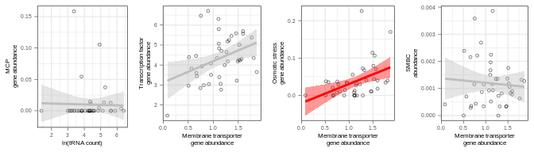

Testing relationships among genomic features in external genome and
metagenome studies
================
Sam Barnett
23 August, 2022

# Introduction

The goal of this study is to identify genes that may be indicative of
bacterial life history strategies identified in Barnett et al. (2021).
Now that we identified a few genomic features associated with C
acquisition and growth dynamics, lets see if relationships among these
features as well as rRNA or tRNA count are also observed in independent
genomic and metagenomic datasets.

## Initialization

``` r
library(dplyr)
library(ggplot2)
library(grid)
library(gridExtra)
library(kableExtra)


# Legend extraction function
g_legend<-function(a.gplot){
  tmp <- ggplot_gtable(ggplot_build(a.gplot))
  leg <- which(sapply(tmp$grobs, function(x) x$name) == "guide-box")
  legend <- tmp$grobs[[leg]]
  return(legend)}

# Get shortened taxa names
taxa_convert = data.frame(Taxa_filt = c("Actinobacteria", "Alphaproteobacteria", "Bacteroidetes", "Betaproteobacteria", "Cyanobacteria", 
                                        "Deltaproteobacteria", "Firmicutes", "Gammaproteobacteria", "Spirochaetes", "Less than 10"),
                          Taxa_short = c("Actino.", "Alpha.", "Bact.", "Beta.", "Cyano.", "Delta.", "Firm.", "Gamma.", "Spiro.", "< 10")) %>%
  mutate(Taxa_short = factor(Taxa_short, levels=c("Actino.", "Alpha.", "Bact.", "Beta.", "Cyano.", "Delta.", "Firm.", "Gamma.", "Spiro.", "< 10")))

Taxa_colors = c("#882E72", "#1965B0", "#7BAFDE", "#4EB265", "#CAE0AB", "#F7F056", "#EE8026", "#DC050C", "#72190E", "#777777")
names(Taxa_colors) = c("Actino.", "Alpha.", "Bact.", "Beta.", "Cyano.", "Delta.", "Firm.", "Gamma.", "Spiro.", "< 10")
```

# RefSoil genomes

``` r
# Metadata
RefSoil_metadata.df = read.table("/home/sam/new_databases/RefSoil/RefSoil_genomes/RefSoil_metadata.txt", 
                                 sep="\t", header=TRUE, comment.char = "", quote = "", stringsAsFactors = FALSE) %>%
  arrange(Organism, NCBI_enry_count) %>%
  mutate(genome_file = paste(NCBI.ID, ".fna", sep=""),
         study = "RefSoil",
         Taxa = ifelse(Phylum == "Proteobacteria", Class, Phylum)) %>%
  select(study, genome_file, RefSoil.ID, Organism, Taxa, Kingdom, Phylum, Class, Order, Family, Genus, Species)

RefSoil_metadata.tax = RefSoil_metadata.df %>%
  filter(Kingdom == "Bacteria") %>%
  select(RefSoil.ID, Taxa) %>%
  unique %>%
  group_by(Taxa) %>%
  summarize(n_Org = n()) %>%
  ungroup %>%
  mutate(Taxa_filt = ifelse(n_Org < 10, "Less than 10", Taxa)) %>%
  left_join(taxa_convert, by = "Taxa_filt") %>%
  select(Taxa, Taxa_short)

RefSoil_metadata.df = full_join(RefSoil_metadata.df, RefSoil_metadata.tax, by="Taxa")
  
# Prokka annotations
RefSoil_prokka.df = read.table("/home/sam/FullCyc_metagenome/Other_studies_comp/redo_analysis/full_study_files/RefSoil_annotations.txt", 
                               sep="\t", header=TRUE, comment.char = "", quote = "", stringsAsFactors = FALSE)

RefSoil_prokka_16S.df = RefSoil_prokka.df %>%
  filter(product == "16S ribosomal RNA") %>%
  group_by(study, genome_file) %>%
  summarize(n_16S = n()) %>%
  ungroup %>%
  full_join(RefSoil_metadata.df, by = c("study", "genome_file")) %>%
  mutate(n_16S = ifelse(is.na(n_16S), 0, n_16S)) %>%
  group_by(study, RefSoil.ID) %>%
  summarize(n_16S = sum(n_16S)) %>%
  ungroup

RefSoil_prokka_tRNA.df = RefSoil_prokka.df %>%
  filter(ftype == "tRNA") %>%
  group_by(study, genome_file) %>%
  summarize(n_tRNA = n()) %>%
  ungroup %>%
  full_join(RefSoil_metadata.df, by = c("study", "genome_file")) %>%
  mutate(n_tRNA = ifelse(is.na(n_tRNA), 0, n_tRNA)) %>%
  group_by(study, RefSoil.ID) %>%
  summarize(n_tRNA = sum(n_tRNA)) %>%
  ungroup

RefSoil_prokka_proteins.df = RefSoil_prokka.df %>%
  filter(ftype == "CDS")

RefSoil_prokka.df = NULL

# Transmembrane domains
RefSoil_TMHMM.df = read.table("/home/sam/FullCyc_metagenome/Other_studies_comp/redo_analysis/full_study_files/RefSoil_TMHMM_output.txt", 
                               sep="\t", header=TRUE, comment.char = "", quote = "", stringsAsFactors = FALSE) %>%
  mutate(n_TMH = as.numeric(gsub("PredHel=", "", PredHel))) %>%
  select(study, genome_file, locus_tag, n_TMH)

# SMBCs
RefSoil_SMBCs.df = read.table("/home/sam/FullCyc_metagenome/Other_studies_comp/redo_analysis/full_study_files/RefSoil_antismash_output.txt", 
                               sep="\t", header=TRUE, comment.char = "", quote = "", stringsAsFactors = FALSE) %>%
  group_by(study, genome_file) %>%
  summarize(n_SMBC = n()) %>%
  ungroup %>%
  full_join(RefSoil_metadata.df, by = c("study", "genome_file")) %>%
  mutate(n_SMBC = ifelse(is.na(n_SMBC), 0, n_SMBC)) %>%
  group_by(study, RefSoil.ID) %>%
  summarize(n_SMBC = sum(n_SMBC)) %>%
  ungroup

# Transcription factors
RefSoil_TFs.df = read.table("/home/sam/FullCyc_metagenome/Other_studies_comp/redo_analysis/full_study_files/RefSoil_deepTfactor_output.txt", 
                               sep="\t", header=TRUE, comment.char = "", quote = "", stringsAsFactors = FALSE) %>%
  rename(locus_tag = sequence_ID,
         TF_prediction = prediction,
         TF_score = score)

# Combine all into full annotation table
RefSoil_annotations.df = full_join(RefSoil_metadata.df, RefSoil_prokka_16S.df, by = c("study", "RefSoil.ID")) %>%
  full_join(RefSoil_prokka_tRNA.df, by = c("study", "RefSoil.ID")) %>%
  full_join(RefSoil_prokka_proteins.df, by = c("study", "genome_file")) %>%
  full_join(RefSoil_TMHMM.df, by = c("study", "genome_file", "locus_tag")) %>%
  full_join(RefSoil_TFs.df, by = c("study", "genome_file", "locus_tag")) %>%
  full_join(RefSoil_SMBCs.df, by = c("study", "RefSoil.ID")) %>%
  mutate(TF_prediction = ifelse(is.na(TF_prediction), "Missing", TF_prediction))

RefSoil_prokka_proteins.df = NULL
RefSoil_TMHMM.df = NULL
RefSoil_TFs.df = NULL
```

``` r
# Get gene counts
transport_grep_str = "transporter|channel|exchanger|symporter|antiporter|exporter|importer|ATPase|pump"
transfact_grep_str = "transcriptional regulator|transcriptional repressor|transcriptional activator|transcriptional.*regulator|transcriptional.*repressor|transcriptional activation|transcription factor|transcription regulator|transcription repressor"
osmostress_grep_str = "osmoregulated|osmoprotectant|osmotically-inducible|osmo-dependent|osmolarity sensor|ompr|l-ectoine synthase"
MCP_grep_str = "methyl-accepting chemotaxis protein"

# Get counts of each feature
RefSoil_features.sum = RefSoil_annotations.df %>%
  filter(Kingdom == "Bacteria") %>%
  mutate(product_lower = tolower(product)) %>%
  mutate(MCP = ifelse(grepl(MCP_grep_str, product_lower), 1, 0),
         transporter = ifelse(grepl(transport_grep_str, product) & n_TMH > 0, 1, 0),
         transfact = ifelse(grepl(transfact_grep_str, product_lower) | TF_prediction == "True", 1, 0),
         osmostress = ifelse(grepl(osmostress_grep_str, product_lower), 1, 0)) %>%
  group_by(RefSoil.ID, Taxa_short, n_16S, n_tRNA, n_SMBC) %>%
  summarize(total_genes = n(),
            n_MCP = sum(MCP),
            n_transporter = sum(transporter),
            n_transfact = sum(transfact),
            n_osmostress = sum(osmostress)) %>%
  ungroup %>%
  mutate(log_n_16S = log(n_16S),
         log_n_tRNA = log(n_tRNA),
         perc_MCP = n_MCP/total_genes*100,
         perc_transporter = n_transporter/total_genes*100,
         perc_transfact = n_transfact/total_genes*100,
         perc_osmostress = n_osmostress/total_genes*100,
         rel_n_SMBC = n_SMBC/total_genes) %>%
  arrange(-perc_transporter)

# MCPs vs. 16S copy number
rrn_MCP.cor = cor.test(filter(RefSoil_features.sum, log_n_16S > 0)$log_n_16S, filter(RefSoil_features.sum, log_n_16S > 0)$perc_MCP)
rrn_MCP.cor
```

    ## 
    ##  Pearson's product-moment correlation
    ## 
    ## data:  filter(RefSoil_features.sum, log_n_16S > 0)$log_n_16S and filter(RefSoil_features.sum, log_n_16S > 0)$perc_MCP
    ## t = 11.664, df = 795, p-value < 2.2e-16
    ## alternative hypothesis: true correlation is not equal to 0
    ## 95 percent confidence interval:
    ##  0.3213494 0.4400270
    ## sample estimates:
    ##       cor 
    ## 0.3822634

``` r
rrn_MCP.plot = ggplot(data=RefSoil_features.sum, aes(x=log_n_16S, y=perc_MCP)) +
  geom_point(fill=NA, size=1, alpha=0.5, shape=21, color="black") +
  geom_smooth(method="lm", color=ifelse(p.adjust(rrn_MCP.cor$p.value, n = 4) < 0.05, "red", "grey"), fill=ifelse(p.adjust(rrn_MCP.cor$p.value, n = 4) < 0.05, "red", "grey")) +
  #scale_fill_manual(values=Taxa_colors) +
  labs(x="ln(16S copy number)", y="MCP\ngene abundance") +
  theme_bw() +
  theme(axis.text = element_text(size=5),
        axis.title = element_text(size=6),
        axis.ticks = element_line(size=0.2),
        legend.position = "none")

# TFs vs. Transporters
TP_TF.cor = cor.test(RefSoil_features.sum$perc_transporter, RefSoil_features.sum$perc_transfact)
TP_TF.cor
```

    ## 
    ##  Pearson's product-moment correlation
    ## 
    ## data:  RefSoil_features.sum$perc_transporter and RefSoil_features.sum$perc_transfact
    ## t = 18.024, df = 886, p-value < 2.2e-16
    ## alternative hypothesis: true correlation is not equal to 0
    ## 95 percent confidence interval:
    ##  0.4681283 0.5645165
    ## sample estimates:
    ##       cor 
    ## 0.5179646

``` r
TP_TF.plot = ggplot(data=RefSoil_features.sum, aes(x=perc_transporter, y=perc_transfact)) +
  geom_point(fill=NA, size=1, alpha=0.5, shape=21, color="black") +
  geom_smooth(method="lm", color=ifelse(p.adjust(TP_TF.cor$p.value, n = 4) < 0.05, "red", "grey"), fill=ifelse(p.adjust(TP_TF.cor$p.value, n = 4) < 0.05, "red", "grey")) +
  #scale_fill_manual(values=Taxa_colors) +
  labs(x="Membrane transporter\ngene abundance", y="Transcription factor\ngene abundance") +
  theme_bw() +
  theme(axis.text = element_text(size=5),
        axis.title = element_text(size=6),
        axis.ticks = element_line(size=0.2),
        legend.position = "none")

# Osmotic stress vs. Transporters
TP_OS.cor = cor.test(RefSoil_features.sum$perc_transporter, RefSoil_features.sum$perc_osmostress)
TP_OS.cor
```

    ## 
    ##  Pearson's product-moment correlation
    ## 
    ## data:  RefSoil_features.sum$perc_transporter and RefSoil_features.sum$perc_osmostress
    ## t = 16.771, df = 886, p-value < 2.2e-16
    ## alternative hypothesis: true correlation is not equal to 0
    ## 95 percent confidence interval:
    ##  0.4392710 0.5392476
    ## sample estimates:
    ##       cor 
    ## 0.4908736

``` r
TP_OS.plot = ggplot(data=RefSoil_features.sum, aes(x=perc_transporter, y=perc_osmostress)) +
  geom_point(fill=NA, size=1, alpha=0.5, shape=21, color="black") +
  geom_smooth(method="lm", color=ifelse(p.adjust(TP_OS.cor$p.value, n = 4) < 0.05, "red", "grey"), fill=ifelse(p.adjust(TP_OS.cor$p.value, n = 4) < 0.05, "red", "grey")) +
  #scale_fill_manual(values=Taxa_colors) +
  labs(x="Membrane transporter\ngene abundance", y="Osmotic stress\ngene abundance") +
  theme_bw() +
  theme(axis.text = element_text(size=5),
        axis.title = element_text(size=6),
        axis.ticks = element_line(size=0.2),
        legend.position = "none")

# SMBCs vs. Transporters
TP_SMBC.cor = cor.test(RefSoil_features.sum$perc_transporter, RefSoil_features.sum$rel_n_SMBC)
TP_SMBC.cor
```

    ## 
    ##  Pearson's product-moment correlation
    ## 
    ## data:  RefSoil_features.sum$perc_transporter and RefSoil_features.sum$rel_n_SMBC
    ## t = -2.3194, df = 886, p-value = 0.0206
    ## alternative hypothesis: true correlation is not equal to 0
    ## 95 percent confidence interval:
    ##  -0.14274504 -0.01195909
    ## sample estimates:
    ##         cor 
    ## -0.07768628

``` r
TP_SMBC.plot = ggplot(data=RefSoil_features.sum, aes(x=perc_transporter, y=rel_n_SMBC)) +
  geom_point(fill=NA, size=1, alpha=0.5, shape=21, color="black") +
  geom_smooth(method="lm", color=ifelse(p.adjust(TP_SMBC.cor$p.value, n = 4) < 0.05, "red", "grey"), fill=ifelse(p.adjust(TP_SMBC.cor$p.value, n = 4) < 0.05, "red", "grey")) +
  #scale_fill_manual(values=Taxa_colors) +
  labs(x="Membrane transporter\ngene abundance", y="SMBC\nabundance") +
  theme_bw() +
  theme(axis.text = element_text(size=5),
        axis.title = element_text(size=6),
        axis.ticks = element_line(size=0.2),
        legend.position = "none")

# Plot together
RefSoil_feat.plot = cowplot::plot_grid(rrn_MCP.plot, TP_TF.plot, TP_OS.plot, TP_SMBC.plot, nrow=1)
RefSoil_feat.plot
```

<!-- -->

``` r
nrow(RefSoil_features.sum)
```

    ## [1] 888

``` r
# Correlation summaries
RefSoil_cor.df = data.frame(Dataset = "RefSoil",
                            comparison = c("rRNA gene count vs. MCP gene count", "transporter gene count vs. transcription factor gene count", 
                                           "transporter gene count vs. osmotic stress response gene count", "transporter gene count vs. SMBC count"),
                            pear_r = c(rrn_MCP.cor$estimate, TP_TF.cor$estimate, TP_OS.cor$estimate, TP_SMBC.cor$estimate),
                            t_stat = c(rrn_MCP.cor$statistic, TP_TF.cor$statistic, TP_OS.cor$statistic, TP_SMBC.cor$statistic),
                            df = c(rrn_MCP.cor$parameter, TP_TF.cor$parameter, TP_OS.cor$parameter, TP_SMBC.cor$parameter),
                            pvalue = c(rrn_MCP.cor$p.value, TP_TF.cor$p.value, TP_OS.cor$p.value, TP_SMBC.cor$p.value))

#RefSoil_annotations.df = NULL
```

``` r
tRNA_16S.cor = cor.test(filter(RefSoil_features.sum, log_n_16S > 0)$log_n_16S, filter(RefSoil_features.sum, log_n_16S > 0)$log_n_tRNA)
tRNA_16S.cor
```

    ## 
    ##  Pearson's product-moment correlation
    ## 
    ## data:  filter(RefSoil_features.sum, log_n_16S > 0)$log_n_16S and filter(RefSoil_features.sum, log_n_16S > 0)$log_n_tRNA
    ## t = 36.59, df = 795, p-value < 2.2e-16
    ## alternative hypothesis: true correlation is not equal to 0
    ## 95 percent confidence interval:
    ##  0.7647292 0.8166315
    ## sample estimates:
    ##       cor 
    ## 0.7921079

``` r
tRNA_16S.plot = ggplot(data=filter(RefSoil_features.sum, log_n_16S > 0), aes(x=log_n_16S, y=log_n_tRNA)) +
  geom_point(fill=NA, size=1, alpha=0.5, shape=21, color="black") +
  geom_smooth(method="lm", color=ifelse(tRNA_16S.cor$p.value < 0.05, "red", "grey"), fill=ifelse(tRNA_16S.cor$p.value < 0.05, "red", "grey")) +
  labs(x="ln(16S rRNA gene copy number)", y="ln(tRNA gene count)") +
  theme_bw() +
  theme(axis.text = element_text(size=7),
        axis.title = element_text(size=8),
        axis.ticks = element_line(size=0.2),
        legend.position = "none")

tRNA_16S.plot = tRNA_16S.plot + 
  annotate("text", label=paste("r = ", round(tRNA_16S.cor$estimate, digits=3),
                               "\tp-value < 0.001", sep=""),
           x=(ggplot_build(tRNA_16S.plot)$layout$panel_scales_x[[1]]$range$range[2] - ggplot_build(tRNA_16S.plot)$layout$panel_scales_x[[1]]$range$range[1])*0.0 + ggplot_build(tRNA_16S.plot)$layout$panel_scales_x[[1]]$range$range[1], 
           y=(ggplot_build(tRNA_16S.plot)$layout$panel_scales_y[[1]]$range$range[2] - ggplot_build(tRNA_16S.plot)$layout$panel_scales_y[[1]]$range$range[1])*0.9 + ggplot_build(tRNA_16S.plot)$layout$panel_scales_y[[1]]$range$range[1], hjust=0, size=6*5/14)

tRNA_16S.plot
```

<!-- -->

``` r
ggsave(tRNA_16S.plot, filename = "/home/sam/FullCyc_metagenome/figs4publication/FigS9.tiff", 
       device = "tiff", width = 3.46457, height = 3.46457, units = "in")
```

# Diamond et al. 2019 MAGs recovered from drought simulated meadow soils

``` r
# Metadata
rainfall_metadata.df = read.table("/home/sam/FullCyc_metagenome/Other_studies_comp/rainfall/bin_info.txt", 
                                  sep="\t", header=TRUE, comment.char = "", quote = "", stringsAsFactors = FALSE) %>%
  mutate(study = "rainfall")
  
rainfall_bin_accessions.df = read.table("/home/sam/FullCyc_metagenome/Other_studies_comp/rainfall/bin_accession_convert.txt", 
                                        sep="\t", header=TRUE, comment.char = "", quote = "", stringsAsFactors = FALSE) %>%
  mutate(NCBI_Bin_Name = paste(gsub(" bacterium", "", Taxonomy), gsub(" ", "_", Isolate), sep="_")) %>%
  select(Assembly, NCBI_Bin_Name) %>%
  mutate(genome_file = paste(Assembly, gsub("GCA_0*", "ASM", gsub(".\\.", "v", Assembly)), "genomic.fna", sep="_")) %>%
  select(genome_file, NCBI_Bin_Name)

rainfall_metadata.df = rainfall_metadata.df %>%
  full_join(rainfall_bin_accessions.df, by = "NCBI_Bin_Name") %>%
  filter(!is.na(genome_file)) %>%
  mutate(Taxa_filt = ifelse(Phylum == "Proteobacteria", Class, Phylum)) %>%
  left_join(taxa_convert, by = "Taxa_filt") %>%
  mutate(Rain_response = Treatment.20cm.Response) %>%
  select(study, genome_file, Taxa_filt, Taxa_short, NCBI_Bin_Name, Completeness, Contamination, Rain_response)

# Prokka annotations
rainfall_prokka.df = read.table("/home/sam/FullCyc_metagenome/Other_studies_comp/redo_analysis/full_study_files/rainfall_annotations.txt", 
                               sep="\t", header=TRUE, comment.char = "", quote = "", stringsAsFactors = FALSE)

rainfall_prokka_16S.df = rainfall_prokka.df %>%
  filter(product == "16S ribosomal RNA") %>%
  group_by(study, genome_file) %>%
  summarize(n_16S = n()) %>%
  ungroup

rainfall_prokka_tRNA.df = rainfall_prokka.df %>%
  filter(ftype == "tRNA") %>%
  group_by(study, genome_file) %>%
  summarize(n_tRNA = n()) %>%
  ungroup

rainfall_prokka_proteins.df = rainfall_prokka.df %>%
  filter(ftype == "CDS")

rainfall_prokka.df = NULL

# Transmembrane domains
rainfall_TMHMM.df = read.table("/home/sam/FullCyc_metagenome/Other_studies_comp/redo_analysis/full_study_files/rainfall_TMHMM_output.txt", 
                               sep="\t", header=TRUE, comment.char = "", quote = "", stringsAsFactors = FALSE) %>%
  mutate(n_TMH = as.numeric(gsub("PredHel=", "", PredHel))) %>%
  select(study, genome_file, locus_tag, n_TMH)

# SMBCs
rainfall_SMBCs.df = read.table("/home/sam/FullCyc_metagenome/Other_studies_comp/redo_analysis/full_study_files/rainfall_antismash_output.txt", 
                               sep="\t", header=TRUE, comment.char = "", quote = "", stringsAsFactors = FALSE) %>%
  group_by(study, genome_file) %>%
  summarize(n_SMBC = n()) %>%
  ungroup

# Transcription factors
rainfall_TFs.df = read.table("/home/sam/FullCyc_metagenome/Other_studies_comp/redo_analysis/full_study_files/rainfall_deepTfactor_output.txt", 
                               sep="\t", header=TRUE, comment.char = "", quote = "", stringsAsFactors = FALSE) %>%
  rename(locus_tag = sequence_ID,
         TF_prediction = prediction,
         TF_score = score)

# Combine all into full annotation table
rainfall_annotations.df = full_join(rainfall_metadata.df, rainfall_prokka_16S.df, by = c("study", "genome_file")) %>%
  full_join(rainfall_prokka_tRNA.df, by = c("study", "genome_file")) %>%
  full_join(rainfall_prokka_proteins.df, by = c("study", "genome_file")) %>%
  full_join(rainfall_TMHMM.df, by = c("study", "genome_file", "locus_tag")) %>%
  full_join(rainfall_SMBCs.df, by = c("study", "genome_file")) %>%
  full_join(rainfall_TFs.df, by = c("study", "genome_file", "locus_tag")) %>%
  mutate(n_16S = ifelse(is.na(n_16S), 0, n_16S),
         n_tRNA = ifelse(is.na(n_tRNA), 0, n_tRNA),
         n_SMBC = ifelse(is.na(n_SMBC), 0, n_SMBC),
         TF_prediction = ifelse(is.na(TF_prediction), "Missing", TF_prediction))

rainfall_prokka_proteins.df = NULL
rainfall_TMHMM.df = NULL
rainfall_TFs.df = NULL

rainfall_metadata.df$Rain_response %>% unique
```

    ## [1] NA         "Decrease" "Increase"

``` r
# Get gene counts
transport_grep_str = "transporter|channel|exchanger|symporter|antiporter|exporter|importer|ATPase|pump"
transfact_grep_str = "transcriptional regulator|transcriptional repressor|transcriptional activator|transcriptional.*regulator|transcriptional.*repressor|transcriptional activation|transcription factor|transcription regulator|transcription repressor"
osmostress_grep_str = "osmoregulated|osmoprotectant|osmotically-inducible|osmo-dependent|osmolarity sensor|ompr|l-ectoine synthase"
MCP_grep_str = "methyl-accepting chemotaxis protein"

# Get counts of each feature
rainfall_features.sum = rainfall_annotations.df %>%
  filter(Completeness > 50) %>%
  mutate(product_lower = tolower(product)) %>%
  mutate(MCP = ifelse(grepl(MCP_grep_str, product_lower), 1, 0),
         transporter = ifelse(grepl(transport_grep_str, product) & n_TMH > 0, 1, 0),
         transfact = ifelse(grepl(transfact_grep_str, product_lower) | TF_prediction == "True", 1, 0),
         osmostress = ifelse(grepl(osmostress_grep_str, product_lower), 1, 0)) %>%
  group_by(genome_file, Taxa_short, Rain_response, n_16S, n_tRNA, n_SMBC) %>%
  summarize(total_genes = n(),
            n_MCP = sum(MCP),
            n_transporter = sum(transporter),
            n_transfact = sum(transfact),
            n_osmostress = sum(osmostress)) %>%
  ungroup %>%
  mutate(log_n_16S = log(n_16S),
         log_n_tRNA = log(n_tRNA),
         perc_MCP = n_MCP/total_genes*100,
         perc_transporter = n_transporter/total_genes*100,
         perc_transfact = n_transfact/total_genes*100,
         perc_osmostress = n_osmostress/total_genes*100,
         rel_n_SMBC = n_SMBC/total_genes) %>%
  arrange(-perc_transporter)

# MCPs vs. 16S copy number
#rrn_MCP.cor = cor.test(filter(rainfall_features.sum, log_n_16S > 0)$log_n_16S, filter(rainfall_features.sum, log_n_16S > 0)$perc_MCP)
#rrn_MCP.cor
#rrn_MCP.plot = ggplot(data=rainfall_features.sum, aes(x=log_n_16S, y=perc_MCP)) +
#  geom_point(aes(fill=Taxa_short), size=1, alpha=0.5, shape=21, color="black") +
#  geom_smooth(method="lm", color=ifelse(p.adjust(rrn_MCP.cor$p.value, n = 4) < 0.05, "red", "grey"), fill=ifelse(p.adjust(rrn_MCP.cor$p.value, n = 4) < 0.05, "red", "grey")) +
#  scale_fill_manual(values=Taxa_colors) +
#  labs(x="ln(16S copy number)", y="MCP\ngene abundance") +
#  theme_bw() +
#  theme(axis.text = element_text(size=7),
#        axis.title = element_text(size=8),
#        legend.position = "none")

# MCPs vs. tRNA count
tRNA_MCP.cor = cor.test(rainfall_features.sum$log_n_tRNA, rainfall_features.sum$perc_MCP)
tRNA_MCP.cor
```

    ## 
    ##  Pearson's product-moment correlation
    ## 
    ## data:  rainfall_features.sum$log_n_tRNA and rainfall_features.sum$perc_MCP
    ## t = -0.028367, df = 322, p-value = 0.9774
    ## alternative hypothesis: true correlation is not equal to 0
    ## 95 percent confidence interval:
    ##  -0.1105220  0.1073979
    ## sample estimates:
    ##          cor 
    ## -0.001580812

``` r
tRNA_MCP.plot = ggplot(data=rainfall_features.sum, aes(x=log_n_tRNA, y=perc_MCP)) +
  geom_point(fill=NA, size=1, alpha=0.5, shape=21, color="black") +
  geom_smooth(method="lm", color=ifelse(p.adjust(tRNA_MCP.cor$p.value, n = 4) < 0.05, "red", "grey"), fill=ifelse(p.adjust(tRNA_MCP.cor$p.value, n = 4) < 0.05, "red", "grey")) +
  #scale_fill_manual(values=c(Decrease = "blue", Increase = "red")) +
  labs(x="ln(tRNA count)", y="MCP\ngene abundance") +
  theme_bw() +
  theme(axis.text = element_text(size=5),
        axis.title = element_text(size=6),
        axis.ticks = element_line(size=0.2),
        legend.position = "none")

# TFs vs. Transporters
TP_TF.cor = cor.test(rainfall_features.sum$perc_transporter, rainfall_features.sum$perc_transfact)
TP_TF.cor
```

    ## 
    ##  Pearson's product-moment correlation
    ## 
    ## data:  rainfall_features.sum$perc_transporter and rainfall_features.sum$perc_transfact
    ## t = 3.2057, df = 322, p-value = 0.001482
    ## alternative hypothesis: true correlation is not equal to 0
    ## 95 percent confidence interval:
    ##  0.06821153 0.27946961
    ## sample estimates:
    ##       cor 
    ## 0.1758647

``` r
TP_TF.plot = ggplot(data=rainfall_features.sum, aes(x=perc_transporter, y=perc_transfact)) +
  geom_point(fill=NA, size=1, alpha=0.5, shape=21, color="black") +
  geom_smooth(method="lm", color=ifelse(p.adjust(TP_TF.cor$p.value, n = 4) < 0.05, "red", "grey"), fill=ifelse(p.adjust(TP_TF.cor$p.value, n = 4) < 0.05, "red", "grey")) +
  #scale_fill_manual(values=c(Decrease = "blue", Increase = "red")) +
  labs(x="Membrane transporter\ngene abundance", y="Transcription factor\ngene abundance") +
  theme_bw() +
  theme(axis.text = element_text(size=5),
        axis.title = element_text(size=6),
        axis.ticks = element_line(size=0.2),
        legend.position = "none")

# Osmotic stress vs. Transporters
TP_OS.cor = cor.test(rainfall_features.sum$perc_transporter, rainfall_features.sum$perc_osmostress)
TP_OS.cor
```

    ## 
    ##  Pearson's product-moment correlation
    ## 
    ## data:  rainfall_features.sum$perc_transporter and rainfall_features.sum$perc_osmostress
    ## t = -0.58777, df = 322, p-value = 0.5571
    ## alternative hypothesis: true correlation is not equal to 0
    ## 95 percent confidence interval:
    ##  -0.14119397  0.07649568
    ## sample estimates:
    ##        cor 
    ## -0.0327374

``` r
TP_OS.plot = ggplot(data=rainfall_features.sum, aes(x=perc_transporter, y=perc_osmostress)) +
  geom_point(fill=NA, size=1, alpha=0.5, shape=21, color="black") +
  geom_smooth(method="lm", color=ifelse(p.adjust(TP_OS.cor$p.value, n = 4) < 0.05, "red", "grey"), fill=ifelse(p.adjust(TP_OS.cor$p.value, n = 4) < 0.05, "red", "grey")) +
  #scale_fill_manual(values=c(Decrease = "blue", Increase = "red")) +
  labs(x="Membrane transporter\ngene abundance", y="Osmotic stress\ngene abundance") +
  theme_bw() +
  theme(axis.text = element_text(size=5),
        axis.title = element_text(size=6),
        axis.ticks = element_line(size=0.2),
        legend.position = "none")

# SMBCs vs. Transporters
TP_SMBC.cor = cor.test(rainfall_features.sum$perc_transporter, rainfall_features.sum$rel_n_SMBC)
TP_SMBC.cor
```

    ## 
    ##  Pearson's product-moment correlation
    ## 
    ## data:  rainfall_features.sum$perc_transporter and rainfall_features.sum$rel_n_SMBC
    ## t = -1.5612, df = 322, p-value = 0.1194
    ## alternative hypothesis: true correlation is not equal to 0
    ## 95 percent confidence interval:
    ##  -0.19380684  0.02249568
    ## sample estimates:
    ##       cor 
    ## -0.086677

``` r
TP_SMBC.plot = ggplot(data=rainfall_features.sum, aes(x=perc_transporter, y=rel_n_SMBC)) +
  geom_point(fill=NA, size=1, alpha=0.5, shape=21, color="black") +
  geom_smooth(method="lm", color=ifelse(p.adjust(TP_SMBC.cor$p.value, n = 4) < 0.05, "red", "grey"), fill=ifelse(p.adjust(TP_SMBC.cor$p.value, n = 4) < 0.05, "red", "grey")) +
  #scale_fill_manual(values=c(Decrease = "blue", Increase = "red")) +
  labs(x="Membrane transporter\ngene abundance", y="SMBC\nabundance") +
  theme_bw() +
  theme(axis.text = element_text(size=5),
        axis.title = element_text(size=6),
        axis.ticks = element_line(size=0.2),
        legend.position = "none")

rainfall_feat.plot = cowplot::plot_grid(tRNA_MCP.plot, TP_TF.plot, TP_OS.plot, TP_SMBC.plot, nrow=1)
rainfall_feat.plot
```

<!-- -->

``` r
nrow(rainfall_features.sum)
```

    ## [1] 324

``` r
# Correlation summaries
rainfall_cor.df = data.frame(Dataset = "Diamond et al. 2019",
                            comparison = c("tRNA gene count vs. MCP gene count", "transporter gene count vs. transcription factor gene count", 
                                           "transporter gene count vs. osmotic stress response gene count", "transporter gene count vs. SMBC count"),
                            pear_r = c(tRNA_MCP.cor$estimate, TP_TF.cor$estimate, TP_OS.cor$estimate, TP_SMBC.cor$estimate),
                            t_stat = c(tRNA_MCP.cor$statistic, TP_TF.cor$statistic, TP_OS.cor$statistic, TP_SMBC.cor$statistic),
                            df = c(tRNA_MCP.cor$parameter, TP_TF.cor$parameter, TP_OS.cor$parameter, TP_SMBC.cor$parameter),
                            pvalue = c(tRNA_MCP.cor$p.value, TP_TF.cor$p.value, TP_OS.cor$p.value, TP_SMBC.cor$p.value))

rainfall_annotations.df = NULL
```

``` r
rainfall_rainresponse_vs_feat.df = data.frame()
# transporters
rainfall_rainresponse_vs_transport.kw = kruskal.test(perc_transporter ~ Rain_response, data = rainfall_features.sum)
rainfall_rainresponse_vs_feat.df = rbind(rainfall_rainresponse_vs_feat.df,
                                         data.frame(feature = "Transporter gene abundance",
                                                    chi2 = rainfall_rainresponse_vs_transport.kw$statistic,
                                                    df = rainfall_rainresponse_vs_transport.kw$parameter,
                                                    pvalue = rainfall_rainresponse_vs_transport.kw$p.value,
                                                    adj_pvalue = p.adjust(rainfall_rainresponse_vs_transport.kw$p.value, n=5, method="BH")))

rainfall_rainresponse_vs_transport.plot = ggplot(data=rainfall_features.sum, aes(x=Rain_response, y=perc_transporter)) +
  geom_boxplot(outlier.shape = NA) +
  geom_jitter(aes(fill=Rain_response), height = 0, size=1, alpha=0.5, shape=21, color="black") +
  scale_fill_manual(values=c(Unrainresponseed = "white", rainresponseed = "red")) +
  theme_bw() +
  theme(axis.text = element_text(size=7),
        axis.title = element_text(size=8),
        legend.position = "none")

# MCPs
rainfall_rainresponse_vs_chemotax.kw = kruskal.test(perc_MCP ~ Rain_response, data = rainfall_features.sum)
rainfall_rainresponse_vs_feat.df = rbind(rainfall_rainresponse_vs_feat.df,
                                         data.frame(feature = "MCP gene abundance",
                                                    chi2 = rainfall_rainresponse_vs_chemotax.kw$statistic,
                                                    df = rainfall_rainresponse_vs_chemotax.kw$parameter,
                                                    pvalue = rainfall_rainresponse_vs_chemotax.kw$p.value,
                                                    adj_pvalue = p.adjust(rainfall_rainresponse_vs_chemotax.kw$p.value, n=5, method="BH")))

rainfall_rainresponse_vs_chemotax.plot = ggplot(data=rainfall_features.sum, aes(x=Rain_response, y=perc_MCP)) +
  geom_boxplot(outlier.shape = NA) +
  geom_jitter(aes(fill=Rain_response), height = 0, size=1, alpha=0.5, shape=21, color="black") +
  scale_fill_manual(values=c(Unrainresponseed = "white", rainresponseed = "red")) +
  theme_bw() +
  theme(axis.text = element_text(size=7),
        axis.title = element_text(size=8),
        legend.position = "none")

# Transcription factors
rainfall_rainresponse_vs_transfact.kw = kruskal.test(perc_transfact ~ Rain_response, data = rainfall_features.sum)
rainfall_rainresponse_vs_feat.df = rbind(rainfall_rainresponse_vs_feat.df,
                                         data.frame(feature = "transcription factor gene abundance",
                                                    chi2 = rainfall_rainresponse_vs_transfact.kw$statistic,
                                                    df = rainfall_rainresponse_vs_transfact.kw$parameter,
                                                    pvalue = rainfall_rainresponse_vs_transfact.kw$p.value,
                                                    adj_pvalue = p.adjust(rainfall_rainresponse_vs_transfact.kw$p.value, n=5, method="BH")))

rainfall_rainresponse_vs_transfact.plot = ggplot(data=rainfall_features.sum, aes(x=Rain_response, y=perc_transfact)) +
  geom_boxplot(outlier.shape = NA) +
  geom_jitter(aes(fill=Rain_response), height = 0, size=1, alpha=0.5, shape=21, color="black") +
  scale_fill_manual(values=c(Unrainresponseed = "white", rainresponseed = "red")) +
  theme_bw() +
  theme(axis.text = element_text(size=7),
        axis.title = element_text(size=8),
        legend.position = "none")

# Osmotic stress response
rainfall_rainresponse_vs_osmostress.kw = kruskal.test(perc_osmostress ~ Rain_response, data = rainfall_features.sum)
rainfall_rainresponse_vs_osmostress.df = rbind(rainfall_rainresponse_vs_feat.df,
                                               data.frame(feature = "osmotic stress gene abundance",
                                                          chi2 = rainfall_rainresponse_vs_osmostress.kw$statistic,
                                                          df = rainfall_rainresponse_vs_osmostress.kw$parameter,
                                                          pvalue = rainfall_rainresponse_vs_osmostress.kw$p.value,
                                                          adj_pvalue = p.adjust(rainfall_rainresponse_vs_osmostress.kw$p.value, n=5, method="BH")))

rainfall_rainresponse_vs_osmostress.plot = ggplot(data=rainfall_features.sum, aes(x=Rain_response, y=perc_osmostress)) +
  geom_boxplot(outlier.shape = NA) +
  geom_jitter(aes(fill=Rain_response), height = 0, size=1, alpha=0.5, shape=21, color="black") +
  scale_fill_manual(values=c(Unrainresponseed = "white", rainresponseed = "red")) +
  theme_bw() +
  theme(axis.text = element_text(size=7),
        axis.title = element_text(size=8),
        legend.position = "none")

# SMBCs
rainfall_rainresponse_vs_SMBC.kw = kruskal.test(rel_n_SMBC ~ Rain_response, data = rainfall_features.sum)
rainfall_rainresponse_vs_feat.df = rbind(rainfall_rainresponse_vs_feat.df,
                                 data.frame(feature = "SMBC abundance",
                                            chi2 = rainfall_rainresponse_vs_SMBC.kw$statistic,
                                            df = rainfall_rainresponse_vs_SMBC.kw$parameter,
                                            pvalue = rainfall_rainresponse_vs_SMBC.kw$p.value,
                                            adj_pvalue = p.adjust(rainfall_rainresponse_vs_SMBC.kw$p.value, n=5, method="BH")))

rainfall_rainresponse_vs_SMBC.plot = ggplot(data=rainfall_features.sum, aes(x=Rain_response, y=rel_n_SMBC)) +
  geom_boxplot(outlier.shape = NA) +
  geom_jitter(aes(fill=Rain_response), height = 0, size=1, alpha=0.5, shape=21, color="black") +
  scale_fill_manual(values=c(Unrainresponseed = "white", rainresponseed = "red")) +
  theme_bw() +
  theme(axis.text = element_text(size=7),
        axis.title = element_text(size=8),
        legend.position = "none")

# Plot together
rainfall_rainresponse_vs_feat.plot = cowplot::plot_grid(rainfall_rainresponse_vs_chemotax.plot, rainfall_rainresponse_vs_transport.plot, 
                                       rainfall_rainresponse_vs_transfact.plot, rainfall_rainresponse_vs_osmostress.plot, 
                                       rainfall_rainresponse_vs_SMBC.plot, nrow=1)
rainfall_rainresponse_vs_feat.plot
```

<!-- -->

``` r
kable(rainfall_rainresponse_vs_feat.df)
```

<table>

<thead>

<tr>

<th style="text-align:left;">

</th>

<th style="text-align:left;">

feature

</th>

<th style="text-align:right;">

chi2

</th>

<th style="text-align:right;">

df

</th>

<th style="text-align:right;">

pvalue

</th>

<th style="text-align:right;">

adj\_pvalue

</th>

</tr>

</thead>

<tbody>

<tr>

<td style="text-align:left;">

Kruskal-Wallis chi-squared

</td>

<td style="text-align:left;">

Transporter gene abundance

</td>

<td style="text-align:right;">

1.963431

</td>

<td style="text-align:right;">

1

</td>

<td style="text-align:right;">

0.1611468

</td>

<td style="text-align:right;">

0.8057341

</td>

</tr>

<tr>

<td style="text-align:left;">

Kruskal-Wallis chi-squared1

</td>

<td style="text-align:left;">

MCP gene abundance

</td>

<td style="text-align:right;">

1.376699

</td>

<td style="text-align:right;">

1

</td>

<td style="text-align:right;">

0.2406641

</td>

<td style="text-align:right;">

1.0000000

</td>

</tr>

<tr>

<td style="text-align:left;">

Kruskal-Wallis chi-squared2

</td>

<td style="text-align:left;">

transcription factor gene abundance

</td>

<td style="text-align:right;">

4.417720

</td>

<td style="text-align:right;">

1

</td>

<td style="text-align:right;">

0.0355675

</td>

<td style="text-align:right;">

0.1778376

</td>

</tr>

<tr>

<td style="text-align:left;">

Kruskal-Wallis chi-squared3

</td>

<td style="text-align:left;">

SMBC
abundance

</td>

<td style="text-align:right;">

1.707150

</td>

<td style="text-align:right;">

1

</td>

<td style="text-align:right;">

0.1913556

</td>

<td style="text-align:right;">

0.9567780

</td>

</tr>

</tbody>

</table>

# Yu et al. 2020 MAGs recovered from heavy DNA extracted from agricultural soils supplied with 13C-labeled ryegrass

``` r
# Metadata
biocharSIP_metadata.df = read.table("/home/sam/FullCyc_metagenome/Other_studies_comp/biocharSIP/bin_info.txt", 
                                  sep="\t", header=TRUE, comment.char = "", quote = "", stringsAsFactors = FALSE) %>%
  mutate(study = "biocharSIP") %>%
  mutate(genome_file = paste(Accession, gsub("GCA_0*", "ASM", gsub(".\\.", "v", Accession)), "genomic.fna", sep="_")) %>%
  rename(Taxa_filt = Taxa) %>%
  left_join(taxa_convert, by = "Taxa_filt") %>%
  select(study, genome_file, Phylum, Taxa_filt, Taxa_short, Bin_ID)

# Prokka annotations
biocharSIP_prokka.df = read.table("/home/sam/FullCyc_metagenome/Other_studies_comp/redo_analysis/full_study_files/biocharSIP_annotations.txt", 
                               sep="\t", header=TRUE, comment.char = "", quote = "", stringsAsFactors = FALSE)

biocharSIP_prokka_16S.df = biocharSIP_prokka.df %>%
  filter(product == "16S ribosomal RNA") %>%
  group_by(study, genome_file) %>%
  summarize(n_16S = n()) %>%
  ungroup

biocharSIP_prokka_tRNA.df = biocharSIP_prokka.df %>%
  filter(ftype == "tRNA") %>%
  group_by(study, genome_file) %>%
  summarize(n_tRNA = n()) %>%
  ungroup

biocharSIP_prokka_proteins.df = biocharSIP_prokka.df %>%
  filter(ftype == "CDS")

biocharSIP_prokka.df = NULL

# Transmembrane domains
biocharSIP_TMHMM.df = read.table("/home/sam/FullCyc_metagenome/Other_studies_comp/redo_analysis/full_study_files/biocharSIP_TMHMM_output.txt", 
                               sep="\t", header=TRUE, comment.char = "", quote = "", stringsAsFactors = FALSE) %>%
  mutate(n_TMH = as.numeric(gsub("PredHel=", "", PredHel))) %>%
  select(study, genome_file, locus_tag, n_TMH)

# SMBCs
biocharSIP_SMBCs.df = read.table("/home/sam/FullCyc_metagenome/Other_studies_comp/redo_analysis/full_study_files/biocharSIP_antismash_output.txt", 
                               sep="\t", header=TRUE, comment.char = "", quote = "", stringsAsFactors = FALSE) %>%
  group_by(study, genome_file) %>%
  summarize(n_SMBC = n()) %>%
  ungroup

# Transcription factors
biocharSIP_TFs.df = read.table("/home/sam/FullCyc_metagenome/Other_studies_comp/redo_analysis/full_study_files/biocharSIP_deepTfactor_output.txt", 
                               sep="\t", header=TRUE, comment.char = "", quote = "", stringsAsFactors = FALSE) %>%
  rename(locus_tag = sequence_ID,
         TF_prediction = prediction,
         TF_score = score)

# Combine all into full annotation table
biocharSIP_annotations.df = full_join(biocharSIP_metadata.df, biocharSIP_prokka_16S.df, by = c("study", "genome_file")) %>%
  full_join(biocharSIP_prokka_tRNA.df, by = c("study", "genome_file")) %>%
  full_join(biocharSIP_prokka_proteins.df, by = c("study", "genome_file")) %>%
  full_join(biocharSIP_TMHMM.df, by = c("study", "genome_file", "locus_tag")) %>%
  full_join(biocharSIP_SMBCs.df, by = c("study", "genome_file")) %>%
  full_join(biocharSIP_TFs.df, by = c("study", "genome_file", "locus_tag")) %>%
  mutate(n_16S = ifelse(is.na(n_16S), 0, n_16S),
         n_tRNA = ifelse(is.na(n_tRNA), 0, n_tRNA),
         n_SMBC = ifelse(is.na(n_SMBC), 0, n_SMBC),
         TF_prediction = ifelse(is.na(TF_prediction), "Missing", TF_prediction))

biocharSIP_prokka_proteins.df = NULL
biocharSIP_TMHMM.df = NULL
biocharSIP_TFs.df = NULL
```

``` r
# Get gene counts
transport_grep_str = "transporter|channel|exchanger|symporter|antiporter|exporter|importer|ATPase|pump"
transfact_grep_str = "transcriptional regulator|transcriptional repressor|transcriptional activator|transcriptional.*regulator|transcriptional.*repressor|transcriptional activation|transcription factor|transcription regulator|transcription repressor"
osmostress_grep_str = "osmoregulated|osmoprotectant|osmotically-inducible|osmo-dependent|osmolarity sensor|ompr|l-ectoine synthase"
MCP_grep_str = "methyl-accepting chemotaxis protein"

# Get counts of each feature
biocharSIP_features.sum = biocharSIP_annotations.df %>%
  mutate(product_lower = tolower(product)) %>%
  mutate(MCP = ifelse(grepl(MCP_grep_str, product_lower), 1, 0),
         transporter = ifelse(grepl(transport_grep_str, product) & n_TMH > 0, 1, 0),
         transfact = ifelse(grepl(transfact_grep_str, product_lower) | TF_prediction == "True", 1, 0),
         osmostress = ifelse(grepl(osmostress_grep_str, product_lower), 1, 0)) %>%
  group_by(genome_file, Taxa_short, n_16S, n_tRNA, n_SMBC) %>%
  summarize(total_genes = n(),
            n_MCP = sum(MCP),
            n_transporter = sum(transporter),
            n_transfact = sum(transfact),
            n_osmostress = sum(osmostress)) %>%
  ungroup %>%
  mutate(log_n_16S = log(n_16S),
         log_n_tRNA = log(n_tRNA),
         perc_MCP = n_MCP/total_genes*100,
         perc_transporter = n_transporter/total_genes*100,
         perc_transfact = n_transfact/total_genes*100,
         perc_osmostress = n_osmostress/total_genes*100,
         rel_n_SMBC = n_SMBC/total_genes) %>%
  arrange(-perc_transporter)

# MCPs vs. 16S copy number
#rrn_MCP.cor = cor.test(filter(biocharSIP_features.sum, log_n_16S > 0)$log_n_16S, filter(biocharSIP_features.sum, log_n_16S > 0)$perc_MCP)
#rrn_MCP.cor
#rrn_MCP.plot = ggplot(data=biocharSIP_features.sum, aes(x=log_n_16S, y=perc_MCP)) +
#  geom_point(aes(fill=Taxa_short), size=1, alpha=0.5, shape=21, color="black") +
#  geom_smooth(method="lm", color=ifelse(p.adjust(rrn_MCP.cor$p.value, n = 4) < 0.05, "red", "grey"), fill=ifelse(p.adjust(rrn_MCP.cor$p.value, n = 4) < 0.05, "red", "grey")) +
#  scale_fill_manual(values=Taxa_colors) +
#  labs(x="ln(16S copy number)", y="MCP\ngene abundance") +
#  theme_bw() +
#  theme(axis.text = element_text(size=7),
#        axis.title = element_text(size=8),
#        legend.position = "none")

# MCPs vs. tRNA count
tRNA_MCP.cor = cor.test(biocharSIP_features.sum$log_n_tRNA, biocharSIP_features.sum$perc_MCP)
tRNA_MCP.cor
```

    ## 
    ##  Pearson's product-moment correlation
    ## 
    ## data:  biocharSIP_features.sum$log_n_tRNA and biocharSIP_features.sum$perc_MCP
    ## t = -1.2419, df = 82, p-value = 0.2178
    ## alternative hypothesis: true correlation is not equal to 0
    ## 95 percent confidence interval:
    ##  -0.34034959  0.08088261
    ## sample estimates:
    ##        cor 
    ## -0.1358686

``` r
tRNA_MCP.plot = ggplot(data=biocharSIP_features.sum, aes(x=log_n_tRNA, y=perc_MCP)) +
  geom_point(fill=NA, size=1, alpha=0.5, shape=21, color="black") +
  geom_smooth(method="lm", color=ifelse(p.adjust(tRNA_MCP.cor$p.value, n = 4) < 0.05, "red", "grey"), fill=ifelse(p.adjust(tRNA_MCP.cor$p.value, n = 4) < 0.05, "red", "grey")) +
  #scale_fill_manual(values=Taxa_colors) +
  labs(x="ln(tRNA count)", y="MCP\ngene abundance") +
  theme_bw() +
  theme(axis.text = element_text(size=5),
        axis.title = element_text(size=6),
        axis.ticks = element_line(size=0.2),
        legend.position = "none")

# TFs vs. Transporters
TP_TF.cor = cor.test(biocharSIP_features.sum$perc_transporter, biocharSIP_features.sum$perc_transfact)
TP_TF.cor
```

    ## 
    ##  Pearson's product-moment correlation
    ## 
    ## data:  biocharSIP_features.sum$perc_transporter and biocharSIP_features.sum$perc_transfact
    ## t = 3.5873, df = 82, p-value = 0.0005669
    ## alternative hypothesis: true correlation is not equal to 0
    ## 95 percent confidence interval:
    ##  0.167101 0.540053
    ## sample estimates:
    ##       cor 
    ## 0.3683015

``` r
TP_TF.plot = ggplot(data=biocharSIP_features.sum, aes(x=perc_transporter, y=perc_transfact)) +
  geom_point(fill=NA, size=1, alpha=0.5, shape=21, color="black") +
  geom_smooth(method="lm", color=ifelse(p.adjust(TP_TF.cor$p.value, n = 4) < 0.05, "red", "grey"), fill=ifelse(p.adjust(TP_TF.cor$p.value, n = 4) < 0.05, "red", "grey")) +
  #scale_fill_manual(values=Taxa_colors) +
  labs(x="Membrane transporter\ngene abundance", y="Transcription factor\ngene abundance") +
  theme_bw() +
  theme(axis.text = element_text(size=5),
        axis.title = element_text(size=6),
        axis.ticks = element_line(size=0.2),
        legend.position = "none")

# Osmotic stress vs. Transporters
TP_OS.cor = cor.test(biocharSIP_features.sum$perc_transporter, biocharSIP_features.sum$perc_osmostress)
TP_OS.cor
```

    ## 
    ##  Pearson's product-moment correlation
    ## 
    ## data:  biocharSIP_features.sum$perc_transporter and biocharSIP_features.sum$perc_osmostress
    ## t = 3.1422, df = 82, p-value = 0.002334
    ## alternative hypothesis: true correlation is not equal to 0
    ## 95 percent confidence interval:
    ##  0.1220027 0.5066117
    ## sample estimates:
    ##       cor 
    ## 0.3278231

``` r
TP_OS.plot = ggplot(data=biocharSIP_features.sum, aes(x=perc_transporter, y=perc_osmostress)) +
  geom_point(fill=NA, size=1, alpha=0.5, shape=21, color="black") +
  geom_smooth(method="lm", color=ifelse(p.adjust(TP_OS.cor$p.value, n = 4) < 0.05, "red", "grey"), fill=ifelse(p.adjust(TP_OS.cor$p.value, n = 4) < 0.05, "red", "grey")) +
  #scale_fill_manual(values=Taxa_colors) +
  labs(x="Membrane transporter\ngene abundance", y="Osmotic stress\ngene abundance") +
  theme_bw() +
  theme(axis.text = element_text(size=5),
        axis.title = element_text(size=6),
        axis.ticks = element_line(size=0.2),
        legend.position = "none")

# SMBCs vs. Transporters
TP_SMBC.cor = cor.test(biocharSIP_features.sum$perc_transporter, biocharSIP_features.sum$rel_n_SMBC)
TP_SMBC.cor
```

    ## 
    ##  Pearson's product-moment correlation
    ## 
    ## data:  biocharSIP_features.sum$perc_transporter and biocharSIP_features.sum$rel_n_SMBC
    ## t = 0.30029, df = 82, p-value = 0.7647
    ## alternative hypothesis: true correlation is not equal to 0
    ## 95 percent confidence interval:
    ##  -0.1825496  0.2457914
    ## sample estimates:
    ##        cor 
    ## 0.03314274

``` r
TP_SMBC.plot = ggplot(data=biocharSIP_features.sum, aes(x=perc_transporter, y=rel_n_SMBC)) +
  geom_point(fill=NA, size=1, alpha=0.5, shape=21, color="black") +
  geom_smooth(method="lm", color=ifelse(p.adjust(TP_SMBC.cor$p.value, n = 4) < 0.05, "red", "grey"), fill=ifelse(p.adjust(TP_SMBC.cor$p.value, n = 4) < 0.05, "red", "grey")) +
  #scale_fill_manual(values=Taxa_colors) +
  labs(x="Membrane transporter\ngene abundance", y="SMBC\nabundance") +
  theme_bw() +
  theme(axis.text = element_text(size=5),
        axis.title = element_text(size=6),
        axis.ticks = element_line(size=0.2),
        legend.position = "none")

biocharSIP_feat.plot = cowplot::plot_grid(tRNA_MCP.plot, TP_TF.plot, TP_OS.plot, TP_SMBC.plot, nrow=1)
biocharSIP_feat.plot
```

<!-- -->

``` r
nrow(biocharSIP_features.sum)
```

    ## [1] 84

``` r
# Correlation summaries
biocharSIP_cor.df = data.frame(Dataset = "Yu et al. 2020",
                            comparison = c("tRNA gene count vs. MCP gene count", "transporter gene count vs. transcription factor gene count", 
                                           "transporter gene count vs. osmotic stress response gene count", "transporter gene count vs. SMBC count"),
                            pear_r = c(tRNA_MCP.cor$estimate, TP_TF.cor$estimate, TP_OS.cor$estimate, TP_SMBC.cor$estimate),
                            t_stat = c(tRNA_MCP.cor$statistic, TP_TF.cor$statistic, TP_OS.cor$statistic, TP_SMBC.cor$statistic),
                            df = c(tRNA_MCP.cor$parameter, TP_TF.cor$parameter, TP_OS.cor$parameter, TP_SMBC.cor$parameter),
                            pvalue = c(tRNA_MCP.cor$p.value, TP_TF.cor$p.value, TP_OS.cor$p.value, TP_SMBC.cor$p.value))

biocharSIP_annotations.df = NULL
```

# Li et al. 2019 MAGs recovered from rhizospheres of Zea mays, Triticum aestivum, and Arabidopsis thaliana

``` r
# Metadata
SIPrhizosphere_metadata.df = read.table("/home/sam/FullCyc_metagenome/Other_studies_comp/SIPrhizosphere/bin_info.txt", 
                                  sep="\t", header=TRUE, comment.char = "", quote = "", stringsAsFactors = FALSE) %>%
  mutate(study = "SIPrhizosphere",
         genome_file = paste(MAG.ID, ".fa", sep=""),
         Taxonomy = gsub(".__", "", Taxonomy..consensus.)) %>%
  tidyr::separate(Taxonomy, into=c("Kingdom", "Phylum", "Class", "Order", "Family", "Genus"), sep=";") %>%
  mutate(Taxa_filt = ifelse(Phylum == "Proteobacteria", Class, Phylum)) %>%
  left_join(taxa_convert, by = "Taxa_filt") %>%
  select(study, genome_file, Phylum, Taxa_filt, Taxa_short, MAG.ID, Completeness, Contamination)

# Prokka annotations
SIPrhizosphere_prokka.df = read.table("/home/sam/FullCyc_metagenome/Other_studies_comp/redo_analysis/full_study_files/SIPrhizosphere_annotations.txt", 
                               sep="\t", header=TRUE, comment.char = "", quote = "", stringsAsFactors = FALSE)

SIPrhizosphere_prokka_16S.df = SIPrhizosphere_prokka.df %>%
  filter(product == "16S ribosomal RNA") %>%
  group_by(study, genome_file) %>%
  summarize(n_16S = n()) %>%
  ungroup

SIPrhizosphere_prokka_tRNA.df = SIPrhizosphere_prokka.df %>%
  filter(ftype == "tRNA") %>%
  group_by(study, genome_file) %>%
  summarize(n_tRNA = n()) %>%
  ungroup

SIPrhizosphere_prokka_proteins.df = SIPrhizosphere_prokka.df %>%
  filter(ftype == "CDS")

SIPrhizosphere_prokka.df = NULL

# Transmembrane domains
SIPrhizosphere_TMHMM.df = read.table("/home/sam/FullCyc_metagenome/Other_studies_comp/redo_analysis/full_study_files/SIPrhizosphere_TMHMM_output.txt", 
                               sep="\t", header=TRUE, comment.char = "", quote = "", stringsAsFactors = FALSE) %>%
  mutate(n_TMH = as.numeric(gsub("PredHel=", "", PredHel))) %>%
  select(study, genome_file, locus_tag, n_TMH)

# SMBCs
SIPrhizosphere_SMBCs.df = read.table("/home/sam/FullCyc_metagenome/Other_studies_comp/redo_analysis/full_study_files/SIPrhizosphere_antismash_output.txt", 
                               sep="\t", header=TRUE, comment.char = "", quote = "", stringsAsFactors = FALSE) %>%
  group_by(study, genome_file) %>%
  summarize(n_SMBC = n()) %>%
  ungroup

# Transcription factors
SIPrhizosphere_TFs.df = read.table("/home/sam/FullCyc_metagenome/Other_studies_comp/redo_analysis/full_study_files/SIPrhizosphere_deepTfactor_output.txt", 
                               sep="\t", header=TRUE, comment.char = "", quote = "", stringsAsFactors = FALSE) %>%
  rename(locus_tag = sequence_ID,
         TF_prediction = prediction,
         TF_score = score)

# Combine all into full annotation table
SIPrhizosphere_annotations.df = full_join(SIPrhizosphere_metadata.df, SIPrhizosphere_prokka_16S.df, by = c("study", "genome_file")) %>%
  full_join(SIPrhizosphere_prokka_tRNA.df, by = c("study", "genome_file")) %>%
  full_join(SIPrhizosphere_prokka_proteins.df, by = c("study", "genome_file")) %>%
  full_join(SIPrhizosphere_TMHMM.df, by = c("study", "genome_file", "locus_tag")) %>%
  full_join(SIPrhizosphere_SMBCs.df, by = c("study", "genome_file")) %>%
  full_join(SIPrhizosphere_TFs.df, by = c("study", "genome_file", "locus_tag")) %>%
  mutate(n_16S = ifelse(is.na(n_16S), 0, n_16S),
         n_tRNA = ifelse(is.na(n_tRNA), 0, n_tRNA),
         n_SMBC = ifelse(is.na(n_SMBC), 0, n_SMBC),
         TF_prediction = ifelse(is.na(TF_prediction), "Missing", TF_prediction))

SIPrhizosphere_prokka_proteins.df = NULL
SIPrhizosphere_TMHMM.df = NULL
SIPrhizosphere_TFs.df = NULL
```

``` r
# Get gene counts
transport_grep_str = "transporter|channel|exchanger|symporter|antiporter|exporter|importer|ATPase|pump"
transfact_grep_str = "transcriptional regulator|transcriptional repressor|transcriptional activator|transcriptional.*regulator|transcriptional.*repressor|transcriptional activation|transcription factor|transcription regulator|transcription repressor"
osmostress_grep_str = "osmoregulated|osmoprotectant|osmotically-inducible|osmo-dependent|osmolarity sensor|ompr|l-ectoine synthase"
MCP_grep_str = "methyl-accepting chemotaxis protein"

# Get counts of each feature
SIPrhizosphere_features.sum = SIPrhizosphere_annotations.df %>%
  filter(Completeness > 50) %>%
  mutate(product_lower = tolower(product)) %>%
  mutate(MCP = ifelse(grepl(MCP_grep_str, product_lower), 1, 0),
         transporter = ifelse(grepl(transport_grep_str, product) & n_TMH > 0, 1, 0),
         transfact = ifelse(grepl(transfact_grep_str, product_lower) | TF_prediction == "True", 1, 0),
         osmostress = ifelse(grepl(osmostress_grep_str, product_lower), 1, 0)) %>%
  group_by(genome_file, Taxa_short, n_16S, n_tRNA, n_SMBC) %>%
  summarize(total_genes = n(),
            n_MCP = sum(MCP),
            n_transporter = sum(transporter),
            n_transfact = sum(transfact),
            n_osmostress = sum(osmostress)) %>%
  ungroup %>%
  mutate(log_n_16S = log(n_16S),
         log_n_tRNA = log(n_tRNA),
         perc_MCP = n_MCP/total_genes*100,
         perc_transporter = n_transporter/total_genes*100,
         perc_transfact = n_transfact/total_genes*100,
         perc_osmostress = n_osmostress/total_genes*100,
         rel_n_SMBC = n_SMBC/total_genes) %>%
  arrange(-perc_transporter)

# MCPs vs. 16S copy number
#rrn_MCP.cor = cor.test(filter(SIPrhizosphere_features.sum, log_n_16S > 0)$log_n_16S, filter(SIPrhizosphere_features.sum, log_n_16S > 0)$perc_MCP)
#rrn_MCP.cor
#rrn_MCP.plot = ggplot(data=SIPrhizosphere_features.sum, aes(x=log_n_16S, y=perc_MCP)) +
#  geom_point(aes(fill=Taxa_short), size=1, alpha=0.5, shape=21, color="black") +
#  geom_smooth(method="lm", color=ifelse(p.adjust(rrn_MCP.cor$p.value, n = 4) < 0.05, "red", "grey"), fill=ifelse(p.adjust(rrn_MCP.cor$p.value, n = 4) < 0.05, "red", "grey")) +
#  scale_fill_manual(values=Taxa_colors) +
#  labs(x="ln(16S copy number)", y="MCP\ngene abundance") +
#  theme_bw() +
#  theme(axis.text = element_text(size=7),
#        axis.title = element_text(size=8),
#        legend.position = "none")

# MCPs vs. tRNA count
tRNA_MCP.cor = cor.test(SIPrhizosphere_features.sum$log_n_tRNA, SIPrhizosphere_features.sum$perc_MCP)
tRNA_MCP.cor
```

    ## 
    ##  Pearson's product-moment correlation
    ## 
    ## data:  SIPrhizosphere_features.sum$log_n_tRNA and SIPrhizosphere_features.sum$perc_MCP
    ## t = 0.63101, df = 42, p-value = 0.5315
    ## alternative hypothesis: true correlation is not equal to 0
    ## 95 percent confidence interval:
    ##  -0.2058950  0.3827768
    ## sample estimates:
    ##        cor 
    ## 0.09690908

``` r
tRNA_MCP.plot = ggplot(data=SIPrhizosphere_features.sum, aes(x=log_n_tRNA, y=perc_MCP)) +
  geom_point(fill=NA, size=1, alpha=0.5, shape=21, color="black") +
  geom_smooth(method="lm", color=ifelse(p.adjust(tRNA_MCP.cor$p.value, n = 4) < 0.05, "red", "grey"), fill=ifelse(p.adjust(tRNA_MCP.cor$p.value, n = 4) < 0.05, "red", "grey")) +
  #scale_fill_manual(values=Taxa_colors) +
  labs(x="ln(tRNA count)", y="MCP\ngene abundance") +
  theme_bw() +
  theme(axis.text = element_text(size=5),
        axis.title = element_text(size=6),
        axis.ticks = element_line(size=0.2),
        legend.position = "none")

# TFs vs. Transporters
TP_TF.cor = cor.test(SIPrhizosphere_features.sum$perc_transporter, SIPrhizosphere_features.sum$perc_transfact)
TP_TF.cor
```

    ## 
    ##  Pearson's product-moment correlation
    ## 
    ## data:  SIPrhizosphere_features.sum$perc_transporter and SIPrhizosphere_features.sum$perc_transfact
    ## t = -0.6377, df = 42, p-value = 0.5271
    ## alternative hypothesis: true correlation is not equal to 0
    ## 95 percent confidence interval:
    ##  -0.3836534  0.2049109
    ## sample estimates:
    ##         cor 
    ## -0.09792675

``` r
TP_TF.plot = ggplot(data=SIPrhizosphere_features.sum, aes(x=perc_transporter, y=perc_transfact)) +
  geom_point(fill=NA, size=1, alpha=0.5, shape=21, color="black") +
  geom_smooth(method="lm", color=ifelse(p.adjust(TP_TF.cor$p.value, n = 4) < 0.05, "red", "grey"), fill=ifelse(p.adjust(TP_TF.cor$p.value, n = 4) < 0.05, "red", "grey")) +
  #scale_fill_manual(values=Taxa_colors) +
  labs(x="Membrane transporter\ngene abundance", y="Transcription factor\ngene abundance") +
  theme_bw() +
  theme(axis.text = element_text(size=5),
        axis.title = element_text(size=6),
        axis.ticks = element_line(size=0.2),
        legend.position = "none")

# Osmotic stress vs. Transporters
TP_OS.cor = cor.test(SIPrhizosphere_features.sum$perc_transporter, SIPrhizosphere_features.sum$perc_osmostress)
TP_OS.cor
```

    ## 
    ##  Pearson's product-moment correlation
    ## 
    ## data:  SIPrhizosphere_features.sum$perc_transporter and SIPrhizosphere_features.sum$perc_osmostress
    ## t = 0.75008, df = 42, p-value = 0.4574
    ## alternative hypothesis: true correlation is not equal to 0
    ## 95 percent confidence interval:
    ##  -0.1883362  0.3982592
    ## sample estimates:
    ##       cor 
    ## 0.1149727

``` r
TP_OS.plot = ggplot(data=SIPrhizosphere_features.sum, aes(x=perc_transporter, y=perc_osmostress)) +
  geom_point(fill=NA, size=1, alpha=0.5, shape=21, color="black") +
  geom_smooth(method="lm", color=ifelse(p.adjust(TP_OS.cor$p.value, n = 4) < 0.05, "red", "grey"), fill=ifelse(p.adjust(TP_OS.cor$p.value, n = 4) < 0.05, "red", "grey")) +
  #scale_fill_manual(values=Taxa_colors) +
  labs(x="Membrane transporter\ngene abundance", y="Osmotic stress\ngene abundance") +
  theme_bw() +
  theme(axis.text = element_text(size=5),
        axis.title = element_text(size=6),
        axis.ticks = element_line(size=0.2),
        legend.position = "none")

# SMBCs vs. Transporters
TP_SMBC.cor = cor.test(SIPrhizosphere_features.sum$perc_transporter, SIPrhizosphere_features.sum$rel_n_SMBC)
TP_SMBC.cor
```

    ## 
    ##  Pearson's product-moment correlation
    ## 
    ## data:  SIPrhizosphere_features.sum$perc_transporter and SIPrhizosphere_features.sum$rel_n_SMBC
    ## t = -0.013776, df = 42, p-value = 0.9891
    ## alternative hypothesis: true correlation is not equal to 0
    ## 95 percent confidence interval:
    ##  -0.2988175  0.2949408
    ## sample estimates:
    ##         cor 
    ## -0.00212575

``` r
TP_SMBC.plot = ggplot(data=SIPrhizosphere_features.sum, aes(x=perc_transporter, y=rel_n_SMBC)) +
  geom_point(fill=NA, size=1, alpha=0.5, shape=21, color="black") +
  geom_smooth(method="lm", color=ifelse(p.adjust(TP_SMBC.cor$p.value, n = 4) < 0.05, "red", "grey"), fill=ifelse(p.adjust(TP_SMBC.cor$p.value, n = 4) < 0.05, "red", "grey")) +
  #scale_fill_manual(values=Taxa_colors) +
  labs(x="Membrane transporter\ngene abundance", y="SMBC\nabundance") +
  theme_bw() +
  theme(axis.text = element_text(size=5),
        axis.title = element_text(size=6),
        axis.ticks = element_line(size=0.2),
        legend.position = "none")

SIPrhizosphere_feat.plot = cowplot::plot_grid(tRNA_MCP.plot, TP_TF.plot, TP_OS.plot, TP_SMBC.plot, nrow=1)
SIPrhizosphere_feat.plot
```

<!-- -->

``` r
nrow(SIPrhizosphere_features.sum)
```

    ## [1] 44

``` r
# Correlation summaries
SIPrhizosphere_cor.df = data.frame(Dataset = "Li et al. 2019",
                            comparison = c("tRNA gene count vs. MCP gene count", "transporter gene count vs. transcription factor gene count", 
                                           "transporter gene count vs. osmotic stress response gene count", "transporter gene count vs. SMBC count"),
                            pear_r = c(tRNA_MCP.cor$estimate, TP_TF.cor$estimate, TP_OS.cor$estimate, TP_SMBC.cor$estimate),
                            t_stat = c(tRNA_MCP.cor$statistic, TP_TF.cor$statistic, TP_OS.cor$statistic, TP_SMBC.cor$statistic),
                            df = c(tRNA_MCP.cor$parameter, TP_TF.cor$parameter, TP_OS.cor$parameter, TP_SMBC.cor$parameter),
                            pvalue = c(tRNA_MCP.cor$p.value, TP_TF.cor$p.value, TP_OS.cor$p.value, TP_SMBC.cor$p.value))


SIPrhizosphere_annotations.df = NULL
```

# Wilhelm et al. 2019 MAGs recovered from heavy DNA extracted from forest soils treated with either 13C-labeled cellulose or lignin

``` r
# Metadata
SIPLigCel_metadata.df = read.table("/home/sam/FullCyc_metagenome/Other_studies_comp/SIPLigCel/bin_info.txt", 
                                  sep="\t", header=TRUE, comment.char = "", quote = "", stringsAsFactors = FALSE) %>%
  mutate(study = "SIPLigCel") %>%
  mutate(genome_file = paste(Assembly, "_", magID, ".fa", sep="")) %>%
  mutate(Taxa_filt = ifelse(Phylum == "Proteobacteria", Class, Phylum)) %>%
  left_join(taxa_convert, by = "Taxa_filt") %>%
  select(study, genome_file, Phylum, Taxa_filt, Taxa_short, magID)
  
# Prokka annotations
SIPLigCel_prokka.df = read.table("/home/sam/FullCyc_metagenome/Other_studies_comp/redo_analysis/full_study_files/SIPLigCel_annotations.txt", 
                               sep="\t", header=TRUE, comment.char = "", quote = "", stringsAsFactors = FALSE)

SIPLigCel_prokka_16S.df = SIPLigCel_prokka.df %>%
  filter(product == "16S ribosomal RNA") %>%
  group_by(study, genome_file) %>%
  summarize(n_16S = n()) %>%
  ungroup

SIPLigCel_prokka_tRNA.df = SIPLigCel_prokka.df %>%
  filter(ftype == "tRNA") %>%
  group_by(study, genome_file) %>%
  summarize(n_tRNA = n()) %>%
  ungroup

SIPLigCel_prokka_proteins.df = SIPLigCel_prokka.df %>%
  filter(ftype == "CDS")

SIPLigCel_prokka.df = NULL

# Transmembrane domains
SIPLigCel_TMHMM.df = read.table("/home/sam/FullCyc_metagenome/Other_studies_comp/redo_analysis/full_study_files/SIPLigCel_TMHMM_output.txt", 
                               sep="\t", header=TRUE, comment.char = "", quote = "", stringsAsFactors = FALSE) %>%
  mutate(n_TMH = as.numeric(gsub("PredHel=", "", PredHel))) %>%
  select(study, genome_file, locus_tag, n_TMH)

# SMBCs
SIPLigCel_SMBCs.df = read.table("/home/sam/FullCyc_metagenome/Other_studies_comp/redo_analysis/full_study_files/SIPLigCel_antismash_output.txt", 
                               sep="\t", header=TRUE, comment.char = "", quote = "", stringsAsFactors = FALSE) %>%
  group_by(study, genome_file) %>%
  summarize(n_SMBC = n()) %>%
  ungroup

# Transcription factors
SIPLigCel_TFs.df = read.table("/home/sam/FullCyc_metagenome/Other_studies_comp/redo_analysis/full_study_files/SIPLigCel_deepTfactor_output.txt", 
                               sep="\t", header=TRUE, comment.char = "", quote = "", stringsAsFactors = FALSE) %>%
  rename(locus_tag = sequence_ID,
         TF_prediction = prediction,
         TF_score = score)

# Combine all into full annotation table
SIPLigCel_annotations.df = full_join(SIPLigCel_metadata.df, SIPLigCel_prokka_16S.df, by = c("study", "genome_file")) %>%
  full_join(SIPLigCel_prokka_tRNA.df, by = c("study", "genome_file")) %>%
  full_join(SIPLigCel_prokka_proteins.df, by = c("study", "genome_file")) %>%
  full_join(SIPLigCel_TMHMM.df, by = c("study", "genome_file", "locus_tag")) %>%
  full_join(SIPLigCel_SMBCs.df, by = c("study", "genome_file")) %>%
  full_join(SIPLigCel_TFs.df, by = c("study", "genome_file", "locus_tag")) %>%
  mutate(n_16S = ifelse(is.na(n_16S), 0, n_16S),
         n_tRNA = ifelse(is.na(n_tRNA), 0, n_tRNA),
         n_SMBC = ifelse(is.na(n_SMBC), 0, n_SMBC),
         TF_prediction = ifelse(is.na(TF_prediction), "Missing", TF_prediction))

SIPLigCel_prokka_proteins.df = NULL
SIPLigCel_TMHMM.df = NULL
SIPLigCel_TFs.df = NULL
```

``` r
# Get gene counts
transport_grep_str = "transporter|channel|exchanger|symporter|antiporter|exporter|importer|ATPase|pump"
transfact_grep_str = "transcriptional regulator|transcriptional repressor|transcriptional activator|transcriptional.*regulator|transcriptional.*repressor|transcriptional activation|transcription factor|transcription regulator|transcription repressor"
osmostress_grep_str = "osmoregulated|osmoprotectant|osmotically-inducible|osmo-dependent|osmolarity sensor|ompr|l-ectoine synthase"
MCP_grep_str = "methyl-accepting chemotaxis protein"

# Get counts of each feature
SIPLigCel_features.sum = SIPLigCel_annotations.df %>%
  mutate(product_lower = tolower(product)) %>%
  mutate(MCP = ifelse(grepl(MCP_grep_str, product_lower), 1, 0),
         transporter = ifelse(grepl(transport_grep_str, product) & n_TMH > 0, 1, 0),
         transfact = ifelse(grepl(transfact_grep_str, product_lower) | TF_prediction == "True", 1, 0),
         osmostress = ifelse(grepl(osmostress_grep_str, product_lower), 1, 0)) %>%
  group_by(genome_file, Taxa_short, n_16S, n_tRNA, n_SMBC) %>%
  summarize(total_genes = n(),
            n_MCP = sum(MCP),
            n_transporter = sum(transporter),
            n_transfact = sum(transfact),
            n_osmostress = sum(osmostress)) %>%
  ungroup %>%
  mutate(log_n_16S = log(n_16S),
         log_n_tRNA = log(n_tRNA),
         perc_MCP = n_MCP/total_genes*100,
         perc_transporter = n_transporter/total_genes*100,
         perc_transfact = n_transfact/total_genes*100,
         perc_osmostress = n_osmostress/total_genes*100,
         rel_n_SMBC = n_SMBC/total_genes) %>%
  arrange(-perc_transporter)

# MCPs vs. 16S copy number
#rrn_MCP.cor = cor.test(filter(SIPLigCel_features.sum, log_n_16S > 0)$log_n_16S, filter(SIPLigCel_features.sum, log_n_16S > 0)$perc_MCP)
#rrn_MCP.cor
#rrn_MCP.plot = ggplot(data=SIPLigCel_features.sum, aes(x=log_n_16S, y=perc_MCP)) +
#  geom_point(aes(fill=Taxa_short), size=1, alpha=0.5, shape=21, color="black") +
#  geom_smooth(method="lm", color=ifelse(p.adjust(rrn_MCP.cor$p.value, n = 4) < 0.05, "red", "grey"), fill=ifelse(p.adjust(rrn_MCP.cor$p.value, n = 4) < 0.05, "red", "grey")) +
#  scale_fill_manual(values=Taxa_colors) +
#  labs(x="ln(16S copy number)", y="MCP\ngene abundance") +
#  theme_bw() +
#  theme(axis.text = element_text(size=7),
#        axis.title = element_text(size=8),
#        legend.position = "none")

# MCPs vs. tRNA count
tRNA_MCP.cor = cor.test(SIPLigCel_features.sum$log_n_tRNA, SIPLigCel_features.sum$perc_MCP)
tRNA_MCP.cor
```

    ## 
    ##  Pearson's product-moment correlation
    ## 
    ## data:  SIPLigCel_features.sum$log_n_tRNA and SIPLigCel_features.sum$perc_MCP
    ## t = 0.88714, df = 233, p-value = 0.3759
    ## alternative hypothesis: true correlation is not equal to 0
    ## 95 percent confidence interval:
    ##  -0.07047485  0.18462239
    ## sample estimates:
    ##        cor 
    ## 0.05802083

``` r
tRNA_MCP.plot = ggplot(data=SIPLigCel_features.sum, aes(x=log_n_tRNA, y=perc_MCP)) +
  geom_point(fill=NA, size=1, alpha=0.5, shape=21, color="black") +
  geom_smooth(method="lm", color=ifelse(p.adjust(tRNA_MCP.cor$p.value, n = 4) < 0.05, "red", "grey"), fill=ifelse(p.adjust(tRNA_MCP.cor$p.value, n = 4) < 0.05, "red", "grey")) +
  #scale_fill_manual(values=Taxa_colors) +
  labs(x="ln(tRNA count)", y="MCP\ngene abundance") +
  theme_bw() +
  theme(axis.text = element_text(size=5),
        axis.title = element_text(size=6),
        axis.ticks = element_line(size=0.2),
        legend.position = "none")

# TFs vs. Transporters
TP_TF.cor = cor.test(SIPLigCel_features.sum$perc_transporter, SIPLigCel_features.sum$perc_transfact)
TP_TF.cor
```

    ## 
    ##  Pearson's product-moment correlation
    ## 
    ## data:  SIPLigCel_features.sum$perc_transporter and SIPLigCel_features.sum$perc_transfact
    ## t = 10.036, df = 233, p-value < 2.2e-16
    ## alternative hypothesis: true correlation is not equal to 0
    ## 95 percent confidence interval:
    ##  0.4532898 0.6328699
    ## sample estimates:
    ##       cor 
    ## 0.5493927

``` r
TP_TF.plot = ggplot(data=SIPLigCel_features.sum, aes(x=perc_transporter, y=perc_transfact)) +
  geom_point(fill=NA, size=1, alpha=0.5, shape=21, color="black") +
  geom_smooth(method="lm", color=ifelse(p.adjust(TP_TF.cor$p.value, n = 4) < 0.05, "red", "grey"), fill=ifelse(p.adjust(TP_TF.cor$p.value, n = 4) < 0.05, "red", "grey")) +
  #scale_fill_manual(values=Taxa_colors) +
  labs(x="Membrane transporter\ngene abundance", y="Transcription factor\ngene abundance") +
  theme_bw() +
  theme(axis.text = element_text(size=5),
        axis.title = element_text(size=6),
        axis.ticks = element_line(size=0.2),
        legend.position = "none")

# Osmotic stress vs. Transporters
TP_OS.cor = cor.test(SIPLigCel_features.sum$perc_transporter, SIPLigCel_features.sum$perc_osmostress)
TP_OS.cor
```

    ## 
    ##  Pearson's product-moment correlation
    ## 
    ## data:  SIPLigCel_features.sum$perc_transporter and SIPLigCel_features.sum$perc_osmostress
    ## t = 5.4058, df = 233, p-value = 1.594e-07
    ## alternative hypothesis: true correlation is not equal to 0
    ## 95 percent confidence interval:
    ##  0.2150435 0.4428812
    ## sample estimates:
    ##       cor 
    ## 0.3338291

``` r
TP_OS.plot = ggplot(data=SIPLigCel_features.sum, aes(x=perc_transporter, y=perc_osmostress)) +
  geom_point(fill=NA, size=1, alpha=0.5, shape=21, color="black") +
  geom_smooth(method="lm", color=ifelse(p.adjust(TP_OS.cor$p.value, n = 4) < 0.05, "red", "grey"), fill=ifelse(p.adjust(TP_OS.cor$p.value, n = 4) < 0.05, "red", "grey")) +
  #scale_fill_manual(values=Taxa_colors) +
  labs(x="Membrane transporter\ngene abundance", y="Osmotic stress\ngene abundance") +
  theme_bw() +
  theme(axis.text = element_text(size=5),
        axis.title = element_text(size=6),
        axis.ticks = element_line(size=0.2),
        legend.position = "none")

# SMBCs vs. Transporters
TP_SMBC.cor = cor.test(SIPLigCel_features.sum$perc_transporter, SIPLigCel_features.sum$rel_n_SMBC)
TP_SMBC.cor
```

    ## 
    ##  Pearson's product-moment correlation
    ## 
    ## data:  SIPLigCel_features.sum$perc_transporter and SIPLigCel_features.sum$rel_n_SMBC
    ## t = 2.1885, df = 233, p-value = 0.02962
    ## alternative hypothesis: true correlation is not equal to 0
    ## 95 percent confidence interval:
    ##  0.0142107 0.2650828
    ## sample estimates:
    ##      cor 
    ## 0.141925

``` r
TP_SMBC.plot = ggplot(data=SIPLigCel_features.sum, aes(x=perc_transporter, y=rel_n_SMBC)) +
  geom_point(fill=NA, size=1, alpha=0.5, shape=21, color="black") +
  geom_smooth(method="lm", color=ifelse(p.adjust(TP_SMBC.cor$p.value, n = 4) < 0.05, "red", "grey"), fill=ifelse(p.adjust(TP_SMBC.cor$p.value, n = 4) < 0.05, "red", "grey")) +
  #scale_fill_manual(values=Taxa_colors) +
  labs(x="Membrane transporter\ngene abundance", y="SMBC\nabundance") +
  theme_bw() +
  theme(axis.text = element_text(size=5),
        axis.title = element_text(size=6),
        axis.ticks = element_line(size=0.2),
        legend.position = "none")

SIPLigCel_feat.plot = cowplot::plot_grid(tRNA_MCP.plot, TP_TF.plot, TP_OS.plot, TP_SMBC.plot, nrow=1)
SIPLigCel_feat.plot
```

<!-- -->

``` r
nrow(SIPLigCel_features.sum)
```

    ## [1] 235

``` r
# Correlation summaries
SIPLigCel_cor.df = data.frame(Dataset = "Wilhelm et al. 2019",
                            comparison = c("tRNA gene count vs. MCP gene count", "transporter gene count vs. transcription factor gene count", 
                                           "transporter gene count vs. osmotic stress response gene count", "transporter gene count vs. SMBC count"),
                            pear_r = c(tRNA_MCP.cor$estimate, TP_TF.cor$estimate, TP_OS.cor$estimate, TP_SMBC.cor$estimate),
                            t_stat = c(tRNA_MCP.cor$statistic, TP_TF.cor$statistic, TP_OS.cor$statistic, TP_SMBC.cor$statistic),
                            df = c(tRNA_MCP.cor$parameter, TP_TF.cor$parameter, TP_OS.cor$parameter, TP_SMBC.cor$parameter),
                            pvalue = c(tRNA_MCP.cor$p.value, TP_TF.cor$p.value, TP_OS.cor$p.value, TP_SMBC.cor$p.value))

SIPLigCel_annotations.df = NULL
```

# Zhalnina et al. 2018 genomes isolated from Avena barbata rhizosphere

``` r
# Prokka annotations
Avena_rhizosphere_prokka.df = read.table("/home/sam/FullCyc_metagenome/Other_studies_comp/redo_analysis/full_study_files/Avena_rhizosphere_annotations.txt", 
                               sep="\t", header=TRUE, comment.char = "", quote = "", stringsAsFactors = FALSE)

Avena_rhizosphere_prokka_16S.df = Avena_rhizosphere_prokka.df %>%
  filter(product == "16S ribosomal RNA") %>%
  group_by(study, genome_file) %>%
  summarize(n_16S = n()) %>%
  ungroup

Avena_rhizosphere_prokka_tRNA.df = Avena_rhizosphere_prokka.df %>%
  filter(ftype == "tRNA") %>%
  group_by(study, genome_file) %>%
  summarize(n_tRNA = n()) %>%
  ungroup

Avena_rhizosphere_prokka_proteins.df = Avena_rhizosphere_prokka.df %>%
  filter(ftype == "CDS")

Avena_rhizosphere_prokka.df = NULL

# Transmembrane domains
Avena_rhizosphere_TMHMM.df = read.table("/home/sam/FullCyc_metagenome/Other_studies_comp/redo_analysis/full_study_files/Avena_rhizosphere_TMHMM_output.txt", 
                               sep="\t", header=TRUE, comment.char = "", quote = "", stringsAsFactors = FALSE) %>%
  mutate(n_TMH = as.numeric(gsub("PredHel=", "", PredHel))) %>%
  select(study, genome_file, locus_tag, n_TMH)

# SMBCs
Avena_rhizosphere_SMBCs.df = read.table("/home/sam/FullCyc_metagenome/Other_studies_comp/redo_analysis/full_study_files/Avena_rhizosphere_antismash_output.txt", 
                               sep="\t", header=TRUE, comment.char = "", quote = "", stringsAsFactors = FALSE) %>%
  group_by(study, genome_file) %>%
  summarize(n_SMBC = n()) %>%
  ungroup

# Transcription factors
Avena_rhizosphere_TFs.df = read.table("/home/sam/FullCyc_metagenome/Other_studies_comp/redo_analysis/full_study_files/Avena_rhizosphere_deepTfactor_output.txt", 
                               sep="\t", header=TRUE, comment.char = "", quote = "", stringsAsFactors = FALSE) %>%
  rename(locus_tag = sequence_ID,
         TF_prediction = prediction,
         TF_score = score)

# Combine all into full annotation table
Avena_rhizosphere_annotations.df = Avena_rhizosphere_prokka_16S.df %>%
  full_join(Avena_rhizosphere_prokka_tRNA.df, by = c("study", "genome_file")) %>%
  full_join(Avena_rhizosphere_prokka_proteins.df, by = c("study", "genome_file")) %>%
  full_join(Avena_rhizosphere_TMHMM.df, by = c("study", "genome_file", "locus_tag")) %>%
  full_join(Avena_rhizosphere_SMBCs.df, by = c("study", "genome_file")) %>%
  full_join(Avena_rhizosphere_TFs.df, by = c("study", "genome_file", "locus_tag")) %>%
  mutate(n_16S = ifelse(is.na(n_16S), 0, n_16S),
         n_tRNA = ifelse(is.na(n_tRNA), 0, n_tRNA),
         n_SMBC = ifelse(is.na(n_SMBC), 0, n_SMBC),
         TF_prediction = ifelse(is.na(TF_prediction), "Missing", TF_prediction))

Avena_rhizosphere_prokka_proteins.df = NULL
Avena_rhizosphere_TMHMM.df = NULL
Avena_rhizosphere_TFs.df = NULL
```

``` r
# Get gene counts
transport_grep_str = "transporter|channel|exchanger|symporter|antiporter|exporter|importer|ATPase|pump"
transfact_grep_str = "transcriptional regulator|transcriptional repressor|transcriptional activator|transcriptional.*regulator|transcriptional.*repressor|transcriptional activation|transcription factor|transcription regulator|transcription repressor"
osmostress_grep_str = "osmoregulated|osmoprotectant|osmotically-inducible|osmo-dependent|osmolarity sensor|ompr|l-ectoine synthase"
MCP_grep_str = "methyl-accepting chemotaxis protein"

# Get counts of each feature
Avena_rhizosphere_features.sum = Avena_rhizosphere_annotations.df %>%
  mutate(product_lower = tolower(product)) %>%
  mutate(MCP = ifelse(grepl(MCP_grep_str, product_lower), 1, 0),
         transporter = ifelse(grepl(transport_grep_str, product) & n_TMH > 0, 1, 0),
         transfact = ifelse(grepl(transfact_grep_str, product_lower) | TF_prediction == "True", 1, 0),
         osmostress = ifelse(grepl(osmostress_grep_str, product_lower), 1, 0)) %>%
  group_by(genome_file, n_16S, n_tRNA, n_SMBC) %>%
  summarize(total_genes = n(),
            n_MCP = sum(MCP),
            n_transporter = sum(transporter),
            n_transfact = sum(transfact),
            n_osmostress = sum(osmostress)) %>%
  ungroup %>%
  mutate(log_n_16S = log(n_16S),
         log_n_tRNA = log(n_tRNA),
         perc_MCP = n_MCP/total_genes*100,
         perc_transporter = n_transporter/total_genes*100,
         perc_transfact = n_transfact/total_genes*100,
         perc_osmostress = n_osmostress/total_genes*100,
         rel_n_SMBC = n_SMBC/total_genes) %>%
  arrange(-perc_transporter)

# MCPs vs. 16S copy number
rrn_MCP.cor = cor.test(filter(Avena_rhizosphere_features.sum, log_n_16S > 0)$log_n_16S, filter(Avena_rhizosphere_features.sum, log_n_16S > 0)$perc_MCP)
rrn_MCP.cor
```

    ## 
    ##  Pearson's product-moment correlation
    ## 
    ## data:  filter(Avena_rhizosphere_features.sum, log_n_16S > 0)$log_n_16S and filter(Avena_rhizosphere_features.sum, log_n_16S > 0)$perc_MCP
    ## t = -1.708, df = 1, p-value = 0.3372
    ## alternative hypothesis: true correlation is not equal to 0
    ## sample estimates:
    ##        cor 
    ## -0.8629752

``` r
rrn_MCP.plot = ggplot(data=Avena_rhizosphere_features.sum, aes(x=log_n_16S, y=perc_MCP)) +
  geom_point(fill=NA, size=1, alpha=0.5, shape=21, color="black") +
  geom_smooth(method="lm", color=ifelse(p.adjust(rrn_MCP.cor$p.value, n = 4) < 0.05, "red", "grey"), fill=ifelse(p.adjust(rrn_MCP.cor$p.value, n = 4) < 0.05, "red", "grey")) +
  #scale_fill_manual(values=Taxa_colors) +
  labs(x="ln(16S copy number)", y="MCP\ngene abundance") +
  theme_bw() +
  theme(axis.text = element_text(size=5),
        axis.title = element_text(size=6),
        axis.ticks = element_line(size=0.2),
        legend.position = "none")

# MCPs vs. tRNA count
tRNA_MCP.cor = cor.test(Avena_rhizosphere_features.sum$log_n_tRNA, Avena_rhizosphere_features.sum$perc_MCP)
tRNA_MCP.cor
```

    ## 
    ##  Pearson's product-moment correlation
    ## 
    ## data:  Avena_rhizosphere_features.sum$log_n_tRNA and Avena_rhizosphere_features.sum$perc_MCP
    ## t = 1.0282, df = 35, p-value = 0.3109
    ## alternative hypothesis: true correlation is not equal to 0
    ## 95 percent confidence interval:
    ##  -0.1617631  0.4692167
    ## sample estimates:
    ##       cor 
    ## 0.1712308

``` r
tRNA_MCP.plot = ggplot(data=Avena_rhizosphere_features.sum, aes(x=log_n_tRNA, y=perc_MCP)) +
  geom_point(fill=NA, size=1, alpha=0.5, shape=21, color="black") +
  geom_smooth(method="lm", color=ifelse(p.adjust(tRNA_MCP.cor$p.value, n = 4) < 0.05, "red", "grey"), fill=ifelse(p.adjust(tRNA_MCP.cor$p.value, n = 4) < 0.05, "red", "grey")) +
  #scale_fill_manual(values=Taxa_colors) +
  labs(x="ln(tRNA count)", y="MCP\ngene abundance") +
  theme_bw() +
  theme(axis.text = element_text(size=5),
        axis.title = element_text(size=6),
        axis.ticks = element_line(size=0.2),
        legend.position = "none")

# TFs vs. Transporters
TP_TF.cor = cor.test(Avena_rhizosphere_features.sum$perc_transporter, Avena_rhizosphere_features.sum$perc_transfact)
TP_TF.cor
```

    ## 
    ##  Pearson's product-moment correlation
    ## 
    ## data:  Avena_rhizosphere_features.sum$perc_transporter and Avena_rhizosphere_features.sum$perc_transfact
    ## t = 1.3262, df = 35, p-value = 0.1934
    ## alternative hypothesis: true correlation is not equal to 0
    ## 95 percent confidence interval:
    ##  -0.1133152  0.5068325
    ## sample estimates:
    ##       cor 
    ## 0.2187349

``` r
TP_TF.plot = ggplot(data=Avena_rhizosphere_features.sum, aes(x=perc_transporter, y=perc_transfact)) +
  geom_point(fill=NA, size=1, alpha=0.5, shape=21, color="black") +
  geom_smooth(method="lm", color=ifelse(p.adjust(TP_TF.cor$p.value, n = 4) < 0.05, "red", "grey"), fill=ifelse(p.adjust(TP_TF.cor$p.value, n = 4) < 0.05, "red", "grey")) +
  #scale_fill_manual(values=Taxa_colors) +
  labs(x="Membrane transporter\ngene abundance", y="Transcription factor\ngene abundance") +
  theme_bw() +
  theme(axis.text = element_text(size=5),
        axis.title = element_text(size=6),
        axis.ticks = element_line(size=0.2),
        legend.position = "none")

# Osmotic stress vs. Transporters
TP_OS.cor = cor.test(Avena_rhizosphere_features.sum$perc_transporter, Avena_rhizosphere_features.sum$perc_osmostress)
TP_OS.cor
```

    ## 
    ##  Pearson's product-moment correlation
    ## 
    ## data:  Avena_rhizosphere_features.sum$perc_transporter and Avena_rhizosphere_features.sum$perc_osmostress
    ## t = 2.6083, df = 35, p-value = 0.01329
    ## alternative hypothesis: true correlation is not equal to 0
    ## 95 percent confidence interval:
    ##  0.09133287 0.64333922
    ## sample estimates:
    ##       cor 
    ## 0.4034134

``` r
TP_OS.plot = ggplot(data=Avena_rhizosphere_features.sum, aes(x=perc_transporter, y=perc_osmostress)) +
  geom_point(fill=NA, size=1, alpha=0.5, shape=21, color="black") +
  geom_smooth(method="lm", color=ifelse(p.adjust(TP_OS.cor$p.value, n = 4) < 0.05, "red", "grey"), fill=ifelse(p.adjust(TP_OS.cor$p.value, n = 4) < 0.05, "red", "grey")) +
  #scale_fill_manual(values=Taxa_colors) +
  labs(x="Membrane transporter\ngene abundance", y="Osmotic stress\ngene abundance") +
  theme_bw() +
  theme(axis.text = element_text(size=5),
        axis.title = element_text(size=6),
        axis.ticks = element_line(size=0.2),
        legend.position = "none")

# SMBCs vs. Transporters
TP_SMBC.cor = cor.test(Avena_rhizosphere_features.sum$perc_transporter, Avena_rhizosphere_features.sum$rel_n_SMBC)
TP_SMBC.cor
```

    ## 
    ##  Pearson's product-moment correlation
    ## 
    ## data:  Avena_rhizosphere_features.sum$perc_transporter and Avena_rhizosphere_features.sum$rel_n_SMBC
    ## t = 0.045047, df = 35, p-value = 0.9643
    ## alternative hypothesis: true correlation is not equal to 0
    ## 95 percent confidence interval:
    ##  -0.3171874  0.3308170
    ## sample estimates:
    ##         cor 
    ## 0.007614165

``` r
TP_SMBC.plot = ggplot(data=Avena_rhizosphere_features.sum, aes(x=perc_transporter, y=rel_n_SMBC)) +
  geom_point(fill=NA, size=1, alpha=0.5, shape=21, color="black") +
  geom_smooth(method="lm", color=ifelse(p.adjust(TP_SMBC.cor$p.value, n = 4) < 0.05, "red", "grey"), fill=ifelse(p.adjust(TP_SMBC.cor$p.value, n = 4) < 0.05, "red", "grey")) +
  #scale_fill_manual(values=Taxa_colors) +
  labs(x="Membrane transporter\ngene abundance", y="SMBC\nabundance") +
  theme_bw() +
  theme(axis.text = element_text(size=5),
        axis.title = element_text(size=6),
        axis.ticks = element_line(size=0.2),
        legend.position = "none")

Avena_rhizosphere_feat.plot = cowplot::plot_grid(tRNA_MCP.plot, TP_TF.plot, TP_OS.plot, TP_SMBC.plot, nrow=1)
Avena_rhizosphere_feat.plot
```

<!-- -->

``` r
nrow(Avena_rhizosphere_features.sum)
```

    ## [1] 37

``` r
# Correlation summaries
Avena_rhizosphere_cor.df = data.frame(Dataset = "Zhalnina et al. 2018",
                            comparison = c("tRNA gene count vs. MCP gene count", "transporter gene count vs. transcription factor gene count", 
                                           "transporter gene count vs. osmotic stress response gene count", "transporter gene count vs. SMBC count"),
                            pear_r = c(tRNA_MCP.cor$estimate, TP_TF.cor$estimate, TP_OS.cor$estimate, TP_SMBC.cor$estimate),
                            t_stat = c(tRNA_MCP.cor$statistic, TP_TF.cor$statistic, TP_OS.cor$statistic, TP_SMBC.cor$statistic),
                            df = c(tRNA_MCP.cor$parameter, TP_TF.cor$parameter, TP_OS.cor$parameter, TP_SMBC.cor$parameter),
                            pvalue = c(tRNA_MCP.cor$p.value, TP_TF.cor$p.value, TP_OS.cor$p.value, TP_SMBC.cor$p.value))

Avena_rhizosphere_annotations.df = NULL
```

# Wilhelm et al. 2021 phylobins recovered from heavy DNA fractions extracted from agricultural soil supplied with 13C-labeled cellulose

``` r
# Metadata
DeepSIP_metadata.df = read.table("/home/sam/FullCyc_metagenome/Other_studies_comp/DeepSIP/bin_info.txt", 
                                  sep="\t", header=TRUE, comment.char = "", quote = "", stringsAsFactors = FALSE) %>%
  mutate(study = "DeepSIP") %>%
  rename(Taxa_filt = Taxa, genome_file = File_name) %>%
  left_join(taxa_convert, by = "Taxa_filt") %>%
  select(study, genome_file, Phylum, Taxa_filt, Taxa_short, Phylobin, Completeness, Contamination, X13C.designation) %>%
  mutate(X13C.designation = factor(X13C.designation, levels=c("unenr", "weak", "strong")),
         Labeling = ifelse(X13C.designation == "unenr", "Unlabeled", "Labeled"))

# Prokka annotations
DeepSIP_prokka.df = read.table("/home/sam/FullCyc_metagenome/Other_studies_comp/redo_analysis/full_study_files/DeepSIP_annotations.txt", 
                               sep="\t", header=TRUE, comment.char = "", quote = "", stringsAsFactors = FALSE)

DeepSIP_prokka_16S.df = DeepSIP_prokka.df %>%
  filter(product == "16S ribosomal RNA") %>%
  group_by(study, genome_file) %>%
  summarize(n_16S = n()) %>%
  ungroup

DeepSIP_prokka_tRNA.df = DeepSIP_prokka.df %>%
  filter(ftype == "tRNA") %>%
  group_by(study, genome_file) %>%
  summarize(n_tRNA = n()) %>%
  ungroup

DeepSIP_prokka_proteins.df = DeepSIP_prokka.df %>%
  filter(ftype == "CDS")

DeepSIP_prokka.df = NULL

# Transmembrane domains
DeepSIP_TMHMM.df = read.table("/home/sam/FullCyc_metagenome/Other_studies_comp/redo_analysis/full_study_files/DeepSIP_TMHMM_output.txt", 
                               sep="\t", header=TRUE, comment.char = "", quote = "", stringsAsFactors = FALSE) %>%
  mutate(n_TMH = as.numeric(gsub("PredHel=", "", PredHel))) %>%
  select(study, genome_file, locus_tag, n_TMH)

# SMBCs
DeepSIP_SMBCs.df = read.table("/home/sam/FullCyc_metagenome/Other_studies_comp/redo_analysis/full_study_files/DeepSIP_antismash_output.txt", 
                               sep="\t", header=TRUE, comment.char = "", quote = "", stringsAsFactors = FALSE) %>%
  group_by(study, genome_file) %>%
  summarize(n_SMBC = n()) %>%
  ungroup

# Transcription factors
DeepSIP_TFs.df = read.table("/home/sam/FullCyc_metagenome/Other_studies_comp/redo_analysis/full_study_files/DeepSIP_deepTfactor_output.txt", 
                               sep="\t", header=TRUE, comment.char = "", quote = "", stringsAsFactors = FALSE) %>%
  rename(locus_tag = sequence_ID,
         TF_prediction = prediction,
         TF_score = score)

# Combine all into full annotation table
DeepSIP_annotations.df = full_join(DeepSIP_metadata.df, DeepSIP_prokka_16S.df, by = c("study", "genome_file")) %>%
  full_join(DeepSIP_prokka_tRNA.df, by = c("study", "genome_file")) %>%
  full_join(DeepSIP_prokka_proteins.df, by = c("study", "genome_file")) %>%
  full_join(DeepSIP_TMHMM.df, by = c("study", "genome_file", "locus_tag")) %>%
  full_join(DeepSIP_SMBCs.df, by = c("study", "genome_file")) %>%
  full_join(DeepSIP_TFs.df, by = c("study", "genome_file", "locus_tag")) %>%
  mutate(n_16S = ifelse(is.na(n_16S), 0, n_16S),
         n_tRNA = ifelse(is.na(n_tRNA), 0, n_tRNA),
         n_SMBC = ifelse(is.na(n_SMBC), 0, n_SMBC),
         TF_prediction = ifelse(is.na(TF_prediction), "Missing", TF_prediction))

DeepSIP_prokka_proteins.df = NULL
DeepSIP_TMHMM.df = NULL
DeepSIP_TFs.df = NULL
```

``` r
# Get gene counts
transport_grep_str = "transporter|channel|exchanger|symporter|antiporter|exporter|importer|ATPase|pump"
transfact_grep_str = "transcriptional regulator|transcriptional repressor|transcriptional activator|transcriptional.*regulator|transcriptional.*repressor|transcriptional activation|transcription factor|transcription regulator|transcription repressor"
osmostress_grep_str = "osmoregulated|osmoprotectant|osmotically-inducible|osmo-dependent|osmolarity sensor|ompr|l-ectoine synthase"
MCP_grep_str = "methyl-accepting chemotaxis protein"

# Get counts of each feature
DeepSIP_features.sum = DeepSIP_annotations.df %>%
  filter(Completeness > 50) %>%
  mutate(product_lower = tolower(product)) %>%
  mutate(MCP = ifelse(grepl(MCP_grep_str, product_lower), 1, 0),
         transporter = ifelse(grepl(transport_grep_str, product) & n_TMH > 0, 1, 0),
         transfact = ifelse(grepl(transfact_grep_str, product_lower) | TF_prediction == "True", 1, 0),
         osmostress = ifelse(grepl(osmostress_grep_str, product_lower), 1, 0)) %>%
  group_by(genome_file, Taxa_short, n_16S, n_tRNA, n_SMBC, Labeling) %>%
  summarize(total_genes = n(),
            n_MCP = sum(MCP),
            n_transporter = sum(transporter),
            n_transfact = sum(transfact),
            n_osmostress = sum(osmostress)) %>%
  ungroup %>%
  mutate(log_n_16S = log(n_16S),
         log_n_tRNA = log(n_tRNA),
         perc_MCP = n_MCP/total_genes*100,
         perc_transporter = n_transporter/total_genes*100,
         perc_transfact = n_transfact/total_genes*100,
         perc_osmostress = n_osmostress/total_genes*100,
         rel_n_SMBC = n_SMBC/total_genes) %>%
  arrange(-perc_transporter)

# MCPs vs. 16S copy number
#rrn_MCP.cor = cor.test(filter(DeepSIP_features.sum, log_n_16S > 0)$log_n_16S, filter(DeepSIP_features.sum, log_n_16S > 0)$perc_MCP)
#rrn_MCP.cor
#rrn_MCP.plot = ggplot(data=DeepSIP_features.sum, aes(x=log_n_16S, y=perc_MCP)) +
#  geom_point(aes(fill=Taxa_short), size=1, alpha=0.5, shape=21, color="black") +
#  geom_smooth(method="lm", color=ifelse(p.adjust(rrn_MCP.cor$p.value, n = 4) < 0.05, "red", "grey"), fill=ifelse(p.adjust(rrn_MCP.cor$p.value, n = 4) < 0.05, "red", "grey")) +
#  scale_fill_manual(values=Taxa_colors) +
#  labs(x="ln(16S copy number)", y="MCP\ngene abundance") +
#  theme_bw() +
#  theme(axis.text = element_text(size=7),
#        axis.title = element_text(size=8),
#        legend.position = "none")

# MCPs vs. tRNA count
tRNA_MCP.cor = cor.test(DeepSIP_features.sum$log_n_tRNA, DeepSIP_features.sum$perc_MCP)
tRNA_MCP.cor
```

    ## 
    ##  Pearson's product-moment correlation
    ## 
    ## data:  DeepSIP_features.sum$log_n_tRNA and DeepSIP_features.sum$perc_MCP
    ## t = -0.14894, df = 40, p-value = 0.8824
    ## alternative hypothesis: true correlation is not equal to 0
    ## 95 percent confidence interval:
    ##  -0.3251476  0.2824093
    ## sample estimates:
    ##        cor 
    ## -0.0235428

``` r
tRNA_MCP.plot = ggplot(data=DeepSIP_features.sum, aes(x=log_n_tRNA, y=perc_MCP)) +
  geom_point(fill=NA, size=1, alpha=0.5, shape=21, color="black") +
  geom_smooth(method="lm", color=ifelse(p.adjust(tRNA_MCP.cor$p.value, n = 4) < 0.05, "red", "grey"), fill=ifelse(p.adjust(tRNA_MCP.cor$p.value, n = 4) < 0.05, "red", "grey")) +
  #scale_fill_manual(values=c(Unlabeled = "white", Labeled = "red")) +
  labs(x="ln(tRNA count)", y="MCP\ngene abundance") +
  theme_bw() +
  theme(axis.text = element_text(size=5),
        axis.title = element_text(size=6),
        axis.ticks = element_line(size=0.2),
        legend.position = "none")

# TFs vs. Transporters
TP_TF.cor = cor.test(DeepSIP_features.sum$perc_transporter, DeepSIP_features.sum$perc_transfact)
TP_TF.cor
```

    ## 
    ##  Pearson's product-moment correlation
    ## 
    ## data:  DeepSIP_features.sum$perc_transporter and DeepSIP_features.sum$perc_transfact
    ## t = 2.6094, df = 40, p-value = 0.0127
    ## alternative hypothesis: true correlation is not equal to 0
    ## 95 percent confidence interval:
    ##  0.0876162 0.6141343
    ## sample estimates:
    ##       cor 
    ## 0.3813914

``` r
TP_TF.plot = ggplot(data=DeepSIP_features.sum, aes(x=perc_transporter, y=perc_transfact)) +
  geom_point(fill=NA, size=1, alpha=0.5, shape=21, color="black") +
  geom_smooth(method="lm", color=ifelse(p.adjust(TP_TF.cor$p.value, n = 4) < 0.05, "red", "grey"), fill=ifelse(p.adjust(TP_TF.cor$p.value, n = 4) < 0.05, "red", "grey")) +
  #scale_fill_manual(values=c(Unlabeled = "white", Labeled = "red")) +
  labs(x="Membrane transporter\ngene abundance", y="Transcription factor\ngene abundance") +
  theme_bw() +
  theme(axis.text = element_text(size=5),
        axis.title = element_text(size=6),
        axis.ticks = element_line(size=0.2),
        legend.position = "none")

# Osmotic stress vs. Transporters
TP_OS.cor = cor.test(DeepSIP_features.sum$perc_transporter, DeepSIP_features.sum$perc_osmostress)
TP_OS.cor
```

    ## 
    ##  Pearson's product-moment correlation
    ## 
    ## data:  DeepSIP_features.sum$perc_transporter and DeepSIP_features.sum$perc_osmostress
    ## t = 3.0936, df = 40, p-value = 0.003598
    ## alternative hypothesis: true correlation is not equal to 0
    ## 95 percent confidence interval:
    ##  0.1563466 0.6557555
    ## sample estimates:
    ##       cor 
    ## 0.4393983

``` r
TP_OS.plot = ggplot(data=DeepSIP_features.sum, aes(x=perc_transporter, y=perc_osmostress)) +
  geom_point(fill=NA, size=1, alpha=0.5, shape=21, color="black") +
  geom_smooth(method="lm", color=ifelse(p.adjust(TP_OS.cor$p.value, n = 4) < 0.05, "red", "grey"), fill=ifelse(p.adjust(TP_OS.cor$p.value, n = 4) < 0.05, "red", "grey")) +
  #scale_fill_manual(values=c(Unlabeled = "white", Labeled = "red")) +
  labs(x="Membrane transporter\ngene abundance", y="Osmotic stress\ngene abundance") +
  theme_bw() +
  theme(axis.text = element_text(size=5),
        axis.title = element_text(size=6),
        axis.ticks = element_line(size=0.2),
        legend.position = "none")

# SMBCs vs. Transporters
TP_SMBC.cor = cor.test(DeepSIP_features.sum$perc_transporter, DeepSIP_features.sum$rel_n_SMBC)
TP_SMBC.cor
```

    ## 
    ##  Pearson's product-moment correlation
    ## 
    ## data:  DeepSIP_features.sum$perc_transporter and DeepSIP_features.sum$rel_n_SMBC
    ## t = -0.48327, df = 40, p-value = 0.6315
    ## alternative hypothesis: true correlation is not equal to 0
    ## 95 percent confidence interval:
    ##  -0.3715182  0.2331402
    ## sample estimates:
    ##         cor 
    ## -0.07618988

``` r
TP_SMBC.plot = ggplot(data=DeepSIP_features.sum, aes(x=perc_transporter, y=rel_n_SMBC)) +
  geom_point(fill=NA, size=1, alpha=0.5, shape=21, color="black") +
  geom_smooth(method="lm", color=ifelse(p.adjust(TP_SMBC.cor$p.value, n = 4) < 0.05, "red", "grey"), fill=ifelse(p.adjust(TP_SMBC.cor$p.value, n = 4) < 0.05, "red", "grey")) +
  #scale_fill_manual(values=c(Unlabeled = "white", Labeled = "red")) +
  labs(x="Membrane transporter\ngene abundance", y="SMBC\nabundance") +
  theme_bw() +
  theme(axis.text = element_text(size=5),
        axis.title = element_text(size=6),
        axis.ticks = element_line(size=0.2),
        legend.position = "none")

DeepSIP_feat.plot = cowplot::plot_grid(tRNA_MCP.plot, TP_TF.plot, TP_OS.plot, TP_SMBC.plot, nrow=1)
DeepSIP_feat.plot
```

<!-- -->

``` r
nrow(DeepSIP_features.sum)
```

    ## [1] 42

``` r
# Correlation summaries
DeepSIP_cor.df = data.frame(Dataset = "Wilhelm et al. 2021",
                            comparison = c("tRNA gene count vs. MCP gene count", "transporter gene count vs. transcription factor gene count", 
                                           "transporter gene count vs. osmotic stress response gene count", "transporter gene count vs. SMBC count"),
                            pear_r = c(tRNA_MCP.cor$estimate, TP_TF.cor$estimate, TP_OS.cor$estimate, TP_SMBC.cor$estimate),
                            t_stat = c(tRNA_MCP.cor$statistic, TP_TF.cor$statistic, TP_OS.cor$statistic, TP_SMBC.cor$statistic),
                            df = c(tRNA_MCP.cor$parameter, TP_TF.cor$parameter, TP_OS.cor$parameter, TP_SMBC.cor$parameter),
                            pvalue = c(tRNA_MCP.cor$p.value, TP_TF.cor$p.value, TP_OS.cor$p.value, TP_SMBC.cor$p.value))

DeepSIP_annotations.df = NULL
```

Wilcoxon tests

``` r
DeepSIP_label_vs_feat.df = data.frame()
# transporters
DeepSIP_label_vs_transport.kw = kruskal.test(perc_transporter ~ Labeling, data = DeepSIP_features.sum)
DeepSIP_label_vs_feat.df = rbind(DeepSIP_label_vs_feat.df,
                                 data.frame(feature = "Transporter gene abundance",
                                            chi2 = DeepSIP_label_vs_transport.kw$statistic,
                                            df = DeepSIP_label_vs_transport.kw$parameter,
                                            pvalue = DeepSIP_label_vs_transport.kw$p.value,
                                            adj_pvalue = p.adjust(DeepSIP_label_vs_transport.kw$p.value, n=5, method="BH")))

DeepSIP_label_vs_transport.plot = ggplot(data=DeepSIP_features.sum, aes(x=Labeling, y=perc_transporter)) +
  geom_boxplot(outlier.shape = NA) +
  geom_jitter(aes(fill=Labeling), height = 0, size=1, alpha=0.5, shape=21, color="black") +
  scale_fill_manual(values=c(Unlabeled = "white", Labeled = "red")) +
  theme_bw() +
  theme(axis.text = element_text(size=7),
        axis.title = element_text(size=8),
        legend.position = "none")

# MCPs
DeepSIP_label_vs_chemotax.kw = kruskal.test(perc_MCP ~ Labeling, data = DeepSIP_features.sum)
DeepSIP_label_vs_feat.df = rbind(DeepSIP_label_vs_feat.df,
                                 data.frame(feature = "MCP gene abundance",
                                           chi2 = DeepSIP_label_vs_chemotax.kw$statistic,
                                           df = DeepSIP_label_vs_chemotax.kw$parameter,
                                           pvalue = DeepSIP_label_vs_chemotax.kw$p.value,
                                           adj_pvalue = p.adjust(DeepSIP_label_vs_chemotax.kw$p.value, n=5, method="BH")))

DeepSIP_label_vs_chemotax.plot = ggplot(data=DeepSIP_features.sum, aes(x=Labeling, y=perc_MCP)) +
  geom_boxplot(outlier.shape = NA) +
  geom_jitter(aes(fill=Labeling), height = 0, size=1, alpha=0.5, shape=21, color="black") +
  scale_fill_manual(values=c(Unlabeled = "white", Labeled = "red")) +
  theme_bw() +
  theme(axis.text = element_text(size=7),
        axis.title = element_text(size=8),
        legend.position = "none")

# Transcription factors
DeepSIP_label_vs_transfact.kw = kruskal.test(perc_transfact ~ Labeling, data = DeepSIP_features.sum)
DeepSIP_label_vs_feat.df = rbind(DeepSIP_label_vs_feat.df,
                                 data.frame(feature = "transcription factor gene abundance",
                                           chi2 = DeepSIP_label_vs_transfact.kw$statistic,
                                           df = DeepSIP_label_vs_transfact.kw$parameter,
                                           pvalue = DeepSIP_label_vs_transfact.kw$p.value,
                                           adj_pvalue = p.adjust(DeepSIP_label_vs_transfact.kw$p.value, n=5, method="BH")))

DeepSIP_label_vs_transfact.plot = ggplot(data=DeepSIP_features.sum, aes(x=Labeling, y=perc_transfact)) +
  geom_boxplot(outlier.shape = NA) +
  geom_jitter(aes(fill=Labeling), height = 0, size=1, alpha=0.5, shape=21, color="black") +
  scale_fill_manual(values=c(Unlabeled = "white", Labeled = "red")) +
  theme_bw() +
  theme(axis.text = element_text(size=7),
        axis.title = element_text(size=8),
        legend.position = "none")

# Osmotic stress response
DeepSIP_label_vs_osmostress.kw = kruskal.test(perc_osmostress ~ Labeling, data = DeepSIP_features.sum)
DeepSIP_label_vs_osmostress.df = rbind(DeepSIP_label_vs_feat.df,
                                       data.frame(feature = "osmotic stress gene abundance",
                                           chi2 = DeepSIP_label_vs_osmostress.kw$statistic,
                                           df = DeepSIP_label_vs_osmostress.kw$parameter,
                                           pvalue = DeepSIP_label_vs_osmostress.kw$p.value,
                                           adj_pvalue = p.adjust(DeepSIP_label_vs_osmostress.kw$p.value, n=5, method="BH")))

DeepSIP_label_vs_osmostress.plot = ggplot(data=DeepSIP_features.sum, aes(x=Labeling, y=perc_osmostress)) +
  geom_boxplot(outlier.shape = NA) +
  geom_jitter(aes(fill=Labeling), height = 0, size=1, alpha=0.5, shape=21, color="black") +
  scale_fill_manual(values=c(Unlabeled = "white", Labeled = "red")) +
  theme_bw() +
  theme(axis.text = element_text(size=7),
        axis.title = element_text(size=8),
        legend.position = "none")

# SMBCs
DeepSIP_label_vs_SMBC.kw = kruskal.test(rel_n_SMBC ~ Labeling, data = DeepSIP_features.sum)
DeepSIP_label_vs_feat.df = rbind(DeepSIP_label_vs_feat.df,
                                 data.frame(feature = "SMBC abundance",
                                           chi2 = DeepSIP_label_vs_SMBC.kw$statistic,
                                           df = DeepSIP_label_vs_SMBC.kw$parameter,
                                           pvalue = DeepSIP_label_vs_SMBC.kw$p.value,
                                           adj_pvalue = p.adjust(DeepSIP_label_vs_SMBC.kw$p.value, n=5, method="BH")))

DeepSIP_label_vs_SMBC.plot = ggplot(data=DeepSIP_features.sum, aes(x=Labeling, y=rel_n_SMBC)) +
  geom_boxplot(outlier.shape = NA) +
  geom_jitter(aes(fill=Labeling), height = 0, size=1, alpha=0.5, shape=21, color="black") +
  scale_fill_manual(values=c(Unlabeled = "white", Labeled = "red")) +
  theme_bw() +
  theme(axis.text = element_text(size=7),
        axis.title = element_text(size=8),
        legend.position = "none")

# Plot together
DeepSIP_label_vs_feat.plot = cowplot::plot_grid(DeepSIP_label_vs_chemotax.plot, DeepSIP_label_vs_transport.plot, 
                                       DeepSIP_label_vs_transfact.plot, DeepSIP_label_vs_osmostress.plot, 
                                       DeepSIP_label_vs_SMBC.plot, nrow=1)
DeepSIP_label_vs_feat.plot
```

<!-- -->

``` r
kable(DeepSIP_label_vs_feat.df %>%
        mutate(adj_pvalue = p.adjust(pvalue, method = "BH")))
```

<table>

<thead>

<tr>

<th style="text-align:left;">

</th>

<th style="text-align:left;">

feature

</th>

<th style="text-align:right;">

chi2

</th>

<th style="text-align:right;">

df

</th>

<th style="text-align:right;">

pvalue

</th>

<th style="text-align:right;">

adj\_pvalue

</th>

</tr>

</thead>

<tbody>

<tr>

<td style="text-align:left;">

Kruskal-Wallis chi-squared

</td>

<td style="text-align:left;">

Transporter gene abundance

</td>

<td style="text-align:right;">

1.6802326

</td>

<td style="text-align:right;">

1

</td>

<td style="text-align:right;">

0.1948936

</td>

<td style="text-align:right;">

0.2598581

</td>

</tr>

<tr>

<td style="text-align:left;">

Kruskal-Wallis chi-squared1

</td>

<td style="text-align:left;">

MCP gene abundance

</td>

<td style="text-align:right;">

7.7857984

</td>

<td style="text-align:right;">

1

</td>

<td style="text-align:right;">

0.0052659

</td>

<td style="text-align:right;">

0.0210634

</td>

</tr>

<tr>

<td style="text-align:left;">

Kruskal-Wallis chi-squared2

</td>

<td style="text-align:left;">

transcription factor gene abundance

</td>

<td style="text-align:right;">

0.4037468

</td>

<td style="text-align:right;">

1

</td>

<td style="text-align:right;">

0.5251606

</td>

<td style="text-align:right;">

0.5251606

</td>

</tr>

<tr>

<td style="text-align:left;">

Kruskal-Wallis chi-squared3

</td>

<td style="text-align:left;">

SMBC
abundance

</td>

<td style="text-align:right;">

3.6826304

</td>

<td style="text-align:right;">

1

</td>

<td style="text-align:right;">

0.0549820

</td>

<td style="text-align:right;">

0.1099641

</td>

</tr>

</tbody>

</table>

# Plot everything together

``` r
independ_data.plot = cowplot::plot_grid(RefSoil_feat.plot, rainfall_feat.plot, biocharSIP_feat.plot, 
                                        SIPLigCel_feat.plot, DeepSIP_feat.plot, Avena_rhizosphere_feat.plot, 
                                        SIPrhizosphere_feat.plot, labels=c("a", "b", "c", "d", "e", "f", "g"),
                                        ncol=1, label_size = 7)
independ_data.plot
```

<!-- -->

``` r
ggsave(independ_data.plot, filename = "/home/sam/FullCyc_metagenome/figs4publication/Fig3.tiff", 
       device = "tiff", width = 7.08661, height = 7.08661, units = "in")
```

# Supplemental tables

Genome Summaries

``` r
independ_features.sum = rbind(RefSoil_features.sum %>%
                                rename(Genome_ID = RefSoil.ID) %>%
                                mutate(Dataset = "RefSoil") %>%
                                select(Dataset, Genome_ID, n_16S, n_tRNA, total_genes, n_MCP, n_transporter, n_transfact, n_osmostress, n_SMBC), 
                              rainfall_features.sum %>%
                                mutate(Genome_ID = gsub(".fna*", "", genome_file),
                                       Dataset = "Diamond et al. 2019") %>%
                                select(Dataset, Genome_ID, n_16S, n_tRNA, total_genes, n_MCP, n_transporter, n_transfact, n_osmostress, n_SMBC), 
                              biocharSIP_features.sum %>%
                                mutate(Genome_ID = gsub(".fna*", "", genome_file),
                                       Dataset = "Yu et al. 2020") %>%
                                select(Dataset, Genome_ID, n_16S, n_tRNA, total_genes, n_MCP, n_transporter, n_transfact, n_osmostress, n_SMBC), 
                              SIPLigCel_features.sum %>%
                                mutate(Genome_ID = gsub(".fa*", "", genome_file),
                                       Dataset = "Wilhelm et al. 2019") %>%
                                select(Dataset, Genome_ID, n_16S, n_tRNA, total_genes, n_MCP, n_transporter, n_transfact, n_osmostress, n_SMBC), 
                              DeepSIP_features.sum %>%
                                mutate(Genome_ID = gsub(".fa*", "", genome_file),
                                       Dataset = "Wilhelm et al. 2021") %>%
                                select(Dataset, Genome_ID, n_16S, n_tRNA, total_genes, n_MCP, n_transporter, n_transfact, n_osmostress, n_SMBC), 
                              Avena_rhizosphere_features.sum %>%
                                mutate(Genome_ID = gsub(".fna*", "", genome_file),
                                       Dataset = "Zhalnina et al. 2018") %>%
                                select(Dataset, Genome_ID, n_16S, n_tRNA, total_genes, n_MCP, n_transporter, n_transfact, n_osmostress, n_SMBC), 
                              SIPrhizosphere_features.sum %>%
                                mutate(Genome_ID = gsub(".fa*", "", genome_file),
                                       Dataset = "Li et al. 2019") %>%
                                select(Dataset, Genome_ID, n_16S, n_tRNA, total_genes, n_MCP, n_transporter, n_transfact, n_osmostress, n_SMBC))

accessions.df = rbind(RefSoil_metadata.df %>%
                        mutate(accession = gsub(".fna$", "", genome_file),
                               Dataset = "RefSoil") %>%
                        rename(Genome_ID = RefSoil.ID) %>%
                        select(Dataset, Genome_ID, accession) %>%
                        group_by(Dataset, Genome_ID) %>%
                        summarize(accessions = paste(accession, collapse = ", ")) %>%
                        ungroup,
                      rainfall_metadata.df %>%
                        mutate(accessions = gsub("_ASM.*", "", genome_file),
                               Genome_ID = gsub(".fna*", "", genome_file),
                               Dataset = "Diamond et al. 2019") %>%
                        select(Dataset, Genome_ID, accessions),
                      biocharSIP_metadata.df %>%
                        mutate(accessions = gsub("_ASM.*", "", genome_file),
                               Genome_ID = gsub(".fna*", "", genome_file),
                               Dataset = "Yu et al. 2020") %>%
                        select(Dataset, Genome_ID, accessions),
                      SIPLigCel_metadata.df %>%
                        tidyr::separate(genome_file, into=c("GCA", "Number"), sep="_", remove = FALSE) %>%
                        mutate(accessions = paste(GCA, Number, sep="_"),
                               Genome_ID = gsub(".fa*", "", genome_file),
                               Dataset = "Wilhelm et al. 2019") %>%
                        select(Dataset, Genome_ID, accessions),
                      DeepSIP_metadata.df %>%
                        mutate(accessions = NA,
                               Genome_ID = gsub(".fa$", "", genome_file),
                               Dataset = "Wilhelm et al. 2021") %>%
                        select(Dataset, Genome_ID, accessions),
                      Avena_rhizosphere_features.sum %>%
                        tidyr::separate(genome_file, into=c("GCA", "Number"), sep="_", remove = FALSE) %>%
                        mutate(accessions = paste(GCA, Number, sep="_"),
                               Genome_ID = gsub(".fna*", "", genome_file),
                               Dataset = "Zhalnina et al. 2018") %>%
                        select(Dataset, Genome_ID, accessions),
                      SIPrhizosphere_metadata.df %>%
                        mutate(accessions = NA,
                               Genome_ID = gsub(".fa*", "", genome_file),
                               Dataset = "Li et al. 2019") %>%
                        select(Dataset, Genome_ID, accessions))

independ_features.sum = left_join(independ_features.sum, accessions.df, by=c("Dataset", "Genome_ID"))

write.table(independ_features.sum, file="/home/sam/FullCyc_metagenome/figs4publication/SupplData_IndepSum.txt", sep="\t", quote=FALSE, row.names = FALSE)
```

``` r
independ_cor.df = rbind(RefSoil_cor.df, rainfall_cor.df, biocharSIP_cor.df, SIPLigCel_cor.df, 
                        DeepSIP_cor.df, Avena_rhizosphere_cor.df, SIPrhizosphere_cor.df)
kable(independ_cor.df)
```

<table>

<thead>

<tr>

<th style="text-align:left;">

Dataset

</th>

<th style="text-align:left;">

comparison

</th>

<th style="text-align:right;">

pear\_r

</th>

<th style="text-align:right;">

t\_stat

</th>

<th style="text-align:right;">

df

</th>

<th style="text-align:right;">

pvalue

</th>

</tr>

</thead>

<tbody>

<tr>

<td style="text-align:left;">

RefSoil

</td>

<td style="text-align:left;">

rRNA gene count vs. MCP gene count

</td>

<td style="text-align:right;">

0.3822634

</td>

<td style="text-align:right;">

11.6640459

</td>

<td style="text-align:right;">

795

</td>

<td style="text-align:right;">

0.0000000

</td>

</tr>

<tr>

<td style="text-align:left;">

RefSoil

</td>

<td style="text-align:left;">

transporter gene count vs. transcription factor gene count

</td>

<td style="text-align:right;">

0.5179646

</td>

<td style="text-align:right;">

18.0238135

</td>

<td style="text-align:right;">

886

</td>

<td style="text-align:right;">

0.0000000

</td>

</tr>

<tr>

<td style="text-align:left;">

RefSoil

</td>

<td style="text-align:left;">

transporter gene count vs. osmotic stress response gene count

</td>

<td style="text-align:right;">

0.4908736

</td>

<td style="text-align:right;">

16.7707826

</td>

<td style="text-align:right;">

886

</td>

<td style="text-align:right;">

0.0000000

</td>

</tr>

<tr>

<td style="text-align:left;">

RefSoil

</td>

<td style="text-align:left;">

transporter gene count vs. SMBC count

</td>

<td style="text-align:right;">

\-0.0776863

</td>

<td style="text-align:right;">

\-2.3194002

</td>

<td style="text-align:right;">

886

</td>

<td style="text-align:right;">

0.0205999

</td>

</tr>

<tr>

<td style="text-align:left;">

Diamond et al. 2019

</td>

<td style="text-align:left;">

tRNA gene count vs. MCP gene count

</td>

<td style="text-align:right;">

\-0.0015808

</td>

<td style="text-align:right;">

\-0.0283667

</td>

<td style="text-align:right;">

322

</td>

<td style="text-align:right;">

0.9773873

</td>

</tr>

<tr>

<td style="text-align:left;">

Diamond et al. 2019

</td>

<td style="text-align:left;">

transporter gene count vs. transcription factor gene count

</td>

<td style="text-align:right;">

0.1758647

</td>

<td style="text-align:right;">

3.2057421

</td>

<td style="text-align:right;">

322

</td>

<td style="text-align:right;">

0.0014823

</td>

</tr>

<tr>

<td style="text-align:left;">

Diamond et al. 2019

</td>

<td style="text-align:left;">

transporter gene count vs. osmotic stress response gene count

</td>

<td style="text-align:right;">

\-0.0327374

</td>

<td style="text-align:right;">

\-0.5877667

</td>

<td style="text-align:right;">

322

</td>

<td style="text-align:right;">

0.5571009

</td>

</tr>

<tr>

<td style="text-align:left;">

Diamond et al. 2019

</td>

<td style="text-align:left;">

transporter gene count vs. SMBC count

</td>

<td style="text-align:right;">

\-0.0866770

</td>

<td style="text-align:right;">

\-1.5612389

</td>

<td style="text-align:right;">

322

</td>

<td style="text-align:right;">

0.1194496

</td>

</tr>

<tr>

<td style="text-align:left;">

Yu et al. 2020

</td>

<td style="text-align:left;">

tRNA gene count vs. MCP gene count

</td>

<td style="text-align:right;">

\-0.1358686

</td>

<td style="text-align:right;">

\-1.2418588

</td>

<td style="text-align:right;">

82

</td>

<td style="text-align:right;">

0.2178289

</td>

</tr>

<tr>

<td style="text-align:left;">

Yu et al. 2020

</td>

<td style="text-align:left;">

transporter gene count vs. transcription factor gene count

</td>

<td style="text-align:right;">

0.3683015

</td>

<td style="text-align:right;">

3.5872747

</td>

<td style="text-align:right;">

82

</td>

<td style="text-align:right;">

0.0005669

</td>

</tr>

<tr>

<td style="text-align:left;">

Yu et al. 2020

</td>

<td style="text-align:left;">

transporter gene count vs. osmotic stress response gene count

</td>

<td style="text-align:right;">

0.3278231

</td>

<td style="text-align:right;">

3.1422053

</td>

<td style="text-align:right;">

82

</td>

<td style="text-align:right;">

0.0023336

</td>

</tr>

<tr>

<td style="text-align:left;">

Yu et al. 2020

</td>

<td style="text-align:left;">

transporter gene count vs. SMBC count

</td>

<td style="text-align:right;">

0.0331427

</td>

<td style="text-align:right;">

0.3002853

</td>

<td style="text-align:right;">

82

</td>

<td style="text-align:right;">

0.7647195

</td>

</tr>

<tr>

<td style="text-align:left;">

Wilhelm et al. 2019

</td>

<td style="text-align:left;">

tRNA gene count vs. MCP gene count

</td>

<td style="text-align:right;">

0.0580208

</td>

<td style="text-align:right;">

0.8871440

</td>

<td style="text-align:right;">

233

</td>

<td style="text-align:right;">

0.3759162

</td>

</tr>

<tr>

<td style="text-align:left;">

Wilhelm et al. 2019

</td>

<td style="text-align:left;">

transporter gene count vs. transcription factor gene count

</td>

<td style="text-align:right;">

0.5493927

</td>

<td style="text-align:right;">

10.0364698

</td>

<td style="text-align:right;">

233

</td>

<td style="text-align:right;">

0.0000000

</td>

</tr>

<tr>

<td style="text-align:left;">

Wilhelm et al. 2019

</td>

<td style="text-align:left;">

transporter gene count vs. osmotic stress response gene count

</td>

<td style="text-align:right;">

0.3338291

</td>

<td style="text-align:right;">

5.4057899

</td>

<td style="text-align:right;">

233

</td>

<td style="text-align:right;">

0.0000002

</td>

</tr>

<tr>

<td style="text-align:left;">

Wilhelm et al. 2019

</td>

<td style="text-align:left;">

transporter gene count vs. SMBC count

</td>

<td style="text-align:right;">

0.1419250

</td>

<td style="text-align:right;">

2.1885448

</td>

<td style="text-align:right;">

233

</td>

<td style="text-align:right;">

0.0296234

</td>

</tr>

<tr>

<td style="text-align:left;">

Wilhelm et al. 2021

</td>

<td style="text-align:left;">

tRNA gene count vs. MCP gene count

</td>

<td style="text-align:right;">

\-0.0235428

</td>

<td style="text-align:right;">

\-0.1489390

</td>

<td style="text-align:right;">

40

</td>

<td style="text-align:right;">

0.8823501

</td>

</tr>

<tr>

<td style="text-align:left;">

Wilhelm et al. 2021

</td>

<td style="text-align:left;">

transporter gene count vs. transcription factor gene count

</td>

<td style="text-align:right;">

0.3813914

</td>

<td style="text-align:right;">

2.6093630

</td>

<td style="text-align:right;">

40

</td>

<td style="text-align:right;">

0.0126989

</td>

</tr>

<tr>

<td style="text-align:left;">

Wilhelm et al. 2021

</td>

<td style="text-align:left;">

transporter gene count vs. osmotic stress response gene count

</td>

<td style="text-align:right;">

0.4393983

</td>

<td style="text-align:right;">

3.0936466

</td>

<td style="text-align:right;">

40

</td>

<td style="text-align:right;">

0.0035984

</td>

</tr>

<tr>

<td style="text-align:left;">

Wilhelm et al. 2021

</td>

<td style="text-align:left;">

transporter gene count vs. SMBC count

</td>

<td style="text-align:right;">

\-0.0761899

</td>

<td style="text-align:right;">

\-0.4832718

</td>

<td style="text-align:right;">

40

</td>

<td style="text-align:right;">

0.6315376

</td>

</tr>

<tr>

<td style="text-align:left;">

Zhalnina et al. 2018

</td>

<td style="text-align:left;">

tRNA gene count vs. MCP gene count

</td>

<td style="text-align:right;">

0.1712308

</td>

<td style="text-align:right;">

1.0282008

</td>

<td style="text-align:right;">

35

</td>

<td style="text-align:right;">

0.3109091

</td>

</tr>

<tr>

<td style="text-align:left;">

Zhalnina et al. 2018

</td>

<td style="text-align:left;">

transporter gene count vs. transcription factor gene count

</td>

<td style="text-align:right;">

0.2187349

</td>

<td style="text-align:right;">

1.3261671

</td>

<td style="text-align:right;">

35

</td>

<td style="text-align:right;">

0.1933740

</td>

</tr>

<tr>

<td style="text-align:left;">

Zhalnina et al. 2018

</td>

<td style="text-align:left;">

transporter gene count vs. osmotic stress response gene count

</td>

<td style="text-align:right;">

0.4034134

</td>

<td style="text-align:right;">

2.6082836

</td>

<td style="text-align:right;">

35

</td>

<td style="text-align:right;">

0.0132909

</td>

</tr>

<tr>

<td style="text-align:left;">

Zhalnina et al. 2018

</td>

<td style="text-align:left;">

transporter gene count vs. SMBC count

</td>

<td style="text-align:right;">

0.0076142

</td>

<td style="text-align:right;">

0.0450473

</td>

<td style="text-align:right;">

35

</td>

<td style="text-align:right;">

0.9643256

</td>

</tr>

<tr>

<td style="text-align:left;">

Li et al. 2019

</td>

<td style="text-align:left;">

tRNA gene count vs. MCP gene count

</td>

<td style="text-align:right;">

0.0969091

</td>

<td style="text-align:right;">

0.6310126

</td>

<td style="text-align:right;">

42

</td>

<td style="text-align:right;">

0.5314514

</td>

</tr>

<tr>

<td style="text-align:left;">

Li et al. 2019

</td>

<td style="text-align:left;">

transporter gene count vs. transcription factor gene count

</td>

<td style="text-align:right;">

\-0.0979268

</td>

<td style="text-align:right;">

\-0.6377029

</td>

<td style="text-align:right;">

42

</td>

<td style="text-align:right;">

0.5271286

</td>

</tr>

<tr>

<td style="text-align:left;">

Li et al. 2019

</td>

<td style="text-align:left;">

transporter gene count vs. osmotic stress response gene count

</td>

<td style="text-align:right;">

0.1149727

</td>

<td style="text-align:right;">

0.7500820

</td>

<td style="text-align:right;">

42

</td>

<td style="text-align:right;">

0.4573868

</td>

</tr>

<tr>

<td style="text-align:left;">

Li et al. 2019

</td>

<td style="text-align:left;">

transporter gene count vs. SMBC
count

</td>

<td style="text-align:right;">

\-0.0021258

</td>

<td style="text-align:right;">

\-0.0137765

</td>

<td style="text-align:right;">

42

</td>

<td style="text-align:right;">

0.9890736

</td>

</tr>

</tbody>

</table>

``` r
write.table(independ_cor.df, file="/home/sam/FullCyc_metagenome/figs4publication/SupplData_IndepCor.txt", sep="\t", quote=FALSE, row.names = FALSE)
```

# Session info

``` r
sessionInfo()
```

    ## R version 3.6.3 (2020-02-29)
    ## Platform: x86_64-pc-linux-gnu (64-bit)
    ## Running under: Ubuntu 18.04.4 LTS
    ## 
    ## Matrix products: default
    ## BLAS:   /usr/lib/x86_64-linux-gnu/blas/libblas.so.3.7.1
    ## LAPACK: /usr/lib/x86_64-linux-gnu/lapack/liblapack.so.3.7.1
    ## 
    ## locale:
    ##  [1] LC_CTYPE=en_US.UTF-8       LC_NUMERIC=C              
    ##  [3] LC_TIME=en_US.UTF-8        LC_COLLATE=en_US.UTF-8    
    ##  [5] LC_MONETARY=en_US.UTF-8    LC_MESSAGES=en_US.UTF-8   
    ##  [7] LC_PAPER=en_US.UTF-8       LC_NAME=C                 
    ##  [9] LC_ADDRESS=C               LC_TELEPHONE=C            
    ## [11] LC_MEASUREMENT=en_US.UTF-8 LC_IDENTIFICATION=C       
    ## 
    ## attached base packages:
    ## [1] grid      stats     graphics  grDevices utils     datasets  methods  
    ## [8] base     
    ## 
    ## other attached packages:
    ## [1] kableExtra_1.3.4 gridExtra_2.3    ggplot2_3.3.0    dplyr_1.0.4     
    ## 
    ## loaded via a namespace (and not attached):
    ##  [1] Rcpp_1.0.4.6      highr_0.8         pillar_1.4.3      compiler_3.6.3   
    ##  [5] tools_3.6.3       digest_0.6.25     lattice_0.20-41   nlme_3.1-147     
    ##  [9] viridisLite_0.3.0 evaluate_0.14     lifecycle_1.0.1   tibble_3.0.0     
    ## [13] gtable_0.3.0      mgcv_1.8-31       pkgconfig_2.0.3   rlang_0.4.10     
    ## [17] Matrix_1.2-18     cli_2.0.2         rstudioapi_0.11   yaml_2.2.1       
    ## [21] xfun_0.13         xml2_1.3.2        withr_2.1.2       stringr_1.4.0    
    ## [25] httr_1.4.2        knitr_1.28        systemfonts_1.0.4 generics_0.1.0   
    ## [29] vctrs_0.3.6       cowplot_1.0.0     webshot_0.5.3     tidyselect_1.1.0 
    ## [33] svglite_2.1.0     glue_1.4.0        R6_2.4.1          fansi_0.4.1      
    ## [37] rmarkdown_2.1     tidyr_1.0.2       farver_2.0.3      purrr_0.3.3      
    ## [41] magrittr_1.5      splines_3.6.3     scales_1.1.0      ellipsis_0.3.0   
    ## [45] htmltools_0.4.0   assertthat_0.2.1  rvest_1.0.2       colorspace_1.4-1 
    ## [49] labeling_0.3      stringi_1.4.6     munsell_0.5.0     crayon_1.3.4
