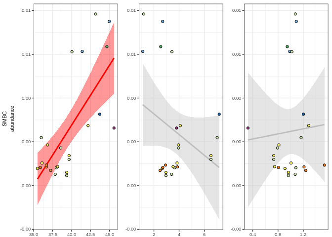

Testing relationships between genomic features and C acquisition and
growth characteristics in 13C-labeled MAGs
================
Samuel Barnett
23 August, 2022

## Introduction

The goal of this study is to identify genes that may be indicative of
bacterial life history strategies identified in Barnett et al. (2021).
This analysis will take MAGs binned from contigs that were enriched in
the 13C-treatment microcosms compared to the 12C-control microcosms.
These enriched MAGs are putatively 13C labeled and therefore likely from
an organisms that actively took up the labeled substrate. I will look to
see if genome level genomic investment in features that I predict are
indicative of life history strategies are correlated with C acquisition
and growth dynamics related to the C-S-R framework.

### Initialization

``` r
# Libraries
library(dplyr)
library(ggplot2)
library(kableExtra)


# Legend extraction function
g_legend<-function(a.gplot){
  tmp <- ggplot_gtable(ggplot_build(a.gplot))
  leg <- which(sapply(tmp$grobs, function(x) x$name) == "guide-box")
  legend <- tmp$grobs[[leg]]
  return(legend)}

# Color scheme function from Paul Tol colors
source("/home/sam/new_repo/paul_tol_colors.R")

# Handy dataframes and lists including read depths and treatment name levels for ordering
read.depths = data.frame(Microcosm = c("Control_Day01", "Control_Day06", "Control_Day14", "Control_Day30", "Control_Day48",
                                       "Glucose_Day01", "Xylose_Day06", "Glucose_Day14", "Glycerol_Day14", 
                                       "Cellulose_Day30", "PalmiticAcid_Day30", "PalmiticAcid_Day48", "Vanillin_Day48"),
                         n_reads = c(600398782, 537771884, 778966874, 1279583274, 1326945180, 
                                     818866782, 750644734, 662897402, 685015110, 707180514, 632500566, 602121814, 548508008))

treatment.list = c("Glucose_Day01", "Xylose_Day06", "Glucose_Day14", "Glycerol_Day14", 
                   "Cellulose_Day30", "PalmiticAcid_Day30", "PalmiticAcid_Day48", "Vanillin_Day48")

treat.read.depths = data.frame(Substrate = c("Glucose", "Xylose", "Glucose", "Glycerol", "Cellulose", "PalmiticAcid", "PalmiticAcid", "Vanillin"),
                               Day = c(1, 6, 14, 14, 30, 30, 48, 48),
                               n_reads = c(818866782, 750644734, 662897402, 685015110, 707180514, 632500566, 602121814, 548508008))

treatment_levels = c("Glucose Day 1", "Xylose Day 6", "Glucose Day 14", "Glycerol Day 14", 
                     "Cellulose Day 30", "PalmiticAcid Day 30", "PalmiticAcid Day 48", "Vanillin Day 48")
```

### Data import and merging

#### Bin IDs with quality from metaWRAP/checkM

``` r
# Import Bins qualities. There is a separate stats file for each run of metawrap (each treatment)
bins_quality.df = data.frame()
for (treat in treatment.list){
  bin_file = paste("/home/sam/FullCyc_metagenome/enriched_binning/", treat, "/", treat, "_metaWRAP_refinement/metawrap_50_10_bins.stats", sep="")
  sub.bins_quality.df = read.table(bin_file, sep="\t", header=TRUE, stringsAsFactors = FALSE) %>%
    mutate(Bin_treatment = treat)
  bins_quality.df = rbind(bins_quality.df, sub.bins_quality.df)
}

bins_quality.df = bins_quality.df %>%
  rename(Bin_number = bin) %>%
  mutate(Bin_treatment = factor(Bin_treatment, levels=treatment.list),
         BinID = paste(Bin_treatment, Bin_number, sep="_")) %>%
  arrange(Bin_treatment, Bin_number)

bins_quality.df$BinID = factor(bins_quality.df$BinID, levels=bins_quality.df$BinID)

# How do they look?
kable(bins_quality.df %>% arrange(-completeness))
```

<table>

<thead>

<tr>

<th style="text-align:left;">

Bin\_number

</th>

<th style="text-align:right;">

completeness

</th>

<th style="text-align:right;">

contamination

</th>

<th style="text-align:right;">

GC

</th>

<th style="text-align:left;">

lineage

</th>

<th style="text-align:right;">

N50

</th>

<th style="text-align:right;">

size

</th>

<th style="text-align:left;">

binner

</th>

<th style="text-align:left;">

Bin\_treatment

</th>

<th style="text-align:left;">

BinID

</th>

</tr>

</thead>

<tbody>

<tr>

<td style="text-align:left;">

bin.1

</td>

<td style="text-align:right;">

82.04

</td>

<td style="text-align:right;">

2.954

</td>

<td style="text-align:right;">

0.690

</td>

<td style="text-align:left;">

Alphaproteobacteria

</td>

<td style="text-align:right;">

4254

</td>

<td style="text-align:right;">

4366217

</td>

<td style="text-align:left;">

binsA

</td>

<td style="text-align:left;">

PalmiticAcid\_Day30

</td>

<td style="text-align:left;">

PalmiticAcid\_Day30\_bin.1

</td>

</tr>

<tr>

<td style="text-align:left;">

bin.7

</td>

<td style="text-align:right;">

81.73

</td>

<td style="text-align:right;">

3.925

</td>

<td style="text-align:right;">

0.686

</td>

<td style="text-align:left;">

Burkholderiales

</td>

<td style="text-align:right;">

4407

</td>

<td style="text-align:right;">

4075940

</td>

<td style="text-align:left;">

binsA

</td>

<td style="text-align:left;">

PalmiticAcid\_Day30

</td>

<td style="text-align:left;">

PalmiticAcid\_Day30\_bin.7

</td>

</tr>

<tr>

<td style="text-align:left;">

bin.5

</td>

<td style="text-align:right;">

73.62

</td>

<td style="text-align:right;">

2.088

</td>

<td style="text-align:right;">

0.692

</td>

<td style="text-align:left;">

Alphaproteobacteria

</td>

<td style="text-align:right;">

4430

</td>

<td style="text-align:right;">

3859047

</td>

<td style="text-align:left;">

binsAB

</td>

<td style="text-align:left;">

Cellulose\_Day30

</td>

<td style="text-align:left;">

Cellulose\_Day30\_bin.5

</td>

</tr>

<tr>

<td style="text-align:left;">

bin.8

</td>

<td style="text-align:right;">

70.96

</td>

<td style="text-align:right;">

2.239

</td>

<td style="text-align:right;">

0.483

</td>

<td style="text-align:left;">

Cytophagales

</td>

<td style="text-align:right;">

3661

</td>

<td style="text-align:right;">

4434296

</td>

<td style="text-align:left;">

binsC

</td>

<td style="text-align:left;">

Cellulose\_Day30

</td>

<td style="text-align:left;">

Cellulose\_Day30\_bin.8

</td>

</tr>

<tr>

<td style="text-align:left;">

bin.4

</td>

<td style="text-align:right;">

70.58

</td>

<td style="text-align:right;">

2.492

</td>

<td style="text-align:right;">

0.685

</td>

<td style="text-align:left;">

Burkholderiales

</td>

<td style="text-align:right;">

4886

</td>

<td style="text-align:right;">

3420765

</td>

<td style="text-align:left;">

binsAC

</td>

<td style="text-align:left;">

PalmiticAcid\_Day48

</td>

<td style="text-align:left;">

PalmiticAcid\_Day48\_bin.4

</td>

</tr>

<tr>

<td style="text-align:left;">

bin.1

</td>

<td style="text-align:right;">

67.50

</td>

<td style="text-align:right;">

0.429

</td>

<td style="text-align:right;">

0.723

</td>

<td style="text-align:left;">

Streptomycetaceae

</td>

<td style="text-align:right;">

3397

</td>

<td style="text-align:right;">

5070684

</td>

<td style="text-align:left;">

binsA

</td>

<td style="text-align:left;">

Glucose\_Day14

</td>

<td style="text-align:left;">

Glucose\_Day14\_bin.1

</td>

</tr>

<tr>

<td style="text-align:left;">

bin.3

</td>

<td style="text-align:right;">

66.94

</td>

<td style="text-align:right;">

1.120

</td>

<td style="text-align:right;">

0.567

</td>

<td style="text-align:left;">

Bacteria

</td>

<td style="text-align:right;">

5962

</td>

<td style="text-align:right;">

2371627

</td>

<td style="text-align:left;">

binsA

</td>

<td style="text-align:left;">

PalmiticAcid\_Day30

</td>

<td style="text-align:left;">

PalmiticAcid\_Day30\_bin.3

</td>

</tr>

<tr>

<td style="text-align:left;">

bin.4

</td>

<td style="text-align:right;">

65.29

</td>

<td style="text-align:right;">

0.445

</td>

<td style="text-align:right;">

0.687

</td>

<td style="text-align:left;">

Bacteria

</td>

<td style="text-align:right;">

4960

</td>

<td style="text-align:right;">

5752728

</td>

<td style="text-align:left;">

binsBC

</td>

<td style="text-align:left;">

Cellulose\_Day30

</td>

<td style="text-align:left;">

Cellulose\_Day30\_bin.4

</td>

</tr>

<tr>

<td style="text-align:left;">

bin.1

</td>

<td style="text-align:right;">

64.24

</td>

<td style="text-align:right;">

0.429

</td>

<td style="text-align:right;">

0.720

</td>

<td style="text-align:left;">

Streptomycetaceae

</td>

<td style="text-align:right;">

3424

</td>

<td style="text-align:right;">

4879381

</td>

<td style="text-align:left;">

binsA

</td>

<td style="text-align:left;">

Glycerol\_Day14

</td>

<td style="text-align:left;">

Glycerol\_Day14\_bin.1

</td>

</tr>

<tr>

<td style="text-align:left;">

bin.9

</td>

<td style="text-align:right;">

63.84

</td>

<td style="text-align:right;">

2.427

</td>

<td style="text-align:right;">

0.515

</td>

<td style="text-align:left;">

Alphaproteobacteria

</td>

<td style="text-align:right;">

2531

</td>

<td style="text-align:right;">

1828537

</td>

<td style="text-align:left;">

binsC

</td>

<td style="text-align:left;">

PalmiticAcid\_Day30

</td>

<td style="text-align:left;">

PalmiticAcid\_Day30\_bin.9

</td>

</tr>

<tr>

<td style="text-align:left;">

bin.2

</td>

<td style="text-align:right;">

63.29

</td>

<td style="text-align:right;">

1.778

</td>

<td style="text-align:right;">

0.476

</td>

<td style="text-align:left;">

Bacteroidetes

</td>

<td style="text-align:right;">

5042

</td>

<td style="text-align:right;">

3297795

</td>

<td style="text-align:left;">

binsAC

</td>

<td style="text-align:left;">

Cellulose\_Day30

</td>

<td style="text-align:left;">

Cellulose\_Day30\_bin.2

</td>

</tr>

<tr>

<td style="text-align:left;">

bin.5

</td>

<td style="text-align:right;">

62.17

</td>

<td style="text-align:right;">

6.837

</td>

<td style="text-align:right;">

0.647

</td>

<td style="text-align:left;">

Bacteria

</td>

<td style="text-align:right;">

5998

</td>

<td style="text-align:right;">

3630963

</td>

<td style="text-align:left;">

binsABC

</td>

<td style="text-align:left;">

PalmiticAcid\_Day48

</td>

<td style="text-align:left;">

PalmiticAcid\_Day48\_bin.5

</td>

</tr>

<tr>

<td style="text-align:left;">

bin.9

</td>

<td style="text-align:right;">

62.08

</td>

<td style="text-align:right;">

1.689

</td>

<td style="text-align:right;">

0.593

</td>

<td style="text-align:left;">

Bacteria

</td>

<td style="text-align:right;">

4706

</td>

<td style="text-align:right;">

3323408

</td>

<td style="text-align:left;">

binsAC

</td>

<td style="text-align:left;">

Cellulose\_Day30

</td>

<td style="text-align:left;">

Cellulose\_Day30\_bin.9

</td>

</tr>

<tr>

<td style="text-align:left;">

bin.1

</td>

<td style="text-align:right;">

62.04

</td>

<td style="text-align:right;">

1.754

</td>

<td style="text-align:right;">

0.626

</td>

<td style="text-align:left;">

Bacteria

</td>

<td style="text-align:right;">

2359

</td>

<td style="text-align:right;">

3937790

</td>

<td style="text-align:left;">

binsC

</td>

<td style="text-align:left;">

Xylose\_Day06

</td>

<td style="text-align:left;">

Xylose\_Day06\_bin.1

</td>

</tr>

<tr>

<td style="text-align:left;">

bin.6

</td>

<td style="text-align:right;">

59.80

</td>

<td style="text-align:right;">

1.754

</td>

<td style="text-align:right;">

0.733

</td>

<td style="text-align:left;">

Bacteria

</td>

<td style="text-align:right;">

3138

</td>

<td style="text-align:right;">

4907122

</td>

<td style="text-align:left;">

binsAB

</td>

<td style="text-align:left;">

Cellulose\_Day30

</td>

<td style="text-align:left;">

Cellulose\_Day30\_bin.6

</td>

</tr>

<tr>

<td style="text-align:left;">

bin.1

</td>

<td style="text-align:right;">

58.17

</td>

<td style="text-align:right;">

2.891

</td>

<td style="text-align:right;">

0.652

</td>

<td style="text-align:left;">

Burkholderia

</td>

<td style="text-align:right;">

1790

</td>

<td style="text-align:right;">

4164767

</td>

<td style="text-align:left;">

binsC

</td>

<td style="text-align:left;">

Glucose\_Day01

</td>

<td style="text-align:left;">

Glucose\_Day01\_bin.1

</td>

</tr>

<tr>

<td style="text-align:left;">

bin.10

</td>

<td style="text-align:right;">

54.70

</td>

<td style="text-align:right;">

0.000

</td>

<td style="text-align:right;">

0.641

</td>

<td style="text-align:left;">

Bacteria

</td>

<td style="text-align:right;">

3760

</td>

<td style="text-align:right;">

3490843

</td>

<td style="text-align:left;">

binsABC

</td>

<td style="text-align:left;">

Cellulose\_Day30

</td>

<td style="text-align:left;">

Cellulose\_Day30\_bin.10

</td>

</tr>

<tr>

<td style="text-align:left;">

bin.3

</td>

<td style="text-align:right;">

52.79

</td>

<td style="text-align:right;">

8.771

</td>

<td style="text-align:right;">

0.687

</td>

<td style="text-align:left;">

Bacteria

</td>

<td style="text-align:right;">

4151

</td>

<td style="text-align:right;">

3861705

</td>

<td style="text-align:left;">

binsABC

</td>

<td style="text-align:left;">

PalmiticAcid\_Day48

</td>

<td style="text-align:left;">

PalmiticAcid\_Day48\_bin.3

</td>

</tr>

<tr>

<td style="text-align:left;">

bin.1

</td>

<td style="text-align:right;">

52.77

</td>

<td style="text-align:right;">

0.974

</td>

<td style="text-align:right;">

0.674

</td>

<td style="text-align:left;">

Deltaproteobacteria

</td>

<td style="text-align:right;">

3185

</td>

<td style="text-align:right;">

7050262

</td>

<td style="text-align:left;">

binsC

</td>

<td style="text-align:left;">

Vanillin\_Day48

</td>

<td style="text-align:left;">

Vanillin\_Day48\_bin.1

</td>

</tr>

<tr>

<td style="text-align:left;">

bin.1

</td>

<td style="text-align:right;">

52.37

</td>

<td style="text-align:right;">

1.072

</td>

<td style="text-align:right;">

0.727

</td>

<td style="text-align:left;">

Streptomycetaceae

</td>

<td style="text-align:right;">

3398

</td>

<td style="text-align:right;">

4045674

</td>

<td style="text-align:left;">

binsA

</td>

<td style="text-align:left;">

Cellulose\_Day30

</td>

<td style="text-align:left;">

Cellulose\_Day30\_bin.1

</td>

</tr>

<tr>

<td style="text-align:left;">

bin.6

</td>

<td style="text-align:right;">

52.34

</td>

<td style="text-align:right;">

1.602

</td>

<td style="text-align:right;">

0.488

</td>

<td style="text-align:left;">

Cytophagales

</td>

<td style="text-align:right;">

4169

</td>

<td style="text-align:right;">

3140435

</td>

<td style="text-align:left;">

binsBC

</td>

<td style="text-align:left;">

PalmiticAcid\_Day30

</td>

<td style="text-align:left;">

PalmiticAcid\_Day30\_bin.6

</td>

</tr>

<tr>

<td style="text-align:left;">

bin.4

</td>

<td style="text-align:right;">

52.29

</td>

<td style="text-align:right;">

2.599

</td>

<td style="text-align:right;">

0.479

</td>

<td style="text-align:left;">

Bacteroidetes

</td>

<td style="text-align:right;">

4953

</td>

<td style="text-align:right;">

2915177

</td>

<td style="text-align:left;">

binsBC

</td>

<td style="text-align:left;">

PalmiticAcid\_Day30

</td>

<td style="text-align:left;">

PalmiticAcid\_Day30\_bin.4

</td>

</tr>

<tr>

<td style="text-align:left;">

bin.7

</td>

<td style="text-align:right;">

52.09

</td>

<td style="text-align:right;">

3.636

</td>

<td style="text-align:right;">

0.678

</td>

<td style="text-align:left;">

Bacteria

</td>

<td style="text-align:right;">

2710

</td>

<td style="text-align:right;">

8217000

</td>

<td style="text-align:left;">

binsB

</td>

<td style="text-align:left;">

Cellulose\_Day30

</td>

<td style="text-align:left;">

Cellulose\_Day30\_bin.7

</td>

</tr>

<tr>

<td style="text-align:left;">

bin.2

</td>

<td style="text-align:right;">

52.04

</td>

<td style="text-align:right;">

6.451

</td>

<td style="text-align:right;">

0.699

</td>

<td style="text-align:left;">

Deltaproteobacteria

</td>

<td style="text-align:right;">

2716

</td>

<td style="text-align:right;">

5409766

</td>

<td style="text-align:left;">

binsAB

</td>

<td style="text-align:left;">

Glucose\_Day14

</td>

<td style="text-align:left;">

Glucose\_Day14\_bin.2

</td>

</tr>

<tr>

<td style="text-align:left;">

bin.1

</td>

<td style="text-align:right;">

51.72

</td>

<td style="text-align:right;">

1.136

</td>

<td style="text-align:right;">

0.684

</td>

<td style="text-align:left;">

Bacteria

</td>

<td style="text-align:right;">

5636

</td>

<td style="text-align:right;">

4356492

</td>

<td style="text-align:left;">

binsAC

</td>

<td style="text-align:left;">

PalmiticAcid\_Day48

</td>

<td style="text-align:left;">

PalmiticAcid\_Day48\_bin.1

</td>

</tr>

<tr>

<td style="text-align:left;">

bin.5

</td>

<td style="text-align:right;">

50.86

</td>

<td style="text-align:right;">

2.222

</td>

<td style="text-align:right;">

0.643

</td>

<td style="text-align:left;">

Bacteria

</td>

<td style="text-align:right;">

3498

</td>

<td style="text-align:right;">

4546373

</td>

<td style="text-align:left;">

binsBC

</td>

<td style="text-align:left;">

PalmiticAcid\_Day30

</td>

<td style="text-align:left;">

PalmiticAcid\_Day30\_bin.5

</td>

</tr>

<tr>

<td style="text-align:left;">

bin.2

</td>

<td style="text-align:right;">

50.35

</td>

<td style="text-align:right;">

6.666

</td>

<td style="text-align:right;">

0.646

</td>

<td style="text-align:left;">

Bacteria

</td>

<td style="text-align:right;">

2943

</td>

<td style="text-align:right;">

4343714

</td>

<td style="text-align:left;">

binsBC

</td>

<td style="text-align:left;">

PalmiticAcid\_Day48

</td>

<td style="text-align:left;">

PalmiticAcid\_Day48\_bin.2

</td>

</tr>

</tbody>

</table>

#### Contigs found in each bin

``` r
# Get list of contigs from each bin
bins.df = data.frame()
for (treat in treatment.list){
  bin_file = paste("/home/sam/FullCyc_metagenome/enriched_binning/", treat, "/", treat, "_metaWRAP_refinement/metawrap_50_10_bins.contigs", sep="")
  sub.bins = read.table(bin_file, sep="\t", header=FALSE, stringsAsFactors = FALSE) %>%
    rename(contigName = V1, BinID = V2) %>%
    mutate(Bin_treatment = treat,
           Bin_number = BinID) %>%
    mutate(BinID = paste(Bin_treatment, Bin_number, sep="_"))
  bins.df = rbind(bins.df, sub.bins)
  sub.bins = NULL
}
```

#### Bin coverage across all samples

``` r
## Get contig coverages for the contigs found in the bins (Calculated using metabat's method)
coverages.df = read.table("/home/sam/FullCyc_metagenome/binning_1000/metabat/FullCyc_1000_depths.txt",
                          header=TRUE, sep="\t", stringsAsFactors = FALSE) %>%
  filter(contigName %in% unique(bins.df$contigName)) %>%
  rename(Control_Day01 = Control_Day1_mapped.sorted.bam,
         Control_Day06 = Control_Day6_mapped.sorted.bam, 
         Control_Day14 = Control_Day14_mapped.sorted.bam,
         Control_Day30 = Control_Day30_mapped.sorted.bam, 
         Control_Day48 = Control_Day48_mapped.sorted.bam, 
         Glucose_Day01  = Glucose_Day1_mapped.sorted.bam, 
         Xylose_Day06 = Xylose_Day6_mapped.sorted.bam,
         Glucose_Day14 = Glucose_Day14_mapped.sorted.bam, 
         Glycerol_Day14 = Glycerol_Day14_mapped.sorted.bam,
         Cellulose_Day30 = Cellulose_Day30_mapped.sorted.bam, 
         PalmiticAcid_Day30 = PalmiticAcid_Day30_mapped.sorted.bam,
         PalmiticAcid_Day48 = PalmiticAcid_Day48_mapped.sorted.bam, 
         Vanillin_Day48 = Vanillin_Day48_mapped.sorted.bam) %>%
  select(contigName, contigLen, Control_Day01, Control_Day06, Control_Day14, Control_Day30, Control_Day48, 
         Glucose_Day01, Xylose_Day06, Glucose_Day14, Glycerol_Day14, 
         Cellulose_Day30, PalmiticAcid_Day30, PalmiticAcid_Day48, Vanillin_Day48) %>%
  tidyr::gather(key=Microcosm, value=Coverage, -contigName, -contigLen) %>%
  left_join(read.depths, by="Microcosm") %>%
  mutate(norm_coverage = (Coverage/n_reads)*500000000) %>%
  select(contigName, contigLen, Microcosm, norm_coverage) %>%
  mutate(Sample_type = ifelse(grepl("Control", Microcosm), "Control", "Treatment"))

# Calculate coverage fold change between control and treatments
con_cov.df = coverages.df %>%
  filter(Sample_type == "Control") %>%
  rename(Control_cov = norm_coverage) %>%
  mutate(Day = as.numeric(as.character(gsub("Control_Day", "", Microcosm)))) %>%
  select(contigName, Day, Control_cov)

contig_cov_diff.df = coverages.df %>%
  filter(Sample_type == "Treatment") %>%
  rename(Treatment_cov = norm_coverage) %>%
  tidyr::separate(Microcosm, into=c("Substrate", "Day"), sep="_Day", convert=TRUE) %>%
  select(contigName, contigLen, Substrate, Day, Treatment_cov) %>%
  left_join(con_cov.df, by=c("contigName", "Day")) %>%
  mutate(FC_cov = Treatment_cov/Control_cov)

# Clean up environment
coverages.df = NULL
con_cov.df = NULL
```

Merge coverages with bin IDs

``` r
# Merge contig coverage dataframe with dataframe linking contigs to bins
bin_contig_cov.df = contig_cov_diff.df %>%
  inner_join(bins.df, by="contigName")

# Clean up environment
contig_cov_diff.df = NULL
```

#### Bin taxonomy from GTDBtk

``` r
# I had to split up the GTDBtk runs so I need a list to get the directories where the results are from
GTDBtk_directories = c("Glucose_Day01", "Xylose_Day06", "Glucose_Day14", "Glycerol_Day14", 
                       "Cellulose_Day30_S1", "Cellulose_Day30_S2", "Cellulose_Day30_S3", "Cellulose_Day30_S4",
                       "PalmiticAcid_Day30_S1", "PalmiticAcid_Day30_S2", "PalmiticAcid_Day30_S3", "PalmiticAcid_Day30_S4",
                       "PalmiticAcid_Day48", "Vanillin_Day48")

# get the taxonomy dataframes and merge them all together
bin_tax_full.df = data.frame()
for (dir in GTDBtk_directories){
  sub.tax = read.table(paste("/home/sam/FullCyc_metagenome/enriched_binning/taxonomy_GTDBtk/",
                             dir, "/classify/gtdbtk.bac120.summary.tsv", sep=""), 
                       header=TRUE, sep="\t", stringsAsFactors = FALSE) %>%
    rename(Bin_number = user_genome) %>%
    mutate(Bin_treatment = gsub("_S.", "", dir)) %>%
    mutate(BinID = paste(Bin_treatment, Bin_number, sep="_"))
  bin_tax_full.df = rbind(bin_tax_full.df, sub.tax)
  sub.tax = NULL
}
kable(bin_tax_full.df)
```

<table>

<thead>

<tr>

<th style="text-align:left;">

Bin\_number

</th>

<th style="text-align:left;">

classification

</th>

<th style="text-align:left;">

fastani\_reference

</th>

<th style="text-align:left;">

fastani\_reference\_radius

</th>

<th style="text-align:left;">

fastani\_taxonomy

</th>

<th style="text-align:left;">

fastani\_ani

</th>

<th style="text-align:left;">

fastani\_af

</th>

<th style="text-align:left;">

closest\_placement\_reference

</th>

<th style="text-align:left;">

closest\_placement\_radius

</th>

<th style="text-align:left;">

closest\_placement\_taxonomy

</th>

<th style="text-align:left;">

closest\_placement\_ani

</th>

<th style="text-align:left;">

closest\_placement\_af

</th>

<th style="text-align:left;">

pplacer\_taxonomy

</th>

<th style="text-align:left;">

classification\_method

</th>

<th style="text-align:left;">

note

</th>

<th style="text-align:left;">

other\_related\_references.genome\_id.species\_name.radius.ANI.AF.

</th>

<th style="text-align:right;">

aa\_percent

</th>

<th style="text-align:right;">

translation\_table

</th>

<th style="text-align:left;">

red\_value

</th>

<th style="text-align:left;">

warnings

</th>

<th style="text-align:left;">

Bin\_treatment

</th>

<th style="text-align:left;">

BinID

</th>

</tr>

</thead>

<tbody>

<tr>

<td style="text-align:left;">

bin.1

</td>

<td style="text-align:left;">

d\_\_Bacteria;p\_\_Proteobacteria;c\_\_Gammaproteobacteria;o\_\_Burkholderiales;f\_\_Burkholderiaceae;g\_\_Caballeronia;s\_\_Caballeronia
glathei

</td>

<td style="text-align:left;">

GCF\_000698595.1

</td>

<td style="text-align:left;">

95

</td>

<td style="text-align:left;">

d\_\_Bacteria;p\_\_Proteobacteria;c\_\_Gammaproteobacteria;o\_\_Burkholderiales;f\_\_Burkholderiaceae;g\_\_Caballeronia;s\_\_Caballeronia
glathei

</td>

<td style="text-align:left;">

99.47

</td>

<td style="text-align:left;">

0.98

</td>

<td style="text-align:left;">

GCF\_000698595.1

</td>

<td style="text-align:left;">

95

</td>

<td style="text-align:left;">

d\_\_Bacteria;p\_\_Proteobacteria;c\_\_Gammaproteobacteria;o\_\_Burkholderiales;f\_\_Burkholderiaceae;g\_\_Caballeronia;s\_\_Caballeronia
glathei

</td>

<td style="text-align:left;">

99.47

</td>

<td style="text-align:left;">

0.98

</td>

<td style="text-align:left;">

d\_\_Bacteria;p\_\_Proteobacteria;c\_\_Gammaproteobacteria;o\_\_Burkholderiales;f\_\_Burkholderiaceae;g**Caballeronia;s**

</td>

<td style="text-align:left;">

taxonomic classification defined by topology and ANI

</td>

<td style="text-align:left;">

topological placement and ANI have congruent species assignments

</td>

<td style="text-align:left;">

GCF\_001544535.1, s\_\_Caballeronia choica, 95.0, 86.37, 0.75;
GCF\_001544495.1, s\_\_Caballeronia telluris, 95.0, 85.87, 0.78;
GCF\_001544975.2, s\_\_Caballeronia arationis, 95.0, 85.83, 0.77;
GCF\_001544515.1, s\_\_Caballeronia terrestris, 95.0, 85.76, 0.74;
GCF\_001544475.1, s\_\_Caballeronia humi, 95.0, 85.75, 0.74;
GCF\_900258035.1, s\_\_Caballeronia novacaledonica, 95.0, 84.08, 0.73;
GCF\_001545075.1, s\_\_Caballeronia ptereochthonis, 95.0, 84.02, 0.74;
GCF\_001544595.1, s\_\_Caballeronia peredens, 95.0, 83.95, 0.73;
GCF\_001544575.2, s\_\_Caballeronia cordobensis, 95.0, 83.89, 0.78;
GCF\_900044055.2, s\_\_Caballeronia calidae, 95.0, 83.85, 0.78;
GCA\_001189335.2, s\_\_Caballeronia schumannianae\_A, 95.0, 83.83, 0.34;
GCF\_000648925.1, s\_\_Caballeronia jiangsuensis, 95.0, 83.82, 0.77;
GCF\_001580565.1, s\_\_Caballeronia megalochromosomata, 95.0, 83.81,
0.73; GCA\_001189345.1, s\_\_Caballeronia kirkii\_B, 95.0, 83.77, 0.56;
GCF\_001544835.2, s\_\_Caballeronia fortuita, 95.0, 83.61, 0.74;
GCF\_000402035.1, s\_\_Caballeronia insecticola, 95.0, 83.59, 0.75;
GCF\_001544695.2, s\_\_Caballeronia arvi, 95.0, 83.54, 0.78;
GCF\_001544915.2, s\_\_Caballeronia pedi, 95.0, 83.52, 0.77;
GCF\_001544795.2, s\_\_Caballeronia temeraria, 95.0, 83.43, 0.74;
GCF\_001544875.2, s\_\_Caballeronia hypogeia, 95.0, 83.43, 0.75;
GCF\_001544615.1, s\_\_Caballeronia concitans, 95.0, 83.43, 0.73;
GCF\_001544755.2, s\_\_Caballeronia catudaia, 95.0, 83.38, 0.75;
GCF\_001544655.2, s\_\_Caballeronia turbans, 95.0, 83.32, 0.76;
GCF\_000698575.1, s\_\_Caballeronia zhejiangensis, 95.0, 83.32, 0.75;
GCF\_001545035.1, s\_\_Caballeronia glebae, 95.0, 83.28, 0.76;
GCF\_000698555.1, s\_\_Caballeronia grimmiae, 95.0, 83.22, 0.69;
GCF\_001189365.1, s\_\_Caballeronia verschuerenii, 95.0, 82.26, 0.61;
GCA\_001184395.1, s\_\_Caballeronia calva, 95.0, 82.26, 0.46;
GCA\_001235855.1, s\_\_Caballeronia brachyanthoides, 95.0, 81.86, 0.44;
GCA\_001184405.1, s\_\_Caballeronia humilis, 95.0, 81.81, 0.52;
GCF\_001028175.1, s\_\_Caballeronia mineralivorans, 95.0, 81.69, 0.59;
GCF\_001557535.2, s\_\_Caballeronia sp001557535, 95.0, 81.32, 0.59;
GCF\_001544555.2, s\_\_Caballeronia udeis, 95.0, 81.27, 0.61;
GCF\_001544455.2, s\_\_Caballeronia sordidicola\_B, 95.0, 81.24, 0.55;
GCF\_001424345.1, s\_\_Caballeronia sp001424345, 95.0, 81.23, 0.61;
GCA\_001190015.1, s\_\_Caballeronia crenata, 95.0, 81.13, 0.29;
GCF\_000729995.1, s\_\_Caballeronia sordidicola\_A, 95.0, 80.92, 0.61;
GCF\_002220365.1, s\_\_Caballeronia sordidicola\_C, 95.0, 80.58, 0.6;
GCA\_001045575.1, s\_\_Caballeronia pumila, 95.0, 80.53,
0.41

</td>

<td style="text-align:right;">

37.10

</td>

<td style="text-align:right;">

11

</td>

<td style="text-align:left;">

N/A

</td>

<td style="text-align:left;">

N/A

</td>

<td style="text-align:left;">

Glucose\_Day01

</td>

<td style="text-align:left;">

Glucose\_Day01\_bin.1

</td>

</tr>

<tr>

<td style="text-align:left;">

bin.1

</td>

<td style="text-align:left;">

d\_\_Bacteria;p\_\_Proteobacteria;c\_\_Gammaproteobacteria;o\_\_Pseudomonadales;f\_\_Pseudomonadaceae;g**Pseudomonas\_E;s**

</td>

<td style="text-align:left;">

N/A

</td>

<td style="text-align:left;">

N/A

</td>

<td style="text-align:left;">

N/A

</td>

<td style="text-align:left;">

N/A

</td>

<td style="text-align:left;">

N/A

</td>

<td style="text-align:left;">

N/A

</td>

<td style="text-align:left;">

N/A

</td>

<td style="text-align:left;">

N/A

</td>

<td style="text-align:left;">

N/A

</td>

<td style="text-align:left;">

N/A

</td>

<td style="text-align:left;">

d\_\_Bacteria;p\_\_Proteobacteria;c\_\_Gammaproteobacteria;o\_\_Pseudomonadales;f\_\_Pseudomonadaceae;g**Pseudomonas\_E;s**

</td>

<td style="text-align:left;">

taxonomic classification defined by topology and ANI

</td>

<td style="text-align:left;">

N/A

</td>

<td style="text-align:left;">

GCF\_900536025.1, s\_\_Pseudomonas\_E reidholzensis, 95.0, 86.44, 0.86;
GCF\_003097235.1, s\_\_Pseudomonas\_E sp003097235, 95.0, 84.8, 0.78;
GCA\_002438125.1, s\_\_Pseudomonas\_E sp002438125, 95.0, 84.78, 0.78;
GCF\_000621225.1, s\_\_Pseudomonas\_E mosselii, 95.0, 84.77, 0.8;
GCF\_003205295.1, s\_\_Pseudomonas\_E mosselii\_B, 95.0, 84.76, 0.81;
GCF\_000026105.1, s\_\_Pseudomonas\_E entomophila, 95.0, 84.75, 0.79;
GCF\_001259595.1, s\_\_Pseudomonas\_E sp001259595, 95.0, 84.74, 0.84;
GCF\_003231305.1, s\_\_Pseudomonas\_E sp003231305, 95.0, 84.63, 0.81;
GCF\_002112505.1, s\_\_Pseudomonas\_E sp002112505, 95.0, 84.61, 0.83;
GCF\_002113165.1, s\_\_Pseudomonas\_E sp002113165, 95.0, 84.5, 0.78;
GCF\_002906855.1, s\_\_Pseudomonas\_E putida\_N, 95.0, 84.44, 0.79;
GCF\_001642705.1, s\_\_Pseudomonas\_E sp001642705, 95.0, 84.43, 0.78;
GCF\_002843585.1, s\_\_Pseudomonas\_E sp002843585, 95.0, 84.3, 0.77;
GCF\_004519305.1, s\_\_Pseudomonas\_E sp004519305, 95.0, 84.29, 0.8;
GCF\_900110655.1, s\_\_Pseudomonas\_E soli, 95.0, 84.29, 0.82;
GCF\_000731675.1, s\_\_Pseudomonas\_E capeferrum, 95.0, 84.25, 0.8;
GCF\_000510285.1, s\_\_Pseudomonas\_E asiatica, 95.0, 84.25, 0.82;
GCF\_002025705.1, s\_\_Pseudomonas\_E putida\_J, 95.0, 84.23, 0.81;
GCF\_000708715.2, s\_\_Pseudomonas\_E putida\_R, 95.0, 84.23, 0.81;
GCF\_003331055.1, s\_\_Pseudomonas\_E sp003331055, 95.0, 84.22, 0.76;
GCF\_000935045.1, s\_\_Pseudomonas\_E sp000935045, 95.0, 84.22, 0.8;
GCF\_002113295.1, s\_\_Pseudomonas\_E sp002113295, 95.0, 84.22, 0.82;
GCF\_000412675.1, s\_\_Pseudomonas\_E putida, 95.0, 84.2, 0.79;
GCF\_000730665.1, s\_\_Pseudomonas\_E plecoglossicida, 95.0, 84.17,
0.76; GCF\_002165135.1, s\_\_Pseudomonas\_E sp002165135, 95.0, 84.16,
0.76; GCF\_003263425.1, s\_\_Pseudomonas\_E inefficax, 95.0, 84.15, 0.8;
GCF\_002094795.1, s\_\_Pseudomonas\_E putida\_K, 95.0, 84.09, 0.74;
GCF\_005080685.1, s\_\_Pseudomonas\_E putida\_V, 95.0, 84.05, 0.82;
GCF\_000498395.2, s\_\_Pseudomonas\_E putida\_Q, 95.0, 84.05, 0.8;
GCF\_000282535.1, s\_\_Pseudomonas\_E sp000282535, 95.0, 84.03, 0.78;
GCF\_000019125.1, s\_\_Pseudomonas\_E putida\_P, 95.0, 84.02, 0.77;
GCA\_003428805.1, s\_\_Pseudomonas\_E sp003428805, 95.0, 84.02, 0.79;
GCF\_001320245.1, s\_\_Pseudomonas\_E sp001320245, 95.0, 83.99, 0.79;
GCF\_000730605.1, s\_\_Pseudomonas\_E monteilii, 95.0, 83.93, 0.78;
GCF\_002736125.1, s\_\_Pseudomonas\_E putida\_M, 95.0, 83.93, 0.81;
GCF\_003205205.1, s\_\_Pseudomonas\_E sp003205205, 95.0, 83.7, 0.75;
GCF\_002356095.1, s\_\_Pseudomonas\_E putida\_H, 95.0, 83.67, 0.8;
GCF\_000425785.1, s\_\_Pseudomonas\_E taiwanensis, 95.0, 83.66, 0.73;
GCF\_001320525.1, s\_\_Pseudomonas\_E sp001320525, 95.0, 83.65, 0.76;
GCF\_002741075.1, s\_\_Pseudomonas\_E putida\_T, 95.0, 83.62, 0.75;
GCF\_001636055.1, s\_\_Pseudomonas\_E putida\_B, 95.0, 83.6, 0.82;
GCF\_003627215.1, s\_\_Pseudomonas\_E sp001422615, 95.0, 83.56, 0.77;
GCF\_000019445.1, s\_\_Pseudomonas\_E putida\_E, 95.0, 83.52, 0.77;
GCA\_002386445.1, s\_\_Pseudomonas\_E sp002386445, 95.0, 83.49, 0.75;
GCF\_003671955.1, s\_\_Pseudomonas\_E hunanensis, 95.0, 83.47, 0.76;
GCF\_900102675.1, s\_\_Pseudomonas\_E guariconensis, 95.0, 83.44, 0.74;
GCF\_005796105.1, s\_\_Pseudomonas\_E mosselii\_C, 95.0, 83.21, 0.73;
GCF\_004357765.1, s\_\_Pseudomonas\_E putida\_U, 95.0, 83.2, 0.76;
GCF\_002927165.1, s\_\_Pseudomonas\_E aeruginosa\_A, 95.0, 83.1, 0.74;
GCF\_900101695.1, s\_\_Pseudomonas\_E sp900101695, 95.0, 82.78, 0.76;
GCF\_900497695.1, s\_\_Pseudomonas\_E wadenswilerensis, 95.0, 82.65,
0.77; GCF\_000800255.1, s\_\_Pseudomonas\_E parafulva\_A, 95.0, 82.6,
0.69; GCF\_000800615.1, s\_\_Pseudomonas\_E putida\_F, 95.0, 82.58,
0.76; GCF\_900188455.1, s\_\_Pseudomonas\_E japonica, 95.0, 82.58, 0.69;
GCF\_003105155.1, s\_\_Pseudomonas\_E sp003105155, 95.0, 82.39, 0.64;
GCA\_002434265.1, s\_\_Pseudomonas\_E sp002434265, 95.0, 82.33, 0.6;
GCA\_003523465.1, s\_\_Pseudomonas\_E sp003523465, 95.0, 82.29, 0.38;
GCA\_003445295.1, s\_\_Pseudomonas\_E sp003445295, 95.0, 82.29, 0.34;
GCF\_000259195.1, s\_\_Pseudomonas\_E donghuensis, 95.0, 82.26, 0.77;
GCF\_000425745.1, s\_\_Pseudomonas\_E cremoricolorata, 95.0, 82.25,
0.62; GCF\_900187455.1, s\_\_Pseudomonas\_E sp900187455, 95.0, 82.23,
0.69; GCF\_000746525.1, s\_\_Pseudomonas\_E alkylphenolica, 95.0, 82.2,
0.68; GCF\_001319945.1, s\_\_Pseudomonas\_E monteilii\_C, 95.0, 82.19,
0.66; GCF\_001941965.1, s\_\_Pseudomonas\_E putida\_L, 95.0, 82.18,
0.71; GCF\_004214895.1, s\_\_Pseudomonas\_E sp004214895, 95.0, 82.13,
0.74; GCF\_003231275.1, s\_\_Pseudomonas\_E sp003231275, 95.0, 82.01,
0.68; GCF\_000730645.1, s\_\_Pseudomonas\_E parafulva, 95.0, 82.01,
0.68; GCF\_001320045.1, s\_\_Pseudomonas\_E sp001320045, 95.0, 81.97,
0.75; GCF\_000425805.1, s\_\_Pseudomonas\_E vranovensis, 95.0, 81.9,
0.68; GCF\_000319305.1, s\_\_Pseudomonas\_E putida\_C, 95.0, 81.89,
0.66; GCF\_000759535.1, s\_\_Pseudomonas\_E cremoricolorata\_A, 95.0,
81.81, 0.61; GCF\_004025535.1, s\_\_Pseudomonas\_E alkylphenolica\_A,
95.0, 81.8, 0.67; GCF\_003024385.1, s\_\_Pseudomonas\_E sp003024385,
95.0, 81.7, 0.62; GCF\_002021815.1, s\_\_Pseudomonas\_E parafulva\_B,
95.0, 81.62, 0.56; GCF\_001534745.1, s\_\_Pseudomonas\_E monteilii\_A,
95.0, 81.39, 0.55; GCF\_000730565.1, s\_\_Pseudomonas\_E fulva, 95.0,
81.38, 0.59; GCF\_004353925.1, s\_\_Pseudomonas\_E sp004353925, 95.0,
81.29, 0.64; GCF\_000955815.1, s\_\_Pseudomonas\_E sp000955815, 95.0,
81.08, 0.66; GCF\_002753995.1, s\_\_Pseudomonas\_E sp002753995, 95.0,
80.76, 0.53; GCF\_000820515.1, s\_\_Pseudomonas\_E batumici, 95.0,
80.35, 0.5; GCF\_004803755.1, s\_\_Pseudomonas\_E sp004803755, 95.0,
80.34, 0.6; GCF\_002018875.1, s\_\_Pseudomonas\_E sp002018875, 95.0,
80.27, 0.59; GCF\_002895165.1, s\_\_Pseudomonas\_E gingeri, 95.0, 80.26,
0.55; GCF\_000497835.1, s\_\_Pseudomonas\_E sp000497835, 95.0, 80.19,
0.61; GCF\_000263855.1, s\_\_Pseudomonas\_E sp000263855, 95.0, 80.1,
0.54; GCF\_003731765.1, s\_\_Pseudomonas\_E chlororaphis\_G, 95.0,
80.07, 0.57; GCF\_004011535.1, s\_\_Pseudomonas\_E asplenii\_A, 95.0,
80.01, 0.52; GCF\_002814235.1, s\_\_Pseudomonas\_E sp002814235, 95.0,
79.95, 0.52; GCF\_900187645.1, s\_\_Pseudomonas\_E sp900187645, 95.0,
79.7, 0.52; GCF\_900596015.1, s\_\_Pseudomonas\_E sp900596015, 95.0,
79.62, 0.4; GCA\_002379585.1, s\_\_Pseudomonas\_E sp002379585, 95.0,
79.61, 0.45; GCF\_000761155.1, s\_\_Pseudomonas\_E rhizosphaerae, 95.0,
79.43, 0.45; GCF\_900105555.1, s\_\_Pseudomonas\_E coleopterorum, 95.0,
79.42, 0.46; GCF\_003935425.1, s\_\_Pseudomonas\_E sp003935425, 95.0,
79.26, 0.44; GCF\_001698815.1, s\_\_Pseudomonas\_E syringae\_A, 95.0,
79.08, 0.39; GCF\_900585815.1, s\_\_Pseudomonas\_E sp900585815, 95.0,
78.73, 0.4; GCF\_003700275.1, s\_\_Pseudomonas\_E cichorii\_B, 95.0,
78.69, 0.42; GCF\_001705435.1, s\_\_Pseudomonas\_E graminis\_B, 95.0,
78.62, 0.41; GCF\_000416235.1, s\_\_Pseudomonas\_E sp000416235, 95.0,
78.55, 0.43; GCF\_000759445.1, s\_\_Pseudomonas\_E lutea, 95.0, 78.51,
0.34

</td>

<td style="text-align:right;">

40.75

</td>

<td style="text-align:right;">

11

</td>

<td style="text-align:left;">

0.986237178121836

</td>

<td style="text-align:left;">

Genome not assigned to closest species as it falls outside its
pre-defined ANI
radius

</td>

<td style="text-align:left;">

Xylose\_Day06

</td>

<td style="text-align:left;">

Xylose\_Day06\_bin.1

</td>

</tr>

<tr>

<td style="text-align:left;">

bin.1

</td>

<td style="text-align:left;">

d\_\_Bacteria;p\_\_Actinobacteriota;c\_\_Actinomycetia;o\_\_Streptomycetales;f\_\_Streptomycetaceae;g\_\_Streptomyces;s\_\_Streptomyces
fungicidicus\_A

</td>

<td style="text-align:left;">

GCF\_003665435.1

</td>

<td style="text-align:left;">

95.0

</td>

<td style="text-align:left;">

d\_\_Bacteria;p\_\_Actinobacteriota;c\_\_Actinomycetia;o\_\_Streptomycetales;f\_\_Streptomycetaceae;g\_\_Streptomyces;s\_\_Streptomyces
fungicidicus\_A

</td>

<td style="text-align:left;">

98.74

</td>

<td style="text-align:left;">

0.87

</td>

<td style="text-align:left;">

GCF\_003665435.1

</td>

<td style="text-align:left;">

95.0

</td>

<td style="text-align:left;">

d\_\_Bacteria;p\_\_Actinobacteriota;c\_\_Actinomycetia;o\_\_Streptomycetales;f\_\_Streptomycetaceae;g\_\_Streptomyces;s\_\_Streptomyces
fungicidicus\_A

</td>

<td style="text-align:left;">

98.74

</td>

<td style="text-align:left;">

0.87

</td>

<td style="text-align:left;">

d\_\_Bacteria;p\_\_Actinobacteriota;c\_\_Actinomycetia;o\_\_Streptomycetales;f\_\_Streptomycetaceae;g**Streptomyces;s**

</td>

<td style="text-align:left;">

taxonomic classification defined by topology and ANI

</td>

<td style="text-align:left;">

topological placement and ANI have congruent species assignments

</td>

<td style="text-align:left;">

GCF\_000721605.1, s\_\_Streptomyces sp000721605, 95.0, 91.21, 0.78;
GCF\_001905725.1, s\_\_Streptomyces sp001905725, 95.0, 91.13, 0.79;
GCF\_001279005.1, s\_\_Streptomyces caelestis, 95.0, 90.51, 0.78;
GCF\_000718785.1, s\_\_Streptomyces sp000718785, 95.0, 90.06, 0.79;
GCF\_000725125.1, s\_\_Streptomyces toyocaensis, 95.0, 89.41, 0.76;
GCF\_006782915.1, s\_\_Streptomyces calvus, 95.0, 89.35, 0.79;
GCF\_000156435.1, s\_\_Streptomyces viridosporus, 95.0, 88.61, 0.79;
GCA\_000715605.1, s\_\_Streptomyces speibonae, 95.0, 88.31, 0.75;
GCF\_000527195.1, s\_\_Streptomyces sp000527195, 95.0, 88.18, 0.76;
GCF\_900079415.1, s\_\_Streptomyces variabilis, 95.0, 88.04, 0.78;
GCF\_002899455.1, s\_\_Streptomyces sp002899455, 95.0, 87.99, 0.75;
GCF\_000686765.1, s\_\_Streptomyces thermocarboxydus, 95.0, 87.82, 0.75;
GCF\_000717315.1, s\_\_Streptomyces acidiphilus, 95.4, 87.75, 0.76;
GCF\_002154585.1, s\_\_Streptomyces pseudogriseolus, 95.0, 87.73, 0.71;
GCF\_002154465.1, s\_\_Streptomyces vinaceus\_A, 95.4, 87.42, 0.68;
GCF\_000829695.1, s\_\_Streptomyces sp000829695, 95.0, 86.98, 0.71;
GCF\_003143855.1, s\_\_Streptomyces sp003143855, 95.0, 86.95, 0.74;
GCF\_900101585.1, s\_\_Streptomyces prasinopilosus, 95.0, 86.83, 0.73;
GCF\_001418415.1, s\_\_Streptomyces hirsutus, 95.0, 86.79, 0.71;
GCF\_001419705.1, s\_\_Streptomyces prasinus, 95.0, 86.35, 0.68;
GCA\_000696115.1, s\_\_Streptomyces olindensis, 95.0, 86.12, 0.71;
GCF\_003330845.1, s\_\_Streptomyces sp003330845, 95.0, 86.05, 0.72;
GCF\_002237655.1, s\_\_Streptomyces sp002237655, 95.0, 86.0, 0.72;
GCF\_002005225.1, s\_\_Streptomyces pactum, 95.0, 85.93, 0.73;
GCF\_900236475.1, s\_\_Streptomyces chartreusis, 95.0, 85.91, 0.73;
GCF\_003671715.1, s\_\_Streptomyces sp003671715, 95.0, 85.89, 0.73;
GCF\_001905385.1, s\_\_Streptomyces sp001905385, 95.0, 85.88, 0.72;
GCF\_001270025.1, s\_\_Streptomyces azureus, 95.0, 85.83, 0.7;
GCF\_002939385.1, s\_\_Streptomyces sp002939385, 95.0, 85.81, 0.74;
GCA\_000715635.1, s\_\_Streptomyces violaceus, 95.0, 85.8, 0.71;
GCF\_000772045.1, s\_\_Streptomyces sp000772045, 95.0, 85.75, 0.73;
GCF\_000203835.1, s\_\_Streptomyces coelicolor\_A, 96.8, 85.73, 0.75;
GCF\_003947455.1, s\_\_Streptomyces sp003947455, 95.0, 85.72, 0.72;
GCF\_002005565.1, s\_\_Streptomyces sp002005565, 95.0, 85.71, 0.71;
GCF\_003369795.1, s\_\_Streptomyces sp003369795, 95.35, 85.67, 0.72;
GCF\_000415505.1, s\_\_Streptomyces afghaniensis, 95.0, 85.65, 0.71;
GCF\_000158955.1, s\_\_Streptomyces viridochromogenes\_B, 95.0, 85.64,
0.72; GCF\_001267885.1, s\_\_Streptomyces ambofaciens, 95.0, 85.63,
0.75; GCF\_002148965.1, s\_\_Streptomyces swartbergensis, 95.0, 85.62,
0.7; GCF\_003112575.1, s\_\_Streptomyces diastaticus, 95.0, 85.62, 0.73;
GCF\_000955965.1, s\_\_Streptomyces variegatus, 95.0, 85.62, 0.73;
GCA\_003248315.1, s\_\_Streptomyces sp003248315, 95.0, 85.6, 0.71;
GCA\_000720845.1, s\_\_Streptomyces sp000720845, 95.0, 85.6, 0.75;
GCF\_003112555.1, s\_\_Streptomyces coelicoflavus, 95.0, 85.59, 0.74;
GCF\_000717995.1, s\_\_Streptomyces violaceorubidus, 95.0, 85.56, 0.73;
GCF\_002150735.1, s\_\_Streptomyces africanus, 95.0, 85.56, 0.72;
GCF\_000739045.1, s\_\_Streptomyces luteus, 95.0, 85.53, 0.72;
GCF\_000717875.1, s\_\_Streptomyces sp000717875, 95.0, 85.48, 0.71;
GCF\_003112595.1, s\_\_Streptomyces rubrogriseus, 96.8, 85.47, 0.76;
GCF\_002188365.1, s\_\_Streptomyces sp002188365, 95.0, 85.47, 0.77;
GCF\_002155895.1, s\_\_Streptomyces rochei, 95.0, 85.46, 0.71;
GCF\_001013905.1, s\_\_Streptomyces leeuwenhoekii, 96.6, 85.42, 0.71;
GCF\_004364245.1, s\_\_Streptomyces sp004364245, 95.0, 85.42, 0.74;
GCF\_001660045.1, s\_\_Streptomyces parvulus, 95.0, 85.41, 0.72;
GCF\_000931445.1, s\_\_Streptomyces cyaneogriseus, 96.6, 85.39, 0.71;
GCF\_002128465.1, s\_\_Streptomyces pharetrae, 95.0, 85.26, 0.69;
GCF\_006539505.1, s\_\_Streptomyces spinoverrucosus, 95.0, 85.24, 0.69;
GCF\_001513975.1, s\_\_Streptomyces curacoi, 95.0, 85.21, 0.69;
GCF\_004187715.1, s\_\_Streptomyces sp004187715, 95.0, 85.17, 0.71;
GCF\_001905845.1, s\_\_Streptomyces sp001905845, 95.0, 85.15, 0.73;
GCF\_002291145.1, s\_\_Streptomyces sp002291145, 95.0, 85.09, 0.7;
GCF\_003208035.1, s\_\_Streptomyces actuosus, 95.0, 85.0, 0.72;
GCF\_001514265.1, s\_\_Streptomyces resistomycificus, 95.0, 84.97, 0.7;
GCF\_002920535.1, s\_\_Streptomyces sp002920535, 95.0, 84.95, 0.7;
GCF\_001279775.1, s\_\_Streptomyces sp001279775, 95.0, 84.95, 0.72;
GCF\_000719285.1, s\_\_Streptomyces bicolor, 95.0, 84.93, 0.7;
GCF\_000721235.1, s\_\_Streptomyces olivaceus, 95.0, 84.93, 0.72;
GCF\_004364215.1, s\_\_Streptomyces sp004364215, 95.0, 84.91, 0.72;
GCF\_000720805.1, s\_\_Streptomyces violaceoruber\_B, 96.83, 84.88,
0.69; GCF\_000720255.1, s\_\_Streptomyces griseus\_I, 95.0, 84.87, 0.71;
GCF\_003261055.1, s\_\_Streptomyces sp003261055, 95.0, 84.74, 0.71;
GCF\_000721105.1, s\_\_Streptomyces cellulosae, 96.83, 84.73, 0.71;
GCF\_001509795.1, s\_\_Streptomyces sp001509795, 95.0, 84.72, 0.69;
GCF\_000761215.1, s\_\_Streptomyces glaucescens, 95.0, 84.71, 0.72;
GCF\_004028635.1, s\_\_Streptomyces cyaneus, 95.0, 84.71, 0.71;
GCF\_005280195.1, s\_\_Streptomyces galbus, 95.0, 84.69, 0.71;
GCF\_000718945.1, s\_\_Streptomyces sp000718945, 95.0, 84.69, 0.71;
GCF\_003851625.1, s\_\_Streptomyces sp003851625, 95.0, 84.62, 0.74;
GCF\_001514125.1, s\_\_Streptomyces longwoodensis, 95.0, 84.57, 0.72;
GCF\_000716535.1, s\_\_Streptomyces flaveolus\_A, 95.0, 84.55, 0.7;
GCF\_002920615.1, s\_\_Streptomyces sp002920615, 95.0, 84.54, 0.7;
GCF\_002154505.1, s\_\_Streptomyces carpinensis, 95.0, 84.53, 0.67;
GCF\_004346005.1, s\_\_Streptomyces sp004346005, 95.0, 84.51, 0.72;
GCA\_000500635.1, s\_\_Streptomyces sp000500635, 95.0, 84.46, 0.67;
GCF\_000720185.1, s\_\_Streptomyces sp000720185, 95.0, 84.44, 0.69;
GCF\_003688995.1, s\_\_Streptomyces shenzhenensis, 95.0, 84.43, 0.71;
GCF\_001293595.1, s\_\_Streptomyces sp001293595, 95.0, 84.4, 0.67;
GCF\_000383935.1, s\_\_Streptomyces sp000383935, 95.0, 84.4, 0.7;
GCF\_001514055.1, s\_\_Streptomyces corchorusii, 95.0, 84.37, 0.71;
GCF\_006540305.1, s\_\_Streptomyces sp006540305, 95.0, 84.35, 0.71;
GCF\_001513965.1, s\_\_Streptomyces cellostaticus, 95.0, 84.29, 0.69;
GCF\_001542625.1, s\_\_Streptomyces griseochromogenes, 95.0, 84.25,
0.67; GCF\_003634225.1, s\_\_Streptomyces sp003634225, 95.0, 84.16,
0.68; GCF\_001280015.1, s\_\_Streptomyces sp001280015, 95.0, 84.16,
0.67; GCF\_003675325.1, s\_\_Streptomyces sp003675325, 95.0, 84.05,
0.69; GCF\_002920635.1, s\_\_Streptomyces sp002920635, 95.0, 83.9, 0.66;
GCF\_001417775.1, s\_\_Streptomyces sp001417775, 95.0, 83.8, 0.64;
GCA\_002214185.1, s\_\_Streptomyces capitiformicae, 95.0, 83.3, 0.68;
GCF\_000802245.2, s\_\_Streptomyces pluripotens, 95.0, 82.86,
0.6

</td>

<td style="text-align:right;">

48.57

</td>

<td style="text-align:right;">

11

</td>

<td style="text-align:left;">

N/A

</td>

<td style="text-align:left;">

N/A

</td>

<td style="text-align:left;">

Glucose\_Day14

</td>

<td style="text-align:left;">

Glucose\_Day14\_bin.1

</td>

</tr>

<tr>

<td style="text-align:left;">

bin.2

</td>

<td style="text-align:left;">

d\_\_Bacteria;p\_\_Myxococcota;c\_\_Polyangia;o\_\_Polyangiales;f\_\_Polyangiaceae;g**;s**

</td>

<td style="text-align:left;">

N/A

</td>

<td style="text-align:left;">

N/A

</td>

<td style="text-align:left;">

N/A

</td>

<td style="text-align:left;">

N/A

</td>

<td style="text-align:left;">

N/A

</td>

<td style="text-align:left;">

N/A

</td>

<td style="text-align:left;">

N/A

</td>

<td style="text-align:left;">

N/A

</td>

<td style="text-align:left;">

N/A

</td>

<td style="text-align:left;">

N/A

</td>

<td style="text-align:left;">

d\_\_Bacteria;p\_\_Myxococcota;c\_\_Polyangia;o\_\_Polyangiales;f\_\_Polyangiaceae;g**;s**

</td>

<td style="text-align:left;">

taxonomic novelty determined using
RED

</td>

<td style="text-align:left;">

N/A

</td>

<td style="text-align:left;">

N/A

</td>

<td style="text-align:right;">

38.06

</td>

<td style="text-align:right;">

11

</td>

<td style="text-align:left;">

0.8935830243242633

</td>

<td style="text-align:left;">

N/A

</td>

<td style="text-align:left;">

Glucose\_Day14

</td>

<td style="text-align:left;">

Glucose\_Day14\_bin.2

</td>

</tr>

<tr>

<td style="text-align:left;">

bin.1

</td>

<td style="text-align:left;">

d\_\_Bacteria;p\_\_Actinobacteriota;c\_\_Actinomycetia;o\_\_Streptomycetales;f\_\_Streptomycetaceae;g\_\_Streptomyces;s\_\_Streptomyces
fungicidicus\_A

</td>

<td style="text-align:left;">

GCF\_003665435.1

</td>

<td style="text-align:left;">

95

</td>

<td style="text-align:left;">

d\_\_Bacteria;p\_\_Actinobacteriota;c\_\_Actinomycetia;o\_\_Streptomycetales;f\_\_Streptomycetaceae;g\_\_Streptomyces;s\_\_Streptomyces
fungicidicus\_A

</td>

<td style="text-align:left;">

98.55

</td>

<td style="text-align:left;">

0.85

</td>

<td style="text-align:left;">

GCF\_003665435.1

</td>

<td style="text-align:left;">

95

</td>

<td style="text-align:left;">

d\_\_Bacteria;p\_\_Actinobacteriota;c\_\_Actinomycetia;o\_\_Streptomycetales;f\_\_Streptomycetaceae;g\_\_Streptomyces;s\_\_Streptomyces
fungicidicus\_A

</td>

<td style="text-align:left;">

98.55

</td>

<td style="text-align:left;">

0.85

</td>

<td style="text-align:left;">

d\_\_Bacteria;p\_\_Actinobacteriota;c\_\_Actinomycetia;o\_\_Streptomycetales;f\_\_Streptomycetaceae;g**Streptomyces;s**

</td>

<td style="text-align:left;">

taxonomic classification defined by topology and ANI

</td>

<td style="text-align:left;">

topological placement and ANI have congruent species assignments

</td>

<td style="text-align:left;">

GCF\_000721605.1, s\_\_Streptomyces sp000721605, 95.0, 91.21, 0.76;
GCF\_001905725.1, s\_\_Streptomyces sp001905725, 95.0, 91.02, 0.77;
GCF\_001279005.1, s\_\_Streptomyces caelestis, 95.0, 90.41, 0.76;
GCF\_000718785.1, s\_\_Streptomyces sp000718785, 95.0, 90.11, 0.76;
GCF\_000725125.1, s\_\_Streptomyces toyocaensis, 95.0, 89.38, 0.74;
GCF\_006782915.1, s\_\_Streptomyces calvus, 95.0, 89.26, 0.77;
GCF\_000156435.1, s\_\_Streptomyces viridosporus, 95.0, 88.61, 0.77;
GCA\_000715605.1, s\_\_Streptomyces speibonae, 95.0, 88.3, 0.73;
GCF\_000527195.1, s\_\_Streptomyces sp000527195, 95.0, 88.2, 0.74;
GCF\_002899455.1, s\_\_Streptomyces sp002899455, 95.0, 88.08, 0.72;
GCF\_900079415.1, s\_\_Streptomyces variabilis, 95.0, 88.03, 0.76;
GCF\_002154585.1, s\_\_Streptomyces pseudogriseolus, 95.0, 87.89, 0.69;
GCF\_000686765.1, s\_\_Streptomyces thermocarboxydus, 95.0, 87.88, 0.72;
GCF\_000717315.1, s\_\_Streptomyces acidiphilus, 95.4, 87.83, 0.74;
GCF\_002154465.1, s\_\_Streptomyces vinaceus\_A, 95.4, 87.44, 0.66;
GCF\_000829695.1, s\_\_Streptomyces sp000829695, 95.0, 86.97, 0.69;
GCF\_003143855.1, s\_\_Streptomyces sp003143855, 95.0, 86.91, 0.73;
GCF\_900101585.1, s\_\_Streptomyces prasinopilosus, 95.0, 86.77, 0.72;
GCF\_001418415.1, s\_\_Streptomyces hirsutus, 95.0, 86.74, 0.7;
GCF\_001419705.1, s\_\_Streptomyces prasinus, 95.0, 86.44, 0.66;
GCA\_000696115.1, s\_\_Streptomyces olindensis, 95.0, 86.25, 0.7;
GCF\_003330845.1, s\_\_Streptomyces sp003330845, 95.0, 86.18, 0.7;
GCF\_001905385.1, s\_\_Streptomyces sp001905385, 95.0, 86.06, 0.7;
GCF\_002939385.1, s\_\_Streptomyces sp002939385, 95.0, 86.05, 0.71;
GCF\_003671715.1, s\_\_Streptomyces sp003671715, 95.0, 86.05, 0.71;
GCF\_002237655.1, s\_\_Streptomyces sp002237655, 95.0, 85.97, 0.71;
GCF\_900236475.1, s\_\_Streptomyces chartreusis, 95.0, 85.95, 0.72;
GCF\_002005565.1, s\_\_Streptomyces sp002005565, 95.0, 85.94, 0.69;
GCF\_003369795.1, s\_\_Streptomyces sp003369795, 95.35, 85.91, 0.69;
GCF\_001270025.1, s\_\_Streptomyces azureus, 95.0, 85.89, 0.68;
GCF\_002005225.1, s\_\_Streptomyces pactum, 95.0, 85.89, 0.72;
GCF\_000772045.1, s\_\_Streptomyces sp000772045, 95.0, 85.87, 0.71;
GCF\_000203835.1, s\_\_Streptomyces coelicolor\_A, 96.8, 85.84, 0.73;
GCF\_002148965.1, s\_\_Streptomyces swartbergensis, 95.0, 85.83, 0.67;
GCF\_003947455.1, s\_\_Streptomyces sp003947455, 95.0, 85.81, 0.71;
GCA\_000715635.1, s\_\_Streptomyces violaceus, 95.0, 85.8, 0.7;
GCF\_000717995.1, s\_\_Streptomyces violaceorubidus, 95.0, 85.79, 0.7;
GCF\_000158955.1, s\_\_Streptomyces viridochromogenes\_B, 95.0, 85.76,
0.7; GCF\_002150735.1, s\_\_Streptomyces africanus, 95.0, 85.73, 0.67;
GCF\_001267885.1, s\_\_Streptomyces ambofaciens, 95.0, 85.72, 0.74;
GCF\_002188365.1, s\_\_Streptomyces sp002188365, 95.0, 85.72, 0.74;
GCF\_000415505.1, s\_\_Streptomyces afghaniensis, 95.0, 85.71, 0.69;
GCA\_000720845.1, s\_\_Streptomyces sp000720845, 95.0, 85.71, 0.73;
GCF\_000955965.1, s\_\_Streptomyces variegatus, 95.0, 85.68, 0.71;
GCF\_000717875.1, s\_\_Streptomyces sp000717875, 95.0, 85.67, 0.67;
GCF\_003112555.1, s\_\_Streptomyces coelicoflavus, 95.0, 85.66, 0.73;
GCF\_003112575.1, s\_\_Streptomyces diastaticus, 95.0, 85.63, 0.72;
GCF\_004364245.1, s\_\_Streptomyces sp004364245, 95.0, 85.62, 0.72;
GCA\_003248315.1, s\_\_Streptomyces sp003248315, 95.0, 85.6, 0.7;
GCF\_000739045.1, s\_\_Streptomyces luteus, 95.0, 85.6, 0.71;
GCF\_003112595.1, s\_\_Streptomyces rubrogriseus, 96.8, 85.57, 0.74;
GCF\_002155895.1, s\_\_Streptomyces rochei, 95.0, 85.54, 0.69;
GCF\_001660045.1, s\_\_Streptomyces parvulus, 95.0, 85.49, 0.71;
GCF\_000931445.1, s\_\_Streptomyces cyaneogriseus, 96.6, 85.41, 0.7;
GCF\_001013905.1, s\_\_Streptomyces leeuwenhoekii, 96.6, 85.38, 0.7;
GCF\_002128465.1, s\_\_Streptomyces pharetrae, 95.0, 85.31, 0.69;
GCF\_001513975.1, s\_\_Streptomyces curacoi, 95.0, 85.3, 0.67;
GCF\_006539505.1, s\_\_Streptomyces spinoverrucosus, 95.0, 85.3, 0.68;
GCF\_002291145.1, s\_\_Streptomyces sp002291145, 95.0, 85.24, 0.68;
GCF\_004187715.1, s\_\_Streptomyces sp004187715, 95.0, 85.19, 0.7;
GCF\_003208035.1, s\_\_Streptomyces actuosus, 95.0, 85.18, 0.7;
GCF\_001905845.1, s\_\_Streptomyces sp001905845, 95.0, 85.14, 0.72;
GCF\_001514265.1, s\_\_Streptomyces resistomycificus, 95.0, 85.12, 0.69;
GCF\_001279775.1, s\_\_Streptomyces sp001279775, 95.0, 85.11, 0.7;
GCF\_002920535.1, s\_\_Streptomyces sp002920535, 95.0, 85.09, 0.68;
GCF\_000721235.1, s\_\_Streptomyces olivaceus, 95.0, 85.09, 0.7;
GCF\_000720255.1, s\_\_Streptomyces griseus\_I, 95.0, 85.05, 0.68;
GCF\_000720805.1, s\_\_Streptomyces violaceoruber\_B, 96.83, 84.96,
0.68; GCF\_004364215.1, s\_\_Streptomyces sp004364215, 95.0, 84.96,
0.71; GCF\_000719285.1, s\_\_Streptomyces bicolor, 95.0, 84.95, 0.69;
GCF\_000761215.1, s\_\_Streptomyces glaucescens, 95.0, 84.88, 0.69;
GCF\_003261055.1, s\_\_Streptomyces sp003261055, 95.0, 84.84, 0.69;
GCF\_004028635.1, s\_\_Streptomyces cyaneus, 95.0, 84.82, 0.7;
GCF\_000721105.1, s\_\_Streptomyces cellulosae, 96.83, 84.8, 0.7;
GCF\_001509795.1, s\_\_Streptomyces sp001509795, 95.0, 84.79, 0.68;
GCF\_005280195.1, s\_\_Streptomyces galbus, 95.0, 84.78, 0.69;
GCF\_000718945.1, s\_\_Streptomyces sp000718945, 95.0, 84.76, 0.69;
GCF\_003851625.1, s\_\_Streptomyces sp003851625, 95.0, 84.75, 0.72;
GCF\_001514125.1, s\_\_Streptomyces longwoodensis, 95.0, 84.74, 0.7;
GCF\_002154505.1, s\_\_Streptomyces carpinensis, 95.0, 84.68, 0.65;
GCF\_004346005.1, s\_\_Streptomyces sp004346005, 95.0, 84.66, 0.7;
GCF\_000716535.1, s\_\_Streptomyces flaveolus\_A, 95.0, 84.64, 0.69;
GCF\_002920615.1, s\_\_Streptomyces sp002920615, 95.0, 84.61, 0.69;
GCF\_000720185.1, s\_\_Streptomyces sp000720185, 95.0, 84.53, 0.67;
GCF\_000383935.1, s\_\_Streptomyces sp000383935, 95.0, 84.49, 0.68;
GCF\_001514055.1, s\_\_Streptomyces corchorusii, 95.0, 84.49, 0.69;
GCF\_003688995.1, s\_\_Streptomyces shenzhenensis, 95.0, 84.48, 0.69;
GCF\_006540305.1, s\_\_Streptomyces sp006540305, 95.0, 84.47, 0.69;
GCF\_001293595.1, s\_\_Streptomyces sp001293595, 95.0, 84.46, 0.65;
GCF\_001513965.1, s\_\_Streptomyces cellostaticus, 95.0, 84.45, 0.67;
GCA\_000500635.1, s\_\_Streptomyces sp000500635, 95.0, 84.44, 0.66;
GCF\_001542625.1, s\_\_Streptomyces griseochromogenes, 95.0, 84.37,
0.66; GCF\_001280015.1, s\_\_Streptomyces sp001280015, 95.0, 84.33,
0.65; GCF\_003634225.1, s\_\_Streptomyces sp003634225, 95.0, 84.2, 0.67;
GCF\_003675325.1, s\_\_Streptomyces sp003675325, 95.0, 84.17, 0.67;
GCF\_002920635.1, s\_\_Streptomyces sp002920635, 95.0, 83.96, 0.65;
GCF\_001417775.1, s\_\_Streptomyces sp001417775, 95.0, 83.83, 0.63;
GCA\_002214185.1, s\_\_Streptomyces capitiformicae, 95.0, 83.41, 0.66;
GCF\_000802245.2, s\_\_Streptomyces pluripotens, 95.0, 82.86,
0.59

</td>

<td style="text-align:right;">

47.72

</td>

<td style="text-align:right;">

11

</td>

<td style="text-align:left;">

N/A

</td>

<td style="text-align:left;">

N/A

</td>

<td style="text-align:left;">

Glycerol\_Day14

</td>

<td style="text-align:left;">

Glycerol\_Day14\_bin.1

</td>

</tr>

<tr>

<td style="text-align:left;">

bin.1

</td>

<td style="text-align:left;">

d\_\_Bacteria;p\_\_Actinobacteriota;c\_\_Actinomycetia;o\_\_Streptomycetales;f\_\_Streptomycetaceae;g\_\_Streptomyces;s\_\_Streptomyces
fungicidicus\_A

</td>

<td style="text-align:left;">

GCF\_003665435.1

</td>

<td style="text-align:left;">

95

</td>

<td style="text-align:left;">

d\_\_Bacteria;p\_\_Actinobacteriota;c\_\_Actinomycetia;o\_\_Streptomycetales;f\_\_Streptomycetaceae;g\_\_Streptomyces;s\_\_Streptomyces
fungicidicus\_A

</td>

<td style="text-align:left;">

98.86

</td>

<td style="text-align:left;">

0.91

</td>

<td style="text-align:left;">

GCF\_003665435.1

</td>

<td style="text-align:left;">

95

</td>

<td style="text-align:left;">

d\_\_Bacteria;p\_\_Actinobacteriota;c\_\_Actinomycetia;o\_\_Streptomycetales;f\_\_Streptomycetaceae;g\_\_Streptomyces;s\_\_Streptomyces
fungicidicus\_A

</td>

<td style="text-align:left;">

98.86

</td>

<td style="text-align:left;">

0.91

</td>

<td style="text-align:left;">

d\_\_Bacteria;p\_\_Actinobacteriota;c\_\_Actinomycetia;o\_\_Streptomycetales;f\_\_Streptomycetaceae;g**Streptomyces;s**

</td>

<td style="text-align:left;">

taxonomic classification defined by topology and ANI

</td>

<td style="text-align:left;">

topological placement and ANI have congruent species assignments

</td>

<td style="text-align:left;">

GCF\_001905725.1, s\_\_Streptomyces sp001905725, 95.0, 90.99, 0.83;
GCF\_000721605.1, s\_\_Streptomyces sp000721605, 95.0, 90.87, 0.83;
GCF\_001279005.1, s\_\_Streptomyces caelestis, 95.0, 90.2, 0.82;
GCF\_000718785.1, s\_\_Streptomyces sp000718785, 95.0, 89.75, 0.83;
GCF\_000725125.1, s\_\_Streptomyces toyocaensis, 95.0, 89.06, 0.8;
GCF\_006782915.1, s\_\_Streptomyces calvus, 95.0, 89.06, 0.84;
GCF\_000156435.1, s\_\_Streptomyces viridosporus, 95.0, 88.36, 0.82;
GCA\_000715605.1, s\_\_Streptomyces speibonae, 95.0, 87.94, 0.79;
GCF\_000527195.1, s\_\_Streptomyces sp000527195, 95.0, 87.79, 0.79;
GCF\_900079415.1, s\_\_Streptomyces variabilis, 95.0, 87.5, 0.83;
GCF\_000717315.1, s\_\_Streptomyces acidiphilus, 95.4, 87.45, 0.79;
GCF\_002899455.1, s\_\_Streptomyces sp002899455, 95.0, 87.42, 0.79;
GCF\_002154585.1, s\_\_Streptomyces pseudogriseolus, 95.0, 87.27, 0.75;
GCF\_000686765.1, s\_\_Streptomyces thermocarboxydus, 95.0, 87.23, 0.79;
GCF\_002154465.1, s\_\_Streptomyces vinaceus\_A, 95.4, 87.0, 0.7;
GCF\_003143855.1, s\_\_Streptomyces sp003143855, 95.0, 86.6, 0.77;
GCF\_000829695.1, s\_\_Streptomyces sp000829695, 95.0, 86.44, 0.76;
GCF\_900101585.1, s\_\_Streptomyces prasinopilosus, 95.0, 86.37, 0.77;
GCF\_001418415.1, s\_\_Streptomyces hirsutus, 95.0, 86.33, 0.75;
GCF\_001419705.1, s\_\_Streptomyces prasinus, 95.0, 85.88, 0.71;
GCA\_000696115.1, s\_\_Streptomyces olindensis, 95.0, 85.66, 0.75;
GCF\_003330845.1, s\_\_Streptomyces sp003330845, 95.0, 85.63, 0.76;
GCF\_002005225.1, s\_\_Streptomyces pactum, 95.0, 85.6, 0.76;
GCF\_001905385.1, s\_\_Streptomyces sp001905385, 95.0, 85.46, 0.75;
GCF\_002237655.1, s\_\_Streptomyces sp002237655, 95.0, 85.45, 0.77;
GCF\_900236475.1, s\_\_Streptomyces chartreusis, 95.0, 85.43, 0.77;
GCF\_003671715.1, s\_\_Streptomyces sp003671715, 95.0, 85.42, 0.77;
GCF\_001270025.1, s\_\_Streptomyces azureus, 95.0, 85.37, 0.73;
GCF\_000203835.1, s\_\_Streptomyces coelicolor\_A, 96.8, 85.37, 0.78;
GCF\_000772045.1, s\_\_Streptomyces sp000772045, 95.0, 85.36, 0.76;
GCA\_000715635.1, s\_\_Streptomyces violaceus, 95.0, 85.35, 0.75;
GCF\_003947455.1, s\_\_Streptomyces sp003947455, 95.0, 85.34, 0.75;
GCF\_002939385.1, s\_\_Streptomyces sp002939385, 95.0, 85.29, 0.78;
GCF\_001267885.1, s\_\_Streptomyces ambofaciens, 95.0, 85.29, 0.78;
GCF\_003369795.1, s\_\_Streptomyces sp003369795, 95.35, 85.27, 0.75;
GCF\_000415505.1, s\_\_Streptomyces afghaniensis, 95.0, 85.26, 0.74;
GCF\_002005565.1, s\_\_Streptomyces sp002005565, 95.0, 85.25, 0.75;
GCF\_003112555.1, s\_\_Streptomyces coelicoflavus, 95.0, 85.19, 0.78;
GCF\_003112595.1, s\_\_Streptomyces rubrogriseus, 96.8, 85.16, 0.78;
GCA\_000720845.1, s\_\_Streptomyces sp000720845, 95.0, 85.15, 0.79;
GCF\_003112575.1, s\_\_Streptomyces diastaticus, 95.0, 85.15, 0.75;
GCF\_000158955.1, s\_\_Streptomyces viridochromogenes\_B, 95.0, 85.15,
0.76; GCF\_002188365.1, s\_\_Streptomyces sp002188365, 95.0, 85.09,
0.81; GCF\_002150735.1, s\_\_Streptomyces africanus, 95.0, 85.08, 0.77;
GCF\_000955965.1, s\_\_Streptomyces variegatus, 95.0, 85.07, 0.78;
GCF\_002148965.1, s\_\_Streptomyces swartbergensis, 95.0, 85.06, 0.75;
GCF\_000717995.1, s\_\_Streptomyces violaceorubidus, 95.0, 85.05, 0.76;
GCF\_000739045.1, s\_\_Streptomyces luteus, 95.0, 85.05, 0.76;
GCA\_003248315.1, s\_\_Streptomyces sp003248315, 95.0, 85.03, 0.75;
GCF\_002155895.1, s\_\_Streptomyces rochei, 95.0, 84.92, 0.74;
GCF\_004364245.1, s\_\_Streptomyces sp004364245, 95.0, 84.9, 0.78;
GCF\_001013905.1, s\_\_Streptomyces leeuwenhoekii, 96.6, 84.89, 0.74;
GCF\_001660045.1, s\_\_Streptomyces parvulus, 95.0, 84.88, 0.76;
GCF\_000717875.1, s\_\_Streptomyces sp000717875, 95.0, 84.86, 0.77;
GCF\_000931445.1, s\_\_Streptomyces cyaneogriseus, 96.6, 84.82, 0.74;
GCF\_001513975.1, s\_\_Streptomyces curacoi, 95.0, 84.7, 0.72;
GCF\_002128465.1, s\_\_Streptomyces pharetrae, 95.0, 84.68, 0.73;
GCF\_001905845.1, s\_\_Streptomyces sp001905845, 95.0, 84.68, 0.77;
GCF\_002291145.1, s\_\_Streptomyces sp002291145, 95.0, 84.6, 0.73;
GCF\_004187715.1, s\_\_Streptomyces sp004187715, 95.0, 84.6, 0.75;
GCF\_006539505.1, s\_\_Streptomyces spinoverrucosus, 95.0, 84.57, 0.73;
GCF\_001514265.1, s\_\_Streptomyces resistomycificus, 95.0, 84.54, 0.73;
GCF\_002920535.1, s\_\_Streptomyces sp002920535, 95.0, 84.52, 0.72;
GCF\_000720255.1, s\_\_Streptomyces griseus\_I, 95.0, 84.48, 0.73;
GCF\_001279775.1, s\_\_Streptomyces sp001279775, 95.0, 84.47, 0.75;
GCF\_003208035.1, s\_\_Streptomyces actuosus, 95.0, 84.42, 0.77;
GCF\_004364215.1, s\_\_Streptomyces sp004364215, 95.0, 84.4, 0.75;
GCF\_000720805.1, s\_\_Streptomyces violaceoruber\_B, 96.83, 84.36,
0.72; GCF\_000719285.1, s\_\_Streptomyces bicolor, 95.0, 84.36, 0.73;
GCF\_000721235.1, s\_\_Streptomyces olivaceus, 95.0, 84.29, 0.77;
GCF\_000721105.1, s\_\_Streptomyces cellulosae, 96.83, 84.21, 0.74;
GCF\_000718945.1, s\_\_Streptomyces sp000718945, 95.0, 84.2, 0.73;
GCF\_003261055.1, s\_\_Streptomyces sp003261055, 95.0, 84.2, 0.74;
GCF\_003851625.1, s\_\_Streptomyces sp003851625, 95.0, 84.18, 0.78;
GCF\_004028635.1, s\_\_Streptomyces cyaneus, 95.0, 84.18, 0.75;
GCF\_005280195.1, s\_\_Streptomyces galbus, 95.0, 84.18, 0.75;
GCF\_001514125.1, s\_\_Streptomyces longwoodensis, 95.0, 84.14, 0.75;
GCF\_004346005.1, s\_\_Streptomyces sp004346005, 95.0, 84.13, 0.75;
GCF\_000761215.1, s\_\_Streptomyces glaucescens, 95.0, 84.1, 0.75;
GCF\_001509795.1, s\_\_Streptomyces sp001509795, 95.0, 84.1, 0.72;
GCF\_002920615.1, s\_\_Streptomyces sp002920615, 95.0, 84.09, 0.73;
GCF\_000716535.1, s\_\_Streptomyces flaveolus\_A, 95.0, 83.95, 0.74;
GCF\_002154505.1, s\_\_Streptomyces carpinensis, 95.0, 83.94, 0.69;
GCF\_000720185.1, s\_\_Streptomyces sp000720185, 95.0, 83.93, 0.71;
GCF\_003688995.1, s\_\_Streptomyces shenzhenensis, 95.0, 83.92, 0.73;
GCF\_006540305.1, s\_\_Streptomyces sp006540305, 95.0, 83.91, 0.73;
GCF\_000383935.1, s\_\_Streptomyces sp000383935, 95.0, 83.9, 0.73;
GCF\_001514055.1, s\_\_Streptomyces corchorusii, 95.0, 83.9, 0.74;
GCA\_000500635.1, s\_\_Streptomyces sp000500635, 95.0, 83.83, 0.71;
GCF\_001293595.1, s\_\_Streptomyces sp001293595, 95.0, 83.77, 0.71;
GCF\_001513965.1, s\_\_Streptomyces cellostaticus, 95.0, 83.71, 0.72;
GCF\_001542625.1, s\_\_Streptomyces griseochromogenes, 95.0, 83.68, 0.7;
GCF\_001280015.1, s\_\_Streptomyces sp001280015, 95.0, 83.62, 0.69;
GCF\_003675325.1, s\_\_Streptomyces sp003675325, 95.0, 83.56, 0.72;
GCF\_003634225.1, s\_\_Streptomyces sp003634225, 95.0, 83.49, 0.71;
GCF\_002920635.1, s\_\_Streptomyces sp002920635, 95.0, 83.35, 0.68;
GCF\_001417775.1, s\_\_Streptomyces sp001417775, 95.0, 83.25, 0.66;
GCA\_002214185.1, s\_\_Streptomyces capitiformicae, 95.0, 82.81, 0.7;
GCF\_000802245.2, s\_\_Streptomyces pluripotens, 95.0, 82.26,
0.62

</td>

<td style="text-align:right;">

39.60

</td>

<td style="text-align:right;">

11

</td>

<td style="text-align:left;">

N/A

</td>

<td style="text-align:left;">

N/A

</td>

<td style="text-align:left;">

Cellulose\_Day30

</td>

<td style="text-align:left;">

Cellulose\_Day30\_bin.1

</td>

</tr>

<tr>

<td style="text-align:left;">

bin.2

</td>

<td style="text-align:left;">

d\_\_Bacteria;p\_\_Bacteroidota;c\_\_Bacteroidia;o\_\_Chitinophagales;f\_\_Chitinophagaceae;g\_\_Flavihumibacter;s\_\_Flavihumibacter
solisilvae

</td>

<td style="text-align:left;">

GCF\_000814475.1

</td>

<td style="text-align:left;">

95

</td>

<td style="text-align:left;">

d\_\_Bacteria;p\_\_Bacteroidota;c\_\_Bacteroidia;o\_\_Chitinophagales;f\_\_Chitinophagaceae;g\_\_Flavihumibacter;s\_\_Flavihumibacter
solisilvae

</td>

<td style="text-align:left;">

97.07

</td>

<td style="text-align:left;">

0.97

</td>

<td style="text-align:left;">

GCF\_000814475.1

</td>

<td style="text-align:left;">

95

</td>

<td style="text-align:left;">

d\_\_Bacteria;p\_\_Bacteroidota;c\_\_Bacteroidia;o\_\_Chitinophagales;f\_\_Chitinophagaceae;g\_\_Flavihumibacter;s\_\_Flavihumibacter
solisilvae

</td>

<td style="text-align:left;">

97.07

</td>

<td style="text-align:left;">

0.97

</td>

<td style="text-align:left;">

d\_\_Bacteria;p\_\_Bacteroidota;c\_\_Bacteroidia;o\_\_Chitinophagales;f\_\_Chitinophagaceae;g**Flavihumibacter;s**

</td>

<td style="text-align:left;">

taxonomic classification defined by topology and ANI

</td>

<td style="text-align:left;">

topological placement and ANI have congruent species assignments

</td>

<td style="text-align:left;">

GCF\_000814325.1, s\_\_Flavihumibacter sp000814325, 95.0, 77.12, 0.13;
GCF\_000974785.1, s\_\_Flavihumibacter petaseus, 95.0, 77.11, 0.16;
GCA\_001601815.1, s\_\_Flavihumibacter sp001601815, 95.0, 77.1, 0.11;
GCA\_002483205.1, s\_\_Flavihumibacter sp002483205, 95.0, 76.99, 0.12;
GCA\_004295245.1, s\_\_Flavihumibacter sp004295245, 95.0, 75.89,
0.02

</td>

<td style="text-align:right;">

53.95

</td>

<td style="text-align:right;">

11

</td>

<td style="text-align:left;">

N/A

</td>

<td style="text-align:left;">

N/A

</td>

<td style="text-align:left;">

Cellulose\_Day30

</td>

<td style="text-align:left;">

Cellulose\_Day30\_bin.2

</td>

</tr>

<tr>

<td style="text-align:left;">

bin.7

</td>

<td style="text-align:left;">

d\_\_Bacteria;p\_\_Myxococcota;c\_\_Myxococcia;o\_\_Myxococcales;f\_\_Myxococcaceae;g**Hyalangium;s**

</td>

<td style="text-align:left;">

N/A

</td>

<td style="text-align:left;">

N/A

</td>

<td style="text-align:left;">

N/A

</td>

<td style="text-align:left;">

N/A

</td>

<td style="text-align:left;">

N/A

</td>

<td style="text-align:left;">

GCF\_000737315.1

</td>

<td style="text-align:left;">

95.0

</td>

<td style="text-align:left;">

d\_\_Bacteria;p\_\_Myxococcota;c\_\_Myxococcia;o\_\_Myxococcales;f\_\_Myxococcaceae;g\_\_Hyalangium;s\_\_Hyalangium
minutum

</td>

<td style="text-align:left;">

83.64

</td>

<td style="text-align:left;">

0.77

</td>

<td style="text-align:left;">

d\_\_Bacteria;p\_\_Myxococcota;c\_\_Myxococcia;o\_\_Myxococcales;f\_\_Myxococcaceae;g**;s**

</td>

<td style="text-align:left;">

taxonomic classification defined by topology and ANI

</td>

<td style="text-align:left;">

N/A

</td>

<td style="text-align:left;">

N/A

</td>

<td style="text-align:right;">

42.70

</td>

<td style="text-align:right;">

11

</td>

<td style="text-align:left;">

0.972444885604999

</td>

<td style="text-align:left;">

Genome not assigned to closest species as it falls outside its
pre-defined ANI
radius

</td>

<td style="text-align:left;">

Cellulose\_Day30

</td>

<td style="text-align:left;">

Cellulose\_Day30\_bin.7

</td>

</tr>

<tr>

<td style="text-align:left;">

bin.10

</td>

<td style="text-align:left;">

d\_\_Bacteria;p\_\_Planctomycetota;c\_\_Planctomycetes;o\_\_Planctomycetales;f\_\_Planctomycetaceae;g**;s**

</td>

<td style="text-align:left;">

N/A

</td>

<td style="text-align:left;">

N/A

</td>

<td style="text-align:left;">

N/A

</td>

<td style="text-align:left;">

N/A

</td>

<td style="text-align:left;">

N/A

</td>

<td style="text-align:left;">

N/A

</td>

<td style="text-align:left;">

N/A

</td>

<td style="text-align:left;">

N/A

</td>

<td style="text-align:left;">

N/A

</td>

<td style="text-align:left;">

N/A

</td>

<td style="text-align:left;">

d\_\_Bacteria;p\_\_Planctomycetota;c\_\_Planctomycetes;o\_\_Planctomycetales;f\_\_Planctomycetaceae;g**;s**

</td>

<td style="text-align:left;">

taxonomic classification fully defined by
topology

</td>

<td style="text-align:left;">

N/A

</td>

<td style="text-align:left;">

N/A

</td>

<td style="text-align:right;">

42.06

</td>

<td style="text-align:right;">

11

</td>

<td style="text-align:left;">

0.835318281561375

</td>

<td style="text-align:left;">

N/A

</td>

<td style="text-align:left;">

Cellulose\_Day30

</td>

<td style="text-align:left;">

Cellulose\_Day30\_bin.10

</td>

</tr>

<tr>

<td style="text-align:left;">

bin.5

</td>

<td style="text-align:left;">

d\_\_Bacteria;p\_\_Proteobacteria;c\_\_Alphaproteobacteria;o\_\_Caulobacterales;f\_\_Caulobacteraceae;g\_\_Caulobacter;s\_\_Caulobacter
radicis

</td>

<td style="text-align:left;">

GCF\_003094615.1

</td>

<td style="text-align:left;">

95.07

</td>

<td style="text-align:left;">

d\_\_Bacteria;p\_\_Proteobacteria;c\_\_Alphaproteobacteria;o\_\_Caulobacterales;f\_\_Caulobacteraceae;g\_\_Caulobacter;s\_\_Caulobacter
radicis

</td>

<td style="text-align:left;">

95.9

</td>

<td style="text-align:left;">

0.97

</td>

<td style="text-align:left;">

GCF\_003094615.1

</td>

<td style="text-align:left;">

95.07

</td>

<td style="text-align:left;">

d\_\_Bacteria;p\_\_Proteobacteria;c\_\_Alphaproteobacteria;o\_\_Caulobacterales;f\_\_Caulobacteraceae;g\_\_Caulobacter;s\_\_Caulobacter
radicis

</td>

<td style="text-align:left;">

95.9

</td>

<td style="text-align:left;">

0.97

</td>

<td style="text-align:left;">

d\_\_Bacteria;p\_\_Proteobacteria;c\_\_Alphaproteobacteria;o\_\_Caulobacterales;f\_\_Caulobacteraceae;g**Caulobacter;s**

</td>

<td style="text-align:left;">

taxonomic classification defined by topology and ANI

</td>

<td style="text-align:left;">

topological placement and ANI have congruent species assignments

</td>

<td style="text-align:left;">

GCF\_002858925.1, s\_\_Caulobacter zeae, 95.07, 94.45, 0.94;
GCF\_001449105.1, s\_\_Caulobacter vibrioides\_C, 95.0, 92.99, 0.9;
GCF\_003722335.1, s\_\_Caulobacter flavus, 95.0, 92.64, 0.92;
GCF\_003116815.1, s\_\_Caulobacter sp003116815, 95.0, 92.04, 0.89;
GCF\_003185805.1, s\_\_Caulobacter sp003185805, 95.0, 89.86, 0.79;
GCF\_900114015.1, s\_\_Caulobacter sp900114015, 95.0, 83.98, 0.69;
GCF\_000712075.1, s\_\_Caulobacter sp000712075, 95.0, 83.97, 0.72;
GCF\_000426025.1, s\_\_Caulobacter sp000426025, 95.0, 83.89, 0.71;
GCF\_000745545.1, s\_\_Caulobacter henricii\_C, 95.0, 83.85, 0.74;
GCF\_000281955.1, s\_\_Caulobacter sp000281955, 95.0, 83.82, 0.69;
GCF\_001426905.1, s\_\_Caulobacter sp001426905, 95.0, 83.68, 0.67;
GCF\_004342605.1, s\_\_Caulobacter sp004342605, 95.0, 83.67, 0.7;
GCF\_001427665.1, s\_\_Caulobacter sp001427665, 95.0, 83.66, 0.7;
GCF\_001426985.1, s\_\_Caulobacter sp001426985, 95.0, 83.62, 0.72;
GCF\_000799245.1, s\_\_Caulobacter sp000799245, 95.0, 83.54, 0.7;
GCF\_003931565.1, s\_\_Caulobacter sp003931565, 95.0, 83.27, 0.67;
GCF\_002742625.1, s\_\_Caulobacter sp002742625, 95.0, 83.26, 0.65;
GCF\_000744465.1, s\_\_Caulobacter henricii\_A, 95.0, 83.11, 0.68;
GCF\_000019145.1, s\_\_Caulobacter sp000019145, 95.0, 83.06, 0.65;
GCF\_002742635.1, s\_\_Caulobacter sp002742635, 95.0, 82.93, 0.63;
GCF\_000092285.1, s\_\_Caulobacter segnis, 95.0, 82.91, 0.63;
GCF\_001556515.1, s\_\_Caulobacter sp001556515, 95.0, 82.81, 0.59;
GCF\_000372645.1, s\_\_Caulobacter vibrioides\_E, 95.0, 82.8, 0.61;
GCA\_003243465.1, s\_\_Caulobacter segnis\_A, 95.0, 82.72, 0.66;
GCF\_002858865.1, s\_\_Caulobacter vibrioides, 95.0, 82.52, 0.58;
GCF\_002737755.1, s\_\_Caulobacter sp002737755, 95.0, 82.46, 0.61;
GCA\_002310375.2, s\_\_Caulobacter vibrioides\_D, 95.0, 82.36, 0.6;
GCA\_002280875.1, s\_\_Caulobacter sp002280875, 95.0, 82.14, 0.55;
GCF\_002742645.2, s\_\_Caulobacter sp002742645, 95.0, 81.87, 0.61;
GCF\_002737765.1, s\_\_Caulobacter sp002737765, 95.0, 81.85, 0.42;
GCA\_002280275.1, s\_\_Caulobacter vibrioides\_A, 95.0, 81.76, 0.5;
GCF\_003060965.1, s\_\_Caulobacter sp003060965, 95.0, 81.55, 0.54;
GCF\_001414055.1, s\_\_Caulobacter henricii, 95.0, 81.33, 0.53;
GCF\_002749615.1, s\_\_Caulobacter mirabilis, 95.0, 79.77, 0.49;
GCA\_004144935.1, s\_\_Caulobacter sp004144935, 95.0, 79.25, 0.36;
GCA\_001896875.1, s\_\_Caulobacter sp001896875, 95.0, 79.14,
0.32

</td>

<td style="text-align:right;">

49.92

</td>

<td style="text-align:right;">

11

</td>

<td style="text-align:left;">

N/A

</td>

<td style="text-align:left;">

N/A

</td>

<td style="text-align:left;">

Cellulose\_Day30

</td>

<td style="text-align:left;">

Cellulose\_Day30\_bin.5

</td>

</tr>

<tr>

<td style="text-align:left;">

bin.6

</td>

<td style="text-align:left;">

d\_\_Bacteria;p\_\_Myxococcota;c\_\_Polyangia;o\_\_Haliangiales;f\_\_Haliangiaceae;g**;s**

</td>

<td style="text-align:left;">

N/A

</td>

<td style="text-align:left;">

N/A

</td>

<td style="text-align:left;">

N/A

</td>

<td style="text-align:left;">

N/A

</td>

<td style="text-align:left;">

N/A

</td>

<td style="text-align:left;">

N/A

</td>

<td style="text-align:left;">

N/A

</td>

<td style="text-align:left;">

N/A

</td>

<td style="text-align:left;">

N/A

</td>

<td style="text-align:left;">

N/A

</td>

<td style="text-align:left;">

d\_\_Bacteria;p\_\_Myxococcota;c\_\_Polyangia;o\_\_Haliangiales;f\_\_Haliangiaceae;g**;s**

</td>

<td style="text-align:left;">

taxonomic novelty determined using
RED

</td>

<td style="text-align:left;">

N/A

</td>

<td style="text-align:left;">

N/A

</td>

<td style="text-align:right;">

41.63

</td>

<td style="text-align:right;">

11

</td>

<td style="text-align:left;">

0.8759174617514325

</td>

<td style="text-align:left;">

N/A

</td>

<td style="text-align:left;">

Cellulose\_Day30

</td>

<td style="text-align:left;">

Cellulose\_Day30\_bin.6

</td>

</tr>

<tr>

<td style="text-align:left;">

bin.9

</td>

<td style="text-align:left;">

d\_\_Bacteria;p\_\_Verrucomicrobiota;c\_\_Verrucomicrobiae;o\_\_Chthoniobacterales;f\_\_Terrimicrobiaceae;g**Terrimicrobium;s**

</td>

<td style="text-align:left;">

N/A

</td>

<td style="text-align:left;">

N/A

</td>

<td style="text-align:left;">

N/A

</td>

<td style="text-align:left;">

N/A

</td>

<td style="text-align:left;">

N/A

</td>

<td style="text-align:left;">

N/A

</td>

<td style="text-align:left;">

N/A

</td>

<td style="text-align:left;">

N/A

</td>

<td style="text-align:left;">

N/A

</td>

<td style="text-align:left;">

N/A

</td>

<td style="text-align:left;">

d\_\_Bacteria;p\_\_Verrucomicrobiota;c\_\_Verrucomicrobiae;o\_\_Chthoniobacterales;f\_\_Terrimicrobiaceae;g**;s**

</td>

<td style="text-align:left;">

taxonomic novelty determined using
RED

</td>

<td style="text-align:left;">

N/A

</td>

<td style="text-align:left;">

N/A

</td>

<td style="text-align:right;">

45.50

</td>

<td style="text-align:right;">

11

</td>

<td style="text-align:left;">

0.8931220709881702

</td>

<td style="text-align:left;">

N/A

</td>

<td style="text-align:left;">

Cellulose\_Day30

</td>

<td style="text-align:left;">

Cellulose\_Day30\_bin.9

</td>

</tr>

<tr>

<td style="text-align:left;">

bin.8

</td>

<td style="text-align:left;">

d\_\_Bacteria;p\_\_Bacteroidota;c\_\_Bacteroidia;o\_\_Cytophagales;f\_\_Cyclobacteriaceae;g**Chryseolinea;s**

</td>

<td style="text-align:left;">

N/A

</td>

<td style="text-align:left;">

N/A

</td>

<td style="text-align:left;">

N/A

</td>

<td style="text-align:left;">

N/A

</td>

<td style="text-align:left;">

N/A

</td>

<td style="text-align:left;">

N/A

</td>

<td style="text-align:left;">

N/A

</td>

<td style="text-align:left;">

N/A

</td>

<td style="text-align:left;">

N/A

</td>

<td style="text-align:left;">

N/A

</td>

<td style="text-align:left;">

d\_\_Bacteria;p\_\_Bacteroidota;c\_\_Bacteroidia;o\_\_Cytophagales;f\_\_Cyclobacteriaceae;g**;s**

</td>

<td style="text-align:left;">

taxonomic novelty determined using
RED

</td>

<td style="text-align:left;">

N/A

</td>

<td style="text-align:left;">

N/A

</td>

<td style="text-align:right;">

66.23

</td>

<td style="text-align:right;">

11

</td>

<td style="text-align:left;">

0.941964496823888

</td>

<td style="text-align:left;">

N/A

</td>

<td style="text-align:left;">

Cellulose\_Day30

</td>

<td style="text-align:left;">

Cellulose\_Day30\_bin.8

</td>

</tr>

<tr>

<td style="text-align:left;">

bin.4

</td>

<td style="text-align:left;">

d\_\_Bacteria;p\_\_Planctomycetota;c\_\_Planctomycetes;o\_\_Gemmatales;f\_\_Gemmataceae;g**Fimbriiglobus;s**

</td>

<td style="text-align:left;">

N/A

</td>

<td style="text-align:left;">

N/A

</td>

<td style="text-align:left;">

N/A

</td>

<td style="text-align:left;">

N/A

</td>

<td style="text-align:left;">

N/A

</td>

<td style="text-align:left;">

GCF\_002197845.1

</td>

<td style="text-align:left;">

95.0

</td>

<td style="text-align:left;">

d\_\_Bacteria;p\_\_Planctomycetota;c\_\_Planctomycetes;o\_\_Gemmatales;f\_\_Gemmataceae;g\_\_Fimbriiglobus;s\_\_Fimbriiglobus
ruber

</td>

<td style="text-align:left;">

77.0

</td>

<td style="text-align:left;">

0.34

</td>

<td style="text-align:left;">

d\_\_Bacteria;p\_\_Planctomycetota;c\_\_Planctomycetes;o\_\_Gemmatales;f\_\_Gemmataceae;g**;s**

</td>

<td style="text-align:left;">

taxonomic classification defined by topology and
ANI

</td>

<td style="text-align:left;">

N/A

</td>

<td style="text-align:left;">

N/A

</td>

<td style="text-align:right;">

56.45

</td>

<td style="text-align:right;">

11

</td>

<td style="text-align:left;">

0.899310689798188

</td>

<td style="text-align:left;">

N/A

</td>

<td style="text-align:left;">

Cellulose\_Day30

</td>

<td style="text-align:left;">

Cellulose\_Day30\_bin.4

</td>

</tr>

<tr>

<td style="text-align:left;">

bin.1

</td>

<td style="text-align:left;">

d\_\_Bacteria;p\_\_Proteobacteria;c\_\_Alphaproteobacteria;o\_\_Caulobacterales;f\_\_Caulobacteraceae;g\_\_Caulobacter;s\_\_Caulobacter
radicis

</td>

<td style="text-align:left;">

GCF\_003094615.1

</td>

<td style="text-align:left;">

95.07

</td>

<td style="text-align:left;">

d\_\_Bacteria;p\_\_Proteobacteria;c\_\_Alphaproteobacteria;o\_\_Caulobacterales;f\_\_Caulobacteraceae;g\_\_Caulobacter;s\_\_Caulobacter
radicis

</td>

<td style="text-align:left;">

95.79

</td>

<td style="text-align:left;">

0.94

</td>

<td style="text-align:left;">

GCF\_003094615.1

</td>

<td style="text-align:left;">

95.07

</td>

<td style="text-align:left;">

d\_\_Bacteria;p\_\_Proteobacteria;c\_\_Alphaproteobacteria;o\_\_Caulobacterales;f\_\_Caulobacteraceae;g\_\_Caulobacter;s\_\_Caulobacter
radicis

</td>

<td style="text-align:left;">

95.79

</td>

<td style="text-align:left;">

0.94

</td>

<td style="text-align:left;">

d\_\_Bacteria;p\_\_Proteobacteria;c\_\_Alphaproteobacteria;o\_\_Caulobacterales;f\_\_Caulobacteraceae;g**Caulobacter;s**

</td>

<td style="text-align:left;">

taxonomic classification defined by topology and ANI

</td>

<td style="text-align:left;">

topological placement and ANI have congruent species assignments

</td>

<td style="text-align:left;">

GCF\_002858925.1, s\_\_Caulobacter zeae, 95.07, 94.31, 0.91;
GCF\_001449105.1, s\_\_Caulobacter vibrioides\_C, 95.0, 92.9, 0.86;
GCF\_003722335.1, s\_\_Caulobacter flavus, 95.0, 92.5, 0.88;
GCF\_003116815.1, s\_\_Caulobacter sp003116815, 95.0, 91.91, 0.85;
GCF\_003185805.1, s\_\_Caulobacter sp003185805, 95.0, 89.69, 0.76;
GCF\_000712075.1, s\_\_Caulobacter sp000712075, 95.0, 83.88, 0.7;
GCF\_900114015.1, s\_\_Caulobacter sp900114015, 95.0, 83.86, 0.66;
GCF\_000745545.1, s\_\_Caulobacter henricii\_C, 95.0, 83.84, 0.71;
GCF\_000281955.1, s\_\_Caulobacter sp000281955, 95.0, 83.83, 0.66;
GCF\_000426025.1, s\_\_Caulobacter sp000426025, 95.0, 83.8, 0.68;
GCF\_001426905.1, s\_\_Caulobacter sp001426905, 95.0, 83.68, 0.64;
GCF\_004342605.1, s\_\_Caulobacter sp004342605, 95.0, 83.66, 0.67;
GCF\_001427665.1, s\_\_Caulobacter sp001427665, 95.0, 83.63, 0.66;
GCF\_001426985.1, s\_\_Caulobacter sp001426985, 95.0, 83.53, 0.68;
GCF\_000799245.1, s\_\_Caulobacter sp000799245, 95.0, 83.48, 0.66;
GCF\_003931565.1, s\_\_Caulobacter sp003931565, 95.0, 83.3, 0.64;
GCF\_002742625.1, s\_\_Caulobacter sp002742625, 95.0, 83.24, 0.62;
GCF\_000744465.1, s\_\_Caulobacter henricii\_A, 95.0, 83.15, 0.64;
GCF\_000019145.1, s\_\_Caulobacter sp000019145, 95.0, 83.01, 0.62;
GCF\_002742635.1, s\_\_Caulobacter sp002742635, 95.0, 83.01, 0.6;
GCF\_000092285.1, s\_\_Caulobacter segnis, 95.0, 82.89, 0.6;
GCF\_001556515.1, s\_\_Caulobacter sp001556515, 95.0, 82.79, 0.57;
GCF\_000372645.1, s\_\_Caulobacter vibrioides\_E, 95.0, 82.73, 0.57;
GCA\_003243465.1, s\_\_Caulobacter segnis\_A, 95.0, 82.71, 0.63;
GCF\_002858865.1, s\_\_Caulobacter vibrioides, 95.0, 82.55, 0.56;
GCF\_002737755.1, s\_\_Caulobacter sp002737755, 95.0, 82.43, 0.59;
GCA\_002310375.2, s\_\_Caulobacter vibrioides\_D, 95.0, 82.37, 0.57;
GCA\_002280875.1, s\_\_Caulobacter sp002280875, 95.0, 82.16, 0.52;
GCF\_002737765.1, s\_\_Caulobacter sp002737765, 95.0, 81.93, 0.44;
GCF\_002742645.2, s\_\_Caulobacter sp002742645, 95.0, 81.88, 0.59;
GCA\_002280275.1, s\_\_Caulobacter vibrioides\_A, 95.0, 81.79, 0.48;
GCF\_003060965.1, s\_\_Caulobacter sp003060965, 95.0, 81.54, 0.51;
GCF\_001414055.1, s\_\_Caulobacter henricii, 95.0, 81.31, 0.51;
GCF\_002749615.1, s\_\_Caulobacter mirabilis, 95.0, 79.77, 0.47;
GCA\_004144935.1, s\_\_Caulobacter sp004144935, 95.0, 79.36, 0.34;
GCA\_001896875.1, s\_\_Caulobacter sp001896875, 95.0, 79.14,
0.3

</td>

<td style="text-align:right;">

56.55

</td>

<td style="text-align:right;">

11

</td>

<td style="text-align:left;">

N/A

</td>

<td style="text-align:left;">

N/A

</td>

<td style="text-align:left;">

PalmiticAcid\_Day30

</td>

<td style="text-align:left;">

PalmiticAcid\_Day30\_bin.1

</td>

</tr>

<tr>

<td style="text-align:left;">

bin.3

</td>

<td style="text-align:left;">

d\_\_Bacteria;p\_\_Bdellovibrionota;c\_\_UBA2394;o\_\_UBA2428;f\_\_UBA2428;g**;s**

</td>

<td style="text-align:left;">

N/A

</td>

<td style="text-align:left;">

N/A

</td>

<td style="text-align:left;">

N/A

</td>

<td style="text-align:left;">

N/A

</td>

<td style="text-align:left;">

N/A

</td>

<td style="text-align:left;">

GCA\_002343545.1

</td>

<td style="text-align:left;">

95

</td>

<td style="text-align:left;">

d\_\_Bacteria;p\_\_Bdellovibrionota;c\_\_UBA2394;o\_\_UBA2428;f\_\_UBA2428;g\_\_UBA2428;s\_\_UBA2428
sp002343545

</td>

<td style="text-align:left;">

76.17

</td>

<td style="text-align:left;">

0.04

</td>

<td style="text-align:left;">

d\_\_Bacteria;p\_\_Bdellovibrionota;c\_\_UBA2394;o**;f**;g**;s**

</td>

<td style="text-align:left;">

taxonomic classification defined by topology and
ANI

</td>

<td style="text-align:left;">

N/A

</td>

<td style="text-align:left;">

N/A

</td>

<td style="text-align:right;">

50.32

</td>

<td style="text-align:right;">

11

</td>

<td style="text-align:left;">

0.7761272957126253

</td>

<td style="text-align:left;">

N/A

</td>

<td style="text-align:left;">

PalmiticAcid\_Day30

</td>

<td style="text-align:left;">

PalmiticAcid\_Day30\_bin.3

</td>

</tr>

<tr>

<td style="text-align:left;">

bin.6

</td>

<td style="text-align:left;">

d\_\_Bacteria;p\_\_Bacteroidota;c\_\_Bacteroidia;o\_\_Cytophagales;f\_\_Cyclobacteriaceae;g**Chryseolinea;s**

</td>

<td style="text-align:left;">

N/A

</td>

<td style="text-align:left;">

N/A

</td>

<td style="text-align:left;">

N/A

</td>

<td style="text-align:left;">

N/A

</td>

<td style="text-align:left;">

N/A

</td>

<td style="text-align:left;">

N/A

</td>

<td style="text-align:left;">

N/A

</td>

<td style="text-align:left;">

N/A

</td>

<td style="text-align:left;">

N/A

</td>

<td style="text-align:left;">

N/A

</td>

<td style="text-align:left;">

d\_\_Bacteria;p\_\_Bacteroidota;c\_\_Bacteroidia;o\_\_Cytophagales;f\_\_Cyclobacteriaceae;g**;s**

</td>

<td style="text-align:left;">

taxonomic novelty determined using
RED

</td>

<td style="text-align:left;">

N/A

</td>

<td style="text-align:left;">

N/A

</td>

<td style="text-align:right;">

51.19

</td>

<td style="text-align:right;">

11

</td>

<td style="text-align:left;">

0.943966715227033

</td>

<td style="text-align:left;">

N/A

</td>

<td style="text-align:left;">

PalmiticAcid\_Day30

</td>

<td style="text-align:left;">

PalmiticAcid\_Day30\_bin.6

</td>

</tr>

<tr>

<td style="text-align:left;">

bin.5

</td>

<td style="text-align:left;">

d\_\_Bacteria;p\_\_Planctomycetota;c\_\_Planctomycetes;o\_\_Planctomycetales;f\_\_Planctomycetaceae;g**Planctomyces\_A;s**

</td>

<td style="text-align:left;">

N/A

</td>

<td style="text-align:left;">

N/A

</td>

<td style="text-align:left;">

N/A

</td>

<td style="text-align:left;">

N/A

</td>

<td style="text-align:left;">

N/A

</td>

<td style="text-align:left;">

GCF\_001610835.1

</td>

<td style="text-align:left;">

95.0

</td>

<td style="text-align:left;">

d\_\_Bacteria;p\_\_Planctomycetota;c\_\_Planctomycetes;o\_\_Planctomycetales;f\_\_Planctomycetaceae;g\_\_Planctomyces\_A;s\_\_Planctomyces\_A
sp001610835

</td>

<td style="text-align:left;">

88.2

</td>

<td style="text-align:left;">

0.3

</td>

<td style="text-align:left;">

d\_\_Bacteria;p\_\_Planctomycetota;c\_\_Planctomycetes;o\_\_Planctomycetales;f\_\_Planctomycetaceae;g**;s**

</td>

<td style="text-align:left;">

taxonomic classification defined by topology and
ANI

</td>

<td style="text-align:left;">

N/A

</td>

<td style="text-align:left;">

N/A

</td>

<td style="text-align:right;">

36.43

</td>

<td style="text-align:right;">

11

</td>

<td style="text-align:left;">

0.89444703394206

</td>

<td style="text-align:left;">

N/A

</td>

<td style="text-align:left;">

PalmiticAcid\_Day30

</td>

<td style="text-align:left;">

PalmiticAcid\_Day30\_bin.5

</td>

</tr>

<tr>

<td style="text-align:left;">

bin.4

</td>

<td style="text-align:left;">

d\_\_Bacteria;p\_\_Bacteroidota;c\_\_Bacteroidia;o\_\_Chitinophagales;f\_\_Chitinophagaceae;g\_\_Flavihumibacter;s\_\_Flavihumibacter
solisilvae

</td>

<td style="text-align:left;">

GCF\_000814475.1

</td>

<td style="text-align:left;">

95

</td>

<td style="text-align:left;">

d\_\_Bacteria;p\_\_Bacteroidota;c\_\_Bacteroidia;o\_\_Chitinophagales;f\_\_Chitinophagaceae;g\_\_Flavihumibacter;s\_\_Flavihumibacter
solisilvae

</td>

<td style="text-align:left;">

97

</td>

<td style="text-align:left;">

0.93

</td>

<td style="text-align:left;">

GCF\_000814475.1

</td>

<td style="text-align:left;">

95

</td>

<td style="text-align:left;">

d\_\_Bacteria;p\_\_Bacteroidota;c\_\_Bacteroidia;o\_\_Chitinophagales;f\_\_Chitinophagaceae;g\_\_Flavihumibacter;s\_\_Flavihumibacter
solisilvae

</td>

<td style="text-align:left;">

97

</td>

<td style="text-align:left;">

0.93

</td>

<td style="text-align:left;">

d\_\_Bacteria;p\_\_Bacteroidota;c\_\_Bacteroidia;o\_\_Chitinophagales;f\_\_Chitinophagaceae;g**Flavihumibacter;s**

</td>

<td style="text-align:left;">

taxonomic classification defined by topology and ANI

</td>

<td style="text-align:left;">

topological placement and ANI have congruent species assignments

</td>

<td style="text-align:left;">

GCF\_000814325.1, s\_\_Flavihumibacter sp000814325, 95.0, 77.32, 0.12;
GCA\_001601815.1, s\_\_Flavihumibacter sp001601815, 95.0, 77.2, 0.11;
GCF\_000974785.1, s\_\_Flavihumibacter petaseus, 95.0, 77.17, 0.16;
GCA\_002483205.1, s\_\_Flavihumibacter sp002483205, 95.0, 77.1, 0.12;
GCA\_004295245.1, s\_\_Flavihumibacter sp004295245, 95.0, 75.83,
0.02

</td>

<td style="text-align:right;">

47.30

</td>

<td style="text-align:right;">

11

</td>

<td style="text-align:left;">

N/A

</td>

<td style="text-align:left;">

N/A

</td>

<td style="text-align:left;">

PalmiticAcid\_Day30

</td>

<td style="text-align:left;">

PalmiticAcid\_Day30\_bin.4

</td>

</tr>

<tr>

<td style="text-align:left;">

bin.7

</td>

<td style="text-align:left;">

d\_\_Bacteria;p\_\_Proteobacteria;c\_\_Gammaproteobacteria;o\_\_Burkholderiales;f\_\_Burkholderiaceae;g**Hydrogenophaga;s**

</td>

<td style="text-align:left;">

N/A

</td>

<td style="text-align:left;">

N/A

</td>

<td style="text-align:left;">

N/A

</td>

<td style="text-align:left;">

N/A

</td>

<td style="text-align:left;">

N/A

</td>

<td style="text-align:left;">

GCF\_005503365.1

</td>

<td style="text-align:left;">

95.0

</td>

<td style="text-align:left;">

d\_\_Bacteria;p\_\_Proteobacteria;c\_\_Gammaproteobacteria;o\_\_Burkholderiales;f\_\_Burkholderiaceae;g\_\_Hydrogenophaga;s\_\_Hydrogenophaga
sp005503365

</td>

<td style="text-align:left;">

86.06

</td>

<td style="text-align:left;">

0.76

</td>

<td style="text-align:left;">

d\_\_Bacteria;p\_\_Proteobacteria;c\_\_Gammaproteobacteria;o\_\_Burkholderiales;f\_\_Burkholderiaceae;g**Hydrogenophaga;s**

</td>

<td style="text-align:left;">

taxonomic classification defined by topology and ANI

</td>

<td style="text-align:left;">

N/A

</td>

<td style="text-align:left;">

GCA\_003599455.1, s\_\_Hydrogenophaga sp003599455, 95.0, 87.13, 0.67;
GCF\_001571225.1, s\_\_Hydrogenophaga palleronii, 95.0, 86.73, 0.7;
GCF\_001713375.1, s\_\_Hydrogenophaga sp001713375, 95.0, 84.48, 0.65;
GCF\_001428625.1, s\_\_Hydrogenophaga sp001428625, 95.0, 84.41, 0.68;
GCF\_002127265.1, s\_\_Hydrogenophaga sp002127265, 95.0, 83.96, 0.64;
GCA\_003241965.1, s\_\_Hydrogenophaga sp003241965, 95.0, 83.92, 0.64;
GCA\_001770905.1, s\_\_Hydrogenophaga sp001770905, 95.0, 83.28, 0.62;
GCF\_001777155.1, s\_\_Hydrogenophaga sp001777155, 95.0, 83.27, 0.69;
GCF\_001592305.1, s\_\_Hydrogenophaga taeniospiralis, 95.0, 83.12, 0.64;
GCF\_002127215.1, s\_\_Hydrogenophaga sp002127215, 95.0, 83.01, 0.52;
GCF\_000723405.1, s\_\_Hydrogenophaga intermedia, 95.0, 82.97, 0.69;
GCA\_003509765.1, s\_\_Hydrogenophaga sp003509765, 95.0, 82.76, 0.59;
GCA\_002842215.1, s\_\_Hydrogenophaga sp002842215, 95.0, 82.71, 0.61;
GCF\_001592285.1, s\_\_Hydrogenophaga pseudoflava, 95.0, 82.47, 0.59;
GCF\_001571145.1, s\_\_Hydrogenophaga flava, 95.0, 82.29, 0.59;
GCF\_002001205.1, s\_\_Hydrogenophaga sp002001205, 95.0, 81.96, 0.58;
GCA\_006227825.1, s\_\_Hydrogenophaga sp006227825, 95.0, 81.21, 0.4;
GCA\_002840835.1, s\_\_Hydrogenophaga sp002840835, 95.0, 81.11, 0.54;
GCA\_006227785.1, s\_\_Hydrogenophaga sp006227785, 95.0, 80.01, 0.38;
GCF\_004795855.1, s\_\_Hydrogenophaga sp004795855, 95.0, 79.14, 0.41;
GCF\_001761385.1, s\_\_Hydrogenophaga crassostreae, 95.0, 79.11, 0.36

</td>

<td style="text-align:right;">

65.65

</td>

<td style="text-align:right;">

11

</td>

<td style="text-align:left;">

0.994043702804572

</td>

<td style="text-align:left;">

Genome not assigned to closest species as it falls outside its
pre-defined ANI
radius

</td>

<td style="text-align:left;">

PalmiticAcid\_Day30

</td>

<td style="text-align:left;">

PalmiticAcid\_Day30\_bin.7

</td>

</tr>

<tr>

<td style="text-align:left;">

bin.9

</td>

<td style="text-align:left;">

d\_\_Bacteria;p\_\_Proteobacteria;c\_\_Alphaproteobacteria;o\_\_Micavibrionales;f\_\_Micavibrionaceae;g**;s**

</td>

<td style="text-align:left;">

N/A

</td>

<td style="text-align:left;">

N/A

</td>

<td style="text-align:left;">

N/A

</td>

<td style="text-align:left;">

N/A

</td>

<td style="text-align:left;">

N/A

</td>

<td style="text-align:left;">

N/A

</td>

<td style="text-align:left;">

N/A

</td>

<td style="text-align:left;">

N/A

</td>

<td style="text-align:left;">

N/A

</td>

<td style="text-align:left;">

N/A

</td>

<td style="text-align:left;">

d\_\_Bacteria;p\_\_Proteobacteria;c\_\_Alphaproteobacteria;o\_\_Micavibrionales;f\_\_Micavibrionaceae;g**;s**

</td>

<td style="text-align:left;">

taxonomic classification fully defined by
topology

</td>

<td style="text-align:left;">

N/A

</td>

<td style="text-align:left;">

N/A

</td>

<td style="text-align:right;">

51.90

</td>

<td style="text-align:right;">

11

</td>

<td style="text-align:left;">

0.823489520730125

</td>

<td style="text-align:left;">

N/A

</td>

<td style="text-align:left;">

PalmiticAcid\_Day30

</td>

<td style="text-align:left;">

PalmiticAcid\_Day30\_bin.9

</td>

</tr>

<tr>

<td style="text-align:left;">

bin.4

</td>

<td style="text-align:left;">

d\_\_Bacteria;p\_\_Proteobacteria;c\_\_Gammaproteobacteria;o\_\_Burkholderiales;f\_\_Burkholderiaceae;g**Hydrogenophaga;s**

</td>

<td style="text-align:left;">

N/A

</td>

<td style="text-align:left;">

N/A

</td>

<td style="text-align:left;">

N/A

</td>

<td style="text-align:left;">

N/A

</td>

<td style="text-align:left;">

N/A

</td>

<td style="text-align:left;">

GCF\_005503365.1

</td>

<td style="text-align:left;">

95.0

</td>

<td style="text-align:left;">

d\_\_Bacteria;p\_\_Proteobacteria;c\_\_Gammaproteobacteria;o\_\_Burkholderiales;f\_\_Burkholderiaceae;g\_\_Hydrogenophaga;s\_\_Hydrogenophaga
sp005503365

</td>

<td style="text-align:left;">

86.11

</td>

<td style="text-align:left;">

0.76

</td>

<td style="text-align:left;">

d\_\_Bacteria;p\_\_Proteobacteria;c\_\_Gammaproteobacteria;o\_\_Burkholderiales;f\_\_Burkholderiaceae;g**Hydrogenophaga;s**

</td>

<td style="text-align:left;">

taxonomic classification defined by topology and ANI

</td>

<td style="text-align:left;">

N/A

</td>

<td style="text-align:left;">

GCA\_003599455.1, s\_\_Hydrogenophaga sp003599455, 95.0, 87.28, 0.68;
GCF\_001571225.1, s\_\_Hydrogenophaga palleronii, 95.0, 86.75, 0.72;
GCF\_001713375.1, s\_\_Hydrogenophaga sp001713375, 95.0, 84.47, 0.66;
GCF\_001428625.1, s\_\_Hydrogenophaga sp001428625, 95.0, 84.41, 0.69;
GCF\_002127265.1, s\_\_Hydrogenophaga sp002127265, 95.0, 84.0, 0.66;
GCA\_003241965.1, s\_\_Hydrogenophaga sp003241965, 95.0, 83.94, 0.65;
GCA\_001770905.1, s\_\_Hydrogenophaga sp001770905, 95.0, 83.4, 0.63;
GCF\_001777155.1, s\_\_Hydrogenophaga sp001777155, 95.0, 83.39, 0.7;
GCF\_001592305.1, s\_\_Hydrogenophaga taeniospiralis, 95.0, 83.22, 0.65;
GCF\_002127215.1, s\_\_Hydrogenophaga sp002127215, 95.0, 83.1, 0.53;
GCF\_000723405.1, s\_\_Hydrogenophaga intermedia, 95.0, 82.98, 0.69;
GCA\_002842215.1, s\_\_Hydrogenophaga sp002842215, 95.0, 82.78, 0.61;
GCA\_003509765.1, s\_\_Hydrogenophaga sp003509765, 95.0, 82.75, 0.6;
GCF\_001592285.1, s\_\_Hydrogenophaga pseudoflava, 95.0, 82.57, 0.61;
GCF\_001571145.1, s\_\_Hydrogenophaga flava, 95.0, 82.39, 0.6;
GCF\_002001205.1, s\_\_Hydrogenophaga sp002001205, 95.0, 81.93, 0.59;
GCA\_006227825.1, s\_\_Hydrogenophaga sp006227825, 95.0, 81.22, 0.41;
GCA\_002840835.1, s\_\_Hydrogenophaga sp002840835, 95.0, 81.18, 0.54;
GCA\_006227785.1, s\_\_Hydrogenophaga sp006227785, 95.0, 80.05, 0.37;
GCF\_001761385.1, s\_\_Hydrogenophaga crassostreae, 95.0, 79.1, 0.37;
GCF\_004795855.1, s\_\_Hydrogenophaga sp004795855, 95.0, 79.09, 0.42

</td>

<td style="text-align:right;">

53.49

</td>

<td style="text-align:right;">

11

</td>

<td style="text-align:left;">

0.993998527320716

</td>

<td style="text-align:left;">

Genome not assigned to closest species as it falls outside its
pre-defined ANI
radius

</td>

<td style="text-align:left;">

PalmiticAcid\_Day48

</td>

<td style="text-align:left;">

PalmiticAcid\_Day48\_bin.4

</td>

</tr>

<tr>

<td style="text-align:left;">

bin.3

</td>

<td style="text-align:left;">

d\_\_Bacteria;p\_\_Myxococcota;c\_\_Polyangia;o\_\_Haliangiales;f\_\_Haliangiaceae;g**;s**

</td>

<td style="text-align:left;">

N/A

</td>

<td style="text-align:left;">

N/A

</td>

<td style="text-align:left;">

N/A

</td>

<td style="text-align:left;">

N/A

</td>

<td style="text-align:left;">

N/A

</td>

<td style="text-align:left;">

N/A

</td>

<td style="text-align:left;">

N/A

</td>

<td style="text-align:left;">

N/A

</td>

<td style="text-align:left;">

N/A

</td>

<td style="text-align:left;">

N/A

</td>

<td style="text-align:left;">

d\_\_Bacteria;p\_\_Myxococcota;c\_\_Polyangia;o\_\_Haliangiales;f\_\_Haliangiaceae;g**;s**

</td>

<td style="text-align:left;">

taxonomic novelty determined using RED

</td>

<td style="text-align:left;">

N/A

</td>

<td style="text-align:left;">

N/A

</td>

<td style="text-align:right;">

31.92

</td>

<td style="text-align:right;">

11

</td>

<td style="text-align:left;">

0.791865424726297

</td>

<td style="text-align:left;">

Genome has more than 10.0% of markers with multiple
hits

</td>

<td style="text-align:left;">

PalmiticAcid\_Day48

</td>

<td style="text-align:left;">

PalmiticAcid\_Day48\_bin.3

</td>

</tr>

<tr>

<td style="text-align:left;">

bin.5

</td>

<td style="text-align:left;">

d\_\_Bacteria;p\_\_Acidobacteriota;c\_\_Vicinamibacteria;o\_\_Vicinamibacterales;f\_\_2-12-FULL-66-21;g**2-12-FULL-66-21;s**

</td>

<td style="text-align:left;">

N/A

</td>

<td style="text-align:left;">

N/A

</td>

<td style="text-align:left;">

N/A

</td>

<td style="text-align:left;">

N/A

</td>

<td style="text-align:left;">

N/A

</td>

<td style="text-align:left;">

GCA\_001767455.1

</td>

<td style="text-align:left;">

95.0

</td>

<td style="text-align:left;">

d\_\_Bacteria;p\_\_Acidobacteriota;c\_\_Vicinamibacteria;o\_\_Vicinamibacterales;f\_\_2-12-FULL-66-21;g\_\_2-12-FULL-66-21;s\_\_2-12-FULL-66-21
sp001767455

</td>

<td style="text-align:left;">

77.36

</td>

<td style="text-align:left;">

0.24

</td>

<td style="text-align:left;">

d\_\_Bacteria;p\_\_Acidobacteriota;c\_\_Vicinamibacteria;o\_\_Vicinamibacterales;f\_\_2-12-FULL-66-21;g**;s**

</td>

<td style="text-align:left;">

taxonomic classification defined by topology and
ANI

</td>

<td style="text-align:left;">

N/A

</td>

<td style="text-align:left;">

N/A

</td>

<td style="text-align:right;">

48.19

</td>

<td style="text-align:right;">

11

</td>

<td style="text-align:left;">

0.855412111564468

</td>

<td style="text-align:left;">

N/A

</td>

<td style="text-align:left;">

PalmiticAcid\_Day48

</td>

<td style="text-align:left;">

PalmiticAcid\_Day48\_bin.5

</td>

</tr>

<tr>

<td style="text-align:left;">

bin.2

</td>

<td style="text-align:left;">

d\_\_Bacteria;p\_\_Planctomycetota;c\_\_Planctomycetes;o\_\_Planctomycetales;f\_\_Planctomycetaceae;g**Planctomyces\_A;s**

</td>

<td style="text-align:left;">

N/A

</td>

<td style="text-align:left;">

N/A

</td>

<td style="text-align:left;">

N/A

</td>

<td style="text-align:left;">

N/A

</td>

<td style="text-align:left;">

N/A

</td>

<td style="text-align:left;">

GCF\_001610835.1

</td>

<td style="text-align:left;">

95.0

</td>

<td style="text-align:left;">

d\_\_Bacteria;p\_\_Planctomycetota;c\_\_Planctomycetes;o\_\_Planctomycetales;f\_\_Planctomycetaceae;g\_\_Planctomyces\_A;s\_\_Planctomyces\_A
sp001610835

</td>

<td style="text-align:left;">

89.04

</td>

<td style="text-align:left;">

0.34

</td>

<td style="text-align:left;">

d\_\_Bacteria;p\_\_Planctomycetota;c\_\_Planctomycetes;o\_\_Planctomycetales;f\_\_Planctomycetaceae;g**;s**

</td>

<td style="text-align:left;">

taxonomic classification defined by topology and
ANI

</td>

<td style="text-align:left;">

N/A

</td>

<td style="text-align:left;">

N/A

</td>

<td style="text-align:right;">

31.25

</td>

<td style="text-align:right;">

11

</td>

<td style="text-align:left;">

0.918321691503553

</td>

<td style="text-align:left;">

N/A

</td>

<td style="text-align:left;">

PalmiticAcid\_Day48

</td>

<td style="text-align:left;">

PalmiticAcid\_Day48\_bin.2

</td>

</tr>

<tr>

<td style="text-align:left;">

bin.1

</td>

<td style="text-align:left;">

d\_\_Bacteria;p\_\_Planctomycetota;c\_\_Planctomycetes;o\_\_Gemmatales;f\_\_Gemmataceae;g**Fimbriiglobus;s**

</td>

<td style="text-align:left;">

N/A

</td>

<td style="text-align:left;">

N/A

</td>

<td style="text-align:left;">

N/A

</td>

<td style="text-align:left;">

N/A

</td>

<td style="text-align:left;">

N/A

</td>

<td style="text-align:left;">

GCF\_002197845.1

</td>

<td style="text-align:left;">

95.0

</td>

<td style="text-align:left;">

d\_\_Bacteria;p\_\_Planctomycetota;c\_\_Planctomycetes;o\_\_Gemmatales;f\_\_Gemmataceae;g\_\_Fimbriiglobus;s\_\_Fimbriiglobus
ruber

</td>

<td style="text-align:left;">

76.98

</td>

<td style="text-align:left;">

0.35

</td>

<td style="text-align:left;">

d\_\_Bacteria;p\_\_Planctomycetota;c\_\_Planctomycetes;o\_\_Gemmatales;f\_\_Gemmataceae;g**;s**

</td>

<td style="text-align:left;">

taxonomic classification defined by topology and
ANI

</td>

<td style="text-align:left;">

N/A

</td>

<td style="text-align:left;">

N/A

</td>

<td style="text-align:right;">

45.54

</td>

<td style="text-align:right;">

11

</td>

<td style="text-align:left;">

0.899659440195933

</td>

<td style="text-align:left;">

N/A

</td>

<td style="text-align:left;">

PalmiticAcid\_Day48

</td>

<td style="text-align:left;">

PalmiticAcid\_Day48\_bin.1

</td>

</tr>

<tr>

<td style="text-align:left;">

bin.1

</td>

<td style="text-align:left;">

d\_\_Bacteria;p\_\_Myxococcota;c\_\_Myxococcia;o\_\_Myxococcales;f\_\_Myxococcaceae;g**Hyalangium;s**

</td>

<td style="text-align:left;">

N/A

</td>

<td style="text-align:left;">

N/A

</td>

<td style="text-align:left;">

N/A

</td>

<td style="text-align:left;">

N/A

</td>

<td style="text-align:left;">

N/A

</td>

<td style="text-align:left;">

GCF\_000737315.1

</td>

<td style="text-align:left;">

95

</td>

<td style="text-align:left;">

d\_\_Bacteria;p\_\_Myxococcota;c\_\_Myxococcia;o\_\_Myxococcales;f\_\_Myxococcaceae;g\_\_Hyalangium;s\_\_Hyalangium
minutum

</td>

<td style="text-align:left;">

83.45

</td>

<td style="text-align:left;">

0.74

</td>

<td style="text-align:left;">

d\_\_Bacteria;p\_\_Myxococcota;c\_\_Myxococcia;o\_\_Myxococcales;f\_\_Myxococcaceae;g**;s**

</td>

<td style="text-align:left;">

taxonomic classification defined by topology and ANI

</td>

<td style="text-align:left;">

N/A

</td>

<td style="text-align:left;">

N/A

</td>

<td style="text-align:right;">

29.09

</td>

<td style="text-align:right;">

11

</td>

<td style="text-align:left;">

0.969251956932399

</td>

<td style="text-align:left;">

Genome not assigned to closest species as it falls outside its
pre-defined ANI radius

</td>

<td style="text-align:left;">

Vanillin\_Day48

</td>

<td style="text-align:left;">

Vanillin\_Day48\_bin.1

</td>

</tr>

</tbody>

</table>

``` r
# Shorten to just the predicted taxonomy
bin_tax.df = bin_tax_full.df %>%
  select(BinID, Bin_number, Bin_treatment, classification) %>%
  mutate(classification = gsub(".__", "", classification)) %>%
  tidyr::separate(classification, into=c("Domain", "Phylum", "Class", "Order", "Family", "Genus", "Species"), sep=";")
```

#### Binned contig gene annotations

I also need the annotations for the contigs found in the bins.

``` r
# Get mapping of contigs to IMG contig names
scaffolds.df = read.table("/home/sam/FullCyc_metagenome/annotation/IMG/Ga0334612_contig_names_mapping.tsv", sep="\t", header=FALSE, stringsAsFactors = FALSE) %>%
  rename(contigName = V1, Scaffold = V2) %>%
  filter(contigName %in% unique(bin_contig_cov.df$contigName))

# Get table of bin gene annotations
bin_annotation.df = read.table("/home/sam/FullCyc_metagenome/annotation/IMG/Ga0334612_product_names.tsv", 
                            sep="\t", quote="", header=FALSE, stringsAsFactors = FALSE) %>%
  rename(geneID = V1, product = V2, prod_group = V3) %>%
  tidyr::separate(geneID, into=c("Project", "Scaffold", "start", "end"), sep="_", remove=FALSE) %>%
  mutate(Scaffold = paste(Project, Scaffold, sep="_")) %>%
  select(-Project) %>%
  filter(Scaffold %in% unique(scaffolds.df$Scaffold)) %>%
  inner_join(scaffolds.df, by = "Scaffold") %>%
  inner_join(bins.df, by="contigName")

# Clean up environment
scaffolds.df = NULL
```

## Initial look

Before looking at specific genes and families, Ill take a look a the
quality of the bins, number of genes, enrichment dynamics etc.

### Bin quality stats

#### Quality across bins

``` r
# Plot the completeness and contamination across the bins
completeness.plot = ggplot(data=bins_quality.df, aes(x=BinID, y=completeness))+
  geom_bar(stat="identity") +
  labs(x="Bin ID", y="Completeness (%)") +
  theme_bw() +
  theme(axis.text.x = element_blank(),
        axis.title.x = element_blank())
contamination.plot = ggplot(data=bins_quality.df, aes(x=BinID, y=contamination))+
  geom_bar(stat="identity") +
  labs(x="Bin ID", y="Contamination (%)") +
  theme_bw() +
  theme(axis.text.x = element_text(angle=45, hjust=1))

comb_quality.plot = cowplot::plot_grid(completeness.plot, contamination.plot,
                                       ncol=1, align="v", rel_heights = c(0.7, 1))
comb_quality.plot
```

<!-- -->

#### Quality stats vs number of genes annotated

``` r
# Compare the number of genes annotated with various quality stats
qual_bin_annotation.sum = bin_annotation.df %>%
  mutate(BinID = factor(BinID, levels=levels(bins_quality.df$BinID))) %>%
  group_by(BinID) %>%
  summarize(n_genes = n()) %>%
  as.data.frame %>%
  inner_join(bins_quality.df, by="BinID")

# Plot
completeness_ngenes.plot = ggplot(data=qual_bin_annotation.sum, aes(x=completeness, y=n_genes)) +
  geom_point() +
  labs(x="Completeness (%)", y="Number of genes annotated") +
  theme_bw()
contamination_ngenes.plot = ggplot(data=qual_bin_annotation.sum, aes(x=contamination, y=n_genes)) +
  geom_point() +
  labs(x="Contamination (%)", y="Number of genes annotated") +
  theme_bw()
N50_ngenes.plot = ggplot(data=qual_bin_annotation.sum, aes(x=N50, y=n_genes)) +
  geom_point() +
  labs(x="N50", y="Number of genes annotated") +
  theme_bw()
size_ngenes.plot = ggplot(data=qual_bin_annotation.sum, aes(x=size, y=n_genes)) +
  geom_point() +
  labs(x="Bin size (bp)", y="Number of genes annotated") +
  theme_bw()

comb_qual_ngenes.plot = cowplot::plot_grid(size_ngenes.plot, N50_ngenes.plot,
                                           completeness_ngenes.plot, contamination_ngenes.plot,
                                           nrow=2, ncol=2, align="h", labels=c("A", "B", "C", "D"))
comb_qual_ngenes.plot
```

<!-- -->

## Genome features

``` r
# Import both gram + and gram - predictions
gram_neg_signalp.df = read.table("/home/sam/FullCyc_metagenome/annotation/signalp_annotation/Ga0334612_proteins_gram_neg_summary.signalp5", 
                            sep="\t", quote="", header=TRUE, stringsAsFactors = FALSE, comment.char = "") %>%
  filter(Prediction != "OTHER") %>%
  rename(geneID = X..ID) %>%
  tidyr::separate(geneID, into=c("Project", "Scaffold", "start", "end"), sep="_", remove=FALSE) %>%
  mutate(Scaffold = paste(Project, Scaffold, sep="_")) %>%
  select(geneID, Scaffold, Prediction) %>%
  rename(gramNEG_prediction = Prediction)
  
gram_pos_signalp.df = read.table("/home/sam/FullCyc_metagenome/annotation/signalp_annotation/Ga0334612_proteins_gram_pos_summary.signalp5", 
                            sep="\t", quote="", header=TRUE, stringsAsFactors = FALSE, comment.char = "") %>%
  filter(Prediction != "OTHER") %>%
  rename(geneID = X..ID) %>%
  tidyr::separate(geneID, into=c("Project", "Scaffold", "start", "end"), sep="_", remove=FALSE) %>%
  mutate(Scaffold = paste(Project, Scaffold, sep="_")) %>%
  select(geneID, Scaffold, Prediction) %>%
  rename(gramPOS_prediction = Prediction)

signalp_full.df = full_join(gram_neg_signalp.df, gram_pos_signalp.df) %>%
  filter(geneID %in% unique(bin_annotation.df$geneID))

gram_neg_signalp.df = NULL
gram_pos_signalp.df = NULL
```

``` r
# Chemotaxis
chemotaxis.sum = bin_annotation.df %>%
  group_by(BinID) %>%
  mutate(total_genes = n()) %>%
  ungroup %>%
  mutate(product_lower = tolower(product)) %>%
  filter(grepl("methyl-accepting chemotaxis protein", product_lower)) %>%
  group_by(BinID, total_genes) %>%
  summarize(n_chemotaxis = n()) %>%
  ungroup %>%
  mutate(perc_chemotaxis = n_chemotaxis/total_genes*100)

# Transport proteins
transmembrane.df = read.table("/home/sam/FullCyc_metagenome/annotation/transmembrane/TMHMM_table_10_20_20.txt", sep="\t", header=TRUE)
transport_grep_str = "transporter|channel|exchanger|symporter|antiporter|exporter|importer|ATPase|pump"

transport.sum = bin_annotation.df %>%
  group_by(BinID) %>%
  mutate(total_genes = n()) %>%
  ungroup %>%
  mutate(product_lower = tolower(product)) %>%
  filter(grepl(transport_grep_str, product_lower)) %>%
  inner_join(transmembrane.df, by="geneID") %>%
  group_by(BinID, total_genes) %>%
  summarize(n_transport = n()) %>%
  ungroup %>%
  mutate(perc_transport = n_transport/total_genes*100)

# Adhesion proteins
adhesion_products = c("holdfast attachment protein HfaA", "curli production assembly/transport component CsgG/holdfast attachment protein HfaB",
                      "adhesin/invasin", "fibronectin-binding autotransporter adhesin", "surface adhesion protein", "autotransporter adhesin",
                      "adhesin HecA-like repeat protein", "ABC-type Zn2+ transport system substrate-binding protein/surface adhesin",
                      "large exoprotein involved in heme utilization and adhesion", "Tfp pilus tip-associated adhesin PilY1", 
                      "type V secretory pathway adhesin AidA")

adhesion.sum = bin_annotation.df %>%
  group_by(BinID) %>%
  mutate(total_genes = n()) %>%
  ungroup %>%
  filter(product %in% adhesion_products) %>%
  inner_join(transmembrane.df, by="geneID") %>%
  group_by(BinID, total_genes) %>%
  summarize(n_adhesion = n()) %>%
  ungroup %>%
  mutate(perc_adhesion = n_adhesion/total_genes*100)

# Transcription factors
transfact_grep_str = "transcriptional regulator|transcriptional repressor|transcriptional activator|transcription factor|transcriptional regulation|transcription regulator|transcriptional.*regulator"

TF.df = read.table("/home/sam/FullCyc_metagenome/annotation/deepTfactor/deepTfactor_output/Ga0334612_proteins.TFs/prediction_result.txt", 
                   sep="\t", header=TRUE, stringsAsFactors = FALSE) %>%
  filter(prediction == "True") %>%
  filter(sequence_ID %in% unique(bin_annotation.df$geneID))

transfact.sum = bin_annotation.df %>%
  group_by(BinID) %>%
  mutate(total_genes = n()) %>%
  ungroup %>%
  mutate(product_lower = tolower(product)) %>%
  filter(grepl(transfact_grep_str, product_lower) | geneID %in% TF.df$sequence_ID) %>%
  group_by(BinID, total_genes) %>%
  summarize(n_transfact = n()) %>%
  ungroup %>%
  mutate(perc_transfact = n_transfact/total_genes*100)


# Osmotic stress
osmostress_grep_str = "osmoregulated|osmoprotectant|osmotically-inducible|osmo-dependent|osmolarity sensor|ompr|l-ectoine synthase"

osmostress.sum = bin_annotation.df %>%
  group_by(BinID) %>%
  mutate(total_genes = n()) %>%
  ungroup %>%
  mutate(product_lower = tolower(product)) %>%
  filter(grepl(osmostress_grep_str, product_lower)) %>%
  group_by(BinID, total_genes) %>%
  summarize(n_osmostress = n()) %>%
  ungroup %>%
  mutate(perc_osmostress = n_osmostress/total_genes*100)

# Dormancy
#spore_grep_str = "Spo0A"
resuscitation = "RpfC"
tox_antitox = "HipA|HipB|mRNA interferase MazF|antitoxin MazE|MazEF|RelB|RelE|RelBE|DinJ|YafQ"

dormancy.sum = bin_annotation.df %>%
  group_by(BinID) %>%
  mutate(total_genes = n()) %>%
  ungroup %>%
  filter(grepl(tox_antitox, product) | grepl(resuscitation, product)) %>%
  group_by(BinID, total_genes) %>%
  summarize(n_dormancy = n()) %>%
  ungroup %>%
  mutate(perc_dormancy = n_dormancy/total_genes*100)


# Secreted enzymes
signalp_proteases.df = read.table("/home/sam/FullCyc_metagenome/annotation/secreted_protein_annotations/secreted_proteases.txt", sep="\t", stringsAsFactors = FALSE)
colnames(signalp_proteases.df) = c("Query", "Target", "perc_ident", "align_length", "n_mismatch", "n_gaps", 
                                "query_start", "query_end", "target_start", "target_end", "E_value", "bit_score")
signalp_proteases.sum = signalp_proteases.df %>%
  group_by(Query) %>%
  summarize(n_match = n(),
            max_perc_ident = max(perc_ident),
            min_perc_ident = min(perc_ident))

signalp_CAZymes.df = read.table("/home/sam/FullCyc_metagenome/annotation/secreted_protein_annotations/secreted_CAZymes.out.dm.ps.stringent", 
                                sep="\t", stringsAsFactors = FALSE)
colnames(signalp_CAZymes.df) = c("Target", "target_length", "Query", "query_length", "E_value", "V6", "V7", "V8", "V9", "V10")
signalp_CAZymes.sum = signalp_CAZymes.df %>%
  group_by(Query, Target) %>%
  summarize(n_match = n(),
            max_E_value = max(E_value),
            min_E_value = min(E_value)) %>%
  filter(grepl("GH|PL|CE", Target))

signalp_ABhydro.df = read.table("/home/sam/FullCyc_metagenome/annotation/secreted_protein_annotations/secreted_ABhydro.out.dm.ps.stringent", 
                                sep="\t", stringsAsFactors = FALSE)
colnames(signalp_ABhydro.df) = c("Target", "target_length", "Query", "query_length", "E_value", "V6", "V7", "V8", "V9", "V10")
signalp_ABhydro.sum = signalp_ABhydro.df %>%
  group_by(Query, Target) %>%
  summarize(n_match = n(),
            max_E_value = max(E_value),
            min_E_value = min(E_value))

secenzy.sum = bin_annotation.df %>%
  group_by(BinID) %>%
  mutate(total_genes = n()) %>%
  ungroup %>%
  left_join(signalp_full.df, by = c("geneID", "Scaffold")) %>%
  left_join(select(bin_tax.df, BinID, Phylum), by="BinID") %>%
  mutate(sec_signal = ifelse(Phylum %in% c("Actinobacteriota", "Firmicutes"), gramPOS_prediction, gramNEG_prediction)) %>%
  mutate(protease = ifelse(geneID %in% signalp_proteases.sum$Query, "Yes", "No"),
         CAZy = ifelse(geneID %in% signalp_CAZymes.sum$Query, "Yes", "No"),
         ABhydro = ifelse(geneID %in% signalp_ABhydro.sum$Query, "Yes", "No")) %>%
  filter(!(is.na(sec_signal)),
         protease == "Yes" | CAZy == "Yes" | ABhydro == "Yes") %>%
  group_by(BinID, total_genes) %>%
  summarize(n_secenzy = n()) %>%
  ungroup %>%
  mutate(perc_secenzy = n_secenzy/total_genes*100)

## SMBCs
antismash.df = read.table("/home/sam/FullCyc_metagenome/annotation/antismash/antismash_BCGtable.tsv", header=TRUE, sep="\t") %>%
  rename(smbc_product = product)

SMBC.sum = left_join(bin_annotation.df, antismash.df, by="Scaffold") %>%
  group_by(BinID) %>%
  mutate(total_genes = n()) %>%
  ungroup %>%
  filter(!(is.na(smbc_product))) %>%
  select(BinID, contigName, smbc_product, total_genes) %>%
  unique %>%
  group_by(BinID, total_genes) %>%
  summarize(n_SMBCs = n()) %>%
  ungroup %>%
  mutate(rel_n_SMBCs = n_SMBCs/total_genes)

# Combine them all together
genome_feat.sum = full_join(chemotaxis.sum, transport.sum, by = c("BinID", "total_genes")) %>%
  full_join(transfact.sum, by = c("BinID", "total_genes")) %>%
  full_join(osmostress.sum, by = c("BinID", "total_genes")) %>%
  full_join(dormancy.sum, by = c("BinID", "total_genes")) %>%
  full_join(secenzy.sum, by = c("BinID", "total_genes")) %>%
  full_join(adhesion.sum, by = c("BinID", "total_genes")) %>%
  full_join(SMBC.sum, by = c("BinID", "total_genes"))
genome_feat.sum[is.na(genome_feat.sum)] <- 0
```

See how these genomic features differentiate MAGS

``` r
genome_feat.mat = genome_feat.sum %>%
  select(BinID, n_chemotaxis, n_transport, n_transfact, n_osmostress, 
         n_dormancy, n_secenzy, n_adhesion, n_SMBCs) %>%
  #select(BinID, n_chemotaxis, n_transport, n_secenzy, n_osmostress) %>%
  tibble::column_to_rownames(var="BinID") %>%
  as.matrix

genome_feat.pca = prcomp(genome_feat.mat, scale=TRUE)
summary(genome_feat.pca)
```

    ## Importance of components:
    ##                           PC1    PC2    PC3    PC4     PC5     PC6     PC7
    ## Standard deviation     1.8109 1.1999 1.0246 0.9480 0.83126 0.61172 0.46179
    ## Proportion of Variance 0.4099 0.1800 0.1312 0.1123 0.08637 0.04678 0.02666
    ## Cumulative Proportion  0.4099 0.5899 0.7211 0.8334 0.91980 0.96657 0.99323
    ##                            PC8
    ## Standard deviation     0.23277
    ## Proportion of Variance 0.00677
    ## Cumulative Proportion  1.00000

``` r
genome_feat.pca.points.df = data.frame(genome_feat.pca$x) %>%
  tibble::rownames_to_column(var="BinID")

genome_feat.pca.features.df = data.frame(genome_feat.pca$rotation) %>%
  tibble::rownames_to_column(var="Feature") %>%
  mutate(PC1_adj = PC1*genome_feat.pca$sdev[1],
         PC2_adj = PC2*genome_feat.pca$sdev[2]) %>%
  mutate(PC1_cos2 = PC1_adj^2,
         PC2_cos2 = PC2_adj^2) %>%
  mutate(PC1_cont = (PC1_cos2*100)/sum(PC1_cos2),
         PC2_cont = (PC2_cos2*100)/sum(PC2_cos2))

genome_feat.pca.var.df = data.frame(summary(genome_feat.pca)$importance)

genome_feat.pca.plot = ggplot(data=genome_feat.pca.points.df, aes(x=PC1, y=PC2)) +
  geom_point(size=5, shape=21, aes(fill=BinID)) +
  geom_segment(data=genome_feat.pca.features.df, x=0, y=0, aes(xend=PC1_adj, yend=PC2_adj), arrow = arrow(length = unit(0.03, "npc"))) +
  geom_text(data=genome_feat.pca.features.df, aes(x=PC1_adj, y=PC2_adj, label=Feature), size=8*5/14) +
  geom_text(data=genome_feat.pca.points.df, aes(label=BinID), size=8*5/14) +
  #scale_fill_manual(values=treatment.col) +
  labs(x=paste("PC1 (variance explained = ", round(genome_feat.pca.var.df[2,1], digits = 3)*100, "%)", sep=""),
       y=paste("PC2 (variance explained = ", round(genome_feat.pca.var.df[2,2], digits = 3)*100, "%)", sep="")) +
  theme_bw() +
  theme(axis.title = element_text(size=8),
        axis.text = element_text(size=7),
        legend.position = "none")
genome_feat.pca.plot
```

<!-- -->

## Matching MAGs to OTUs in FullCyc1

``` r
# Dataframe for converting microcosm name into substrate and day
treat_conversions = data.frame(Sub = c("13C-Glu", "13C-Xyl", "13C-Gly", "13C-Cel", "13C-Pal", "13C-Van", "13C-Oxa", "13C-Lac", "13C-Ami"),
                               Substrate = c("Glucose", "Xylose", "Glycerol", "Cellulose", "Palmitic acid", "Vanillin", "Oxalate", "Lactate", "Amino acids"))

# Assimilation/population characteristics and incorporator data
FullCyc1_incorp.df = read.table("/home/sam/FullCyc_metagenome/OTU_AC_characteristics.txt", 
                                sep="\t", header=TRUE, stringsAsFactors = FALSE)
```

``` r
treatment_levels = c("Glucose Day 1", "Xylose Day 6", "Glucose Day 14", "Glycerol Day 14", 
                     "Cellulose Day 30", "Palmitic Acid Day 30", "Palmitic Acid Day 48", "Vanillin Day 48")

Potential_matching_OTUs.df = rbind(data.frame(BinID = "Glucose_Day01_bin.1", 
                                              unique(filter(FullCyc1_incorp.df, Family == "Burkholderiaceae", grepl("13C-Glu_D1", Substrate_incorp_on_day))), 
                                              Level = "Family", Taxa = "Burkholderiaceae"),
                                   data.frame(BinID = "Xylose_Day06_bin.1",
                                              unique(filter(FullCyc1_incorp.df, Genus == "Pseudomonas", grepl("13C-Xyl_D6", Substrate_incorp_on_day))), 
                                              Level = "Genus", Taxa = "Pseudomonas"),
                                   data.frame(BinID = "Glucose_Day14_bin.1",
                                              unique(filter(FullCyc1_incorp.df, Family == "Streptomyces", grepl("13C-Glu_D14", Substrate_incorp_on_day))),
                                              Level = "Genus", Taxa = "Streptomyces"),
                                   data.frame(BinID = "Glucose_Day14_bin.2",
                                              unique(filter(FullCyc1_incorp.df, Genus == "Polyangiaceae", grepl("13C-Glu_D14", Substrate_incorp_on_day))), 
                                              Level = "Genus", Taxa = "Polyangiaceae"),
                                   data.frame(BinID = "Glycerol_Day14_bin.1",
                                              unique(filter(FullCyc1_incorp.df, Family == "Streptomyces", grepl("13C-Gly_D14", Substrate_incorp_on_day))), 
                                              Level = "Genus", Taxa = "Streptomyces"),
                                   data.frame(BinID = "Cellulose_Day30_bin.1",
                                              unique(filter(FullCyc1_incorp.df, Family == "Streptomyces", grepl("13C-Cel_D30", Substrate_incorp_on_day))), 
                                              Level = "Genus", Taxa = "Streptomyces"),
                                   data.frame(BinID = "Cellulose_Day30_bin.2",
                                              unique(filter(FullCyc1_incorp.df, Genus == "Flavihumibacter", grepl("13C-Cel_D30", Substrate_incorp_on_day))), 
                                              Level = "Genus", Taxa = "Flavihumibacter"),
                                   #data.frame(BinID = "Cellulose_Day30_bin.7",
                                  #            unique(filter(FullCyc1_incorp.df, Genus == "Myxococcaceae", grepl("13C-Cel_D30", Substrate_incorp_on_day))), 
                                  #            Level = "Genus", Taxa = "Myxococcaceae"),
                                   data.frame(BinID = "Cellulose_Day30_bin.10",
                                              unique(filter(FullCyc1_incorp.df, Family == "Planctomycetaceae", grepl("13C-Cel_D30", Substrate_incorp_on_day))), 
                                              Level = "Family", Taxa = "Planctomycetaceae"),
                                   data.frame(BinID = "Cellulose_Day30_bin.5",
                                              unique(filter(FullCyc1_incorp.df, Genus == "Caulobacter", grepl("13C-Cel_D30", Substrate_incorp_on_day))), 
                                              Level = "Genus", Taxa = "Caulobacter"),
                                   data.frame(BinID = "Cellulose_Day30_bin.6", 
                                              unique(filter(FullCyc1_incorp.df, Genus == "Haliangiaceae", grepl("13C-Cel_D30", Substrate_incorp_on_day))), 
                                              Level = "Genus", Taxa = "Haliangiaceae"),
                                   data.frame(BinID = "Cellulose_Day30_bin.9",
                                              unique(filter(FullCyc1_incorp.df, Class == "Verrucomicrobiae", grepl("13C-Cel_D30", Substrate_incorp_on_day))), 
                                              Level = "Class", Taxa = "Verrucomicrobiae"),
                                   data.frame(BinID = "Cellulose_Day30_bin.8",
                                              unique(filter(FullCyc1_incorp.df, Order == "Cytophagales", grepl("13C-Cel_D30", Substrate_incorp_on_day))), 
                                              Level = "Order", Taxa = "Cytophagales"),
                                   data.frame(BinID = "Cellulose_Day30_bin.4",
                                              unique(filter(FullCyc1_incorp.df, Phylum == "Planctomycetes", grepl("13C-Cel_D30", Substrate_incorp_on_day))), 
                                              Level = "Phylum", Taxa = "Planctomycetes"),
                                   data.frame(BinID = "PalmiticAcid_Day30_bin.1",
                                              unique(filter(FullCyc1_incorp.df, Genus == "Caulobacter", grepl("13C-Pal_D30", Substrate_incorp_on_day))), 
                                              Level = "Genus", Taxa = "Caulobacter"),
                                   data.frame(BinID = "PalmiticAcid_Day30_bin.3",
                                              unique(filter(FullCyc1_incorp.df, Order == "Bdellovibrionales", grepl("13C-Pal_D30", Substrate_incorp_on_day))), 
                                              Level = "Order", Taxa = "Bdellovibrionales"),
                                   data.frame(BinID = "PalmiticAcid_Day30_bin.6",
                                              unique(filter(FullCyc1_incorp.df, Order == "Cytophagales", grepl("13C-Pal_D30", Substrate_incorp_on_day))), 
                                              Level = "Order", Taxa = "Cytophagales"),
                                   data.frame(BinID = "PalmiticAcid_Day30_bin.5",
                                              unique(filter(FullCyc1_incorp.df, Genus == "Planctomyces", grepl("13C-Pal_D30", Substrate_incorp_on_day))), 
                                              Level = "Genus", Taxa = "Planctomyces"),
                                   data.frame(BinID = "PalmiticAcid_Day30_bin.4",
                                              unique(filter(FullCyc1_incorp.df, Genus == "Flavihumibacter", grepl("13C-Pal_D30", Substrate_incorp_on_day))), 
                                              Level = "Genus", Taxa = "Flavihumibacter"),
                                   data.frame(BinID = "PalmiticAcid_Day30_bin.7",
                                              unique(filter(FullCyc1_incorp.df, Genus == "Hydrogenophaga", grepl("13C-Pal_D30", Substrate_incorp_on_day))), 
                                              Level = "Genus", Taxa = "Hydrogenophaga"),
                                   data.frame(BinID = "PalmiticAcid_Day30_bin.9",
                                              unique(filter(FullCyc1_incorp.df, Class == "Alphaproteobacteria", grepl("13C-Pal_D30", Substrate_incorp_on_day))),
                                              Level = "Class", Taxa = "Alphaproteobacteria"),
                                   #data.frame(BinID = "PalmiticAcid_Day48_bin.4",
                                  #            unique(filter(FullCyc1_incorp.df, Genus == "Hydrogenophaga", grepl("13C-Pal_D48", Substrate_incorp_on_day))), 
                                  #            Level = "Genus", Taxa = "Hydrogenophaga"),
                                   data.frame(BinID = "PalmiticAcid_Day48_bin.3",
                                              unique(filter(FullCyc1_incorp.df, Genus == "Haliangiaceae", grepl("13C-Pal_D48", Substrate_incorp_on_day))), 
                                              Level = "Genus", Taxa = "Haliangiaceae"),
                                   data.frame(BinID = "PalmiticAcid_Day48_bin.5",
                                              unique(filter(FullCyc1_incorp.df, Phylum == "Acidobacteria", grepl("13C-Pal_D48", Substrate_incorp_on_day))), 
                                              Level = "Phylum", Taxa = "Acidobacteria"),
                                   data.frame(BinID = "PalmiticAcid_Day48_bin.2",
                                              unique(filter(FullCyc1_incorp.df, Genus == "Planctomyces", grepl("13C-Pal_D48", Substrate_incorp_on_day))), 
                                              Level = "Genus", Taxa = "Planctomyces"),
                                   data.frame(BinID = "PalmiticAcid_Day48_bin.1",
                                              unique(filter(FullCyc1_incorp.df, Phylum == "Planctomycetes", grepl("13C-Pal_D48", Substrate_incorp_on_day))), 
                                              Level = "Phylum", Taxa = "Planctomycetes")) %>%
                                   #data.frame(BinID = "Vanillin_Day48_bin.1",
                                  #            unique(filter(FullCyc1_incorp.df, Genus == "Myxococcaceae", grepl("13C-Van_D48", Substrate_incorp_on_day))), 
                                  #            Level = "Genus", Taxa = "Myxococcaceae")) %>%
  mutate(Treatment = factor(gsub("Acid", " Acid", gsub("Day", "Day ", gsub("Day0", "Day", gsub("_", " ", gsub("_bin.*", "", BinID))))),
                            levels = treatment_levels),
         BinID = as.character(BinID)) %>%
  arrange(Treatment, BinID)

Potential_matching_OTUs.df = Potential_matching_OTUs.df %>%
  mutate(BinID = factor(BinID, levels = unique(Potential_matching_OTUs.df$BinID)))

print("Missing matching OTUs")
```

    ## [1] "Missing matching OTUs"

``` r
"Cellulose_Day30_bin.7"
```

    ## [1] "Cellulose_Day30_bin.7"

``` r
"PalmiticAcid_Day48_bin.4"
```

    ## [1] "PalmiticAcid_Day48_bin.4"

``` r
"Vanillin_Day48_bin.1"
```

    ## [1] "Vanillin_Day48_bin.1"

``` r
write.table(Potential_matching_OTUs.df, file="/home/sam/FullCyc_metagenome/figs4publication/SupplData_MAG_OTUs.txt", sep="\t", quote=FALSE, row.names = FALSE)
```

``` r
treatment_levels = c("Glucose Day 1", "Xylose Day 6", "Glucose Day 14", "Glycerol Day 14", 
                     "Cellulose Day 30", "Palmitic Acid Day 30", "Palmitic Acid Day 48", "Vanillin Day 48")

treatment.col = paultol_colors(8)
names(treatment.col) = treatment_levels


Potential_matching_OTUs.forplot = Potential_matching_OTUs.df %>%
  group_by(BinID) %>%
  mutate(n_OTU = n()) %>%
  ungroup %>%
  select(BinID, OTU, n_OTU, mean_bioA, maxl2fc, mean_immediacy, Treatment) %>%
  rename("C source bioavailability" = mean_bioA, "Maximum log2 fold change" = maxl2fc, "C assimilation latency" = mean_immediacy) %>%
  tidyr::gather(key="Characteristic", value="measure", -BinID, -OTU, -n_OTU, -Treatment)

Potential_matching_OTUs.forplot.sum = Potential_matching_OTUs.forplot %>%
  group_by(BinID, n_OTU, Characteristic, Treatment) %>%
  summarize(mean_measure = mean(measure)) %>%
  ungroup

Potential_matching_OTUs.plot = ggplot(data=Potential_matching_OTUs.forplot, aes(x=BinID, y=measure)) +
  geom_jitter(size=0.5, width = 0.25) +
  #geom_boxplot(data=filter(Potential_matching_OTUs.forplot, n_OTU >= 5), aes(fill=Characteristic), alpha=0.5, outlier.shape = NA, width=0.25) +  
  geom_boxplot(data=Potential_matching_OTUs.forplot, aes(fill=Treatment), alpha=0.5, outlier.shape = NA, width=0.5) +  
  geom_point(data=Potential_matching_OTUs.forplot.sum, aes(x=BinID, y=mean_measure), shape=124, color="red", size=5) +
  scale_fill_manual(values=treatment.col) +
  labs(x="MAG") +
  theme_bw() + 
  theme(axis.text = element_text(size=7),
        axis.title.x = element_blank(),
        axis.title.y = element_text(size=8),
        strip.placement = "outside",
        strip.background = element_blank(),
        legend.position = "none") +
  coord_flip() +
  facet_wrap(~Characteristic, nrow=1, scales = "free_x", strip.position = "bottom")
Potential_matching_OTUs.plot
```

<!-- -->

``` r
ggsave(Potential_matching_OTUs.plot, filename = "/home/sam/FullCyc_metagenome/figs4publication/FigS7.tiff", 
       device = "tiff", width = 7, height = 7, units = "in")
```

## Correlations

``` r
treatment_levels = c("Glucose Day 1", "Xylose Day 6", "Glucose Day 14", "Glycerol Day 14", 
                     "Cellulose Day 30", "Palmitic Acid Day 30", "Palmitic Acid Day 48", "Vanillin Day 48")

treatment.col = paultol_colors(8)
names(treatment.col) = treatment_levels

Potential_matching_OTUs.means = Potential_matching_OTUs.df %>%
  group_by(BinID) %>%
  summarize(bioA = mean(mean_bioA),
            maxl2fc = mean(maxl2fc),
            immediacy = mean(mean_immediacy)) %>%
  ungroup %>%
  left_join(genome_feat.sum, by = "BinID") %>%
  tidyr::gather(key="feature", value="feat_quant", -BinID, -bioA, -maxl2fc, -immediacy) %>%
  mutate(Treatment = factor(gsub("Acid", " Acid", gsub("Day", "Day ", gsub("Day0", "Day", gsub("_", " ", gsub("_bin.*", "", BinID))))),
                            levels = treatment_levels)) %>%
  arrange(Treatment, BinID)

Potential_matching_OTUs.means = Potential_matching_OTUs.means %>%
  mutate(BinID = factor(BinID, levels = unique(Potential_matching_OTUs.means$BinID)))
```

``` r
library(grid)
library(gridExtra)

# Functions
compare_features <- function(feat, full_char_feat.sum){
  char_feat.sum = full_char_feat.sum %>%
    filter(feature == feat)
  
  bioA_feat.cor = cor.test(char_feat.sum$feat_quant, char_feat.sum$bioA)
  maxl2fc_feat.cor = cor.test(char_feat.sum$feat_quant, char_feat.sum$maxl2fc)
  immed_feat.cor = cor.test(char_feat.sum$feat_quant, char_feat.sum$immediacy)
  
  char_feat_cor.df = data.frame(feature = feat,
                                AC_character = c("bioA", "maxl2fc", "immediacy"),
                                pear_r = c(bioA_feat.cor$estimate, maxl2fc_feat.cor$estimate, immed_feat.cor$estimate),
                                t_stat = c(bioA_feat.cor$statistic, maxl2fc_feat.cor$statistic, immed_feat.cor$statistic),
                                df = c(bioA_feat.cor$parameter, maxl2fc_feat.cor$parameter, immed_feat.cor$parameter),
                                pvalue = c(bioA_feat.cor$p.value, maxl2fc_feat.cor$p.value, immed_feat.cor$p.value)) %>%
    mutate(adj_pvalue = p.adjust(pvalue, method = "BH", n = 8))
  return(char_feat_cor.df)
}

make_feature_plots <- function(feat, full_char_feat.sum, char_feat_cor.df, pvcutoff, y_axis, usetheme=master_theme){
  char_feat.sum = full_char_feat.sum %>%
    filter(feature == feat)
  
  bioA.plot = ggplot(data=char_feat.sum, aes(x=bioA, y=feat_quant, fill=Treatment)) +
    geom_smooth(method="lm", color=ifelse(filter(char_feat_cor.df, AC_character == "bioA")$adj_pvalue < pvcutoff, "red", "grey"),
                fill=ifelse(filter(char_feat_cor.df, AC_character == "bioA")$adj_pvalue < pvcutoff, "red", "grey")) +
    geom_point(shape=21) +
    scale_fill_manual(values=treatment.col) +
    usetheme
  
  maxl2fc.plot = ggplot(data=char_feat.sum, aes(x=maxl2fc, y=feat_quant, fill=Treatment)) +
    geom_smooth(method="lm", color=ifelse(filter(char_feat_cor.df, AC_character == "maxl2fc")$adj_pvalue < pvcutoff, "red", "grey"),
                fill=ifelse(filter(char_feat_cor.df, AC_character == "maxl2fc")$adj_pvalue < pvcutoff, "red", "grey")) +
    geom_point(shape=21) +
    scale_fill_manual(values=treatment.col) +
    usetheme
  
  immed.plot = ggplot(data=char_feat.sum, aes(x=immediacy, y=feat_quant, fill=Treatment)) +
    geom_smooth(method="lm", color=ifelse(filter(char_feat_cor.df, AC_character == "immediacy")$adj_pvalue < pvcutoff, "red", "grey"),
                fill=ifelse(filter(char_feat_cor.df, AC_character == "immediacy")$adj_pvalue < pvcutoff, "red", "grey")) +
    geom_point(shape=21) +
    scale_fill_manual(values=treatment.col) +
    usetheme
  
  # make limits the same across
  scaleFUN <- function(x) sprintf("%.2f", x)
  ylim.list = c(ggplot_build(bioA.plot)$layout$panel_scales_y[[1]]$range$range,
                ggplot_build(maxl2fc.plot)$layout$panel_scales_y[[1]]$range$range,
                ggplot_build(immed.plot)$layout$panel_scales_y[[1]]$range$range)
  add_lims = scale_y_continuous(labels=scaleFUN, limits = c(min(ylim.list), max(ylim.list)))

  y.grob <- textGrob(y_axis, gp=gpar(fontsize=8), rot=90)

  comb.plot = grid.arrange(arrangeGrob(cowplot::plot_grid(bioA.plot + add_lims, 
                                                          maxl2fc.plot + add_lims, 
                                                          immed.plot + add_lims, 
                                                          nrow=1, align = "h"),  left=y.grob))
  return(comb.plot)
  
}
master_theme = theme_bw() + 
  theme(axis.text = element_text(size=7),
        axis.title = element_blank(),
        legend.position = "none",
        plot.margin = margin(2,2,0,2, unit="mm"))
```

### Means across OTUs

``` r
# Number of chemotaxis genes
char_chemotax_cor.df = compare_features("perc_chemotaxis", Potential_matching_OTUs.means)
kable(char_chemotax_cor.df)
```

<table>

<thead>

<tr>

<th style="text-align:left;">

feature

</th>

<th style="text-align:left;">

AC\_character

</th>

<th style="text-align:right;">

pear\_r

</th>

<th style="text-align:right;">

t\_stat

</th>

<th style="text-align:right;">

df

</th>

<th style="text-align:right;">

pvalue

</th>

<th style="text-align:right;">

adj\_pvalue

</th>

</tr>

</thead>

<tbody>

<tr>

<td style="text-align:left;">

perc\_chemotaxis

</td>

<td style="text-align:left;">

bioA

</td>

<td style="text-align:right;">

0.2060829

</td>

<td style="text-align:right;">

0.9878183

</td>

<td style="text-align:right;">

22

</td>

<td style="text-align:right;">

0.3339821

</td>

<td style="text-align:right;">

1

</td>

</tr>

<tr>

<td style="text-align:left;">

perc\_chemotaxis

</td>

<td style="text-align:left;">

maxl2fc

</td>

<td style="text-align:right;">

0.2422380

</td>

<td style="text-align:right;">

1.1710752

</td>

<td style="text-align:right;">

22

</td>

<td style="text-align:right;">

0.2540969

</td>

<td style="text-align:right;">

1

</td>

</tr>

<tr>

<td style="text-align:left;">

perc\_chemotaxis

</td>

<td style="text-align:left;">

immediacy

</td>

<td style="text-align:right;">

0.0942898

</td>

<td style="text-align:right;">

0.4442374

</td>

<td style="text-align:right;">

22

</td>

<td style="text-align:right;">

0.6612101

</td>

<td style="text-align:right;">

1

</td>

</tr>

</tbody>

</table>

``` r
char_chemotax.plot = make_feature_plots("perc_chemotaxis", Potential_matching_OTUs.means, char_chemotax_cor.df, 0.05, "MCP\ngene abundance (%)", usetheme=master_theme)
```

<!-- -->

``` r
# Number of transporters
char_transport_cor.df = compare_features("perc_transport", Potential_matching_OTUs.means)
kable(char_transport_cor.df)
```

<table>

<thead>

<tr>

<th style="text-align:left;">

feature

</th>

<th style="text-align:left;">

AC\_character

</th>

<th style="text-align:right;">

pear\_r

</th>

<th style="text-align:right;">

t\_stat

</th>

<th style="text-align:right;">

df

</th>

<th style="text-align:right;">

pvalue

</th>

<th style="text-align:right;">

adj\_pvalue

</th>

</tr>

</thead>

<tbody>

<tr>

<td style="text-align:left;">

perc\_transport

</td>

<td style="text-align:left;">

bioA

</td>

<td style="text-align:right;">

0.5502100

</td>

<td style="text-align:right;">

3.090578

</td>

<td style="text-align:right;">

22

</td>

<td style="text-align:right;">

0.0053414

</td>

<td style="text-align:right;">

0.0427315

</td>

</tr>

<tr>

<td style="text-align:left;">

perc\_transport

</td>

<td style="text-align:left;">

maxl2fc

</td>

<td style="text-align:right;">

0.3947814

</td>

<td style="text-align:right;">

2.015389

</td>

<td style="text-align:right;">

22

</td>

<td style="text-align:right;">

0.0562419

</td>

<td style="text-align:right;">

0.1499785

</td>

</tr>

<tr>

<td style="text-align:left;">

perc\_transport

</td>

<td style="text-align:left;">

immediacy

</td>

<td style="text-align:right;">

\-0.4309770

</td>

<td style="text-align:right;">

\-2.240186

</td>

<td style="text-align:right;">

22

</td>

<td style="text-align:right;">

0.0355054

</td>

<td style="text-align:right;">

0.1420216

</td>

</tr>

</tbody>

</table>

``` r
char_transport.plot = make_feature_plots("perc_transport", Potential_matching_OTUs.means, char_transport_cor.df, 0.05, "Transporter\ngene abundance (%)", usetheme=master_theme)
```

<!-- -->

``` r
# Number of transcription factors
char_transfact_cor.df = compare_features("perc_transfact", Potential_matching_OTUs.means)
kable(char_transfact_cor.df)
```

<table>

<thead>

<tr>

<th style="text-align:left;">

feature

</th>

<th style="text-align:left;">

AC\_character

</th>

<th style="text-align:right;">

pear\_r

</th>

<th style="text-align:right;">

t\_stat

</th>

<th style="text-align:right;">

df

</th>

<th style="text-align:right;">

pvalue

</th>

<th style="text-align:right;">

adj\_pvalue

</th>

</tr>

</thead>

<tbody>

<tr>

<td style="text-align:left;">

perc\_transfact

</td>

<td style="text-align:left;">

bioA

</td>

<td style="text-align:right;">

0.8811435

</td>

<td style="text-align:right;">

8.7404856

</td>

<td style="text-align:right;">

22

</td>

<td style="text-align:right;">

0.0000000

</td>

<td style="text-align:right;">

1e-07

</td>

</tr>

<tr>

<td style="text-align:left;">

perc\_transfact

</td>

<td style="text-align:left;">

maxl2fc

</td>

<td style="text-align:right;">

\-0.0766339

</td>

<td style="text-align:right;">

\-0.3605052

</td>

<td style="text-align:right;">

22

</td>

<td style="text-align:right;">

0.7219077

</td>

<td style="text-align:right;">

1e+00

</td>

</tr>

<tr>

<td style="text-align:left;">

perc\_transfact

</td>

<td style="text-align:left;">

immediacy

</td>

<td style="text-align:right;">

\-0.0552273

</td>

<td style="text-align:right;">

\-0.2594350

</td>

<td style="text-align:right;">

22

</td>

<td style="text-align:right;">

0.7977119

</td>

<td style="text-align:right;">

1e+00

</td>

</tr>

</tbody>

</table>

``` r
char_transfact.plot = make_feature_plots("perc_transfact", Potential_matching_OTUs.means, char_transfact_cor.df, 0.05, "Transcription factor\ngene abundance (%)", usetheme=master_theme)
```

<!-- -->

``` r
# Number of osmotic stress response genes
char_osmostress_cor.df = compare_features("perc_osmostress", Potential_matching_OTUs.means)
kable(char_osmostress_cor.df)
```

<table>

<thead>

<tr>

<th style="text-align:left;">

feature

</th>

<th style="text-align:left;">

AC\_character

</th>

<th style="text-align:right;">

pear\_r

</th>

<th style="text-align:right;">

t\_stat

</th>

<th style="text-align:right;">

df

</th>

<th style="text-align:right;">

pvalue

</th>

<th style="text-align:right;">

adj\_pvalue

</th>

</tr>

</thead>

<tbody>

<tr>

<td style="text-align:left;">

perc\_osmostress

</td>

<td style="text-align:left;">

bioA

</td>

<td style="text-align:right;">

0.5048012

</td>

<td style="text-align:right;">

2.7428518

</td>

<td style="text-align:right;">

22

</td>

<td style="text-align:right;">

0.0118765

</td>

<td style="text-align:right;">

0.0950122

</td>

</tr>

<tr>

<td style="text-align:left;">

perc\_osmostress

</td>

<td style="text-align:left;">

maxl2fc

</td>

<td style="text-align:right;">

0.1099081

</td>

<td style="text-align:right;">

0.5186568

</td>

<td style="text-align:right;">

22

</td>

<td style="text-align:right;">

0.6091781

</td>

<td style="text-align:right;">

1.0000000

</td>

</tr>

<tr>

<td style="text-align:left;">

perc\_osmostress

</td>

<td style="text-align:left;">

immediacy

</td>

<td style="text-align:right;">

\-0.3557767

</td>

<td style="text-align:right;">

\-1.7855686

</td>

<td style="text-align:right;">

22

</td>

<td style="text-align:right;">

0.0879632

</td>

<td style="text-align:right;">

0.3518529

</td>

</tr>

</tbody>

</table>

``` r
char_osmostress.plot = make_feature_plots("perc_osmostress", Potential_matching_OTUs.means, char_osmostress_cor.df, 0.05, "Osmotic Stress\ngene abundance (%)", usetheme=master_theme)
```

<!-- -->

``` r
# Number of dormancy genes
char_dormancy_cor.df = compare_features("perc_dormancy", Potential_matching_OTUs.means)
kable(char_dormancy_cor.df)
```

<table>

<thead>

<tr>

<th style="text-align:left;">

feature

</th>

<th style="text-align:left;">

AC\_character

</th>

<th style="text-align:right;">

pear\_r

</th>

<th style="text-align:right;">

t\_stat

</th>

<th style="text-align:right;">

df

</th>

<th style="text-align:right;">

pvalue

</th>

<th style="text-align:right;">

adj\_pvalue

</th>

</tr>

</thead>

<tbody>

<tr>

<td style="text-align:left;">

perc\_dormancy

</td>

<td style="text-align:left;">

bioA

</td>

<td style="text-align:right;">

0.0701565

</td>

<td style="text-align:right;">

0.3298758

</td>

<td style="text-align:right;">

22

</td>

<td style="text-align:right;">

0.7446142

</td>

<td style="text-align:right;">

1

</td>

</tr>

<tr>

<td style="text-align:left;">

perc\_dormancy

</td>

<td style="text-align:left;">

maxl2fc

</td>

<td style="text-align:right;">

\-0.2090155

</td>

<td style="text-align:right;">

\-1.0025130

</td>

<td style="text-align:right;">

22

</td>

<td style="text-align:right;">

0.3269957

</td>

<td style="text-align:right;">

1

</td>

</tr>

<tr>

<td style="text-align:left;">

perc\_dormancy

</td>

<td style="text-align:left;">

immediacy

</td>

<td style="text-align:right;">

0.0361750

</td>

<td style="text-align:right;">

0.1697872

</td>

<td style="text-align:right;">

22

</td>

<td style="text-align:right;">

0.8667291

</td>

<td style="text-align:right;">

1

</td>

</tr>

</tbody>

</table>

``` r
char_dormancy.plot = make_feature_plots("perc_dormancy", Potential_matching_OTUs.means, char_dormancy_cor.df, 0.05, "Dormancy\ngene abundance (%)", usetheme=master_theme)
```

<!-- -->

``` r
# Number of secreted enzymes
char_secenzy_cor.df = compare_features("perc_secenzy", Potential_matching_OTUs.means)
kable(char_secenzy_cor.df)
```

<table>

<thead>

<tr>

<th style="text-align:left;">

feature

</th>

<th style="text-align:left;">

AC\_character

</th>

<th style="text-align:right;">

pear\_r

</th>

<th style="text-align:right;">

t\_stat

</th>

<th style="text-align:right;">

df

</th>

<th style="text-align:right;">

pvalue

</th>

<th style="text-align:right;">

adj\_pvalue

</th>

</tr>

</thead>

<tbody>

<tr>

<td style="text-align:left;">

perc\_secenzy

</td>

<td style="text-align:left;">

bioA

</td>

<td style="text-align:right;">

\-0.2294703

</td>

<td style="text-align:right;">

\-1.1058193

</td>

<td style="text-align:right;">

22

</td>

<td style="text-align:right;">

0.2807512

</td>

<td style="text-align:right;">

1

</td>

</tr>

<tr>

<td style="text-align:left;">

perc\_secenzy

</td>

<td style="text-align:left;">

maxl2fc

</td>

<td style="text-align:right;">

0.1591900

</td>

<td style="text-align:right;">

0.7563118

</td>

<td style="text-align:right;">

22

</td>

<td style="text-align:right;">

0.4574853

</td>

<td style="text-align:right;">

1

</td>

</tr>

<tr>

<td style="text-align:left;">

perc\_secenzy

</td>

<td style="text-align:left;">

immediacy

</td>

<td style="text-align:right;">

\-0.3039773

</td>

<td style="text-align:right;">

\-1.4966001

</td>

<td style="text-align:right;">

22

</td>

<td style="text-align:right;">

0.1487070

</td>

<td style="text-align:right;">

1

</td>

</tr>

</tbody>

</table>

``` r
char_secenzy.plot = make_feature_plots("perc_secenzy", Potential_matching_OTUs.means, char_secenzy_cor.df, 0.05, "Secreted enzyme\ngene abundance (%)", usetheme=master_theme)
```

<!-- -->

``` r
# Number of adhesion proteins
char_adhesion_cor.df = compare_features("perc_adhesion", Potential_matching_OTUs.means)
kable(char_adhesion_cor.df)
```

<table>

<thead>

<tr>

<th style="text-align:left;">

feature

</th>

<th style="text-align:left;">

AC\_character

</th>

<th style="text-align:right;">

pear\_r

</th>

<th style="text-align:right;">

t\_stat

</th>

<th style="text-align:right;">

df

</th>

<th style="text-align:right;">

pvalue

</th>

<th style="text-align:right;">

adj\_pvalue

</th>

</tr>

</thead>

<tbody>

<tr>

<td style="text-align:left;">

perc\_adhesion

</td>

<td style="text-align:left;">

bioA

</td>

<td style="text-align:right;">

0.0361330

</td>

<td style="text-align:right;">

0.1695893

</td>

<td style="text-align:right;">

22

</td>

<td style="text-align:right;">

0.8668829

</td>

<td style="text-align:right;">

1

</td>

</tr>

<tr>

<td style="text-align:left;">

perc\_adhesion

</td>

<td style="text-align:left;">

maxl2fc

</td>

<td style="text-align:right;">

\-0.0734285

</td>

<td style="text-align:right;">

\-0.3453427

</td>

<td style="text-align:right;">

22

</td>

<td style="text-align:right;">

0.7331169

</td>

<td style="text-align:right;">

1

</td>

</tr>

<tr>

<td style="text-align:left;">

perc\_adhesion

</td>

<td style="text-align:left;">

immediacy

</td>

<td style="text-align:right;">

0.0197185

</td>

<td style="text-align:right;">

0.0925059

</td>

<td style="text-align:right;">

22

</td>

<td style="text-align:right;">

0.9271333

</td>

<td style="text-align:right;">

1

</td>

</tr>

</tbody>

</table>

``` r
char_adhesion.plot = make_feature_plots("perc_adhesion", Potential_matching_OTUs.means, char_adhesion_cor.df, 0.05, "Adhesion\ngene abundance (%)", usetheme=master_theme)
```

<!-- -->

``` r
# Number of SMBCs
char_SMBCs_cor.df = compare_features("rel_n_SMBCs", Potential_matching_OTUs.means)
kable(char_SMBCs_cor.df)
```

<table>

<thead>

<tr>

<th style="text-align:left;">

feature

</th>

<th style="text-align:left;">

AC\_character

</th>

<th style="text-align:right;">

pear\_r

</th>

<th style="text-align:right;">

t\_stat

</th>

<th style="text-align:right;">

df

</th>

<th style="text-align:right;">

pvalue

</th>

<th style="text-align:right;">

adj\_pvalue

</th>

</tr>

</thead>

<tbody>

<tr>

<td style="text-align:left;">

rel\_n\_SMBCs

</td>

<td style="text-align:left;">

bioA

</td>

<td style="text-align:right;">

0.7123783

</td>

<td style="text-align:right;">

4.7611448

</td>

<td style="text-align:right;">

22

</td>

<td style="text-align:right;">

0.0000941

</td>

<td style="text-align:right;">

0.0007527

</td>

</tr>

<tr>

<td style="text-align:left;">

rel\_n\_SMBCs

</td>

<td style="text-align:left;">

maxl2fc

</td>

<td style="text-align:right;">

\-0.3185433

</td>

<td style="text-align:right;">

\-1.5762077

</td>

<td style="text-align:right;">

22

</td>

<td style="text-align:right;">

0.1292500

</td>

<td style="text-align:right;">

0.5169999

</td>

</tr>

<tr>

<td style="text-align:left;">

rel\_n\_SMBCs

</td>

<td style="text-align:left;">

immediacy

</td>

<td style="text-align:right;">

0.0584033

</td>

<td style="text-align:right;">

0.2744043

</td>

<td style="text-align:right;">

22

</td>

<td style="text-align:right;">

0.7863341

</td>

<td style="text-align:right;">

1.0000000

</td>

</tr>

</tbody>

</table>

``` r
char_SMBCs.plot = make_feature_plots("rel_n_SMBCs", Potential_matching_OTUs.means, char_SMBCs_cor.df, 0.05, "SMBC\nabundance", usetheme=master_theme)
```

<!-- -->

Combine
figure

``` r
label.df = data.frame(label = factor(c("Mean C source bioavailability", "Mean maximum log2 fold change", "Mean C assimilation latency"),
                                     levels = c("Mean C source bioavailability", "Mean maximum log2 fold change", "Mean C assimilation latency")),
                      x = 0, y=0)
label.plot = ggplot(data=label.df, aes(x=x, y=y, label=label)) +
  #geom_text(size=9*5/14) +
  theme(axis.text = element_blank(),
        axis.title = element_blank(),
        panel.grid = element_blank(),
        panel.background = element_blank(),
        axis.ticks = element_blank(),
        plot.margin = margin(0, 0, 0, 30),
        strip.text = element_text(size=8),
        strip.background = element_blank()) +
  facet_wrap(~label)

leg.plot = ggplot(data=Potential_matching_OTUs.means, aes(x=feat_quant, y=bioA, fill=Treatment)) +
  geom_point(shape=21) +
  labs(fill="Treatment") +
  scale_fill_manual(values = treatment.col) +
  theme_bw() +
  theme(legend.position="bottom",
        legend.text = element_text(size=7),
        legend.title = element_blank())

treatment.leg = g_legend(leg.plot)

full_cor.plot = cowplot::plot_grid(char_chemotax.plot, char_transport.plot, char_adhesion.plot,
                                   char_transfact.plot, char_osmostress.plot, char_dormancy.plot,
                                   char_secenzy.plot, char_SMBCs.plot, label.plot, treatment.leg,
                                   ncol=1, rel_heights = c(1,1,1,1,1,1,1,1,0.25,0.6))
full_cor.plot
```

<!-- -->

``` r
ggsave(full_cor.plot, filename = "/home/sam/FullCyc_metagenome/figs4publication/FigS8.tiff", 
       device = "tiff", width = 7, height = 10, units = "in")
```

Main figure

``` r
# Transporters
transport_bioA.plot = ggplot(data=filter(Potential_matching_OTUs.means, feature == "perc_transport"), aes(x=bioA, y=feat_quant, fill=Treatment)) +
  geom_smooth(method="lm", color=ifelse(filter(char_transport_cor.df, AC_character == "bioA")$adj_pvalue < 0.05, "red", "grey"),
              fill=ifelse(filter(char_transport_cor.df, AC_character == "bioA")$adj_pvalue < 0.05, "red", "grey")) +
  geom_point(shape=21) +
  scale_fill_manual(values = treatment.col) +
  labs(x="Mean C source bioavailability", y="Membrane transporter\ngene abundance (%)") +
  theme_bw() +
  theme(axis.text = element_text(size=5),
        axis.title = element_text(size=6),
        axis.ticks = element_line(size=0.2),
        legend.position="none",
        legend.text = element_text(size=5),
        legend.title = element_blank())

transport_bioA.plot = transport_bioA.plot + 
  annotate("text", label=paste("r = ", round(filter(char_transport_cor.df, AC_character == "bioA")$pear_r, digits=3),
                               "0\tp-value = ", round(filter(char_transport_cor.df, AC_character == "bioA")$adj_pvalue, digits=3), sep=""),
           x=(ggplot_build(transport_bioA.plot)$layout$panel_scales_x[[1]]$range$range[2] - ggplot_build(transport_bioA.plot)$layout$panel_scales_x[[1]]$range$range[1])*0.0 + ggplot_build(transport_bioA.plot)$layout$panel_scales_x[[1]]$range$range[1], 
           y=(ggplot_build(transport_bioA.plot)$layout$panel_scales_y[[1]]$range$range[2] - ggplot_build(transport_bioA.plot)$layout$panel_scales_y[[1]]$range$range[1])*0.9 + ggplot_build(transport_bioA.plot)$layout$panel_scales_y[[1]]$range$range[1], hjust=0, size=6*5/14)

# Transcription factors
transfact_bioA.plot = ggplot(data=filter(Potential_matching_OTUs.means, feature == "perc_transfact"), aes(x=bioA, y=feat_quant, fill=Treatment)) +
  geom_smooth(method="lm", color=ifelse(filter(char_transfact_cor.df, AC_character == "bioA")$adj_pvalue < 0.05, "red", "grey"),
              fill=ifelse(filter(char_transfact_cor.df, AC_character == "bioA")$adj_pvalue < 0.05, "red", "grey")) +
  geom_point(shape=21) +
  scale_fill_manual(values = treatment.col) +
  labs(x="Mean C source bioavailability", y="Transcription facotr\ngene abundance (%)") +
  theme_bw() +
  theme(axis.text = element_text(size=5),
        axis.title = element_text(size=6),
        axis.ticks = element_line(size=0.2),
        legend.position="none",
        legend.text = element_text(size=5),
        legend.title = element_blank())

transfact_bioA.plot = transfact_bioA.plot + 
  annotate("text", label=paste("r = ", round(filter(char_transfact_cor.df, AC_character == "bioA")$pear_r, digits=3),
                               "\tp-value < 0.001", sep=""),
           x=(ggplot_build(transfact_bioA.plot)$layout$panel_scales_x[[1]]$range$range[2] - ggplot_build(transfact_bioA.plot)$layout$panel_scales_x[[1]]$range$range[1])*0.0 + ggplot_build(transfact_bioA.plot)$layout$panel_scales_x[[1]]$range$range[1], 
           y=(ggplot_build(transfact_bioA.plot)$layout$panel_scales_y[[1]]$range$range[2] - ggplot_build(transfact_bioA.plot)$layout$panel_scales_y[[1]]$range$range[1])*0.9 + ggplot_build(transfact_bioA.plot)$layout$panel_scales_y[[1]]$range$range[1], hjust=0, size=6*5/14)

# SMBCs
SMBCs_bioA.plot = ggplot(data=filter(Potential_matching_OTUs.means, feature == "rel_n_SMBCs"), aes(x=bioA, y=feat_quant, fill=Treatment)) +
  geom_smooth(method="lm", color=ifelse(filter(char_SMBCs_cor.df, AC_character == "bioA")$adj_pvalue < 0.05, "red", "grey"),
              fill=ifelse(filter(char_SMBCs_cor.df, AC_character == "bioA")$adj_pvalue < 0.05, "red", "grey")) +
  geom_point(shape=21) +
  scale_fill_manual(values = treatment.col) +
  labs(x="Mean C source bioavailability", y="SMBC abundance") +
  theme_bw() +
  theme(axis.text = element_text(size=5),
        axis.title = element_text(size=6),
        axis.ticks = element_line(size=0.2),
        legend.position="bottom",
        legend.text = element_text(size=5),
        legend.title = element_blank())

SMBCs_bioA.plot = SMBCs_bioA.plot + 
  annotate("text", label=paste("r = ", round(filter(char_SMBCs_cor.df, AC_character == "bioA")$pear_r, digits=3),
                               "\tp-value = ", round(filter(char_SMBCs_cor.df, AC_character == "bioA")$adj_pvalue, digits=3), sep=""),
           x=(ggplot_build(SMBCs_bioA.plot)$layout$panel_scales_x[[1]]$range$range[2] - ggplot_build(SMBCs_bioA.plot)$layout$panel_scales_x[[1]]$range$range[1])*0.0 + ggplot_build(SMBCs_bioA.plot)$layout$panel_scales_x[[1]]$range$range[1], 
           y=(ggplot_build(SMBCs_bioA.plot)$layout$panel_scales_y[[1]]$range$range[2] - ggplot_build(SMBCs_bioA.plot)$layout$panel_scales_y[[1]]$range$range[1])*0.9 + ggplot_build(SMBCs_bioA.plot)$layout$panel_scales_y[[1]]$range$range[1], hjust=0, size=6*5/14)

treatment.leg = g_legend(SMBCs_bioA.plot)

# Combine together
ABC_main.plot = cowplot::plot_grid(transport_bioA.plot, transfact_bioA.plot, SMBCs_bioA.plot + theme(legend.position="none"), ncol=3, labels = c("a", "b", "c"), label_size = 7)
main.plot = cowplot::plot_grid(ABC_main.plot, treatment.leg, nrow=2, rel_heights = c(1, 0.3))

main.plot
```

<!-- -->

``` r
ggsave(main.plot, filename = "/home/sam/FullCyc_metagenome/figs4publication/Fig2.tiff", 
       device = "tiff", width = 7.08661, height = 2, units = "in")
```

## Supplemental figures

Compare transcription factor abundance to genome size

``` r
transfact_vs_size.df = qual_bin_annotation.sum %>%
  select(BinID, size) %>%
  inner_join(filter(Potential_matching_OTUs.means, feature == "perc_transfact"), by = "BinID")

transfact_vs_size.cor = cor.test(transfact_vs_size.df$size, transfact_vs_size.df$feat_quant)

transfact_vs_size.plot = ggplot(data=transfact_vs_size.df, aes(x=size/1000000, y=feat_quant, fill=Treatment)) +
  geom_smooth(method="lm", color="grey", fill="grey") +
  geom_point(shape=21) +
  scale_fill_manual(values = treatment.col) +
  labs(x="MAG size (Mbp)", y="Transcription facotr\ngene abundance (%)") +
  theme_bw() +
  theme(axis.text = element_text(size=7),
        axis.title = element_text(size=8),
        axis.ticks = element_line(size=0.2),
        legend.position="bottom",
        legend.text = element_text(size=7),
        legend.title = element_blank()) +
  guides(fill = guide_legend(ncol=2))

transfact_vs_size.plot = transfact_vs_size.plot + 
  annotate("text", label=paste("r = ", round(transfact_vs_size.cor$estimate, digits=3),
                               "\tp-value = ", round(transfact_vs_size.cor$p.value, digits=3), sep=""),
           x=(ggplot_build(transfact_vs_size.plot)$layout$panel_scales_x[[1]]$range$range[2] - ggplot_build(transfact_vs_size.plot)$layout$panel_scales_x[[1]]$range$range[1])*0.0 + ggplot_build(transfact_vs_size.plot)$layout$panel_scales_x[[1]]$range$range[1], 
           y=(ggplot_build(transfact_vs_size.plot)$layout$panel_scales_y[[1]]$range$range[2] - ggplot_build(transfact_vs_size.plot)$layout$panel_scales_y[[1]]$range$range[1])*0.9 + ggplot_build(transfact_vs_size.plot)$layout$panel_scales_y[[1]]$range$range[1], hjust=0, size=6*5/14)

transfact_vs_size.plot
```

<!-- -->

Get MAG summaries

``` r
MAG_summaries_forSUPP.df = full_join(qual_bin_annotation.sum %>%
                                       rename(CheckM_lineage = lineage) %>%
                                       select(BinID, completeness, contamination, GC, CheckM_lineage, N50, size),
                                     bin_tax.df %>%
                                       select(BinID, Domain, Phylum, Class, Order, Family, Genus, Species),
                                     by = "BinID") %>%
  full_join(genome_feat.sum %>%
              select(BinID, total_genes, n_chemotaxis, n_transport, n_transfact, n_osmostress, n_dormancy, n_secenzy, n_adhesion, n_SMBCs),
            by = "BinID") %>%
  full_join(Potential_matching_OTUs.means %>%
              select(BinID, Treatment, bioA, maxl2fc, immediacy) %>%
              unique, by = "BinID") %>%
  select(BinID, Treatment, Domain, Phylum, Class, Order, Family, Genus, Species,
         completeness, contamination, GC, CheckM_lineage, N50, size, 
         total_genes, n_chemotaxis, n_transport, n_transfact, n_osmostress, n_dormancy, n_secenzy, n_adhesion, n_SMBCs,
         bioA, maxl2fc, immediacy)

kable(MAG_summaries_forSUPP.df)
```

<table>

<thead>

<tr>

<th style="text-align:left;">

BinID

</th>

<th style="text-align:left;">

Treatment

</th>

<th style="text-align:left;">

Domain

</th>

<th style="text-align:left;">

Phylum

</th>

<th style="text-align:left;">

Class

</th>

<th style="text-align:left;">

Order

</th>

<th style="text-align:left;">

Family

</th>

<th style="text-align:left;">

Genus

</th>

<th style="text-align:left;">

Species

</th>

<th style="text-align:right;">

completeness

</th>

<th style="text-align:right;">

contamination

</th>

<th style="text-align:right;">

GC

</th>

<th style="text-align:left;">

CheckM\_lineage

</th>

<th style="text-align:right;">

N50

</th>

<th style="text-align:right;">

size

</th>

<th style="text-align:right;">

total\_genes

</th>

<th style="text-align:right;">

n\_chemotaxis

</th>

<th style="text-align:right;">

n\_transport

</th>

<th style="text-align:right;">

n\_transfact

</th>

<th style="text-align:right;">

n\_osmostress

</th>

<th style="text-align:right;">

n\_dormancy

</th>

<th style="text-align:right;">

n\_secenzy

</th>

<th style="text-align:right;">

n\_adhesion

</th>

<th style="text-align:right;">

n\_SMBCs

</th>

<th style="text-align:right;">

bioA

</th>

<th style="text-align:right;">

maxl2fc

</th>

<th style="text-align:right;">

immediacy

</th>

</tr>

</thead>

<tbody>

<tr>

<td style="text-align:left;">

Glucose\_Day01\_bin.1

</td>

<td style="text-align:left;">

Glucose Day 1

</td>

<td style="text-align:left;">

Bacteria

</td>

<td style="text-align:left;">

Proteobacteria

</td>

<td style="text-align:left;">

Gammaproteobacteria

</td>

<td style="text-align:left;">

Burkholderiales

</td>

<td style="text-align:left;">

Burkholderiaceae

</td>

<td style="text-align:left;">

Caballeronia

</td>

<td style="text-align:left;">

Caballeronia glathei

</td>

<td style="text-align:right;">

58.17

</td>

<td style="text-align:right;">

2.891

</td>

<td style="text-align:right;">

0.652

</td>

<td style="text-align:left;">

Burkholderia

</td>

<td style="text-align:right;">

1790

</td>

<td style="text-align:right;">

4164767

</td>

<td style="text-align:right;">

5705

</td>

<td style="text-align:right;">

5

</td>

<td style="text-align:right;">

207

</td>

<td style="text-align:right;">

446

</td>

<td style="text-align:right;">

39

</td>

<td style="text-align:right;">

4

</td>

<td style="text-align:right;">

35

</td>

<td style="text-align:right;">

0

</td>

<td style="text-align:right;">

15

</td>

<td style="text-align:right;">

45.58333

</td>

<td style="text-align:right;">

3.799798

</td>

<td style="text-align:right;">

0.3243184

</td>

</tr>

<tr>

<td style="text-align:left;">

Xylose\_Day06\_bin.1

</td>

<td style="text-align:left;">

Xylose Day 6

</td>

<td style="text-align:left;">

Bacteria

</td>

<td style="text-align:left;">

Proteobacteria

</td>

<td style="text-align:left;">

Gammaproteobacteria

</td>

<td style="text-align:left;">

Pseudomonadales

</td>

<td style="text-align:left;">

Pseudomonadaceae

</td>

<td style="text-align:left;">

Pseudomonas\_E

</td>

<td style="text-align:left;">

</td>

<td style="text-align:right;">

62.04

</td>

<td style="text-align:right;">

1.754

</td>

<td style="text-align:right;">

0.626

</td>

<td style="text-align:left;">

Bacteria

</td>

<td style="text-align:right;">

2359

</td>

<td style="text-align:right;">

3937790

</td>

<td style="text-align:right;">

4906

</td>

<td style="text-align:right;">

40

</td>

<td style="text-align:right;">

190

</td>

<td style="text-align:right;">

368

</td>

<td style="text-align:right;">

24

</td>

<td style="text-align:right;">

1

</td>

<td style="text-align:right;">

50

</td>

<td style="text-align:right;">

0

</td>

<td style="text-align:right;">

16

</td>

<td style="text-align:right;">

43.70833

</td>

<td style="text-align:right;">

7.182557

</td>

<td style="text-align:right;">

1.2012425

</td>

</tr>

<tr>

<td style="text-align:left;">

Glucose\_Day14\_bin.1

</td>

<td style="text-align:left;">

Glucose Day 14

</td>

<td style="text-align:left;">

Bacteria

</td>

<td style="text-align:left;">

Actinobacteriota

</td>

<td style="text-align:left;">

Actinomycetia

</td>

<td style="text-align:left;">

Streptomycetales

</td>

<td style="text-align:left;">

Streptomycetaceae

</td>

<td style="text-align:left;">

Streptomyces

</td>

<td style="text-align:left;">

Streptomyces fungicidicus\_A

</td>

<td style="text-align:right;">

67.50

</td>

<td style="text-align:right;">

0.429

</td>

<td style="text-align:right;">

0.723

</td>

<td style="text-align:left;">

Streptomycetaceae

</td>

<td style="text-align:right;">

3397

</td>

<td style="text-align:right;">

5070684

</td>

<td style="text-align:right;">

5865

</td>

<td style="text-align:right;">

0

</td>

<td style="text-align:right;">

111

</td>

<td style="text-align:right;">

466

</td>

<td style="text-align:right;">

21

</td>

<td style="text-align:right;">

2

</td>

<td style="text-align:right;">

110

</td>

<td style="text-align:right;">

0

</td>

<td style="text-align:right;">

44

</td>

<td style="text-align:right;">

44.96667

</td>

<td style="text-align:right;">

2.691176

</td>

<td style="text-align:right;">

1.0894377

</td>

</tr>

<tr>

<td style="text-align:left;">

Glucose\_Day14\_bin.2

</td>

<td style="text-align:left;">

Glucose Day 14

</td>

<td style="text-align:left;">

Bacteria

</td>

<td style="text-align:left;">

Myxococcota

</td>

<td style="text-align:left;">

Polyangia

</td>

<td style="text-align:left;">

Polyangiales

</td>

<td style="text-align:left;">

Polyangiaceae

</td>

<td style="text-align:left;">

</td>

<td style="text-align:left;">

</td>

<td style="text-align:right;">

52.04

</td>

<td style="text-align:right;">

6.451

</td>

<td style="text-align:right;">

0.699

</td>

<td style="text-align:left;">

Deltaproteobacteria

</td>

<td style="text-align:right;">

2716

</td>

<td style="text-align:right;">

5409766

</td>

<td style="text-align:right;">

6361

</td>

<td style="text-align:right;">

5

</td>

<td style="text-align:right;">

87

</td>

<td style="text-align:right;">

230

</td>

<td style="text-align:right;">

11

</td>

<td style="text-align:right;">

0

</td>

<td style="text-align:right;">

100

</td>

<td style="text-align:right;">

0

</td>

<td style="text-align:right;">

39

</td>

<td style="text-align:right;">

41.40000

</td>

<td style="text-align:right;">

1.109474

</td>

<td style="text-align:right;">

0.9842879

</td>

</tr>

<tr>

<td style="text-align:left;">

Glycerol\_Day14\_bin.1

</td>

<td style="text-align:left;">

Glycerol Day 14

</td>

<td style="text-align:left;">

Bacteria

</td>

<td style="text-align:left;">

Actinobacteriota

</td>

<td style="text-align:left;">

Actinomycetia

</td>

<td style="text-align:left;">

Streptomycetales

</td>

<td style="text-align:left;">

Streptomycetaceae

</td>

<td style="text-align:left;">

Streptomyces

</td>

<td style="text-align:left;">

Streptomyces fungicidicus\_A

</td>

<td style="text-align:right;">

64.24

</td>

<td style="text-align:right;">

0.429

</td>

<td style="text-align:right;">

0.720

</td>

<td style="text-align:left;">

Streptomycetaceae

</td>

<td style="text-align:right;">

3424

</td>

<td style="text-align:right;">

4879381

</td>

<td style="text-align:right;">

5827

</td>

<td style="text-align:right;">

0

</td>

<td style="text-align:right;">

104

</td>

<td style="text-align:right;">

472

</td>

<td style="text-align:right;">

18

</td>

<td style="text-align:right;">

2

</td>

<td style="text-align:right;">

103

</td>

<td style="text-align:right;">

0

</td>

<td style="text-align:right;">

37

</td>

<td style="text-align:right;">

44.65000

</td>

<td style="text-align:right;">

2.539242

</td>

<td style="text-align:right;">

0.9460986

</td>

</tr>

<tr>

<td style="text-align:left;">

Cellulose\_Day30\_bin.1

</td>

<td style="text-align:left;">

Cellulose Day 30

</td>

<td style="text-align:left;">

Bacteria

</td>

<td style="text-align:left;">

Actinobacteriota

</td>

<td style="text-align:left;">

Actinomycetia

</td>

<td style="text-align:left;">

Streptomycetales

</td>

<td style="text-align:left;">

Streptomycetaceae

</td>

<td style="text-align:left;">

Streptomyces

</td>

<td style="text-align:left;">

Streptomyces fungicidicus\_A

</td>

<td style="text-align:right;">

52.37

</td>

<td style="text-align:right;">

1.072

</td>

<td style="text-align:right;">

0.727

</td>

<td style="text-align:left;">

Streptomycetaceae

</td>

<td style="text-align:right;">

3398

</td>

<td style="text-align:right;">

4045674

</td>

<td style="text-align:right;">

4591

</td>

<td style="text-align:right;">

0

</td>

<td style="text-align:right;">

96

</td>

<td style="text-align:right;">

367

</td>

<td style="text-align:right;">

16

</td>

<td style="text-align:right;">

1

</td>

<td style="text-align:right;">

87

</td>

<td style="text-align:right;">

0

</td>

<td style="text-align:right;">

36

</td>

<td style="text-align:right;">

43.16667

</td>

<td style="text-align:right;">

1.186674

</td>

<td style="text-align:right;">

1.0739532

</td>

</tr>

<tr>

<td style="text-align:left;">

Cellulose\_Day30\_bin.10

</td>

<td style="text-align:left;">

Cellulose Day 30

</td>

<td style="text-align:left;">

Bacteria

</td>

<td style="text-align:left;">

Planctomycetota

</td>

<td style="text-align:left;">

Planctomycetes

</td>

<td style="text-align:left;">

Planctomycetales

</td>

<td style="text-align:left;">

Planctomycetaceae

</td>

<td style="text-align:left;">

</td>

<td style="text-align:left;">

</td>

<td style="text-align:right;">

54.70

</td>

<td style="text-align:right;">

0.000

</td>

<td style="text-align:right;">

0.641

</td>

<td style="text-align:left;">

Bacteria

</td>

<td style="text-align:right;">

3760

</td>

<td style="text-align:right;">

3490843

</td>

<td style="text-align:right;">

3677

</td>

<td style="text-align:right;">

0

</td>

<td style="text-align:right;">

53

</td>

<td style="text-align:right;">

108

</td>

<td style="text-align:right;">

5

</td>

<td style="text-align:right;">

3

</td>

<td style="text-align:right;">

71

</td>

<td style="text-align:right;">

0

</td>

<td style="text-align:right;">

3

</td>

<td style="text-align:right;">

37.98000

</td>

<td style="text-align:right;">

3.648534

</td>

<td style="text-align:right;">

1.0819026

</td>

</tr>

<tr>

<td style="text-align:left;">

Cellulose\_Day30\_bin.2

</td>

<td style="text-align:left;">

Cellulose Day 30

</td>

<td style="text-align:left;">

Bacteria

</td>

<td style="text-align:left;">

Bacteroidota

</td>

<td style="text-align:left;">

Bacteroidia

</td>

<td style="text-align:left;">

Chitinophagales

</td>

<td style="text-align:left;">

Chitinophagaceae

</td>

<td style="text-align:left;">

Flavihumibacter

</td>

<td style="text-align:left;">

Flavihumibacter solisilvae

</td>

<td style="text-align:right;">

63.29

</td>

<td style="text-align:right;">

1.778

</td>

<td style="text-align:right;">

0.476

</td>

<td style="text-align:left;">

Bacteroidetes

</td>

<td style="text-align:right;">

5042

</td>

<td style="text-align:right;">

3297795

</td>

<td style="text-align:right;">

3351

</td>

<td style="text-align:right;">

0

</td>

<td style="text-align:right;">

88

</td>

<td style="text-align:right;">

152

</td>

<td style="text-align:right;">

7

</td>

<td style="text-align:right;">

0

</td>

<td style="text-align:right;">

157

</td>

<td style="text-align:right;">

0

</td>

<td style="text-align:right;">

4

</td>

<td style="text-align:right;">

39.66667

</td>

<td style="text-align:right;">

6.527064

</td>

<td style="text-align:right;">

0.7324082

</td>

</tr>

<tr>

<td style="text-align:left;">

Cellulose\_Day30\_bin.4

</td>

<td style="text-align:left;">

Cellulose Day 30

</td>

<td style="text-align:left;">

Bacteria

</td>

<td style="text-align:left;">

Planctomycetota

</td>

<td style="text-align:left;">

Planctomycetes

</td>

<td style="text-align:left;">

Gemmatales

</td>

<td style="text-align:left;">

Gemmataceae

</td>

<td style="text-align:left;">

Fimbriiglobus

</td>

<td style="text-align:left;">

</td>

<td style="text-align:right;">

65.29

</td>

<td style="text-align:right;">

0.445

</td>

<td style="text-align:right;">

0.687

</td>

<td style="text-align:left;">

Bacteria

</td>

<td style="text-align:right;">

4960

</td>

<td style="text-align:right;">

5752728

</td>

<td style="text-align:right;">

5818

</td>

<td style="text-align:right;">

2

</td>

<td style="text-align:right;">

70

</td>

<td style="text-align:right;">

171

</td>

<td style="text-align:right;">

6

</td>

<td style="text-align:right;">

4

</td>

<td style="text-align:right;">

119

</td>

<td style="text-align:right;">

0

</td>

<td style="text-align:right;">

3

</td>

<td style="text-align:right;">

37.83929

</td>

<td style="text-align:right;">

3.400841

</td>

<td style="text-align:right;">

1.0716760

</td>

</tr>

<tr>

<td style="text-align:left;">

Cellulose\_Day30\_bin.5

</td>

<td style="text-align:left;">

Cellulose Day 30

</td>

<td style="text-align:left;">

Bacteria

</td>

<td style="text-align:left;">

Proteobacteria

</td>

<td style="text-align:left;">

Alphaproteobacteria

</td>

<td style="text-align:left;">

Caulobacterales

</td>

<td style="text-align:left;">

Caulobacteraceae

</td>

<td style="text-align:left;">

Caulobacter

</td>

<td style="text-align:left;">

Caulobacter radicis

</td>

<td style="text-align:right;">

73.62

</td>

<td style="text-align:right;">

2.088

</td>

<td style="text-align:right;">

0.692

</td>

<td style="text-align:left;">

Alphaproteobacteria

</td>

<td style="text-align:right;">

4430

</td>

<td style="text-align:right;">

3859047

</td>

<td style="text-align:right;">

4355

</td>

<td style="text-align:right;">

22

</td>

<td style="text-align:right;">

112

</td>

<td style="text-align:right;">

241

</td>

<td style="text-align:right;">

20

</td>

<td style="text-align:right;">

5

</td>

<td style="text-align:right;">

180

</td>

<td style="text-align:right;">

1

</td>

<td style="text-align:right;">

2

</td>

<td style="text-align:right;">

39.35714

</td>

<td style="text-align:right;">

2.954334

</td>

<td style="text-align:right;">

0.9646929

</td>

</tr>

<tr>

<td style="text-align:left;">

Cellulose\_Day30\_bin.6

</td>

<td style="text-align:left;">

Cellulose Day 30

</td>

<td style="text-align:left;">

Bacteria

</td>

<td style="text-align:left;">

Myxococcota

</td>

<td style="text-align:left;">

Polyangia

</td>

<td style="text-align:left;">

Haliangiales

</td>

<td style="text-align:left;">

Haliangiaceae

</td>

<td style="text-align:left;">

</td>

<td style="text-align:left;">

</td>

<td style="text-align:right;">

59.80

</td>

<td style="text-align:right;">

1.754

</td>

<td style="text-align:right;">

0.733

</td>

<td style="text-align:left;">

Bacteria

</td>

<td style="text-align:right;">

3138

</td>

<td style="text-align:right;">

4907122

</td>

<td style="text-align:right;">

5476

</td>

<td style="text-align:right;">

1

</td>

<td style="text-align:right;">

61

</td>

<td style="text-align:right;">

174

</td>

<td style="text-align:right;">

14

</td>

<td style="text-align:right;">

0

</td>

<td style="text-align:right;">

76

</td>

<td style="text-align:right;">

0

</td>

<td style="text-align:right;">

12

</td>

<td style="text-align:right;">

36.00000

</td>

<td style="text-align:right;">

7.021126

</td>

<td style="text-align:right;">

1.1653780

</td>

</tr>

<tr>

<td style="text-align:left;">

Cellulose\_Day30\_bin.7

</td>

<td style="text-align:left;">

NA

</td>

<td style="text-align:left;">

Bacteria

</td>

<td style="text-align:left;">

Myxococcota

</td>

<td style="text-align:left;">

Myxococcia

</td>

<td style="text-align:left;">

Myxococcales

</td>

<td style="text-align:left;">

Myxococcaceae

</td>

<td style="text-align:left;">

Hyalangium

</td>

<td style="text-align:left;">

</td>

<td style="text-align:right;">

52.09

</td>

<td style="text-align:right;">

3.636

</td>

<td style="text-align:right;">

0.678

</td>

<td style="text-align:left;">

Bacteria

</td>

<td style="text-align:right;">

2710

</td>

<td style="text-align:right;">

8217000

</td>

<td style="text-align:right;">

9501

</td>

<td style="text-align:right;">

28

</td>

<td style="text-align:right;">

115

</td>

<td style="text-align:right;">

322

</td>

<td style="text-align:right;">

24

</td>

<td style="text-align:right;">

1

</td>

<td style="text-align:right;">

123

</td>

<td style="text-align:right;">

0

</td>

<td style="text-align:right;">

39

</td>

<td style="text-align:right;">

NA

</td>

<td style="text-align:right;">

NA

</td>

<td style="text-align:right;">

NA

</td>

</tr>

<tr>

<td style="text-align:left;">

Cellulose\_Day30\_bin.8

</td>

<td style="text-align:left;">

Cellulose Day 30

</td>

<td style="text-align:left;">

Bacteria

</td>

<td style="text-align:left;">

Bacteroidota

</td>

<td style="text-align:left;">

Bacteroidia

</td>

<td style="text-align:left;">

Cytophagales

</td>

<td style="text-align:left;">

Cyclobacteriaceae

</td>

<td style="text-align:left;">

Chryseolinea

</td>

<td style="text-align:left;">

</td>

<td style="text-align:right;">

70.96

</td>

<td style="text-align:right;">

2.239

</td>

<td style="text-align:right;">

0.483

</td>

<td style="text-align:left;">

Cytophagales

</td>

<td style="text-align:right;">

3661

</td>

<td style="text-align:right;">

4434296

</td>

<td style="text-align:right;">

4651

</td>

<td style="text-align:right;">

6

</td>

<td style="text-align:right;">

92

</td>

<td style="text-align:right;">

160

</td>

<td style="text-align:right;">

19

</td>

<td style="text-align:right;">

0

</td>

<td style="text-align:right;">

143

</td>

<td style="text-align:right;">

0

</td>

<td style="text-align:right;">

8

</td>

<td style="text-align:right;">

38.57143

</td>

<td style="text-align:right;">

3.957743

</td>

<td style="text-align:right;">

0.7919264

</td>

</tr>

<tr>

<td style="text-align:left;">

Cellulose\_Day30\_bin.9

</td>

<td style="text-align:left;">

Cellulose Day 30

</td>

<td style="text-align:left;">

Bacteria

</td>

<td style="text-align:left;">

Verrucomicrobiota

</td>

<td style="text-align:left;">

Verrucomicrobiae

</td>

<td style="text-align:left;">

Chthoniobacterales

</td>

<td style="text-align:left;">

Terrimicrobiaceae

</td>

<td style="text-align:left;">

Terrimicrobium

</td>

<td style="text-align:left;">

</td>

<td style="text-align:right;">

62.08

</td>

<td style="text-align:right;">

1.689

</td>

<td style="text-align:right;">

0.593

</td>

<td style="text-align:left;">

Bacteria

</td>

<td style="text-align:right;">

4706

</td>

<td style="text-align:right;">

3323408

</td>

<td style="text-align:right;">

3596

</td>

<td style="text-align:right;">

1

</td>

<td style="text-align:right;">

75

</td>

<td style="text-align:right;">

208

</td>

<td style="text-align:right;">

5

</td>

<td style="text-align:right;">

0

</td>

<td style="text-align:right;">

59

</td>

<td style="text-align:right;">

4

</td>

<td style="text-align:right;">

22

</td>

<td style="text-align:right;">

40.04667

</td>

<td style="text-align:right;">

3.428540

</td>

<td style="text-align:right;">

1.0188858

</td>

</tr>

<tr>

<td style="text-align:left;">

PalmiticAcid\_Day30\_bin.1

</td>

<td style="text-align:left;">

Palmitic Acid Day 30

</td>

<td style="text-align:left;">

Bacteria

</td>

<td style="text-align:left;">

Proteobacteria

</td>

<td style="text-align:left;">

Alphaproteobacteria

</td>

<td style="text-align:left;">

Caulobacterales

</td>

<td style="text-align:left;">

Caulobacteraceae

</td>

<td style="text-align:left;">

Caulobacter

</td>

<td style="text-align:left;">

Caulobacter radicis

</td>

<td style="text-align:right;">

82.04

</td>

<td style="text-align:right;">

2.954

</td>

<td style="text-align:right;">

0.690

</td>

<td style="text-align:left;">

Alphaproteobacteria

</td>

<td style="text-align:right;">

4254

</td>

<td style="text-align:right;">

4366217

</td>

<td style="text-align:right;">

5006

</td>

<td style="text-align:right;">

23

</td>

<td style="text-align:right;">

121

</td>

<td style="text-align:right;">

290

</td>

<td style="text-align:right;">

22

</td>

<td style="text-align:right;">

5

</td>

<td style="text-align:right;">

195

</td>

<td style="text-align:right;">

1

</td>

<td style="text-align:right;">

3

</td>

<td style="text-align:right;">

39.35714

</td>

<td style="text-align:right;">

2.954334

</td>

<td style="text-align:right;">

0.9646929

</td>

</tr>

<tr>

<td style="text-align:left;">

PalmiticAcid\_Day30\_bin.3

</td>

<td style="text-align:left;">

Palmitic Acid Day 30

</td>

<td style="text-align:left;">

Bacteria

</td>

<td style="text-align:left;">

Bdellovibrionota

</td>

<td style="text-align:left;">

UBA2394

</td>

<td style="text-align:left;">

UBA2428

</td>

<td style="text-align:left;">

UBA2428

</td>

<td style="text-align:left;">

</td>

<td style="text-align:left;">

</td>

<td style="text-align:right;">

66.94

</td>

<td style="text-align:right;">

1.120

</td>

<td style="text-align:right;">

0.567

</td>

<td style="text-align:left;">

Bacteria

</td>

<td style="text-align:right;">

5962

</td>

<td style="text-align:right;">

2371627

</td>

<td style="text-align:right;">

2568

</td>

<td style="text-align:right;">

5

</td>

<td style="text-align:right;">

44

</td>

<td style="text-align:right;">

65

</td>

<td style="text-align:right;">

3

</td>

<td style="text-align:right;">

0

</td>

<td style="text-align:right;">

39

</td>

<td style="text-align:right;">

0

</td>

<td style="text-align:right;">

2

</td>

<td style="text-align:right;">

35.50000

</td>

<td style="text-align:right;">

2.660621

</td>

<td style="text-align:right;">

0.9101113

</td>

</tr>

<tr>

<td style="text-align:left;">

PalmiticAcid\_Day30\_bin.4

</td>

<td style="text-align:left;">

Palmitic Acid Day 30

</td>

<td style="text-align:left;">

Bacteria

</td>

<td style="text-align:left;">

Bacteroidota

</td>

<td style="text-align:left;">

Bacteroidia

</td>

<td style="text-align:left;">

Chitinophagales

</td>

<td style="text-align:left;">

Chitinophagaceae

</td>

<td style="text-align:left;">

Flavihumibacter

</td>

<td style="text-align:left;">

Flavihumibacter solisilvae

</td>

<td style="text-align:right;">

52.29

</td>

<td style="text-align:right;">

2.599

</td>

<td style="text-align:right;">

0.479

</td>

<td style="text-align:left;">

Bacteroidetes

</td>

<td style="text-align:right;">

4953

</td>

<td style="text-align:right;">

2915177

</td>

<td style="text-align:right;">

2923

</td>

<td style="text-align:right;">

0

</td>

<td style="text-align:right;">

82

</td>

<td style="text-align:right;">

113

</td>

<td style="text-align:right;">

8

</td>

<td style="text-align:right;">

1

</td>

<td style="text-align:right;">

129

</td>

<td style="text-align:right;">

0

</td>

<td style="text-align:right;">

4

</td>

<td style="text-align:right;">

39.66667

</td>

<td style="text-align:right;">

6.527064

</td>

<td style="text-align:right;">

0.7324082

</td>

</tr>

<tr>

<td style="text-align:left;">

PalmiticAcid\_Day30\_bin.5

</td>

<td style="text-align:left;">

Palmitic Acid Day 30

</td>

<td style="text-align:left;">

Bacteria

</td>

<td style="text-align:left;">

Planctomycetota

</td>

<td style="text-align:left;">

Planctomycetes

</td>

<td style="text-align:left;">

Planctomycetales

</td>

<td style="text-align:left;">

Planctomycetaceae

</td>

<td style="text-align:left;">

Planctomyces\_A

</td>

<td style="text-align:left;">

</td>

<td style="text-align:right;">

50.86

</td>

<td style="text-align:right;">

2.222

</td>

<td style="text-align:right;">

0.643

</td>

<td style="text-align:left;">

Bacteria

</td>

<td style="text-align:right;">

3498

</td>

<td style="text-align:right;">

4546373

</td>

<td style="text-align:right;">

4855

</td>

<td style="text-align:right;">

0

</td>

<td style="text-align:right;">

73

</td>

<td style="text-align:right;">

140

</td>

<td style="text-align:right;">

7

</td>

<td style="text-align:right;">

3

</td>

<td style="text-align:right;">

85

</td>

<td style="text-align:right;">

0

</td>

<td style="text-align:right;">

5

</td>

<td style="text-align:right;">

36.10000

</td>

<td style="text-align:right;">

3.837551

</td>

<td style="text-align:right;">

1.0060705

</td>

</tr>

<tr>

<td style="text-align:left;">

PalmiticAcid\_Day30\_bin.6

</td>

<td style="text-align:left;">

Palmitic Acid Day 30

</td>

<td style="text-align:left;">

Bacteria

</td>

<td style="text-align:left;">

Bacteroidota

</td>

<td style="text-align:left;">

Bacteroidia

</td>

<td style="text-align:left;">

Cytophagales

</td>

<td style="text-align:left;">

Cyclobacteriaceae

</td>

<td style="text-align:left;">

Chryseolinea

</td>

<td style="text-align:left;">

</td>

<td style="text-align:right;">

52.34

</td>

<td style="text-align:right;">

1.602

</td>

<td style="text-align:right;">

0.488

</td>

<td style="text-align:left;">

Cytophagales

</td>

<td style="text-align:right;">

4169

</td>

<td style="text-align:right;">

3140435

</td>

<td style="text-align:right;">

3229

</td>

<td style="text-align:right;">

5

</td>

<td style="text-align:right;">

71

</td>

<td style="text-align:right;">

102

</td>

<td style="text-align:right;">

13

</td>

<td style="text-align:right;">

0

</td>

<td style="text-align:right;">

104

</td>

<td style="text-align:right;">

0

</td>

<td style="text-align:right;">

6

</td>

<td style="text-align:right;">

36.83333

</td>

<td style="text-align:right;">

3.951025

</td>

<td style="text-align:right;">

0.8132830

</td>

</tr>

<tr>

<td style="text-align:left;">

PalmiticAcid\_Day30\_bin.7

</td>

<td style="text-align:left;">

Palmitic Acid Day 30

</td>

<td style="text-align:left;">

Bacteria

</td>

<td style="text-align:left;">

Proteobacteria

</td>

<td style="text-align:left;">

Gammaproteobacteria

</td>

<td style="text-align:left;">

Burkholderiales

</td>

<td style="text-align:left;">

Burkholderiaceae

</td>

<td style="text-align:left;">

Hydrogenophaga

</td>

<td style="text-align:left;">

</td>

<td style="text-align:right;">

81.73

</td>

<td style="text-align:right;">

3.925

</td>

<td style="text-align:right;">

0.686

</td>

<td style="text-align:left;">

Burkholderiales

</td>

<td style="text-align:right;">

4407

</td>

<td style="text-align:right;">

4075940

</td>

<td style="text-align:right;">

4746

</td>

<td style="text-align:right;">

11

</td>

<td style="text-align:right;">

146

</td>

<td style="text-align:right;">

371

</td>

<td style="text-align:right;">

13

</td>

<td style="text-align:right;">

1

</td>

<td style="text-align:right;">

44

</td>

<td style="text-align:right;">

0

</td>

<td style="text-align:right;">

13

</td>

<td style="text-align:right;">

42.16667

</td>

<td style="text-align:right;">

4.091763

</td>

<td style="text-align:right;">

1.2857746

</td>

</tr>

<tr>

<td style="text-align:left;">

PalmiticAcid\_Day30\_bin.9

</td>

<td style="text-align:left;">

Palmitic Acid Day 30

</td>

<td style="text-align:left;">

Bacteria

</td>

<td style="text-align:left;">

Proteobacteria

</td>

<td style="text-align:left;">

Alphaproteobacteria

</td>

<td style="text-align:left;">

Micavibrionales

</td>

<td style="text-align:left;">

Micavibrionaceae

</td>

<td style="text-align:left;">

</td>

<td style="text-align:left;">

</td>

<td style="text-align:right;">

63.84

</td>

<td style="text-align:right;">

2.427

</td>

<td style="text-align:right;">

0.515

</td>

<td style="text-align:left;">

Alphaproteobacteria

</td>

<td style="text-align:right;">

2531

</td>

<td style="text-align:right;">

1828537

</td>

<td style="text-align:right;">

2315

</td>

<td style="text-align:right;">

1

</td>

<td style="text-align:right;">

46

</td>

<td style="text-align:right;">

54

</td>

<td style="text-align:right;">

7

</td>

<td style="text-align:right;">

0

</td>

<td style="text-align:right;">

22

</td>

<td style="text-align:right;">

0

</td>

<td style="text-align:right;">

2

</td>

<td style="text-align:right;">

38.15204

</td>

<td style="text-align:right;">

3.520418

</td>

<td style="text-align:right;">

0.7461459

</td>

</tr>

<tr>

<td style="text-align:left;">

PalmiticAcid\_Day48\_bin.1

</td>

<td style="text-align:left;">

Palmitic Acid Day 48

</td>

<td style="text-align:left;">

Bacteria

</td>

<td style="text-align:left;">

Planctomycetota

</td>

<td style="text-align:left;">

Planctomycetes

</td>

<td style="text-align:left;">

Gemmatales

</td>

<td style="text-align:left;">

Gemmataceae

</td>

<td style="text-align:left;">

Fimbriiglobus

</td>

<td style="text-align:left;">

</td>

<td style="text-align:right;">

51.72

</td>

<td style="text-align:right;">

1.136

</td>

<td style="text-align:right;">

0.684

</td>

<td style="text-align:left;">

Bacteria

</td>

<td style="text-align:right;">

5636

</td>

<td style="text-align:right;">

4356492

</td>

<td style="text-align:right;">

4344

</td>

<td style="text-align:right;">

1

</td>

<td style="text-align:right;">

48

</td>

<td style="text-align:right;">

130

</td>

<td style="text-align:right;">

7

</td>

<td style="text-align:right;">

3

</td>

<td style="text-align:right;">

84

</td>

<td style="text-align:right;">

0

</td>

<td style="text-align:right;">

3

</td>

<td style="text-align:right;">

37.23750

</td>

<td style="text-align:right;">

2.489719

</td>

<td style="text-align:right;">

1.2379477

</td>

</tr>

<tr>

<td style="text-align:left;">

PalmiticAcid\_Day48\_bin.2

</td>

<td style="text-align:left;">

Palmitic Acid Day 48

</td>

<td style="text-align:left;">

Bacteria

</td>

<td style="text-align:left;">

Planctomycetota

</td>

<td style="text-align:left;">

Planctomycetes

</td>

<td style="text-align:left;">

Planctomycetales

</td>

<td style="text-align:left;">

Planctomycetaceae

</td>

<td style="text-align:left;">

Planctomyces\_A

</td>

<td style="text-align:left;">

</td>

<td style="text-align:right;">

50.35

</td>

<td style="text-align:right;">

6.666

</td>

<td style="text-align:right;">

0.646

</td>

<td style="text-align:left;">

Bacteria

</td>

<td style="text-align:right;">

2943

</td>

<td style="text-align:right;">

4343714

</td>

<td style="text-align:right;">

4697

</td>

<td style="text-align:right;">

0

</td>

<td style="text-align:right;">

80

</td>

<td style="text-align:right;">

140

</td>

<td style="text-align:right;">

12

</td>

<td style="text-align:right;">

0

</td>

<td style="text-align:right;">

72

</td>

<td style="text-align:right;">

0

</td>

<td style="text-align:right;">

4

</td>

<td style="text-align:right;">

36.66667

</td>

<td style="text-align:right;">

3.860891

</td>

<td style="text-align:right;">

1.2116414

</td>

</tr>

<tr>

<td style="text-align:left;">

PalmiticAcid\_Day48\_bin.3

</td>

<td style="text-align:left;">

Palmitic Acid Day 48

</td>

<td style="text-align:left;">

Bacteria

</td>

<td style="text-align:left;">

Myxococcota

</td>

<td style="text-align:left;">

Polyangia

</td>

<td style="text-align:left;">

Haliangiales

</td>

<td style="text-align:left;">

Haliangiaceae

</td>

<td style="text-align:left;">

</td>

<td style="text-align:left;">

</td>

<td style="text-align:right;">

52.79

</td>

<td style="text-align:right;">

8.771

</td>

<td style="text-align:right;">

0.687

</td>

<td style="text-align:left;">

Bacteria

</td>

<td style="text-align:right;">

4151

</td>

<td style="text-align:right;">

3861705

</td>

<td style="text-align:right;">

4280

</td>

<td style="text-align:right;">

1

</td>

<td style="text-align:right;">

53

</td>

<td style="text-align:right;">

150

</td>

<td style="text-align:right;">

15

</td>

<td style="text-align:right;">

2

</td>

<td style="text-align:right;">

62

</td>

<td style="text-align:right;">

0

</td>

<td style="text-align:right;">

4

</td>

<td style="text-align:right;">

36.66667

</td>

<td style="text-align:right;">

2.921396

</td>

<td style="text-align:right;">

1.5342068

</td>

</tr>

<tr>

<td style="text-align:left;">

PalmiticAcid\_Day48\_bin.4

</td>

<td style="text-align:left;">

NA

</td>

<td style="text-align:left;">

Bacteria

</td>

<td style="text-align:left;">

Proteobacteria

</td>

<td style="text-align:left;">

Gammaproteobacteria

</td>

<td style="text-align:left;">

Burkholderiales

</td>

<td style="text-align:left;">

Burkholderiaceae

</td>

<td style="text-align:left;">

Hydrogenophaga

</td>

<td style="text-align:left;">

</td>

<td style="text-align:right;">

70.58

</td>

<td style="text-align:right;">

2.492

</td>

<td style="text-align:right;">

0.685

</td>

<td style="text-align:left;">

Burkholderiales

</td>

<td style="text-align:right;">

4886

</td>

<td style="text-align:right;">

3420765

</td>

<td style="text-align:right;">

3901

</td>

<td style="text-align:right;">

10

</td>

<td style="text-align:right;">

119

</td>

<td style="text-align:right;">

316

</td>

<td style="text-align:right;">

11

</td>

<td style="text-align:right;">

0

</td>

<td style="text-align:right;">

39

</td>

<td style="text-align:right;">

0

</td>

<td style="text-align:right;">

6

</td>

<td style="text-align:right;">

NA

</td>

<td style="text-align:right;">

NA

</td>

<td style="text-align:right;">

NA

</td>

</tr>

<tr>

<td style="text-align:left;">

PalmiticAcid\_Day48\_bin.5

</td>

<td style="text-align:left;">

Palmitic Acid Day
48

</td>

<td style="text-align:left;">

Bacteria

</td>

<td style="text-align:left;">

Acidobacteriota

</td>

<td style="text-align:left;">

Vicinamibacteria

</td>

<td style="text-align:left;">

Vicinamibacterales

</td>

<td style="text-align:left;">

2-12-FULL-66-21

</td>

<td style="text-align:left;">

2-12-FULL-66-21

</td>

<td style="text-align:left;">

</td>

<td style="text-align:right;">

62.17

</td>

<td style="text-align:right;">

6.837

</td>

<td style="text-align:right;">

0.647

</td>

<td style="text-align:left;">

Bacteria

</td>

<td style="text-align:right;">

5998

</td>

<td style="text-align:right;">

3630963

</td>

<td style="text-align:right;">

3639

</td>

<td style="text-align:right;">

1

</td>

<td style="text-align:right;">

86

</td>

<td style="text-align:right;">

169

</td>

<td style="text-align:right;">

11

</td>

<td style="text-align:right;">

1

</td>

<td style="text-align:right;">

139

</td>

<td style="text-align:right;">

0

</td>

<td style="text-align:right;">

3

</td>

<td style="text-align:right;">

35.87500

</td>

<td style="text-align:right;">

2.703393

</td>

<td style="text-align:right;">

0.8066069

</td>

</tr>

<tr>

<td style="text-align:left;">

Vanillin\_Day48\_bin.1

</td>

<td style="text-align:left;">

NA

</td>

<td style="text-align:left;">

Bacteria

</td>

<td style="text-align:left;">

Myxococcota

</td>

<td style="text-align:left;">

Myxococcia

</td>

<td style="text-align:left;">

Myxococcales

</td>

<td style="text-align:left;">

Myxococcaceae

</td>

<td style="text-align:left;">

Hyalangium

</td>

<td style="text-align:left;">

</td>

<td style="text-align:right;">

52.77

</td>

<td style="text-align:right;">

0.974

</td>

<td style="text-align:right;">

0.674

</td>

<td style="text-align:left;">

Deltaproteobacteria

</td>

<td style="text-align:right;">

3185

</td>

<td style="text-align:right;">

7050262

</td>

<td style="text-align:right;">

8032

</td>

<td style="text-align:right;">

18

</td>

<td style="text-align:right;">

88

</td>

<td style="text-align:right;">

268

</td>

<td style="text-align:right;">

19

</td>

<td style="text-align:right;">

3

</td>

<td style="text-align:right;">

123

</td>

<td style="text-align:right;">

0

</td>

<td style="text-align:right;">

33

</td>

<td style="text-align:right;">

NA

</td>

<td style="text-align:right;">

NA

</td>

<td style="text-align:right;">

NA

</td>

</tr>

</tbody>

</table>

``` r
write.table(MAG_summaries_forSUPP.df, file="/home/sam/FullCyc_metagenome/figs4publication/SupplData_MAG_summaries.txt", sep="\t", quote=FALSE, row.names = FALSE)
```

MAG
correlations

``` r
SupplData_MAGcors.df = rbind(char_chemotax_cor.df, char_transport_cor.df, char_transfact_cor.df, char_osmostress_cor.df, 
                             char_dormancy_cor.df, char_secenzy_cor.df, char_adhesion_cor.df, char_SMBCs_cor.df)

write.table(SupplData_MAGcors.df, file="/home/sam/FullCyc_metagenome/figs4publication/SupplData_MAGcors.txt", sep="\t", quote=FALSE, row.names = FALSE)
```

Contig sharing across MAGs

``` r
contig_lengths.df = bin_contig_cov.df %>%
  select(contigName, contigLen) %>%
  unique

# Shared contigs
shared_matrix = matrix(nrow=27, ncol=27)
colnames(shared_matrix) = unique(bins.df$BinID)
rownames(shared_matrix) = unique(bins.df$BinID)
for (bin1 in colnames(shared_matrix)){
  for (bin2 in rownames(shared_matrix)){
    shared_matrix[bin1,bin2] = length(intersect(bins.df[bins.df$BinID == bin1,]$contigName, bins.df[bins.df$BinID == bin2,]$contigName))
  }
}
shared_matrix[upper.tri(shared_matrix, diag = TRUE)] = NA

# Shared DNA lengths
overlap_matrix = matrix(nrow=27, ncol=27)
colnames(overlap_matrix) = unique(bins.df$BinID)
rownames(overlap_matrix) = unique(bins.df$BinID)
for (bin1 in colnames(overlap_matrix)){
  for (bin2 in rownames(overlap_matrix)){
    shared_contigs.list = intersect(bins.df[bins.df$BinID == bin1,]$contigName, bins.df[bins.df$BinID == bin2,]$contigName)
    overlap_matrix[bin1,bin2] = sum(filter(contig_lengths.df, contigName %in% shared_contigs.list)$contigLen)
  }
}
overlap_matrix[upper.tri(overlap_matrix, diag = TRUE)] = NA

# Make dataframe showing overlaps
bin1_counts.df = bins.df %>%
  left_join(contig_lengths.df, by="contigName") %>%
  group_by(BinID) %>%
  summarize(Bin_1_total = n(),
            Bin_1_length = sum(contigLen)) %>%
  rename(Bin_1 = BinID)

bin2_counts.df = bins.df %>%
  left_join(contig_lengths.df, by="contigName") %>%
  group_by(BinID) %>%
  summarize(Bin_2_total = n(),
            Bin_2_length = sum(contigLen)) %>%
  rename(Bin_2 = BinID)

bin1_tax.df = bin_tax_full.df %>%
  select(BinID, classification) %>%
  rename(Bin_1 = BinID, Bin_1_tax = classification)
bin2_tax.df = bin_tax_full.df %>%
  select(BinID, classification) %>%
  rename(Bin_2 = BinID, Bin_2_tax = classification)

shared_contigs.df = shared_matrix %>%
  as.data.frame %>%
  tibble::rownames_to_column(var="Bin_1") %>%
  tidyr::gather(key="Bin_2", value="n_contigs_shared", -Bin_1) %>%
  filter(!is.na(n_contigs_shared), n_contigs_shared > 0)

shared_lengths.df = overlap_matrix %>%
  as.data.frame %>%
  tibble::rownames_to_column(var="Bin_1") %>%
  tidyr::gather(key="Bin_2", value="length_shared", -Bin_1) %>%
  filter(!is.na(length_shared), length_shared > 0)

MAG_overlap.df = full_join(shared_contigs.df, shared_lengths.df, by = c("Bin_1", "Bin_2")) %>%
  left_join(bin1_counts.df, by="Bin_1") %>%
  left_join(bin2_counts.df, by="Bin_2") %>%
  mutate(Bin_1_shared_contig_perc = (n_contigs_shared/Bin_1_total)*100,
         Bin_1_shared_length_perc = (length_shared/Bin_1_length)*100,
         Bin_2_shared_contig_perc = (n_contigs_shared/Bin_2_total)*100,
         Bin_2_shared_length_perc = (length_shared/Bin_2_length)*100) %>%
  left_join(bin1_tax.df, by="Bin_1") %>%
  left_join(bin2_tax.df, by="Bin_2") %>%
  arrange(-Bin_1_shared_contig_perc, -Bin_2_shared_contig_perc) %>%
  mutate(tax_shared = ifelse(Bin_1_tax == Bin_2_tax, "Same", "Different")) %>%
  select(Bin_1, Bin_2, n_contigs_shared, length_shared, Bin_1_shared_contig_perc, Bin_1_shared_length_perc, Bin_2_shared_contig_perc, Bin_2_shared_length_perc, tax_shared)

kable(MAG_overlap.df)
```

<table>

<thead>

<tr>

<th style="text-align:left;">

Bin\_1

</th>

<th style="text-align:left;">

Bin\_2

</th>

<th style="text-align:right;">

n\_contigs\_shared

</th>

<th style="text-align:right;">

length\_shared

</th>

<th style="text-align:right;">

Bin\_1\_shared\_contig\_perc

</th>

<th style="text-align:right;">

Bin\_1\_shared\_length\_perc

</th>

<th style="text-align:right;">

Bin\_2\_shared\_contig\_perc

</th>

<th style="text-align:right;">

Bin\_2\_shared\_length\_perc

</th>

<th style="text-align:left;">

tax\_shared

</th>

</tr>

</thead>

<tbody>

<tr>

<td style="text-align:left;">

PalmiticAcid\_Day48\_bin.4

</td>

<td style="text-align:left;">

PalmiticAcid\_Day30\_bin.7

</td>

<td style="text-align:right;">

737

</td>

<td style="text-align:right;">

3346471

</td>

<td style="text-align:right;">

96.7191601

</td>

<td style="text-align:right;">

97.8281466

</td>

<td style="text-align:right;">

70.3915950

</td>

<td style="text-align:right;">

82.1030486

</td>

<td style="text-align:left;">

Same

</td>

</tr>

<tr>

<td style="text-align:left;">

Glycerol\_Day14\_bin.1

</td>

<td style="text-align:left;">

Glucose\_Day14\_bin.1

</td>

<td style="text-align:right;">

1413

</td>

<td style="text-align:right;">

4485369

</td>

<td style="text-align:right;">

92.5950197

</td>

<td style="text-align:right;">

91.9249593

</td>

<td style="text-align:right;">

88.3677298

</td>

<td style="text-align:right;">

88.4568827

</td>

<td style="text-align:left;">

Same

</td>

</tr>

<tr>

<td style="text-align:left;">

Cellulose\_Day30\_bin.1

</td>

<td style="text-align:left;">

Glucose\_Day14\_bin.1

</td>

<td style="text-align:right;">

1177

</td>

<td style="text-align:right;">

3810256

</td>

<td style="text-align:right;">

91.3819876

</td>

<td style="text-align:right;">

94.1809943

</td>

<td style="text-align:right;">

73.6085053

</td>

<td style="text-align:right;">

75.1428407

</td>

<td style="text-align:left;">

Same

</td>

</tr>

<tr>

<td style="text-align:left;">

PalmiticAcid\_Day30\_bin.6

</td>

<td style="text-align:left;">

Cellulose\_Day30\_bin.8

</td>

<td style="text-align:right;">

802

</td>

<td style="text-align:right;">

2935892

</td>

<td style="text-align:right;">

90.8267271

</td>

<td style="text-align:right;">

93.4867940

</td>

<td style="text-align:right;">

57.9061372

</td>

<td style="text-align:right;">

66.2087511

</td>

<td style="text-align:left;">

Same

</td>

</tr>

<tr>

<td style="text-align:left;">

PalmiticAcid\_Day48\_bin.1

</td>

<td style="text-align:left;">

Cellulose\_Day30\_bin.4

</td>

<td style="text-align:right;">

794

</td>

<td style="text-align:right;">

3942188

</td>

<td style="text-align:right;">

85.8378378

</td>

<td style="text-align:right;">

90.4899630

</td>

<td style="text-align:right;">

57.7874818

</td>

<td style="text-align:right;">

68.5272796

</td>

<td style="text-align:left;">

Same

</td>

</tr>

<tr>

<td style="text-align:left;">

PalmiticAcid\_Day30\_bin.1

</td>

<td style="text-align:left;">

Cellulose\_Day30\_bin.5

</td>

<td style="text-align:right;">

971

</td>

<td style="text-align:right;">

3805461

</td>

<td style="text-align:right;">

83.7791199

</td>

<td style="text-align:right;">

87.1569370

</td>

<td style="text-align:right;">

97.2945892

</td>

<td style="text-align:right;">

98.6114188

</td>

<td style="text-align:left;">

Same

</td>

</tr>

<tr>

<td style="text-align:left;">

Vanillin\_Day48\_bin.1

</td>

<td style="text-align:left;">

Cellulose\_Day30\_bin.7

</td>

<td style="text-align:right;">

2017

</td>

<td style="text-align:right;">

6092024

</td>

<td style="text-align:right;">

82.1254072

</td>

<td style="text-align:right;">

86.4084767

</td>

<td style="text-align:right;">

58.3791606

</td>

<td style="text-align:right;">

74.1392722

</td>

<td style="text-align:left;">

Same

</td>

</tr>

<tr>

<td style="text-align:left;">

Cellulose\_Day30\_bin.1

</td>

<td style="text-align:left;">

Glycerol\_Day14\_bin.1

</td>

<td style="text-align:right;">

1047

</td>

<td style="text-align:right;">

3380253

</td>

<td style="text-align:right;">

81.2888199

</td>

<td style="text-align:right;">

83.5522833

</td>

<td style="text-align:right;">

68.6107471

</td>

<td style="text-align:right;">

69.2762668

</td>

<td style="text-align:left;">

Same

</td>

</tr>

<tr>

<td style="text-align:left;">

PalmiticAcid\_Day30\_bin.4

</td>

<td style="text-align:left;">

Cellulose\_Day30\_bin.2

</td>

<td style="text-align:right;">

486

</td>

<td style="text-align:right;">

2386628

</td>

<td style="text-align:right;">

68.3544304

</td>

<td style="text-align:right;">

81.8690598

</td>

<td style="text-align:right;">

65.4104980

</td>

<td style="text-align:right;">

72.3704172

</td>

<td style="text-align:left;">

Same

</td>

</tr>

<tr>

<td style="text-align:left;">

PalmiticAcid\_Day30\_bin.5

</td>

<td style="text-align:left;">

Cellulose\_Day30\_bin.10

</td>

<td style="text-align:right;">

804

</td>

<td style="text-align:right;">

2931683

</td>

<td style="text-align:right;">

57.3057733

</td>

<td style="text-align:right;">

64.4839964

</td>

<td style="text-align:right;">

80.4804805

</td>

<td style="text-align:right;">

83.9820926

</td>

<td style="text-align:left;">

Different

</td>

</tr>

<tr>

<td style="text-align:left;">

PalmiticAcid\_Day48\_bin.2

</td>

<td style="text-align:left;">

PalmiticAcid\_Day30\_bin.5

</td>

<td style="text-align:right;">

814

</td>

<td style="text-align:right;">

2732002

</td>

<td style="text-align:right;">

50.7481297

</td>

<td style="text-align:right;">

62.8955313

</td>

<td style="text-align:right;">

58.0185317

</td>

<td style="text-align:right;">

60.0919018

</td>

<td style="text-align:left;">

Same

</td>

</tr>

<tr>

<td style="text-align:left;">

PalmiticAcid\_Day48\_bin.2

</td>

<td style="text-align:left;">

Cellulose\_Day30\_bin.10

</td>

<td style="text-align:right;">

552

</td>

<td style="text-align:right;">

2049041

</td>

<td style="text-align:right;">

34.4139651

</td>

<td style="text-align:right;">

47.1725579

</td>

<td style="text-align:right;">

55.2552553

</td>

<td style="text-align:right;">

58.6975983

</td>

<td style="text-align:left;">

Different

</td>

</tr>

<tr>

<td style="text-align:left;">

PalmiticAcid\_Day48\_bin.1

</td>

<td style="text-align:left;">

Cellulose\_Day30\_bin.1

</td>

<td style="text-align:right;">

7

</td>

<td style="text-align:right;">

21292

</td>

<td style="text-align:right;">

0.7567568

</td>

<td style="text-align:right;">

0.4887419

</td>

<td style="text-align:right;">

0.5434783

</td>

<td style="text-align:right;">

0.5262906

</td>

<td style="text-align:left;">

Different

</td>

</tr>

<tr>

<td style="text-align:left;">

PalmiticAcid\_Day48\_bin.1

</td>

<td style="text-align:left;">

Glucose\_Day14\_bin.1

</td>

<td style="text-align:right;">

4

</td>

<td style="text-align:right;">

12893

</td>

<td style="text-align:right;">

0.4324324

</td>

<td style="text-align:right;">

0.2959491

</td>

<td style="text-align:right;">

0.2501563

</td>

<td style="text-align:right;">

0.2542655

</td>

<td style="text-align:left;">

Different

</td>

</tr>

<tr>

<td style="text-align:left;">

PalmiticAcid\_Day48\_bin.1

</td>

<td style="text-align:left;">

Glycerol\_Day14\_bin.1

</td>

<td style="text-align:right;">

3

</td>

<td style="text-align:right;">

9090

</td>

<td style="text-align:right;">

0.3243243

</td>

<td style="text-align:right;">

0.2086541

</td>

<td style="text-align:right;">

0.1965924

</td>

<td style="text-align:right;">

0.1862941

</td>

<td style="text-align:left;">

Different

</td>

</tr>

<tr>

<td style="text-align:left;">

Cellulose\_Day30\_bin.4

</td>

<td style="text-align:left;">

Glucose\_Day14\_bin.1

</td>

<td style="text-align:right;">

4

</td>

<td style="text-align:right;">

12201

</td>

<td style="text-align:right;">

0.2911208

</td>

<td style="text-align:right;">

0.2120907

</td>

<td style="text-align:right;">

0.2501563

</td>

<td style="text-align:right;">

0.2406184

</td>

<td style="text-align:left;">

Different

</td>

</tr>

<tr>

<td style="text-align:left;">

Cellulose\_Day30\_bin.4

</td>

<td style="text-align:left;">

Glycerol\_Day14\_bin.1

</td>

<td style="text-align:right;">

3

</td>

<td style="text-align:right;">

9529

</td>

<td style="text-align:right;">

0.2183406

</td>

<td style="text-align:right;">

0.1656432

</td>

<td style="text-align:right;">

0.1965924

</td>

<td style="text-align:right;">

0.1952912

</td>

<td style="text-align:left;">

Different

</td>

</tr>

<tr>

<td style="text-align:left;">

PalmiticAcid\_Day30\_bin.9

</td>

<td style="text-align:left;">

Cellulose\_Day30\_bin.8

</td>

<td style="text-align:right;">

1

</td>

<td style="text-align:right;">

1638

</td>

<td style="text-align:right;">

0.1236094

</td>

<td style="text-align:right;">

0.0895798

</td>

<td style="text-align:right;">

0.0722022

</td>

<td style="text-align:right;">

0.0369393

</td>

<td style="text-align:left;">

Different

</td>

</tr>

<tr>

<td style="text-align:left;">

PalmiticAcid\_Day48\_bin.3

</td>

<td style="text-align:left;">

Glucose\_Day14\_bin.2

</td>

<td style="text-align:right;">

1

</td>

<td style="text-align:right;">

1954

</td>

<td style="text-align:right;">

0.1030928

</td>

<td style="text-align:right;">

0.0505994

</td>

<td style="text-align:right;">

0.0486381

</td>

<td style="text-align:right;">

0.0361199

</td>

<td style="text-align:left;">

Different

</td>

</tr>

<tr>

<td style="text-align:left;">

PalmiticAcid\_Day30\_bin.1

</td>

<td style="text-align:left;">

Cellulose\_Day30\_bin.1

</td>

<td style="text-align:right;">

1

</td>

<td style="text-align:right;">

1528

</td>

<td style="text-align:right;">

0.0862813

</td>

<td style="text-align:right;">

0.0349960

</td>

<td style="text-align:right;">

0.0776398

</td>

<td style="text-align:right;">

0.0377687

</td>

<td style="text-align:left;">

Different

</td>

</tr>

<tr>

<td style="text-align:left;">

Cellulose\_Day30\_bin.6

</td>

<td style="text-align:left;">

Glucose\_Day14\_bin.1

</td>

<td style="text-align:right;">

1

</td>

<td style="text-align:right;">

1764

</td>

<td style="text-align:right;">

0.0596659

</td>

<td style="text-align:right;">

0.0359478

</td>

<td style="text-align:right;">

0.0625391

</td>

<td style="text-align:right;">

0.0347882

</td>

<td style="text-align:left;">

Different

</td>

</tr>

</tbody>

</table>

``` r
write.table(MAG_overlap.df, file="/home/sam/FullCyc_metagenome/figs4publication/SupplData_MAGoveralap.txt", sep="\t", quote=FALSE, row.names = FALSE)
```

# Session info

``` r
sessionInfo()
```

    ## R version 3.6.3 (2020-02-29)
    ## Platform: x86_64-pc-linux-gnu (64-bit)
    ## Running under: Ubuntu 18.04.4 LTS
    ## 
    ## Matrix products: default
    ## BLAS:   /usr/lib/x86_64-linux-gnu/blas/libblas.so.3.7.1
    ## LAPACK: /usr/lib/x86_64-linux-gnu/lapack/liblapack.so.3.7.1
    ## 
    ## locale:
    ##  [1] LC_CTYPE=en_US.UTF-8       LC_NUMERIC=C              
    ##  [3] LC_TIME=en_US.UTF-8        LC_COLLATE=en_US.UTF-8    
    ##  [5] LC_MONETARY=en_US.UTF-8    LC_MESSAGES=en_US.UTF-8   
    ##  [7] LC_PAPER=en_US.UTF-8       LC_NAME=C                 
    ##  [9] LC_ADDRESS=C               LC_TELEPHONE=C            
    ## [11] LC_MEASUREMENT=en_US.UTF-8 LC_IDENTIFICATION=C       
    ## 
    ## attached base packages:
    ## [1] grid      stats     graphics  grDevices utils     datasets  methods  
    ## [8] base     
    ## 
    ## other attached packages:
    ## [1] gridExtra_2.3    kableExtra_1.3.4 ggplot2_3.3.0    dplyr_1.0.4     
    ## 
    ## loaded via a namespace (and not attached):
    ##  [1] Rcpp_1.0.4.6      highr_0.8         pillar_1.4.3      compiler_3.6.3   
    ##  [5] tools_3.6.3       digest_0.6.25     lattice_0.20-41   nlme_3.1-147     
    ##  [9] viridisLite_0.3.0 evaluate_0.14     lifecycle_1.0.1   tibble_3.0.0     
    ## [13] gtable_0.3.0      mgcv_1.8-31       pkgconfig_2.0.3   rlang_0.4.10     
    ## [17] Matrix_1.2-18     cli_2.0.2         rstudioapi_0.11   yaml_2.2.1       
    ## [21] xfun_0.13         withr_2.1.2       stringr_1.4.0     httr_1.4.2       
    ## [25] knitr_1.28        xml2_1.3.2        systemfonts_1.0.4 generics_0.1.0   
    ## [29] vctrs_0.3.6       cowplot_1.0.0     webshot_0.5.3     tidyselect_1.1.0 
    ## [33] svglite_2.1.0     glue_1.4.0        R6_2.4.1          fansi_0.4.1      
    ## [37] rmarkdown_2.1     farver_2.0.3      tidyr_1.0.2       purrr_0.3.3      
    ## [41] magrittr_1.5      splines_3.6.3     scales_1.1.0      ellipsis_0.3.0   
    ## [45] htmltools_0.4.0   assertthat_0.2.1  rvest_1.0.2       colorspace_1.4-1 
    ## [49] labeling_0.3      stringi_1.4.6     munsell_0.5.0     crayon_1.3.4
