Predicting life history
================
Samuel Barnett
23 August, 2022

# Introduction

The goal of this analysis is to use life history theory to classify
bacterial MAGs binned in the FullCyc Metagenome experiment into three
life history strategies based on Grime’s C-S-R framework. The idea here
is that Ruderals (R) tend to have the ability to grow well in diverse
environments necessitating relatively high transciriptional regulation
(many \# transcription factors per genes). Competitors (C) devote a lot
of engery to aquiring nutrients (many secreted enzymes and SMBC genes
per memrane transporters) while ruderals would have many more membrane
transporters because they dont secrete much (oportunistic/cheaters).
Scarcity adapted organisms dont put much into either. Thus, we should be
able to cluster our MAGs into these life history strategies based on
these two comparative measurements: Transcription factors / total genes,
and Secreted enzyme and SMBC genes / membrane transporter genes.

We should also be able to do this to known genomes from RefSoil. I’ll
try two things. Simple clustering unrelated to the MAGs and predictions
of LHS using the MAGs as a training set.

## Initialization

``` r
# Libraries
library(dplyr)
```

    ## 
    ## Attaching package: 'dplyr'

    ## The following objects are masked from 'package:stats':
    ## 
    ##     filter, lag

    ## The following objects are masked from 'package:base':
    ## 
    ##     intersect, setdiff, setequal, union

``` r
library(ggplot2)
library(flexclust)
```

    ## Loading required package: grid

    ## Loading required package: lattice

    ## Loading required package: modeltools

    ## Loading required package: stats4

``` r
library(kableExtra)
```

    ## 
    ## Attaching package: 'kableExtra'

    ## The following object is masked from 'package:dplyr':
    ## 
    ##     group_rows

``` r
# Legend extraction function
g_legend<-function(a.gplot){
  tmp <- ggplot_gtable(ggplot_build(a.gplot))
  leg <- which(sapply(tmp$grobs, function(x) x$name) == "guide-box")
  legend <- tmp$grobs[[leg]]
  return(legend)}

# Color scheme function from Paul Tol colors
source("/home/sam/new_repo/paul_tol_colors.R")

CSR.col = c(Competitor = "yellow", Scarcity = "blue", Ruderal = "red")

# Handy dataframes and lists including read depths and treatment name levels for ordering
read.depths = data.frame(Microcosm = c("Control_Day01", "Control_Day06", "Control_Day14", "Control_Day30", "Control_Day48",
                                       "Glucose_Day01", "Xylose_Day06", "Glucose_Day14", "Glycerol_Day14", 
                                       "Cellulose_Day30", "PalmiticAcid_Day30", "PalmiticAcid_Day48", "Vanillin_Day48"),
                         n_reads = c(600398782, 537771884, 778966874, 1279583274, 1326945180, 
                                     818866782, 750644734, 662897402, 685015110, 707180514, 632500566, 602121814, 548508008))

treatment.list = c("Glucose_Day01", "Xylose_Day06", "Glucose_Day14", "Glycerol_Day14", 
                   "Cellulose_Day30", "PalmiticAcid_Day30", "PalmiticAcid_Day48", "Vanillin_Day48")

treat.read.depths = data.frame(Substrate = c("Glucose", "Xylose", "Glucose", "Glycerol", "Cellulose", "PalmiticAcid", "PalmiticAcid", "Vanillin"),
                               Day = c(1, 6, 14, 14, 30, 30, 48, 48),
                               n_reads = c(818866782, 750644734, 662897402, 685015110, 707180514, 632500566, 602121814, 548508008))

treatment_levels = c("Glucose Day 1", "Xylose Day 6", "Glucose Day 14", "Glycerol Day 14", 
                     "Cellulose Day 30", "PalmiticAcid Day 30", "PalmiticAcid Day 48", "Vanillin Day 48")

# Get shortened taxa names
taxa_convert = data.frame(Taxa_filt = c("Actinobacteria", "Alphaproteobacteria", "Bacteroidetes", "Betaproteobacteria", "Cyanobacteria", 
                                        "Deltaproteobacteria", "Firmicutes", "Gammaproteobacteria", "Spirochaetes", "Less than 10"),
                          Taxa_short = c("Actino.", "Alpha.", "Bact.", "Beta.", "Cyano.", "Delta.", "Firm.", "Gamma.", "Spiro.", "< 10")) %>%
  mutate(Taxa_short = factor(Taxa_short, levels=c("Actino.", "Alpha.", "Bact.", "Beta.", "Cyano.", "Delta.", "Firm.", "Gamma.", "Spiro.", "< 10")))
```

# MAG Life history strategies

First lets look at the life history strategies of the
MAGs

## Data import and processing

### Bin IDs with quality from metaWRAP/checkM

``` r
# Import Bins qualities. There is a separate stats file for each run of metawrap (each treatment)
bins_quality.df = data.frame()
for (treat in treatment.list){
  bin_file = paste("/home/sam/FullCyc_metagenome/enriched_binning/", treat, "/", treat, "_metaWRAP_refinement/metawrap_50_10_bins.stats", sep="")
  sub.bins_quality.df = read.table(bin_file, sep="\t", header=TRUE, stringsAsFactors = FALSE) %>%
    mutate(Bin_treatment = treat)
  bins_quality.df = rbind(bins_quality.df, sub.bins_quality.df)
}

bins_quality.df = bins_quality.df %>%
  rename(Bin_number = bin) %>%
  mutate(Bin_treatment = factor(Bin_treatment, levels=treatment.list),
         BinID = paste(Bin_treatment, Bin_number, sep="_")) %>%
  arrange(Bin_treatment, Bin_number)

bins_quality.df$BinID = factor(bins_quality.df$BinID, levels=bins_quality.df$BinID)

# How do they look?
kable(bins_quality.df %>% arrange(-completeness))
```

<table>

<thead>

<tr>

<th style="text-align:left;">

Bin\_number

</th>

<th style="text-align:right;">

completeness

</th>

<th style="text-align:right;">

contamination

</th>

<th style="text-align:right;">

GC

</th>

<th style="text-align:left;">

lineage

</th>

<th style="text-align:right;">

N50

</th>

<th style="text-align:right;">

size

</th>

<th style="text-align:left;">

binner

</th>

<th style="text-align:left;">

Bin\_treatment

</th>

<th style="text-align:left;">

BinID

</th>

</tr>

</thead>

<tbody>

<tr>

<td style="text-align:left;">

bin.1

</td>

<td style="text-align:right;">

82.04

</td>

<td style="text-align:right;">

2.954

</td>

<td style="text-align:right;">

0.690

</td>

<td style="text-align:left;">

Alphaproteobacteria

</td>

<td style="text-align:right;">

4254

</td>

<td style="text-align:right;">

4366217

</td>

<td style="text-align:left;">

binsA

</td>

<td style="text-align:left;">

PalmiticAcid\_Day30

</td>

<td style="text-align:left;">

PalmiticAcid\_Day30\_bin.1

</td>

</tr>

<tr>

<td style="text-align:left;">

bin.7

</td>

<td style="text-align:right;">

81.73

</td>

<td style="text-align:right;">

3.925

</td>

<td style="text-align:right;">

0.686

</td>

<td style="text-align:left;">

Burkholderiales

</td>

<td style="text-align:right;">

4407

</td>

<td style="text-align:right;">

4075940

</td>

<td style="text-align:left;">

binsA

</td>

<td style="text-align:left;">

PalmiticAcid\_Day30

</td>

<td style="text-align:left;">

PalmiticAcid\_Day30\_bin.7

</td>

</tr>

<tr>

<td style="text-align:left;">

bin.5

</td>

<td style="text-align:right;">

73.62

</td>

<td style="text-align:right;">

2.088

</td>

<td style="text-align:right;">

0.692

</td>

<td style="text-align:left;">

Alphaproteobacteria

</td>

<td style="text-align:right;">

4430

</td>

<td style="text-align:right;">

3859047

</td>

<td style="text-align:left;">

binsAB

</td>

<td style="text-align:left;">

Cellulose\_Day30

</td>

<td style="text-align:left;">

Cellulose\_Day30\_bin.5

</td>

</tr>

<tr>

<td style="text-align:left;">

bin.8

</td>

<td style="text-align:right;">

70.96

</td>

<td style="text-align:right;">

2.239

</td>

<td style="text-align:right;">

0.483

</td>

<td style="text-align:left;">

Cytophagales

</td>

<td style="text-align:right;">

3661

</td>

<td style="text-align:right;">

4434296

</td>

<td style="text-align:left;">

binsC

</td>

<td style="text-align:left;">

Cellulose\_Day30

</td>

<td style="text-align:left;">

Cellulose\_Day30\_bin.8

</td>

</tr>

<tr>

<td style="text-align:left;">

bin.4

</td>

<td style="text-align:right;">

70.58

</td>

<td style="text-align:right;">

2.492

</td>

<td style="text-align:right;">

0.685

</td>

<td style="text-align:left;">

Burkholderiales

</td>

<td style="text-align:right;">

4886

</td>

<td style="text-align:right;">

3420765

</td>

<td style="text-align:left;">

binsAC

</td>

<td style="text-align:left;">

PalmiticAcid\_Day48

</td>

<td style="text-align:left;">

PalmiticAcid\_Day48\_bin.4

</td>

</tr>

<tr>

<td style="text-align:left;">

bin.1

</td>

<td style="text-align:right;">

67.50

</td>

<td style="text-align:right;">

0.429

</td>

<td style="text-align:right;">

0.723

</td>

<td style="text-align:left;">

Streptomycetaceae

</td>

<td style="text-align:right;">

3397

</td>

<td style="text-align:right;">

5070684

</td>

<td style="text-align:left;">

binsA

</td>

<td style="text-align:left;">

Glucose\_Day14

</td>

<td style="text-align:left;">

Glucose\_Day14\_bin.1

</td>

</tr>

<tr>

<td style="text-align:left;">

bin.3

</td>

<td style="text-align:right;">

66.94

</td>

<td style="text-align:right;">

1.120

</td>

<td style="text-align:right;">

0.567

</td>

<td style="text-align:left;">

Bacteria

</td>

<td style="text-align:right;">

5962

</td>

<td style="text-align:right;">

2371627

</td>

<td style="text-align:left;">

binsA

</td>

<td style="text-align:left;">

PalmiticAcid\_Day30

</td>

<td style="text-align:left;">

PalmiticAcid\_Day30\_bin.3

</td>

</tr>

<tr>

<td style="text-align:left;">

bin.4

</td>

<td style="text-align:right;">

65.29

</td>

<td style="text-align:right;">

0.445

</td>

<td style="text-align:right;">

0.687

</td>

<td style="text-align:left;">

Bacteria

</td>

<td style="text-align:right;">

4960

</td>

<td style="text-align:right;">

5752728

</td>

<td style="text-align:left;">

binsBC

</td>

<td style="text-align:left;">

Cellulose\_Day30

</td>

<td style="text-align:left;">

Cellulose\_Day30\_bin.4

</td>

</tr>

<tr>

<td style="text-align:left;">

bin.1

</td>

<td style="text-align:right;">

64.24

</td>

<td style="text-align:right;">

0.429

</td>

<td style="text-align:right;">

0.720

</td>

<td style="text-align:left;">

Streptomycetaceae

</td>

<td style="text-align:right;">

3424

</td>

<td style="text-align:right;">

4879381

</td>

<td style="text-align:left;">

binsA

</td>

<td style="text-align:left;">

Glycerol\_Day14

</td>

<td style="text-align:left;">

Glycerol\_Day14\_bin.1

</td>

</tr>

<tr>

<td style="text-align:left;">

bin.9

</td>

<td style="text-align:right;">

63.84

</td>

<td style="text-align:right;">

2.427

</td>

<td style="text-align:right;">

0.515

</td>

<td style="text-align:left;">

Alphaproteobacteria

</td>

<td style="text-align:right;">

2531

</td>

<td style="text-align:right;">

1828537

</td>

<td style="text-align:left;">

binsC

</td>

<td style="text-align:left;">

PalmiticAcid\_Day30

</td>

<td style="text-align:left;">

PalmiticAcid\_Day30\_bin.9

</td>

</tr>

<tr>

<td style="text-align:left;">

bin.2

</td>

<td style="text-align:right;">

63.29

</td>

<td style="text-align:right;">

1.778

</td>

<td style="text-align:right;">

0.476

</td>

<td style="text-align:left;">

Bacteroidetes

</td>

<td style="text-align:right;">

5042

</td>

<td style="text-align:right;">

3297795

</td>

<td style="text-align:left;">

binsAC

</td>

<td style="text-align:left;">

Cellulose\_Day30

</td>

<td style="text-align:left;">

Cellulose\_Day30\_bin.2

</td>

</tr>

<tr>

<td style="text-align:left;">

bin.5

</td>

<td style="text-align:right;">

62.17

</td>

<td style="text-align:right;">

6.837

</td>

<td style="text-align:right;">

0.647

</td>

<td style="text-align:left;">

Bacteria

</td>

<td style="text-align:right;">

5998

</td>

<td style="text-align:right;">

3630963

</td>

<td style="text-align:left;">

binsABC

</td>

<td style="text-align:left;">

PalmiticAcid\_Day48

</td>

<td style="text-align:left;">

PalmiticAcid\_Day48\_bin.5

</td>

</tr>

<tr>

<td style="text-align:left;">

bin.9

</td>

<td style="text-align:right;">

62.08

</td>

<td style="text-align:right;">

1.689

</td>

<td style="text-align:right;">

0.593

</td>

<td style="text-align:left;">

Bacteria

</td>

<td style="text-align:right;">

4706

</td>

<td style="text-align:right;">

3323408

</td>

<td style="text-align:left;">

binsAC

</td>

<td style="text-align:left;">

Cellulose\_Day30

</td>

<td style="text-align:left;">

Cellulose\_Day30\_bin.9

</td>

</tr>

<tr>

<td style="text-align:left;">

bin.1

</td>

<td style="text-align:right;">

62.04

</td>

<td style="text-align:right;">

1.754

</td>

<td style="text-align:right;">

0.626

</td>

<td style="text-align:left;">

Bacteria

</td>

<td style="text-align:right;">

2359

</td>

<td style="text-align:right;">

3937790

</td>

<td style="text-align:left;">

binsC

</td>

<td style="text-align:left;">

Xylose\_Day06

</td>

<td style="text-align:left;">

Xylose\_Day06\_bin.1

</td>

</tr>

<tr>

<td style="text-align:left;">

bin.6

</td>

<td style="text-align:right;">

59.80

</td>

<td style="text-align:right;">

1.754

</td>

<td style="text-align:right;">

0.733

</td>

<td style="text-align:left;">

Bacteria

</td>

<td style="text-align:right;">

3138

</td>

<td style="text-align:right;">

4907122

</td>

<td style="text-align:left;">

binsAB

</td>

<td style="text-align:left;">

Cellulose\_Day30

</td>

<td style="text-align:left;">

Cellulose\_Day30\_bin.6

</td>

</tr>

<tr>

<td style="text-align:left;">

bin.1

</td>

<td style="text-align:right;">

58.17

</td>

<td style="text-align:right;">

2.891

</td>

<td style="text-align:right;">

0.652

</td>

<td style="text-align:left;">

Burkholderia

</td>

<td style="text-align:right;">

1790

</td>

<td style="text-align:right;">

4164767

</td>

<td style="text-align:left;">

binsC

</td>

<td style="text-align:left;">

Glucose\_Day01

</td>

<td style="text-align:left;">

Glucose\_Day01\_bin.1

</td>

</tr>

<tr>

<td style="text-align:left;">

bin.10

</td>

<td style="text-align:right;">

54.70

</td>

<td style="text-align:right;">

0.000

</td>

<td style="text-align:right;">

0.641

</td>

<td style="text-align:left;">

Bacteria

</td>

<td style="text-align:right;">

3760

</td>

<td style="text-align:right;">

3490843

</td>

<td style="text-align:left;">

binsABC

</td>

<td style="text-align:left;">

Cellulose\_Day30

</td>

<td style="text-align:left;">

Cellulose\_Day30\_bin.10

</td>

</tr>

<tr>

<td style="text-align:left;">

bin.3

</td>

<td style="text-align:right;">

52.79

</td>

<td style="text-align:right;">

8.771

</td>

<td style="text-align:right;">

0.687

</td>

<td style="text-align:left;">

Bacteria

</td>

<td style="text-align:right;">

4151

</td>

<td style="text-align:right;">

3861705

</td>

<td style="text-align:left;">

binsABC

</td>

<td style="text-align:left;">

PalmiticAcid\_Day48

</td>

<td style="text-align:left;">

PalmiticAcid\_Day48\_bin.3

</td>

</tr>

<tr>

<td style="text-align:left;">

bin.1

</td>

<td style="text-align:right;">

52.77

</td>

<td style="text-align:right;">

0.974

</td>

<td style="text-align:right;">

0.674

</td>

<td style="text-align:left;">

Deltaproteobacteria

</td>

<td style="text-align:right;">

3185

</td>

<td style="text-align:right;">

7050262

</td>

<td style="text-align:left;">

binsC

</td>

<td style="text-align:left;">

Vanillin\_Day48

</td>

<td style="text-align:left;">

Vanillin\_Day48\_bin.1

</td>

</tr>

<tr>

<td style="text-align:left;">

bin.1

</td>

<td style="text-align:right;">

52.37

</td>

<td style="text-align:right;">

1.072

</td>

<td style="text-align:right;">

0.727

</td>

<td style="text-align:left;">

Streptomycetaceae

</td>

<td style="text-align:right;">

3398

</td>

<td style="text-align:right;">

4045674

</td>

<td style="text-align:left;">

binsA

</td>

<td style="text-align:left;">

Cellulose\_Day30

</td>

<td style="text-align:left;">

Cellulose\_Day30\_bin.1

</td>

</tr>

<tr>

<td style="text-align:left;">

bin.6

</td>

<td style="text-align:right;">

52.34

</td>

<td style="text-align:right;">

1.602

</td>

<td style="text-align:right;">

0.488

</td>

<td style="text-align:left;">

Cytophagales

</td>

<td style="text-align:right;">

4169

</td>

<td style="text-align:right;">

3140435

</td>

<td style="text-align:left;">

binsBC

</td>

<td style="text-align:left;">

PalmiticAcid\_Day30

</td>

<td style="text-align:left;">

PalmiticAcid\_Day30\_bin.6

</td>

</tr>

<tr>

<td style="text-align:left;">

bin.4

</td>

<td style="text-align:right;">

52.29

</td>

<td style="text-align:right;">

2.599

</td>

<td style="text-align:right;">

0.479

</td>

<td style="text-align:left;">

Bacteroidetes

</td>

<td style="text-align:right;">

4953

</td>

<td style="text-align:right;">

2915177

</td>

<td style="text-align:left;">

binsBC

</td>

<td style="text-align:left;">

PalmiticAcid\_Day30

</td>

<td style="text-align:left;">

PalmiticAcid\_Day30\_bin.4

</td>

</tr>

<tr>

<td style="text-align:left;">

bin.7

</td>

<td style="text-align:right;">

52.09

</td>

<td style="text-align:right;">

3.636

</td>

<td style="text-align:right;">

0.678

</td>

<td style="text-align:left;">

Bacteria

</td>

<td style="text-align:right;">

2710

</td>

<td style="text-align:right;">

8217000

</td>

<td style="text-align:left;">

binsB

</td>

<td style="text-align:left;">

Cellulose\_Day30

</td>

<td style="text-align:left;">

Cellulose\_Day30\_bin.7

</td>

</tr>

<tr>

<td style="text-align:left;">

bin.2

</td>

<td style="text-align:right;">

52.04

</td>

<td style="text-align:right;">

6.451

</td>

<td style="text-align:right;">

0.699

</td>

<td style="text-align:left;">

Deltaproteobacteria

</td>

<td style="text-align:right;">

2716

</td>

<td style="text-align:right;">

5409766

</td>

<td style="text-align:left;">

binsAB

</td>

<td style="text-align:left;">

Glucose\_Day14

</td>

<td style="text-align:left;">

Glucose\_Day14\_bin.2

</td>

</tr>

<tr>

<td style="text-align:left;">

bin.1

</td>

<td style="text-align:right;">

51.72

</td>

<td style="text-align:right;">

1.136

</td>

<td style="text-align:right;">

0.684

</td>

<td style="text-align:left;">

Bacteria

</td>

<td style="text-align:right;">

5636

</td>

<td style="text-align:right;">

4356492

</td>

<td style="text-align:left;">

binsAC

</td>

<td style="text-align:left;">

PalmiticAcid\_Day48

</td>

<td style="text-align:left;">

PalmiticAcid\_Day48\_bin.1

</td>

</tr>

<tr>

<td style="text-align:left;">

bin.5

</td>

<td style="text-align:right;">

50.86

</td>

<td style="text-align:right;">

2.222

</td>

<td style="text-align:right;">

0.643

</td>

<td style="text-align:left;">

Bacteria

</td>

<td style="text-align:right;">

3498

</td>

<td style="text-align:right;">

4546373

</td>

<td style="text-align:left;">

binsBC

</td>

<td style="text-align:left;">

PalmiticAcid\_Day30

</td>

<td style="text-align:left;">

PalmiticAcid\_Day30\_bin.5

</td>

</tr>

<tr>

<td style="text-align:left;">

bin.2

</td>

<td style="text-align:right;">

50.35

</td>

<td style="text-align:right;">

6.666

</td>

<td style="text-align:right;">

0.646

</td>

<td style="text-align:left;">

Bacteria

</td>

<td style="text-align:right;">

2943

</td>

<td style="text-align:right;">

4343714

</td>

<td style="text-align:left;">

binsBC

</td>

<td style="text-align:left;">

PalmiticAcid\_Day48

</td>

<td style="text-align:left;">

PalmiticAcid\_Day48\_bin.2

</td>

</tr>

</tbody>

</table>

### Contigs found in each bin

``` r
# Get list of contigs from each bin
bins.df = data.frame()
for (treat in treatment.list){
  bin_file = paste("/home/sam/FullCyc_metagenome/enriched_binning/", treat, "/", treat, "_metaWRAP_refinement/metawrap_50_10_bins.contigs", sep="")
  sub.bins = read.table(bin_file, sep="\t", header=FALSE, stringsAsFactors = FALSE) %>%
    rename(contigName = V1, BinID = V2) %>%
    mutate(Bin_treatment = treat,
           Bin_number = BinID) %>%
    mutate(BinID = paste(Bin_treatment, Bin_number, sep="_"))
  bins.df = rbind(bins.df, sub.bins)
  sub.bins = NULL
}
```

### Bin taxonomy from GTDBtk

``` r
# I had to split up the GTDBtk runs so I need a list to get the directories where the results are from
GTDBtk_directories = c("Glucose_Day01", "Xylose_Day06", "Glucose_Day14", "Glycerol_Day14", 
                       "Cellulose_Day30_S1", "Cellulose_Day30_S2", "Cellulose_Day30_S3", "Cellulose_Day30_S4",
                       "PalmiticAcid_Day30_S1", "PalmiticAcid_Day30_S2", "PalmiticAcid_Day30_S3", "PalmiticAcid_Day30_S4",
                       "PalmiticAcid_Day48", "Vanillin_Day48")

# get the taxonomy dataframes and merge them all together
bin_tax_full.df = data.frame()
for (dir in GTDBtk_directories){
  sub.tax = read.table(paste("/home/sam/FullCyc_metagenome/enriched_binning/taxonomy_GTDBtk/",
                             dir, "/classify/gtdbtk.bac120.summary.tsv", sep=""), 
                       header=TRUE, sep="\t", stringsAsFactors = FALSE) %>%
    rename(Bin_number = user_genome) %>%
    mutate(Bin_treatment = gsub("_S.", "", dir)) %>%
    mutate(BinID = paste(Bin_treatment, Bin_number, sep="_"))
  bin_tax_full.df = rbind(bin_tax_full.df, sub.tax)
  sub.tax = NULL
}

# Shorten to just the predicted taxonomy
bin_tax.df = bin_tax_full.df %>%
  select(BinID, Bin_number, Bin_treatment, classification) %>%
  mutate(classification = gsub(".__", "", classification)) %>%
  tidyr::separate(classification, into=c("Domain", "Phylum", "Class", "Order", "Family", "Genus", "Species"), sep=";")
```

### Binned contig gene annotations

I also need the annotations for the contigs found in the bins.

``` r
# Get mapping of contigs to IMG contig names
scaffolds.df = read.table("/home/sam/FullCyc_metagenome/annotation/IMG/Ga0334612_contig_names_mapping.tsv", sep="\t", header=FALSE, stringsAsFactors = FALSE) %>%
  rename(contigName = V1, Scaffold = V2) %>%
  filter(contigName %in% unique(bins.df$contigName))

# Get table of bin gene annotations
bin_annotation.df = read.table("/home/sam/FullCyc_metagenome/annotation/IMG/Ga0334612_product_names.tsv", 
                            sep="\t", quote="", header=FALSE, stringsAsFactors = FALSE) %>%
  rename(geneID = V1, product = V2, prod_group = V3) %>%
  tidyr::separate(geneID, into=c("Project", "Scaffold", "start", "end"), sep="_", remove=FALSE) %>%
  mutate(Scaffold = paste(Project, Scaffold, sep="_")) %>%
  select(-Project) %>%
  filter(Scaffold %in% unique(scaffolds.df$Scaffold)) %>%
  inner_join(scaffolds.df, by = "Scaffold") %>%
  inner_join(bins.df, by="contigName")

# Clean up environment
scaffolds.df = NULL
```

## Get genome features of interest

### Transcription factor genes

``` r
# Transcription factors
transfact_grep_str = "transcriptional regulator|transcriptional repressor|transcriptional activator|transcription factor|transcriptional regulation|transcription regulator|transcriptional.*regulator"

TF.df = read.table("/home/sam/FullCyc_metagenome/annotation/deepTfactor/deepTfactor_output/Ga0334612_proteins.TFs/prediction_result.txt", 
                   sep="\t", header=TRUE, stringsAsFactors = FALSE) %>%
  filter(prediction == "True") %>%
  filter(sequence_ID %in% unique(bin_annotation.df$geneID))

transfact.sum = bin_annotation.df %>%
  group_by(BinID) %>%
  mutate(total_genes = n()) %>%
  ungroup %>%
  mutate(product_lower = tolower(product)) %>%
  filter(grepl(transfact_grep_str, product_lower) | geneID %in% TF.df$sequence_ID) %>%
  group_by(BinID, total_genes) %>%
  summarize(n_transfact = n()) %>%
  ungroup
```

    ## `summarise()` has grouped output by 'BinID'. You can override using the `.groups` argument.

``` r
TF.df = NULL
```

### Transporter genes

``` r
# Transport proteins
transmembrane.df = read.table("/home/sam/FullCyc_metagenome/annotation/transmembrane/TMHMM_table_10_20_20.txt", sep="\t", header=TRUE)
transport_grep_str = "transporter|channel|exchanger|symporter|antiporter|exporter|importer|ATPase|pump"

transport.sum = bin_annotation.df %>%
  group_by(BinID) %>%
  mutate(total_genes = n()) %>%
  ungroup %>%
  mutate(product_lower = tolower(product)) %>%
  filter(grepl(transport_grep_str, product_lower)) %>%
  inner_join(transmembrane.df, by="geneID") %>%
  group_by(BinID, total_genes) %>%
  summarize(n_transport = n()) %>%
  ungroup
```

    ## `summarise()` has grouped output by 'BinID'. You can override using the `.groups` argument.

``` r
transmembrane.df = NULL
```

### Secreted enzymes and SMBC genes

First get the list of genes with predicted secretion signals.

``` r
# Import both gram + and gram - predictions
gram_neg_signalp.df = read.table("/home/sam/FullCyc_metagenome/annotation/signalp_annotation/Ga0334612_proteins_gram_neg_summary.signalp5", 
                            sep="\t", quote="", header=TRUE, stringsAsFactors = FALSE, comment.char = "") %>%
  filter(Prediction != "OTHER") %>%
  rename(geneID = X..ID) %>%
  tidyr::separate(geneID, into=c("Project", "Scaffold", "start", "end"), sep="_", remove=FALSE) %>%
  mutate(Scaffold = paste(Project, Scaffold, sep="_")) %>%
  select(geneID, Scaffold, Prediction) %>%
  rename(gramNEG_prediction = Prediction)
  
gram_pos_signalp.df = read.table("/home/sam/FullCyc_metagenome/annotation/signalp_annotation/Ga0334612_proteins_gram_pos_summary.signalp5", 
                            sep="\t", quote="", header=TRUE, stringsAsFactors = FALSE, comment.char = "") %>%
  filter(Prediction != "OTHER") %>%
  rename(geneID = X..ID) %>%
  tidyr::separate(geneID, into=c("Project", "Scaffold", "start", "end"), sep="_", remove=FALSE) %>%
  mutate(Scaffold = paste(Project, Scaffold, sep="_")) %>%
  select(geneID, Scaffold, Prediction) %>%
  rename(gramPOS_prediction = Prediction)

signalp_full.df = full_join(gram_neg_signalp.df, gram_pos_signalp.df) %>%
  filter(geneID %in% unique(bin_annotation.df$geneID))
```

    ## Joining, by = c("geneID", "Scaffold")

``` r
gram_neg_signalp.df = NULL
gram_pos_signalp.df = NULL
```

Next get the different enzyme annotations that contained a secrection
signal and the genes contained within SMBCs

``` r
# Secreted enzymes
signalp_proteases.df = read.table("/home/sam/FullCyc_metagenome/annotation/secreted_protein_annotations/secreted_proteases.txt", sep="\t", stringsAsFactors = FALSE)
colnames(signalp_proteases.df) = c("Query", "Target", "perc_ident", "align_length", "n_mismatch", "n_gaps", 
                                "query_start", "query_end", "target_start", "target_end", "E_value", "bit_score")
signalp_proteases.sum = signalp_proteases.df %>%
  select(Query) %>%
  unique %>%
  rename(geneID = Query) %>%
  mutate(protease = "Yes")

signalp_proteases.df = NULL

signalp_CAZymes.df = read.table("/home/sam/FullCyc_metagenome/annotation/secreted_protein_annotations/secreted_CAZymes.out.dm.ps.stringent", 
                                sep="\t", stringsAsFactors = FALSE)
colnames(signalp_CAZymes.df) = c("Target", "target_length", "Query", "query_length", "E_value", "V6", "V7", "V8", "V9", "V10")
signalp_CAZymes.sum = signalp_CAZymes.df %>%
  filter(grepl("GH|PL|CE", Target)) %>%
  select(Query) %>%
  unique() %>%
  rename(geneID = Query) %>%
  mutate(CAZy = "Yes")

signalp_CAZymes.df = NULL

# Lipases
signalp_ABhydro.df = read.table("/home/sam/FullCyc_metagenome/annotation/secreted_protein_annotations/secreted_ABhydro.out.dm.ps.stringent", 
                                sep="\t", stringsAsFactors = FALSE)
colnames(signalp_ABhydro.df) = c("Target", "target_length", "Query", "query_length", "E_value", "V6", "V7", "V8", "V9", "V10")
signalp_ABhydro.sum = signalp_ABhydro.df %>%
  select(Query) %>%
  unique() %>%
  rename(geneID = Query) %>%
  mutate(ABhydro = "Yes")

signalp_ABhydro.df = NULL

# Put enzymes together
secenzy.df = full_join(signalp_proteases.sum, signalp_CAZymes.sum, by = "geneID") %>%
  full_join(signalp_ABhydro.sum, by = "geneID") %>%
  inner_join(signalp_full.df, by = "geneID") %>%
  inner_join(bin_annotation.df, by = c("geneID", "Scaffold")) %>%
  left_join(select(bin_tax.df, BinID, Phylum), by="BinID") %>%
  mutate(sec_signal = ifelse(Phylum %in% c("Actinobacteriota", "Firmicutes"), gramPOS_prediction, gramNEG_prediction)) %>%
  filter(!is.na(sec_signal)) %>%
  select(BinID, geneID, Scaffold) %>%
  mutate(SecEnzy_gene = "Yes")

# SMBCs
antismash.df = read.table("/home/sam/FullCyc_metagenome/annotation/antismash/antismash_BCGtable_genes.tsv", header=TRUE, sep="\t") %>%
  rename(smbc_product = product,
         geneID = CDS) %>%
  select(geneID, Scaffold, smbc_product) %>%
  mutate(SMBC_gene = "Yes")

## Combined Secreted enzyme and SMBC genes
secenzy_SMBC.sum = bin_annotation.df %>%
  left_join(secenzy.df, by = c("geneID", "Scaffold", "BinID")) %>%
  left_join(antismash.df, by = c("geneID", "Scaffold")) %>%
  group_by(BinID) %>%
  mutate(total_genes = n()) %>%
  ungroup %>%
  filter(SecEnzy_gene == "Yes" | SMBC_gene == "Yes") %>%
  group_by(BinID, total_genes) %>%
  summarize(n_SEC_SMBC = n()) %>%
  ungroup
```

    ## `summarise()` has grouped output by 'BinID'. You can override using the `.groups` argument.

``` r
antismash.df = NULL
```

### Combine all genome feature summaries

``` r
# Combine them all together
genome_feat.sum = full_join(transport.sum, transfact.sum, by = c("BinID", "total_genes")) %>%
  full_join(secenzy_SMBC.sum, by = c("BinID", "total_genes"))
genome_feat.sum[is.na(genome_feat.sum)] <- 0

MAG_feat.sum = genome_feat.sum %>%
  mutate(SECSMBCperMT = n_SEC_SMBC/n_transport,
         TFperGENE = n_transfact/total_genes) %>%
  left_join(bin_tax.df, by = "BinID")


kable(MAG_feat.sum)
```

<table>

<thead>

<tr>

<th style="text-align:left;">

BinID

</th>

<th style="text-align:right;">

total\_genes

</th>

<th style="text-align:right;">

n\_transport

</th>

<th style="text-align:right;">

n\_transfact

</th>

<th style="text-align:right;">

n\_SEC\_SMBC

</th>

<th style="text-align:right;">

SECSMBCperMT

</th>

<th style="text-align:right;">

TFperGENE

</th>

<th style="text-align:left;">

Bin\_number

</th>

<th style="text-align:left;">

Bin\_treatment

</th>

<th style="text-align:left;">

Domain

</th>

<th style="text-align:left;">

Phylum

</th>

<th style="text-align:left;">

Class

</th>

<th style="text-align:left;">

Order

</th>

<th style="text-align:left;">

Family

</th>

<th style="text-align:left;">

Genus

</th>

<th style="text-align:left;">

Species

</th>

</tr>

</thead>

<tbody>

<tr>

<td style="text-align:left;">

Cellulose\_Day30\_bin.1

</td>

<td style="text-align:right;">

4591

</td>

<td style="text-align:right;">

96

</td>

<td style="text-align:right;">

367

</td>

<td style="text-align:right;">

167

</td>

<td style="text-align:right;">

1.7395833

</td>

<td style="text-align:right;">

0.0799390

</td>

<td style="text-align:left;">

bin.1

</td>

<td style="text-align:left;">

Cellulose\_Day30

</td>

<td style="text-align:left;">

Bacteria

</td>

<td style="text-align:left;">

Actinobacteriota

</td>

<td style="text-align:left;">

Actinomycetia

</td>

<td style="text-align:left;">

Streptomycetales

</td>

<td style="text-align:left;">

Streptomycetaceae

</td>

<td style="text-align:left;">

Streptomyces

</td>

<td style="text-align:left;">

Streptomyces fungicidicus\_A

</td>

</tr>

<tr>

<td style="text-align:left;">

Cellulose\_Day30\_bin.10

</td>

<td style="text-align:right;">

3677

</td>

<td style="text-align:right;">

53

</td>

<td style="text-align:right;">

108

</td>

<td style="text-align:right;">

87

</td>

<td style="text-align:right;">

1.6415094

</td>

<td style="text-align:right;">

0.0293718

</td>

<td style="text-align:left;">

bin.10

</td>

<td style="text-align:left;">

Cellulose\_Day30

</td>

<td style="text-align:left;">

Bacteria

</td>

<td style="text-align:left;">

Planctomycetota

</td>

<td style="text-align:left;">

Planctomycetes

</td>

<td style="text-align:left;">

Planctomycetales

</td>

<td style="text-align:left;">

Planctomycetaceae

</td>

<td style="text-align:left;">

</td>

<td style="text-align:left;">

</td>

</tr>

<tr>

<td style="text-align:left;">

Cellulose\_Day30\_bin.2

</td>

<td style="text-align:right;">

3351

</td>

<td style="text-align:right;">

88

</td>

<td style="text-align:right;">

152

</td>

<td style="text-align:right;">

181

</td>

<td style="text-align:right;">

2.0568182

</td>

<td style="text-align:right;">

0.0453596

</td>

<td style="text-align:left;">

bin.2

</td>

<td style="text-align:left;">

Cellulose\_Day30

</td>

<td style="text-align:left;">

Bacteria

</td>

<td style="text-align:left;">

Bacteroidota

</td>

<td style="text-align:left;">

Bacteroidia

</td>

<td style="text-align:left;">

Chitinophagales

</td>

<td style="text-align:left;">

Chitinophagaceae

</td>

<td style="text-align:left;">

Flavihumibacter

</td>

<td style="text-align:left;">

Flavihumibacter solisilvae

</td>

</tr>

<tr>

<td style="text-align:left;">

Cellulose\_Day30\_bin.4

</td>

<td style="text-align:right;">

5818

</td>

<td style="text-align:right;">

70

</td>

<td style="text-align:right;">

171

</td>

<td style="text-align:right;">

132

</td>

<td style="text-align:right;">

1.8857143

</td>

<td style="text-align:right;">

0.0293915

</td>

<td style="text-align:left;">

bin.4

</td>

<td style="text-align:left;">

Cellulose\_Day30

</td>

<td style="text-align:left;">

Bacteria

</td>

<td style="text-align:left;">

Planctomycetota

</td>

<td style="text-align:left;">

Planctomycetes

</td>

<td style="text-align:left;">

Gemmatales

</td>

<td style="text-align:left;">

Gemmataceae

</td>

<td style="text-align:left;">

Fimbriiglobus

</td>

<td style="text-align:left;">

</td>

</tr>

<tr>

<td style="text-align:left;">

Cellulose\_Day30\_bin.5

</td>

<td style="text-align:right;">

4355

</td>

<td style="text-align:right;">

112

</td>

<td style="text-align:right;">

241

</td>

<td style="text-align:right;">

207

</td>

<td style="text-align:right;">

1.8482143

</td>

<td style="text-align:right;">

0.0553387

</td>

<td style="text-align:left;">

bin.5

</td>

<td style="text-align:left;">

Cellulose\_Day30

</td>

<td style="text-align:left;">

Bacteria

</td>

<td style="text-align:left;">

Proteobacteria

</td>

<td style="text-align:left;">

Alphaproteobacteria

</td>

<td style="text-align:left;">

Caulobacterales

</td>

<td style="text-align:left;">

Caulobacteraceae

</td>

<td style="text-align:left;">

Caulobacter

</td>

<td style="text-align:left;">

Caulobacter radicis

</td>

</tr>

<tr>

<td style="text-align:left;">

Cellulose\_Day30\_bin.6

</td>

<td style="text-align:right;">

5476

</td>

<td style="text-align:right;">

61

</td>

<td style="text-align:right;">

174

</td>

<td style="text-align:right;">

113

</td>

<td style="text-align:right;">

1.8524590

</td>

<td style="text-align:right;">

0.0317750

</td>

<td style="text-align:left;">

bin.6

</td>

<td style="text-align:left;">

Cellulose\_Day30

</td>

<td style="text-align:left;">

Bacteria

</td>

<td style="text-align:left;">

Myxococcota

</td>

<td style="text-align:left;">

Polyangia

</td>

<td style="text-align:left;">

Haliangiales

</td>

<td style="text-align:left;">

Haliangiaceae

</td>

<td style="text-align:left;">

</td>

<td style="text-align:left;">

</td>

</tr>

<tr>

<td style="text-align:left;">

Cellulose\_Day30\_bin.7

</td>

<td style="text-align:right;">

9501

</td>

<td style="text-align:right;">

115

</td>

<td style="text-align:right;">

322

</td>

<td style="text-align:right;">

225

</td>

<td style="text-align:right;">

1.9565217

</td>

<td style="text-align:right;">

0.0338912

</td>

<td style="text-align:left;">

bin.7

</td>

<td style="text-align:left;">

Cellulose\_Day30

</td>

<td style="text-align:left;">

Bacteria

</td>

<td style="text-align:left;">

Myxococcota

</td>

<td style="text-align:left;">

Myxococcia

</td>

<td style="text-align:left;">

Myxococcales

</td>

<td style="text-align:left;">

Myxococcaceae

</td>

<td style="text-align:left;">

Hyalangium

</td>

<td style="text-align:left;">

</td>

</tr>

<tr>

<td style="text-align:left;">

Cellulose\_Day30\_bin.8

</td>

<td style="text-align:right;">

4651

</td>

<td style="text-align:right;">

92

</td>

<td style="text-align:right;">

160

</td>

<td style="text-align:right;">

178

</td>

<td style="text-align:right;">

1.9347826

</td>

<td style="text-align:right;">

0.0344012

</td>

<td style="text-align:left;">

bin.8

</td>

<td style="text-align:left;">

Cellulose\_Day30

</td>

<td style="text-align:left;">

Bacteria

</td>

<td style="text-align:left;">

Bacteroidota

</td>

<td style="text-align:left;">

Bacteroidia

</td>

<td style="text-align:left;">

Cytophagales

</td>

<td style="text-align:left;">

Cyclobacteriaceae

</td>

<td style="text-align:left;">

Chryseolinea

</td>

<td style="text-align:left;">

</td>

</tr>

<tr>

<td style="text-align:left;">

Cellulose\_Day30\_bin.9

</td>

<td style="text-align:right;">

3596

</td>

<td style="text-align:right;">

75

</td>

<td style="text-align:right;">

208

</td>

<td style="text-align:right;">

203

</td>

<td style="text-align:right;">

2.7066667

</td>

<td style="text-align:right;">

0.0578420

</td>

<td style="text-align:left;">

bin.9

</td>

<td style="text-align:left;">

Cellulose\_Day30

</td>

<td style="text-align:left;">

Bacteria

</td>

<td style="text-align:left;">

Verrucomicrobiota

</td>

<td style="text-align:left;">

Verrucomicrobiae

</td>

<td style="text-align:left;">

Chthoniobacterales

</td>

<td style="text-align:left;">

Terrimicrobiaceae

</td>

<td style="text-align:left;">

Terrimicrobium

</td>

<td style="text-align:left;">

</td>

</tr>

<tr>

<td style="text-align:left;">

Glucose\_Day01\_bin.1

</td>

<td style="text-align:right;">

5705

</td>

<td style="text-align:right;">

207

</td>

<td style="text-align:right;">

446

</td>

<td style="text-align:right;">

71

</td>

<td style="text-align:right;">

0.3429952

</td>

<td style="text-align:right;">

0.0781770

</td>

<td style="text-align:left;">

bin.1

</td>

<td style="text-align:left;">

Glucose\_Day01

</td>

<td style="text-align:left;">

Bacteria

</td>

<td style="text-align:left;">

Proteobacteria

</td>

<td style="text-align:left;">

Gammaproteobacteria

</td>

<td style="text-align:left;">

Burkholderiales

</td>

<td style="text-align:left;">

Burkholderiaceae

</td>

<td style="text-align:left;">

Caballeronia

</td>

<td style="text-align:left;">

Caballeronia glathei

</td>

</tr>

<tr>

<td style="text-align:left;">

Glucose\_Day14\_bin.1

</td>

<td style="text-align:right;">

5865

</td>

<td style="text-align:right;">

111

</td>

<td style="text-align:right;">

466

</td>

<td style="text-align:right;">

225

</td>

<td style="text-align:right;">

2.0270270

</td>

<td style="text-align:right;">

0.0794544

</td>

<td style="text-align:left;">

bin.1

</td>

<td style="text-align:left;">

Glucose\_Day14

</td>

<td style="text-align:left;">

Bacteria

</td>

<td style="text-align:left;">

Actinobacteriota

</td>

<td style="text-align:left;">

Actinomycetia

</td>

<td style="text-align:left;">

Streptomycetales

</td>

<td style="text-align:left;">

Streptomycetaceae

</td>

<td style="text-align:left;">

Streptomyces

</td>

<td style="text-align:left;">

Streptomyces fungicidicus\_A

</td>

</tr>

<tr>

<td style="text-align:left;">

Glucose\_Day14\_bin.2

</td>

<td style="text-align:right;">

6361

</td>

<td style="text-align:right;">

87

</td>

<td style="text-align:right;">

230

</td>

<td style="text-align:right;">

172

</td>

<td style="text-align:right;">

1.9770115

</td>

<td style="text-align:right;">

0.0361578

</td>

<td style="text-align:left;">

bin.2

</td>

<td style="text-align:left;">

Glucose\_Day14

</td>

<td style="text-align:left;">

Bacteria

</td>

<td style="text-align:left;">

Myxococcota

</td>

<td style="text-align:left;">

Polyangia

</td>

<td style="text-align:left;">

Polyangiales

</td>

<td style="text-align:left;">

Polyangiaceae

</td>

<td style="text-align:left;">

</td>

<td style="text-align:left;">

</td>

</tr>

<tr>

<td style="text-align:left;">

Glycerol\_Day14\_bin.1

</td>

<td style="text-align:right;">

5827

</td>

<td style="text-align:right;">

104

</td>

<td style="text-align:right;">

472

</td>

<td style="text-align:right;">

204

</td>

<td style="text-align:right;">

1.9615385

</td>

<td style="text-align:right;">

0.0810022

</td>

<td style="text-align:left;">

bin.1

</td>

<td style="text-align:left;">

Glycerol\_Day14

</td>

<td style="text-align:left;">

Bacteria

</td>

<td style="text-align:left;">

Actinobacteriota

</td>

<td style="text-align:left;">

Actinomycetia

</td>

<td style="text-align:left;">

Streptomycetales

</td>

<td style="text-align:left;">

Streptomycetaceae

</td>

<td style="text-align:left;">

Streptomyces

</td>

<td style="text-align:left;">

Streptomyces fungicidicus\_A

</td>

</tr>

<tr>

<td style="text-align:left;">

PalmiticAcid\_Day30\_bin.1

</td>

<td style="text-align:right;">

5006

</td>

<td style="text-align:right;">

121

</td>

<td style="text-align:right;">

290

</td>

<td style="text-align:right;">

228

</td>

<td style="text-align:right;">

1.8842975

</td>

<td style="text-align:right;">

0.0579305

</td>

<td style="text-align:left;">

bin.1

</td>

<td style="text-align:left;">

PalmiticAcid\_Day30

</td>

<td style="text-align:left;">

Bacteria

</td>

<td style="text-align:left;">

Proteobacteria

</td>

<td style="text-align:left;">

Alphaproteobacteria

</td>

<td style="text-align:left;">

Caulobacterales

</td>

<td style="text-align:left;">

Caulobacteraceae

</td>

<td style="text-align:left;">

Caulobacter

</td>

<td style="text-align:left;">

Caulobacter radicis

</td>

</tr>

<tr>

<td style="text-align:left;">

PalmiticAcid\_Day30\_bin.3

</td>

<td style="text-align:right;">

2568

</td>

<td style="text-align:right;">

44

</td>

<td style="text-align:right;">

65

</td>

<td style="text-align:right;">

67

</td>

<td style="text-align:right;">

1.5227273

</td>

<td style="text-align:right;">

0.0253115

</td>

<td style="text-align:left;">

bin.3

</td>

<td style="text-align:left;">

PalmiticAcid\_Day30

</td>

<td style="text-align:left;">

Bacteria

</td>

<td style="text-align:left;">

Bdellovibrionota

</td>

<td style="text-align:left;">

UBA2394

</td>

<td style="text-align:left;">

UBA2428

</td>

<td style="text-align:left;">

UBA2428

</td>

<td style="text-align:left;">

</td>

<td style="text-align:left;">

</td>

</tr>

<tr>

<td style="text-align:left;">

PalmiticAcid\_Day30\_bin.4

</td>

<td style="text-align:right;">

2923

</td>

<td style="text-align:right;">

82

</td>

<td style="text-align:right;">

113

</td>

<td style="text-align:right;">

153

</td>

<td style="text-align:right;">

1.8658537

</td>

<td style="text-align:right;">

0.0386589

</td>

<td style="text-align:left;">

bin.4

</td>

<td style="text-align:left;">

PalmiticAcid\_Day30

</td>

<td style="text-align:left;">

Bacteria

</td>

<td style="text-align:left;">

Bacteroidota

</td>

<td style="text-align:left;">

Bacteroidia

</td>

<td style="text-align:left;">

Chitinophagales

</td>

<td style="text-align:left;">

Chitinophagaceae

</td>

<td style="text-align:left;">

Flavihumibacter

</td>

<td style="text-align:left;">

Flavihumibacter solisilvae

</td>

</tr>

<tr>

<td style="text-align:left;">

PalmiticAcid\_Day30\_bin.5

</td>

<td style="text-align:right;">

4855

</td>

<td style="text-align:right;">

73

</td>

<td style="text-align:right;">

140

</td>

<td style="text-align:right;">

106

</td>

<td style="text-align:right;">

1.4520548

</td>

<td style="text-align:right;">

0.0288363

</td>

<td style="text-align:left;">

bin.5

</td>

<td style="text-align:left;">

PalmiticAcid\_Day30

</td>

<td style="text-align:left;">

Bacteria

</td>

<td style="text-align:left;">

Planctomycetota

</td>

<td style="text-align:left;">

Planctomycetes

</td>

<td style="text-align:left;">

Planctomycetales

</td>

<td style="text-align:left;">

Planctomycetaceae

</td>

<td style="text-align:left;">

Planctomyces\_A

</td>

<td style="text-align:left;">

</td>

</tr>

<tr>

<td style="text-align:left;">

PalmiticAcid\_Day30\_bin.6

</td>

<td style="text-align:right;">

3229

</td>

<td style="text-align:right;">

71

</td>

<td style="text-align:right;">

102

</td>

<td style="text-align:right;">

133

</td>

<td style="text-align:right;">

1.8732394

</td>

<td style="text-align:right;">

0.0315887

</td>

<td style="text-align:left;">

bin.6

</td>

<td style="text-align:left;">

PalmiticAcid\_Day30

</td>

<td style="text-align:left;">

Bacteria

</td>

<td style="text-align:left;">

Bacteroidota

</td>

<td style="text-align:left;">

Bacteroidia

</td>

<td style="text-align:left;">

Cytophagales

</td>

<td style="text-align:left;">

Cyclobacteriaceae

</td>

<td style="text-align:left;">

Chryseolinea

</td>

<td style="text-align:left;">

</td>

</tr>

<tr>

<td style="text-align:left;">

PalmiticAcid\_Day30\_bin.7

</td>

<td style="text-align:right;">

4746

</td>

<td style="text-align:right;">

146

</td>

<td style="text-align:right;">

371

</td>

<td style="text-align:right;">

89

</td>

<td style="text-align:right;">

0.6095890

</td>

<td style="text-align:right;">

0.0781711

</td>

<td style="text-align:left;">

bin.7

</td>

<td style="text-align:left;">

PalmiticAcid\_Day30

</td>

<td style="text-align:left;">

Bacteria

</td>

<td style="text-align:left;">

Proteobacteria

</td>

<td style="text-align:left;">

Gammaproteobacteria

</td>

<td style="text-align:left;">

Burkholderiales

</td>

<td style="text-align:left;">

Burkholderiaceae

</td>

<td style="text-align:left;">

Hydrogenophaga

</td>

<td style="text-align:left;">

</td>

</tr>

<tr>

<td style="text-align:left;">

PalmiticAcid\_Day30\_bin.9

</td>

<td style="text-align:right;">

2315

</td>

<td style="text-align:right;">

46

</td>

<td style="text-align:right;">

54

</td>

<td style="text-align:right;">

31

</td>

<td style="text-align:right;">

0.6739130

</td>

<td style="text-align:right;">

0.0233261

</td>

<td style="text-align:left;">

bin.9

</td>

<td style="text-align:left;">

PalmiticAcid\_Day30

</td>

<td style="text-align:left;">

Bacteria

</td>

<td style="text-align:left;">

Proteobacteria

</td>

<td style="text-align:left;">

Alphaproteobacteria

</td>

<td style="text-align:left;">

Micavibrionales

</td>

<td style="text-align:left;">

Micavibrionaceae

</td>

<td style="text-align:left;">

</td>

<td style="text-align:left;">

</td>

</tr>

<tr>

<td style="text-align:left;">

PalmiticAcid\_Day48\_bin.1

</td>

<td style="text-align:right;">

4344

</td>

<td style="text-align:right;">

48

</td>

<td style="text-align:right;">

130

</td>

<td style="text-align:right;">

97

</td>

<td style="text-align:right;">

2.0208333

</td>

<td style="text-align:right;">

0.0299263

</td>

<td style="text-align:left;">

bin.1

</td>

<td style="text-align:left;">

PalmiticAcid\_Day48

</td>

<td style="text-align:left;">

Bacteria

</td>

<td style="text-align:left;">

Planctomycetota

</td>

<td style="text-align:left;">

Planctomycetes

</td>

<td style="text-align:left;">

Gemmatales

</td>

<td style="text-align:left;">

Gemmataceae

</td>

<td style="text-align:left;">

Fimbriiglobus

</td>

<td style="text-align:left;">

</td>

</tr>

<tr>

<td style="text-align:left;">

PalmiticAcid\_Day48\_bin.2

</td>

<td style="text-align:right;">

4697

</td>

<td style="text-align:right;">

80

</td>

<td style="text-align:right;">

140

</td>

<td style="text-align:right;">

85

</td>

<td style="text-align:right;">

1.0625000

</td>

<td style="text-align:right;">

0.0298063

</td>

<td style="text-align:left;">

bin.2

</td>

<td style="text-align:left;">

PalmiticAcid\_Day48

</td>

<td style="text-align:left;">

Bacteria

</td>

<td style="text-align:left;">

Planctomycetota

</td>

<td style="text-align:left;">

Planctomycetes

</td>

<td style="text-align:left;">

Planctomycetales

</td>

<td style="text-align:left;">

Planctomycetaceae

</td>

<td style="text-align:left;">

Planctomyces\_A

</td>

<td style="text-align:left;">

</td>

</tr>

<tr>

<td style="text-align:left;">

PalmiticAcid\_Day48\_bin.3

</td>

<td style="text-align:right;">

4280

</td>

<td style="text-align:right;">

53

</td>

<td style="text-align:right;">

150

</td>

<td style="text-align:right;">

91

</td>

<td style="text-align:right;">

1.7169811

</td>

<td style="text-align:right;">

0.0350467

</td>

<td style="text-align:left;">

bin.3

</td>

<td style="text-align:left;">

PalmiticAcid\_Day48

</td>

<td style="text-align:left;">

Bacteria

</td>

<td style="text-align:left;">

Myxococcota

</td>

<td style="text-align:left;">

Polyangia

</td>

<td style="text-align:left;">

Haliangiales

</td>

<td style="text-align:left;">

Haliangiaceae

</td>

<td style="text-align:left;">

</td>

<td style="text-align:left;">

</td>

</tr>

<tr>

<td style="text-align:left;">

PalmiticAcid\_Day48\_bin.4

</td>

<td style="text-align:right;">

3901

</td>

<td style="text-align:right;">

119

</td>

<td style="text-align:right;">

316

</td>

<td style="text-align:right;">

70

</td>

<td style="text-align:right;">

0.5882353

</td>

<td style="text-align:right;">

0.0810049

</td>

<td style="text-align:left;">

bin.4

</td>

<td style="text-align:left;">

PalmiticAcid\_Day48

</td>

<td style="text-align:left;">

Bacteria

</td>

<td style="text-align:left;">

Proteobacteria

</td>

<td style="text-align:left;">

Gammaproteobacteria

</td>

<td style="text-align:left;">

Burkholderiales

</td>

<td style="text-align:left;">

Burkholderiaceae

</td>

<td style="text-align:left;">

Hydrogenophaga

</td>

<td style="text-align:left;">

</td>

</tr>

<tr>

<td style="text-align:left;">

PalmiticAcid\_Day48\_bin.5

</td>

<td style="text-align:right;">

3639

</td>

<td style="text-align:right;">

86

</td>

<td style="text-align:right;">

169

</td>

<td style="text-align:right;">

164

</td>

<td style="text-align:right;">

1.9069767

</td>

<td style="text-align:right;">

0.0464413

</td>

<td style="text-align:left;">

bin.5

</td>

<td style="text-align:left;">

PalmiticAcid\_Day48

</td>

<td style="text-align:left;">

Bacteria

</td>

<td style="text-align:left;">

Acidobacteriota

</td>

<td style="text-align:left;">

Vicinamibacteria

</td>

<td style="text-align:left;">

Vicinamibacterales

</td>

<td style="text-align:left;">

2-12-FULL-66-21

</td>

<td style="text-align:left;">

2-12-FULL-66-21

</td>

<td style="text-align:left;">

</td>

</tr>

<tr>

<td style="text-align:left;">

Vanillin\_Day48\_bin.1

</td>

<td style="text-align:right;">

8032

</td>

<td style="text-align:right;">

88

</td>

<td style="text-align:right;">

268

</td>

<td style="text-align:right;">

222

</td>

<td style="text-align:right;">

2.5227273

</td>

<td style="text-align:right;">

0.0333665

</td>

<td style="text-align:left;">

bin.1

</td>

<td style="text-align:left;">

Vanillin\_Day48

</td>

<td style="text-align:left;">

Bacteria

</td>

<td style="text-align:left;">

Myxococcota

</td>

<td style="text-align:left;">

Myxococcia

</td>

<td style="text-align:left;">

Myxococcales

</td>

<td style="text-align:left;">

Myxococcaceae

</td>

<td style="text-align:left;">

Hyalangium

</td>

<td style="text-align:left;">

</td>

</tr>

<tr>

<td style="text-align:left;">

Xylose\_Day06\_bin.1

</td>

<td style="text-align:right;">

4906

</td>

<td style="text-align:right;">

190

</td>

<td style="text-align:right;">

368

</td>

<td style="text-align:right;">

77

</td>

<td style="text-align:right;">

0.4052632

</td>

<td style="text-align:right;">

0.0750102

</td>

<td style="text-align:left;">

bin.1

</td>

<td style="text-align:left;">

Xylose\_Day06

</td>

<td style="text-align:left;">

Bacteria

</td>

<td style="text-align:left;">

Proteobacteria

</td>

<td style="text-align:left;">

Gammaproteobacteria

</td>

<td style="text-align:left;">

Pseudomonadales

</td>

<td style="text-align:left;">

Pseudomonadaceae

</td>

<td style="text-align:left;">

Pseudomonas\_E

</td>

<td style="text-align:left;">

</td>

</tr>

</tbody>

</table>

## Cluster MAG LHS with heirarchical clustering

Now lets use these genome features to cluster the MAGs into 3 LHS using
heirarchical
clustering.

``` r
# Use hclust with euclidean distances based on the two noted genome features to cluster the MAGs into LHS
MAG_feat.mat = MAG_feat.sum %>%
  select(BinID, SECSMBCperMT, TFperGENE) %>%
  tibble::column_to_rownames(var="BinID") %>%
  as.matrix %>%
  scale

MAG_feat.dist = dist(MAG_feat.mat, method = "euclidean")

set.seed(7242)
MAG_feat.hclust = hclust(MAG_feat.dist)

plot(MAG_feat.hclust)
```

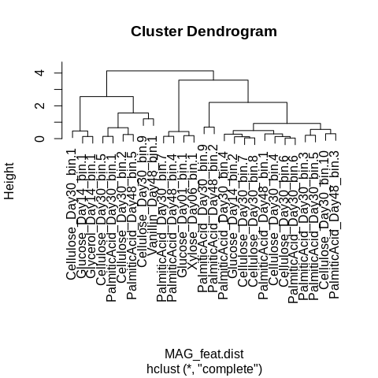<!-- -->

``` r
# Cut tree into 3 clusters
set.seed(7242)
MAG_feat.hclust.groups = data.frame(group = cutree(MAG_feat.hclust, k = 3)) %>%
  tibble::rownames_to_column(var="BinID") %>%
  mutate(group = as.factor(group)) %>%
  left_join(MAG_feat.sum, by = "BinID")

# Plot groups to assign LHS definitions to the 3 clusters
ggplot(data=MAG_feat.hclust.groups, aes(x=TFperGENE, y=SECSMBCperMT)) +
  geom_point(aes(fill=group), shape = 21, size=2) +
  labs(x="Transcription factors per total genes", y="Secreted enzyme and SMBC genes\nper transporter gene", fill="Life history cluster") +
  theme_bw() +
  theme(axis.text = element_text(size=6),
        axis.title = element_text(size=7),
        legend.text = element_text(size=6),
        legend.title = element_text(size=7))
```

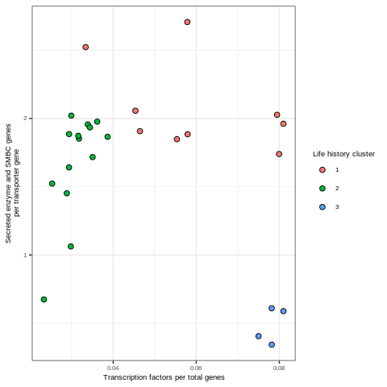<!-- -->

``` r
# 1 = Competitors, 2 = Scarcity, and 3 = Ruderal (Check these before proceeding)
hclust_LHS_groups = data.frame(group = as.factor(c(1, 2, 3)),
                        LHS = factor(c("Competitor", "Scarcity", "Ruderal"),
                                     levels = c("Competitor", "Scarcity", "Ruderal")))
MAG_feat.hclust.groups = full_join(MAG_feat.hclust.groups, hclust_LHS_groups, by="group")
```

Plot life history strategies

``` r
# Group plots
hclust_TFperGENE.plot = ggplot(data=MAG_feat.hclust.groups, aes(x=total_genes, y=n_transfact)) +
  geom_point(aes(fill=LHS), shape = 21, size=2) +
  scale_fill_manual(values = CSR.col) +
  labs(x="Total genes", y="Transcription factors", fill="Life history cluster") +
  theme_bw() +
  theme(axis.text = element_text(size=6),
        axis.title = element_text(size=7),
        legend.text = element_text(size=6),
        legend.title = element_text(size=7))

hclust_SECSMBCperMT.plot = ggplot(data=MAG_feat.hclust.groups, aes(x=n_transport, y=n_SEC_SMBC)) +
  geom_point(aes(fill=LHS), shape = 21, size=2) +
  scale_fill_manual(values = CSR.col) +
  labs(x="Transporter genes", y="Secreted enzyme and SMBC genes", fill="Life history cluster") +
  theme_bw() +
  theme(axis.text = element_text(size=6),
        axis.title = element_text(size=7),
        legend.text = element_text(size=6),
        legend.title = element_text(size=7))

hclust_LHS.plot = ggplot(data=MAG_feat.hclust.groups, aes(x=TFperGENE, y=SECSMBCperMT)) +
  geom_point(aes(fill=LHS), shape = 21, size=2) +
  scale_fill_manual(values = CSR.col) +
  labs(x="Transcription factors per total genes", y="Secreted enzyme and SMBC genes\nper transporter gene", fill="Life history cluster") +
  theme_bw() +
  theme(axis.text = element_text(size=6),
        axis.title = element_text(size=7),
        legend.text = element_text(size=6),
        legend.title = element_text(size=7))

hclust_LHS.plot.leg = g_legend(hclust_LHS.plot)

cowplot::plot_grid(hclust_TFperGENE.plot + theme(legend.position = "none"), 
                   hclust_SECSMBCperMT.plot + theme(legend.position = "none"), 
                   hclust_LHS.plot + theme(legend.position = "none"),
                   hclust_LHS.plot.leg,
                   labels=c("A", "B", "C", ""), label_size = 8)
```

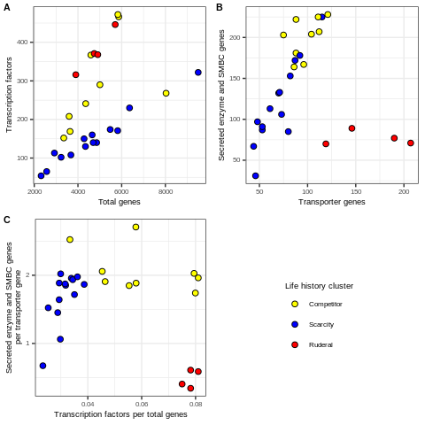<!-- -->

Plot LHS with taxonomies

``` r
# Taxa plots
hclust_TFperGENE_Taxa.plot = ggplot(data=MAG_feat.hclust.groups, aes(x=total_genes, y=n_transfact)) +
  geom_point(aes(fill=Order, shape=LHS), size=3) +
  labs(x="Total genes", y="Transcription factors",
       fill="Bacterial Order", shape="Life history cluster") +
  scale_fill_manual(values=paultol_colors(length(unique(MAG_feat.hclust.groups$Order)))) +
  scale_shape_manual(values=c("Competitor" = 21, "Scarcity" = 22, "Ruderal" = 24)) +
  theme_bw() +
  theme(axis.text = element_text(size=6),
        axis.title = element_text(size=7),
        legend.text = element_text(size=6),
        legend.title = element_text(size=7)) +
  guides(fill=guide_legend(override.aes=list(shape=21)))
hclust_TFperGENE_Taxa.plot
```

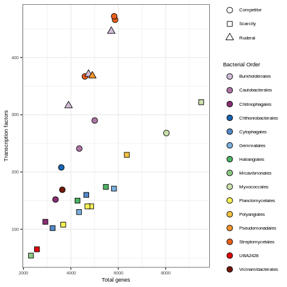<!-- -->

``` r
hclust_SECSMBCperMT_Taxa.plot = ggplot(data=MAG_feat.hclust.groups, aes(x=n_transport, y=n_SEC_SMBC)) +
  geom_point(aes(fill=Order, shape=LHS), size=3) +
  labs(x="Transporter genes", y="Secreted enzyme and SMBC genes", 
       fill="Bacterial Order", shape="Life history cluster") +
  scale_fill_manual(values=paultol_colors(length(unique(MAG_feat.hclust.groups$Order)))) +
  scale_shape_manual(values=c("Competitor" = 21, "Scarcity" = 22, "Ruderal" = 24)) +
  theme_bw() +
  theme(axis.text = element_text(size=6),
        axis.title = element_text(size=7),
        legend.text = element_text(size=6),
        legend.title = element_text(size=7)) +
  guides(fill=guide_legend(override.aes=list(shape=21)))
hclust_SECSMBCperMT_Taxa.plot
```

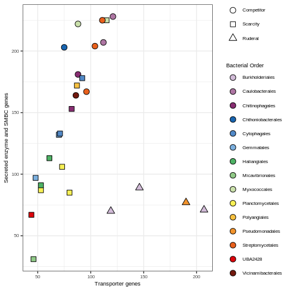<!-- -->

``` r
hclust_LHS_Taxa.plot = ggplot(data=MAG_feat.hclust.groups, aes(x=TFperGENE, y=SECSMBCperMT)) +
  geom_point(aes(fill=Order, shape=LHS), size=3) +
  labs(x="Transcription factors per total genes", y="Secreted enzyme and SMBC genes\nper transporter gene", 
       fill="Bacterial Order", shape="Life history cluster") +
  scale_fill_manual(values=paultol_colors(length(unique(MAG_feat.hclust.groups$Order)))) +
  scale_shape_manual(values=c("Competitor" = 21, "Scarcity" = 22, "Ruderal" = 24)) +
  theme_bw() +
  theme(axis.text = element_text(size=6),
        axis.title = element_text(size=7),
        legend.text = element_text(size=6),
        legend.title = element_text(size=7)) +
  guides(fill=guide_legend(override.aes=list(shape=21)))
hclust_LHS_Taxa.plot
```

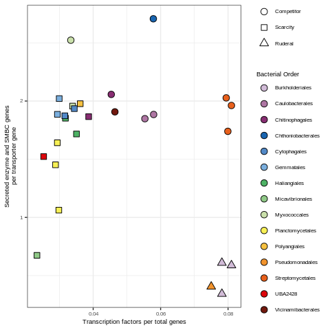<!-- -->

## Cluster MAG LHS with k-means clustering

Now lets use these genome features to cluster the MAGs into 3 LHS using
k-means clustering.

``` r
set.seed(4242)
MAG_feat.kmeans = kcca(scale(select(MAG_feat.sum, TFperGENE, SECSMBCperMT), center = TRUE), k=3, kccaFamily("kmeans"))
MAG_feat.kmeans.groups = MAG_feat.sum %>%
  mutate(group = predict(MAG_feat.kmeans)) %>%
  mutate(group = as.factor(group))
  
ggplot(data=MAG_feat.kmeans.groups, aes(x=TFperGENE, y=SECSMBCperMT)) +
  geom_point(aes(fill=group), shape = 21, size=2) +
  labs(x="Transcription factors per total genes", y="Secreted enzyme and SMBC genes\nper transporter gene", fill="Life history cluster") +
  theme_bw() +
  theme(axis.text = element_text(size=6),
        axis.title = element_text(size=7),
        legend.text = element_text(size=6),
        legend.title = element_text(size=7))
```

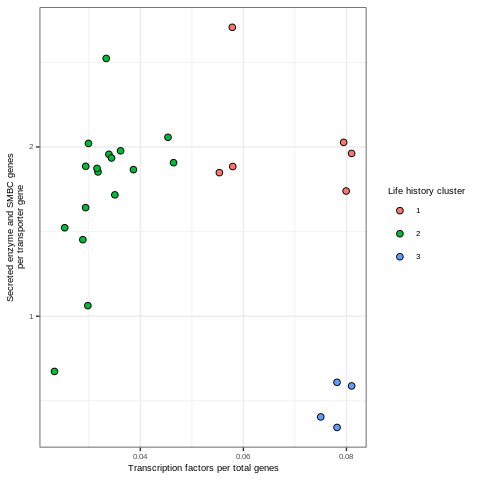<!-- -->

``` r
# 1 = Competitors, 2 = Scarcity, and 3 = Ruderal (Check these before proceeding)
kmeans_LHS_groups = data.frame(group = as.factor(c(1, 2, 3)),
                               LHS = factor(c("Competitor", "Scarcity", "Ruderal"),
                                            levels = c("Competitor", "Scarcity", "Ruderal")))
MAG_feat.kmeans.groups = full_join(MAG_feat.kmeans.groups, kmeans_LHS_groups, by="group")
```

Plot life history strategies

``` r
# Group plots
kmeans_TFperGENE.plot = ggplot(data=MAG_feat.kmeans.groups, aes(x=total_genes, y=n_transfact)) +
  geom_point(aes(fill=LHS, shape=LHS), size=2) +
  scale_fill_manual(values = CSR.col) +
  scale_shape_manual(values=c("Competitor" = 21, "Scarcity" = 22, "Ruderal" = 24)) +
  labs(x="Total genes", y="Transcription factors", 
       fill="Life history cluster", shape="Life history cluster") +
  theme_bw() +
  theme(axis.text = element_text(size=6),
        axis.title = element_text(size=7),
        legend.text = element_text(size=6),
        legend.title = element_text(size=7))

kmeans_SECSMBCperMT.plot = ggplot(data=MAG_feat.kmeans.groups, aes(x=n_transport, y=n_SEC_SMBC)) +
  geom_point(aes(fill=LHS, shape=LHS), size=2) +
  scale_fill_manual(values = CSR.col) +
  scale_shape_manual(values=c("Competitor" = 21, "Scarcity" = 22, "Ruderal" = 24)) +
  labs(x="Transporter genes", y="Secreted enzyme and SMBC genes", 
       fill="Life history cluster", shape="Life history cluster") +
  theme_bw() +
  theme(axis.text = element_text(size=6),
        axis.title = element_text(size=7),
        legend.text = element_text(size=6),
        legend.title = element_text(size=7))

kmeans_LHS.plot = ggplot(data=MAG_feat.kmeans.groups, aes(x=TFperGENE, y=SECSMBCperMT)) +
  geom_point(aes(fill=LHS, shape=LHS), size=2) +
  scale_fill_manual(values = CSR.col) +
  scale_shape_manual(values=c("Competitor" = 21, "Scarcity" = 22, "Ruderal" = 24)) +
  labs(x="Transcription factors per total genes", y="Secreted enzyme and SMBC genes\nper transporter gene", 
       fill="Life history cluster", shape="Life history cluster") +
  theme_bw() +
  theme(axis.text = element_text(size=6),
        axis.title = element_text(size=7),
        legend.text = element_text(size=6),
        legend.title = element_text(size=7))

kmeans_LHS.plot.leg = g_legend(kmeans_LHS.plot)

cowplot::plot_grid(kmeans_TFperGENE.plot + theme(legend.position = "none"), 
                   kmeans_SECSMBCperMT.plot + theme(legend.position = "none"), 
                   kmeans_LHS.plot + theme(legend.position = "none"),
                   kmeans_LHS.plot.leg,
                   labels=c("A", "B", "C", ""), label_size = 8)
```

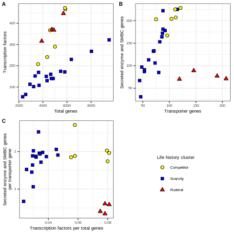<!-- -->

Plot LHS with taxonomies

``` r
# Taxa plots
kmeans_TFperGENE_Taxa.plot = ggplot(data=MAG_feat.kmeans.groups, aes(x=total_genes, y=n_transfact)) +
  geom_point(aes(fill=Order, shape=LHS), size=2) +
  labs(x="Total genes", y="Transcription factors",
       fill="Bacterial Order", shape="Life history cluster") +
  scale_fill_manual(values=paultol_colors(length(unique(MAG_feat.kmeans.groups$Order)))) +
  scale_shape_manual(values=c("Competitor" = 21, "Scarcity" = 22, "Ruderal" = 24)) +
  theme_bw() +
  theme(axis.text = element_text(size=6),
        axis.title = element_text(size=7),
        legend.text = element_text(size=6),
        legend.title = element_text(size=7)) +
  guides(fill=guide_legend(override.aes=list(shape=21)))
kmeans_TFperGENE_Taxa.plot
```

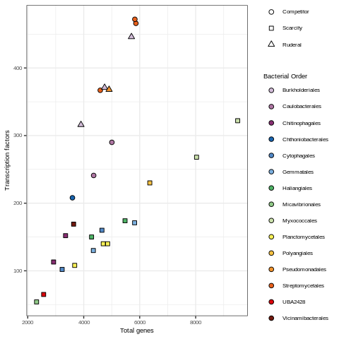<!-- -->

``` r
kmeans_SECSMBCperMT_Taxa.plot = ggplot(data=MAG_feat.kmeans.groups, aes(x=n_transport, y=n_SEC_SMBC)) +
  geom_point(aes(fill=Order, shape=LHS), size=2) +
  labs(x="Transporter genes", y="Secreted enzyme and SMBC genes", 
       fill="Bacterial Order", shape="Life history cluster") +
  scale_fill_manual(values=paultol_colors(length(unique(MAG_feat.kmeans.groups$Order)))) +
  scale_shape_manual(values=c("Competitor" = 21, "Scarcity" = 22, "Ruderal" = 24)) +
  theme_bw() +
  theme(axis.text = element_text(size=6),
        axis.title = element_text(size=7),
        legend.text = element_text(size=6),
        legend.title = element_text(size=7)) +
  guides(fill=guide_legend(override.aes=list(shape=21)))
kmeans_SECSMBCperMT_Taxa.plot
```

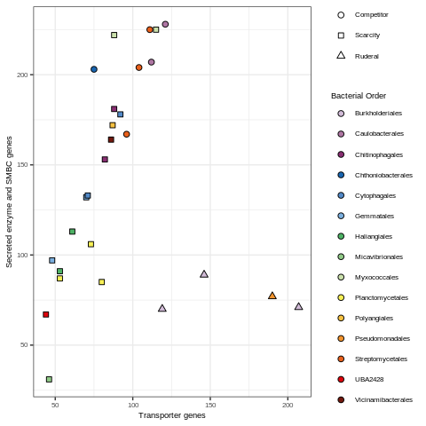<!-- -->

``` r
kmeans_LHS_Taxa.plot = ggplot(data=MAG_feat.kmeans.groups, aes(x=TFperGENE, y=SECSMBCperMT)) +
  geom_point(aes(fill=Order, shape=LHS), size=2) +
  labs(x="Transcription factors per total genes", y="Secreted enzyme and SMBC genes\nper transporter gene", 
       fill="Bacterial Order", shape="Life history cluster") +
  scale_fill_manual(values=paultol_colors(length(unique(MAG_feat.kmeans.groups$Order)))) +
  scale_shape_manual(values=c("Competitor" = 21, "Scarcity" = 22, "Ruderal" = 24)) +
  theme_bw() +
  theme(axis.text = element_text(size=6),
        axis.title = element_text(size=7),
        legend.text = element_text(size=6),
        legend.title = element_text(size=7)) +
  guides(fill=guide_legend(override.aes=list(shape=21)))
kmeans_LHS_Taxa.plot
```

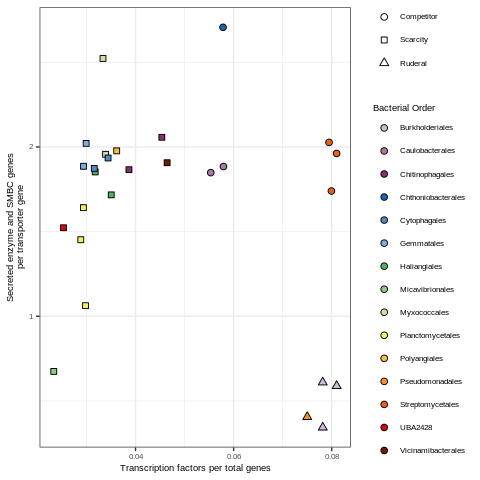<!-- -->

Adding 2 order regression curve

``` r
xx <- seq(min(MAG_feat.kmeans.groups$TFperGENE),
          max(MAG_feat.kmeans.groups$TFperGENE), 
          length=50)


fit1  <- lm(SECSMBCperMT~TFperGENE, data = MAG_feat.kmeans.groups)
summary(fit1)
```

    ## 
    ## Call:
    ## lm(formula = SECSMBCperMT ~ TFperGENE, data = MAG_feat.kmeans.groups)
    ## 
    ## Residuals:
    ##     Min      1Q  Median      3Q     Max 
    ## -1.1842 -0.3357  0.1509  0.3192  1.1709 
    ## 
    ## Coefficients:
    ##             Estimate Std. Error t value Pr(>|t|)    
    ## (Intercept)   2.0760     0.2902   7.154 1.69e-07 ***
    ## TFperGENE    -9.3401     5.5939  -1.670    0.107    
    ## ---
    ## Signif. codes:  0 '***' 0.001 '**' 0.01 '*' 0.05 '.' 0.1 ' ' 1
    ## 
    ## Residual standard error: 0.5963 on 25 degrees of freedom
    ## Multiple R-squared:  0.1003, Adjusted R-squared:  0.06434 
    ## F-statistic: 2.788 on 1 and 25 DF,  p-value: 0.1075

``` r
fit1.pred = data.frame(SECSMBCperMT = predict(fit1, data.frame(TFperGENE=xx)),
                       TFperGENE = xx)

fit1_LHS_Taxa.plot = kmeans_LHS_Taxa.plot + geom_line(data=fit1.pred)
# fit1_LHS_Taxa.plot # No need to plot this right now

#second degree
fit2 <- lm(SECSMBCperMT~poly(TFperGENE,2,raw=TRUE), data = MAG_feat.kmeans.groups)
summary(fit2)
```

    ## 
    ## Call:
    ## lm(formula = SECSMBCperMT ~ poly(TFperGENE, 2, raw = TRUE), data = MAG_feat.kmeans.groups)
    ## 
    ## Residuals:
    ##      Min       1Q   Median       3Q      Max 
    ## -0.99251 -0.22320  0.00801  0.19546  0.95317 
    ## 
    ## Coefficients:
    ##                                   Estimate Std. Error t value Pr(>|t|)   
    ## (Intercept)                        -0.7675     1.0075  -0.762  0.45360   
    ## poly(TFperGENE, 2, raw = TRUE)1   115.7780    43.1738   2.682  0.01304 * 
    ## poly(TFperGENE, 2, raw = TRUE)2 -1158.6584   397.2222  -2.917  0.00755 **
    ## ---
    ## Signif. codes:  0 '***' 0.001 '**' 0.01 '*' 0.05 '.' 0.1 ' ' 1
    ## 
    ## Residual standard error: 0.5229 on 24 degrees of freedom
    ## Multiple R-squared:  0.3358, Adjusted R-squared:  0.2804 
    ## F-statistic: 6.067 on 2 and 24 DF,  p-value: 0.007372

``` r
fit2.pred = data.frame(SECSMBCperMT = predict(fit2, data.frame(TFperGENE=xx)),
                       TFperGENE = xx)

fit2_LHS_Taxa.plot = kmeans_LHS_Taxa.plot + geom_line(data=fit2.pred)
fit2_LHS_Taxa.plot
```

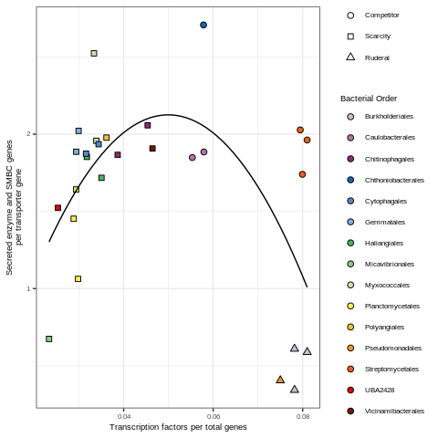<!-- -->

Publication quality
figure

``` r
kmeans_LHS_full.plot1 = cowplot::plot_grid(kmeans_TFperGENE.plot + theme(legend.position = "none"), 
                                      kmeans_SECSMBCperMT.plot + theme(legend.position = "none"), 
                                      kmeans_LHS.plot + theme(legend.position = "none"),
                                      nrow=1, labels=c("a", "b", "c"), label_size = 8)

kmeans_LHS_Taxa.plot.leg = g_legend(kmeans_TFperGENE_Taxa.plot +
                                      guides(shape=guide_legend(override.aes=list(fill=c(CSR.col)))))


kmeans_LHS_full.plot2 = cowplot::plot_grid(kmeans_TFperGENE_Taxa.plot + theme(legend.position = "none"), 
                                      kmeans_SECSMBCperMT_Taxa.plot + theme(legend.position = "none"), 
                                      kmeans_LHS_Taxa.plot + theme(legend.position = "none"),
                                      nrow=1, labels=c("d", "e", "f"), label_size = 8)

kmeans_LHS_full.plot3 = cowplot::plot_grid(kmeans_LHS_full.plot1, kmeans_LHS_full.plot2, ncol=1)

kmeans_LHS_full.plot = cowplot::plot_grid(kmeans_LHS_full.plot3, kmeans_LHS_Taxa.plot.leg, 
                                          nrow=1, rel_widths = c(1, 0.25))
kmeans_LHS_full.plot
```

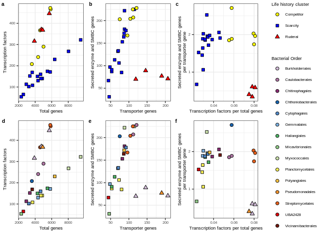<!-- -->

``` r
ggsave(kmeans_LHS_full.plot, filename = "/home/sam/FullCyc_metagenome/figs4publication/Fig4.tiff", 
       device = "tiff", width = 7, height = 5, units = "in")
```

## Matching MAGs and their LHS to OTUs in FullCyc1 and guild features

For this analysis I’m going to use the LHS from the kmeans clustering.
Note however, that when I ran this with the hclust groups the results
were similar.

``` r
# Dataframe for converting microcosm name into substrate and day
treat_conversions = data.frame(Sub = c("13C-Glu", "13C-Xyl", "13C-Gly", "13C-Cel", "13C-Pal", "13C-Van", "13C-Oxa", "13C-Lac", "13C-Ami"),
                               Substrate = c("Glucose", "Xylose", "Glycerol", "Cellulose", "Palmitic acid", "Vanillin", "Oxalate", "Lactate", "Amino acids"))

# Assimilation/population characteristics and incorporator data
FullCyc1_incorp.df = read.table("/home/sam/FullCyc_metagenome/OTU_AC_characteristics.txt", 
                                sep="\t", header=TRUE, stringsAsFactors = FALSE)
```

``` r
treatment_levels = c("Glucose Day 1", "Xylose Day 6", "Glucose Day 14", "Glycerol Day 14", 
                     "Cellulose Day 30", "Palmitic Acid Day 30", "Palmitic Acid Day 48", "Vanillin Day 48")

Potential_matching_OTUs.df = rbind(data.frame(BinID = "Glucose_Day01_bin.1", 
                                              unique(filter(FullCyc1_incorp.df, Family == "Burkholderiaceae", grepl("13C-Glu_D1", Substrate_incorp_on_day))), 
                                              Level = "Family", Taxa = "Burkholderiaceae"),
                                   data.frame(BinID = "Xylose_Day06_bin.1",
                                              unique(filter(FullCyc1_incorp.df, Genus == "Pseudomonas", grepl("13C-Xyl_D6", Substrate_incorp_on_day))), 
                                              Level = "Genus", Taxa = "Pseudomonas"),
                                   data.frame(BinID = "Glucose_Day14_bin.1",
                                              unique(filter(FullCyc1_incorp.df, Family == "Streptomyces", grepl("13C-Glu_D14", Substrate_incorp_on_day))),
                                              Level = "Genus", Taxa = "Streptomyces"),
                                   data.frame(BinID = "Glucose_Day14_bin.2",
                                              unique(filter(FullCyc1_incorp.df, Genus == "Polyangiaceae", grepl("13C-Glu_D14", Substrate_incorp_on_day))), 
                                              Level = "Genus", Taxa = "Polyangiaceae"),
                                   data.frame(BinID = "Glycerol_Day14_bin.1",
                                              unique(filter(FullCyc1_incorp.df, Family == "Streptomyces", grepl("13C-Gly_D14", Substrate_incorp_on_day))), 
                                              Level = "Genus", Taxa = "Streptomyces"),
                                   data.frame(BinID = "Cellulose_Day30_bin.1",
                                              unique(filter(FullCyc1_incorp.df, Family == "Streptomyces", grepl("13C-Cel_D30", Substrate_incorp_on_day))), 
                                              Level = "Genus", Taxa = "Streptomyces"),
                                   data.frame(BinID = "Cellulose_Day30_bin.2",
                                              unique(filter(FullCyc1_incorp.df, Genus == "Flavihumibacter", grepl("13C-Cel_D30", Substrate_incorp_on_day))), 
                                              Level = "Genus", Taxa = "Flavihumibacter"),
                                   #data.frame(BinID = "Cellulose_Day30_bin.7",
                                  #            unique(filter(FullCyc1_incorp.df, Genus == "Myxococcaceae", grepl("13C-Cel_D30", Substrate_incorp_on_day))), 
                                  #            Level = "Genus", Taxa = "Myxococcaceae"),
                                   data.frame(BinID = "Cellulose_Day30_bin.10",
                                              unique(filter(FullCyc1_incorp.df, Family == "Planctomycetaceae", grepl("13C-Cel_D30", Substrate_incorp_on_day))), 
                                              Level = "Family", Taxa = "Planctomycetaceae"),
                                   data.frame(BinID = "Cellulose_Day30_bin.5",
                                              unique(filter(FullCyc1_incorp.df, Genus == "Caulobacter", grepl("13C-Cel_D30", Substrate_incorp_on_day))), 
                                              Level = "Genus", Taxa = "Caulobacter"),
                                   data.frame(BinID = "Cellulose_Day30_bin.6", 
                                              unique(filter(FullCyc1_incorp.df, Genus == "Haliangiaceae", grepl("13C-Cel_D30", Substrate_incorp_on_day))), 
                                              Level = "Genus", Taxa = "Haliangiaceae"),
                                   data.frame(BinID = "Cellulose_Day30_bin.9",
                                              unique(filter(FullCyc1_incorp.df, Class == "Verrucomicrobiae", grepl("13C-Cel_D30", Substrate_incorp_on_day))), 
                                              Level = "Class", Taxa = "Verrucomicrobiae"),
                                   data.frame(BinID = "Cellulose_Day30_bin.8",
                                              unique(filter(FullCyc1_incorp.df, Order == "Cytophagales", grepl("13C-Cel_D30", Substrate_incorp_on_day))), 
                                              Level = "Order", Taxa = "Cytophagales"),
                                   data.frame(BinID = "Cellulose_Day30_bin.4",
                                              unique(filter(FullCyc1_incorp.df, Phylum == "Planctomycetes", grepl("13C-Cel_D30", Substrate_incorp_on_day))), 
                                              Level = "Phylum", Taxa = "Planctomycetes"),
                                   data.frame(BinID = "PalmiticAcid_Day30_bin.1",
                                              unique(filter(FullCyc1_incorp.df, Genus == "Caulobacter", grepl("13C-Pal_D30", Substrate_incorp_on_day))), 
                                              Level = "Genus", Taxa = "Caulobacter"),
                                   data.frame(BinID = "PalmiticAcid_Day30_bin.3",
                                              unique(filter(FullCyc1_incorp.df, Order == "Bdellovibrionales", grepl("13C-Pal_D30", Substrate_incorp_on_day))), 
                                              Level = "Order", Taxa = "Bdellovibrionales"),
                                   data.frame(BinID = "PalmiticAcid_Day30_bin.6",
                                              unique(filter(FullCyc1_incorp.df, Order == "Cytophagales", grepl("13C-Pal_D30", Substrate_incorp_on_day))), 
                                              Level = "Order", Taxa = "Cytophagales"),
                                   data.frame(BinID = "PalmiticAcid_Day30_bin.5",
                                              unique(filter(FullCyc1_incorp.df, Genus == "Planctomyces", grepl("13C-Pal_D30", Substrate_incorp_on_day))), 
                                              Level = "Genus", Taxa = "Planctomyces"),
                                   data.frame(BinID = "PalmiticAcid_Day30_bin.4",
                                              unique(filter(FullCyc1_incorp.df, Genus == "Flavihumibacter", grepl("13C-Pal_D30", Substrate_incorp_on_day))), 
                                              Level = "Genus", Taxa = "Flavihumibacter"),
                                   data.frame(BinID = "PalmiticAcid_Day30_bin.7",
                                              unique(filter(FullCyc1_incorp.df, Genus == "Hydrogenophaga", grepl("13C-Pal_D30", Substrate_incorp_on_day))), 
                                              Level = "Genus", Taxa = "Hydrogenophaga"),
                                   data.frame(BinID = "PalmiticAcid_Day30_bin.9",
                                              unique(filter(FullCyc1_incorp.df, Class == "Alphaproteobacteria", grepl("13C-Pal_D30", Substrate_incorp_on_day))),
                                              Level = "Class", Taxa = "Alphaproteobacteria"),
                                   #data.frame(BinID = "PalmiticAcid_Day48_bin.4",
                                  #            unique(filter(FullCyc1_incorp.df, Genus == "Hydrogenophaga", grepl("13C-Pal_D48", Substrate_incorp_on_day))), 
                                  #            Level = "Genus", Taxa = "Hydrogenophaga"),
                                   data.frame(BinID = "PalmiticAcid_Day48_bin.3",
                                              unique(filter(FullCyc1_incorp.df, Genus == "Haliangiaceae", grepl("13C-Pal_D48", Substrate_incorp_on_day))), 
                                              Level = "Genus", Taxa = "Haliangiaceae"),
                                   data.frame(BinID = "PalmiticAcid_Day48_bin.5",
                                              unique(filter(FullCyc1_incorp.df, Phylum == "Acidobacteria", grepl("13C-Pal_D48", Substrate_incorp_on_day))), 
                                              Level = "Phylum", Taxa = "Acidobacteria"),
                                   data.frame(BinID = "PalmiticAcid_Day48_bin.2",
                                              unique(filter(FullCyc1_incorp.df, Genus == "Planctomyces", grepl("13C-Pal_D48", Substrate_incorp_on_day))), 
                                              Level = "Genus", Taxa = "Planctomyces"),
                                   data.frame(BinID = "PalmiticAcid_Day48_bin.1",
                                              unique(filter(FullCyc1_incorp.df, Phylum == "Planctomycetes", grepl("13C-Pal_D48", Substrate_incorp_on_day))), 
                                              Level = "Phylum", Taxa = "Planctomycetes")) %>%
                                   #data.frame(BinID = "Vanillin_Day48_bin.1",
                                  #            unique(filter(FullCyc1_incorp.df, Genus == "Myxococcaceae", grepl("13C-Van_D48", Substrate_incorp_on_day))), 
                                  #            Level = "Genus", Taxa = "Myxococcaceae")) %>%
  mutate(Treatment = factor(gsub("Acid", " Acid", gsub("Day", "Day ", gsub("Day0", "Day", gsub("_", " ", gsub("_bin.*", "", BinID))))),
                            levels = treatment_levels),
         BinID = as.character(BinID)) %>%
  arrange(Treatment, BinID)

Potential_matching_OTUs.df = Potential_matching_OTUs.df %>%
  mutate(BinID = factor(BinID, levels = unique(Potential_matching_OTUs.df$BinID)))

print("Missing matching OTUs:\nCellulose_Day30_bin.7\nPalmiticAcid_Day48_bin.4\nVanillin_Day48_bin.1")
```

    ## [1] "Missing matching OTUs:\nCellulose_Day30_bin.7\nPalmiticAcid_Day48_bin.4\nVanillin_Day48_bin.1"

``` r
# To make plotting easier I'm reassigning group numbers for LHS as they will appear on the figure. Note that this actually doesnt change the LHS number but it might if there is any stochasticity in the the clustering algorithm.
LH.order = data.frame(LHS = factor(c("Competitor", "Scarcity", "Ruderal"),
                                   levels = c("Competitor", "Scarcity", "Ruderal")),
                      LHS_order = c(1, 2, 3))

Potential_matching_OTUs.sum = Potential_matching_OTUs.df %>%
  group_by(BinID) %>%
  summarize(bioA = mean(mean_bioA),
            maxl2fc = mean(maxl2fc),
            Latency = mean(mean_immediacy),
            C_sources = mean(n_Sub),
            ln_rrn = mean(logrrn)) %>%
  ungroup %>%
  left_join(MAG_feat.kmeans.groups, by = "BinID") %>%
  left_join(LH.order, by = "LHS")

activity_group.theme = theme(axis.title = element_text(size=7),
                             axis.text = element_text(size=6),
                             legend.position = "none")

print("Bioavailability")
```

    ## [1] "Bioavailability"

``` r
bioA.dunn = dunn.test::dunn.test(Potential_matching_OTUs.sum$bioA, Potential_matching_OTUs.sum$LHS_order, method="bh")
```

    ##   Kruskal-Wallis rank sum test
    ## 
    ## data: x and group
    ## Kruskal-Wallis chi-squared = 13.4329, df = 2, p-value = 0
    ## 
    ## 
    ##                            Comparison of x by group                            
    ##                              (Benjamini-Hochberg)                              
    ## Col Mean-|
    ## Row Mean |          1          2
    ## ---------+----------------------
    ##        2 |   2.841723
    ##          |    0.0034*
    ##          |
    ##        3 |  -0.633746  -2.878952
    ##          |     0.2631    0.0060*
    ## 
    ## alpha = 0.05
    ## Reject Ho if p <= alpha/2

``` r
bioA.dunn.df = data.frame(comparisons = bioA.dunn$comparisons,
                          p.adj = bioA.dunn$P.adjusted,
                          y.adj_level = c(1, 2, 1)) %>%
  tidyr::separate(comparisons, into=c("xstart", "xend"), sep=" - ", remove=FALSE, convert=TRUE) %>%
  mutate(xstart = xstart + 0.1,
         xend = xend - 0.1) %>%
  mutate(x.text = (xend+xstart)/2,
         y.adj = max(Potential_matching_OTUs.sum$bioA)-min(Potential_matching_OTUs.sum$bioA)) %>%
  mutate(y.new = y.adj*0.1*y.adj_level + max(Potential_matching_OTUs.sum$bioA)) %>%
  mutate(y.text = y.adj*0.05 + y.new)
bioA_groups.plot = ggplot(data=Potential_matching_OTUs.sum, aes(x=LHS, y=bioA)) +
  geom_boxplot(outlier.shape = NA) +
  geom_jitter(height = 0, width = 0.25, aes(fill=LHS, shape=LHS), size=2) +
  geom_segment(data=filter(bioA.dunn.df, p.adj < 0.05), aes(x=xstart, xend=xend, y=y.new, yend=y.new)) +
  geom_text(data=filter(bioA.dunn.df, p.adj < 0.05), aes(x=x.text, y=y.text, label=round(p.adj, digits = 3)), size=6*5/14) +
  scale_fill_manual(values = CSR.col) +
  scale_shape_manual(values=c("Competitor" = 21, "Scarcity" = 22, "Ruderal" = 24)) +
  labs(x="Life history cluster", y="Mean bioavailability") +
  theme_bw() +
  activity_group.theme

print("Max L2FC")
```

    ## [1] "Max L2FC"

``` r
l2fc.dunn = dunn.test::dunn.test(Potential_matching_OTUs.sum$maxl2fc, Potential_matching_OTUs.sum$LHS_order, method="bh")
```

    ##   Kruskal-Wallis rank sum test
    ## 
    ## data: x and group
    ## Kruskal-Wallis chi-squared = 6.6478, df = 2, p-value = 0.04
    ## 
    ## 
    ##                            Comparison of x by group                            
    ##                              (Benjamini-Hochberg)                              
    ## Col Mean-|
    ## Row Mean |          1          2
    ## ---------+----------------------
    ##        2 |  -1.767147
    ##          |     0.0579
    ##          |
    ##        3 |  -2.501087  -1.446619
    ##          |    0.0186*     0.0740
    ## 
    ## alpha = 0.05
    ## Reject Ho if p <= alpha/2

``` r
l2fc.dunn.df = data.frame(comparisons = l2fc.dunn$comparisons,
                          p.adj = l2fc.dunn$P.adjusted,
                          y.adj_level = c(1, 2, 1)) %>%
  tidyr::separate(comparisons, into=c("xstart", "xend"), sep=" - ", remove=FALSE, convert=TRUE) %>%
  mutate(xstart = xstart + 0.1,
         xend = xend - 0.1) %>%
  mutate(x.text = (xend+xstart)/2,
         y.adj = max(Potential_matching_OTUs.sum$maxl2fc)-min(Potential_matching_OTUs.sum$maxl2fc)) %>%
  mutate(y.new = y.adj*0.1*y.adj_level + max(Potential_matching_OTUs.sum$maxl2fc)) %>%
  mutate(y.text = y.adj*0.05 + y.new)
l2fc_groups.plot = ggplot(data=Potential_matching_OTUs.sum, aes(x=LHS, y=maxl2fc)) +
  geom_boxplot(outlier.shape = NA) +
  geom_jitter(height = 0, width = 0.25, aes(fill=LHS, shape=LHS), size=2) +
  geom_segment(data=filter(l2fc.dunn.df, p.adj < 0.05), aes(x=xstart, xend=xend, y=y.new, yend=y.new)) +
  geom_text(data=filter(l2fc.dunn.df, p.adj < 0.05), aes(x=x.text, y=y.text, label=round(p.adj, digits = 3)), size=6*5/14) +
  scale_fill_manual(values = CSR.col) +
  scale_shape_manual(values=c("Competitor" = 21, "Scarcity" = 22, "Ruderal" = 24)) +
  labs(x="Life history cluster", y="Mean maximum Log2 fold change") +
  theme_bw() +
  activity_group.theme

print("Latency")
```

    ## [1] "Latency"

``` r
Latency.dunn = dunn.test::dunn.test(Potential_matching_OTUs.sum$Latency, Potential_matching_OTUs.sum$LHS_order, method="bh")
```

    ##   Kruskal-Wallis rank sum test
    ## 
    ## data: x and group
    ## Kruskal-Wallis chi-squared = 0.4324, df = 2, p-value = 0.81
    ## 
    ## 
    ##                            Comparison of x by group                            
    ##                              (Benjamini-Hochberg)                              
    ## Col Mean-|
    ## Row Mean |          1          2
    ## ---------+----------------------
    ##        2 |   0.331950
    ##          |     0.3700
    ##          |
    ##        3 |  -0.333478  -0.626371
    ##          |     0.5541     0.7966
    ## 
    ## alpha = 0.05
    ## Reject Ho if p <= alpha/2

``` r
Latency.dunn.df = data.frame(comparisons = Latency.dunn$comparisons,
                          p.adj = Latency.dunn$P.adjusted,
                          y.adj_level = c(1, 2, 1)) %>%
  tidyr::separate(comparisons, into=c("xstart", "xend"), sep=" - ", remove=FALSE, convert=TRUE) %>%
  mutate(xstart = xstart + 0.1,
         xend = xend - 0.1) %>%
  mutate(x.text = (xend+xstart)/2,
         y.adj = max(Potential_matching_OTUs.sum$Latency)-min(Potential_matching_OTUs.sum$Latency)) %>%
  mutate(y.new = y.adj*0.1*y.adj_level + max(Potential_matching_OTUs.sum$Latency)) %>%
  mutate(y.text = y.adj*0.05 + y.new)
Latency_groups.plot = ggplot(data=Potential_matching_OTUs.sum, aes(x=LHS, y=Latency)) +
  geom_boxplot(outlier.shape = NA) +
  geom_jitter(height = 0, width = 0.25, aes(fill=LHS, shape=LHS), size=2) +
  geom_segment(data=filter(Latency.dunn.df, p.adj < 0.05), aes(x=xstart, xend=xend, y=y.new, yend=y.new)) +
  geom_text(data=filter(Latency.dunn.df, p.adj < 0.05), aes(x=x.text, y=y.text, label=round(p.adj, digits = 3)), size=6*5/14) +
  scale_fill_manual(values = CSR.col) +
  scale_shape_manual(values=c("Competitor" = 21, "Scarcity" = 22, "Ruderal" = 24)) +
  labs(x="Life history cluster", y="Mean latency") +
  theme_bw() +
  activity_group.theme

print("C sources")
```

    ## [1] "C sources"

``` r
C_sources.dunn = dunn.test::dunn.test(Potential_matching_OTUs.sum$C_sources, Potential_matching_OTUs.sum$LHS_order, method="bh")
```

    ##   Kruskal-Wallis rank sum test
    ## 
    ## data: x and group
    ## Kruskal-Wallis chi-squared = 13.7639, df = 2, p-value = 0
    ## 
    ## 
    ##                            Comparison of x by group                            
    ##                              (Benjamini-Hochberg)                              
    ## Col Mean-|
    ## Row Mean |          1          2
    ## ---------+----------------------
    ##        2 |   3.117869
    ##          |    0.0027*
    ##          |
    ##        3 |  -0.233689  -2.642584
    ##          |     0.4076    0.0062*
    ## 
    ## alpha = 0.05
    ## Reject Ho if p <= alpha/2

``` r
C_sources.dunn.df = data.frame(comparisons = C_sources.dunn$comparisons,
                          p.adj = C_sources.dunn$P.adjusted,
                          y.adj_level = c(1, 2, 1)) %>%
  tidyr::separate(comparisons, into=c("xstart", "xend"), sep=" - ", remove=FALSE, convert=TRUE) %>%
  mutate(xstart = xstart + 0.1,
         xend = xend - 0.1) %>%
  mutate(x.text = (xend+xstart)/2,
         y.adj = max(Potential_matching_OTUs.sum$C_sources)-min(Potential_matching_OTUs.sum$C_sources)) %>%
  mutate(y.new = y.adj*0.1*y.adj_level + max(Potential_matching_OTUs.sum$C_sources)) %>%
  mutate(y.text = y.adj*0.05 + y.new)
C_sources_groups.plot = ggplot(data=Potential_matching_OTUs.sum, aes(x=LHS, y=C_sources)) +
  geom_boxplot(outlier.shape = NA) +
  geom_jitter(height = 0, width = 0.25, aes(fill=LHS, shape=LHS), size=2) +
  geom_segment(data=filter(C_sources.dunn.df, p.adj < 0.05), aes(x=xstart, xend=xend, y=y.new, yend=y.new)) +
  geom_text(data=filter(C_sources.dunn.df, p.adj < 0.05), aes(x=x.text, y=y.text, label=round(p.adj, digits = 3)), size=6*5/14) +
  scale_fill_manual(values = CSR.col) +
  scale_shape_manual(values=c("Competitor" = 21, "Scarcity" = 22, "Ruderal" = 24)) +
  labs(x="Life history cluster", y="Mean number of C sources") +
  theme_bw() +
  activity_group.theme

print("ln rrn")
```

    ## [1] "ln rrn"

``` r
ln_rrn.dunn = dunn.test::dunn.test(Potential_matching_OTUs.sum$ln_rrn, Potential_matching_OTUs.sum$LHS_order, method="bh")
```

    ##   Kruskal-Wallis rank sum test
    ## 
    ## data: x and group
    ## Kruskal-Wallis chi-squared = 2.717, df = 2, p-value = 0.26
    ## 
    ## 
    ##                            Comparison of x by group                            
    ##                              (Benjamini-Hochberg)                              
    ## Col Mean-|
    ## Row Mean |          1          2
    ## ---------+----------------------
    ##        2 |   1.152063
    ##          |     0.1870
    ##          |
    ##        3 |  -0.466869  -1.401878
    ##          |     0.3203     0.2414
    ## 
    ## alpha = 0.05
    ## Reject Ho if p <= alpha/2

``` r
ln_rrn.dunn.df = data.frame(comparisons = ln_rrn.dunn$comparisons,
                          p.adj = ln_rrn.dunn$P.adjusted,
                          y.adj_level = c(1, 2, 1)) %>%
  tidyr::separate(comparisons, into=c("xstart", "xend"), sep=" - ", remove=FALSE, convert=TRUE) %>%
  mutate(xstart = xstart + 0.1,
         xend = xend - 0.1) %>%
  mutate(x.text = (xend+xstart)/2,
         y.adj = max(Potential_matching_OTUs.sum$ln_rrn)-min(Potential_matching_OTUs.sum$ln_rrn)) %>%
  mutate(y.new = y.adj*0.1*y.adj_level + max(Potential_matching_OTUs.sum$ln_rrn)) %>%
  mutate(y.text = y.adj*0.05 + y.new)
ln_rrn_groups.plot = ggplot(data=Potential_matching_OTUs.sum, aes(x=LHS, y=ln_rrn)) +
  geom_boxplot(outlier.shape = NA) +
  geom_jitter(height = 0, width = 0.25, aes(fill=LHS, shape=LHS), size=2) +
  geom_segment(data=filter(ln_rrn.dunn.df, p.adj < 0.05), aes(x=xstart, xend=xend, y=y.new, yend=y.new)) +
  geom_text(data=filter(ln_rrn.dunn.df, p.adj < 0.05), aes(x=x.text, y=y.text, label=round(p.adj, digits = 3)), size=6*5/14) +
  scale_fill_manual(values = CSR.col) +
  scale_shape_manual(values=c("Competitor" = 21, "Scarcity" = 22, "Ruderal" = 24)) +
  labs(x="Life history cluster", y="Mean natural log rrn") +
  theme_bw() +
  activity_group.theme

MAG_LHS_GrowthAssim.plot = cowplot::plot_grid(bioA_groups.plot, l2fc_groups.plot, Latency_groups.plot, 
                                              C_sources_groups.plot, ln_rrn_groups.plot, ncol=2,
                                              labels = c("a", "b", "c", "d", "e"), label_size = 8)
MAG_LHS_GrowthAssim.plot
```

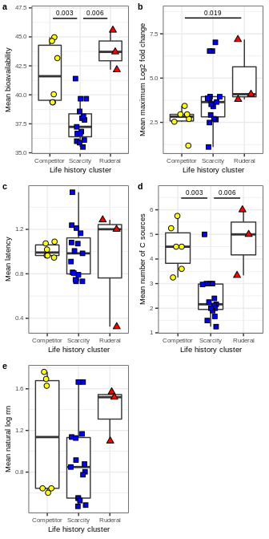<!-- -->

``` r
ggsave(MAG_LHS_GrowthAssim.plot, filename = "/home/sam/FullCyc_metagenome/figs4publication/Fig5.tiff", 
       device = "tiff", width = 3.5, height = 7, units = "in")
```

# Life history strategies in RefSoil genomes

For this analysis I’ll look at the same genomic features but in the
RefSoil genomes, then attempt to cluster them into LHS as with the mags.
Again I’ll do this in two ways. First using heirachical clustering
independent of the MAGs, then using the kmeans clusters from the MAGs as
the training set to predict the LHS of these ones.

## Data import and processing

Metadata including taxonomy

``` r
# Metadata
RefSoil_metadata.df = read.table("/home/sam/new_databases/RefSoil/RefSoil_genomes/RefSoil_metadata.txt", 
                                 sep="\t", header=TRUE, comment.char = "", quote = "", stringsAsFactors = FALSE) %>%
  arrange(Organism, NCBI_enry_count) %>%
  mutate(genome_file = paste(NCBI.ID, ".fna", sep=""),
         study = "RefSoil",
         Taxa = ifelse(Phylum == "Proteobacteria", Class, Phylum)) %>%
  select(study, genome_file, RefSoil.ID, Organism, Taxa, Kingdom, Phylum, Class, Order, Family, Genus, Species)

RefSoil_metadata.tax = RefSoil_metadata.df %>%
  filter(Kingdom == "Bacteria") %>%
  select(RefSoil.ID, Taxa) %>%
  unique %>%
  group_by(Taxa) %>%
  summarize(n_Org = n()) %>%
  ungroup %>%
  mutate(Taxa_filt = ifelse(n_Org < 10, "Less than 10", Taxa)) %>%
  left_join(taxa_convert, by = "Taxa_filt") %>%
  select(Taxa, Taxa_short)

RefSoil_metadata.df = full_join(RefSoil_metadata.df, RefSoil_metadata.tax, by="Taxa")
```

Genome annotations, tranmembrane domains, and transcription factor
predictions

``` r
# Prokka annotations
RefSoil_prokka.df = read.table("/home/sam/FullCyc_metagenome/Other_studies_comp/redo_analysis/full_study_files/RefSoil_annotations.txt", 
                               sep="\t", header=TRUE, comment.char = "", quote = "", stringsAsFactors = FALSE)

RefSoil_prokka_proteins.df = RefSoil_prokka.df %>%
  filter(ftype == "CDS")

RefSoil_prokka.df = NULL

# Transmembrane domains
RefSoil_TMHMM.df = read.table("/home/sam/FullCyc_metagenome/Other_studies_comp/redo_analysis/full_study_files/RefSoil_TMHMM_output.txt", 
                               sep="\t", header=TRUE, comment.char = "", quote = "", stringsAsFactors = FALSE) %>%
  mutate(n_TMH = as.numeric(gsub("PredHel=", "", PredHel))) %>%
  select(study, genome_file, locus_tag, n_TMH)

# Transcription factors
RefSoil_TFs.df = read.table("/home/sam/FullCyc_metagenome/Other_studies_comp/redo_analysis/full_study_files/RefSoil_deepTfactor_output.txt", 
                               sep="\t", header=TRUE, comment.char = "", quote = "", stringsAsFactors = FALSE) %>%
  rename(locus_tag = sequence_ID,
         TF_prediction = prediction,
         TF_score = score)

# Combine all into full annotation table
RefSoil_annotations.df = full_join(RefSoil_metadata.df, RefSoil_prokka_proteins.df, by = c("study", "genome_file")) %>%
  full_join(RefSoil_TMHMM.df, by = c("study", "genome_file", "locus_tag")) %>%
  full_join(RefSoil_TFs.df, by = c("study", "genome_file", "locus_tag")) %>%
  mutate(TF_prediction = ifelse(is.na(TF_prediction), "Missing", TF_prediction))

RefSoil_prokka_proteins.df = NULL
RefSoil_TMHMM.df = NULL
RefSoil_TFs.df = NULL
```

Secreted enzymes and SMBC genes

``` r
# Secretion signal predictions
gram_pos_genomes = filter(RefSoil_metadata.df, Phylum %in% c("Firmicutes", "Actinobacteria"))$genome_file
gram_neg_genomes = filter(RefSoil_metadata.df, !(Phylum %in% c("Firmicutes", "Actinobacteria")))$genome_file

# Import both gram + and gram - predictions
RefSoil_gram_neg_signalp.df = read.table("/home/sam/FullCyc_metagenome/Other_studies_comp/redo_analysis/signalp_output/RefSoil/signalp_gram_neg_summary.signalp5", 
                                         sep="\t", quote="", header=TRUE, stringsAsFactors = FALSE, comment.char = "") %>%
  filter(Prediction != "OTHER", genome %in% gram_neg_genomes) %>%
  select(X..ID, genome, Prediction) %>%
  rename(geneID = X..ID,
         genome_file = genome,
         SignalP_prediction = Prediction)

RefSoil_gram_pos_signalp.df = read.table("/home/sam/FullCyc_metagenome/Other_studies_comp/redo_analysis/signalp_output/RefSoil/signalp_gram_pos_summary.signalp5", 
                                         sep="\t", quote="", header=TRUE, stringsAsFactors = FALSE, comment.char = "") %>%
  filter(Prediction != "OTHER", genome %in% gram_pos_genomes) %>%
  select(X..ID, genome, Prediction) %>%
  rename(geneID = X..ID,
         genome_file = genome,
         SignalP_prediction = Prediction)
  
RefSoil_signalp_full.df = rbind(RefSoil_gram_neg_signalp.df, RefSoil_gram_pos_signalp.df)

RefSoil_gram_neg_signalp.df = NULL
RefSoil_gram_pos_signalp.df = NULL

## Proteases
RefSoil_proteases.df = read.table("/home/sam/FullCyc_metagenome/Other_studies_comp/redo_analysis/enzyme_output/RefSoil/Proteases.txt", sep="\t", stringsAsFactors = FALSE, header = TRUE) %>% 
  select(Query, genome) %>%
  unique %>%
  rename(geneID = Query, genome_file = genome) %>%
  mutate(protease = "Yes")

## CAZymes
RefSoil_CAZymes.df = read.table("/home/sam/FullCyc_metagenome/Other_studies_comp/redo_analysis/enzyme_output/RefSoil/CAZymes.txt",
                                sep="\t", stringsAsFactors = FALSE, header = TRUE) %>%
  filter(grepl("GH|PL|CE", Target)) %>%
  select(Query, genome) %>%
  unique %>%
  rename(geneID = Query, genome_file = genome) %>%
  mutate(CAZy = "Yes")


## Lipases
RefSoil_ABhydro.df = read.table("/home/sam/FullCyc_metagenome/Other_studies_comp/redo_analysis/enzyme_output/RefSoil/ABhydro.txt",
                                sep="\t", stringsAsFactors = FALSE, header = TRUE) %>%
  select(Query, genome) %>%
  unique %>%
  rename(geneID = Query, genome_file = genome) %>%
  mutate(ABhydro = "Yes")

# SMBCs
RefSoil_SMBCs.df = read.table("/home/sam/FullCyc_metagenome/Other_studies_comp/redo_analysis/full_study_files/RefSoil_antismash_nGene_output.txt", 
                              sep="\t", header=TRUE, comment.char = "", quote = "", stringsAsFactors = FALSE) %>%
  rename(geneID = SMBC_genelocus) %>%
  select(genome_file, SMBC_product, geneID) %>%
  mutate(SMBC_gene = "Yes")


# Put enzymes and SMBC together
RefSoil_secenzy_SMBC.sum = full_join(RefSoil_proteases.df, RefSoil_CAZymes.df, by = c("geneID", "genome_file")) %>%
  full_join(RefSoil_ABhydro.df, by = c("geneID", "genome_file")) %>%
  inner_join(RefSoil_signalp_full.df, by = c("geneID", "genome_file")) %>%
  mutate(SecEnzy_gene = "Yes") %>%
  full_join(RefSoil_SMBCs.df, by = c("geneID", "genome_file")) %>%
  filter(SecEnzy_gene == "Yes" | SMBC_gene == "Yes") %>%
  inner_join(RefSoil_metadata.df, by = "genome_file") %>%
  group_by(RefSoil.ID) %>%
  summarize(n_SEC_SMBC = n()) %>%
  ungroup
```

Put all annotations together and summarize features for each genome

``` r
# Get gene counts
transport_grep_str = "transporter|channel|exchanger|symporter|antiporter|exporter|importer|ATPase|pump"
transfact_grep_str = "transcriptional regulator|transcriptional repressor|transcriptional activator|transcriptional.*regulator|transcriptional.*repressor|transcriptional activation|transcription factor|transcription regulator|transcription repressor"

# Get counts of each feature
RefSoil_features.sum = RefSoil_annotations.df %>%
  full_join(RefSoil_secenzy_SMBC.sum, by = "RefSoil.ID") %>%
  filter(Kingdom == "Bacteria") %>%
  mutate(product_lower = tolower(product)) %>%
  mutate(transporter = ifelse(grepl(transport_grep_str, product) & n_TMH > 0, 1, 0),
         transfact = ifelse(grepl(transfact_grep_str, product_lower) | TF_prediction == "True", 1, 0)) %>%
  group_by(RefSoil.ID, Taxa_short, n_SEC_SMBC) %>%
  summarize(total_genes = n(),
            n_transport = sum(transporter),
            n_transfact = sum(transfact)) %>%
  ungroup %>%
  mutate(n_SEC_SMBC = ifelse(is.na(n_SEC_SMBC), 0, n_SEC_SMBC)) %>%
  mutate(SECSMBCperMT = n_SEC_SMBC/n_transport,
         TFperGENE = n_transfact/total_genes)
```

    ## `summarise()` has grouped output by 'RefSoil.ID', 'Taxa_short'. You can override using the `.groups` argument.

## Cluster genome LHS with heirarchical clustering

This clustering method is independent of the MAGs and thus will change
depending on which genomes are included in the analysis.

``` r
RefSoil_features.mat = RefSoil_features.sum %>%
  select(RefSoil.ID, SECSMBCperMT, TFperGENE) %>%
  tibble::column_to_rownames(var="RefSoil.ID") %>%
  as.matrix %>%
  scale

RefSoil_features.dist = dist(RefSoil_features.mat, method = "euclidean")

set.seed(4242)
RefSoil_features.hclust = hclust(RefSoil_features.dist)

set.seed(4242)
RefSoil_features.hclust.groups = data.frame(group = cutree(RefSoil_features.hclust, k = 3)) %>%
  tibble::rownames_to_column(var="RefSoil.ID") %>%
  mutate(group = as.factor(group)) %>%
  left_join(RefSoil_features.sum, by = "RefSoil.ID")

# Plot groups to assign LHS definitions to the 3 clusters
ggplot(data=RefSoil_features.hclust.groups, aes(x=TFperGENE, y=SECSMBCperMT)) +
  geom_point(aes(fill=group), shape = 21, size=2) +
  labs(x="Transcription factors per total genes", y="Secreted enzyme and SMBC genes\nper transporter gene", fill="Life history cluster") +
  theme_bw() +
  theme(axis.text = element_text(size=6),
        axis.title = element_text(size=7),
        legend.text = element_text(size=6),
        legend.title = element_text(size=7))
```

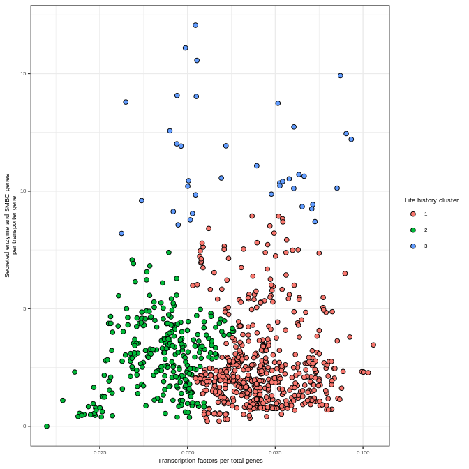<!-- -->

``` r
# 1 = Ruderal, 2 = Scarcity, and 3 = Competitor (Check these before proceeding)
hclust_RefSoil_LHS_groups = data.frame(group = as.factor(c(3, 2, 1)),
                                LHS = factor(c("Competitor", "Scarcity", "Ruderal"),
                                     levels = c("Competitor", "Scarcity", "Ruderal")))
RefSoil_features.hclust.groups = full_join(RefSoil_features.hclust.groups, hclust_RefSoil_LHS_groups, by="group")
```

Plot life history strategies

``` r
# Group plots
hclust_RefSoil_TFperGENE.plot = ggplot(data=RefSoil_features.hclust.groups, aes(x=total_genes, y=n_transfact)) +
  geom_point(size=2, aes(fill=LHS), shape=21) +
  scale_fill_manual(values = CSR.col) +
  labs(x="Total genes", y="Transcription factors", color="Life history cluster") +
  theme_bw() +
  theme(axis.text = element_text(size=6),
        axis.title = element_text(size=7),
        legend.text = element_text(size=6),
        legend.title = element_text(size=7))

hclust_RefSoil_SMBCperMT.plot = ggplot(data=RefSoil_features.hclust.groups, aes(x=n_transport, y=n_SEC_SMBC)) +
  geom_point(size=2, aes(fill=LHS), shape=21) +
  scale_fill_manual(values = CSR.col) +
  labs(x="Transporter genes", y="Secreted enzyme and SMBC genes", color="Life history cluster") +
  theme_bw() +
  theme(axis.text = element_text(size=6),
        axis.title = element_text(size=7),
        legend.text = element_text(size=6),
        legend.title = element_text(size=7))

hclust_RefSoil_LHS.plot = ggplot(data=RefSoil_features.hclust.groups, aes(x=TFperGENE, y=SECSMBCperMT)) +
  geom_point(size=2, aes(fill=LHS), shape=21) +
  scale_fill_manual(values = CSR.col) +
  labs(x="Transcription factors per total genes", y="Secreted enzyme and SMBC genes\nper transporter gene", color="Life history cluster") +
  theme_bw() +
  theme(axis.text = element_text(size=6),
        axis.title = element_text(size=7),
        legend.text = element_text(size=6),
        legend.title = element_text(size=7))

hclust_RefSoil_LHS.plot.leg = g_legend(hclust_RefSoil_LHS.plot)

cowplot::plot_grid(hclust_RefSoil_TFperGENE.plot + theme(legend.position = "none"), 
                   hclust_RefSoil_SMBCperMT.plot + theme(legend.position = "none"), 
                   hclust_RefSoil_LHS.plot + theme(legend.position = "none"),
                   hclust_LHS.plot.leg, labels = c("A", "B", "C", ""), label_size = 8)
```

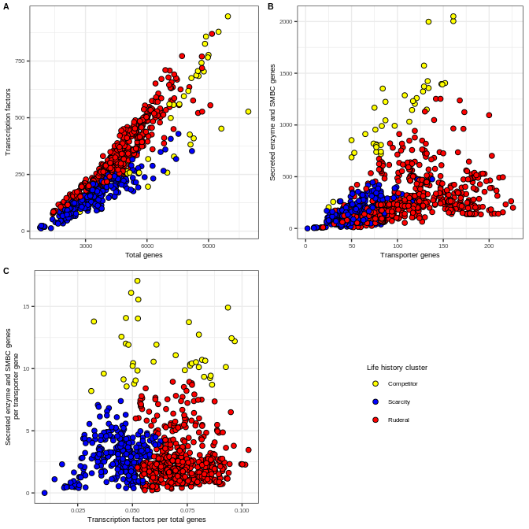<!-- -->

Plot life history strategies with taxonomy

``` r
# Taxa plots
hclust_RefSoil_TFperGENE_Taxa.plot = ggplot(data=RefSoil_features.hclust.groups, aes(x=total_genes, y=n_transfact)) +
  geom_point(aes(fill=Taxa_short, shape=LHS), size=3) +
  labs(x="Total genes", y="Transcription factors", color="Life history cluster", fill="Bacterial Taxa") +
  scale_fill_manual(values=paultol_colors(length(unique(RefSoil_features.hclust.groups$Taxa_short)))) +
  scale_shape_manual(values=c("Competitor" = 21, "Scarcity" = 22, "Ruderal" = 24)) +
  theme_bw() +
  theme(axis.text = element_text(size=6),
        axis.title = element_text(size=7),
        legend.text = element_text(size=6),
        legend.title = element_text(size=7)) +
  guides(fill=guide_legend(override.aes=list(shape=21)))
hclust_RefSoil_TFperGENE_Taxa.plot
```

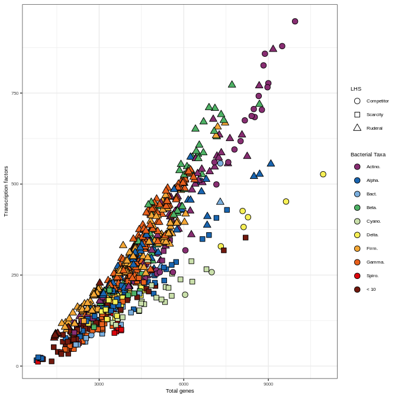<!-- -->

``` r
hclust_RefSoil_SMBCperMT_Taxa.plot = ggplot(data=RefSoil_features.hclust.groups, aes(x=n_transport, y=n_SEC_SMBC)) +
  geom_point(aes(fill=Taxa_short, shape=LHS), size=3) +
  labs(x="Transporter genes", y="Secreted enzyme and SMBC genes", color="Life history cluster", fill="Bacterial Taxa") +
  scale_fill_manual(values=paultol_colors(length(unique(RefSoil_features.hclust.groups$Taxa_short)))) +
  scale_shape_manual(values=c("Competitor" = 21, "Scarcity" = 22, "Ruderal" = 24)) +
  theme_bw() +
  theme(axis.text = element_text(size=6),
        axis.title = element_text(size=7),
        legend.text = element_text(size=6),
        legend.title = element_text(size=7)) +
  guides(fill=guide_legend(override.aes=list(shape=21)))
hclust_RefSoil_SMBCperMT_Taxa.plot
```

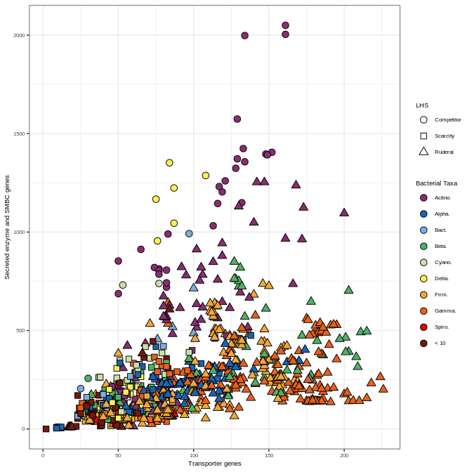<!-- -->

``` r
hclust_RefSoil_LHS_Taxa.plot = ggplot(data=RefSoil_features.hclust.groups, aes(x=TFperGENE, y=SECSMBCperMT)) +
  geom_point(aes(fill=Taxa_short, shape=LHS), size=3) +
  labs(x="Transcription factors per total genes", y="Secreted enzyme and SMBC genes\nper transporter gene", 
       fill="Bacterial Taxa") +
  scale_fill_manual(values=paultol_colors(length(unique(RefSoil_features.hclust.groups$Taxa_short)))) +
  scale_shape_manual(values=c("Competitor" = 21, "Scarcity" = 22, "Ruderal" = 24)) +
  theme_bw() +
  theme(axis.text = element_text(size=6),
        axis.title = element_text(size=7),
        legend.text = element_text(size=6),
        legend.title = element_text(size=7)) +
  guides(fill=guide_legend(override.aes=list(shape=21)))
hclust_RefSoil_LHS_Taxa.plot
```

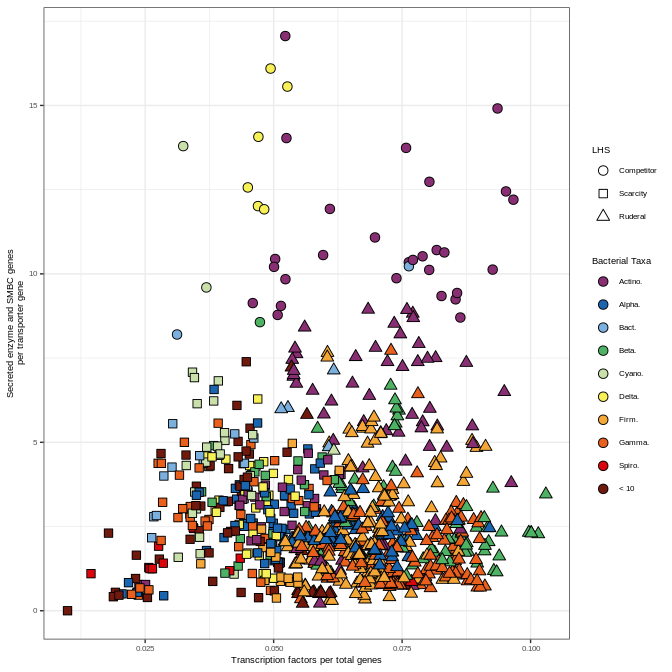<!-- -->

Summarize taxonomies for each life history strategy
prediction

``` r
hclust_RefSoil_features_groups.taxa_sum = RefSoil_features.hclust.groups %>%
  group_by(LHS) %>%
  mutate(LHS_count = n()) %>%
  ungroup %>%
  group_by(Taxa_short) %>%
  mutate(Taxa_count = n()) %>%
  ungroup %>%
  group_by(Taxa_short, LHS, LHS_count, Taxa_count) %>%
  summarize(n_genomes = n()) %>%
  ungroup %>%
  mutate(perc_LHS = n_genomes/LHS_count*100,
         perc_Taxa = n_genomes/Taxa_count*100)
```

    ## `summarise()` has grouped output by 'Taxa_short', 'LHS', 'LHS_count'. You can override using the `.groups` argument.

``` r
hclust_RefSoil_LHSperTaxa.plot = ggplot(data=hclust_RefSoil_features_groups.taxa_sum, aes(x=Taxa_short, y=perc_Taxa)) +
  geom_bar(stat="identity", aes(fill=LHS)) +
  geom_text(data=unique(select(hclust_RefSoil_features_groups.taxa_sum, Taxa_short, Taxa_count)),
            y=102, aes(x=Taxa_short, label=Taxa_count)) +
  scale_fill_manual(values=CSR.col) +
  labs(x="Bacterial Phylum/Class", y="Percent of genomes", fill="Predicted life\nhistory strategy") +
  theme_bw()
hclust_RefSoil_LHSperTaxa.plot
```

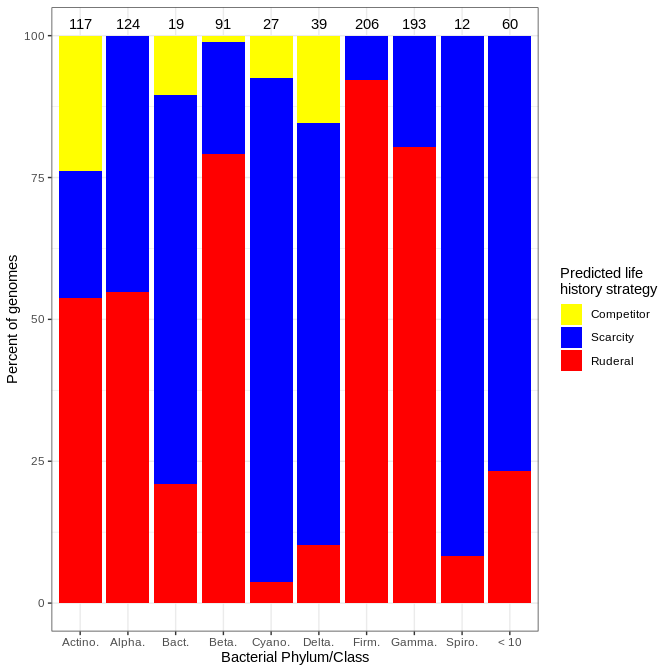<!-- -->

``` r
hclust_RefSoil_TaxaperLHS.plot = ggplot(data=hclust_RefSoil_features_groups.taxa_sum, aes(x=LHS, y=perc_LHS)) +
  geom_bar(stat="identity", aes(fill=Taxa_short)) +
  geom_text(data=unique(select(hclust_RefSoil_features_groups.taxa_sum, LHS, LHS_count)),
            y=102, aes(x=LHS, label=LHS_count)) +
  scale_fill_manual(values=paultol_colors(length(unique(hclust_RefSoil_features_groups.taxa_sum$Taxa_short)))) +
  labs(x="Predicted life history strategy", y="Percent of genomes", fill="Bacterial\nPhylum/Class") +
  theme_bw()
hclust_RefSoil_TaxaperLHS.plot
```

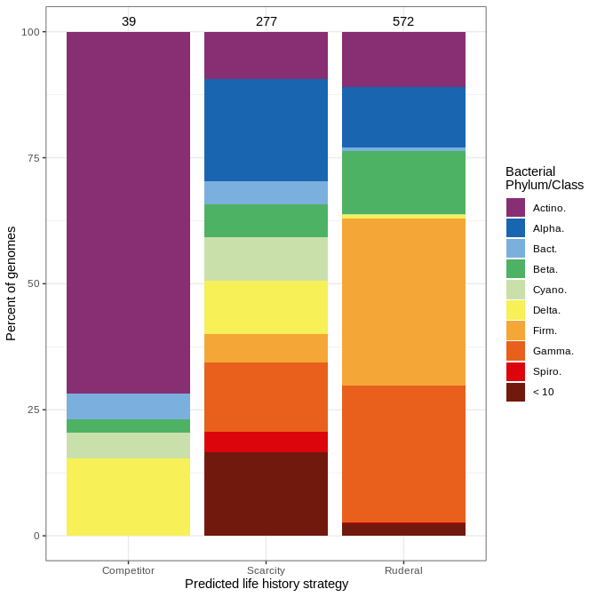<!-- -->

## Cluster genome LHS with k-means trained with MAGs

This clustering method dependent of the MAG results. Thus the MAGs are
used to predict these independent genomes.

``` r
set.seed(7242)
RefSoil_features.kmeans <- predict(MAG_feat.kmeans, newdata=scale(select(RefSoil_features.sum, TFperGENE, SECSMBCperMT), center = TRUE))
RefSoil_features.kmeans.groups = RefSoil_features.sum %>%
  mutate(group = as.factor(RefSoil_features.kmeans)) %>%
  left_join(kmeans_LHS_groups, by = "group")
```

Plot life history strategies

``` r
# Group plots
kmeans_RefSoil_TFperGENE.plot = ggplot(data=RefSoil_features.kmeans.groups, aes(x=total_genes, y=n_transfact)) +
  geom_point(aes(fill=LHS, shape=LHS), size=2) +
  scale_fill_manual(values = CSR.col) +
  scale_shape_manual(values=c("Competitor" = 21, "Scarcity" = 22, "Ruderal" = 24)) +
  labs(x="Total genes", y="Transcription factors", color="Life history cluster") +
  theme_bw() +
  theme(axis.text = element_text(size=6),
        axis.title = element_text(size=7),
        legend.text = element_text(size=6),
        legend.title = element_text(size=7))

kmeans_RefSoil_SMBCperMT.plot = ggplot(data=RefSoil_features.kmeans.groups, aes(x=n_transport, y=n_SEC_SMBC)) +
  geom_point(aes(fill=LHS, shape=LHS), size=2) +
  scale_fill_manual(values = CSR.col) +
  scale_shape_manual(values=c("Competitor" = 21, "Scarcity" = 22, "Ruderal" = 24)) +
  labs(x="Transporter genes", y="Secreted enzyme and SMBC genes", color="Life history cluster") +
  theme_bw() +
  theme(axis.text = element_text(size=6),
        axis.title = element_text(size=7),
        legend.text = element_text(size=6),
        legend.title = element_text(size=7))

kmeans_RefSoil_LHS.plot = ggplot(data=RefSoil_features.kmeans.groups, aes(x=TFperGENE, y=SECSMBCperMT)) +
  geom_point(aes(fill=LHS, shape=LHS), size=2) +
  scale_fill_manual(values = CSR.col) +
  scale_shape_manual(values=c("Competitor" = 21, "Scarcity" = 22, "Ruderal" = 24)) +
  labs(x="Transcription factors per total genes", y="Secreted enzyme and SMBC genes\nper transporter gene", color="Life history cluster") +
  theme_bw() +
  theme(axis.text = element_text(size=6),
        axis.title = element_text(size=7),
        legend.text = element_text(size=6),
        legend.title = element_text(size=7))

kmeans_RefSoil_LHS.plot.leg = g_legend(kmeans_RefSoil_LHS.plot)

cowplot::plot_grid(kmeans_RefSoil_TFperGENE.plot + theme(legend.position = "none"), 
                   kmeans_RefSoil_SMBCperMT.plot + theme(legend.position = "none"), 
                   kmeans_RefSoil_LHS.plot + theme(legend.position = "none"),
                   kmeans_LHS.plot.leg, labels = c("A", "B", "C", ""), label_size = 8)
```

<!-- -->

Plot life history strategies with taxonomy

``` r
# Taxa plots
kmeans_RefSoil_TFperGENE_Taxa.plot = ggplot(data=RefSoil_features.kmeans.groups, aes(x=total_genes, y=n_transfact)) +
  geom_point(aes(fill=Taxa_short, shape=LHS), size=2) +
  labs(x="Total genes", y="Transcription factors", color="Life history cluster", fill="Bacterial Taxa") +
  scale_fill_manual(values=paultol_colors(length(unique(RefSoil_features.kmeans.groups$Taxa_short)))) +
  scale_shape_manual(values=c("Competitor" = 21, "Scarcity" = 22, "Ruderal" = 24)) +
  theme_bw() +
  theme(axis.text = element_text(size=6),
        axis.title = element_text(size=7),
        legend.text = element_text(size=6),
        legend.title = element_text(size=7)) +
  guides(fill=guide_legend(override.aes=list(shape=21)))
kmeans_RefSoil_TFperGENE_Taxa.plot
```

<!-- -->

``` r
kmeans_RefSoil_SMBCperMT_Taxa.plot = ggplot(data=RefSoil_features.kmeans.groups, aes(x=n_transport, y=n_SEC_SMBC)) +
  geom_point(aes(fill=Taxa_short, shape=LHS), size=2) +
  labs(x="Transporter genes", y="Secreted enzyme and SMBC genes", color="Life history cluster", fill="Bacterial Taxa") +
  scale_fill_manual(values=paultol_colors(length(unique(RefSoil_features.kmeans.groups$Taxa_short)))) +
  scale_shape_manual(values=c("Competitor" = 21, "Scarcity" = 22, "Ruderal" = 24)) +
  theme_bw() +
  theme(axis.text = element_text(size=6),
        axis.title = element_text(size=7),
        legend.text = element_text(size=6),
        legend.title = element_text(size=7)) +
  guides(fill=guide_legend(override.aes=list(shape=21)))
kmeans_RefSoil_SMBCperMT_Taxa.plot
```

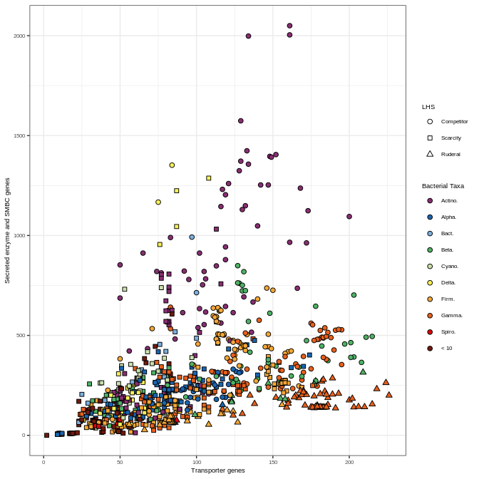<!-- -->

``` r
kmeans_RefSoil_LHS_Taxa.plot = ggplot(data=RefSoil_features.kmeans.groups, aes(x=TFperGENE, y=SECSMBCperMT)) +
  geom_point(aes(fill=Taxa_short, shape=LHS), size=2) +
  labs(x="Transcription factors per total genes", y="Secreted enzyme and SMBC genes\nper transporter gene", 
       fill="Bacterial Taxa") +
  scale_fill_manual(values=paultol_colors(length(unique(RefSoil_features.kmeans.groups$Taxa_short)))) +
  scale_shape_manual(values=c("Competitor" = 21, "Scarcity" = 22, "Ruderal" = 24)) +
  theme_bw() +
  theme(axis.text = element_text(size=6),
        axis.title = element_text(size=7),
        legend.text = element_text(size=6),
        legend.title = element_text(size=7)) +
  guides(fill=guide_legend(override.aes=list(shape=21)))
kmeans_RefSoil_LHS_Taxa.plot
```

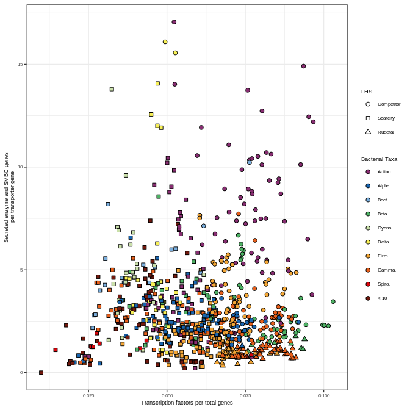<!-- -->

Plot for
publication

``` r
kmeans_RefSoil_LHS_full.plot1 = cowplot::plot_grid(kmeans_RefSoil_TFperGENE.plot + theme(legend.position = "none"), 
                                      kmeans_RefSoil_SMBCperMT.plot + theme(legend.position = "none"), 
                                      kmeans_RefSoil_LHS.plot + theme(legend.position = "none"),
                                      nrow=1, labels=c("a", "b", "c"), label_size = 8)

kmeans_RefSoil_LHS_Taxa.plot.leg = g_legend(kmeans_RefSoil_TFperGENE_Taxa.plot +
                                              labs(shape="Life history cluster") +
                                              guides(shape=guide_legend(override.aes=list(fill=c(CSR.col)))))


kmeans_RefSoil_LHS_full.plot2 = cowplot::plot_grid(kmeans_RefSoil_TFperGENE_Taxa.plot + theme(legend.position = "none"), 
                                      kmeans_RefSoil_SMBCperMT_Taxa.plot + theme(legend.position = "none"), 
                                      kmeans_RefSoil_LHS_Taxa.plot + theme(legend.position = "none"),
                                      nrow=1, labels=c("d", "e", "f"), label_size = 8)

kmeans_RefSoil_LHS_full.plot3 = cowplot::plot_grid(kmeans_RefSoil_LHS_full.plot1, kmeans_RefSoil_LHS_full.plot2, ncol=1)

kmeans_RefSoil_LHS_full.plot = cowplot::plot_grid(kmeans_RefSoil_LHS_full.plot3, kmeans_RefSoil_LHS_Taxa.plot.leg, 
                                          nrow=1, rel_widths = c(1, 0.25))
kmeans_RefSoil_LHS_full.plot
```

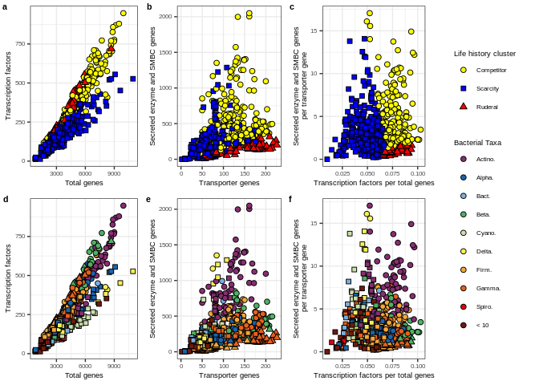<!-- -->

``` r
ggsave(kmeans_RefSoil_LHS_full.plot, filename = "/home/sam/FullCyc_metagenome/figs4publication/Fig7.tiff", 
       device = "tiff", width = 7, height = 5, units = "in")
```

Summarize taxonomies for each life history strategy
prediction

``` r
kmeans_RefSoil_features_groups.taxa_sum = RefSoil_features.kmeans.groups %>%
  group_by(LHS) %>%
  mutate(LHS_count = n()) %>%
  ungroup %>%
  group_by(Taxa_short) %>%
  mutate(Taxa_count = n()) %>%
  ungroup %>%
  group_by(Taxa_short, LHS, LHS_count, Taxa_count) %>%
  summarize(n_genomes = n()) %>%
  ungroup %>%
  mutate(perc_LHS = n_genomes/LHS_count*100,
         perc_Taxa = n_genomes/Taxa_count*100)
```

    ## `summarise()` has grouped output by 'Taxa_short', 'LHS', 'LHS_count'. You can override using the `.groups` argument.

``` r
kmeans_RefSoil_LHSperTaxa.plot = ggplot(data=kmeans_RefSoil_features_groups.taxa_sum, aes(x=Taxa_short, y=perc_Taxa)) +
  geom_bar(stat="identity", aes(fill=LHS)) +
  geom_text(data=unique(select(kmeans_RefSoil_features_groups.taxa_sum, Taxa_short, Taxa_count)),
            y=102, aes(x=Taxa_short, label=Taxa_count), size=6*5/14) +
  scale_fill_manual(values=CSR.col) +
  labs(x="Bacterial Phylum/Class", y="Percent of genomes", fill="Predicted life\nhistory strategy") +
  theme_bw() +
  theme(axis.text.x = element_text(size=6, angle=45, hjust=1),
        axis.text.y = element_text(size=6),
        axis.title = element_text(size=7),
        legend.text = element_text(size=6),
        legend.title = element_text(size=7))


kmeans_RefSoil_TaxaperLHS.plot = ggplot(data=kmeans_RefSoil_features_groups.taxa_sum, aes(x=LHS, y=perc_LHS)) +
  geom_bar(stat="identity", aes(fill=Taxa_short)) +
  geom_text(data=unique(select(kmeans_RefSoil_features_groups.taxa_sum, LHS, LHS_count)),
            y=102, aes(x=LHS, label=LHS_count), size=6*5/14) +
  scale_fill_manual(values=paultol_colors(length(unique(kmeans_RefSoil_features_groups.taxa_sum$Taxa_short)))) +
  labs(x="Predicted life history strategy", y="Percent of genomes", fill="Bacterial\nPhylum/Class") +
  theme_bw() +
  theme(axis.text = element_text(size=6),
        axis.title = element_text(size=7),
        legend.text = element_text(size=6),
        legend.title = element_text(size=7))


kmeans_RefSoil_Taxa.plot = cowplot::plot_grid(kmeans_RefSoil_LHSperTaxa.plot,
                                              kmeans_RefSoil_TaxaperLHS.plot,
                                              ncol=1, labels = c("a", "b"), label_size = 8)
kmeans_RefSoil_Taxa.plot
```

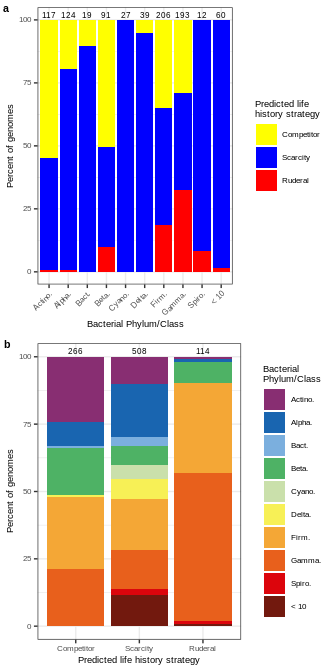<!-- -->

``` r
ggsave(kmeans_RefSoil_LHS_full.plot, filename = "/home/sam/FullCyc_metagenome/figs4publication/FigS10.tiff", 
       device = "tiff", width = 3.5, height = 7, units = "in")
```

### Taxon specific figure

``` 
        -A gamma: Pseudomonas fluorescence or syringae or the like
           -A firmicute: Bacillus subtilis or thuringiensis, Paenibacillus or the like
           -An Actio: Streptomyces, Agromyces
           -A hard to culture bugger: Acidobacteria, Verrucomicrobia, Planctomycetales, Gemmatamonidetes
           
           
```

``` r
SpecSpec_RefSoil_features.kmeans.groups = RefSoil_features.kmeans.groups %>%
  left_join(unique(select(RefSoil_metadata.df, RefSoil.ID, Kingdom, Phylum, Class, Order, Family, Genus, Species)),
            by = "RefSoil.ID") %>%
  mutate(SpecSpecC = NA,
         SpecSpecS = NA,
         SpecSpecR = NA) %>%
  mutate(SpecSpecC = ifelse(Genus == "Streptomyces", "Streptomyces", SpecSpecC)) %>%
  mutate(SpecSpecS = ifelse(Phylum == "Gemmatimonadetes", "Gemmatimonadetes", SpecSpecS)) %>%
  mutate(SpecSpecS = ifelse(Phylum == "Acidobacteria", "Acidobacteria", SpecSpecS)) %>%
  mutate(SpecSpecS = ifelse(Phylum == "Verrucomicrobia", "Verrucomicrobia", SpecSpecS)) %>%
  mutate(SpecSpecS = ifelse(Phylum == "Planctomycetes", "Planctomycetes", SpecSpecS)) %>%
  mutate(SpecSpecR = ifelse(Genus == "Bacillus", "Bacillus", SpecSpecR)) %>%
  mutate(SpecSpecR = ifelse(Genus == "Pseudomonas", "Pseudomonas", SpecSpecR)) %>%
  mutate(SpecSpecR = ifelse(Genus == "Burkholderia", "Burkholderia", SpecSpecR)) %>%
  arrange(LHS)


ggplot(data=SpecSpec_RefSoil_features.kmeans.groups, aes(x=TFperGENE, y=SECSMBCperMT)) +
  geom_point(aes(shape=LHS), color="grey", fill="grey", alpha=0.5, size=3) +
  geom_point(data=filter(SpecSpec_RefSoil_features.kmeans.groups, !is.na(SpecSpecC)), aes(fill=SpecSpecC, shape=LHS), size=3) +
  labs(x="Transcription factors per total genes", y="Secreted enzyme and SMBC genes\nper transporter gene", 
       fill="Bacterial Taxa") +
  scale_fill_manual(values=paultol_colors(length(unique(SpecSpec_RefSoil_features.kmeans.groups$SpecSpecC)))) +
  scale_shape_manual(values=c("Competitor" = 21, "Scarcity" = 22, "Ruderal" = 24)) +
  theme_bw() +
  theme(axis.text = element_text(size=6),
        axis.title = element_text(size=7),
        legend.text = element_text(size=6),
        legend.title = element_text(size=7)) +
  guides(fill=guide_legend(override.aes=list(shape=21)))
```

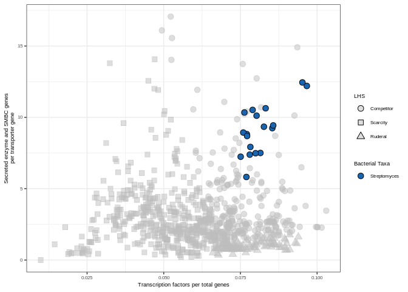<!-- -->

``` r
ggplot(data=SpecSpec_RefSoil_features.kmeans.groups, aes(x=TFperGENE, y=SECSMBCperMT)) +
  geom_point(aes(shape=LHS), color="grey", fill="grey", alpha=0.5, size=3) +
  geom_point(data=filter(SpecSpec_RefSoil_features.kmeans.groups, !is.na(SpecSpecS)), aes(fill=SpecSpecS, shape=LHS), size=3) +
  labs(x="Transcription factors per total genes", y="Secreted enzyme and SMBC genes\nper transporter gene", 
       fill="Bacterial Taxa") +
  scale_fill_manual(values=paultol_colors(length(unique(SpecSpec_RefSoil_features.kmeans.groups$SpecSpecS)))) +
  scale_shape_manual(values=c("Competitor" = 21, "Scarcity" = 22, "Ruderal" = 24)) +
  theme_bw() +
  theme(axis.text = element_text(size=6),
        axis.title = element_text(size=7),
        legend.text = element_text(size=6),
        legend.title = element_text(size=7)) +
  guides(fill=guide_legend(override.aes=list(shape=21)))
```

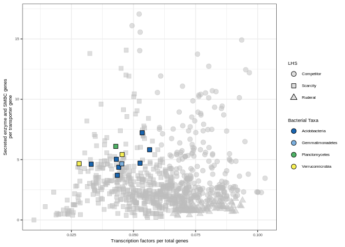<!-- -->

``` r
ggplot(data=SpecSpec_RefSoil_features.kmeans.groups, aes(x=TFperGENE, y=SECSMBCperMT)) +
  geom_point(aes(shape=LHS), color="grey", fill="grey", alpha=0.5, size=3) +
  geom_point(data=filter(SpecSpec_RefSoil_features.kmeans.groups, !is.na(SpecSpecR)), aes(fill=SpecSpecR, shape=LHS), size=3) +
  labs(x="Transcription factors per total genes", y="Secreted enzyme and SMBC genes\nper transporter gene", 
       fill="Bacterial Taxa") +
  scale_fill_manual(values=paultol_colors(length(unique(SpecSpec_RefSoil_features.kmeans.groups$SpecSpecR)))) +
  scale_shape_manual(values=c("Competitor" = 21, "Scarcity" = 22, "Ruderal" = 24)) +
  theme_bw() +
  theme(axis.text = element_text(size=6),
        axis.title = element_text(size=7),
        legend.text = element_text(size=6),
        legend.title = element_text(size=7)) +
  guides(fill=guide_legend(override.aes=list(shape=21)))
```

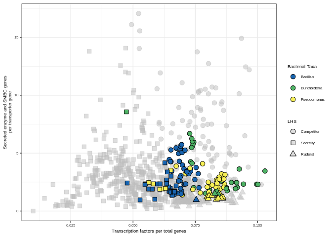<!-- -->

# More genomic features for life history strategy predictions

## MAGs

``` r
# Import both gram + and gram - predictions
gram_neg_signalp.df = read.table("/home/sam/FullCyc_metagenome/annotation/signalp_annotation/Ga0334612_proteins_gram_neg_summary.signalp5", 
                            sep="\t", quote="", header=TRUE, stringsAsFactors = FALSE, comment.char = "") %>%
  filter(Prediction != "OTHER") %>%
  rename(geneID = X..ID) %>%
  tidyr::separate(geneID, into=c("Project", "Scaffold", "start", "end"), sep="_", remove=FALSE) %>%
  mutate(Scaffold = paste(Project, Scaffold, sep="_")) %>%
  select(geneID, Scaffold, Prediction) %>%
  rename(gramNEG_prediction = Prediction)
  
gram_pos_signalp.df = read.table("/home/sam/FullCyc_metagenome/annotation/signalp_annotation/Ga0334612_proteins_gram_pos_summary.signalp5", 
                            sep="\t", quote="", header=TRUE, stringsAsFactors = FALSE, comment.char = "") %>%
  filter(Prediction != "OTHER") %>%
  rename(geneID = X..ID) %>%
  tidyr::separate(geneID, into=c("Project", "Scaffold", "start", "end"), sep="_", remove=FALSE) %>%
  mutate(Scaffold = paste(Project, Scaffold, sep="_")) %>%
  select(geneID, Scaffold, Prediction) %>%
  rename(gramPOS_prediction = Prediction)

signalp_full.df = full_join(gram_neg_signalp.df, gram_pos_signalp.df) %>%
  filter(geneID %in% unique(bin_annotation.df$geneID))
```

    ## Joining, by = c("geneID", "Scaffold")

``` r
gram_neg_signalp.df = NULL
gram_pos_signalp.df = NULL
```

``` r
# Chemotaxis
chemotaxis.sum = bin_annotation.df %>%
  group_by(BinID) %>%
  mutate(total_genes = n()) %>%
  ungroup %>%
  mutate(product_lower = tolower(product)) %>%
  filter(grepl("methyl-accepting chemotaxis protein", product_lower)) %>%
  group_by(BinID, total_genes) %>%
  summarize(n_chemotaxis = n()) %>%
  ungroup %>%
  mutate(perc_chemotaxis = n_chemotaxis/total_genes*100)
```

    ## `summarise()` has grouped output by 'BinID'. You can override using the `.groups` argument.

``` r
# Transport proteins
transmembrane.df = read.table("/home/sam/FullCyc_metagenome/annotation/transmembrane/TMHMM_table_10_20_20.txt", sep="\t", header=TRUE)
transport_grep_str = "transporter|channel|exchanger|symporter|antiporter|exporter|importer|ATPase|pump"

transport.sum = bin_annotation.df %>%
  group_by(BinID) %>%
  mutate(total_genes = n()) %>%
  ungroup %>%
  mutate(product_lower = tolower(product)) %>%
  filter(grepl(transport_grep_str, product_lower)) %>%
  inner_join(transmembrane.df, by="geneID") %>%
  group_by(BinID, total_genes) %>%
  summarize(n_transport = n()) %>%
  ungroup %>%
  mutate(perc_transport = n_transport/total_genes*100)
```

    ## `summarise()` has grouped output by 'BinID'. You can override using the `.groups` argument.

``` r
# Adhesion proteins
adhesion_products = c("holdfast attachment protein HfaA", "curli production assembly/transport component CsgG/holdfast attachment protein HfaB",
                      "adhesin/invasin", "fibronectin-binding autotransporter adhesin", "surface adhesion protein", "autotransporter adhesin",
                      "adhesin HecA-like repeat protein", "ABC-type Zn2+ transport system substrate-binding protein/surface adhesin",
                      "large exoprotein involved in heme utilization and adhesion", "Tfp pilus tip-associated adhesin PilY1", 
                      "type V secretory pathway adhesin AidA")

adhesion.sum = bin_annotation.df %>%
  group_by(BinID) %>%
  mutate(total_genes = n()) %>%
  ungroup %>%
  filter(product %in% adhesion_products) %>%
  inner_join(transmembrane.df, by="geneID") %>%
  group_by(BinID, total_genes) %>%
  summarize(n_adhesion = n()) %>%
  ungroup %>%
  mutate(perc_adhesion = n_adhesion/total_genes*100)
```

    ## `summarise()` has grouped output by 'BinID'. You can override using the `.groups` argument.

``` r
# Transcription factors
transfact_grep_str = "transcriptional regulator|transcriptional repressor|transcriptional activator|transcription factor|transcriptional regulation|transcription regulator|transcriptional.*regulator"

TF.df = read.table("/home/sam/FullCyc_metagenome/annotation/deepTfactor/deepTfactor_output/Ga0334612_proteins.TFs/prediction_result.txt", 
                   sep="\t", header=TRUE, stringsAsFactors = FALSE) %>%
  filter(prediction == "True") %>%
  filter(sequence_ID %in% unique(bin_annotation.df$geneID))

transfact.sum = bin_annotation.df %>%
  group_by(BinID) %>%
  mutate(total_genes = n()) %>%
  ungroup %>%
  mutate(product_lower = tolower(product)) %>%
  filter(grepl(transfact_grep_str, product_lower) | geneID %in% TF.df$sequence_ID) %>%
  group_by(BinID, total_genes) %>%
  summarize(n_transfact = n()) %>%
  ungroup %>%
  mutate(perc_transfact = n_transfact/total_genes*100)
```

    ## `summarise()` has grouped output by 'BinID'. You can override using the `.groups` argument.

``` r
# Osmotic stress
osmostress_grep_str = "osmoregulated|osmoprotectant|osmotically-inducible|osmo-dependent|osmolarity sensor|ompr|l-ectoine synthase"
osmostress.sum = bin_annotation.df %>%
  group_by(BinID) %>%
  mutate(total_genes = n()) %>%
  ungroup %>%
  mutate(product_lower = tolower(product)) %>%
  filter(grepl(osmostress_grep_str, product_lower)) %>%
  group_by(BinID, total_genes) %>%
  summarize(n_osmostress = n()) %>%
  ungroup %>%
  mutate(perc_osmostress = n_osmostress/total_genes*100)
```

    ## `summarise()` has grouped output by 'BinID'. You can override using the `.groups` argument.

``` r
# Dormancy
#spore_grep_str = "Spo0A"
resuscitation = "RpfC"
tox_antitox = "HipA|HipB|mRNA interferase MazF|antitoxin MazE|MazEF|RelB|RelE|RelBE|DinJ|YafQ"

dormancy.sum = bin_annotation.df %>%
  group_by(BinID) %>%
  mutate(total_genes = n()) %>%
  ungroup %>%
  filter(grepl(tox_antitox, product) | grepl(resuscitation, product)) %>%
  group_by(BinID, total_genes) %>%
  summarize(n_dormancy = n()) %>%
  ungroup %>%
  mutate(perc_dormancy = n_dormancy/total_genes*100)
```

    ## `summarise()` has grouped output by 'BinID'. You can override using the `.groups` argument.

``` r
# Secreted enzymes
signalp_proteases.df = read.table("/home/sam/FullCyc_metagenome/annotation/secreted_protein_annotations/secreted_proteases.txt", sep="\t", stringsAsFactors = FALSE)
colnames(signalp_proteases.df) = c("Query", "Target", "perc_ident", "align_length", "n_mismatch", "n_gaps", 
                                "query_start", "query_end", "target_start", "target_end", "E_value", "bit_score")
signalp_proteases.sum = signalp_proteases.df %>%
  group_by(Query) %>%
  summarize(n_match = n(),
            max_perc_ident = max(perc_ident),
            min_perc_ident = min(perc_ident))

signalp_CAZymes.df = read.table("/home/sam/FullCyc_metagenome/annotation/secreted_protein_annotations/secreted_CAZymes.out.dm.ps.stringent", 
                                sep="\t", stringsAsFactors = FALSE)
colnames(signalp_CAZymes.df) = c("Target", "target_length", "Query", "query_length", "E_value", "V6", "V7", "V8", "V9", "V10")
signalp_CAZymes.sum = signalp_CAZymes.df %>%
  group_by(Query, Target) %>%
  summarize(n_match = n(),
            max_E_value = max(E_value),
            min_E_value = min(E_value)) %>%
  filter(grepl("GH|PL|CE", Target))
```

    ## `summarise()` has grouped output by 'Query'. You can override using the `.groups` argument.

``` r
signalp_ABhydro.df = read.table("/home/sam/FullCyc_metagenome/annotation/secreted_protein_annotations/secreted_ABhydro.out.dm.ps.stringent", 
                                sep="\t", stringsAsFactors = FALSE)
colnames(signalp_ABhydro.df) = c("Target", "target_length", "Query", "query_length", "E_value", "V6", "V7", "V8", "V9", "V10")
signalp_ABhydro.sum = signalp_ABhydro.df %>%
  group_by(Query, Target) %>%
  summarize(n_match = n(),
            max_E_value = max(E_value),
            min_E_value = min(E_value))
```

    ## `summarise()` has grouped output by 'Query'. You can override using the `.groups` argument.

``` r
secenzy.sum = bin_annotation.df %>%
  group_by(BinID) %>%
  mutate(total_genes = n()) %>%
  ungroup %>%
  left_join(signalp_full.df, by = c("geneID", "Scaffold")) %>%
  left_join(select(bin_tax.df, BinID, Phylum), by="BinID") %>%
  mutate(sec_signal = ifelse(Phylum %in% c("Actinobacteriota", "Firmicutes"), gramPOS_prediction, gramNEG_prediction)) %>%
  mutate(protease = ifelse(geneID %in% signalp_proteases.sum$Query, "Yes", "No"),
         CAZy = ifelse(geneID %in% signalp_CAZymes.sum$Query, "Yes", "No"),
         ABhydro = ifelse(geneID %in% signalp_ABhydro.sum$Query, "Yes", "No")) %>%
  filter(!(is.na(sec_signal)),
         protease == "Yes" | CAZy == "Yes" | ABhydro == "Yes") %>%
  group_by(BinID, total_genes) %>%
  summarize(n_secenzy = n()) %>%
  ungroup %>%
  mutate(perc_secenzy = n_secenzy/total_genes*100)
```

    ## `summarise()` has grouped output by 'BinID'. You can override using the `.groups` argument.

``` r
## SMBCs
antismash.df = read.table("/home/sam/FullCyc_metagenome/annotation/antismash/antismash_BCGtable.tsv", header=TRUE, sep="\t") %>%
  rename(smbc_product = product)

SMBC.sum = left_join(bin_annotation.df, antismash.df, by="Scaffold") %>%
  group_by(BinID) %>%
  mutate(total_genes = n()) %>%
  ungroup %>%
  filter(!(is.na(smbc_product))) %>%
  select(BinID, contigName, smbc_product, total_genes) %>%
  unique %>%
  group_by(BinID, total_genes) %>%
  summarize(n_SMBCs = n()) %>%
  ungroup %>%
  mutate(rel_n_SMBCs = n_SMBCs/total_genes)
```

    ## `summarise()` has grouped output by 'BinID'. You can override using the `.groups` argument.

``` r
# Combine them all together
genome_feat.sum = full_join(chemotaxis.sum, transport.sum, by = c("BinID", "total_genes")) %>%
  full_join(transfact.sum, by = c("BinID", "total_genes")) %>%
  full_join(osmostress.sum, by = c("BinID", "total_genes")) %>%
  full_join(dormancy.sum, by = c("BinID", "total_genes")) %>%
  full_join(secenzy.sum, by = c("BinID", "total_genes")) %>%
  full_join(adhesion.sum, by = c("BinID", "total_genes")) %>%
  full_join(SMBC.sum, by = c("BinID", "total_genes"))
genome_feat.sum[is.na(genome_feat.sum)] <- 0
```

``` r
Feature.newnames = data.frame(feature = c("perc_chemotaxis", "perc_transport", "perc_transfact",
                                          "perc_osmostress", "perc_dormancy", "perc_secenzy", 
                                          "perc_adhesion", "rel_n_SMBCs"),
                              feature_good = c("MCPs", "Transporters", "Transcription factors",
                                               "Osmotic stress", "Dormancy", "Secreted enzymes",
                                               "Adhesion", "SMBCs"))

bin_LHS_feat.sum = genome_feat.sum %>%
  left_join(select(MAG_feat.kmeans.groups, BinID, group, LHS), by = "BinID") %>%
  select(BinID, group, LHS, total_genes, perc_chemotaxis, perc_transport, perc_transfact,
         perc_osmostress, perc_dormancy, perc_secenzy, perc_adhesion, rel_n_SMBCs) %>%
  tidyr::gather(key="feature", value="measure", -BinID, -group, -LHS, -total_genes) %>%
  left_join(LH.order, by = "LHS") %>%
  left_join(Feature.newnames, by = "feature")

bin_LHS_feat.dunn.df = data.frame()
for (test_feat in unique(bin_LHS_feat.sum$feature_good)){
  test.df = filter(bin_LHS_feat.sum, feature_good == test_feat)
  test.dunn = dunn.test::dunn.test(test.df$measure, test.df$LHS_order, method="bh")
  
  test.dunn.df = data.frame(comparisons = test.dunn$comparisons,
                            p.adj = test.dunn$P.adjusted,
                            y.adj_level = c(1, 2, 1),
                            feature_good = test_feat) %>%
    tidyr::separate(comparisons, into=c("xstart", "xend"), sep=" - ", remove=FALSE, convert=TRUE) %>%
    mutate(xstart = xstart + 0.1,
           xend = xend - 0.1) %>%
    mutate(x.text = (xend+xstart)/2,
           y.adj = max(test.df$measure)-min(test.df$measure)) %>%
    mutate(y.new = y.adj*0.1*y.adj_level + max(test.df$measure)) %>%
    mutate(y.text = y.adj*0.05 + y.new)
  bin_LHS_feat.dunn.df = rbind(bin_LHS_feat.dunn.df, test.dunn.df)
}
```

    ##   Kruskal-Wallis rank sum test
    ## 
    ## data: x and group
    ## Kruskal-Wallis chi-squared = 5.2228, df = 2, p-value = 0.07
    ## 
    ## 
    ##                            Comparison of x by group                            
    ##                              (Benjamini-Hochberg)                              
    ## Col Mean-|
    ## Row Mean |          1          2
    ## ---------+----------------------
    ##        2 |   0.127805
    ##          |     0.4492
    ##          |
    ##        3 |  -1.845493  -2.252848
    ##          |     0.0487     0.0364
    ## 
    ## alpha = 0.05
    ## Reject Ho if p <= alpha/2
    ##   Kruskal-Wallis rank sum test
    ## 
    ## data: x and group
    ## Kruskal-Wallis chi-squared = 12.4664, df = 2, p-value = 0
    ## 
    ## 
    ##                            Comparison of x by group                            
    ##                              (Benjamini-Hochberg)                              
    ## Col Mean-|
    ## Row Mean |          1          2
    ## ---------+----------------------
    ##        2 |   1.615315
    ##          |     0.0531
    ##          |
    ##        3 |  -1.756620  -3.420684
    ##          |     0.0592    0.0009*
    ## 
    ## alpha = 0.05
    ## Reject Ho if p <= alpha/2
    ##   Kruskal-Wallis rank sum test
    ## 
    ## data: x and group
    ## Kruskal-Wallis chi-squared = 18.2738, df = 2, p-value = 0
    ## 
    ## 
    ##                            Comparison of x by group                            
    ##                              (Benjamini-Hochberg)                              
    ## Col Mean-|
    ## Row Mean |          1          2
    ## ---------+----------------------
    ##        2 |   3.449127
    ##          |    0.0008*
    ##          |
    ##        3 |  -0.243975  -3.230646
    ##          |     0.4036    0.0009*
    ## 
    ## alpha = 0.05
    ## Reject Ho if p <= alpha/2
    ##   Kruskal-Wallis rank sum test
    ## 
    ## data: x and group
    ## Kruskal-Wallis chi-squared = 7.2339, df = 2, p-value = 0.03
    ## 
    ## 
    ##                            Comparison of x by group                            
    ##                              (Benjamini-Hochberg)                              
    ## Col Mean-|
    ## Row Mean |          1          2
    ## ---------+----------------------
    ##        2 |   2.021095
    ##          |     0.0325
    ##          |
    ##        3 |  -0.390360  -2.180436
    ##          |     0.3481     0.0438
    ## 
    ## alpha = 0.05
    ## Reject Ho if p <= alpha/2
    ##   Kruskal-Wallis rank sum test
    ## 
    ## data: x and group
    ## Kruskal-Wallis chi-squared = 1.8533, df = 2, p-value = 0.4
    ## 
    ## 
    ##                            Comparison of x by group                            
    ##                              (Benjamini-Hochberg)                              
    ## Col Mean-|
    ## Row Mean |          1          2
    ## ---------+----------------------
    ##        2 |   1.357308
    ##          |     0.2620
    ##          |
    ##        3 |   0.826192  -0.200144
    ##          |     0.3065     0.4207
    ## 
    ## alpha = 0.05
    ## Reject Ho if p <= alpha/2
    ##   Kruskal-Wallis rank sum test
    ## 
    ## data: x and group
    ## Kruskal-Wallis chi-squared = 9.7734, df = 2, p-value = 0.01
    ## 
    ## 
    ##                            Comparison of x by group                            
    ##                              (Benjamini-Hochberg)                              
    ## Col Mean-|
    ## Row Mean |          1          2
    ## ---------+----------------------
    ##        2 |   0.868784
    ##          |     0.1925
    ##          |
    ##        3 |   2.992760   2.733880
    ##          |    0.0041*    0.0047*
    ## 
    ## alpha = 0.05
    ## Reject Ho if p <= alpha/2
    ##   Kruskal-Wallis rank sum test
    ## 
    ## data: x and group
    ## Kruskal-Wallis chi-squared = 11.3284, df = 2, p-value = 0
    ## 
    ## 
    ##                            Comparison of x by group                            
    ##                              (Benjamini-Hochberg)                              
    ## Col Mean-|
    ## Row Mean |          1          2
    ## ---------+----------------------
    ##        2 |   3.281079
    ##          |    0.0016*
    ##          |
    ##        3 |   2.413715   0.000000
    ##          |    0.0118*     0.5000
    ## 
    ## alpha = 0.05
    ## Reject Ho if p <= alpha/2
    ##   Kruskal-Wallis rank sum test
    ## 
    ## data: x and group
    ## Kruskal-Wallis chi-squared = 3.2696, df = 2, p-value = 0.19
    ## 
    ## 
    ##                            Comparison of x by group                            
    ##                              (Benjamini-Hochberg)                              
    ## Col Mean-|
    ## Row Mean |          1          2
    ## ---------+----------------------
    ##        2 |   1.490460
    ##          |     0.2042
    ##          |
    ##        3 |  -0.048795  -1.330266
    ##          |     0.4805     0.1376
    ## 
    ## alpha = 0.05
    ## Reject Ho if p <= alpha/2

For publication

``` r
LHS_feat_plot_fun = function(summary.df, dunn.df, feat, ylabel){
  bin_LHS_feat.sum.plot = ggplot(data=filter(summary.df, feature_good == feat), aes(x=LHS, y=measure)) +
    geom_boxplot(outlier.shape = NA) +
    geom_jitter(height = 0, width = 0.25, aes(fill=LHS, shape=LHS), size=2) +
    geom_segment(data=filter(dunn.df, p.adj < 0.05, feature_good == feat), aes(x=xstart, xend=xend, y=y.new, yend=y.new)) +
    geom_text(data=filter(dunn.df, p.adj < 0.05, feature_good == feat), 
              aes(x=x.text, y=y.text, label=round(p.adj, digits = 3)), size=6*5/14) +
    scale_fill_manual(values = CSR.col) +
    scale_shape_manual(values=c("Competitor" = 21, "Scarcity" = 22, "Ruderal" = 24)) +
    labs(x="Life history cluster", y=ylabel) +
    theme_bw() +
    theme(axis.text = element_text(size=6),
          axis.title = element_text(size=7),
          legend.text = element_text(size=6),
          legend.title = element_text(size=7),
          strip.text = element_text(size=7),
          legend.position = "none")
  return(bin_LHS_feat.sum.plot)
}

MAG_LHS_feat.plot = cowplot::plot_grid(LHS_feat_plot_fun(bin_LHS_feat.sum, bin_LHS_feat.dunn.df, "MCPs", "MCP\ngene abundance (%)"),
                   LHS_feat_plot_fun(bin_LHS_feat.sum, bin_LHS_feat.dunn.df, "Transporters", "Transporter\ngene abundance (%)"),
                   LHS_feat_plot_fun(bin_LHS_feat.sum, bin_LHS_feat.dunn.df, "Adhesion", "Adhesion\ngene abundance (%)"),
                   LHS_feat_plot_fun(bin_LHS_feat.sum, bin_LHS_feat.dunn.df, "Transcription factors", "Transcription factor\ngene abundance (%)"),
                   LHS_feat_plot_fun(bin_LHS_feat.sum, bin_LHS_feat.dunn.df, "Osmotic stress", "Osmotic stress\ngene abundance (%)"),
                   LHS_feat_plot_fun(bin_LHS_feat.sum, bin_LHS_feat.dunn.df, "Dormancy", "Dormancy\ngene abundance (%)"),
                   LHS_feat_plot_fun(bin_LHS_feat.sum, bin_LHS_feat.dunn.df, "Secreted enzymes", "Secreted enzyme\ngene abundance (%)"),
                   LHS_feat_plot_fun(bin_LHS_feat.sum, bin_LHS_feat.dunn.df, "SMBCs", "SMBC\nabundance"), 
                   ncol=2, labels = c("a", "b", "c", "d", "e", "f", "g", "h"), label_size = 8,
                   align = "v")
MAG_LHS_feat.plot
```

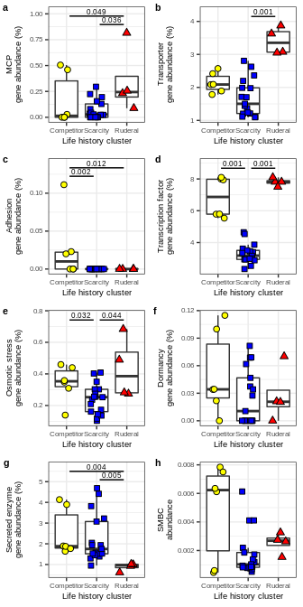<!-- -->

``` r
ggsave(MAG_LHS_feat.plot, filename = "/home/sam/FullCyc_metagenome/figs4publication/Fig6.tiff", 
       device = "tiff", width = 3.5, height = 5, units = "in")
```

## RefSoil genomes

``` r
RefSoil_bact_annotations.df = RefSoil_annotations.df %>%
  filter(Kingdom == "Bacteria") %>%
  group_by(RefSoil.ID) %>%
  mutate(total_genes = n()) %>%
  ungroup %>%
  mutate(product_lower = tolower(product))

# Chemotaxis
RefSoil_chemotaxis.sum = RefSoil_bact_annotations.df %>%
  filter(grepl("methyl-accepting chemotaxis protein", product_lower)) %>%
  group_by(RefSoil.ID, total_genes) %>%
  summarize(n_chemotaxis = n()) %>%
  ungroup %>%
  mutate(perc_chemotaxis = n_chemotaxis/total_genes*100) %>%
  select(RefSoil.ID, perc_chemotaxis)
```

    ## `summarise()` has grouped output by 'RefSoil.ID'. You can override using the `.groups` argument.

``` r
# Adhesion proteins
RefSoil_adhesion.sum = RefSoil_bact_annotations.df %>%
  filter(grepl("adhesion|adhesin", product_lower) & n_TMH > 0) %>%
  group_by(RefSoil.ID, total_genes) %>%
  summarize(n_adhesion = n()) %>%
  ungroup %>%
  mutate(perc_adhesion = n_adhesion/total_genes*100) %>%
  select(RefSoil.ID, perc_adhesion)
```

    ## `summarise()` has grouped output by 'RefSoil.ID'. You can override using the `.groups` argument.

``` r
# Transport proteins
RefSoil_transport.sum = RefSoil_bact_annotations.df %>%
  filter(grepl(transport_grep_str, product) & n_TMH > 0) %>%
  group_by(RefSoil.ID, total_genes) %>%
  summarize(n_transport = n()) %>%
  ungroup %>%
  mutate(perc_transport = n_transport/total_genes*100) %>%
  select(RefSoil.ID, perc_transport)
```

    ## `summarise()` has grouped output by 'RefSoil.ID'. You can override using the `.groups` argument.

``` r
# Transcription factors
RefSoil_transfact.sum = RefSoil_bact_annotations.df %>%
  filter(grepl(transfact_grep_str, product_lower) | TF_prediction == "True") %>%
  group_by(RefSoil.ID, total_genes) %>%
  summarize(n_transfact = n()) %>%
  ungroup %>%
  mutate(perc_transfact = n_transfact/total_genes*100) %>%
  select(RefSoil.ID, perc_transfact)
```

    ## `summarise()` has grouped output by 'RefSoil.ID'. You can override using the `.groups` argument.

``` r
# Osmotic stress
osmostress_grep_str = "osmoregulated|osmoprotectant|osmotically-inducible|osmo-dependent|osmolarity sensor|ompr|l-ectoine synthase"
RefSoil_osmostress.sum = RefSoil_bact_annotations.df %>%
  filter(grepl(osmostress_grep_str, product_lower)) %>%
  group_by(RefSoil.ID, total_genes) %>%
  summarize(n_osmostress = n()) %>%
  ungroup %>%
  mutate(perc_osmostress = n_osmostress/total_genes*100) %>%
  select(RefSoil.ID, perc_osmostress)
```

    ## `summarise()` has grouped output by 'RefSoil.ID'. You can override using the `.groups` argument.

``` r
# Dormancy
RefSoil_dormancy.sum = RefSoil_bact_annotations.df %>%
  filter(grepl(tox_antitox, product) | grepl(resuscitation, product)) %>%
  group_by(RefSoil.ID, total_genes) %>%
  summarize(n_dormancy = n()) %>%
  ungroup %>%
  mutate(perc_dormancy = n_dormancy/total_genes*100) %>%
  select(RefSoil.ID, perc_dormancy)
```

    ## `summarise()` has grouped output by 'RefSoil.ID'. You can override using the `.groups` argument.

``` r
# Secreted enzymes
RefSoil_secenzy.sum = RefSoil_bact_annotations.df %>%
  select(RefSoil.ID, genome_file, total_genes) %>%
  unique %>%
  full_join(RefSoil_proteases.df, by="genome_file") %>%
  full_join(RefSoil_CAZymes.df, by = c("geneID", "genome_file")) %>%
  full_join(RefSoil_ABhydro.df, by = c("geneID", "genome_file")) %>%
  inner_join(RefSoil_signalp_full.df, by = c("geneID", "genome_file")) %>%
  filter(!is.na(RefSoil.ID)) %>%
  group_by(RefSoil.ID, total_genes) %>%
  summarize(n_secenzy = n()) %>%
  ungroup %>%
  mutate(perc_secenzy = n_secenzy/total_genes*100) %>%
  select(RefSoil.ID, perc_secenzy)
```

    ## `summarise()` has grouped output by 'RefSoil.ID'. You can override using the `.groups` argument.

``` r
# SMBCs
RefSoil_SMBC.sum = RefSoil_bact_annotations.df %>%
  select(RefSoil.ID, genome_file, total_genes) %>%
  unique %>%
  inner_join(read.table("/home/sam/FullCyc_metagenome/Other_studies_comp/redo_analysis/full_study_files/RefSoil_antismash_output.txt", 
                        sep="\t", header=TRUE, comment.char = "", quote = "", stringsAsFactors = FALSE),
             by="genome_file") %>%
  group_by(RefSoil.ID, total_genes) %>%
  summarize(n_SMBCs = n()) %>%
  ungroup %>%
  mutate(rel_n_SMBCs = n_SMBCs/total_genes) %>%
  select(RefSoil.ID, rel_n_SMBCs)
```

    ## `summarise()` has grouped output by 'RefSoil.ID'. You can override using the `.groups` argument.

``` r
# Combine them all together
RefSoil_genome_feat.sum = RefSoil_bact_annotations.df %>%
  select(RefSoil.ID, total_genes) %>%
  unique %>%
  full_join(RefSoil_chemotaxis.sum, by = c("RefSoil.ID")) %>%
  full_join(RefSoil_adhesion.sum, by = c("RefSoil.ID")) %>%
  full_join(RefSoil_transport.sum, by = c("RefSoil.ID")) %>%
  full_join(RefSoil_transfact.sum, by = c("RefSoil.ID")) %>%
  full_join(RefSoil_osmostress.sum, by = c("RefSoil.ID")) %>%
  full_join(RefSoil_dormancy.sum, by = c("RefSoil.ID")) %>%
  full_join(RefSoil_secenzy.sum, by = c("RefSoil.ID")) %>%
  full_join(RefSoil_SMBC.sum, by = c("RefSoil.ID"))
RefSoil_genome_feat.sum[is.na(RefSoil_genome_feat.sum)] <- 0
```

``` r
Feature.newnames = data.frame(feature = c("perc_chemotaxis", "perc_transport", "perc_transfact",
                                          "perc_osmostress", "perc_dormancy", "perc_secenzy", 
                                          "perc_adhesion", "rel_n_SMBCs"),
                              feature_good = c("MCPs", "Transporters", "Transcription factors",
                                               "Osmotic stress", "Dormancy", "Secreted enzymes",
                                               "Adhesion", "SMBCs"))

RefSoil_LHS_feat.sum = RefSoil_genome_feat.sum %>%
  left_join(select(RefSoil_features.kmeans.groups, RefSoil.ID, group, LHS), by = "RefSoil.ID") %>%
  select(RefSoil.ID, group, LHS, total_genes, perc_chemotaxis, perc_adhesion, perc_transport, perc_transfact,
         perc_osmostress, perc_dormancy, perc_secenzy, rel_n_SMBCs) %>%
  tidyr::gather(key="feature", value="measure", -RefSoil.ID, -group, -LHS, -total_genes) %>%
  left_join(LH.order, by = "LHS") %>%
  left_join(Feature.newnames, by = "feature")

RefSoil_LHS_feat.dunn.df = data.frame()
for (test_feat in unique(RefSoil_LHS_feat.sum$feature_good)){
  test.df = filter(RefSoil_LHS_feat.sum, feature_good == test_feat)
  test.dunn = dunn.test::dunn.test(test.df$measure, test.df$LHS_order, method="bh")
  
  test.dunn.df = data.frame(comparisons = test.dunn$comparisons,
                            p.adj = test.dunn$P.adjusted,
                            y.adj_level = c(1, 2, 1),
                            feature_good = test_feat) %>%
    tidyr::separate(comparisons, into=c("xstart", "xend"), sep=" - ", remove=FALSE, convert=TRUE) %>%
    mutate(xstart = xstart + 0.1,
           xend = xend - 0.1) %>%
    mutate(x.text = (xend+xstart)/2,
           y.adj = max(test.df$measure)-min(test.df$measure)) %>%
    mutate(y.new = y.adj*0.1*y.adj_level + max(test.df$measure)) %>%
    mutate(y.text = y.adj*0.05 + y.new)
  RefSoil_LHS_feat.dunn.df = rbind(RefSoil_LHS_feat.dunn.df, test.dunn.df)
}
```

    ##   Kruskal-Wallis rank sum test
    ## 
    ## data: x and group
    ## Kruskal-Wallis chi-squared = 57.2827, df = 2, p-value = 0
    ## 
    ## 
    ##                            Comparison of x by group                            
    ##                              (Benjamini-Hochberg)                              
    ## Col Mean-|
    ## Row Mean |          1          2
    ## ---------+----------------------
    ##        2 |   6.325386
    ##          |    0.0000*
    ##          |
    ##        3 |  -0.917634  -5.610467
    ##          |     0.1794    0.0000*
    ## 
    ## alpha = 0.05
    ## Reject Ho if p <= alpha/2
    ##   Kruskal-Wallis rank sum test
    ## 
    ## data: x and group
    ## Kruskal-Wallis chi-squared = 4.2112, df = 2, p-value = 0.12
    ## 
    ## 
    ##                            Comparison of x by group                            
    ##                              (Benjamini-Hochberg)                              
    ## Col Mean-|
    ## Row Mean |          1          2
    ## ---------+----------------------
    ##        2 |   1.800353
    ##          |     0.1077
    ##          |
    ##        3 |  -0.083714  -1.405178
    ##          |     0.4666     0.1200
    ## 
    ## alpha = 0.05
    ## Reject Ho if p <= alpha/2
    ##   Kruskal-Wallis rank sum test
    ## 
    ## data: x and group
    ## Kruskal-Wallis chi-squared = 218.4958, df = 2, p-value = 0
    ## 
    ## 
    ##                            Comparison of x by group                            
    ##                              (Benjamini-Hochberg)                              
    ## Col Mean-|
    ## Row Mean |          1          2
    ## ---------+----------------------
    ##        2 |   7.436140
    ##          |    0.0000*
    ##          |
    ##        3 |  -8.148733  -14.23235
    ##          |    0.0000*    0.0000*
    ## 
    ## alpha = 0.05
    ## Reject Ho if p <= alpha/2
    ##   Kruskal-Wallis rank sum test
    ## 
    ## data: x and group
    ## Kruskal-Wallis chi-squared = 619.3539, df = 2, p-value = 0
    ## 
    ## 
    ##                            Comparison of x by group                            
    ##                              (Benjamini-Hochberg)                              
    ## Col Mean-|
    ## Row Mean |          1          2
    ## ---------+----------------------
    ##        2 |   22.14940
    ##          |    0.0000*
    ##          |
    ##        3 |  -0.340428  -16.54288
    ##          |     0.3668    0.0000*
    ## 
    ## alpha = 0.05
    ## Reject Ho if p <= alpha/2
    ##   Kruskal-Wallis rank sum test
    ## 
    ## data: x and group
    ## Kruskal-Wallis chi-squared = 71.2203, df = 2, p-value = 0
    ## 
    ## 
    ##                            Comparison of x by group                            
    ##                              (Benjamini-Hochberg)                              
    ## Col Mean-|
    ## Row Mean |          1          2
    ## ---------+----------------------
    ##        2 |   6.300025
    ##          |    0.0000*
    ##          |
    ##        3 |  -2.236540  -7.016575
    ##          |    0.0127*    0.0000*
    ## 
    ## alpha = 0.05
    ## Reject Ho if p <= alpha/2
    ##   Kruskal-Wallis rank sum test
    ## 
    ## data: x and group
    ## Kruskal-Wallis chi-squared = 12.9505, df = 2, p-value = 0
    ## 
    ## 
    ##                            Comparison of x by group                            
    ##                              (Benjamini-Hochberg)                              
    ## Col Mean-|
    ## Row Mean |          1          2
    ## ---------+----------------------
    ##        2 |   0.199442
    ##          |     0.4210
    ##          |
    ##        3 |  -3.131528  -3.528196
    ##          |    0.0013*    0.0006*
    ## 
    ## alpha = 0.05
    ## Reject Ho if p <= alpha/2
    ##   Kruskal-Wallis rank sum test
    ## 
    ## data: x and group
    ## Kruskal-Wallis chi-squared = 30.1262, df = 2, p-value = 0
    ## 
    ## 
    ##                            Comparison of x by group                            
    ##                              (Benjamini-Hochberg)                              
    ## Col Mean-|
    ## Row Mean |          1          2
    ## ---------+----------------------
    ##        2 |   4.686564
    ##          |    0.0000*
    ##          |
    ##        3 |   4.639893   1.589337
    ##          |    0.0000*     0.0560
    ## 
    ## alpha = 0.05
    ## Reject Ho if p <= alpha/2
    ##   Kruskal-Wallis rank sum test
    ## 
    ## data: x and group
    ## Kruskal-Wallis chi-squared = 290.0763, df = 2, p-value = 0
    ## 
    ## 
    ##                            Comparison of x by group                            
    ##                              (Benjamini-Hochberg)                              
    ## Col Mean-|
    ## Row Mean |          1          2
    ## ---------+----------------------
    ##        2 |   12.14663
    ##          |    0.0000*
    ##          |
    ##        3 |   16.08895   8.508230
    ##          |    0.0000*    0.0000*
    ## 
    ## alpha = 0.05
    ## Reject Ho if p <= alpha/2

``` r
RefSoil_LHS_feat.dunn.df = RefSoil_LHS_feat.dunn.df %>%
  mutate(padj.label = ifelse(p.adj >= 0.001, as.character(round(p.adj, digits = 3)), "< 0.001"))
```

``` r
LHS_feat_plot_fun = function(summary.df, dunn.df, feat, ylabel){
  bin_LHS_feat.sum.plot = ggplot(data=filter(summary.df, feature_good == feat), aes(x=LHS, y=measure)) +
    geom_boxplot(outlier.shape = 21) +
    #geom_jitter(height = 0, width = 0.25, aes(fill=LHS, shape=LHS), size=2) +
    geom_segment(data=filter(dunn.df, p.adj < 0.05, feature_good == feat), aes(x=xstart, xend=xend, y=y.new, yend=y.new)) +
    geom_text(data=filter(dunn.df, p.adj < 0.05, feature_good == feat), 
              aes(x=x.text, y=y.text, label=padj.label), size=6*5/14) +
    scale_fill_manual(values = CSR.col) +
    scale_shape_manual(values=c("Competitor" = 21, "Scarcity" = 22, "Ruderal" = 24)) +
    labs(x="Life history cluster", y=ylabel) +
    theme_bw() +
    theme(axis.text = element_text(size=6),
          axis.title = element_text(size=7),
          legend.text = element_text(size=6),
          legend.title = element_text(size=7),
          strip.text = element_text(size=7),
          legend.position = "none")
  return(bin_LHS_feat.sum.plot)
}

Genome_LHS_feat.plot = cowplot::plot_grid(LHS_feat_plot_fun(RefSoil_LHS_feat.sum, RefSoil_LHS_feat.dunn.df, "MCPs", "MCP\ngene abundance (%)"),
                   LHS_feat_plot_fun(RefSoil_LHS_feat.sum, RefSoil_LHS_feat.dunn.df, "Transporters", "Transporter\ngene abundance (%)"),
                   LHS_feat_plot_fun(RefSoil_LHS_feat.sum, RefSoil_LHS_feat.dunn.df, "Adhesion", "Adhesion\ngene abundance (%)"),
                   LHS_feat_plot_fun(RefSoil_LHS_feat.sum, RefSoil_LHS_feat.dunn.df, "Transcription factors", "Transcription factor\ngene abundance (%)"),
                   LHS_feat_plot_fun(RefSoil_LHS_feat.sum, RefSoil_LHS_feat.dunn.df, "Osmotic stress", "Osmotic stress\ngene abundance (%)"),
                   LHS_feat_plot_fun(RefSoil_LHS_feat.sum, RefSoil_LHS_feat.dunn.df, "Dormancy", "Dormancy\ngene abundance (%)"),
                   LHS_feat_plot_fun(RefSoil_LHS_feat.sum, RefSoil_LHS_feat.dunn.df, "Secreted enzymes", "Secreted enzyme\ngene abundance (%)"),
                   LHS_feat_plot_fun(RefSoil_LHS_feat.sum, RefSoil_LHS_feat.dunn.df, "SMBCs", "SMBC\nabundance"), 
                   ncol=2, labels = c("a", "b", "c", "d", "e", "f", "g", "h"), label_size = 8,
                   align = "v")
Genome_LHS_feat.plot
```

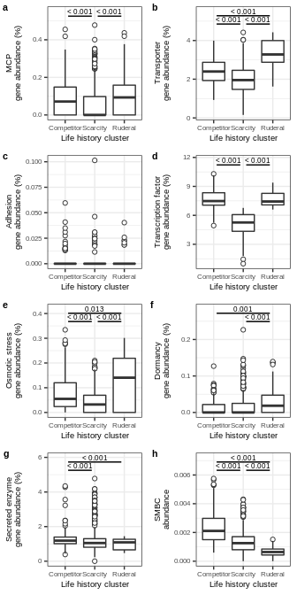<!-- -->

``` r
ggsave(Genome_LHS_feat.plot, filename = "/home/sam/FullCyc_metagenome/figs4publication/FigS11.tiff", 
       device = "tiff", width = 3.5, height = 7, units = "in")
```

# Session info

``` r
sessionInfo()
```

    ## R version 3.6.3 (2020-02-29)
    ## Platform: x86_64-pc-linux-gnu (64-bit)
    ## Running under: Ubuntu 18.04.4 LTS
    ## 
    ## Matrix products: default
    ## BLAS:   /usr/lib/x86_64-linux-gnu/blas/libblas.so.3.7.1
    ## LAPACK: /usr/lib/x86_64-linux-gnu/lapack/liblapack.so.3.7.1
    ## 
    ## locale:
    ##  [1] LC_CTYPE=en_US.UTF-8       LC_NUMERIC=C              
    ##  [3] LC_TIME=en_US.UTF-8        LC_COLLATE=en_US.UTF-8    
    ##  [5] LC_MONETARY=en_US.UTF-8    LC_MESSAGES=en_US.UTF-8   
    ##  [7] LC_PAPER=en_US.UTF-8       LC_NAME=C                 
    ##  [9] LC_ADDRESS=C               LC_TELEPHONE=C            
    ## [11] LC_MEASUREMENT=en_US.UTF-8 LC_IDENTIFICATION=C       
    ## 
    ## attached base packages:
    ## [1] stats4    grid      stats     graphics  grDevices utils     datasets 
    ## [8] methods   base     
    ## 
    ## other attached packages:
    ## [1] kableExtra_1.3.4  flexclust_1.4-1   modeltools_0.2-23 lattice_0.20-41  
    ## [5] ggplot2_3.3.0     dplyr_1.0.4      
    ## 
    ## loaded via a namespace (and not attached):
    ##  [1] Rcpp_1.0.4.6      highr_0.8         pillar_1.4.3      compiler_3.6.3   
    ##  [5] class_7.3-17      tools_3.6.3       dunn.test_1.3.5   digest_0.6.25    
    ##  [9] viridisLite_0.3.0 evaluate_0.14     lifecycle_1.0.1   tibble_3.0.0     
    ## [13] gtable_0.3.0      pkgconfig_2.0.3   rlang_0.4.10      rstudioapi_0.11  
    ## [17] cli_2.0.2         yaml_2.2.1        parallel_3.6.3    xfun_0.13        
    ## [21] xml2_1.3.2        httr_1.4.2        withr_2.1.2       stringr_1.4.0    
    ## [25] knitr_1.28        systemfonts_1.0.4 generics_0.1.0    vctrs_0.3.6      
    ## [29] cowplot_1.0.0     webshot_0.5.3     tidyselect_1.1.0  svglite_2.1.0    
    ## [33] glue_1.4.0        R6_2.4.1          fansi_0.4.1       rmarkdown_2.1    
    ## [37] farver_2.0.3      tidyr_1.0.2       purrr_0.3.3       magrittr_1.5     
    ## [41] scales_1.1.0      ellipsis_0.3.0    htmltools_0.4.0   rvest_1.0.2      
    ## [45] assertthat_0.2.1  colorspace_1.4-1  labeling_0.3      stringi_1.4.6    
    ## [49] munsell_0.5.0     crayon_1.3.4
